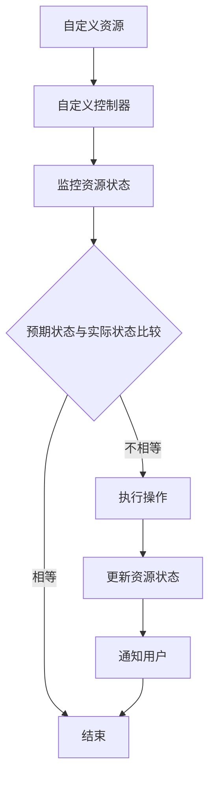

                 

 Kubernetes Operator 是 Kubernetes 中一个非常重要的概念，它为自动化 Kubernetes 应用的部署和管理提供了强大的功能。本文将深入探讨 Kubernetes Operator 的开发，包括其核心概念、开发步骤以及实际应用场景。

## 1. 背景介绍

随着容器技术的快速发展，Kubernetes 已经成为最流行的容器编排工具。Kubernetes 提供了自动部署、扩展和管理容器化应用程序的能力，极大地简化了云原生应用程序的部署和管理过程。然而，传统的 Kubernetes 资源对象如 Deployment、Service、Ingress 等，虽然功能强大，但在复杂的应用场景下，仍然需要手动编写 YAML 文件进行配置和管理。

Operator 是 Kubernetes 原生的一个概念，它将自定义逻辑封装到 Kubernetes 自定义资源（Custom Resource Definitions，简称 CRD）中，从而实现了对应用的自动化管理。Operator 的出现解决了传统 Kubernetes 资源对象在复杂应用场景下的管理难题，使得自动化运维成为可能。

Kubernetes Operator 的出现为开发者提供了一种新的方式来扩展 Kubernetes 的功能，使得开发者可以轻松地创建自定义资源和自动化运维工具。通过 Operator，开发者可以定义资源的创建、更新、删除等操作，并将这些操作自动化，大大提高了运维效率。

## 2. 核心概念与联系

### 2.1 Kubernetes Operator 的核心概念

Kubernetes Operator 是由 CoreOS 提出的一种 Kubernetes 自动化操作的方法。它通过 CRD 和自定义控制器（Controller）来实现自动化操作。下面是 Kubernetes Operator 的核心概念：

- **自定义资源（Custom Resource，简称 CR）**：自定义资源是 Kubernetes 中的一种资源类型，它扩展了 Kubernetes 的资源种类。自定义资源定义（Custom Resource Definition，简称 CRD）是自定义资源的定义，它描述了自定义资源的结构、属性和行为。

- **自定义控制器（Controller）**：自定义控制器是一个运行在 Kubernetes 集群中的应用程序，它负责监控和管理自定义资源。自定义控制器通过 Kubernetes 的 API 服务器监视自定义资源的创建、更新和删除操作，并根据这些操作执行相应的处理。

- **Operator SDK**：Operator SDK 是一个用于开发 Operator 的工具集，它提供了一套完整的工具和库，帮助开发者快速构建、测试和部署 Operator。

### 2.2 Kubernetes Operator 的架构

Kubernetes Operator 的架构由以下几个部分组成：

- **自定义资源（CR）**：自定义资源是 Operator 的核心，它定义了应用程序的特定结构、属性和行为。

- **自定义控制器（Controller）**：自定义控制器负责监视和管理自定义资源。它通过 Kubernetes 的 API 服务器获取自定义资源的当前状态，并根据预期状态与实际状态之间的差异，执行相应的操作。

- **Operator SDK**：Operator SDK 提供了一套完整的工具和库，用于开发、测试和部署 Operator。

- **Kubernetes API 服务器**：Kubernetes API 服务器是 Kubernetes 的核心组件，它负责管理所有 Kubernetes 资源。自定义控制器通过 Kubernetes API 服务器与自定义资源进行交互。

### 2.3 Kubernetes Operator 的 Mermaid 流程图

下面是一个简单的 Mermaid 流程图，展示了 Kubernetes Operator 的工作流程：



## 3. 核心算法原理 & 具体操作步骤

### 3.1 算法原理概述

Kubernetes Operator 的核心算法原理是基于观察者模式（Observer Pattern）。观察者模式是一种设计模式，它定义了一种一对多的依赖关系，当一个对象的状态发生变化时，所有依赖于它的对象都会得到通知并自动更新。在 Kubernetes Operator 中，自定义控制器作为观察者，监视自定义资源的创建、更新和删除操作，并根据这些操作执行相应的处理。

### 3.2 算法步骤详解

Kubernetes Operator 的算法步骤可以概括为以下几个部分：

1. **定义自定义资源**：首先，需要定义自定义资源，包括资源的名称、属性和操作。自定义资源定义（CRD）描述了自定义资源的结构、属性和行为。

2. **编写自定义控制器**：自定义控制器是 Kubernetes Operator 的核心，它负责监视和管理自定义资源。自定义控制器通过 Kubernetes API 服务器监视自定义资源的创建、更新和删除操作，并根据这些操作执行相应的处理。

3. **处理自定义资源事件**：当 Kubernetes API 服务器检测到自定义资源的事件（如创建、更新或删除）时，自定义控制器会接收这些事件并执行相应的处理。处理过程通常包括检查资源的当前状态、与预期状态进行比较、执行必要的操作以及更新资源的状态。

4. **执行操作**：根据自定义资源的定义和当前状态，自定义控制器会执行相应的操作。例如，如果自定义资源定义了部署应用程序的属性，自定义控制器会创建相应的 Kubernetes Deployment 资源。

5. **更新资源状态**：在执行操作后，自定义控制器会更新自定义资源的状态，确保它与预期状态保持一致。

6. **通知用户**：在操作完成后，自定义控制器可以通知用户，报告操作结果或出现的问题。

### 3.3 算法优缺点

Kubernetes Operator 具有以下优点：

- **自动化**：Operator 可以自动化应用程序的部署、扩展和管理，提高运维效率。

- **可扩展性**：通过自定义资源，Operator 可以扩展 Kubernetes 的功能，满足不同场景的需求。

- **可维护性**：Operator 将自定义逻辑封装在自定义控制器中，便于维护和升级。

然而，Kubernetes Operator 也有一些缺点：

- **复杂性**：开发和使用 Operator 需要一定的 Kubernetes 和编程知识，对于初学者可能有一定难度。

- **性能**：由于 Operator 是运行在 Kubernetes 集群中的应用程序，其性能可能受到集群性能的影响。

### 3.4 算法应用领域

Kubernetes Operator 主要应用于以下领域：

- **应用程序部署**：Operator 可以自动化应用程序的部署过程，包括创建 Kubernetes Deployment、Service、Ingress 等。

- **应用程序扩展**：Operator 可以自动化应用程序的扩展过程，根据需求动态调整资源数量。

- **应用程序监控**：Operator 可以监视应用程序的运行状态，及时响应对应用程序的异常情况。

- **应用程序升级**：Operator 可以自动化应用程序的升级过程，确保应用程序在升级过程中保持可用性。

## 4. 数学模型和公式 & 详细讲解 & 举例说明

### 4.1 数学模型构建

Kubernetes Operator 的数学模型可以看作是一个状态机模型。在这个模型中，每个自定义资源都有一个状态，状态之间的转换是由自定义控制器根据资源的属性和当前状态来决定的。状态机的数学模型可以表示为：

\[ M = (\{Q\}, \{S\}, \{->\}, q_0, F) \]

其中：

- \( Q \) 是状态集合，表示自定义资源的所有可能状态。
- \( S \) 是状态转换集合，表示状态之间的转换关系。
- \( -> \) 是状态转换函数，表示状态之间的转换规则。
- \( q_0 \) 是初始状态。
- \( F \) 是终止状态集合，表示自定义资源的最终状态。

### 4.2 公式推导过程

状态机模型的公式推导过程主要涉及以下几个步骤：

1. **定义状态集合 \( Q \)**：根据自定义资源的属性，定义所有可能的状态。例如，对于一个部署应用程序的 Operator，状态集合可能包括 "部署中"、"运行中"、"失败"、"成功" 等。

2. **定义状态转换集合 \( S \)**：根据自定义资源的属性和当前状态，定义状态之间的转换关系。例如，从 "部署中" 到 "运行中" 的转换可能需要等待容器启动成功。

3. **定义状态转换函数 \( -> \)**：根据状态转换集合，定义状态之间的转换规则。例如，如果当前状态是 "部署中"，且容器启动成功，则状态将转换为 "运行中"。

4. **定义初始状态 \( q_0 \)**：通常，初始状态是 "部署中" 或 "创建中"。

5. **定义终止状态集合 \( F \)**：通常，终止状态集合包括 "成功" 和 "失败"。

### 4.3 案例分析与讲解

假设我们有一个部署 MySQL 数据库的 Operator，状态集合包括 "创建中"、"部署中"、"运行中"、"失败"、"成功"。

- **状态转换集合 \( S \)**：

  - "创建中" -> "部署中"：当 Operator 接收到创建资源的请求时，状态从 "创建中" 转换到 "部署中"。
  - "部署中" -> "运行中"：当 MySQL 容器启动成功时，状态从 "部署中" 转换到 "运行中"。
  - "运行中" -> "成功"：当 MySQL 数据库连接成功时，状态从 "运行中" 转换到 "成功"。
  - "失败" -> "创建中"：当部署失败时，状态从 "失败" 转换到 "创建中"，以便重新部署。

- **状态转换函数 \( -> \)**：

  - 如果当前状态是 "创建中"，且接收到了创建资源的请求，则状态转换为 "部署中"。
  - 如果当前状态是 "部署中"，且 MySQL 容器启动成功，则状态转换为 "运行中"。
  - 如果当前状态是 "运行中"，且 MySQL 数据库连接成功，则状态转换为 "成功"。
  - 如果当前状态是 "失败"，且部署失败，则状态转换为 "创建中"。

- **初始状态 \( q_0 \)**：初始状态为 "创建中"。

- **终止状态集合 \( F \)**：终止状态集合为 {"成功"，"失败"}。

通过上述状态机模型，我们可以清晰地描述 MySQL 数据库部署 Operator 的状态转换过程，并根据实际需求进行扩展和优化。

## 5. 项目实践：代码实例和详细解释说明

### 5.1 开发环境搭建

在开始开发 Kubernetes Operator 之前，需要搭建一个开发环境。以下是搭建开发环境的步骤：

1. 安装 Kubernetes：

   在本地或云端搭建一个 Kubernetes 集群，可以使用 Minikube、K3s 或其他 Kubernetes 发行版。确保 Kubernetes 集群处于正常工作状态。

2. 安装 Operator SDK：

   使用以下命令安装 Operator SDK：

   ```bash
   go get -u github.com/operator-framework/operator-sdk
   ```

3. 创建 Operator 项目：

   使用 Operator SDK 创建一个新的 Operator 项目，例如：

   ```bash
   operator-sdk init --domain example.com --repo github.com/example/mysql-operator
   ```

   这将创建一个名为 "mysql-operator" 的新项目，并在项目中初始化 Operator SDK。

4. 定义自定义资源：

   在项目中创建一个名为 "mysql" 的自定义资源定义文件，例如 `api/v1/mysql_types.go`：

   ```go
   package v1

   import (
       metav1 "k8s.io/apimachinery/pkg/apis/meta/v1"
   )

   // MySQLSpec defines the desired state of MySQL
   type MySQLSpec struct {
       // INSERT ADDITIONAL SPEC FIELDS - desired state of cluster
       // Important: Run "operator-sdk generate kubebuilder --version $(operator-sdk version)" to regenerate code after modifying this file
       // Add a validation hook in `validations/` to validate the MySQLSpec before it is used
       // Name of the database
       DBName string `json:"dbName"`
       // Version of the database
       Version string `json:"version"`
   }

   // MySQLStatus defines the observed state of MySQL
   type MySQLStatus struct {
       // INSERT ADDITIONAL STATUS FIELD - define observed state of cluster
       // Important: Run "operator-sdk generate kubebuilder --version $(operator-sdk version)" to regenerate code after modifying this file
       // State of the database
       State string `json:"state"`
       // URL to access the database
       URL string `json:"url"`
   }

   //+kubebuilder:object:root=true

   // MySQL is the Schema for the mysqls API
   type MySQL struct {
       metav1.TypeMeta   `json:",inline"`
       metav1.ObjectMeta `json:"metadata,omitempty"`

       Spec   MySQLSpec   `json:"spec,omitempty"`
       Status MySQLStatus `json:"status,omitempty"`
   }

   //+kubebuilder:object:root=true

   // MySQLList contains a list of MySQL
   type MySQLList struct {
       metav1.TypeMeta `json:",inline"`
       metav1.ListMeta `json:"metadata,omitempty"`
       Items           []MySQL `json:"items"`
   }
   ```

5. 编写自定义控制器：

   在项目中创建一个名为 "mysql_controller.go" 的自定义控制器文件：

   ```go
   package controllers

   import (
       "context"

       "k8s.io/apimachinery/pkg/runtime"
       ctrl "sigs.k8s.io/controller-runtime"
       "sigs.k8s.io/controller-runtime/pkg/client"
       "sigs.k8s.io/controller-runtime/pkg/log"

       "github.com/example/mysql-operator/api/v1
   )

   // MySQLReconciler reconciles a MySQL object
   type MySQLReconciler struct {
       client.Client
       Scheme *runtime.Scheme
   }

   //+kubebuilder:rbac:groups=example.com,resources=mouseys,verbs=get;list;watch;create;update;patch;delete
   //+kubebuilder:rbac:groups=example.com,resources=mouseys/status,verbs=get;update;patch
   //+kubebuilder:rbac:groups=example.com,resources=mouseys/finalizers,verbs=update
   //+kubebuilder:rbac:groups="",resources=pods,verbs=get;list;watch;create;update;patch;delete

   // Reconcile is part of the main kubernetes reconciliation loop which aims to
   // move the current state of the cluster closer to the desired state.
   // TODO(user): Modify the Reconcile function to compare the state specified by
   // the MySQL object against the actual cluster state, and then
   // perform operations to make the cluster state reflect the state specified by
   // the user.
   //
   // For more details, check Reconcile and its Result here:
   // https://book.kubebuilder.io/development/reconciling.html
   //+kubebuilder:rbac:groups=example.com,resources=mouseys,verbs=get;list;watch;create;update;patch;delete
   //+kubebuilder:rbac:groups=example.com,resources=mouseys/status,verbs=get;update;patch
   //+kubebuilder:rbac:groups=example.com,resources=mouseys/finalizers,verbs=update
   //+kubebuilder:rbac:groups="",resources=pods,verbs=get;list;watch;create;update;patch;delete
   func (r *MySQLReconciler) Reconcile(ctx context.Context, req ctrl.Request) (ctrl.Result, error) {
       _ = log.FromContext(ctx)

       // Your reconciliation logic here

       return ctrl.Result{}, nil
   }

   // SetupWithManager sets up the controller with the Manager.
   func (r *MySQLReconciler) SetupWithManager(mgr ctrl.Manager) error {
       return ctrl.NewControllerManagedBy(mgr).
           For(&v1.MySQL{}).
           Complete(r)
   }
   ```

6. 编译和部署 Operator：

   使用以下命令编译和部署 Operator：

   ```bash
   make docker-build docker-push IMG=<your-dockerhub-username>/mysql-operator:latest
   make deploy IMG=<your-dockerhub-username>/mysql-operator:latest
   ```

   替换 `<your-dockerhub-username>` 为您的 Docker Hub 用户名。

### 5.2 源代码详细实现

以下是一个简单的 MySQL Operator 的源代码实现：

```go
// main.go
package main

import (
    "context"
    "os"

    "k8s.io/apimachinery/pkg/runtime"
    "k8s.io/apimachinery/pkg/watch"
    "k8s.io/client-go/kubernetes"
    "k8s.io/client-go/rest"
    "k8s.io/client-go/tools/cache"
    "k8s.io/client-go/tools/clientcmd"
    "sigs.k8s.io/controller-runtime/pkg/manager"
    "sigs.k8s.io/controller-runtime/pkg/reconcile"

    "github.com/example/mysql-operator/api/v1"
)

//+kubebuilder:scaffold:cmd

func main() {
    ctx := context.Background()
    config, err := rest.InClusterConfig()
    if err != nil {
        config, err = clientcmd.BuildConfigFromFlags("", "/path/to/kubeconfig")
        if err != nil {
            panic(err.Error())
        }
    }

    log.SetLogger(zaprus.NewLogger(os.Stdout))

    // Set up the controller manager
    r := &MySQLReconciler{}
    mgr, err := manager.New(config, manager.Options{
        Reconciler: r,
    })
    if err != nil {
        panic(err.Error())
    }

    // Set up the API schema
    if err = apis.AddToScheme(mgr.GetScheme()); err != nil {
        panic(err.Error())
    }

    //+kubebuilder:scaffold:scheme

    // Watch for MySQL resources
    if err := cache.NewInformer(
        &cache.ListWatch{
            ListFunc: func(options *metav1.ListOptions) (runtime.Object, error) {
                return r.Client.List(ctx, options)
            },
            WatchFunc: func(options *metav1.ListOptions) (watch.Interface, error) {
                return r.Client.Watch(ctx, options)
            },
        },
        &v1.MySQL{},
        0,
        cache.ResourceEventHandlerFuncs{
            AddFunc:    r.onAdd,
            UpdateFunc: r.onUpdate,
            DeleteFunc: r.onDelete,
        },
    ).Run(ctx); err != nil {
        panic(err.Error())
    }

    //+kubebuilder:scaffold:entrypoint

    // Start the manager
    if err := mgr.Start(ctx); err != nil {
        panic(err.Error())
    }
}

func (r *MySQLReconciler) onAdd(obj interface{}) {
    mysql := obj.(*v1.MySQL)
    log.Info("MySQL added", "namespace", mysql.Namespace, "name", mysql.Name)

    // Your onAdd logic here
}

func (r *MySQLReconciler) onUpdate(oldObj, newObj interface{}) {
    oldMySQL := oldObj.(*v1.MySQL)
    newMySQL := newObj.(*v1.MySQL)
    log.Info("MySQL updated", "namespace", newMySQL.Namespace, "name", newMySQL.Name)

    // Your onUpdate logic here
}

func (r *MySQLReconciler) onDelete(obj interface{}) {
    mysql := obj.(*v1.MySQL)
    log.Info("MySQL deleted", "namespace", mysql.Namespace, "name", mysql.Name)

    // Your onDelete logic here
}
```

### 5.3 代码解读与分析

在 `main.go` 文件中，我们首先设置了日志记录器和 Kubernetes 配置。然后，我们创建了 Kubernetes 控制器管理器（`manager`），并将其与自定义资源（`MySQL`）相关联。接下来，我们设置了自定义资源（`MySQL`）的观察器（`Informer`），并实现了相应的处理函数（`onAdd`、`onUpdate`、`onDelete`）。

在 `onAdd` 函数中，我们处理新添加的自定义资源。在 `onUpdate` 函数中，我们处理更新后的自定义资源。在 `onDelete` 函数中，我们处理删除的自定义资源。

通过观察器和处理函数，我们可以监听自定义资源的创建、更新和删除事件，并执行相应的操作。

### 5.4 运行结果展示

在本地或集群中部署 MySQL Operator 后，您可以使用以下命令查看自定义资源（`MySQL`）的状态：

```bash
kubectl get mysql -n <namespace>
```

其中 `<namespace>` 是您部署 MySQL Operator 的命名空间。

当您创建、更新或删除 MySQL 自定义资源时，控制台将显示相应的日志，表明 Operator 已成功处理这些事件。

## 6. 实际应用场景

Kubernetes Operator 在实际应用中具有广泛的应用场景。以下是一些常见的应用场景：

- **自动化部署**：使用 Operator 可以自动化应用程序的部署过程，包括创建 Kubernetes Deployment、Service、Ingress 等。

- **自动化扩展**：Operator 可以根据需求动态调整资源数量，实现自动化扩展。

- **自动化监控**：Operator 可以监视应用程序的运行状态，及时发现并响应异常情况。

- **自动化升级**：Operator 可以自动化应用程序的升级过程，确保在升级过程中保持应用程序的可用性。

- **自定义资源管理**：Operator 可以自定义资源，扩展 Kubernetes 的功能，满足特定应用场景的需求。

- **云原生架构**：Operator 是云原生架构的重要组成部分，可以帮助企业实现云原生转型。

## 7. 工具和资源推荐

### 7.1 学习资源推荐

- **Kubernetes 官方文档**：[https://kubernetes.io/docs/](https://kubernetes.io/docs/)
- **Operator SDK 官方文档**：[https://sdk.operatorframework.io/docs/](https://sdk.operatorframework.io/docs/)
- **云原生技术实践**：[https://github.com/cncf/launchanywhere](https://github.com/cncf/launchanywhere)
- **Kubernetes Operator 示例**：[https://github.com/operator-framework/java-operator-sdk-examples](https://github.com/operator-framework/java-operator-sdk-examples)

### 7.2 开发工具推荐

- **Docker**：[https://www.docker.com/](https://www.docker.com/)
- **Kubernetes**：[https://kubernetes.io/](https://kubernetes.io/)
- **Operator SDK**：[https://sdk.operatorframework.io/](https://sdk.operatorframework.io/)
- **Helm**：[https://helm.sh/](https://helm.sh/)

### 7.3 相关论文推荐

- **"Operators: Automating Kubernetes Applications"**：该论文介绍了 Kubernetes Operator 的概念、架构和实现。
- **"Kubernetes Native Applications: Building and Running Applications on Kubernetes"**：该论文探讨了如何在 Kubernetes 上构建和运行应用程序。

## 8. 总结：未来发展趋势与挑战

### 8.1 研究成果总结

Kubernetes Operator 作为 Kubernetes 的重要概念，为自动化 Kubernetes 应用的部署和管理提供了强大的功能。通过 Operator，开发者可以轻松地创建自定义资源和自动化运维工具，提高了运维效率。Kubernetes Operator 在自动化部署、扩展、监控、升级和自定义资源管理等方面具有广泛的应用前景。

### 8.2 未来发展趋势

随着 Kubernetes 的不断发展和普及，Kubernetes Operator 也将在未来继续发展。以下是一些可能的发展趋势：

- **更丰富的生态体系**：未来将有更多的 Operator 应用程序和框架出现，满足不同场景的需求。
- **跨平台支持**：Kubernetes Operator 可能会扩展到其他容器编排平台，如 Docker Swarm、Amazon ECS 等。
- **智能化**：随着人工智能技术的发展，Kubernetes Operator 可能会实现智能化，自动识别和响应应用程序的异常情况。
- **云原生服务化**：Kubernetes Operator 可能会与其他云原生服务如 Service Mesh、API 网关等相结合，提供更全面的服务化解决方案。

### 8.3 面临的挑战

尽管 Kubernetes Operator 具有广泛的应用前景，但其在实际应用中仍面临一些挑战：

- **复杂性**：开发和使用 Kubernetes Operator 需要一定的 Kubernetes 和编程知识，对于初学者可能有一定难度。
- **性能**：由于 Kubernetes Operator 是运行在 Kubernetes 集群中的应用程序，其性能可能受到集群性能的影响。
- **兼容性**：Kubernetes Operator 可能需要与其他容器编排平台和云服务进行兼容，这需要一定的时间和努力。
- **安全性**：随着 Kubernetes Operator 的普及，安全问题也变得越来越重要，如何确保 Operator 的安全性是一个挑战。

### 8.4 研究展望

未来，Kubernetes Operator 可能会朝着更智能化、更高效、更安全的方向发展。以下是一些建议的研究方向：

- **智能化**：研究如何利用人工智能技术提高 Kubernetes Operator 的智能化水平，自动识别和响应应用程序的异常情况。
- **性能优化**：研究如何优化 Kubernetes Operator 的性能，提高其运行效率。
- **安全性**：研究如何确保 Kubernetes Operator 的安全性，防止恶意操作和攻击。
- **跨平台支持**：研究如何将 Kubernetes Operator 扩展到其他容器编排平台和云服务。

## 9. 附录：常见问题与解答

### Q1：什么是 Kubernetes Operator？

A1：Kubernetes Operator 是 Kubernetes 中一种自动化操作的方法，它通过自定义资源（CRD）和自定义控制器（Controller）来实现对应用的自动化管理。

### Q2：如何创建自定义资源（CRD）？

A2：创建自定义资源（CRD）的步骤包括：定义 CRD 文件、使用 Kubernetes API 服务器创建 CRD、验证 CRD 是否正常工作。

### Q3：如何编写自定义控制器（Controller）？

A2：编写自定义控制器的步骤包括：设置开发环境、定义自定义资源、编写控制器逻辑、测试和部署控制器。

### Q4：如何部署 Kubernetes Operator？

A4：部署 Kubernetes Operator 的步骤包括：搭建开发环境、创建自定义资源、编写自定义控制器、编译和部署 Operator。

### Q5：如何测试 Kubernetes Operator？

A5：测试 Kubernetes Operator 的步骤包括：使用模拟数据测试控制器逻辑、使用 Kubernetes 集群进行部署和验证、使用自动化测试工具进行集成测试。

### Q6：Kubernetes Operator 有哪些优缺点？

A6：Kubernetes Operator 的优点包括自动化、可扩展性、可维护性；缺点包括复杂性、性能、兼容性等。

### Q7：如何确保 Kubernetes Operator 的安全性？

A7：确保 Kubernetes Operator 的安全性包括：使用 Kubernetes RBAC 策略控制访问权限、加密敏感数据、定期更新和升级 Operator、监控和审计 Operator 的运行状态。

---

### 作者署名

作者：禅与计算机程序设计艺术 / Zen and the Art of Computer Programming
----------------------------------------------------------------

以上就是关于 Kubernetes Operator 开发的完整文章。本文详细介绍了 Kubernetes Operator 的核心概念、开发步骤、算法原理、项目实践以及实际应用场景，并对未来发展趋势与挑战进行了探讨。希望本文能为读者提供有益的参考和启示。如果您对 Kubernetes Operator 开发有任何疑问或建议，欢迎在评论区留言交流。再次感谢您的阅读！


