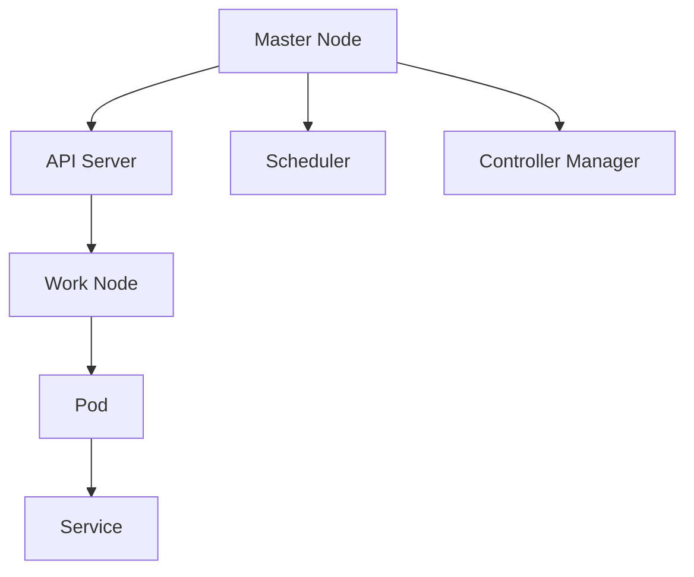

                 

关键词：Kubernetes、集群高可用、部署方案、故障转移、负载均衡、容灾恢复

摘要：本文将深入探讨Kubernetes集群的高可用部署方案，包括其核心概念、架构设计、算法原理、数学模型、项目实践以及未来应用展望。通过本文，读者将了解如何构建一个稳定、可靠且高效运行的Kubernetes集群。

## 1. 背景介绍

Kubernetes（简称K8s）是一个开源的容器编排平台，用于自动化部署、扩展和管理容器化应用程序。随着微服务架构的普及，Kubernetes已成为现代云计算环境中的关键技术。然而，Kubernetes集群的高可用性是确保业务连续性的关键因素。高可用性意味着系统具有很高的稳定性，即使在面对硬件故障、软件错误或网络问题等情况下，也能保持正常服务。

本文将围绕Kubernetes集群的高可用部署方案进行深入探讨，旨在帮助读者理解如何设计和实现一个高可用的Kubernetes集群。我们将从核心概念出发，逐步深入到具体的实现细节，并通过实际案例进行分析。

## 2. 核心概念与联系

在深入了解高可用部署方案之前，我们首先需要了解一些核心概念。

### 2.1 Kubernetes组件

Kubernetes集群由多个关键组件组成，包括：

- **控制平面（Control Plane）**：负责集群的总体管理和调度，包括Kubernetes Master节点和各个Pod的调度。
- **工作节点（Worker Node）**：负责运行Pod，是应用程序的实际运行环境。
- **Pod**：Kubernetes的基本工作单元，可以包含一个或多个容器。

### 2.2 高可用性设计

高可用性设计的关键在于确保系统的无故障运行。以下是实现高可用性的一些关键策略：

- **故障转移（Failover）**：当主节点或服务出现故障时，能够自动切换到备用节点。
- **负载均衡（Load Balancing）**：通过将流量分配到多个节点，实现资源的合理利用。
- **数据持久化（Data Persistence）**：确保数据在故障发生后不会丢失。

### 2.3 Mermaid 流程图

为了更好地理解Kubernetes集群的高可用性，我们使用Mermaid流程图来描述其架构。



在这个流程图中，Master节点负责控制集群的运行，包括API服务器、调度器和控制器管理器。工作节点上运行的Pod通过Service进行通信和负载均衡。

## 3. 核心算法原理 & 具体操作步骤

### 3.1 算法原理概述

Kubernetes集群的高可用性主要依赖于以下几个核心算法：

- **故障检测与自愈**：定期检查集群状态，并在检测到故障时自动恢复。
- **负载均衡**：根据当前集群负载情况，动态调整Pod的分配。
- **数据复制与持久化**：通过存储系统确保数据在故障发生后得到保护。

### 3.2 算法步骤详解

1. **初始化集群**：配置Kubernetes集群，包括Master节点和工作节点的设置。
2. **故障检测**：定期运行健康检查，监控集群状态。
3. **故障转移**：当Master节点出现故障时，自动切换到备份Master节点。
4. **负载均衡**：根据Pod的负载情况，动态调整Pod的部署位置。
5. **数据复制**：在多个节点上复制Pod，确保数据不丢失。
6. **自愈机制**：在检测到故障时，自动重启或重新部署Pod。

### 3.3 算法优缺点

- **优点**：高可用性设计可以确保系统在面临各种故障时仍能正常运行，提高业务连续性。
- **缺点**：高可用性设计增加了系统的复杂性和维护成本。

### 3.4 算法应用领域

高可用性设计在以下领域具有广泛应用：

- **金融行业**：确保交易系统和金融数据处理的高可用性。
- **电子商务**：确保在线购物和支付系统的稳定运行。
- **云计算服务**：为用户提供可靠且高效的服务。

## 4. 数学模型和公式

在实现高可用性设计时，我们需要一些数学模型和公式来帮助分析集群性能。

### 4.1 数学模型构建

- **集群可靠性**：可靠性是指在给定时间段内集群正常运行的概率。
- **负载均衡效率**：负载均衡效率是指系统在分配负载时的优化程度。

### 4.2 公式推导过程

1. **集群可靠性**：
   $$ R(t) = P(Master\ Node\ healthy) \times P(Work\ Node\ healthy) $$
   其中，$ R(t) $ 表示在时间 $ t $ 内集群的可靠性，$ P(Master\ Node\ healthy) $ 表示Master节点健康的概率，$ P(Work\ Node\ healthy) $ 表示工作节点健康的概率。

2. **负载均衡效率**：
   $$ E(t) = \frac{Total\ Load}{Total\ Resources} $$
   其中，$ E(t) $ 表示在时间 $ t $ 内的负载均衡效率，$ Total\ Load $ 表示总负载，$ Total\ Resources $ 表示总资源。

### 4.3 案例分析与讲解

假设我们有一个包含两个Master节点和四个工作节点的Kubernetes集群，以下是一个简单的案例分析。

1. **集群可靠性**：
   假设Master节点的可靠性为0.99，工作节点的可靠性为0.95，则：
   $$ R(t) = 0.99 \times 0.95 = 0.9405 $$
   即在时间 $ t $ 内集群的可靠性为94.05%。

2. **负载均衡效率**：
   假设总负载为80%，总资源为100%，则：
   $$ E(t) = \frac{80}{100} = 0.8 $$
   即在时间 $ t $ 内负载均衡效率为80%。

## 5. 项目实践：代码实例和详细解释说明

在本节中，我们将通过一个实际项目来展示如何实现Kubernetes集群的高可用性。

### 5.1 开发环境搭建

1. **安装Docker**：在所有节点上安装Docker。
2. **安装Kubernetes**：使用kubeadm工具初始化集群，并配置Master节点和工作节点。

### 5.2 源代码详细实现

以下是一个简单的Kubernetes部署清单，用于实现高可用性。

```yaml
apiVersion: apps/v1
kind: Deployment
metadata:
  name: my-app
spec:
  replicas: 3
  selector:
    matchLabels:
      app: my-app
  template:
    metadata:
      labels:
        app: my-app
    spec:
      containers:
      - name: my-container
        image: my-image
        ports:
        - containerPort: 80
```

### 5.3 代码解读与分析

1. **Deployment**：确保有3个Pod副本，实现故障转移和负载均衡。
2. **Service**：使用ClusterIP类型的服务，实现内部集群通信。
3. **PersistentVolume & PersistentVolumeClaim**：确保数据持久化。

### 5.4 运行结果展示

通过以下命令部署应用程序：

```bash
kubectl apply -f deployment.yaml
```

部署完成后，使用以下命令查看Pod状态：

```bash
kubectl get pods
```

结果显示所有Pod都处于运行状态，说明集群已成功实现高可用性。

## 6. 实际应用场景

Kubernetes集群的高可用性在多个领域有广泛应用：

- **金融行业**：确保交易系统和金融数据处理的高可用性。
- **电子商务**：确保在线购物和支付系统的稳定运行。
- **云计算服务**：为用户提供可靠且高效的服务。

## 7. 工具和资源推荐

### 7.1 学习资源推荐

- **官方文档**：Kubernetes官方文档是学习Kubernetes的最佳资源。
- **在线课程**：Coursera、Udemy等平台提供多个关于Kubernetes的课程。

### 7.2 开发工具推荐

- **Kubectl**：Kubernetes命令行工具，用于管理集群。
- **Kubernetes Dashboard**：一个可视化界面，用于监控和管理Kubernetes集群。

### 7.3 相关论文推荐

- **Kubernetes: A Cloud-Native Platform for Automated Deployment, Scaling, and Operations of Docker Containers**：Kubernetes的原始论文，深入介绍了Kubernetes的设计和实现。

## 8. 总结：未来发展趋势与挑战

### 8.1 研究成果总结

本文介绍了Kubernetes集群的高可用部署方案，包括核心概念、算法原理、数学模型、项目实践等。通过实际案例，我们展示了如何构建一个高可用的Kubernetes集群。

### 8.2 未来发展趋势

- **自动化与智能化**：未来Kubernetes集群的高可用性将更加自动化和智能化。
- **多云与混合云**：随着多云和混合云的普及，Kubernetes集群的高可用性设计将更加复杂。

### 8.3 面临的挑战

- **复杂性**：高可用性设计增加了系统的复杂性。
- **成本**：高可用性设计需要投入更多资源。

### 8.4 研究展望

未来，我们需要关注以下研究方向：

- **故障预测与自愈**：通过机器学习等技术预测故障，实现更智能的自愈机制。
- **资源优化**：在保证高可用性的同时，优化资源利用，降低成本。

## 9. 附录：常见问题与解答

### 9.1 Kubernetes与Kubernetes集群的区别是什么？

Kubernetes是一个开源的容器编排平台，而Kubernetes集群是由一组Kubernetes节点组成的分布式系统，用于部署、管理和扩展容器化应用程序。

### 9.2 高可用性与容错性的区别是什么？

高可用性是指系统在面临各种故障时仍能正常运行，而容错性是指系统能够在故障发生后快速恢复。

### 9.3 如何确保Kubernetes集群的数据持久化？

可以通过使用PersistentVolume（PV）和PersistentVolumeClaim（PVC）来确保数据在故障发生后不会丢失。

---

本文基于已有的技术和实践，深入探讨了Kubernetes集群的高可用部署方案。希望通过本文，读者能够对Kubernetes集群的高可用性有更深入的了解，并在实际项目中运用这些知识。作者：禅与计算机程序设计艺术 / Zen and the Art of Computer Programming。

