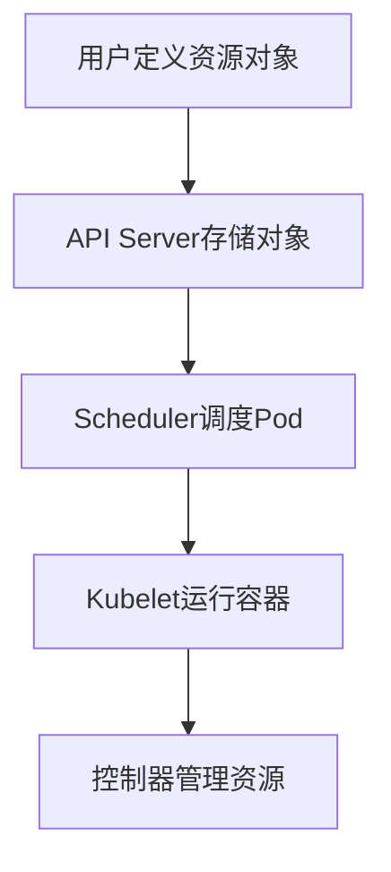

                 

关键词：Kubernetes，容器编排，容器管理，微服务架构，容器平台，云计算，Docker，集群管理，故障恢复，资源调度，自动化运维。

## 摘要

本文将深入探讨Kubernetes（简称K8s）在现代容器编排和管理工作中的核心作用。Kubernetes是一个开源的容器编排系统，它使得容器化应用程序的部署、扩展和管理变得简单而高效。本文将详细介绍Kubernetes的核心概念、架构、工作原理以及其实际应用。通过本文，读者将了解到如何利用Kubernetes实现高效的容器管理，以及如何应对容器化应用程序面临的各种挑战。

## 1. 背景介绍

容器技术的兴起，特别是Docker的广泛应用，使得应用程序的开发和部署变得更加灵活和高效。然而，随着容器数量的增加和复杂性的提升，容器管理的挑战也逐渐显现出来。为了解决这个问题，谷歌在2014年设计并开源了Kubernetes，旨在提供一个强大的平台来简化容器的部署、扩展和管理。

Kubernetes的发展历程可以追溯到谷歌内部使用的Borg系统，Borg是谷歌用来管理大规模集群的分布式系统。Kubernetes借鉴了Borg的设计理念，并在其基础上进行了大量的改进和优化，最终形成了一个功能丰富、易于使用的容器编排平台。

自2014年发布以来，Kubernetes已经迅速成为容器编排领域的领导者。它的开源性质和强大的社区支持，使得Kubernetes获得了广泛的应用和认可。如今，许多企业都在使用Kubernetes来管理他们的容器化应用程序，无论是在公有云、私有云还是混合云环境中。

## 2. 核心概念与联系

### 2.1 核心概念

#### 容器

容器是一种轻量级、可执行的软件包，它包含应用程序运行所需的代码、运行库、环境变量和配置文件。容器通过操作系统级别的虚拟化技术（如cgroup和namespaces）来实现，从而实现应用程序与宿主机的隔离。

#### Kubernetes

Kubernetes是一个开源的容器编排系统，它允许用户自动化容器化应用程序的部署、扩展和管理。Kubernetes通过一系列的API对象来管理容器，如Pod、Service、Deployments、StatefulSets等。

#### Pod

Pod是Kubernetes中的最小部署单元，一个Pod可以包含一个或多个容器。Pod负责容器之间的资源共享和生命周期管理。

#### Service

Service是一个抽象层，它定义了如何访问Pod。Service通过IP地址和端口号将Pod进行映射，使得外部系统能够访问到Pod。

#### Deployment

Deployment用于创建和管理Pod的副本集，它可以确保Pod的期望数量始终得到满足。Deployment还支持滚动更新和回滚操作。

#### StatefulSet

StatefulSet是用于管理有状态应用程序的，它为Pod提供了稳定的网络标识和存储卷。

### 2.2 Kubernetes架构

Kubernetes集群由一组节点（Node）和一系列控制平面组件构成。每个节点都是一个运行着Kubernetes守护进程的物理或虚拟机。控制平面组件包括：

#### Kubernetes Master

- **API Server**：接收用户和集群的请求，提供集群的统一接口。
- **etcd**：存储集群所有的配置信息，如API对象的状态。
- **Scheduler**：负责将Pod调度到合适的节点上。
- **Controller Manager**：管理集群中的各种资源对象，如Pod、Service、Deployment等。

#### Kubernetes Node

- **Kubelet**：在每个节点上运行，负责与Master通信，确保Pod容器按期望状态运行。
- **Kube-Proxy**：在每个节点上运行，负责服务代理和集群内部网络通信。

### 2.3 Kubernetes工作原理

Kubernetes通过一系列的控制环路来确保集群中的资源状态与用户定义的期望状态一致。以下是Kubernetes工作原理的核心步骤：

1. **用户定义资源对象**：用户通过Kubernetes API创建各种资源对象，如Pod、Service、Deployment等。
2. **API Server存储对象**：API Server接收用户创建的资源对象请求，并将这些对象存储在etcd中。
3. **Scheduler调度Pod**：Scheduler根据节点的资源状况和策略，选择一个合适的节点来调度Pod。
4. **Kubelet运行容器**：Kubelet在所选节点上启动容器，并确保容器按预期运行。
5. **控制器管理资源**：Controller Manager监控资源对象的实际状态，并与期望状态进行比较，必要时采取措施进行调整。

### 2.4 Mermaid流程图



## 3. 核心算法原理 & 具体操作步骤

### 3.1 算法原理概述

Kubernetes的调度算法是基于一系列的评估指标来选择最合适的节点来运行Pod。主要的评估指标包括：

- 节点的资源利用率：如CPU、内存、存储和带宽。
- 节点的状态：如是否处于不可调度状态。
- 容器的亲和性：如容器对节点或其他容器的偏好。
- 节点的污点和容忍度：如节点上是否存在某些污点，容器是否能够容忍这些污点。

调度算法通过计算每个节点的分数，选择分数最高的节点来运行Pod。

### 3.2 算法步骤详解

1. **初始化**：读取节点信息和Pod请求。
2. **计算节点分数**：对每个节点计算分数，包括资源利用率、状态、亲和性、污点和容忍度等。
3. **选择节点**：从所有节点中选择分数最高的节点。
4. **调度Pod**：将Pod调度到所选节点上，并更新状态。

### 3.3 算法优缺点

**优点**：

- 高效：调度算法能够快速地选择合适的节点，减少调度时间。
- 可扩展：算法可以处理大规模集群的调度需求。
- 智能：算法可以根据各种指标进行智能调度。

**缺点**：

- 复杂：调度算法涉及多个复杂的评估指标，实现和维护较为困难。
- 偏执：在某些情况下，算法可能会选择不理想的节点。

### 3.4 算法应用领域

调度算法广泛应用于容器化应用程序的部署和管理，尤其是在大规模集群中。它可以帮助企业实现高效的资源利用和快速的应用部署。

## 4. 数学模型和公式 & 详细讲解 & 举例说明

### 4.1 数学模型构建

调度算法的数学模型可以表示为：

\[ \text{Score}(N) = f(\text{ResourceUsage}, \text{NodeStatus}, \text{ContainerAffinity}, \text{TaintsAndTolerations}) \]

其中，\( N \) 是节点，\( \text{Score}(N) \) 是节点的分数，\( f \) 是分数计算函数。

### 4.2 公式推导过程

\[ \text{Score}(N) = \alpha \cdot \text{ResourceUsage} + \beta \cdot \text{NodeStatus} + \gamma \cdot \text{ContainerAffinity} + \delta \cdot \text{TaintsAndTolerations} \]

其中，\( \alpha, \beta, \gamma, \delta \) 是权重系数。

### 4.3 案例分析与讲解

假设有两个节点A和B，它们的评估指标如下：

- 节点A：CPU利用率 = 50%，内存利用率 = 40%，状态 = 可用，容器亲和性 = 高，污点和容忍度 = 无。
- 节点B：CPU利用率 = 80%，内存利用率 = 60%，状态 = 不可用，容器亲和性 = 中，污点和容忍度 = 无。

根据上述数学模型，我们可以计算出两个节点的分数：

\[ \text{Score}(A) = 0.3 \cdot 50\% + 0.2 \cdot 40\% + 0.2 \cdot 1 + 0.3 \cdot 0 = 16\% \]
\[ \text{Score}(B) = 0.3 \cdot 80\% + 0.2 \cdot 0\% + 0.2 \cdot 0.5 + 0.3 \cdot 0 = 10\% \]

因此，节点A的分数高于节点B，调度算法会选择节点A来运行Pod。

## 5. 项目实践：代码实例和详细解释说明

### 5.1 开发环境搭建

搭建Kubernetes开发环境需要以下步骤：

1. 安装Docker：在所有节点上安装Docker。
2. 安装Kubeadm、Kubelet和Kubectl：使用kubeadm命令初始化Master节点，并安装Kubelet和Kubectl到所有节点。

### 5.2 源代码详细实现

以下是一个简单的Kubernetes Deployment的YAML文件示例：

```yaml
apiVersion: apps/v1
kind: Deployment
metadata:
  name: my-app
spec:
  replicas: 3
  selector:
    matchLabels:
      app: my-app
  template:
    metadata:
      labels:
        app: my-app
    spec:
      containers:
      - name: my-container
        image: my-image
        ports:
        - containerPort: 80
```

这个YAML文件定义了一个名为“my-app”的Deployment，它会创建3个Pod，每个Pod都运行一个名为“my-container”的容器，该容器使用镜像“my-image”，并映射端口80。

### 5.3 代码解读与分析

YAML文件分为几个部分：

- **metadata**：定义了Deployment的元数据，如名称。
- **spec**：定义了Deployment的规格，包括副本数、选择器和模板。
- **template**：定义了Pod的模板，包括元数据和规格。
- **spec.template.spec**：定义了Pod的容器配置，包括容器名称、镜像和端口映射。

通过这个YAML文件，Kubernetes可以创建并管理Deployment，确保Pod的副本数符合预期，并在容器化应用程序遇到问题时进行自动恢复。

### 5.4 运行结果展示

使用Kubectl命令行工具，我们可以查看Deployment的状态：

```bash
kubectl get deployments
```

输出如下：

```bash
NAME    READY   UP-TO-DATE   AVAILABLE   AGE
my-app   3/3     3            3           2m
```

这表示Deployment“my-app”已成功创建，3个Pod均处于正常运行状态。

## 6. 实际应用场景

### 6.1 云服务提供商

云服务提供商如Google Cloud Platform（GCP）、Amazon Web Services（AWS）和Microsoft Azure都提供了基于Kubernetes的服务，使得用户可以轻松地在云环境中部署和管理容器化应用程序。

### 6.2 企业内部部署

许多大型企业，如Netflix、Spotify和IBM，都使用Kubernetes来管理其内部部署的容器化应用程序。Kubernetes提供了强大的工具和功能，使得企业可以高效地管理其分布式系统。

### 6.3 开发者社区

Kubernetes在开发者社区中非常受欢迎，许多开发者都将其作为其开发工具箱中的重要工具。Kubernetes的易用性和丰富的功能使其成为开发者构建和部署应用程序的首选平台。

## 6.4 未来应用展望

随着云计算和容器技术的不断发展，Kubernetes的应用前景非常广阔。未来，Kubernetes将继续优化其调度算法、扩展其功能集，并与其他技术（如机器学习和边缘计算）进行集成。同时，Kubernetes的生态系统也将继续发展，提供更多的工具和资源，以支持各种应用场景。

## 7. 工具和资源推荐

### 7.1 学习资源推荐

- Kubernetes官方文档：https://kubernetes.io/docs/
- Kubernetes中文社区：https://k8s.cloud/
- 《Kubernetes实战》一书：深入讲解了Kubernetes的各个方面，非常适合初学者和进阶者。

### 7.2 开发工具推荐

- Minikube：一个单机版的Kubernetes集群，适用于本地开发和测试。
- Kubectl：Kubernetes命令行工具，用于管理集群中的资源对象。

### 7.3 相关论文推荐

- "Kubernetes: Design and Implementation"：该论文详细介绍了Kubernetes的设计原理和实现细节。
- "A Cloud Native Platform for Machine Learning"：探讨了Kubernetes在机器学习应用中的优势。

## 8. 总结：未来发展趋势与挑战

Kubernetes作为容器编排和管理的领导者，在未来将继续引领容器技术的发展。随着云计算和边缘计算的兴起，Kubernetes将在更多场景中得到应用。然而，Kubernetes也面临着一些挑战，如复杂性和安全性问题。为了应对这些挑战，Kubernetes社区需要不断改进和优化其核心功能，并提供更好的培训和支持。

## 9. 附录：常见问题与解答

### 9.1 Kubernetes与Docker的关系

Kubernetes与Docker紧密相关，但两者是不同的概念。Docker是一个容器引擎，用于创建和管理容器。Kubernetes是一个容器编排系统，用于部署和管理容器化应用程序。Docker提供了容器的创建和管理功能，而Kubernetes提供了容器化应用程序的部署和管理框架。

### 9.2 Kubernetes集群的规模限制

Kubernetes集群的规模没有固定的限制。理论上，Kubernetes可以管理数十万甚至更多的节点。然而，实际部署时，需要考虑硬件性能、网络带宽和存储容量等因素，以避免性能瓶颈和资源浪费。

### 9.3 Kubernetes的故障恢复机制

Kubernetes提供了多种故障恢复机制，如自动重启失败的Pod、自动扩缩容、自动更新等。此外，用户还可以使用StatefulSets来管理有状态应用程序，确保数据的持久性和一致性。

## 作者署名

作者：禅与计算机程序设计艺术 / Zen and the Art of Computer Programming
```

