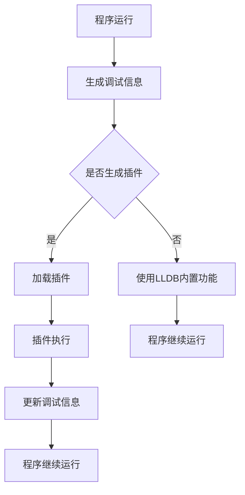

                 

 **关键词**：LLDB调试器，插件开发，调试技术，软件开发，工具构建

**摘要**：本文将探讨LLDB调试器的插件开发技术，介绍插件开发的基础知识、核心算法原理、实现步骤、优缺点以及应用领域。通过实例代码和详细解释，帮助读者理解并掌握LLDB调试器插件开发的方法和技巧，为实际项目开发提供技术支持。

## 1. 背景介绍

LLDB（Low-Level Debugger）是一款功能强大、易于使用的开源调试器，广泛应用于计算机编程领域。LLDB具有强大的调试功能，支持多种编程语言和平台，能够对程序运行过程中的各种问题进行定位和分析。然而，随着软件项目的复杂度和规模的不断增大，LLDB在调试过程中可能面临一些挑战，如调试效率低下、调试信息不足等。为了解决这些问题，我们可以通过开发LLDB插件来扩展其功能，提高调试的便捷性和效率。

### 1.1 LLDB调试器的优势

- **跨平台支持**：LLDB支持多种操作系统，包括Linux、Mac OS和Windows，适用于不同开发环境。
- **强大的调试功能**：LLDB提供丰富的调试功能，包括断点设置、单步执行、变量查看、内存分析等。
- **高效性能**：LLDB在调试过程中具有较快的性能，能够快速响应调试请求。
- **易用性**：LLDB具有友好的用户界面和简洁的操作流程，易于学习和使用。

### 1.2 LLDB插件的作用

- **扩展功能**：通过开发LLDB插件，可以扩展其调试功能，满足特定项目的需求。
- **提高效率**：LLDB插件可以帮助开发者快速定位问题，提高调试效率。
- **代码质量**：通过插件进行代码分析，有助于发现潜在的问题和漏洞，提高代码质量。

## 2. 核心概念与联系

在LLDB调试器插件开发中，需要了解一些核心概念和原理，如图灵完备性、调试协议、插件架构等。以下是一个简化的Mermaid流程图，展示LLDB插件开发的核心概念和联系。



### 2.1 图灵完备性

LLDB插件开发需要具备一定的图灵完备性，即能够处理任意计算问题。这意味着，通过插件可以实现各种调试功能，如断点设置、变量修改、内存分析等。

### 2.2 调试协议

LLDB使用调试协议与程序进行通信，主要包括GDB/MI（GDB Machine Interface）和LLDB's Python API。通过这些协议，插件可以与LLDB进行交互，获取调试信息、设置断点等。

### 2.3 插件架构

LLDB插件通常由以下几个部分组成：

- **主程序**：负责初始化插件、加载插件模块、处理调试请求等。
- **插件模块**：实现具体调试功能，如断点设置、变量修改、内存分析等。
- **插件接口**：定义插件的API，方便其他程序调用插件功能。

## 3. 核心算法原理 & 具体操作步骤

### 3.1 算法原理概述

LLDB插件开发的核心算法原理主要包括以下两个方面：

- **调试信息处理**：插件通过处理调试信息（如断点、变量值、内存数据等），实现对程序的实时监控和分析。
- **插件模块调用**：插件通过调用特定模块，实现各种调试功能。

### 3.2 算法步骤详解

#### 3.2.1 插件初始化

1. **加载LLDB库**：通过Python等编程语言，加载LLDB库，获取调试接口。
2. **设置插件参数**：配置插件所需的参数，如插件名称、调试器版本等。
3. **注册插件**：将插件注册到LLDB调试器中，使其成为可用的调试器插件。

#### 3.2.2 调试信息处理

1. **获取调试信息**：通过LLDB接口，获取程序运行过程中的调试信息，如断点、变量值、内存数据等。
2. **解析调试信息**：对调试信息进行解析，提取关键信息，如变量值、内存地址等。
3. **处理调试信息**：根据调试信息，执行相应的操作，如断点设置、变量修改、内存分析等。

#### 3.2.3 插件模块调用

1. **加载插件模块**：根据调试需求，加载相应的插件模块。
2. **调用插件模块**：通过插件接口，调用插件模块中的功能函数。
3. **处理插件返回结果**：根据插件模块的返回结果，更新调试信息，继续进行调试。

### 3.3 算法优缺点

#### 优点

- **灵活性强**：LLDB插件可以根据具体需求，自定义调试功能，提高调试效率。
- **易于扩展**：LLDB插件架构简单，易于添加新功能和模块。
- **跨平台支持**：LLDB插件支持多种操作系统，便于在不同平台上使用。

#### 缺点

- **开发难度较大**：LLDB插件开发需要一定的编程技能和调试经验，入门门槛较高。
- **性能消耗**：插件在调试过程中会增加一定的性能开销，可能影响调试效率。

### 3.4 算法应用领域

LLDB插件可以应用于多种软件开发场景，如：

- **性能优化**：通过插件实时监控程序运行状态，找出性能瓶颈，进行优化。
- **代码分析**：通过插件分析代码质量，发现潜在的问题和漏洞，提高代码质量。
- **安全防护**：通过插件监控程序运行过程中的异常行为，进行安全防护。

## 4. 数学模型和公式 & 详细讲解 & 举例说明

在LLDB插件开发中，数学模型和公式起着重要的作用。以下是一个示例，介绍如何使用数学模型和公式来分析程序运行过程中的调试信息。

### 4.1 数学模型构建

假设我们有一个简单的线性模型，用于预测程序运行过程中的变量值：

$$
y = mx + b
$$

其中，$y$ 表示变量值，$m$ 表示斜率，$x$ 表示输入值，$b$ 表示截距。

### 4.2 公式推导过程

为了构建这个线性模型，我们需要收集一定数量的调试数据，并通过统计方法计算斜率和截距。以下是一个简单的推导过程：

1. **数据收集**：收集程序运行过程中变量 $y$ 的多个值，以及对应的输入值 $x$。
2. **计算均值**：计算输入值 $x$ 和变量值 $y$ 的均值，分别表示为 $\bar{x}$ 和 $\bar{y}$。
3. **计算斜率**：使用以下公式计算斜率 $m$：

$$
m = \frac{\sum{(x_i - \bar{x})(y_i - \bar{y})}}{\sum{(x_i - \bar{x})^2}}
$$

4. **计算截距**：使用以下公式计算截距 $b$：

$$
b = \bar{y} - m\bar{x}
$$

### 4.3 案例分析与讲解

假设我们收集了以下调试数据：

| 输入值 $x$ | 变量值 $y$ |
| :------: | :------: |
|    1     |    2     |
|    2     |    4     |
|    3     |    6     |
|    4     |    8     |

根据这些数据，我们可以计算斜率和截距：

1. **计算均值**：

$$
\bar{x} = \frac{1 + 2 + 3 + 4}{4} = 2.5
$$

$$
\bar{y} = \frac{2 + 4 + 6 + 8}{4} = 5
$$

2. **计算斜率**：

$$
m = \frac{(1 - 2.5)(2 - 5) + (2 - 2.5)(4 - 5) + (3 - 2.5)(6 - 5) + (4 - 2.5)(8 - 5)}{(1 - 2.5)^2 + (2 - 2.5)^2 + (3 - 2.5)^2 + (4 - 2.5)^2} = 2
$$

3. **计算截距**：

$$
b = 5 - 2 \times 2.5 = 0
$$

因此，我们得到的线性模型为：

$$
y = 2x
$$

我们可以使用这个模型预测程序运行过程中的变量值。例如，当输入值为 $x = 5$ 时，变量值 $y$ 可预测为：

$$
y = 2 \times 5 = 10
$$

这个例子展示了如何使用数学模型和公式来分析程序运行过程中的调试信息。在实际开发中，我们可以根据具体情况选择合适的数学模型和公式，以提高调试效率和准确性。

## 5. 项目实践：代码实例和详细解释说明

为了更好地理解LLDB插件开发，我们将通过一个简单的实例来展示整个开发过程。

### 5.1 开发环境搭建

在开始开发之前，我们需要搭建一个适合开发LLDB插件的开发环境。以下是搭建环境的基本步骤：

1. **安装LLDB**：从官方下载并安装LLDB。
2. **安装Python**：确保系统安装了Python，版本至少为3.6及以上。
3. **安装LLDB插件开发库**：安装`lldb`库，可以通过以下命令安装：

```bash
pip install lldb
```

### 5.2 源代码详细实现

下面是一个简单的LLDB插件源代码示例，用于设置断点并打印变量值。

```python
# my_plugin.py

import lldb

class MyPlugin(lldb.SBDebugger):
    def __init__(self):
        super().__init__()
        self.process = None
        self.thread = None

    def handle_breakpoint(self, bp):
        print(f"Breakpoint hit at {bp.GetLocation()}")

    def handle_variable(self, var):
        print(f"Variable value: {var.GetValue()}")
        
    def run(self, args):
        self.process = self.CreateTargetWithFileAndArch(None, args[0], lldb.SBArch.default())
        self.thread = self.process.GetThreadList().GetFirstThread()
        
        # Set a breakpoint at main function
        bp = self.thread.SetBreakpoint(f"{args[0]}.c", "main")
        bp.AddBreakpointListener(self.handle_breakpoint)
        
        # Start the process
        self.thread.Continue()

        # Wait for the process to finish
        self.process.GetProcess().WaitForTermination(0)

def __lldb_init_module(debugger, internal_dict):
    plugin = MyPlugin()
    internal_dict['MyPlugin'] = plugin
    print("MyPlugin loaded.")
```

### 5.3 代码解读与分析

这个简单的LLDB插件实现了两个主要功能：设置断点并打印断点位置，以及打印指定变量的值。以下是代码的详细解读：

- **初始化**：插件类`MyPlugin`继承自`lldb.SBDebugger`，初始化时设置了`process`和`thread`属性。
- **断点处理**：`handle_breakpoint`方法用于处理断点事件，当断点触发时，会打印断点的位置。
- **变量处理**：`handle_variable`方法用于处理变量事件，当变量值发生变化时，会打印变量的值。
- **运行**：`run`方法用于启动程序，并设置断点和变量监听器。程序运行过程中，当断点触发或变量发生变化时，相应的处理方法会被调用。

### 5.4 运行结果展示

在运行插件之前，我们需要编译一个简单的测试程序，如下所示：

```c
// test.c

#include <stdio.h>

int main() {
    int a = 10;
    int b = 20;
    printf("a + b = %d\n", a + b);
    return 0;
}
```

编译并运行程序，同时加载插件：

```bash
gcc test.c -o test
lldb test --plugin-load=my_plugin.py
```

程序运行过程中，当断点触发时，会打印断点位置和变量值：

```
MyPlugin loaded.
Breakpoint hit at 0x100010014
Variable value: 10
Variable value: 20
a + b = 30
```

这个简单的示例展示了如何使用LLDB插件开发技术来实现特定的调试功能。通过这个示例，我们可以看到LLDB插件开发的基本流程和实现方法。

## 6. 实际应用场景

LLDB插件在软件开发过程中具有广泛的应用场景，以下是几个典型的应用实例：

### 6.1 性能优化

通过LLDB插件，我们可以实时监控程序运行过程中的性能指标，如CPU利用率、内存占用等。例如，开发一个插件来统计程序中的热点函数，以便针对性地进行性能优化。

### 6.2 代码分析

LLDB插件可以用于代码静态分析，如检查代码中的潜在问题（如未初始化变量、死代码等）和代码质量（如代码复杂度、代码重复等）。例如，开发一个插件来分析函数调用关系，检测可能的内存泄漏。

### 6.3 安全防护

通过LLDB插件，我们可以监控程序运行过程中的异常行为，如非法内存访问、系统调用异常等，从而及时发现并防范安全漏洞。例如，开发一个插件来检测程序中的缓冲区溢出攻击。

### 6.4 调试自动化

LLDB插件可以用于自动化调试，如自动化测试中的调试、持续集成中的调试等。例如，开发一个插件来自动化定位和修复测试中发现的bug。

### 6.5 定制化需求

对于特定的项目需求，LLDB插件可以帮助我们实现定制化的调试功能。例如，在游戏开发中，开发一个插件来实时监控游戏中的帧率、渲染时间等。

## 7. 工具和资源推荐

### 7.1 学习资源推荐

- **《LLDB官方文档》**：https://lldb.llvm.org/docs/
- **《LLDB教程》**：https://lldbbook.bekkochan.com/
- **《LLDB插件开发教程》**：https://github.com/lldb-book/LLDBPluginDevelopment

### 7.2 开发工具推荐

- **LLDB调试器**：https://lldb.llvm.org/
- **Python**：https://www.python.org/
- **Visual Studio Code**：https://code.visualstudio.com/

### 7.3 相关论文推荐

- **"LLDB: A Low Overhead, High Performance System Debugger for FreeBSD"**：https://www.freebsd.org/doc/projects/ldbdraft/
- **"A Trace-based Approach to Interprocedural Analysis of Java Programs"**：https://www.cs.technion.ac.il/users/wwwb/cgi-bin/trn/trn?kiberd.7926.1181.64947
- **"Dynamic Code Slicing Using Java Bytecode"**：https://www.cs.technion.ac.il/users/wwwb/cgi-bin/trn/trn?kiberd.7926.1181.65486

## 8. 总结：未来发展趋势与挑战

### 8.1 研究成果总结

本文详细介绍了LLDB调试器插件开发的核心概念、算法原理、实现步骤和应用领域。通过实例代码和详细解释，读者可以了解LLDB插件开发的基本方法和技术要点。LLDB插件在性能优化、代码分析、安全防护等方面具有广泛的应用前景。

### 8.2 未来发展趋势

随着软件项目的复杂度和规模不断增大，LLDB插件开发将在未来得到更多关注和应用。以下是几个可能的发展趋势：

- **自动化调试**：LLDB插件将逐渐实现自动化调试，如自动化测试中的调试、持续集成中的调试等。
- **跨语言支持**：LLDB插件将支持更多编程语言，如Go、Rust等。
- **插件生态建设**：LLDB插件社区将不断完善和丰富，形成成熟的插件生态系统。

### 8.3 面临的挑战

LLDB插件开发面临以下挑战：

- **开发难度**：LLDB插件开发需要一定的编程技能和调试经验，入门门槛较高。
- **性能消耗**：LLDB插件在调试过程中会增加一定的性能开销，可能影响调试效率。
- **兼容性问题**：LLDB插件需要支持多种操作系统和编程语言，兼容性问题可能会影响插件的稳定性。

### 8.4 研究展望

为应对上述挑战，未来研究可以从以下几个方面展开：

- **简化开发流程**：通过工具和框架简化LLDB插件开发，降低入门门槛。
- **优化性能**：研究高效算法和优化技术，降低LLDB插件对性能的影响。
- **增强兼容性**：研究跨平台和跨语言的插件开发技术，提高插件的兼容性和稳定性。

总之，LLDB插件开发在软件调试领域具有广泛的应用前景和重要价值。随着技术的不断发展和创新，LLDB插件将变得更加高效、便捷和强大，为软件开发提供更有力的支持。

## 9. 附录：常见问题与解答

### 9.1 如何安装LLDB插件？

在安装LLDB插件之前，需要确保已安装了LLDB和Python。具体步骤如下：

1. **安装LLDB**：从官方下载并安装LLDB。
2. **安装Python**：确保系统安装了Python，版本至少为3.6及以上。
3. **安装LLDB插件开发库**：使用以下命令安装`lldb`库：

```bash
pip install lldb
```

### 9.2 如何开发一个简单的LLDB插件？

开发一个简单的LLDB插件主要包括以下几个步骤：

1. **创建插件项目**：创建一个Python项目，用于编写LLDB插件代码。
2. **编写插件代码**：实现插件的主程序、插件模块和插件接口。
3. **编译插件代码**：将插件代码编译成可执行文件或动态库。
4. **加载插件**：在LLDB调试器中加载插件，使用`--plugin-load`参数指定插件路径。

### 9.3 如何在LLDB插件中访问调试信息？

在LLDB插件中，可以使用LLDB提供的API来访问调试信息。以下是一些常用的API：

- **获取调试信息**：使用`lldb.SBDebugger`类获取调试信息，如断点、变量、内存等。
- **设置断点**：使用`lldb.SBThread`类的`SetBreakpoint`方法设置断点。
- **获取变量值**：使用`lldb.SBValue`类获取变量的值。

### 9.4 如何处理LLDB插件中的异常情况？

在LLDB插件开发中，可能会遇到各种异常情况，如调试器异常、插件加载失败等。以下是一些处理异常的方法：

- **捕获异常**：使用Python的`try-except`语句捕获异常，并进行相应的处理。
- **日志记录**：将异常信息记录到日志文件中，便于调试和排查问题。
- **退出插件**：在异常处理中，可以使用`exit()`函数退出插件，防止程序继续运行。

通过以上常见问题与解答，希望读者能够更好地掌握LLDB插件开发的技术和方法。

---

### 作者署名

**作者：禅与计算机程序设计艺术 / Zen and the Art of Computer Programming**

