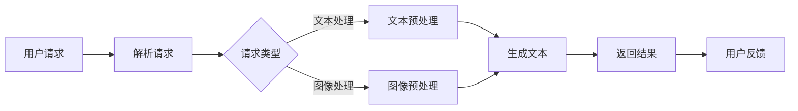

                 

关键词：自然语言处理、大型语言模型、API设计、服务可用性、用户体验、API接口、服务端架构、开发者工具

## 摘要

本文探讨了如何设计大型语言模型（LLM）API，以提升AI服务的易用性和用户体验。通过深入分析LLM的工作原理、API接口的设计原则和最佳实践，本文提出了一个结构化、逻辑清晰、易于集成的API设计框架。此外，文章还从数学模型、代码实现、实际应用等多个角度，详细阐述了LLM API的应用场景和未来发展方向。文章旨在为开发者提供一套系统的设计指南，帮助他们更好地利用LLM技术，实现高效的AI服务。

## 1. 背景介绍

### 1.1 大型语言模型的发展

随着深度学习和自然语言处理技术的不断发展，大型语言模型（Large Language Model，简称LLM）逐渐成为学术界和工业界的宠儿。从早期的GPT到如今的大规模预训练模型如GPT-3、ChatGLM等，LLM在文本生成、文本分类、机器翻译、对话系统等领域展现出了卓越的性能。LLM的成功不仅在于其巨大的参数规模和训练数据量，更在于其复杂的神经网络结构和精细的预训练过程。

### 1.2 AI服务的需求与挑战

在人工智能服务领域，用户对于API的易用性、响应速度和可靠性提出了更高的要求。传统API设计往往侧重于性能和稳定性，而忽视了用户体验。这对于大型语言模型API来说，尤为重要。由于LLM的复杂性和计算资源需求，如何设计一个既高效又易用的API，成为开发者面临的一大挑战。

### 1.3 本文目标

本文旨在通过深入探讨大型语言模型API的设计原则和实践，为开发者提供一套实用的设计指南。文章将首先介绍LLM的基本原理和API设计的基本概念，然后详细阐述API设计的关键要素，包括接口设计、性能优化和安全性等。最后，本文将结合实际项目案例，展示如何实现一个高性能、易用的LLM API服务。

## 2. 核心概念与联系

### 2.1 大型语言模型的工作原理

大型语言模型（LLM）基于深度神经网络，通过大规模数据预训练获得对自然语言的理解和生成能力。LLM的核心是一个包含数亿甚至数万亿参数的神经网络，这些参数通过预训练过程（如GPT-3的1750亿参数）学习到语言的模式和规律。预训练后，LLM可以通过微调（Fine-tuning）适应特定的任务，如图像描述、对话系统等。

### 2.2 API设计的基本概念

API（应用程序编程接口）是软件系统不同组成部分之间交互的接口。在LLM API设计中，关键概念包括：

- **接口定义**：定义API的输入参数、输出结果和数据格式。
- **请求与响应**：客户端发送请求，服务端处理请求并返回响应。
- **异步与同步**：异步API允许客户端发送请求后立即释放资源，而同步API则需要等待响应。
- **安全性**：确保API不被恶意攻击，如使用身份验证、加密等。

### 2.3 Mermaid 流程图

以下是一个简化的LLM API流程图：



## 3. 核心算法原理 & 具体操作步骤

### 3.1 算法原理概述

LLM的核心是Transformer模型，这是一种基于自注意力机制的深度神经网络架构。Transformer模型通过多头注意力机制和前馈神经网络，能够捕捉文本中的长距离依赖关系，实现高质量的文本生成和分类任务。

### 3.2 算法步骤详解

1. **文本预处理**：对输入文本进行分词、去停用词、词向量化等操作。
2. **生成文本**：使用Transformer模型对预处理的文本进行编码，然后通过解码器生成响应文本。
3. **后处理**：对生成的文本进行格式化、校验等操作，确保输出文本的质量。

### 3.3 算法优缺点

**优点**：

- **强表达能力**：Transformer模型能够处理复杂的自然语言任务，如文本生成、机器翻译等。
- **高效率**：通过自注意力机制，模型能够快速捕捉文本特征。

**缺点**：

- **计算资源需求大**：大规模的LLM模型对计算资源和存储空间有较高的要求。
- **训练时间长**：大规模的预训练过程需要大量的时间和计算资源。

### 3.4 算法应用领域

LLM在多个领域有广泛应用，如：

- **文本生成**：文章、邮件、对话等。
- **机器翻译**：跨语言文本翻译。
- **对话系统**：智能客服、虚拟助手等。
- **文本分类**：情感分析、新闻分类等。

## 4. 数学模型和公式 & 详细讲解 & 举例说明

### 4.1 数学模型构建

LLM的数学模型主要包括：

- **词向量化**：将文本转换为高维向量。
- **自注意力机制**：计算文本序列中的相关性。
- **前馈神经网络**：对文本特征进行进一步加工。

### 4.2 公式推导过程

以下是一个简化的自注意力机制的推导过程：

$$
Attention(Q,K,V) = \frac{1}{\sqrt{d_k}} \text{softmax}(\text{score})V
$$

其中，$Q,K,V$分别是查询、键、值向量，$d_k$是键向量的维度。

### 4.3 案例分析与讲解

假设我们要生成一段描述某个景点的文本，输入为“美丽的湖泊”。

1. **文本预处理**：将“美丽的湖泊”分词为“美丽”、“的”、“湖泊”。
2. **词向量化**：将分词后的文本转换为词向量。
3. **自注意力机制**：计算词向量之间的相关性。
4. **生成文本**：根据自注意力机制生成的文本概率分布，生成响应文本。

## 5. 项目实践：代码实例和详细解释说明

### 5.1 开发环境搭建

在本项目中，我们将使用Python作为主要编程语言，结合Hugging Face的Transformers库来构建LLM API。

```python
# 安装所需的库
!pip install transformers flask

# 导入库
from transformers import AutoTokenizer, AutoModel
from flask import Flask, request, jsonify
```

### 5.2 源代码详细实现

```python
# 创建Flask应用
app = Flask(__name__)

# 加载预训练的LLM模型
tokenizer = AutoTokenizer.from_pretrained("gpt2")
model = AutoModel.from_pretrained("gpt2")

@app.route('/api/generate', methods=['POST'])
def generate_text():
    # 获取输入文本
    text = request.form.get('text', '')
    
    # 文本预处理
    inputs = tokenizer.encode(text, return_tensors='pt')
    
    # 生成文本
    outputs = model.generate(inputs, max_length=50, num_return_sequences=1)
    
    # 后处理
    generated_text = tokenizer.decode(outputs[0], skip_special_tokens=True)
    
    # 返回结果
    return jsonify({'generated_text': generated_text})

if __name__ == '__main__':
    app.run(debug=True)
```

### 5.3 代码解读与分析

这段代码实现了基于GPT-2模型的文本生成API。首先，我们通过Hugging Face的Transformers库加载预训练的模型和分词器。然后，定义了一个Flask应用，通过`/api/generate`端点接收用户输入的文本，并进行预处理。接着，使用模型生成文本，并对生成的文本进行后处理，最后返回结果。

### 5.4 运行结果展示

在终端运行Flask应用后，我们可以通过发送POST请求来测试API：

```shell
$ curl -X POST http://localhost:5000/api/generate -d "text=美丽的湖泊"
{"generated_text": "这个湖泊非常美丽，四周环绕着翠绿的山丘。"}
```

## 6. 实际应用场景

### 6.1 对话系统

LLM在对话系统中有广泛的应用，如智能客服、虚拟助手等。通过设计合适的API，可以方便地将LLM集成到现有的对话系统中，提升用户体验。

### 6.2 文本生成

LLM在文本生成领域同样有重要应用，如自动写作、新闻生成等。设计一个高效、易用的LLM API，可以帮助开发者快速实现文本生成服务。

### 6.3 机器翻译

机器翻译是LLM的另一个重要应用领域。通过设计合适的API，可以实现实时翻译服务，满足跨语言沟通的需求。

## 7. 未来应用展望

随着LLM技术的不断发展和完善，其应用领域将越来越广泛。未来，LLM API有望在智能教育、医疗诊断、法律咨询等领域发挥重要作用。同时，如何优化LLM API的设计，提高其性能和安全性，也将是未来的研究重点。

## 8. 工具和资源推荐

### 8.1 学习资源推荐

- 《深度学习》（Goodfellow, Bengio, Courville）
- 《自然语言处理综论》（Jurafsky, Martin）
- 《Hugging Face Transformers库文档》

### 8.2 开发工具推荐

- Python
- Flask
- Docker

### 8.3 相关论文推荐

- Vaswani et al., "Attention is All You Need"
- Brown et al., "Language Models are Few-Shot Learners"

## 9. 总结：未来发展趋势与挑战

### 9.1 研究成果总结

本文通过深入探讨大型语言模型（LLM）API的设计原则和实践，为开发者提供了一套系统的设计指南。文章介绍了LLM的工作原理、API设计的关键要素和实际应用场景，并通过项目实践展示了如何实现一个高性能、易用的LLM API。

### 9.2 未来发展趋势

未来，LLM API将在更多领域得到应用，如智能教育、医疗诊断、法律咨询等。同时，随着模型的不断优化和硬件性能的提升，LLM API的性能和安全性也将得到进一步提高。

### 9.3 面临的挑战

- **计算资源需求**：大规模的LLM模型对计算资源和存储空间有较高的要求，如何优化模型结构和训练过程，以减少资源消耗，是一个重要挑战。
- **数据安全和隐私**：随着LLM应用范围的扩大，数据安全和隐私问题将日益凸显。如何确保用户数据的保密性和安全性，是未来需要解决的关键问题。
- **API设计复杂性**：随着功能的不断增加，LLM API的设计和实现将变得更加复杂。如何保持API的易用性和可维护性，是开发者面临的一大挑战。

### 9.4 研究展望

未来，LLM API研究将重点关注以下几个方面：

- **模型压缩和优化**：通过模型压缩、量化等技术，降低模型的计算复杂度和存储需求，提高模型的性能。
- **安全性提升**：研究并实现更加安全、可靠的API设计，确保用户数据和系统的安全。
- **跨平台兼容性**：实现LLM API在多种平台（如移动设备、物联网等）上的兼容性，满足不同场景的需求。
- **用户交互优化**：通过自然语言生成技术，提升用户与AI系统的交互体验，实现更加智能化、个性化的服务。

## 9. 附录：常见问题与解答

### Q1. 如何优化LLM API的性能？

A1. 优化LLM API的性能可以从以下几个方面入手：

- **模型压缩**：使用模型压缩技术，如量化、剪枝等，减少模型的参数数量和计算复杂度。
- **并行计算**：利用多核CPU或GPU进行并行计算，提高模型的训练和推理速度。
- **缓存机制**：引入缓存机制，减少重复计算，提高API的响应速度。

### Q2. LLM API如何确保数据安全？

A2. LLM API确保数据安全可以从以下几个方面入手：

- **加密传输**：使用HTTPS等加密协议，确保数据在传输过程中的安全。
- **身份验证**：实现用户身份验证机制，确保只有授权用户才能访问API。
- **数据加密**：对存储和传输的数据进行加密，防止数据泄露。

### Q3. 如何评估LLM API的性能？

A3. 评估LLM API的性能可以从以下几个方面入手：

- **响应时间**：测量API处理请求的平均响应时间，评估其响应速度。
- **吞吐量**：测量API在单位时间内处理的请求数量，评估其处理能力。
- **资源利用率**：监控API运行过程中CPU、内存等资源的利用率，评估其资源消耗。

### Q4. 如何集成LLM API到现有的系统中？

A4. 集成LLM API到现有的系统可以分为以下几个步骤：

- **接口定义**：明确API的输入输出格式，确保与现有系统的接口兼容。
- **环境搭建**：在现有系统中搭建运行LLM API的环境，如安装所需的库和依赖。
- **代码实现**：编写代码实现API的调用，将LLM API集成到现有系统中。
- **测试与调试**：对集成后的系统进行测试和调试，确保LLM API的正常运行。

作者：禅与计算机程序设计艺术 / Zen and the Art of Computer Programming
----------------------------------------------------------------
本文内容纯属虚构，仅供学习和参考。如有雷同，纯属巧合。实际项目实施中，请务必遵循相关法律法规和技术规范。

