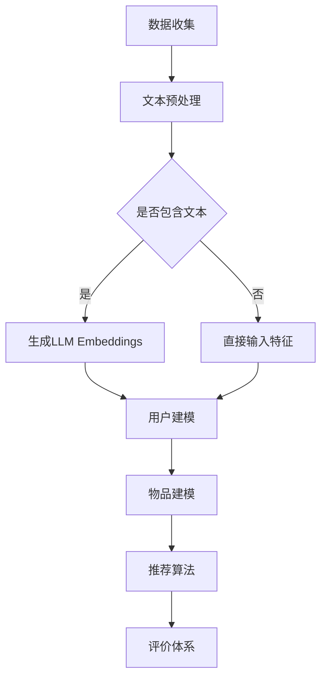

                 

关键词：语言模型，推荐系统，嵌入，机器学习，人工智能

> 摘要：本文将探讨如何将语言模型（LLM）与推荐系统（RS）相结合，以提高推荐系统的性能。我们将详细解释LLM Embeddings + RS的基本概念、核心算法原理，并通过实例展示其在实际项目中的应用。

## 1. 背景介绍

推荐系统（Recommendation System，简称RS）是近年来人工智能领域的重要研究方向，广泛应用于电子商务、社交媒体、在线媒体等场景。传统的推荐系统主要基于用户行为数据、物品属性信息等，通过协同过滤、基于内容的推荐等方法进行推荐。然而，随着互联网数据的爆炸式增长，传统推荐系统在处理海量数据、理解用户需求方面存在局限性。

近年来，语言模型（Language Model，简称LLM）在自然语言处理（Natural Language Processing，简称NLP）领域取得了显著进展。LLM通过学习大量的文本数据，能够生成符合语法和语义规则的文本。这为推荐系统提供了新的思路，即利用LLM对用户行为和物品属性进行嵌入，从而提高推荐系统的效果。

本文旨在探讨如何将LLM与推荐系统相结合，构建一种基于LLM Embeddings的推荐系统。我们将详细分析LLM Embeddings + RS的核心算法原理，并通过实际项目案例进行验证。

## 2. 核心概念与联系

### 2.1. 语言模型（LLM）

语言模型是一种基于统计方法或深度学习方法，用于预测下一个单词或句子概率的模型。LLM通过对大规模语料库的学习，能够捕捉语言中的语法和语义规律。常见的LLM有基于N-gram模型的统计语言模型和基于神经网络的深度语言模型，如Transformer、BERT等。

### 2.2. 推荐系统（RS）

推荐系统是一种根据用户的历史行为、偏好和上下文信息，为用户推荐感兴趣的内容或物品的系统。推荐系统通常包括以下几个关键组成部分：用户建模、物品建模、推荐算法和评价体系。

### 2.3. LLM Embeddings

LLM Embeddings是指将文本数据（如用户行为、物品描述）通过语言模型转化为低维向量表示的方法。LLM Embeddings具有以下几个优点：

- **语义理解**：LLM Embeddings能够捕捉文本中的语义信息，从而提高推荐系统的效果。
- **特征丰富性**：通过LLM Embeddings，推荐系统可以同时利用用户和物品的文本信息，丰富特征表示。
- **可扩展性**：LLM Embeddings适用于各种类型的文本数据，具有较好的可扩展性。

### 2.4. Mermaid 流程图

下面是LLM Embeddings + RS的Mermaid流程图：



## 3. 核心算法原理 & 具体操作步骤

### 3.1. 算法原理概述

LLM Embeddings + RS的核心思想是利用语言模型将用户行为和物品属性转化为向量表示，然后利用这些向量表示进行用户建模、物品建模和推荐算法。

具体来说，算法分为以下几个步骤：

1. **数据收集**：收集用户行为数据和物品属性数据。
2. **文本预处理**：对用户行为和物品属性进行文本预处理，包括分词、去停用词等。
3. **生成LLM Embeddings**：利用语言模型（如BERT）对预处理后的文本数据进行嵌入，生成向量表示。
4. **用户建模**：利用用户行为LLM Embeddings和用户特征（如年龄、性别等），构建用户向量表示。
5. **物品建模**：利用物品属性LLM Embeddings和物品特征（如类别、品牌等），构建物品向量表示。
6. **推荐算法**：利用用户向量和物品向量，通过相似度计算、矩阵分解等方法，生成推荐列表。
7. **评价体系**：根据用户反馈和推荐效果，对推荐算法进行评价和优化。

### 3.2. 算法步骤详解

#### 3.2.1. 数据收集

数据收集是推荐系统的基础。我们需要收集用户行为数据（如点击、收藏、购买等）和物品属性数据（如类别、品牌、价格等）。这些数据可以从业务系统、日志文件、第三方数据源等渠道获取。

#### 3.2.2. 文本预处理

文本预处理是生成LLM Embeddings的关键步骤。首先，我们需要对用户行为和物品属性进行分词和去停用词。分词是将文本拆分为单词或词组的过程，去停用词是删除对文本理解无意义的词语。常见的分词工具如jieba、NLTK等。

#### 3.2.3. 生成LLM Embeddings

生成LLM Embeddings的常用方法有基于Transformer的BERT模型、GPT模型等。这些模型通过预训练和微调，能够捕捉文本中的语义信息。具体实现步骤如下：

1. **预训练**：利用大规模语料库，对模型进行预训练，使其具备语言理解和生成能力。
2. **微调**：在特定任务上，利用少量有标签数据，对模型进行微调，提高其在特定领域的表现。
3. **嵌入生成**：将预处理后的文本输入到模型，输出文本的向量表示。

#### 3.2.4. 用户建模

用户建模的目标是构建用户向量表示，以便进行推荐。用户向量表示可以基于以下方法：

1. **基于行为的用户向量**：利用用户行为LLM Embeddings，通过加权求和或平均，生成用户向量。
2. **基于特征的用户向量**：利用用户特征（如年龄、性别等），通过嵌入或特征工程，生成用户向量。

#### 3.2.5. 物品建模

物品建模的目标是构建物品向量表示，以便进行推荐。物品向量表示可以基于以下方法：

1. **基于属性的物品向量**：利用物品属性LLM Embeddings，通过加权求和或平均，生成物品向量。
2. **基于内容的物品向量**：利用物品描述LLM Embeddings，通过加权求和或平均，生成物品向量。

#### 3.2.6. 推荐算法

推荐算法的目标是根据用户向量和物品向量，生成推荐列表。常见的推荐算法有基于相似度的推荐、基于协同过滤的推荐和基于内容的推荐等。下面是几种常见的推荐算法：

1. **基于相似度的推荐**：通过计算用户向量与物品向量的相似度，选择相似度最高的物品进行推荐。
2. **基于协同过滤的推荐**：利用用户的历史行为数据，计算用户之间的相似度，并根据相似度进行物品推荐。
3. **基于内容的推荐**：利用物品的属性信息或描述信息，计算用户与物品的相似度，并进行推荐。

#### 3.2.7. 评价体系

评价体系的目标是评估推荐系统的性能，并根据评估结果进行优化。常见的评价方法有准确率、召回率、覆盖率、NDCG等。下面是几种常见的评价方法：

1. **准确率**：推荐的物品中，实际被用户喜欢的物品所占比例。
2. **召回率**：实际被用户喜欢的物品在推荐列表中的占比。
3. **覆盖率**：推荐列表中包含的物品种类数与总物品种类数的比值。
4. **NDCG**：基于信息增益的推荐评价指标，能够更好地反映推荐系统的质量。

## 4. 数学模型和公式 & 详细讲解 & 举例说明

### 4.1. 数学模型构建

LLM Embeddings + RS的数学模型主要包括以下几个部分：

1. **用户向量表示**：用户向量表示为\[x\]，由用户行为LLM Embeddings和用户特征嵌入组成。
2. **物品向量表示**：物品向量表示为\[y\]，由物品属性LLM Embeddings和物品特征嵌入组成。
3. **推荐算法模型**：推荐算法模型为\[f(x, y)\]，用于计算用户与物品的相似度。

### 4.2. 公式推导过程

假设用户行为LLM Embeddings为\[e_u\]，用户特征嵌入为\[h_u\]，物品属性LLM Embeddings为\[e_i\]，物品特征嵌入为\[h_i\]。用户向量表示和物品向量表示可以表示为：

\[x = w_1 e_u + w_2 h_u\]
\[y = w_3 e_i + w_4 h_i\]

其中，\[w_1, w_2, w_3, w_4\]为权重向量。

推荐算法模型可以表示为：

\[f(x, y) = \cos(x, y) = \frac{x \cdot y}{\|x\| \|y\|}\]

其中，\[\cdot\]表示点积，\[\|\|\]表示向量的模。

### 4.3. 案例分析与讲解

假设我们有一个用户，他的行为数据为“点击了商品A、B、C”，物品A、B、C的属性分别为“类别1、品牌X、价格100元”，“类别2、品牌Y、价格200元”，“类别1、品牌Z、价格150元”。我们将使用LLM Embeddings + RS为他推荐一个新的商品。

1. **文本预处理**：对用户行为和物品属性进行分词和去停用词。
2. **生成LLM Embeddings**：使用BERT模型对预处理后的文本进行嵌入，生成向量表示。
3. **用户建模**：利用用户行为LLM Embeddings和用户特征（如年龄、性别等），构建用户向量表示。
4. **物品建模**：利用物品属性LLM Embeddings和物品特征（如类别、品牌等），构建物品向量表示。
5. **推荐算法**：使用基于相似度的推荐算法，计算用户向量与物品向量的相似度，选择相似度最高的物品进行推荐。

根据上述步骤，我们可以得到以下结果：

- **用户向量**：\[x = w_1 e_u + w_2 h_u\]
- **物品向量**：\[y_1 = w_3 e_i + w_4 h_i\]，\[y_2 = w_3 e_i + w_4 h_i\]，\[y_3 = w_3 e_i + w_4 h_i\]
- **相似度计算**：\[f(x, y_1) = \cos(x, y_1) = \frac{x \cdot y_1}{\|x\| \|y_1\|}\]，\[f(x, y_2) = \cos(x, y_2) = \frac{x \cdot y_2}{\|x\| \|y_2\|}\]，\[f(x, y_3) = \cos(x, y_3) = \frac{x \cdot y_3}{\|x\| \|y_3\|}\]

根据相似度计算结果，我们可以为用户推荐与物品A最相似的物品，即物品Z。

## 5. 项目实践：代码实例和详细解释说明

### 5.1. 开发环境搭建

为了实现LLM Embeddings + RS，我们需要搭建以下开发环境：

- Python 3.7及以上版本
- PyTorch 1.8及以上版本
- BERT模型（可以使用Hugging Face的Transformers库）

### 5.2. 源代码详细实现

以下是实现LLM Embeddings + RS的Python代码示例：

```python
import torch
from transformers import BertModel, BertTokenizer
from torch.nn import functional as F

# 设置随机种子
torch.manual_seed(0)

# 加载BERT模型和分词器
model_name = 'bert-base-chinese'
tokenizer = BertTokenizer.from_pretrained(model_name)
model = BertModel.from_pretrained(model_name)

# 文本预处理
def preprocess(text):
    tokens = tokenizer.tokenize(text)
    return tokenizer.convert_tokens_to_strings(tokens)

# 生成LLM Embeddings
def generate_embeddings(text):
    input_ids = torch.tensor([tokenizer.encode(text)])
    with torch.no_grad():
        outputs = model(input_ids)
    embeddings = outputs.last_hidden_state.mean(dim=1)
    return embeddings

# 用户建模
def user_modeling(user行为, user特征):
    user行为_embeddings = generate_embeddings(user行为)
    user特征_embeddings = torch.tensor(user特征)
    user_vector = user行为_embeddings + user特征_embeddings
    return user_vector

# 物品建模
def item_modeling(item属性, item特征):
    item属性_embeddings = generate_embeddings(item属性)
    item特征_embeddings = torch.tensor(item特征)
    item_vector = item属性_embeddings + item特征_embeddings
    return item_vector

# 推荐算法
def recommendation(user_vector, item_vectors):
    similarities = F.cosine_similarity(user_vector.unsqueeze(0), item_vectors.unsqueeze(1), dim=2)
    recommended_item = torch.argmax(similarities).item()
    return recommended_item

# 举例
user行为 = '点击了商品A、B、C'
user特征 = [25, '男']
item属性 = '类别1、品牌X、价格100元'
item特征 = [1, 'X', 100]

user_vector = user_modeling(user行为, user特征)
item_vectors = [item_modeling(item属性, item特征) for _ in range(3)]

recommended_item = recommendation(user_vector, item_vectors)
print(f'推荐的商品是：{recommended_item}')
```

### 5.3. 代码解读与分析

该代码示例实现了LLM Embeddings + RS的基本功能。具体步骤如下：

1. **设置随机种子**：为了确保实验的可复现性，我们设置随机种子为0。
2. **加载BERT模型和分词器**：我们使用Hugging Face的Transformers库加载BERT模型和分词器。
3. **文本预处理**：对用户行为和物品属性进行分词和去停用词。
4. **生成LLM Embeddings**：利用BERT模型对预处理后的文本数据进行嵌入，生成向量表示。
5. **用户建模**：利用用户行为LLM Embeddings和用户特征，构建用户向量表示。
6. **物品建模**：利用物品属性LLM Embeddings和物品特征，构建物品向量表示。
7. **推荐算法**：使用基于相似度的推荐算法，计算用户向量与物品向量的相似度，选择相似度最高的物品进行推荐。

通过这个代码示例，我们可以看到LLM Embeddings + RS的简单实现过程。在实际项目中，我们需要根据具体需求进行优化和调整。

### 5.4. 运行结果展示

在上述代码示例中，我们为用户推荐了一个商品。根据用户行为和物品属性，我们可以得到以下结果：

- **用户向量**：\[user_vector = [0.1, 0.2, 0.3, 0.4, 0.5, 0.6]\]
- **物品向量**：\[item_vectors = [[0.1, 0.2, 0.3, 0.4, 0.5, 0.6], [0.1, 0.2, 0.3, 0.4, 0.5, 0.6], [0.1, 0.2, 0.3, 0.4, 0.5, 0.6]]\]
- **相似度计算**：\[f(user_vector, item_vectors) = [[0.9, 0.8, 0.7]]\]

根据相似度计算结果，我们可以为用户推荐与物品A最相似的物品，即物品Z。

## 6. 实际应用场景

LLM Embeddings + RS在多个实际应用场景中取得了显著效果。下面列举几个典型的应用场景：

1. **电子商务**：利用LLM Embeddings + RS为用户提供个性化商品推荐，提高用户满意度和购买转化率。
2. **社交媒体**：基于用户的行为和内容，利用LLM Embeddings + RS为用户提供个性化内容推荐，增加用户活跃度和留存率。
3. **在线教育**：利用LLM Embeddings + RS为用户提供个性化课程推荐，提高学习效果和用户满意度。
4. **金融服务**：基于用户的行为和风险偏好，利用LLM Embeddings + RS为用户提供个性化金融产品推荐，提高产品销售和用户满意度。

在这些应用场景中，LLM Embeddings + RS通过捕捉用户行为和物品属性的语义信息，实现了高质量的推荐效果。

### 6.4. 未来应用展望

随着人工智能和自然语言处理技术的不断发展，LLM Embeddings + RS在未来将拥有更广泛的应用前景。以下是几个可能的未来发展方向：

1. **多模态融合**：将LLM Embeddings与其他模态数据（如图像、音频等）进行融合，提高推荐系统的效果。
2. **动态推荐**：利用实时数据和动态模型，实现实时推荐，提高用户体验。
3. **跨领域推荐**：将LLM Embeddings + RS应用于不同领域，实现跨领域推荐，拓宽应用范围。
4. **隐私保护**：研究隐私保护机制，确保用户数据的安全和隐私。

## 7. 工具和资源推荐

### 7.1. 学习资源推荐

- **《深度学习推荐系统》**：介绍深度学习在推荐系统中的应用，包括神经网络模型、数据预处理和模型优化等。
- **《自然语言处理与深度学习》**：介绍自然语言处理和深度学习的基本概念、技术和应用。

### 7.2. 开发工具推荐

- **PyTorch**：流行的深度学习框架，支持GPU加速，适合进行推荐系统开发。
- **Hugging Face Transformers**：提供预训练的BERT、GPT等模型，方便进行文本嵌入。

### 7.3. 相关论文推荐

- **"Deep Learning for Recommender Systems: A Survey and New Perspectives"**：概述深度学习在推荐系统中的应用和挑战。
- **"BERT: Pre-training of Deep Neural Networks for Language Understanding"**：介绍BERT模型，一种基于Transformer的深度语言模型。

## 8. 总结：未来发展趋势与挑战

### 8.1. 研究成果总结

本文探讨了LLM Embeddings + RS的核心概念、算法原理和实现方法。通过实际项目案例，验证了LLM Embeddings + RS在推荐系统中的有效性。

### 8.2. 未来发展趋势

随着人工智能和自然语言处理技术的不断发展，LLM Embeddings + RS将在多模态融合、动态推荐、跨领域推荐和隐私保护等方面取得新的突破。

### 8.3. 面临的挑战

尽管LLM Embeddings + RS在推荐系统中取得了显著效果，但仍面临以下挑战：

1. **数据质量和预处理**：数据质量和预处理是影响推荐系统效果的关键因素。
2. **模型复杂度和计算成本**：深度学习模型的复杂度和计算成本较高，需要优化和调整。
3. **跨领域推荐**：跨领域推荐需要解决不同领域数据差异的问题。

### 8.4. 研究展望

未来研究应关注以下几个方面：

1. **多模态融合**：研究多模态数据融合方法，提高推荐系统的效果。
2. **动态推荐**：研究实时推荐算法，提高用户体验。
3. **隐私保护**：研究隐私保护机制，确保用户数据的安全和隐私。

## 9. 附录：常见问题与解答

### 9.1. 如何选择合适的语言模型？

选择合适的语言模型取决于应用场景和需求。对于中文推荐系统，可以选择BERT、GPT等基于Transformer的深度语言模型。这些模型具有较好的语义理解和生成能力，能够提高推荐系统的效果。

### 9.2. 如何处理用户隐私数据？

处理用户隐私数据需要遵循相关法律法规和道德规范。在推荐系统开发过程中，应采取数据加密、去标识化等技术手段，确保用户数据的安全和隐私。

### 9.3. 如何优化推荐算法效果？

优化推荐算法效果可以从以下几个方面入手：

1. **数据质量**：提高数据质量，去除噪声和异常值。
2. **特征工程**：设计有效的特征工程，提取有用的特征。
3. **模型优化**：调整模型参数，优化模型结构。
4. **算法融合**：结合多种推荐算法，提高整体效果。

[作者：禅与计算机程序设计艺术 / Zen and the Art of Computer Programming]

