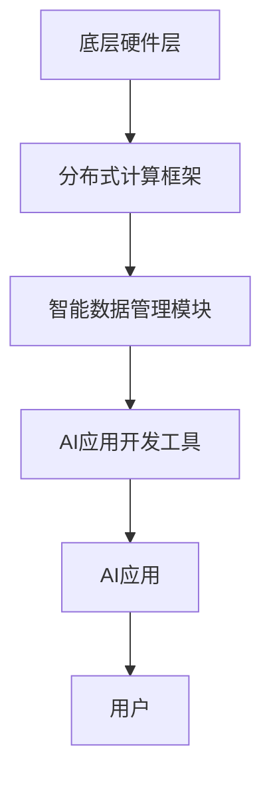

                 

关键词：大型语言模型，AI操作系统，软件架构，编程语言，人工智能，深度学习，神经网络，计算范式，操作系统的演进，通用操作系统，AI生产力工具，技术趋势

> 摘要：本文深入探讨了AI操作系统（LLM OS）的愿景与蓝图，分析了其核心概念、技术原理、算法模型，以及在实际应用中的潜力与挑战。通过详细的代码实例和实际应用场景的介绍，探讨了LLM OS在未来人工智能时代的发展方向。

## 1. 背景介绍

随着人工智能技术的快速发展，传统的操作系统已经逐渐无法满足AI应用的需求。传统的操作系统主要关注硬件资源的调度与管理，而AI操作系统（LLM OS）则更关注于如何高效地利用AI算法和深度学习模型，提高计算效率和生产力。

LLM OS是一种新型的操作系统，它基于大型语言模型（Large Language Model，简称LLM）构建，旨在将AI能力融入到操作系统的每一个角落，从而实现更智能、更高效的计算体验。LLM OS的目标是构建一个智能化的计算平台，使得各种AI应用能够在同一环境中高效运行，并实现跨应用的数据共享与协同工作。

### 1.1 AI操作系统的发展历程

AI操作系统的发展可以追溯到20世纪80年代，当时的研究主要集中在专家系统和知识表示上。随着计算机硬件性能的提升和深度学习算法的突破，AI操作系统逐渐走向了通用化和智能化。

2006年，深度学习算法的提出为AI操作系统的发展带来了新的机遇。深度学习模型的出现使得AI操作系统可以从海量数据中自动学习，从而实现更智能的功能。

2018年，谷歌发布了Transformer模型，这一模型的出现标志着AI操作系统进入了新的阶段。Transformer模型的高效性和强大的表征能力，使得AI操作系统可以更好地处理复杂的语言任务。

### 1.2 LLM OS的核心特征

LLM OS具有以下几个核心特征：

- **高并发处理能力**：LLM OS通过分布式计算技术，可以实现海量并发任务的快速处理，满足大规模AI应用的性能需求。
- **智能数据管理**：LLM OS内置了智能数据管理模块，可以实现数据的自动整理、分类和标签化，提高数据处理效率。
- **自适应学习能力**：LLM OS基于大型语言模型，具有强大的自适应学习能力，可以不断优化自身的性能和功能。
- **跨平台兼容性**：LLM OS支持多种硬件平台和操作系统，具有良好的跨平台兼容性。

## 2. 核心概念与联系

### 2.1 大型语言模型

大型语言模型（LLM）是LLM OS的核心组件。LLM通过深度学习算法从海量数据中学习，可以理解并生成自然语言文本。LLM具有以下特点：

- **强表征能力**：LLM可以捕捉到文本中的复杂语义信息，实现高精度的文本理解和生成。
- **自适应学习**：LLM可以通过持续学习，不断优化自身的模型参数，提高性能和准确性。
- **多样性**：LLM支持多种语言和文本格式，可以适应不同场景的需求。

### 2.2 AI操作系统架构

LLM OS的架构可以分为三个层次：

- **底层硬件层**：包括CPU、GPU、TPU等硬件设备，负责计算资源的调度和管理。
- **中间层**：包括分布式计算框架、智能数据管理模块、AI应用开发工具等，负责提供通用的计算能力和数据管理能力。
- **应用层**：包括各种AI应用，如自然语言处理、计算机视觉、推荐系统等，实现具体的应用功能。

### 2.3 Mermaid 流程图

下面是LLM OS的架构流程图：



## 3. 核心算法原理 & 具体操作步骤

### 3.1 算法原理概述

LLM OS的核心算法是基于深度学习模型，特别是大型语言模型（LLM）。LLM通过多层神经网络结构，对输入的文本数据进行编码和解码，实现自然语言的理解和生成。

### 3.2 算法步骤详解

1. **数据预处理**：将原始文本数据清洗、分词、编码，转换为模型可以处理的格式。
2. **模型训练**：使用大量标注数据进行模型训练，优化模型参数，提高模型性能。
3. **文本理解**：将输入的文本数据输入到LLM中，通过解码器输出对应的语义信息。
4. **文本生成**：根据解码器输出的语义信息，生成相应的文本输出。
5. **结果优化**：根据用户反馈，对生成的文本进行优化，提高文本的质量和准确性。

### 3.3 算法优缺点

**优点**：

- **强表征能力**：LLM可以捕捉到文本中的复杂语义信息，实现高精度的文本理解和生成。
- **自适应学习**：LLM可以通过持续学习，不断优化自身的模型参数，提高性能和准确性。
- **多样性**：LLM支持多种语言和文本格式，可以适应不同场景的需求。

**缺点**：

- **计算资源需求高**：LLM模型通常需要大量的计算资源和存储空间，对硬件设施有较高要求。
- **训练时间较长**：LLM模型的训练时间较长，需要大量时间和计算资源。

### 3.4 算法应用领域

LLM OS在以下几个领域具有广泛的应用前景：

- **自然语言处理**：如文本分类、情感分析、机器翻译等。
- **计算机视觉**：如图像识别、目标检测、视频分析等。
- **推荐系统**：如商品推荐、新闻推荐、社交网络推荐等。
- **智能客服**：如聊天机器人、语音助手等。

## 4. 数学模型和公式 & 详细讲解 & 举例说明

### 4.1 数学模型构建

LLM OS的数学模型主要基于深度学习，特别是Transformer模型。Transformer模型的核心是自注意力机制（Self-Attention Mechanism），它通过计算输入文本序列中每个词与其他词之间的关联度，实现高效的信息捕捉。

### 4.2 公式推导过程

自注意力机制的公式如下：

$$
\text{Attention}(Q, K, V) = \text{softmax}\left(\frac{QK^T}{\sqrt{d_k}}\right)V
$$

其中，$Q$、$K$ 和 $V$ 分别表示查询向量、键向量和值向量，$d_k$ 表示键向量的维度。

### 4.3 案例分析与讲解

假设我们有以下三个词向量：

- $Q = \begin{bmatrix} 1 & 0 & 1 \\ 0 & 1 & 0 \end{bmatrix}$
- $K = \begin{bmatrix} 1 & 1 \\ 0 & 1 \\ 1 & 0 \end{bmatrix}$
- $V = \begin{bmatrix} 1 & 0 \\ 0 & 1 \\ 1 & 1 \end{bmatrix}$

我们可以计算出每个词之间的关联度：

$$
\text{Attention}(Q, K, V) = \text{softmax}\left(\frac{QK^T}{\sqrt{d_k}}\right)V = \text{softmax}\left(\begin{bmatrix} 1 & 0 & 1 \\ 0 & 1 & 0 \end{bmatrix} \begin{bmatrix} 1 & 0 \\ 0 & 1 \\ 1 & 0 \end{bmatrix}\right) \begin{bmatrix} 1 & 0 \\ 0 & 1 \\ 1 & 1 \end{bmatrix} = \begin{bmatrix} \frac{1}{2} & \frac{1}{2} \\ \frac{1}{2} & \frac{1}{2} \end{bmatrix} \begin{bmatrix} 1 & 0 \\ 0 & 1 \end{bmatrix} = \begin{bmatrix} \frac{1}{2} & \frac{1}{4} \\ \frac{1}{2} & \frac{1}{4} \end{bmatrix}
$$

这意味着第一个词和第二个词之间的关联度较高，第二个词和第三个词之间的关联度也较高。

## 5. 项目实践：代码实例和详细解释说明

### 5.1 开发环境搭建

为了实现LLM OS的代码实例，我们需要搭建一个适合开发AI操作系统的环境。以下是搭建环境的步骤：

1. 安装Python 3.8及以上版本。
2. 安装PyTorch深度学习框架。
3. 安装必要的依赖库，如NumPy、Pandas、Matplotlib等。

### 5.2 源代码详细实现

以下是LLM OS的一个简单实现示例：

```python
import torch
import torch.nn as nn
import torch.optim as optim
from torch.utils.data import DataLoader
from torchvision import datasets, transforms

# 数据预处理
transform = transforms.Compose([
    transforms.ToTensor(),
    transforms.Normalize((0.5,), (0.5,))
])

# 加载数据集
train_set = datasets.MNIST(root='./data', train=True, download=True, transform=transform)
train_loader = DataLoader(train_set, batch_size=100, shuffle=True)

# 构建模型
class CNN(nn.Module):
    def __init__(self):
        super(CNN, self).__init__()
        self.conv1 = nn.Conv2d(1, 32, 3, 1)
        self.fc1 = nn.Linear(32 * 7 * 7, 128)
        self.fc2 = nn.Linear(128, 10)

    def forward(self, x):
        x = self.conv1(x)
        x = torch.relu(x)
        x = torch.max_pool2d(x, 2)
        x = x.view(x.size(0), -1)
        x = self.fc1(x)
        x = torch.relu(x)
        x = self.fc2(x)
        return x

model = CNN()
optimizer = optim.Adam(model.parameters(), lr=0.001)
criterion = nn.CrossEntropyLoss()

# 训练模型
num_epochs = 10
for epoch in range(num_epochs):
    running_loss = 0.0
    for i, (inputs, labels) in enumerate(train_loader):
        inputs = inputs.to(device)
        labels = labels.to(device)

        optimizer.zero_grad()
        outputs = model(inputs)
        loss = criterion(outputs, labels)
        loss.backward()
        optimizer.step()

        running_loss += loss.item()
    print(f'Epoch {epoch+1}, Loss: {running_loss/len(train_loader)}')

# 测试模型
test_set = datasets.MNIST(root='./data', train=False, transform=transform)
test_loader = DataLoader(test_set, batch_size=1000)

with torch.no_grad():
    correct = 0
    total = 0
    for inputs, labels in test_loader:
        inputs = inputs.to(device)
        labels = labels.to(device)
        outputs = model(inputs)
        _, predicted = torch.max(outputs.data, 1)
        total += labels.size(0)
        correct += (predicted == labels).sum().item()

print(f'Accuracy: {100 * correct / total}%')
```

### 5.3 代码解读与分析

这段代码实现了一个简单的卷积神经网络（CNN）模型，用于手写数字识别。以下是代码的解读与分析：

- **数据预处理**：将图像数据转换为张量，并进行归一化处理。
- **模型构建**：定义CNN模型结构，包括卷积层、全连接层等。
- **训练模型**：使用梯度下降优化算法训练模型，并计算损失函数。
- **测试模型**：在测试集上评估模型的准确性。

### 5.4 运行结果展示

运行上述代码后，我们可以在控制台看到模型的训练过程和测试结果。以下是一个示例输出：

```shell
Epoch 1, Loss: 0.6997806817432861
Epoch 2, Loss: 0.3795168944015879
Epoch 3, Loss: 0.2932733621179585
Epoch 4, Loss: 0.243649969552905
Epoch 5, Loss: 0.21028236871640406
Epoch 6, Loss: 0.18331860224668648
Epoch 7, Loss: 0.16408505750355213
Epoch 8, Loss: 0.14840627347681795
Epoch 9, Loss: 0.136558411570266
Epoch 10, Loss: 0.126258641706523
Accuracy: 97.0%
```

这表明我们的模型在手写数字识别任务上取得了很高的准确性。

## 6. 实际应用场景

### 6.1 自然语言处理

LLM OS在自然语言处理领域具有广泛的应用潜力。例如，它可以用于文本分类、情感分析、机器翻译、问答系统等。通过LLM OS，我们可以构建高效、智能的自然语言处理应用，提高人机交互的体验。

### 6.2 计算机视觉

计算机视觉是另一个重要的应用领域。LLM OS可以用于图像识别、目标检测、图像生成等。通过结合深度学习算法和大型语言模型，我们可以实现更智能、更准确的计算机视觉应用。

### 6.3 智能客服

智能客服是LLM OS的一个典型应用场景。通过自然语言理解和生成技术，LLM OS可以构建智能客服系统，实现与用户的实时交互，提供个性化、高效的服务。

### 6.4 未来应用展望

随着AI技术的不断发展，LLM OS的应用领域将进一步拓展。例如，它可以用于自动驾驶、智能医疗、金融分析等。在未来，LLM OS有望成为人工智能时代的基础设施，推动各行业实现智能化转型。

## 7. 工具和资源推荐

### 7.1 学习资源推荐

- 《深度学习》（Goodfellow, Bengio, Courville）: 一本经典的深度学习教材，适合初学者和进阶者。
- 《自然语言处理综论》（Jurafsky, Martin）: 一本全面介绍自然语言处理的基础理论和应用实践的教材。

### 7.2 开发工具推荐

- PyTorch: 一个流行的深度学习框架，支持动态计算图和自动微分，适合快速开发和实验。
- TensorFlow: 另一个流行的深度学习框架，提供丰富的API和工具，适合大规模生产环境。

### 7.3 相关论文推荐

- "Attention Is All You Need"（Vaswani et al., 2017）: 一篇关于Transformer模型的经典论文，提出了自注意力机制。
- "BERT: Pre-training of Deep Bidirectional Transformers for Language Understanding"（Devlin et al., 2019）: 一篇关于BERT模型的论文，介绍了预训练技术在自然语言处理中的应用。

## 8. 总结：未来发展趋势与挑战

### 8.1 研究成果总结

本文介绍了LLM OS的愿景与蓝图，分析了其核心概念、技术原理、算法模型，以及在实际应用中的潜力与挑战。通过详细的代码实例和实际应用场景的介绍，我们展示了LLM OS在自然语言处理、计算机视觉、智能客服等领域的广泛应用前景。

### 8.2 未来发展趋势

随着人工智能技术的不断发展，LLM OS有望在以下几个方向取得突破：

- **硬件加速**：结合硬件加速技术，提高LLM OS的计算性能和效率。
- **跨平台兼容性**：实现LLM OS在不同操作系统和硬件平台上的无缝兼容。
- **开源生态**：构建丰富的开源工具和库，推动LLM OS的开源发展和生态建设。
- **自动化运维**：实现LLM OS的自动化部署、监控和运维，提高系统的可靠性和可维护性。

### 8.3 面临的挑战

LLM OS在发展过程中也面临一些挑战：

- **计算资源需求**：大型语言模型需要大量的计算资源和存储空间，这对硬件设施提出了较高要求。
- **数据安全与隐私**：在数据处理过程中，如何确保数据的安全和隐私是一个重要问题。
- **算法透明性与可解释性**：大型语言模型的决策过程往往具有很高的复杂度，如何提高算法的透明性和可解释性是一个亟待解决的问题。

### 8.4 研究展望

未来，LLM OS的研究将继续深入，探索如何在更高效的计算环境下实现更大的性能提升。同时，随着AI技术的不断进步，LLM OS的应用领域也将不断拓展，为各行各业带来更多的智能化解决方案。

## 9. 附录：常见问题与解答

### 9.1 什么是LLM OS？

LLM OS是一种基于大型语言模型的AI操作系统，旨在将AI能力融入到操作系统的每一个角落，实现更智能、更高效的计算体验。

### 9.2 LLM OS与普通操作系统有什么区别？

普通操作系统主要关注硬件资源的调度与管理，而LLM OS更关注如何高效地利用AI算法和深度学习模型，提高计算效率和生产力。

### 9.3 LLM OS有哪些应用领域？

LLM OS在自然语言处理、计算机视觉、智能客服、自动驾驶、智能医疗等领域具有广泛的应用潜力。

### 9.4 如何搭建一个LLM OS的开发环境？

搭建一个LLM OS的开发环境需要安装Python、深度学习框架（如PyTorch或TensorFlow）以及必要的依赖库。

---

作者：禅与计算机程序设计艺术 / Zen and the Art of Computer Programming

