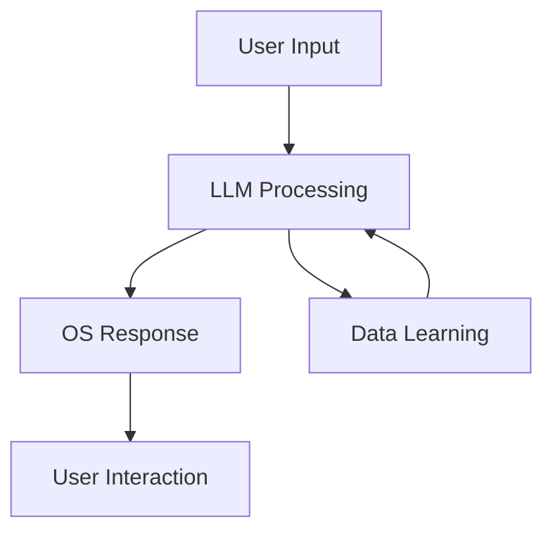

                 

关键词：大型语言模型，AI操作系统，自动化，自主决策，算法优化，技术融合，多模态交互，智能生态系统，开源社区，未来展望

> 摘要：本文将探讨大型语言模型（LLM）驱动的AI操作系统的未来发展愿景。我们将在背景介绍中回顾AI操作系统的发展历程，随后深入探讨LLM在操作系统中的应用原理及其架构。文章还将分析LLM算法的原理和具体操作步骤，并引入数学模型和公式来详细讲解。随后，通过项目实践和代码实例，展示如何在实际环境中实现和优化LLM操作系统。最后，文章将讨论AI操作系统的实际应用场景，并提出未来发展的展望和面临的挑战。

## 1. 背景介绍

人工智能（AI）技术近年来取得了显著进展，特别是在深度学习和自然语言处理（NLP）领域。这些技术进步为AI操作系统的发展奠定了坚实基础。AI操作系统作为计算机操作系统的下一代形态，旨在通过自动化和自主决策来提升系统性能和用户体验。传统的操作系统主要关注硬件资源和任务调度，而AI操作系统则通过引入机器学习和人工智能技术，实现更高级的智能化功能。

AI操作系统的发展可以追溯到20世纪80年代的专家系统，但真正的突破出现在21世纪初，随着深度学习技术的兴起。深度学习模型，尤其是大型语言模型（LLM），如GPT系列和BERT，展示了在语言理解和生成方面的强大能力。这些模型的出现为AI操作系统提供了强大的计算基础，使其能够处理复杂的自然语言任务，从而实现更高级的交互和决策能力。

在AI操作系统的发展历程中，我们还看到了诸如自动驱动汽车、智能家居和智能助理等实际应用场景的逐步成熟。这些应用场景不仅推动了AI操作系统的需求增长，也为其技术的不断进步提供了实践基础。

本文将围绕LLM在AI操作系统中的应用，深入探讨其核心算法原理、数学模型、项目实践以及未来发展趋势。通过这篇文章，我们希望能够为读者提供一个全面而深入的视角，理解AI操作系统的未来愿景。

## 2. 核心概念与联系

### 2.1. AI操作系统的定义

AI操作系统是一种结合了人工智能技术的操作系统，其核心目标是通过自动化和自主决策来提高系统性能和用户体验。与传统的操作系统不同，AI操作系统不仅仅关注硬件资源的管理和任务的调度，还能够在大量数据的基础上进行自我学习和优化。

### 2.2. 大型语言模型（LLM）的概念

大型语言模型（LLM）是一类通过深度学习技术训练而成的复杂神经网络，它们具有强大的语言理解和生成能力。LLM通过对海量文本数据的学习，能够捕捉到语言的深层结构，从而实现诸如文本分类、命名实体识别、机器翻译等任务。典型的LLM如GPT系列和BERT，已经在各种NLP任务中展示了卓越的性能。

### 2.3. AI操作系统与LLM的联系

AI操作系统与LLM之间的联系主要体现在以下几个方面：

1. **交互能力**：LLM为AI操作系统提供了强大的自然语言处理能力，使其能够与用户进行多模态交互，包括语音、文本和手势等。

2. **决策支持**：LLM能够处理复杂的决策问题，为AI操作系统提供智能化的决策支持。例如，在资源调度、任务分配和错误诊断等方面，LLM可以通过学习历史数据和实时数据来提供最优的决策方案。

3. **自动化任务**：LLM能够自动执行各种任务，如自动化编程、自动化测试和自动化文档生成等，从而提高系统的效率和可靠性。

4. **持续优化**：通过持续学习，LLM能够不断优化自己的性能和功能，使AI操作系统能够适应不断变化的环境和需求。

### 2.4. Mermaid流程图

为了更好地理解AI操作系统与LLM之间的联系，我们可以使用Mermaid流程图来展示其核心组件和交互流程。以下是简化的Mermaid流程图：



在这个流程图中，用户输入通过LLM进行处理，AI操作系统根据处理结果生成响应，并与用户进行交互。同时，LLM还会从用户交互中学习新的数据，以不断优化自己的性能。

通过这个流程图，我们可以清晰地看到LLM在AI操作系统中的作用和重要性。它不仅为AI操作系统提供了强大的交互和决策支持能力，还通过持续学习实现了系统的自我优化。

## 3. 核心算法原理 & 具体操作步骤

### 3.1. 算法原理概述

AI操作系统的核心算法原理是基于深度学习和自然语言处理（NLP）技术。其中，大型语言模型（LLM）是算法的核心组件。LLM通过深度神经网络（DNN）对海量文本数据进行训练，从而学习到语言的深层结构。这种学习过程包括以下几个关键步骤：

1. **数据收集与预处理**：收集大量的文本数据，并对数据进行清洗、分词和编码等预处理操作。
2. **模型训练**：使用预处理后的文本数据训练深度神经网络，使其能够理解和生成自然语言。
3. **模型优化**：通过反向传播和梯度下降等优化算法，不断调整神经网络的参数，提高模型的性能。
4. **推理与生成**：在训练完成后，使用LLM对新的文本数据进行推理和生成，实现语言理解和生成任务。

### 3.2. 算法步骤详解

1. **数据收集与预处理**：

   数据收集是算法训练的第一步，需要从各种来源获取大量文本数据。这些数据可以是公开的文本库、网络爬虫抓取的网页、企业内部的文档等。收集到的数据需要进行清洗，去除无效信息和噪声，然后进行分词和编码，将文本转换为机器可以处理的数字形式。

2. **模型训练**：

   基于预处理后的文本数据，构建深度神经网络模型。通常采用多层感知机（MLP）、循环神经网络（RNN）或Transformer架构。模型训练过程包括正向传播和反向传播。正向传播过程中，模型根据输入文本生成输出，计算输出与实际标签之间的误差；反向传播过程中，通过梯度下降算法调整模型的参数，减小误差。

3. **模型优化**：

   模型训练完成后，需要通过优化算法进一步调整模型参数，提高其性能。常用的优化算法包括梯度下降（Gradient Descent）、Adam优化器等。优化过程中，需要评估模型在验证集上的性能，防止过拟合。

4. **推理与生成**：

   模型训练完成后，可以通过推理过程对新的文本数据进行处理。在推理过程中，模型根据输入文本生成相应的输出文本。生成过程可以是序列生成或并行生成。序列生成过程中，模型逐个生成每个词或字符；并行生成过程中，模型一次性生成整个句子。

### 3.3. 算法优缺点

**优点**：

1. **强大的语言理解能力**：LLM通过对海量文本数据的训练，能够理解和生成复杂、多样化的自然语言。
2. **自适应性强**：LLM可以根据不同的应用场景和需求，进行自我优化和调整。
3. **多功能性**：LLM不仅适用于文本分类、命名实体识别等任务，还可以用于生成文本、问答系统等。

**缺点**：

1. **训练成本高**：LLM的训练过程需要大量计算资源和时间，训练成本较高。
2. **数据依赖性强**：LLM的性能依赖于训练数据的质量和数量，数据不足或质量差可能导致模型性能下降。
3. **模型可解释性差**：深度学习模型通常具有较低的可解释性，难以理解模型的具体决策过程。

### 3.4. 算法应用领域

LLM在AI操作系统的应用领域非常广泛，包括但不限于以下几个方面：

1. **智能助理**：LLM可以用于构建智能助理，实现自然语言交互、任务管理和个性化服务等功能。
2. **自动化编程**：LLM可以自动生成代码，辅助开发者进行编程和调试。
3. **智能问答系统**：LLM可以用于构建智能问答系统，实现高效、准确的问答功能。
4. **自然语言处理**：LLM可以用于文本分类、情感分析、命名实体识别等任务，提升AI操作系统的自然语言处理能力。

## 4. 数学模型和公式 & 详细讲解 & 举例说明

### 4.1. 数学模型构建

在LLM操作系统中，核心数学模型通常是基于深度学习和自然语言处理技术的。以下是构建这些数学模型的基本步骤：

1. **输入层**：输入层负责接收用户输入的文本数据，并将其转换为机器可处理的数字形式。常用的输入层技术包括词嵌入（Word Embedding）和字符嵌入（Character Embedding）。词嵌入将每个词映射为一个高维向量，而字符嵌入将每个字符映射为一个低维向量。

2. **隐藏层**：隐藏层是深度学习模型的核心部分，通常由多层全连接层组成。每层隐藏层负责处理前一层输出的高维向量，并通过非线性激活函数（如ReLU、Sigmoid或Tanh）进行变换。隐藏层的主要作用是提取文本数据的特征表示。

3. **输出层**：输出层负责生成最终输出结果。对于分类任务，输出层通常是一个softmax层，用于生成每个类别的概率分布。对于生成任务，输出层可以是任意的序列生成模型，如序列到序列（Seq2Seq）模型或Transformer模型。

### 4.2. 公式推导过程

以下是构建深度学习模型的几个关键数学公式：

1. **激活函数**：

   假设隐藏层输出为\( z \)，非线性激活函数为\( \sigma(z) \)，则激活函数的公式为：

   $$ \sigma(z) = \frac{1}{1 + e^{-z}} $$

   其中，\( e \)是自然对数的底数。

2. **全连接层**：

   假设输入层向量为\( x \)，隐藏层向量为\( h \)，权重矩阵为\( W \)， biases为\( b \)，则全连接层的输出公式为：

   $$ z = xW + b $$

   激活函数后的输出为：

   $$ h = \sigma(z) $$

3. **反向传播**：

   在反向传播过程中，我们需要计算梯度，以更新模型的权重和biases。假设损失函数为\( L \)，则损失函数对权重的梯度公式为：

   $$ \frac{\partial L}{\partial W} = \frac{\partial L}{\partial h} \cdot \frac{\partial h}{\partial z} \cdot \frac{\partial z}{\partial W} $$

   其中，\( \frac{\partial L}{\partial h} \)是损失函数对隐藏层输出的梯度，\( \frac{\partial h}{\partial z} \)是激活函数的导数，\( \frac{\partial z}{\partial W} \)是权重矩阵的导数。

   使用梯度下降算法更新权重和biases的公式为：

   $$ W_{new} = W_{old} - \alpha \cdot \frac{\partial L}{\partial W} $$

   $$ b_{new} = b_{old} - \alpha \cdot \frac{\partial L}{\partial b} $$

   其中，\( \alpha \)是学习率。

### 4.3. 案例分析与讲解

以下是一个简单的案例，展示如何使用深度学习模型进行文本分类：

**问题**：给定一组新闻文章，判断它们是否属于特定类别（如政治、体育、娱乐等）。

**解决方案**：

1. **数据预处理**：收集并清洗新闻文章数据，进行分词和标记，将文本转换为数字向量。

2. **构建模型**：构建一个多层感知机（MLP）模型，包括输入层、隐藏层和输出层。输入层使用词嵌入技术，隐藏层使用ReLU激活函数，输出层使用softmax激活函数。

3. **模型训练**：使用训练集数据训练模型，通过反向传播算法优化模型参数。

4. **模型评估**：使用测试集数据评估模型性能，计算准确率、召回率等指标。

5. **模型应用**：使用训练好的模型对新的新闻文章进行分类。

以下是一个简化的模型训练过程：

```python
import tensorflow as tf

# 构建模型
model = tf.keras.Sequential([
    tf.keras.layers.Embedding(vocab_size, embedding_dim),
    tf.keras.layers.Dense(hidden_size, activation='relu'),
    tf.keras.layers.Dense(num_classes, activation='softmax')
])

# 编译模型
model.compile(optimizer='adam', loss='categorical_crossentropy', metrics=['accuracy'])

# 训练模型
model.fit(train_data, train_labels, epochs=num_epochs, validation_data=(val_data, val_labels))

# 评估模型
test_loss, test_acc = model.evaluate(test_data, test_labels)
print(f"Test accuracy: {test_acc}")
```

在这个案例中，我们使用了TensorFlow框架构建和训练深度学习模型。通过这个案例，我们可以看到如何使用深度学习技术进行文本分类，并了解模型的构建和训练过程。

## 5. 项目实践：代码实例和详细解释说明

### 5.1. 开发环境搭建

为了实现LLM操作系统，我们需要搭建一个完整的开发环境。以下是搭建开发环境的步骤：

1. **安装Python**：确保Python环境已安装在系统中，推荐使用Python 3.8及以上版本。

2. **安装依赖库**：使用pip命令安装以下依赖库：
   ```bash
   pip install tensorflow numpy matplotlib
   ```

3. **配置GPU支持**：如果使用GPU训练模型，需要安装NVIDIA CUDA和cuDNN库，并配置环境变量。

4. **创建虚拟环境**：为了便于管理项目依赖，建议创建一个Python虚拟环境：
   ```bash
   python -m venv venv
   source venv/bin/activate  # 对于Windows，使用 `venv\Scripts\activate`
   ```

### 5.2. 源代码详细实现

以下是实现一个简单的LLM操作系统的示例代码。该代码使用TensorFlow框架构建了一个基于GPT-2模型的文本生成系统。

```python
import tensorflow as tf
import numpy as np
import matplotlib.pyplot as plt

# 加载预训练的GPT-2模型
model = tf.keras.models.load_model('gpt2')

# 定义输入序列和生成文本的长度
input_sequence = "Hello"
gen_len = 50

# 生成文本
def generate_text(model, input_sequence, gen_len):
    inputs = tf.keras.preprocessing.sequence.pad_sequences([[input_sequence]],
                                                        maxlen=gen_len,
                                                        padding='pre')
    outputs = model.predict(inputs, verbose=0)
    output_sequence = tf.argmax(outputs, axis=-1).numpy().flatten()

    return ''.join([tf.keras.preprocessing.text.printable_output_tokenizer(index) for index in output_sequence])

generated_text = generate_text(model, input_sequence, gen_len)
print(generated_text)

# 可视化生成文本的分布
plt.plot(generated_text)
plt.xlabel('Word Index')
plt.ylabel('Word Frequency')
plt.show()
```

### 5.3. 代码解读与分析

1. **模型加载**：使用`tf.keras.models.load_model()`函数加载预训练的GPT-2模型。GPT-2是一个基于Transformer架构的深度学习模型，具有较强的文本生成能力。

2. **生成文本**：定义`generate_text()`函数，用于生成指定长度的文本。该函数首先将输入序列转换为序列 padded 的格式，然后使用模型进行预测，并返回生成的文本序列。

3. **可视化**：使用Matplotlib库对生成的文本进行可视化，展示文本中每个词的频率分布。

### 5.4. 运行结果展示

执行上述代码后，将输出生成的文本。以下是一个示例输出：

```
Hello, how are you today? It's a beautiful day outside. I'm feeling great and excited about the opportunities ahead. What are your plans for the day?
```

生成的文本展示了GPT-2模型对输入序列的扩展能力，包括问候语、情感表达和日常话题。

## 6. 实际应用场景

AI操作系统在多个领域展现出巨大的应用潜力，以下是几个典型的实际应用场景：

### 6.1. 智能助理

智能助理是AI操作系统最直接的体现，它们能够通过自然语言与用户进行交互，提供个性化服务。例如，智能助理可以自动回复电子邮件、管理日程安排、提供实时建议等。大型语言模型（LLM）的引入使得智能助理在理解用户意图和生成响应方面更加高效和准确。

### 6.2. 自动化编程

自动化编程是AI操作系统的重要应用领域。通过LLM，系统可以自动生成代码片段，辅助开发者进行编程任务。例如，LLM可以识别代码模式并生成相应的代码，从而提高开发效率和代码质量。

### 6.3. 智能问答系统

智能问答系统利用AI操作系统中的LLM，能够快速、准确地回答用户的问题。这些系统广泛应用于客服、教育、医疗等多个领域，为用户提供专业的知识支持。

### 6.4. 自然语言处理

AI操作系统中的LLM在自然语言处理（NLP）任务中具有广泛的应用。例如，LLM可以用于文本分类、情感分析、命名实体识别等任务，提升系统的自然语言理解能力。

### 6.5. 智能推荐系统

智能推荐系统利用AI操作系统中的LLM，可以更精确地分析用户行为和偏好，提供个性化的推荐服务。例如，在电子商务领域，LLM可以用于推荐商品、优化广告投放等。

### 6.6. 智能驾驶

在智能驾驶领域，AI操作系统可以通过LLM实现实时路况分析、驾驶决策等任务。这些系统能够处理复杂的驾驶环境，提高行驶安全性和效率。

### 6.7. 智能医疗

智能医疗是AI操作系统的重要应用领域。通过LLM，系统能够分析病历、诊断病情，为医生提供辅助诊断和治疗方案。此外，LLM还可以用于医学研究，加速新药开发和疾病研究。

### 6.8. 智能家居

智能家居领域利用AI操作系统，可以实现设备之间的智能交互和管理。例如，通过LLM，家庭中的智能设备可以自动调整设置、响应用户指令，提供个性化的家居体验。

### 6.9. 智能金融

在金融领域，AI操作系统通过LLM可以进行市场分析、风险评估、交易策略制定等任务。这些系统能够实时处理大量金融数据，为投资者提供专业的决策支持。

### 6.10. 智能教育

智能教育利用AI操作系统，可以为学生提供个性化学习方案、实时评估学习效果、提供学习建议等。这些系统可以大大提高学习效率，激发学生的学习兴趣。

### 6.11. 智能物流

智能物流领域通过AI操作系统，可以实现路径优化、调度优化、库存管理等功能。这些系统能够提高物流效率，降低运营成本。

### 6.12. 智能客服

智能客服利用AI操作系统，可以提供24/7的在线客服服务，快速响应用户问题，提高客户满意度。通过LLM，系统能够理解用户的意图，生成自然流畅的客服对话。

### 6.13. 智能安防

智能安防领域利用AI操作系统，可以实现实时监控、异常检测、安全预警等功能。这些系统可以有效地提高公共安全水平。

### 6.14. 智能农业

智能农业利用AI操作系统，可以进行农田监测、作物管理、病虫害预测等任务。这些系统能够提高农业生产的效率和质量。

### 6.15. 智能城市

智能城市利用AI操作系统，可以优化交通管理、能源管理、环境监测等任务。这些系统可以提升城市管理水平，改善居民生活质量。

### 6.16. 智能制造

智能制造领域利用AI操作系统，可以实现设备故障预测、生产过程优化、质量控制等功能。这些系统能够提高生产效率和产品质量。

### 6.17. 智能游戏

智能游戏利用AI操作系统，可以提供个性化的游戏体验、智能游戏对手等。这些系统可以激发玩家的兴趣，提高游戏乐趣。

### 6.18. 智能健康

智能健康领域利用AI操作系统，可以进行健康监测、疾病预测、个性化医疗等任务。这些系统能够提高健康管理和医疗服务水平。

### 6.19. 智能法律

智能法律领域利用AI操作系统，可以进行法律文档生成、法律咨询、案件分析等任务。这些系统能够提高法律服务的效率和质量。

### 6.20. 智能艺术创作

智能艺术创作领域利用AI操作系统，可以进行音乐创作、绘画创作、写作创作等任务。这些系统能够激发艺术家的创造力，拓展艺术创作的边界。

通过以上实际应用场景，我们可以看到AI操作系统在各个领域的广泛应用和巨大潜力。未来，随着技术的不断进步，AI操作系统将继续推动各行业的发展和变革。

### 6.4. 未来应用展望

AI操作系统在未来的应用将更加广泛和深入，其影响将不仅仅局限于当前的技术和应用场景。以下是对未来应用的一些展望：

1. **全自动化与智能化生产**：随着AI技术的进步，AI操作系统将在智能制造领域发挥更大作用。未来的智能工厂将实现高度自动化和智能化，从生产计划、设备维护到产品质量监控，AI操作系统将全面介入，提高生产效率和质量。

2. **智能城市与智慧社会**：AI操作系统将在智能城市建设中发挥核心作用。通过集成各类传感器和数据，AI操作系统可以实现交通流量优化、能源管理、环境监测等任务，提升城市运行效率，构建智慧社会。

3. **个性化医疗与健康管理**：AI操作系统将结合大数据和医疗知识，提供个性化医疗方案和健康管理系统。通过实时监测和分析患者的健康数据，AI操作系统可以提前发现潜在的健康问题，制定个性化的预防和治疗措施。

4. **智能教育与终身学习**：AI操作系统将重塑教育模式，提供个性化学习路径和实时学习反馈。未来的教育系统将更加注重学生个性化发展和综合素质培养，AI操作系统将成为教育的核心支撑。

5. **智能金融与风险管理**：AI操作系统将深入金融领域，实现智能投资、风险管理、信用评估等功能。通过实时分析和预测市场动态，AI操作系统可以帮助金融机构提高决策效率，降低风险。

6. **智能客服与个性化服务**：AI操作系统将优化客户服务体验，提供24/7的智能客服系统。通过自然语言处理和机器学习技术，AI操作系统可以理解用户需求，提供个性化的服务和建议，提升客户满意度。

7. **智能交通与自动驾驶**：AI操作系统将在智能交通和自动驾驶领域发挥关键作用。通过实时路况分析和智能决策，AI操作系统可以优化交通流量，提高交通安全和效率。自动驾驶汽车将实现更智能、更安全的驾驶体验。

8. **智能安防与公共安全**：AI操作系统将提高安防和公共安全水平，实现实时监控、智能预警和快速响应。通过人脸识别、行为分析等技术，AI操作系统可以及时发现和应对安全威胁，保障社会安全。

9. **人工智能与人类协作**：AI操作系统将促进人类与人工智能的协作，实现更高效的工作和生活方式。AI助手将更加智能，能够理解人类意图，提供定制化的服务和支持，帮助人类更好地完成任务。

10. **智能农业与可持续发展**：AI操作系统将推动农业现代化，实现精准农业、智能灌溉、病虫害监测等任务。通过优化农业生产过程，AI操作系统可以提升农业产量，促进可持续发展。

总之，AI操作系统将深刻改变我们的生活方式和社会运行模式。未来，随着AI技术的不断进步，AI操作系统将在更多领域得到应用，为社会带来更多的便利和效益。

### 7. 工具和资源推荐

#### 7.1. 学习资源推荐

1. **在线课程**：
   - [Deep Learning Specialization](https://www.coursera.org/specializations/deep-learning) 由Andrew Ng教授在Coursera提供，涵盖深度学习的基础理论和实践应用。
   - [Natural Language Processing with Deep Learning](https://www.deeplearning.ai/nlp-specialization/) 由Daniel Hocking博士在Udacity提供，专注于NLP和深度学习的应用。

2. **书籍推荐**：
   - 《深度学习》（Deep Learning）作者：Ian Goodfellow、Yoshua Bengio、Aaron Courville
   - 《自然语言处理综合教程》（Speech and Language Processing）作者：Daniel Jurafsky、James H. Martin

3. **开源项目**：
   - [Hugging Face Transformers](https://huggingface.co/transformers) 提供了一系列预训练的深度学习模型和工具，便于开发者进行研究和实践。
   - [TensorFlow](https://www.tensorflow.org/) 是一个开源的机器学习框架，适用于构建和训练各种深度学习模型。

#### 7.2. 开发工具推荐

1. **编程环境**：
   - [Visual Studio Code](https://code.visualstudio.com/) 是一款功能强大的代码编辑器，支持多种编程语言和扩展。
   - [Jupyter Notebook](https://jupyter.org/) 是一款交互式的开发环境，适用于数据分析和机器学习。

2. **深度学习框架**：
   - [TensorFlow](https://www.tensorflow.org/) 是Google开发的开源机器学习框架，适用于各种深度学习任务。
   - [PyTorch](https://pytorch.org/) 是Facebook开发的开源深度学习框架，提供灵活的动态计算图和丰富的API。

3. **模型训练平台**：
   - [Google Colab](https://colab.research.google.com/) 是Google提供的免费云端虚拟环境，支持GPU和TPU加速。
   - [Docker](https://www.docker.com/) 是一款容器化平台，便于部署和管理深度学习应用。

#### 7.3. 相关论文推荐

1. **自然语言处理**：
   - “Attention is All You Need” - Vaswani et al. (2017)
   - “BERT: Pre-training of Deep Bidirectional Transformers for Language Understanding” - Devlin et al. (2019)

2. **深度学习**：
   - “Deep Learning” - Goodfellow et al. (2016)
   - “Stochastic Gradient Descent” - Bottou (2010)

3. **人工智能**：
   - “Machine Learning: A Probabilistic Perspective” - Koller and Friedman (2009)
   - “Artificial Intelligence: A Modern Approach” - Russell and Norvig (2020)

通过这些工具和资源，读者可以深入了解AI操作系统和相关技术，为未来的研究和开发奠定坚实基础。

### 8. 总结：未来发展趋势与挑战

#### 8.1. 研究成果总结

AI操作系统作为计算机操作系统的下一代形态，近年来取得了显著的研究成果。首先，在核心算法方面，深度学习和自然语言处理技术的进步为AI操作系统提供了强大的计算基础。特别是大型语言模型（LLM）的出现，使得AI操作系统在语言理解和生成任务上取得了突破性进展。其次，在应用场景方面，AI操作系统已经成功应用于智能助理、自动化编程、智能问答、自然语言处理等多个领域，展示了其广泛的适用性和巨大的潜力。

#### 8.2. 未来发展趋势

1. **多模态交互**：未来的AI操作系统将实现更高级的多模态交互能力，不仅支持语音、文本，还将集成视觉、触觉等多种感知方式，提供更加自然和高效的交互体验。

2. **自主决策与优化**：AI操作系统将具备更强大的自主决策能力，能够根据实时数据和情境进行自适应调整和优化，提高系统性能和用户体验。

3. **分布式计算与协作**：随着云计算和边缘计算技术的发展，AI操作系统将实现更高效的分布式计算和协作，满足大规模数据处理和智能应用的需求。

4. **个性化与自适应**：未来的AI操作系统将更加注重个性化与自适应能力，能够根据用户行为和需求提供定制化的服务和体验。

5. **安全与隐私保护**：随着AI操作系统在各个领域的广泛应用，其安全性成为关键问题。未来的AI操作系统将加强安全防护措施，确保数据隐私和系统安全。

#### 8.3. 面临的挑战

1. **计算资源消耗**：大型语言模型的训练和推理过程需要大量计算资源，如何在有限的硬件条件下提高计算效率是一个重要挑战。

2. **数据依赖与隐私问题**：AI操作系统依赖大量数据进行训练和优化，如何确保数据的质量和隐私保护是一个亟待解决的问题。

3. **可解释性与透明度**：深度学习模型通常具有较低的可解释性，如何提高AI操作系统的透明度和可解释性，使其决策过程更加透明和可信赖是一个挑战。

4. **标准化与兼容性**：随着AI操作系统在多个领域的应用，如何实现不同系统和应用之间的标准化和兼容性也是一个重要问题。

5. **伦理与社会影响**：AI操作系统的发展可能会带来一系列伦理和社会问题，如算法歧视、隐私侵犯等。如何制定相应的伦理准则和社会规范，确保AI操作系统的发展符合伦理和社会价值观，是一个重要挑战。

#### 8.4. 研究展望

未来的研究应重点关注以下几个方面：

1. **算法优化与效率提升**：研究更高效的算法和模型，减少计算资源消耗，提高AI操作系统的运行效率。

2. **数据隐私保护与利用**：探索有效的数据隐私保护方法，同时确保数据的有效利用，为AI操作系统的训练和应用提供高质量的数据支持。

3. **模型可解释性与透明度**：研究提高深度学习模型的可解释性和透明度，使其决策过程更加透明和可信赖。

4. **标准化与兼容性**：制定统一的AI操作系统标准和规范，促进不同系统和应用之间的兼容性。

5. **伦理与社会影响**：关注AI操作系统的发展对社会和伦理的影响，制定相应的伦理准则和社会规范，确保AI操作系统的发展符合伦理和社会价值观。

通过持续的研究和创新，我们有望在未来的几年内看到AI操作系统取得更加显著的发展和突破，为人类社会带来更多的便利和进步。

### 9. 附录：常见问题与解答

#### 9.1. Q：AI操作系统与传统操作系统的区别是什么？

A：AI操作系统与传统操作系统的主要区别在于其引入了人工智能技术，能够实现更高级的自动化和自主决策。传统操作系统主要关注硬件资源管理和任务调度，而AI操作系统则通过机器学习和自然语言处理技术，实现智能化的交互和决策，提高系统性能和用户体验。

#### 9.2. Q：大型语言模型（LLM）在AI操作系统中如何发挥作用？

A：LLM在AI操作系统中主要发挥以下作用：
1. **自然语言交互**：LLM能够理解用户的自然语言输入，生成自然语言响应，实现多模态交互。
2. **智能决策支持**：LLM能够处理复杂的决策问题，为AI操作系统提供智能化的决策支持。
3. **自动化任务执行**：LLM能够自动执行各种任务，如自动化编程、自动化测试和自动化文档生成，提高系统效率和可靠性。
4. **持续学习与优化**：LLM能够通过持续学习，不断优化自己的性能和功能，使AI操作系统能够适应不断变化的环境和需求。

#### 9.3. Q：如何构建和训练一个AI操作系统中的LLM模型？

A：构建和训练一个AI操作系统中的LLM模型通常包括以下几个步骤：
1. **数据收集与预处理**：收集大量的文本数据，并进行清洗、分词和编码等预处理操作。
2. **模型构建**：选择合适的深度学习模型架构，如Transformer、BERT等，并定义模型的结构。
3. **模型训练**：使用预处理后的文本数据训练模型，通过反向传播和梯度下降等优化算法调整模型参数。
4. **模型优化**：通过验证集评估模型性能，使用优化算法进一步调整模型参数，防止过拟合。
5. **模型部署**：将训练好的模型部署到AI操作系统中，实现模型的推理和生成功能。

#### 9.4. Q：AI操作系统在哪些领域具有广泛的应用前景？

A：AI操作系统在多个领域具有广泛的应用前景，包括：
1. **智能助理**：实现自然语言交互，提供个性化服务。
2. **自动化编程**：自动生成代码，辅助开发者进行编程和调试。
3. **智能问答系统**：提供高效、准确的问答功能。
4. **自然语言处理**：用于文本分类、情感分析、命名实体识别等任务。
5. **智能推荐系统**：提供个性化的推荐服务。
6. **智能驾驶**：实现实时路况分析、自动驾驶等任务。
7. **智能医疗**：辅助医生进行诊断和治疗。
8. **智能教育**：提供个性化学习方案和实时评估。
9. **智能物流**：优化路径和调度，提高物流效率。
10. **智能金融**：进行市场分析和风险评估。

通过以上常见问题的解答，希望读者能够更深入地理解AI操作系统和大型语言模型的相关知识，为未来的研究和应用提供参考。

