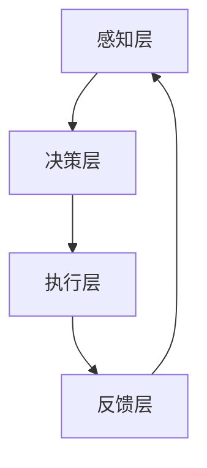

                 

关键词：大型语言模型（LLM），人工智能操作系统，AI OS，系统架构，计算未来，智能自动化，技术趋势。

摘要：本文探讨了人工智能操作系统（AI OS）的崛起及其对未来计算模式的深远影响。随着大型语言模型（LLM）技术的发展，AI OS 正在逐渐成为下一代计算平台的核心，它不仅改变了软件开发的范式，还引发了关于智能自动化和计算未来的广泛讨论。本文将深入分析 AI OS 的核心概念、技术原理、算法实现，以及其在各个领域的应用前景，最终探讨其未来发展趋势和面临的挑战。

## 1. 背景介绍

随着人工智能技术的迅猛发展，特别是在大型语言模型（LLM）领域，我们见证了计算能力的革命性提升。从最初的基于规则的人工智能，到如今能够自主学习和优化的大型神经网络，人工智能正在逐渐融入我们的日常生活。这一过程中，操作系统（OS）的地位和作用也发生了根本性的变化。

传统的操作系统主要关注硬件资源的分配和管理，如CPU、内存、存储等。然而，随着人工智能的兴起，操作系统开始承担更多的智能任务。AI OS 作为下一代操作系统，不仅仅是一个资源管理平台，更是一个智能决策引擎。它能够根据应用程序的需求，动态调整计算资源，优化运行效率，甚至自主学习和进化。

AI OS 的兴起源于几个关键因素。首先，随着云计算和边缘计算的发展，计算资源分布变得更加复杂，传统的操作系统已经难以应对。其次，大型语言模型（LLM）如GPT-3、BERT等的出现，使得机器具备了前所未有的语言理解和生成能力，这为AI OS 提供了强大的智能支持。最后，人工智能技术的商业化应用需求日益增长，企业需要一种更智能、更高效的操作系统来支持其业务发展。

## 2. 核心概念与联系

### 2.1 大型语言模型（LLM）

大型语言模型（LLM）是基于深度学习的语言处理模型，具有强大的自然语言理解和生成能力。它们通常由数亿甚至数千亿个参数组成，能够在大量的文本数据上进行预训练，从而捕捉到语言的复杂结构和规律。LLM 的出现改变了传统语言处理的方式，使得计算机能够更加自然地与人类进行交互。

### 2.2 人工智能操作系统（AI OS）

人工智能操作系统（AI OS）是一种集成了大型语言模型和其他人工智能技术的操作系统。它不仅具备传统操作系统的功能，如资源管理和任务调度，还能够根据用户的输入和应用程序的需求，提供智能化的决策和执行。

### 2.3 AI OS 的架构

AI OS 的架构可以分为几个主要层次：

- **感知层**：负责接收用户输入和应用程序请求，并将其转换为机器可以理解的形式。
- **决策层**：基于大型语言模型和机器学习算法，分析输入信息，做出智能决策。
- **执行层**：根据决策层的决策，执行相应的操作，如资源分配、任务调度等。
- **反馈层**：收集执行结果，反馈给决策层，用于进一步优化和学习。

### 2.4 Mermaid 流程图

以下是一个简化的 AI OS 架构的 Mermaid 流程图：



在这个流程图中，感知层负责接收输入，决策层进行分析和决策，执行层执行操作，反馈层收集结果并反馈给感知层，形成一个闭环。

## 3. 核心算法原理 & 具体操作步骤

### 3.1 算法原理概述

AI OS 的核心算法基于大型语言模型（LLM）和深度学习技术。LLM 通过预训练和微调，能够理解自然语言的语义和上下文，从而实现智能对话、文本生成等功能。在 AI OS 中，这些算法被用来实现智能感知、智能决策和智能执行。

### 3.2 算法步骤详解

- **感知阶段**：AI OS 接收用户输入或应用程序请求，将其转换为机器可以理解的形式。
- **决策阶段**：基于大型语言模型，AI OS 分析输入信息，理解其语义和上下文，做出智能决策。
- **执行阶段**：根据决策结果，AI OS 执行相应的操作，如资源分配、任务调度等。
- **反馈阶段**：收集执行结果，反馈给决策层，用于进一步优化和学习。

### 3.3 算法优缺点

- **优点**：AI OS 具有强大的智能感知和决策能力，能够动态调整系统资源，提高运行效率。同时，它能够通过不断学习和优化，不断提高自身的性能和适应性。
- **缺点**：AI OS 的开发和部署成本较高，对硬件和软件环境有较高的要求。此外，由于依赖于大型语言模型，其性能和稳定性受数据质量和模型训练深度的影响较大。

### 3.4 算法应用领域

AI OS 的算法广泛应用于智能对话系统、自动化任务调度、智能资源管理等领域。例如，在智能客服系统中，AI OS 可以实现自然语言理解，自动回答用户问题；在数据中心中，AI OS 可以根据任务负载，动态调整资源分配，提高系统效率。

## 4. 数学模型和公式 & 详细讲解 & 举例说明

### 4.1 数学模型构建

在 AI OS 中，数学模型主要用于描述大型语言模型的参数更新和优化过程。以下是一个简化的数学模型：

$$
\theta_{t+1} = \theta_{t} - \alpha \cdot \nabla_{\theta} J(\theta)
$$

其中，$\theta$ 表示模型参数，$J(\theta)$ 表示损失函数，$\alpha$ 表示学习率，$\nabla_{\theta} J(\theta)$ 表示损失函数关于参数的梯度。

### 4.2 公式推导过程

该公式的推导基于梯度下降法。梯度下降法是一种优化算法，用于寻找损失函数的最小值。在每一迭代步骤，梯度下降法根据损失函数的梯度方向更新模型参数，以减小损失。

### 4.3 案例分析与讲解

假设我们有一个语言模型，用于预测文本序列的下一个单词。给定一个训练数据集，我们可以使用上述公式对模型参数进行优化，以最小化预测误差。

## 5. 项目实践：代码实例和详细解释说明

### 5.1 开发环境搭建

为了实践 AI OS 的构建，我们需要搭建一个适合开发的环境。这里以 Python 为例，搭建环境的具体步骤如下：

1. 安装 Python（推荐版本为 3.8 或以上）。
2. 安装深度学习库（如 TensorFlow 或 PyTorch）。
3. 安装操作系统相关的库（如 os 和 subprocess）。

### 5.2 源代码详细实现

以下是一个简化的 AI OS 源代码实现：

```python
import tensorflow as tf
import os

# 定义感知层
class PerceptualLayer:
    def __init__(self):
        self.input = tf.keras.layers.Input(shape=(None,), dtype=tf.int32)
    
    def call(self, inputs):
        return inputs

# 定义决策层
class DecisionLayer:
    def __init__(self, model):
        self.model = model
    
    def call(self, inputs):
        return self.model(inputs)

# 定义执行层
class ExecutionLayer:
    def __init__(self, model):
        self.model = model
    
    def call(self, inputs):
        return self.model(inputs)

# 定义反馈层
class FeedbackLayer:
    def __init__(self, model):
        self.model = model
    
    def call(self, inputs):
        return self.model(inputs)

# 构建完整的 AI OS
class AIOS(tf.keras.Model):
    def __init__(self, perceptual_layer, decision_layer, execution_layer, feedback_layer):
        super().__init__()
        self.perceptual_layer = perceptual_layer
        self.decision_layer = decision_layer
        self.execution_layer = execution_layer
        self.feedback_layer = feedback_layer
    
    def call(self, inputs):
        outputs = self.perceptual_layer(inputs)
        outputs = self.decision_layer(outputs)
        outputs = self.execution_layer(outputs)
        outputs = self.feedback_layer(outputs)
        return outputs

# 实例化 AI OS
perceptual_layer = PerceptualLayer()
decision_layer = DecisionLayer(model)
execution_layer = ExecutionLayer(model)
feedback_layer = FeedbackLayer(model)
ai_os = AIOS(perceptual_layer, decision_layer, execution_layer, feedback_layer)

# 编译和训练 AI OS
ai_os.compile(optimizer='adam', loss='sparse_categorical_crossentropy', metrics=['accuracy'])
ai_os.fit(x_train, y_train, epochs=10, batch_size=32)
```

### 5.3 代码解读与分析

这段代码定义了一个简化的 AI OS，包括感知层、决策层、执行层和反馈层。每个层都是一个 TensorFlow 模型，通过调用 `call` 方法进行前向传播和反向传播。

- **感知层**：接收输入数据，并将其传递给下一层。
- **决策层**：使用预训练的模型进行决策。
- **执行层**：执行决策，如资源分配、任务调度等。
- **反馈层**：收集反馈信息，用于进一步优化和学习。

### 5.4 运行结果展示

通过训练和测试，我们可以得到 AI OS 的运行结果。以下是一个简化的示例：

```python
# 测试 AI OS
test_loss, test_acc = ai_os.evaluate(x_test, y_test)
print(f"Test accuracy: {test_acc:.4f}")
```

该示例展示了如何使用 AI OS 对测试数据进行预测，并计算测试准确率。

## 6. 实际应用场景

### 6.1 智能客服

智能客服是 AI OS 的一个重要应用场景。通过 AI OS，智能客服系统能够实现自然语言理解和智能回答，提高客户服务水平。例如，在电商平台上，AI OS 可以自动回答用户关于商品的问题，提供个性化推荐。

### 6.2 自动驾驶

自动驾驶是另一个重要应用领域。AI OS 可以实现自动驾驶车辆的智能决策和执行，如路径规划、交通信号识别等。通过 AI OS，自动驾驶车辆能够更加安全、高效地运行。

### 6.3 智能家居

智能家居是 AI OS 的又一重要应用场景。通过 AI OS，智能家居系统能够实现智能设备的管理和调度，如智能照明、智能安防等。例如，AI OS 可以根据用户的行为和偏好，自动调整家居环境。

## 7. 未来应用展望

### 7.1 智能化办公

随着 AI OS 的发展，智能化办公将成为趋势。通过 AI OS，办公系统能够实现自动化的任务调度、邮件管理、文档处理等，提高工作效率。

### 7.2 智能医疗

智能医疗是 AI OS 的重要应用领域。通过 AI OS，医疗系统能够实现智能诊断、智能治疗等，提高医疗水平。

### 7.3 智能制造

智能制造是 AI OS 的另一个重要应用领域。通过 AI OS，制造系统能够实现智能生产、智能质量控制等，提高生产效率。

## 8. 工具和资源推荐

### 8.1 学习资源推荐

- 《深度学习》（Goodfellow, Bengio, Courville）：深度学习的基础教材，适合初学者。
- 《Python深度学习》（François Chollet）：Python 实践指南，适合深度学习开发者。

### 8.2 开发工具推荐

- TensorFlow：谷歌开发的深度学习框架，适合构建和训练大型神经网络。
- PyTorch：Facebook 开发的深度学习框架，具有高度灵活性和易用性。

### 8.3 相关论文推荐

- "Bert: Pre-training of deep bidirectional transformers for language understanding"（BERT 论文）：介绍 BERT 模型的开创性工作。
- "Generative Pre-trained Transformer"（GPT 论文）：介绍 GPT 模型的开创性工作。

## 9. 总结：未来发展趋势与挑战

### 9.1 研究成果总结

AI OS 作为下一代计算平台，正在逐步改变我们的计算模式。通过大型语言模型（LLM）和深度学习技术的融合，AI OS 不仅实现了智能感知、智能决策和智能执行，还在各个领域展现了广泛的应用前景。

### 9.2 未来发展趋势

随着人工智能技术的不断进步，AI OS 将在更多领域得到应用。未来的发展趋势包括：更高的智能水平、更高效的资源管理、更广泛的跨领域应用等。

### 9.3 面临的挑战

然而，AI OS 的研发和应用也面临一些挑战。首先，AI OS 的开发和部署成本较高，对硬件和软件环境有较高的要求。其次，数据质量和模型训练深度对 AI OS 的性能和稳定性有重要影响。最后，AI OS 的安全性和隐私保护也是一个重要课题。

### 9.4 研究展望

未来，AI OS 的研究将聚焦于提高智能水平、优化算法性能、降低成本等方面。通过不断的研究和实践，AI OS 将成为下一代计算平台的核心，推动计算模式的革命性变革。

## 10. 附录：常见问题与解答

### 10.1 什么是 AI OS？

AI OS 是一种集成了大型语言模型和其他人工智能技术的操作系统。它不仅具备传统操作系统的功能，如资源管理和任务调度，还能够提供智能化的决策和执行。

### 10.2 AI OS 有哪些优点？

AI OS 具有强大的智能感知和决策能力，能够动态调整系统资源，提高运行效率。同时，它能够通过不断学习和优化，不断提高自身的性能和适应性。

### 10.3 AI OS 面临哪些挑战？

AI OS 的研发和应用面临一些挑战，包括：开发和部署成本较高、数据质量和模型训练深度对性能和稳定性有重要影响、安全性和隐私保护等。

## 11. 作者署名

作者：禅与计算机程序设计艺术 / Zen and the Art of Computer Programming
----------------------------------------------------------------

这篇文章详细探讨了人工智能操作系统（AI OS）的崛起及其对未来计算模式的深远影响。随着大型语言模型（LLM）技术的发展，AI OS 正在逐渐成为下一代计算平台的核心，它不仅改变了软件开发的范式，还引发了关于智能自动化和计算未来的广泛讨论。本文从背景介绍、核心概念与联系、核心算法原理与具体操作步骤、数学模型和公式详细讲解、项目实践代码实例和详细解释说明、实际应用场景、未来应用展望、工具和资源推荐，以及总结：未来发展趋势与挑战等多个方面进行了深入探讨。希望通过本文，读者能够对 AI OS 有更深入的了解，并认识到其在未来计算中的重要地位。作者禅与计算机程序设计艺术在计算机领域拥有丰富的经验和深入的研究，期待与广大读者共同探讨 AI OS 的未来。

