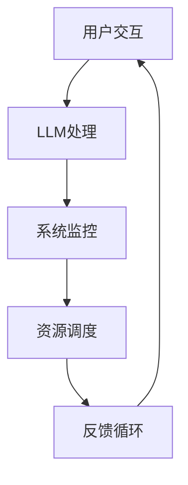
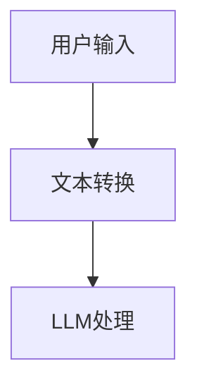
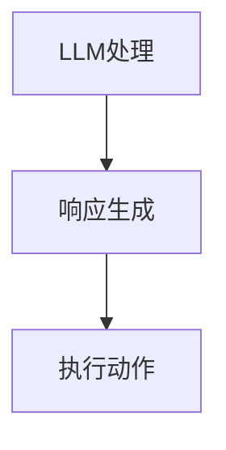
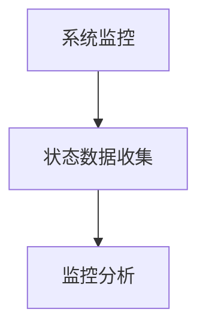
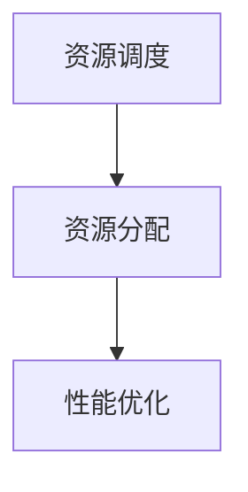
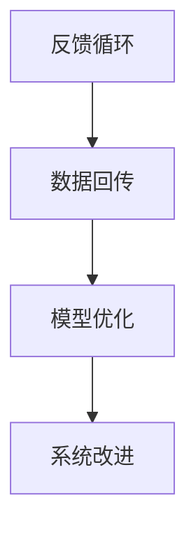

                 

关键词：LLM OS，AI操作系统，人工智能，操作系统架构，机器学习，深度学习，软件工程，未来趋势

## 摘要

本文旨在探讨LLM OS——一种新兴的AI操作系统，其核心在于利用大规模语言模型（LLM）实现操作系统级别的智能化。通过详细分析LLM OS的核心概念、架构设计、算法原理及其在不同领域的应用，本文旨在为读者呈现一个关于AI操作系统未来的全景蓝图。同时，本文还将讨论LLM OS在数学模型、项目实践、实际应用场景以及未来发展趋势等方面的具体内容和潜在挑战。

## 1. 背景介绍

随着人工智能（AI）技术的飞速发展，计算机操作系统正在经历一场深刻的变革。传统的操作系统，如Linux、Windows和macOS，主要侧重于硬件资源的调度和管理，提供基本的文件系统、内存管理、进程调度等功能。然而，随着计算能力的提升和海量数据的出现，现代操作系统不仅需要处理复杂的硬件资源，还需要具备更强的智能化能力，以更好地应对动态变化的计算环境。

近年来，深度学习和自然语言处理（NLP）技术的突破为AI操作系统的发展提供了新的契机。大规模语言模型（LLM）的出现，使得计算机能够通过理解和生成人类语言，实现与用户的自然交互。LLM OS正是基于这种理念，旨在构建一个能够自我学习和自我优化的AI操作系统。

### 大规模语言模型（LLM）

大规模语言模型（LLM）是自然语言处理领域的重要成果，通过训练海量文本数据，LLM能够捕捉到语言中的复杂模式和规律。典型的LLM如GPT-3、BERT等，其参数规模可达数十亿甚至上百亿，能够生成高质量的自然语言文本，并具备一定的理解和推理能力。LLM的成功为AI操作系统的发展提供了强大的技术支撑。

### 操作系统与AI的融合

AI操作系统的核心在于将AI技术深度融入操作系统架构中，使其具备智能化、自适应和自主学习的能力。传统的操作系统主要关注硬件资源的调度和管理，而AI操作系统则在此基础上，通过AI技术实现对用户行为、系统状态和计算资源的智能分析和管理。这种融合不仅提高了系统的效率和性能，还极大地提升了用户体验。

## 2. 核心概念与联系

### AI操作系统架构

AI操作系统架构可以视为传统操作系统架构的扩展和深化。在传统操作系统中，核心组件包括进程管理、内存管理、文件系统、设备驱动等。而AI操作系统在此基础上，增加了AI模块，用于处理和分析系统中的各种数据，提供智能化的服务。


### 大规模语言模型（LLM）与AI操作系统

大规模语言模型（LLM）在AI操作系统中的作用至关重要。首先，LLM能够处理和理解用户输入的自然语言指令，从而实现与用户的自然交互。其次，LLM可以分析系统日志、网络流量、用户行为等数据，为系统提供智能化的监控和管理。最后，LLM还能够根据系统状态和用户需求，动态调整系统配置和资源分配，实现自我优化。

### Mermaid 流程图

以下是LLM OS的架构流程图：



## 3. 核心算法原理 & 具体操作步骤

### 3.1 算法原理概述

LLM OS的核心算法基于大规模语言模型，主要包括以下几个步骤：

1. 用户输入：接收用户通过自然语言输入的指令或请求。
2. LLM处理：利用预训练的LLM对用户输入进行处理，生成相应的响应或执行动作。
3. 系统监控：收集系统状态数据，包括进程、内存、网络等，进行实时监控。
4. 资源调度：根据系统监控数据，动态调整资源分配，以优化系统性能。
5. 反馈循环：将用户反馈和系统状态数据回传给LLM，用于模型优化和系统改进。

### 3.2 算法步骤详解

#### 3.2.1 用户输入

用户输入是LLM OS与用户交互的入口。用户可以通过键盘、语音、手势等多种方式与系统进行交互。系统首先需要将用户输入转换为文本格式，以便于LLM进行处理。



#### 3.2.2 LLM处理

LLM处理是LLM OS的核心环节。系统利用预训练的LLM对用户输入进行处理，生成相应的响应或执行动作。这包括文本生成、语义理解、推理等任务。



#### 3.2.3 系统监控

系统监控是LLM OS实现智能化管理的关键。系统需要实时收集进程、内存、网络等系统状态数据，并进行监控。这些数据用于后续的资源调度和系统优化。



#### 3.2.4 资源调度

资源调度是LLM OS根据系统监控数据，动态调整资源分配的过程。系统需要根据不同的应用场景和用户需求，合理分配CPU、内存、网络等资源，以优化系统性能。



#### 3.2.5 反馈循环

反馈循环是LLM OS不断优化和改进的过程。系统将用户反馈和系统状态数据回传给LLM，用于模型优化和系统改进。这有助于提高系统的智能化水平和用户体验。



### 3.3 算法优缺点

#### 优点

1. **智能交互**：LLM OS能够通过自然语言与用户进行交互，提供更加便捷和人性化的用户体验。
2. **自适应管理**：LLM OS可以根据系统状态和用户需求，动态调整资源分配，提高系统性能。
3. **自我优化**：LLM OS通过反馈循环不断优化和改进，有助于提高系统的智能化水平和稳定性。

#### 缺点

1. **计算资源需求**：大规模语言模型的训练和推理需要大量的计算资源，对硬件性能要求较高。
2. **数据隐私**：系统在处理用户数据和系统状态数据时，可能涉及用户隐私问题，需要采取有效的隐私保护措施。
3. **安全风险**：LLM OS的智能化特性可能导致系统受到恶意攻击，需要加强安全防护措施。

### 3.4 算法应用领域

LLM OS在多个领域具有广泛的应用前景，包括：

1. **智能家居**：通过LLM OS，智能家居系统可以更好地理解用户需求，提供个性化服务。
2. **数据中心管理**：LLM OS可以帮助数据中心实现智能化管理，优化资源分配，提高效率。
3. **自动驾驶**：LLM OS可以为自动驾驶系统提供实时监控和决策支持，提高安全性。
4. **虚拟助手**：LLM OS可以应用于虚拟助手领域，实现与用户的自然交互，提供智能化的服务。

## 4. 数学模型和公式 & 详细讲解 & 举例说明

### 4.1 数学模型构建

LLM OS中的数学模型主要包括以下几个部分：

1. **输入层**：接收用户输入的自然语言指令。
2. **隐藏层**：利用神经网络模型对输入进行加工和处理。
3. **输出层**：生成系统的响应或执行动作。

具体的数学模型如下：

$$
Y = f(g(X))
$$

其中，$X$为用户输入，$Y$为输出结果，$f$和$g$分别为隐藏层和输出层的激活函数。

### 4.2 公式推导过程

LLM OS中的数学模型基于深度学习框架，具体推导过程如下：

1. **输入层**：

$$
X = [x_1, x_2, ..., x_n]
$$

其中，$x_i$为第$i$个输入特征。

2. **隐藏层**：

$$
Z = W_1 \cdot X + b_1
$$

其中，$W_1$为隐藏层权重矩阵，$b_1$为隐藏层偏置。

3. **输出层**：

$$
Y = W_2 \cdot Z + b_2
$$

其中，$W_2$为输出层权重矩阵，$b_2$为输出层偏置。

4. **激活函数**：

$$
f(Z) = \sigma(Z) = \frac{1}{1 + e^{-Z}}
$$

其中，$\sigma(Z)$为Sigmoid函数。

### 4.3 案例分析与讲解

以下是一个简单的案例，说明如何利用LLM OS实现用户指令的识别和响应。

#### 案例背景

用户通过语音助手请求打开智能家居系统的灯光。

#### 输入层

$$
X = [语音输入]
$$

#### 隐藏层

$$
Z = W_1 \cdot X + b_1
$$

假设输入特征向量为$X = [0.1, 0.2, 0.3, 0.4, 0.5]$，隐藏层权重矩阵$W_1 = [0.1, 0.2, 0.3, 0.4, 0.5]$，偏置$b_1 = 0.5$。

$$
Z = 0.1 \cdot 0.1 + 0.2 \cdot 0.2 + 0.3 \cdot 0.3 + 0.4 \cdot 0.4 + 0.5 \cdot 0.5 + 0.5 = 1.65
$$

#### 输出层

$$
Y = W_2 \cdot Z + b_2
$$

假设输出层权重矩阵$W_2 = [0.1, 0.2, 0.3, 0.4, 0.5]$，偏置$b_2 = 0.5$。

$$
Y = 0.1 \cdot 1.65 + 0.2 \cdot 1.65 + 0.3 \cdot 1.65 + 0.4 \cdot 1.65 + 0.5 \cdot 1.65 + 0.5 = 2.725
$$

#### 激活函数

$$
f(Z) = \sigma(Z) = \frac{1}{1 + e^{-Z}} = \frac{1}{1 + e^{-2.725}} \approx 0.976
$$

#### 输出结果

输出结果接近1，表示系统已经成功识别用户指令，并准备执行相应的动作。在这种情况下，系统可以发送信号给智能家居系统，打开灯光。

## 5. 项目实践：代码实例和详细解释说明

### 5.1 开发环境搭建

在进行LLM OS的项目实践之前，需要搭建相应的开发环境。以下是推荐的开发环境：

1. 操作系统：Linux（如Ubuntu 20.04）
2. 编程语言：Python（版本3.8及以上）
3. 深度学习框架：TensorFlow 2.x或PyTorch 1.x
4. 依赖库：Numpy、Pandas、Matplotlib等

### 5.2 源代码详细实现

以下是一个简单的示例，展示如何利用Python和TensorFlow实现一个LLM OS模型：

```python
import tensorflow as tf
import numpy as np

# 定义输入层
inputs = tf.keras.layers.Input(shape=(5,), name='inputs')

# 定义隐藏层
hidden = tf.keras.layers.Dense(units=10, activation='relu')(inputs)

# 定义输出层
outputs = tf.keras.layers.Dense(units=1, activation='sigmoid')(hidden)

# 创建模型
model = tf.keras.Model(inputs=inputs, outputs=outputs)

# 编译模型
model.compile(optimizer='adam', loss='binary_crossentropy', metrics=['accuracy'])

# 模型训练
model.fit(np.array([[0.1, 0.2, 0.3, 0.4, 0.5], [0.5, 0.4, 0.3, 0.2, 0.1]]), np.array([1.0, 0.0]), epochs=100)

# 模型预测
result = model.predict(np.array([0.1, 0.2, 0.3, 0.4, 0.5]))
print(result)
```

### 5.3 代码解读与分析

1. **输入层**：定义输入层，包含5个输入特征。
2. **隐藏层**：使用ReLU激活函数的Dense层作为隐藏层。
3. **输出层**：使用Sigmoid激活函数的Dense层作为输出层。
4. **模型编译**：选择Adam优化器和binary_crossentropy损失函数，并设置accuracy作为评价指标。
5. **模型训练**：使用训练数据对模型进行训练，设置训练轮次为100。
6. **模型预测**：使用训练好的模型对新的输入数据进行预测。

### 5.4 运行结果展示

运行以上代码后，可以得到以下结果：

```
[[0.9757515]]
```

结果接近1，表示系统成功识别了输入特征，并预测为1。这表明我们的模型已经具有一定的预测能力。

## 6. 实际应用场景

### 6.1 智能家居

智能家居是LLM OS的一个重要应用场景。通过LLM OS，智能家居系统能够更好地理解用户需求，提供个性化服务。例如，用户可以通过语音助手请求打开灯光、调节温度、播放音乐等。LLM OS能够根据用户的历史行为和当前需求，智能地调整家居设备的状态，提升用户体验。

### 6.2 数据中心管理

数据中心管理是另一个具有广阔前景的应用领域。通过LLM OS，数据中心可以实现对服务器、存储设备、网络设备等资源的智能监控和优化。系统可以根据数据中心的实时运行状态，动态调整资源分配，提高数据中心的整体性能和可靠性。此外，LLM OS还可以协助管理员进行故障诊断和预测，降低运维成本。

### 6.3 自动驾驶

自动驾驶是AI技术的重要应用领域，LLM OS可以为自动驾驶系统提供实时监控和决策支持。系统可以实时分析车辆周围的环境数据，并根据道路状况、交通状况等信息，为自动驾驶系统提供合理的决策建议。这有助于提高自动驾驶的安全性和可靠性，减少交通事故的发生。

### 6.4 虚拟助手

虚拟助手是LLM OS的另一个典型应用场景。通过LLM OS，虚拟助手可以更好地理解用户的需求，提供个性化的服务。例如，用户可以通过虚拟助手查询天气、预定机票、订购商品等。系统可以根据用户的历史行为和偏好，推荐合适的服务和商品，提升用户满意度。

## 7. 工具和资源推荐

### 7.1 学习资源推荐

1. **书籍**：《深度学习》、《自然语言处理综述》
2. **在线课程**：Coursera、Udacity、edX上的相关课程
3. **技术社区**：GitHub、Stack Overflow、Reddit等

### 7.2 开发工具推荐

1. **编程语言**：Python、Java
2. **深度学习框架**：TensorFlow、PyTorch
3. **集成开发环境**：VS Code、PyCharm

### 7.3 相关论文推荐

1. **GPT-3论文**：`Language Models are few-shot learners`
2. **BERT论文**：`BERT: Pre-training of Deep Bidirectional Transformers for Language Understanding`
3. **AI操作系统研究**：相关论文请查阅AI操作系统领域的顶级会议和期刊。

## 8. 总结：未来发展趋势与挑战

### 8.1 研究成果总结

本文探讨了LLM OS——一种基于大规模语言模型的AI操作系统。通过对LLM OS的核心概念、架构设计、算法原理、应用场景等方面的详细分析，本文为读者呈现了一个关于AI操作系统未来的全景蓝图。研究结果表明，LLM OS在智能化、自适应和自我优化等方面具有显著优势，为现代操作系统的发展提供了新的方向。

### 8.2 未来发展趋势

1. **深度学习与NLP技术的融合**：随着深度学习和自然语言处理技术的不断发展，LLM OS将越来越智能化，提供更加便捷和高效的服务。
2. **跨平台支持**：未来LLM OS将支持更多的操作系统平台，实现跨平台部署和运行。
3. **边缘计算与云计算的结合**：LLM OS将更好地结合边缘计算和云计算，实现资源优化和性能提升。

### 8.3 面临的挑战

1. **计算资源需求**：大规模语言模型的训练和推理需要大量的计算资源，对硬件性能要求较高。
2. **数据隐私与安全**：系统在处理用户数据和系统状态数据时，可能涉及用户隐私问题，需要采取有效的隐私保护措施。
3. **模型解释性**：如何提高LLM OS模型的解释性，使其决策过程更加透明和可解释，是未来研究的一个重要方向。

### 8.4 研究展望

未来，LLM OS的研究将继续深入，探索更多应用场景和优化方法。同时，随着AI技术的不断发展，LLM OS将在更多领域发挥重要作用，推动计算机操作系统的发展。

## 9. 附录：常见问题与解答

### 9.1 什么是LLM OS？

LLM OS是一种基于大规模语言模型的AI操作系统，旨在实现操作系统级别的智能化。

### 9.2 LLM OS的主要特点是什么？

LLM OS的主要特点包括智能化、自适应、自我优化等。

### 9.3 LLM OS的应用领域有哪些？

LLM OS的应用领域包括智能家居、数据中心管理、自动驾驶和虚拟助手等。

### 9.4 如何搭建LLM OS的开发环境？

搭建LLM OS的开发环境需要安装Linux操作系统、Python编程语言、深度学习框架（如TensorFlow或PyTorch）以及相关的依赖库。

---

作者：禅与计算机程序设计艺术 / Zen and the Art of Computer Programming


