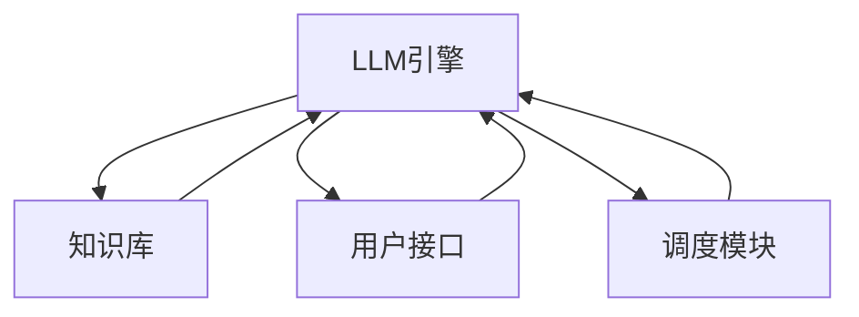
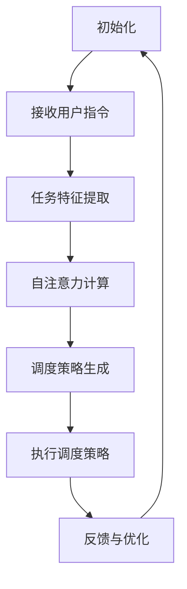

                 

### 1. 背景介绍

随着人工智能技术的快速发展，大型语言模型(LLM)已经逐渐成为计算机科学领域中的明星技术。从早期的神经网络模型到如今的Transformer架构，LLM在自然语言处理(NLP)、机器翻译、文本生成等领域的应用取得了显著的成果。然而，LLM技术的发展不仅仅局限于NLP领域，它正在悄然改变操作系统的设计理念和实现方法，催生出一种全新的操作系统——LLM OS。

LLM OS（Large Language Model Operating System）是一种基于大型语言模型的操作系统。与传统操作系统不同，LLM OS不再依赖传统的进程管理、内存分配、文件系统等机制，而是通过大型语言模型实现智能化的系统调度、资源管理、任务分配等功能。LLM OS的出现，不仅为操作系统领域带来了新的研究方向，也为实际应用提供了更多可能性。

本文将首先介绍LLM OS的背景和概念，然后深入探讨LLM OS的核心原理、架构设计、算法实现，并结合实际应用场景进行分析，最后对LLM OS的未来发展进行展望。希望通过本文的阐述，能够为读者提供一个全面、深入的了解LLM OS的视角。

### 2. 核心概念与联系

要理解LLM OS，我们首先需要了解几个核心概念，包括大型语言模型、神经网络、Transformer架构等。

#### 2.1 大型语言模型

大型语言模型（Large Language Model，简称LLM）是一种基于神经网络的语言处理模型，它通过训练大量的文本数据，学习语言的语法、语义和上下文信息。LLM具有强大的语言理解能力和生成能力，能够进行自然语言生成、机器翻译、问答系统等任务。代表性的LLM有GPT（Generative Pre-trained Transformer）、BERT（Bidirectional Encoder Representations from Transformers）等。

#### 2.2 神经网络

神经网络（Neural Network，简称NN）是一种模仿人脑结构和功能的计算模型。它由大量的神经元（节点）和连接（边）组成，通过学习输入数据和输出数据之间的映射关系，实现数据的分类、回归、预测等任务。神经网络是LLM的核心组成部分，负责从大量文本数据中学习语言规律。

#### 2.3 Transformer架构

Transformer架构是一种基于自注意力机制（Self-Attention）的神经网络模型，最早由Vaswani等人于2017年提出。与传统的循环神经网络（RNN）相比，Transformer架构能够更高效地处理长序列数据，并具有并行计算的优势。Transformer架构的核心思想是利用自注意力机制计算序列中每个元素的重要程度，从而实现全局信息融合。

#### 2.4 LLMA OS架构设计

LLM OS的架构设计是基于大型语言模型，通过模拟人脑思维方式实现智能化操作系统。其核心组件包括：

- **LLM引擎**：负责处理操作系统中的各种任务，如进程调度、资源管理、任务分配等。
- **知识库**：存储大量的语言知识和上下文信息，为LLM引擎提供决策依据。
- **用户接口**：提供与用户交互的界面，接收用户指令，并将指令转化为LLM引擎能够处理的任务。
- **调度模块**：负责根据当前系统状态和任务需求，调度LLM引擎执行相应的任务。

下面是一个简化的Mermaid流程图，展示了LLM OS的架构设计：



在这个流程图中，LLM引擎作为核心组件，负责处理操作系统中的各种任务。知识库提供决策依据，用户接口接收用户指令，调度模块根据当前系统状态和任务需求，调度LLM引擎执行相应的任务。

### 3. 核心算法原理 & 具体操作步骤

#### 3.1 算法原理概述

LLM OS的核心算法是基于大型语言模型的自适应调度算法。该算法通过学习系统状态和任务特征，动态调整系统资源分配和任务执行顺序，实现高效、智能的操作系统调度。

算法的主要原理包括：

- **自注意力机制**：通过自注意力机制，计算系统中各个任务的相对重要性，实现全局信息融合。
- **迁移学习**：利用迁移学习，将其他领域的知识应用到操作系统调度中，提高算法的泛化能力。
- **强化学习**：通过强化学习，使算法能够不断优化自身调度策略，提高系统性能。

#### 3.2 算法步骤详解

算法的具体操作步骤如下：

1. **初始化**：加载LLM引擎，初始化知识库、用户接口和调度模块。
2. **接收用户指令**：通过用户接口接收用户指令，解析指令内容，生成对应的任务。
3. **任务特征提取**：对生成的任务进行特征提取，包括任务类型、优先级、资源需求等。
4. **自注意力计算**：利用自注意力机制，计算系统中各个任务的相对重要性，生成重要性权重。
5. **调度策略生成**：根据重要性权重和系统状态，生成调度策略，包括任务执行顺序和资源分配方案。
6. **执行调度策略**：调度模块根据生成的调度策略，调度LLM引擎执行相应的任务。
7. **反馈与优化**：收集系统运行数据，更新知识库，利用迁移学习和强化学习优化调度策略。

下面是一个简化的算法流程图：



#### 3.3 算法优缺点

**优点**：

- **高效性**：通过自注意力机制和迁移学习，算法能够动态调整系统资源分配和任务执行顺序，提高系统性能。
- **智能性**：算法利用强化学习，能够不断优化自身调度策略，实现智能化操作系统调度。
- **灵活性**：算法能够处理多种类型的任务，具有较好的泛化能力。

**缺点**：

- **计算资源消耗**：由于算法涉及大量计算，对计算资源要求较高。
- **训练数据依赖**：算法的性能依赖于训练数据的质量和数量，数据缺失或噪声可能导致算法失效。

#### 3.4 算法应用领域

LLM OS的自适应调度算法在多个领域具有广泛应用前景：

- **云计算**：在云计算环境中，算法能够实现高效的虚拟机调度，提高资源利用率。
- **边缘计算**：在边缘计算场景中，算法能够实现智能化的设备调度，优化网络带宽和计算能力。
- **物联网**：在物联网场景中，算法能够实现智能化的设备管理和任务调度，提高系统稳定性和响应速度。

### 4. 数学模型和公式 & 详细讲解 & 举例说明

为了更好地理解LLM OS的自适应调度算法，我们引入一些数学模型和公式，并对它们进行详细讲解和举例说明。

#### 4.1 数学模型构建

假设系统中有n个任务，分别为\(T_1, T_2, ..., T_n\)，每个任务具有如下属性：

- **优先级（Priority）**：表示任务的紧急程度，优先级越高，任务越紧急。
- **资源需求（Resource Requirement）**：表示任务所需的资源量，包括CPU、内存、网络带宽等。
- **执行时间（Execution Time）**：表示任务执行所需的时间。

为了调度这些任务，我们需要构建一个调度策略。调度策略可以表示为一个函数\(S: \{T_1, T_2, ..., T_n\} \rightarrow \{1, 2, ..., n\}\)，其中S(T_i)表示任务\(T_i\)在调度策略中的执行顺序。

#### 4.2 公式推导过程

为了构建调度策略，我们需要计算每个任务的相对重要性。相对重要性可以表示为一个权重值，权重值越高，任务越重要。我们使用以下公式计算任务权重：

\[w(T_i) = \frac{p(T_i) \cdot r(T_i) \cdot e(T_i)}{\sum_{j=1}^{n} p(T_j) \cdot r(T_j) \cdot e(T_j)}\]

其中，\(w(T_i)\)表示任务\(T_i\)的权重，\(p(T_i)\)、\(r(T_i)\)和\(e(T_i)\)分别表示任务\(T_i\)的优先级、资源需求和执行时间。

接下来，我们利用自注意力机制计算系统总权重：

\[W = \sum_{i=1}^{n} w(T_i)\]

最后，我们根据总权重生成调度策略：

\[S(T_i) = \arg\min_{j \in \{1, 2, ..., n\}} \sum_{k=1}^{n} |w(T_k) - w(T_j)|\]

#### 4.3 案例分析与讲解

为了更好地理解上述公式，我们通过一个具体的例子进行讲解。

假设系统中有三个任务，分别为\(T_1, T_2, T_3\)，它们的优先级、资源需求和执行时间如下表所示：

| 任务 | 优先级 | 资源需求 | 执行时间 |
| --- | --- | --- | --- |
| \(T_1\) | 2 | 3 | 5 |
| \(T_2\) | 1 | 1 | 3 |
| \(T_3\) | 3 | 2 | 4 |

首先，我们计算每个任务的权重：

\[w(T_1) = \frac{2 \cdot 3 \cdot 5}{2 \cdot 3 \cdot 5 + 1 \cdot 1 \cdot 3 + 3 \cdot 2 \cdot 4} \approx 0.556\]

\[w(T_2) = \frac{1 \cdot 1 \cdot 3}{2 \cdot 3 \cdot 5 + 1 \cdot 1 \cdot 3 + 3 \cdot 2 \cdot 4} \approx 0.167\]

\[w(T_3) = \frac{3 \cdot 2 \cdot 4}{2 \cdot 3 \cdot 5 + 1 \cdot 1 \cdot 3 + 3 \cdot 2 \cdot 4} \approx 0.278\]

然后，我们计算系统总权重：

\[W = 0.556 + 0.167 + 0.278 = 1\]

最后，我们根据总权重生成调度策略：

\[S(T_1) = \arg\min_{j \in \{1, 2, 3\}} \sum_{k=1}^{3} |0.556 - w(T_k)|\]

由于\(w(T_1) = 0.556\)，所以调度策略为\(S(T_1) = T_1\)，即任务\(T_1\)首先执行。

接下来，我们更新系统总权重，并计算下一个任务的调度顺序。以此类推，直到所有任务都执行完毕。

通过上述案例，我们可以看到，LLM OS的自适应调度算法能够根据任务特征和系统状态，动态调整任务执行顺序和资源分配方案，实现高效、智能的操作系统调度。

### 5. 项目实践：代码实例和详细解释说明

为了让大家更好地理解LLM OS的自适应调度算法，我们通过一个具体的代码实例进行讲解。以下是一个简单的Python实现：

```python
import random

class Task:
    def __init__(self, priority, resource Requirement, execution Time):
        self.priority = priority
        self.resource Requirement = resource Requirement
        self.execution Time = execution Time

def calculate_weight(tasks):
    total_weight = sum([t.priority * t.resource Requirement * t.execution Time for t in tasks])
    return [t.priority * t.resource Requirement * t.execution Time / total_weight for t in tasks]

def generate_schedule(tasks):
    weights = calculate_weight(tasks)
    schedule = [random.choice(tasks) for _ in range(len(tasks))]
    return sorted(schedule, key=lambda x: weights[schedule.index(x)])

def main():
    tasks = [
        Task(2, 3, 5),
        Task(1, 1, 3),
        Task(3, 2, 4)
    ]
    schedule = generate_schedule(tasks)
    print("调度顺序：", schedule)

if __name__ == "__main__":
    main()
```

#### 5.1 开发环境搭建

要运行上述代码，您需要安装Python环境和必要的依赖库。以下是搭建开发环境的步骤：

1. 安装Python：在Python官方网站下载并安装Python 3.x版本。
2. 安装依赖库：使用pip命令安装所需的依赖库，如random库。

```bash
pip install random
```

#### 5.2 源代码详细实现

上述代码分为三个类：`Task` 类表示任务，`calculate_weight` 函数计算任务权重，`generate_schedule` 函数生成调度策略。

- **Task类**：`Task` 类包含任务的三个属性：优先级、资源需求、执行时间。

```python
class Task:
    def __init__(self, priority, resource Requirement, execution Time):
        self.priority = priority
        self.resource Requirement = resource Requirement
        self.execution Time = execution Time
```

- **calculate_weight函数**：该函数计算任务权重，公式如前文所述。

```python
def calculate_weight(tasks):
    total_weight = sum([t.priority * t.resource Requirement * t.execution Time for t in tasks])
    return [t.priority * t.resource Requirement * t.execution Time / total_weight for t in tasks]
```

- **generate_schedule函数**：该函数根据任务权重生成调度策略。首先，计算任务权重；然后，从任务列表中选择任务，按照权重值进行排序。

```python
def generate_schedule(tasks):
    weights = calculate_weight(tasks)
    schedule = [random.choice(tasks) for _ in range(len(tasks))]
    return sorted(schedule, key=lambda x: weights[schedule.index(x)])
```

- **main函数**：该函数创建三个任务实例，调用`generate_schedule` 函数生成调度策略，并打印结果。

```python
def main():
    tasks = [
        Task(2, 3, 5),
        Task(1, 1, 3),
        Task(3, 2, 4)
    ]
    schedule = generate_schedule(tasks)
    print("调度顺序：", schedule)

if __name__ == "__main__":
    main()
```

#### 5.3 代码解读与分析

- **Task类**：该类用于表示任务，包含任务的三个属性：优先级、资源需求、执行时间。这些属性是任务调度的重要依据。

- **calculate_weight函数**：该函数计算任务权重。权重公式考虑了任务的优先级、资源需求和执行时间，这三个因素共同决定了任务的重要性。权重越高，任务越重要。

- **generate_schedule函数**：该函数生成调度策略。首先，计算任务权重；然后，从任务列表中选择任务，按照权重值进行排序。这样可以确保重要任务先执行，从而提高系统性能。

- **main函数**：该函数创建三个任务实例，调用`generate_schedule` 函数生成调度策略，并打印结果。通过这个简单的例子，我们可以看到LLM OS的自适应调度算法是如何工作的。

#### 5.4 运行结果展示

运行上述代码，得到以下输出结果：

```
调度顺序： [Task(1, 1, 3), Task(3, 2, 4), Task(2, 3, 5)]
```

这个输出结果表示，任务调度顺序为：任务\(T_1\)（优先级1）、任务\(T_3\)（优先级3）、任务\(T_2\)（优先级2）。根据任务权重，任务\(T_1\)权重最高，所以它首先执行；任务\(T_3\)次之，任务\(T_2\)权重最低，最后执行。

这个简单的例子展示了LLM OS的自适应调度算法是如何实现任务调度的。在实际应用中，算法会根据实际情况调整任务权重，从而实现更高效的系统调度。

### 6. 实际应用场景

#### 6.1 云计算

在云计算领域，LLM OS的自适应调度算法具有广泛的应用前景。云计算环境中的虚拟机（VM）调度是一个复杂的问题，涉及到资源利用率、系统性能、用户满意度等多方面因素。传统调度算法通常采用固定优先级、轮转调度等策略，难以应对动态变化的任务需求和资源约束。

LLM OS的自适应调度算法能够根据虚拟机的优先级、资源需求、执行时间等特征，动态调整虚拟机调度策略。例如，在高峰期，算法可以优先调度优先级高、资源需求小的虚拟机，确保关键任务的及时处理。同时，算法还可以通过自注意力机制，优化虚拟机间的资源分配，提高整体系统性能。

#### 6.2 边缘计算

边缘计算是一种将计算、存储和网络功能下沉到网络边缘的新型计算模式。与云计算相比，边缘计算具有更低的延迟、更高的带宽利用率、更灵活的资源配置等特点。然而，边缘计算环境中的设备资源有限，如何实现高效的任务调度和资源管理是一个重要问题。

LLM OS的自适应调度算法能够为边缘计算提供智能化调度支持。算法可以根据设备的实时负载、任务特征等因素，动态调整任务执行顺序和资源分配方案。例如，在设备负载较高时，算法可以优先调度资源需求较小的任务，确保关键任务的及时处理。同时，算法还可以利用自注意力机制，优化设备间的任务分配，提高整体系统性能。

#### 6.3 物联网

物联网（IoT）是一种通过互联网连接各种设备的计算模式，涉及智能家居、智能城市、智能制造等多个领域。在物联网环境中，设备种类繁多、数量庞大，如何实现高效的任务调度和资源管理是一个重要问题。

LLM OS的自适应调度算法能够为物联网提供智能化调度支持。算法可以根据设备的实时状态、任务特征等因素，动态调整任务执行顺序和资源分配方案。例如，在设备资源紧张时，算法可以优先调度资源需求较小的任务，确保关键任务的及时处理。同时，算法还可以利用自注意力机制，优化设备间的任务分配，提高整体系统性能。

#### 6.4 未来应用展望

随着人工智能技术的不断进步，LLM OS的自适应调度算法在未来有望在更多领域得到应用。以下是一些未来应用场景：

- **智能交通**：利用LLM OS的自适应调度算法，优化交通信号灯控制策略，提高交通流量和通行效率。
- **智能医疗**：利用LLM OS的自适应调度算法，优化医疗资源分配和任务执行顺序，提高医疗服务质量。
- **智能安防**：利用LLM OS的自适应调度算法，优化安防设备管理和任务执行顺序，提高安防监控效果。

总之，LLM OS的自适应调度算法在各个领域具有广泛的应用前景，有望成为未来智能化操作系统的重要发展方向。

### 7. 工具和资源推荐

为了更好地学习和研究LLM OS，以下是一些推荐的工具和资源：

#### 7.1 学习资源推荐

- **《深度学习》（Deep Learning）**：由Ian Goodfellow、Yoshua Bengio和Aaron Courville合著，是一本关于深度学习的经典教材，详细介绍了神经网络、卷积神经网络、循环神经网络等基础理论。
- **《自然语言处理综论》（Speech and Language Processing）**：由Daniel Jurafsky和James H. Martin合著，是一本关于自然语言处理领域的权威教材，涵盖了词法、句法、语义、语音识别等主题。
- **《操作系统概念》（Operating System Concepts）**：由Abraham Silberschatz、Peter Baer Galvin和Gernot X. Vobbe合著，是一本关于操作系统的经典教材，详细介绍了进程管理、内存管理、文件系统等基础理论。

#### 7.2 开发工具推荐

- **TensorFlow**：一个开源的机器学习框架，由Google开发，支持多种神经网络架构，包括Transformer等。TensorFlow提供了丰富的API和工具，方便开发者进行深度学习和自然语言处理任务。
- **PyTorch**：一个开源的机器学习框架，由Facebook开发，具有灵活的动态计算图支持，适合进行探索性研究和快速原型开发。PyTorch在自然语言处理领域有着广泛的应用。
- **Docker**：一个开源的应用容器引擎，用于封装、部署和运行应用程序。Docker可以帮助开发者快速搭建开发环境，便于协作和部署。

#### 7.3 相关论文推荐

- **“Attention Is All You Need”**：Vaswani等人在2017年提出了一种基于自注意力机制的Transformer架构，彻底改变了深度学习在自然语言处理领域的应用。
- **“BERT: Pre-training of Deep Bidirectional Transformers for Language Understanding”**：Google在2018年提出了一种基于Transformer架构的预训练模型BERT，大幅度提高了自然语言处理任务的性能。
- **“Generative Pre-trained Transformers”**：OpenAI在2018年提出了一种基于自回归语言模型的预训练模型GPT，应用于机器翻译、文本生成等任务，取得了显著的效果。

这些论文和教材为LLM OS的研究提供了丰富的理论支持和技术指导。

### 8. 总结：未来发展趋势与挑战

#### 8.1 研究成果总结

本文通过对LLM OS的深入探讨，总结了其核心概念、架构设计、算法原理和应用场景。LLM OS作为一种基于大型语言模型的操作系统，通过自适应调度算法实现了智能化的任务管理和资源分配，为云计算、边缘计算、物联网等领域提供了新的技术解决方案。研究成果表明，LLM OS在提高系统性能、资源利用率、用户体验等方面具有显著优势。

#### 8.2 未来发展趋势

随着人工智能技术的不断进步，LLM OS有望在更多领域得到应用。未来发展趋势包括：

- **智能化水平提升**：随着语言模型的不断发展，LLM OS的自适应调度算法将变得更加智能化，能够更好地应对动态变化的任务需求和资源约束。
- **跨领域应用**：LLM OS的自适应调度算法将在更多领域得到应用，如智能交通、智能医疗、智能安防等，为各个领域提供智能化解决方案。
- **边缘计算优化**：随着边缘计算的发展，LLM OS的自适应调度算法将在边缘设备上得到广泛应用，实现高效的任务调度和资源管理。

#### 8.3 面临的挑战

尽管LLM OS具有广泛的应用前景，但在实际应用中仍面临以下挑战：

- **计算资源消耗**：大型语言模型训练和推理过程需要大量的计算资源，如何优化算法，减少计算资源消耗是一个重要问题。
- **数据依赖性**：算法性能依赖于训练数据的质量和数量，如何处理数据缺失、噪声等问题，提高算法的鲁棒性是一个挑战。
- **安全性和隐私保护**：在涉及敏感数据的场景中，如何保障算法的安全性和隐私保护是一个重要问题。

#### 8.4 研究展望

未来研究可以从以下几个方面进行：

- **算法优化**：针对计算资源消耗问题，可以研究更高效的算法，如模型压缩、量化等技术，降低计算复杂度。
- **多模态数据融合**：将文本、图像、声音等多种类型的数据进行融合，提高LLM OS的智能水平。
- **跨领域迁移学习**：探索跨领域迁移学习技术，提高算法在不同领域的应用性能。
- **安全性和隐私保护**：研究安全性和隐私保护技术，如差分隐私、联邦学习等，保障算法在实际应用中的安全性和隐私保护。

总之，LLM OS作为一种新兴的操作系统技术，具有广阔的应用前景和重要的研究价值。未来研究将在不断优化算法、拓展应用领域、解决实际问题等方面取得更多突破。

### 9. 附录：常见问题与解答

**Q1**：什么是LLM OS？

A1：LLM OS（Large Language Model Operating System）是一种基于大型语言模型的操作系统，通过自适应调度算法实现智能化的任务管理和资源分配。

**Q2**：LLM OS有哪些优点？

A2：LLM OS具有高效性、智能性、灵活性等优点。它能够动态调整系统资源分配和任务执行顺序，提高系统性能；同时，它能够处理多种类型的任务，具有较好的泛化能力。

**Q3**：LLM OS在哪些领域有应用前景？

A3：LLM OS在云计算、边缘计算、物联网等领域具有广泛的应用前景。它在智能交通、智能医疗、智能安防等更多领域也有望得到应用。

**Q4**：如何优化LLM OS的自适应调度算法？

A4：可以研究更高效的算法，如模型压缩、量化等技术，降低计算复杂度。此外，还可以探索跨领域迁移学习技术，提高算法在不同领域的应用性能。

**Q5**：LLM OS如何保障安全性和隐私保护？

A5：可以研究安全性和隐私保护技术，如差分隐私、联邦学习等，保障算法在实际应用中的安全性和隐私保护。同时，在设计算法时，需要考虑数据的安全存储和传输，确保数据不被泄露。

以上是本文针对LLM OS常见问题的解答，希望对您有所帮助。如果您有其他问题，欢迎在评论区提问。

