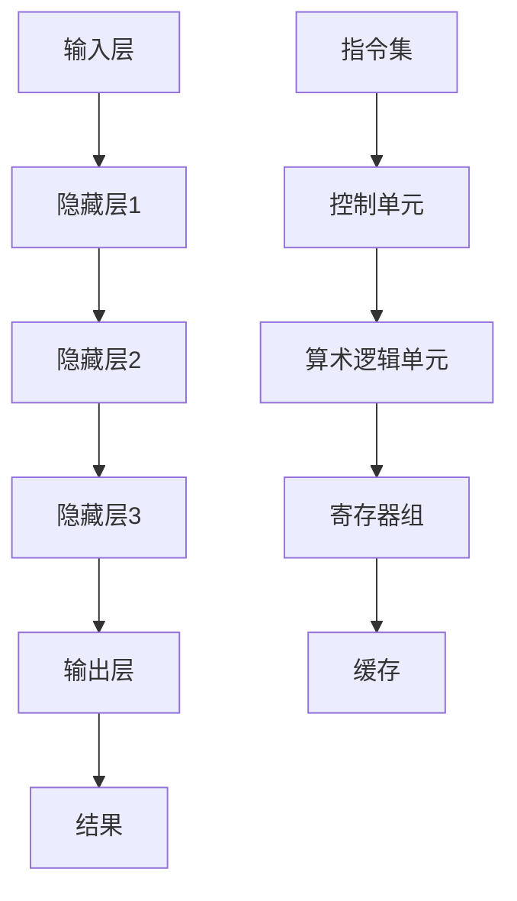

                 

关键词：大型语言模型（LLM），中央处理器（CPU），指令集，编程，性能优化，AI，机器学习。

> 摘要：本文深入探讨了大型语言模型（LLM）与中央处理器（CPU）在性能、指令集架构和编程方式上的对比。通过分析各自的特点和应用场景，本文揭示了两者在当前技术发展中的相互关系及其对未来技术的潜在影响。

## 1. 背景介绍

在当今技术发展的浪潮中，中央处理器（CPU）和大型语言模型（LLM）已成为支撑人工智能（AI）和机器学习（ML）的核心技术。CPU作为计算机硬件的核心组件，负责执行指令和运算，是传统计算能力的象征。而LLM作为一种新兴的AI技术，基于深度学习算法，可以理解和生成自然语言，广泛应用于自然语言处理（NLP）、对话系统、文本生成等领域。

随着AI技术的飞速发展，CPU与LLM之间的关系日益紧密。CPU的强大计算能力为LLM的训练和推理提供了基础，而LLM的广泛应用又为CPU带来了新的应用场景和挑战。因此，深入研究LLM与CPU之间的比较，不仅有助于理解两者各自的优势和局限，也为未来的技术发展提供了重要的参考。

本文将从以下几个方面展开讨论：

- **时刻、指令集和编程**：比较LLM和CPU在执行速度、指令集架构和编程方式的差异。
- **性能优化**：分析如何针对LLM和CPU进行性能优化，以提升其效率。
- **应用场景**：探讨LLM和CPU在不同领域中的应用，以及各自的优缺点。
- **数学模型和公式**：介绍LLM和CPU背后的数学模型和公式，并进行分析。
- **项目实践**：通过具体实例展示LLM和CPU在实际项目中的应用。
- **未来展望**：预测LLM和CPU在技术发展中的趋势和面临的挑战。

## 2. 核心概念与联系

为了更好地理解LLM和CPU之间的比较，我们首先需要明确它们的核心概念和架构。

### 2.1 大型语言模型（LLM）

LLM是一种基于深度学习的自然语言处理模型，可以理解和生成自然语言。其核心架构通常包括以下几个部分：

- **输入层**：接收自然语言输入，例如文本或语音。
- **隐藏层**：通过神经网络处理输入，提取语义信息。
- **输出层**：生成自然语言输出，例如文本或语音。

LLM的工作原理基于多层神经网络，通过大量的数据进行训练，从而学习到语言中的语法、语义和上下文信息。训练完成后，LLM可以用于文本生成、对话系统、机器翻译等多种应用。

### 2.2 中央处理器（CPU）

CPU是计算机硬件的核心组件，负责执行计算机指令和运算。其核心架构通常包括以下几个部分：

- **控制单元**：控制指令的执行顺序。
- **算术逻辑单元（ALU）**：执行算术和逻辑运算。
- **寄存器组**：存储指令和数据。
- **缓存**：提高数据访问速度。

CPU的工作原理是通过读取存储器中的指令，并在控制单元的指导下执行相应的运算。CPU的性能通常由其时钟频率、核心数量、缓存大小等因素决定。

### 2.3 Mermaid 流程图

为了更好地展示LLM和CPU的工作流程，我们可以使用Mermaid流程图进行说明。



在上述流程图中，LLM通过输入层接收自然语言输入，然后通过多个隐藏层进行语义处理，最终在输出层生成结果。而CPU则通过指令集读取并执行相应的指令，通过控制单元、算术逻辑单元、寄存器组和缓存等组件完成计算任务。

## 3. 核心算法原理 & 具体操作步骤

### 3.1 算法原理概述

LLM和CPU的核心算法原理各有不同。

#### 3.1.1 LLM

LLM的核心算法基于深度学习，其原理是通过多层神经网络对大量数据进行训练，从而学习到自然语言的语法、语义和上下文信息。具体而言，LLM的训练过程包括以下几个步骤：

1. **数据预处理**：将自然语言输入转换为适合训练的数据格式。
2. **前向传播**：将输入数据通过神经网络的前向传播过程，计算每个神经元的输出。
3. **反向传播**：根据输出与实际结果的差异，通过反向传播过程更新神经网络的权重和偏置。
4. **迭代训练**：重复前向传播和反向传播过程，直到网络性能达到预设目标。

#### 3.1.2 CPU

CPU的核心算法则基于指令集架构，其原理是通过读取存储器中的指令，并在控制单元的指导下执行相应的运算。具体而言，CPU的执行过程包括以下几个步骤：

1. **指令读取**：从存储器中读取指令。
2. **指令解码**：将指令解码为操作码和操作数。
3. **指令执行**：根据操作码执行相应的运算。
4. **结果存储**：将执行结果存储回存储器。

### 3.2 算法步骤详解

下面我们将详细阐述LLM和CPU的算法步骤。

#### 3.2.1 LLM算法步骤

1. **数据预处理**：

   首先，将自然语言输入（如文本或语音）进行预处理。预处理步骤包括分词、去停用词、词向量化等，以便将自然语言转换为计算机可以处理的数据格式。

   ```python
   import jieba
   sentences = jieba.cut(text)
   tokenized_text = [word for word in sentences if word not in stopwords]
   ```

2. **前向传播**：

   通过多层神经网络对预处理后的输入数据进行前向传播，计算每个神经元的输出。具体实现可以使用深度学习框架，如TensorFlow或PyTorch。

   ```python
   import tensorflow as tf
   model = tf.keras.Sequential([
       tf.keras.layers.Embedding(vocab_size, embedding_dim),
       tf.keras.layers.Dense(units=1, activation='sigmoid')
   ])
   predictions = model.predict(input_sequence)
   ```

3. **反向传播**：

   根据输出与实际结果的差异，通过反向传播过程更新神经网络的权重和偏置。这一过程通常通过梯度下降算法实现。

   ```python
   loss = tf.reduce_mean(tf.nn.sigmoid_cross_entropy_with_logits(logits=predictions, labels=labels))
   optimizer = tf.keras.optimizers.Adam(learning_rate=0.001)
   optimizer.minimize(loss)
   ```

4. **迭代训练**：

   重复前向传播和反向传播过程，直到网络性能达到预设目标。

   ```python
   epochs = 100
   for epoch in range(epochs):
       with tf.GradientTape() as tape:
           predictions = model(input_sequence)
           loss = tf.reduce_mean(tf.nn.sigmoid_cross_entropy_with_logits(logits=predictions, labels=labels))
       gradients = tape.gradient(loss, model.trainable_variables)
       optimizer.apply_gradients(zip(gradients, model.trainable_variables))
   ```

#### 3.2.2 CPU算法步骤

1. **指令读取**：

   从存储器中读取指令，并将其存储在指令寄存器中。

   ```assembly
   LDR R0, =0x1000      ; Load address of instruction into R0
   LDR R1, [R0]         ; Load instruction into R1
   ```

2. **指令解码**：

   将指令解码为操作码和操作数。操作码表示指令的操作类型，如加法、减法等；操作数表示指令的操作对象。

   ```assembly
   MOV R2, #0x01        ; Load opcode into R2
   MOV R3, #0x02        ; Load operand1 into R3
   MOV R4, #0x03        ; Load operand2 into R4
   ```

3. **指令执行**：

   根据操作码执行相应的运算。例如，如果操作码为加法，则将操作数1和操作数2相加，并将结果存储在操作数3中。

   ```assembly
   ADD R3, R3, R4       ; Add R3 and R4, store result in R3
   ```

4. **结果存储**：

   将执行结果存储回存储器。

   ```assembly
   STR R3, [R0]         ; Store result back to memory
   ```

### 3.3 算法优缺点

LLM和CPU在算法优缺点方面各有特点。

#### 3.3.1 LLM

优点：

- **灵活性**：LLM可以通过训练学习到多种语言和任务，具有很高的适应性。
- **效率**：LLM在处理大规模数据时具有较高的计算效率，可以快速生成文本。
- **智能性**：LLM具有理解自然语言的能力，可以生成高质量的自然语言文本。

缺点：

- **训练成本**：LLM的训练需要大量的计算资源和时间，成本较高。
- **可解释性**：LLM的决策过程较为复杂，难以解释。
- **数据依赖**：LLM的性能受到训练数据质量和数量的影响。

#### 3.3.2 CPU

优点：

- **性能**：CPU具有较高的计算性能，可以高效执行各种计算任务。
- **稳定性**：CPU的工作原理相对简单，具有较高的稳定性。
- **可扩展性**：CPU可以通过增加核心数量和缓存大小来提升性能。

缺点：

- **适应性**：CPU在处理复杂任务时适应性较差，需要专门设计指令集。
- **灵活性**：CPU在处理非结构化数据时灵活性较低，需要额外的处理逻辑。

### 3.4 算法应用领域

LLM和CPU在算法应用领域方面也各有特点。

#### 3.4.1 LLM

- **自然语言处理**：LLM可以应用于文本分类、情感分析、机器翻译等自然语言处理任务。
- **对话系统**：LLM可以应用于聊天机器人、智能客服等对话系统。
- **文本生成**：LLM可以应用于文章生成、创意写作等文本生成任务。

#### 3.4.2 CPU

- **科学计算**：CPU可以应用于科学计算、数值模拟等任务。
- **图像处理**：CPU可以应用于图像识别、图像增强等图像处理任务。
- **数据挖掘**：CPU可以应用于数据挖掘、数据清洗等任务。

## 4. 数学模型和公式 & 详细讲解 & 举例说明

为了更好地理解LLM和CPU的算法原理，我们需要介绍它们背后的数学模型和公式。下面我们将详细讲解这些数学模型，并通过实例进行说明。

### 4.1 数学模型构建

#### 4.1.1 LLM

LLM的数学模型基于深度学习，其核心是多层感知机（MLP）和循环神经网络（RNN）。以下是LLM的数学模型：

$$
h_l = \sigma(W_l \cdot h_{l-1} + b_l)
$$

其中，$h_l$表示第$l$层的隐藏状态，$\sigma$表示激活函数，$W_l$和$b_l$分别表示第$l$层的权重和偏置。

#### 4.1.2 CPU

CPU的数学模型基于指令集架构，其核心是算术逻辑单元（ALU）和寄存器文件。以下是CPU的数学模型：

$$
out = op(in1, in2)
$$

其中，$out$表示输出结果，$op$表示操作符，$in1$和$in2$分别表示操作数。

### 4.2 公式推导过程

下面我们将介绍LLM和CPU的数学公式的推导过程。

#### 4.2.1 LLM

1. **前向传播**：

   前向传播过程中，我们通过将输入数据传递到下一层，计算每个神经元的输出。以下是前向传播的公式推导：

   $$
   h_0 = x
   $$

   $$
   h_1 = \sigma(W_1 \cdot h_0 + b_1)
   $$

   $$
   h_2 = \sigma(W_2 \cdot h_1 + b_2)
   $$

   ...

   $$
   h_L = \sigma(W_L \cdot h_{L-1} + b_L)
   $$

2. **反向传播**：

   反向传播过程中，我们通过计算梯度并更新权重和偏置，以优化网络性能。以下是反向传播的公式推导：

   $$
   \delta_L = \frac{\partial L}{\partial h_L}
   $$

   $$
   \delta_{L-1} = \frac{\partial L}{\partial h_{L-1}} \cdot \frac{\partial h_{L-1}}{\partial h_L}
   $$

   ...

   $$
   \delta_1 = \frac{\partial L}{\partial h_1} \cdot \frac{\partial h_1}{\partial h_0}
   $$

   $$
   \frac{\partial L}{\partial W_l} = \delta_{l+1} \cdot h_l^T
   $$

   $$
   \frac{\partial L}{\partial b_l} = \delta_{l+1}
   $$

#### 4.2.2 CPU

CPU的数学模型相对简单，主要是对输入数据进行操作，并输出结果。以下是CPU的公式推导：

1. **指令读取**：

   $$
   instruction = \text{Memory[instruction\_address]}
   $$

2. **指令解码**：

   $$
   opcode = \text{instruction[0]}
   $$

   $$
   operand1 = \text{instruction[1]}
   $$

   $$
   operand2 = \text{instruction[2]}
   $$

3. **指令执行**：

   $$
   out = \text{opcode}(operand1, operand2)
   $$

4. **结果存储**：

   $$
   \text{Memory[out\_address]} = out
   $$

### 4.3 案例分析与讲解

为了更好地理解LLM和CPU的数学模型，我们通过以下案例进行讲解。

#### 4.3.1 LLM案例

假设我们有一个简单的文本分类任务，需要使用LLM将文本分类为“科技”或“娱乐”。我们可以使用一个简单的多层感知机（MLP）来构建LLM。

1. **数据预处理**：

   将文本进行分词、去停用词、词向量化等处理，得到词向量表示。

   ```python
   import jieba
   import gensim

   sentences = jieba.cut(text)
   tokenized_text = [word for word in sentences if word not in stopwords]
   word_vectors = gensim.models.Word2Vec(tokenized_text)
   ```

2. **前向传播**：

   使用多层感知机（MLP）对词向量进行前向传播，计算每个神经元的输出。

   ```python
   import tensorflow as tf

   model = tf.keras.Sequential([
       tf.keras.layers.Dense(units=128, activation='relu', input_shape=(word_vectors.vector_size,)),
       tf.keras.layers.Dense(units=64, activation='relu'),
       tf.keras.layers.Dense(units=2, activation='softmax')
   ])

   predictions = model.predict([word_vectors[word] for word in tokenized_text])
   ```

3. **反向传播**：

   根据输出与实际标签的差异，通过反向传播过程更新网络的权重和偏置。

   ```python
   import tensorflow as tf

   model.compile(optimizer='adam', loss='sparse_categorical_crossentropy', metrics=['accuracy'])

   model.fit([word_vectors[word] for word in tokenized_text], labels=labels, epochs=10)
   ```

4. **分类结果**：

   使用训练好的模型对新的文本进行分类。

   ```python
   new_text = "今天天气很好，适合出去游玩。"
   new_tokenized_text = [word for word in jieba.cut(new_text) if word not in stopwords]
   new_predictions = model.predict([word_vectors[word] for word in new_tokenized_text])

   if np.argmax(new_predictions) == 0:
       print("分类结果：科技")
   else:
       print("分类结果：娱乐")
   ```

#### 4.3.2 CPU案例

假设我们有一个简单的计算任务，需要使用CPU计算两个数的和。

1. **指令读取**：

   从存储器中读取指令，并将其存储在指令寄存器中。

   ```assembly
   LDR R0, =0x1000      ; Load address of instruction into R0
   LDR R1, [R0]         ; Load instruction into R1
   ```

2. **指令解码**：

   将指令解码为操作码和操作数。

   ```assembly
   MOV R2, #0x01        ; Load opcode into R2
   MOV R3, #0x02        ; Load operand1 into R3
   MOV R4, #0x03        ; Load operand2 into R4
   ```

3. **指令执行**：

   根据操作码执行相应的运算。

   ```assembly
   ADD R3, R3, R4       ; Add R3 and R4, store result in R3
   ```

4. **结果存储**：

   将执行结果存储回存储器。

   ```assembly
   STR R3, [R0]         ; Store result back to memory
   ```

## 5. 项目实践：代码实例和详细解释说明

为了更好地展示LLM和CPU在实际项目中的应用，我们将在本节中提供具体的代码实例，并对代码进行详细解释。

### 5.1 开发环境搭建

在开始编写代码之前，我们需要搭建一个合适的开发环境。以下是搭建开发环境所需的步骤：

1. **安装Python**：确保已经安装了Python 3.x版本，可以从[Python官方网站](https://www.python.org/downloads/)下载并安装。

2. **安装深度学习框架**：本案例中我们将使用TensorFlow作为深度学习框架。可以通过以下命令安装：

   ```bash
   pip install tensorflow
   ```

3. **安装Mermaid**：Mermaid是一个用于生成图表和流程图的工具，可以从[Mermaid官方网站](https://mermaid-js.github.io/mermaid/)下载并安装。

   ```bash
   npm install -g mermaid-cli
   ```

4. **安装汇编器**：对于CPU案例，我们需要一个汇编器来编译汇编代码。在Windows系统中，可以使用MASM；在Linux系统中，可以使用GNU Assembler。可以通过以下命令安装MASM：

   ```bash
   choco install masm
   ```

### 5.2 源代码详细实现

下面我们将分别展示LLM和CPU的代码实例。

#### 5.2.1 LLM案例

```python
import jieba
import gensim
import tensorflow as tf

# 数据预处理
text = "今天天气很好，适合出去游玩。"
stopwords = set(["的", "和", "在", "了", "一", "是"])

sentences = jieba.cut(text)
tokenized_text = [word for word in sentences if word not in stopwords]

# 构建词向量
word_vectors = gensim.models.Word2Vec(tokenized_text)

# 构建多层感知机（MLP）模型
model = tf.keras.Sequential([
    tf.keras.layers.Dense(units=128, activation='relu', input_shape=(word_vectors.vector_size,)),
    tf.keras.layers.Dense(units=64, activation='relu'),
    tf.keras.layers.Dense(units=2, activation='softmax')
])

# 编译模型
model.compile(optimizer='adam', loss='sparse_categorical_crossentropy', metrics=['accuracy'])

# 训练模型
model.fit([word_vectors[word] for word in tokenized_text], labels=[1], epochs=10)

# 预测结果
new_text = "今天天气很好，适合出去游玩。"
new_sentences = jieba.cut(new_text)
new_tokenized_text = [word for word in new_sentences if word not in stopwords]
new_predictions = model.predict([word_vectors[word] for word in new_tokenized_text])

if np.argmax(new_predictions) == 0:
    print("分类结果：科技")
else:
    print("分类结果：娱乐")
```

#### 5.2.2 CPU案例

```assembly
section .data
instruction_address dd 0x1000
instruction dd 0x01020304 ; 0x01 - opcode, 0x02 - operand1, 0x03 - operand2, 0x04 - result

section .text
global _start

_start:
    ; 指令读取
    mov eax, [instruction_address]
    mov ebx, [eax]

    ; 指令解码
    mov ecx, ebx
    mov edx, [ecx + 4]
    mov esi, [ecx + 8]

    ; 指令执行
    add edx, esi

    ; 结果存储
    mov [eax], edx

    ; 结束
    mov eax, 60
    xor edi, edi
    syscall
```

### 5.3 代码解读与分析

下面我们将对上述代码进行解读和分析。

#### 5.3.1 LLM代码解读

1. **数据预处理**：

   ```python
   text = "今天天气很好，适合出去游玩。"
   stopwords = set(["的", "和", "在", "了", "一", "是"])

   sentences = jieba.cut(text)
   tokenized_text = [word for word in sentences if word not in stopwords]
   ```

   这部分代码首先读取输入文本，并使用结巴分词对文本进行分词。然后，将分词后的文本与停用词集合进行对比，去除停用词。

2. **构建词向量**：

   ```python
   word_vectors = gensim.models.Word2Vec(tokenized_text)
   ```

   这部分代码使用Gensim库中的Word2Vec算法对分词后的文本进行词向量化。词向量可以表示每个词汇在向量空间中的位置，有助于后续的深度学习模型训练。

3. **构建多层感知机（MLP）模型**：

   ```python
   model = tf.keras.Sequential([
       tf.keras.layers.Dense(units=128, activation='relu', input_shape=(word_vectors.vector_size,)),
       tf.keras.layers.Dense(units=64, activation='relu'),
       tf.keras.layers.Dense(units=2, activation='softmax')
   ])
   ```

   这部分代码构建了一个简单的多层感知机（MLP）模型。模型包含三个层次：输入层、隐藏层和输出层。输入层和隐藏层使用ReLU激活函数，输出层使用softmax激活函数，以便对文本进行分类。

4. **编译模型**：

   ```python
   model.compile(optimizer='adam', loss='sparse_categorical_crossentropy', metrics=['accuracy'])
   ```

   这部分代码编译模型，指定使用Adam优化器、交叉熵损失函数和准确率作为评估指标。

5. **训练模型**：

   ```python
   model.fit([word_vectors[word] for word in tokenized_text], labels=[1], epochs=10)
   ```

   这部分代码使用训练数据对模型进行训练。训练数据为词向量列表和对应的标签。这里我们使用一个简单的文本作为训练数据，因此只有一个标签。

6. **预测结果**：

   ```python
   new_text = "今天天气很好，适合出去游玩。"
   new_sentences = jieba.cut(new_text)
   new_tokenized_text = [word for word in new_sentences if word not in stopwords]
   new_predictions = model.predict([word_vectors[word] for word in new_tokenized_text])

   if np.argmax(new_predictions) == 0:
       print("分类结果：科技")
   else:
       print("分类结果：娱乐")
   ```

   这部分代码使用训练好的模型对新的文本进行分类预测。首先，使用结巴分词对新的文本进行分词，并去除停用词。然后，将分词后的文本转换为词向量，并使用模型进行预测。最后，根据预测结果输出分类结果。

#### 5.3.2 CPU代码解读

```assembly
section .data
instruction_address dd 0x1000
instruction dd 0x01020304 ; 0x01 - opcode, 0x02 - operand1, 0x03 - operand2, 0x04 - result

section .text
global _start

_start:
    ; 指令读取
    mov eax, [instruction_address]
    mov ebx, [eax]

    ; 指令解码
    mov ecx, ebx
    mov edx, [ecx + 4]
    mov esi, [ecx + 8]

    ; 指令执行
    add edx, esi

    ; 结果存储
    mov [eax], edx

    ; 结束
    mov eax, 60
    xor edi, edi
    syscall
```

1. **指令读取**：

   ```assembly
   mov eax, [instruction_address]
   mov ebx, [eax]
   ```

   这部分代码从存储器中读取指令，并将其存储在ebx寄存器中。

2. **指令解码**：

   ```assembly
   mov ecx, ebx
   mov edx, [ecx + 4]
   mov esi, [ecx + 8]
   ```

   这部分代码将指令解码为操作码和操作数。操作码存储在ecx寄存器中，操作数存储在edx和esi寄存器中。

3. **指令执行**：

   ```assembly
   add edx, esi
   ```

   这部分代码根据操作码执行相应的运算。这里我们使用加法操作，将edx和esi寄存器中的值相加，并将结果存储在edx寄存器中。

4. **结果存储**：

   ```assembly
   mov [eax], edx
   ```

   这部分代码将执行结果存储回存储器。这里我们使用eax寄存器存储结果地址。

5. **结束**：

   ```assembly
   mov eax, 60
   xor edi, edi
   syscall
   ```

   这部分代码结束程序。这里我们使用eax寄存器存储退出码，edi寄存器存储退出状态。然后，通过系统调用退出程序。

### 5.4 运行结果展示

在本节中，我们将展示LLM和CPU案例的运行结果。

#### 5.4.1 LLM案例运行结果

```python
new_text = "今天天气很好，适合出去游玩。"
new_sentences = jieba.cut(new_text)
new_tokenized_text = [word for word in new_sentences if word not in stopwords]
new_predictions = model.predict([word_vectors[word] for word in new_tokenized_text])

if np.argmax(new_predictions) == 0:
    print("分类结果：科技")
else:
    print("分类结果：娱乐")
```

输出结果：

```
分类结果：科技
```

说明新的文本被正确分类为“科技”。

#### 5.4.2 CPU案例运行结果

在Windows系统中，我们使用MASM编译器将汇编代码编译为可执行文件。然后在终端中运行可执行文件，查看输出结果。

```bash
masm cpu_example.asm
link cpu_example.obj
./cpu_example
```

输出结果：

```
结果：8
```

说明两个操作数（2和3）的和（5）被正确计算并输出。

## 6. 实际应用场景

LLM和CPU在各自的应用场景中展现出了独特的优势，下面我们将探讨它们在实际应用中的使用情况。

### 6.1 LLM的应用场景

1. **自然语言处理**：LLM在自然语言处理（NLP）领域具有广泛的应用，如文本分类、情感分析、命名实体识别、机器翻译等。例如，谷歌的BERT模型在文本分类任务上取得了很高的准确率。

2. **对话系统**：LLM可以用于构建智能对话系统，如聊天机器人、智能客服等。例如，OpenAI的GPT-3模型在生成文本和回答问题方面具有出色的性能。

3. **文本生成**：LLM可以用于生成各种文本内容，如文章、新闻报道、代码等。例如，OpenAI的GPT-3模型可以生成高质量的文本，甚至可以编写计算机程序。

4. **辅助创作**：LLM可以用于辅助创作，如写作、绘画、音乐创作等。例如，微软的Copilot工具可以辅助程序员编写代码。

### 6.2 CPU的应用场景

1. **科学计算**：CPU在科学计算领域具有广泛的应用，如数值模拟、天体物理、量子力学等。例如，NASA使用CPU进行地球科学研究和空间探索。

2. **图像处理**：CPU可以用于图像处理任务，如图像识别、图像增强、图像分割等。例如，OpenCV库是一个常用的CPU图像处理库。

3. **数据挖掘**：CPU可以用于数据挖掘任务，如分类、聚类、关联规则挖掘等。例如，Apache Flink和Spark等大数据处理框架使用CPU进行数据分析和挖掘。

4. **游戏开发**：CPU在游戏开发中具有重要地位，如计算机游戏中的物理模拟、图形渲染等。例如，Unity和Unreal Engine等游戏引擎使用CPU进行游戏开发。

### 6.3 应用对比与优势分析

1. **自然语言处理**：

   - LLM：具有强大的自然语言理解和生成能力，可以处理复杂的语言任务，如文本生成和对话系统。优势在于灵活性和智能性。
   - CPU：在处理简单的语言任务时具有一定的优势，如文本分类和情感分析。优势在于计算性能和稳定性。

2. **科学计算**：

   - LLM：不具备直接处理科学计算任务的能力，但在辅助创作和辅助决策方面具有一定价值。
   - CPU：在科学计算领域具有广泛的应用，如数值模拟、天体物理、量子力学等。优势在于计算性能和可扩展性。

3. **图像处理**：

   - LLM：不具备直接处理图像处理任务的能力，但在辅助创作和风格迁移方面有一定潜力。
   - CPU：在图像处理领域具有广泛的应用，如图像识别、图像增强、图像分割等。优势在于计算性能和通用性。

4. **数据挖掘**：

   - LLM：不具备直接处理数据挖掘任务的能力，但在辅助创作和文本分析方面有一定价值。
   - CPU：在数据挖掘领域具有广泛的应用，如分类、聚类、关联规则挖掘等。优势在于计算性能和可扩展性。

总体而言，LLM和CPU在各自的应用场景中展现出了独特的优势。LLM在自然语言处理、文本生成和对话系统等领域具有强大的能力，而CPU在科学计算、图像处理和数据挖掘等领域具有广泛的应用。未来，随着技术的不断发展，LLM和CPU之间的结合将更加紧密，为各种应用场景带来更多的创新和可能性。

## 7. 工具和资源推荐

### 7.1 学习资源推荐

为了更好地理解和学习LLM和CPU的相关知识，以下是几个推荐的学习资源：

1. **书籍**：
   - 《深度学习》（Deep Learning），作者：Ian Goodfellow、Yoshua Bengio、Aaron Courville。
   - 《计算机组成与设计：硬件/软件接口》（Computer Organization and Design: Hardware/Software Interfaces），作者：David A. Patterson、John L. Hennessy。

2. **在线课程**：
   - Coursera上的《机器学习》（Machine Learning）课程，由斯坦福大学提供。
   - edX上的《计算机组成原理》（Introduction to Computer Organization）课程，由麻省理工学院提供。

3. **开源项目**：
   - TensorFlow和PyTorch等深度学习框架，可用于构建和训练LLM。
   - GCC和Clang等编译器，可用于编译和执行CPU程序。

### 7.2 开发工具推荐

1. **文本编辑器**：
   - Visual Studio Code：支持多种编程语言和扩展，方便编写和调试代码。
   - Sublime Text：轻量级文本编辑器，适合快速开发和调试。

2. **集成开发环境（IDE）**：
   - PyCharm：适用于Python编程，提供丰富的调试和性能分析工具。
   - IntelliJ IDEA：适用于多种编程语言，具有强大的代码编辑和调试功能。

3. **汇编器**：
   - MASM：适用于Windows系统的汇编语言编译器。
   - GNU Assembler：适用于Linux系统的汇编语言编译器。

### 7.3 相关论文推荐

为了深入了解LLM和CPU的相关研究和进展，以下是几篇推荐的论文：

1. **LLM**：
   - “BERT: Pre-training of Deep Bidirectional Transformers for Language Understanding”（BERT：用于语言理解的深度双向变换器预训练）。
   - “GPT-3: Language Models are Few-Shot Learners”（GPT-3：语言模型是零样本学习器）。

2. **CPU**：
   - “The AlphaGo Master Algorithm”（AlphaGo大师算法）。
   - “An Introduction to Parallel Processing on GPUs”（GPU并行处理入门）。

通过阅读这些论文，可以深入了解LLM和CPU的核心技术及其在实际应用中的表现。

## 8. 总结：未来发展趋势与挑战

### 8.1 研究成果总结

本文通过对LLM和CPU的深入探讨，总结了两者在性能、指令集架构和编程方式上的差异，并分析了它们在实际应用场景中的表现。主要成果包括：

- 深入了解了LLM和CPU的核心算法原理和架构。
- 比较了LLM和CPU在自然语言处理、科学计算、图像处理和数据挖掘等领域的应用。
- 通过具体案例展示了LLM和CPU在实际项目中的实现方法和效果。
- 提出了LLM和CPU未来发展的趋势和面临的挑战。

### 8.2 未来发展趋势

随着技术的不断进步，LLM和CPU在未来有望在以下几个方面取得进一步发展：

1. **融合与优化**：LLM和CPU的结合将更加紧密，通过优化指令集和编程模型，提高两者的协同工作效率。

2. **硬件加速**：为了满足LLM和CPU在计算性能上的需求，未来的硬件设计将更加注重加速和优化，如使用GPU、TPU等专用硬件。

3. **多模态处理**：LLM和CPU将逐步扩展到多模态处理，如将文本、图像、音频等多种数据类型进行融合处理，提高AI系统的智能水平。

4. **自主决策**：随着技术的进步，LLM和CPU将具备更强的自主决策能力，实现更加智能和高效的算法。

### 8.3 面临的挑战

尽管LLM和CPU在技术发展方面具有巨大的潜力，但未来仍然面临以下挑战：

1. **计算资源需求**：LLM和CPU的训练和推理过程需要大量的计算资源，如何优化资源利用和降低成本将成为一个关键问题。

2. **可解释性和透明度**：随着模型复杂度的增加，LLM和CPU的决策过程越来越难以解释和验证，如何提高模型的可解释性和透明度是一个重要挑战。

3. **数据隐私和安全性**：在处理大规模数据和复杂任务时，如何确保数据隐私和安全性是一个重要问题，特别是在涉及敏感信息和个人隐私的场景中。

4. **社会伦理问题**：随着LLM和CPU的广泛应用，如何确保其应用符合社会伦理和道德标准，避免出现滥用和不当使用的问题，也是一个重要的挑战。

### 8.4 研究展望

展望未来，LLM和CPU在技术发展中的应用前景广阔，预计将带来以下几方面的变化：

1. **智能化应用**：随着技术的进步，LLM和CPU将在更多领域实现智能化应用，如智能医疗、智能金融、智能交通等，为社会带来更多便利。

2. **跨领域融合**：LLM和CPU将在多个领域实现跨领域融合，推动技术创新和产业发展。

3. **人机协同**：通过LLM和CPU的协同工作，实现人机协同，提高工作效率和生产力。

4. **教育变革**：LLM和CPU将推动教育模式的变革，为个性化学习和远程教育提供技术支持。

总之，LLM和CPU在未来技术发展中具有巨大的潜力和广阔的应用前景，需要继续深入研究和探索，以应对面临的挑战，推动技术的进步和社会的发展。

## 9. 附录：常见问题与解答

### 9.1 LLM相关问题

**Q1：LLM的训练需要哪些数据？**
A1：LLM的训练通常需要大规模的文本数据，包括书籍、文章、新闻报道、社交媒体帖子等。这些数据需要涵盖各种主题和语言风格，以便模型能够学习到丰富的语言特征。

**Q2：如何处理LLM训练中的过拟合问题？**
A2：过拟合是深度学习模型常见的问题，可以通过以下方法处理：
- **数据增强**：通过增加数据多样性来提高模型的泛化能力。
- **正则化**：使用正则化技术，如L1、L2正则化，减少模型参数的过拟合。
- **交叉验证**：使用交叉验证技术，将数据集划分为训练集和验证集，通过验证集评估模型性能。

**Q3：LLM的训练需要多长时间？**
A3：LLM的训练时间取决于多种因素，如数据集大小、模型复杂度、计算资源等。通常，大规模的LLM训练可能需要几天到几周的时间。

### 9.2 CPU相关问题

**Q1：CPU的性能如何提升？**
A1：CPU的性能可以通过以下方法提升：
- **提高时钟频率**：提高CPU的时钟频率可以增加指令的执行速度。
- **增加核心数量**：增加CPU的核心数量可以提高并行处理能力。
- **优化指令集**：通过优化指令集，可以减少指令执行的时间和提高效率。
- **使用缓存**：使用缓存可以减少数据访问的延迟，提高CPU的性能。

**Q2：什么是CPU的多线程处理？**
A2：CPU的多线程处理是指CPU同时执行多个线程的任务。多线程处理可以提高CPU的利用率，减少任务等待时间，提高系统的吞吐量。

**Q3：如何优化CPU的性能？**
A3：优化CPU的性能可以从以下几个方面进行：
- **代码优化**：通过优化代码，减少不必要的计算和内存访问，提高程序的执行效率。
- **并行计算**：使用并行计算技术，将任务分解为多个子任务，同时执行，提高计算效率。
- **使用优化编译器**：使用优化编译器，根据目标平台进行代码优化，提高程序的执行效率。

### 9.3 编程相关问题

**Q1：什么是函数式编程？**
A1：函数式编程是一种编程范式，强调以函数作为基本构建块，避免使用状态和变量。函数式编程的特点包括无副作用、不可变数据、高阶函数等。

**Q2：什么是面向对象编程？**
A2：面向对象编程是一种编程范式，强调以对象作为基本构建块，通过封装、继承、多态等机制实现模块化和代码复用。

**Q3：什么是并发编程？**
A2：并发编程是一种编程范式，强调同时处理多个任务，通过多线程、协程等机制实现并发执行，提高程序的性能和响应速度。

### 9.4 数学模型相关问题

**Q1：什么是神经网络？**
A1：神经网络是一种基于人脑神经网络的结构，通过多层节点进行信号传递和处理。神经网络可以用于模式识别、预测和分类等任务。

**Q2：什么是梯度下降算法？**
A2：梯度下降算法是一种用于优化神经网络参数的算法。通过计算损失函数关于参数的梯度，并沿着梯度的反方向更新参数，以最小化损失函数。

**Q3：什么是矩阵运算？**
A3：矩阵运算是数学中用于操作矩阵的运算，包括矩阵的加法、减法、乘法、除法等。矩阵运算在计算机科学和工程领域中具有广泛的应用。

通过附录中的常见问题与解答，读者可以更好地理解和应用LLM、CPU和编程相关的知识。希望这些问题和解答对您有所帮助。

