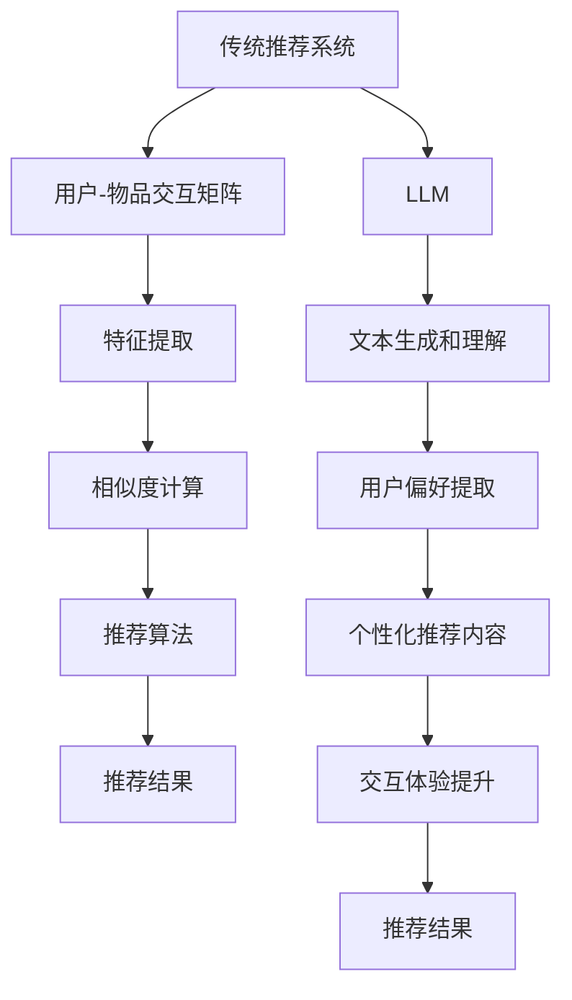

                 

关键词：Large Language Model（LLM），传统推荐系统，算法优势，挑战，应用场景，未来展望

## 摘要

本文将深入探讨大型语言模型（LLM）与传统推荐系统之间的优劣对比。首先，我们将回顾传统推荐系统的基本原理和常见算法，接着详细解析LLM的核心理念及其与推荐系统的联系。文章将重点分析LLM在推荐系统中的优势，如数据处理能力、个性化推荐效果以及交互性等，同时也将探讨LLM面临的挑战，包括模型规模、计算资源和数据隐私等方面的问题。此外，本文还将结合实际应用场景，探讨LLM在推荐系统中的潜力与局限性，并对未来发展趋势和潜在研究挑战进行展望。通过本文的讨论，读者将更好地理解LLM与传统推荐系统之间的异同，以及如何在两者之间找到最佳平衡点。

## 1. 背景介绍

### 传统推荐系统

传统推荐系统起源于20世纪90年代，其核心目标是根据用户的兴趣和偏好，向用户推荐他们可能感兴趣的商品、内容或服务。这一目标源于信息过载的问题，即用户在海量信息中难以找到自己真正需要的内容。为了解决这一问题，推荐系统应运而生。

传统推荐系统主要分为两种类型：基于内容的推荐（Content-Based Recommendation）和协同过滤（Collaborative Filtering）。基于内容的推荐系统通过分析用户的历史行为和偏好，提取出用户的兴趣特征，然后基于这些特征寻找与用户兴趣相似的内容进行推荐。协同过滤系统则依靠用户行为数据，通过计算用户之间的相似度来推荐他们可能喜欢的项目。

在算法层面，传统推荐系统常用的方法包括：

- **基于内容的推荐**：主要使用文本匹配、关键词提取和相似度计算等技术，如TF-IDF（Term Frequency-Inverse Document Frequency）和余弦相似度等。
  
- **协同过滤**：
  - **用户基于的协同过滤**：计算用户之间的相似度，基于相似用户的偏好推荐新项目。
  - **项基于的协同过滤**：计算项目之间的相似度，基于相似项目推荐给用户。
  
- **混合推荐系统**：结合内容推荐和协同过滤的优点，以期望获得更准确的推荐结果。

传统推荐系统在电商、社交媒体、视频流媒体等领域得到了广泛应用，并取得了显著的商业成功。例如，Amazon和Netflix等公司通过推荐系统大大提升了用户体验和销售转化率。

### 大型语言模型（LLM）

大型语言模型（Large Language Model，简称LLM）是近年来人工智能领域的一个重要突破。LLM是通过大规模数据训练的深度神经网络，具有强大的文本理解和生成能力。其核心理念是学习并理解自然语言的内在结构和语义，从而实现高水平的语言处理任务。

LLM的发展可以追溯到2018年，谷歌发布BERT（Bidirectional Encoder Representations from Transformers），标志着基于Transformer结构的语言模型进入了一个新的时代。此后，一系列大型语言模型相继问世，如GPT-3（OpenAI）、T5（Google）和LLaMA（Meta）等，这些模型在自然语言理解、生成和翻译等任务上表现出色。

### LLM与传统推荐系统的联系

尽管LLM和传统推荐系统在目标和实现方法上有所不同，但它们在某些方面具有潜在的联系和互补性。首先，LLM在文本数据的处理和理解上具有显著优势，可以为推荐系统提供更精细的语义分析能力。例如，通过LLM可以更好地理解用户的评论、评价和搜索查询，从而更准确地提取用户兴趣特征。

其次，LLM在生成推荐内容方面也有很大潜力。传统推荐系统通常依赖于用户行为数据和内容特征，而LLM可以根据用户的历史偏好生成个性化的文本内容，提高推荐的吸引力和相关性。

此外，LLM还可以用于提升推荐系统的交互体验。例如，通过自然语言交互，用户可以更直观地表达自己的偏好，而LLM可以快速理解并调整推荐策略。

然而，LLM在推荐系统中的应用也面临着一些挑战，如模型规模、计算资源和数据隐私等问题。这些问题将在后续章节中详细讨论。

## 2. 核心概念与联系

为了深入理解LLM与传统推荐系统的联系，我们需要首先明确它们的核心概念和架构。

### 核心概念

#### 传统推荐系统

传统推荐系统的核心概念包括：

- **用户-物品交互矩阵**：这是推荐系统的基本数据结构，表示用户与物品之间的交互行为，如购买、点击、评分等。
- **特征提取**：从用户和物品的特征向量中提取出与推荐相关的特征，如用户的历史行为、物品的属性等。
- **相似度计算**：计算用户之间的相似度或物品之间的相似度，以找到推荐候选集。
- **推荐算法**：基于用户-物品交互矩阵和特征向量，生成个性化的推荐列表。

#### 大型语言模型（LLM）

LLM的核心概念包括：

- **Transformer架构**：这是一种基于自注意力机制的深度神经网络结构，能够高效处理变长序列数据。
- **大规模预训练**：通过在大规模语料库上进行预训练，LLM可以自动学习语言中的内在结构和语义。
- **文本生成和理解**：LLM具有强大的文本生成和语言理解能力，可以处理复杂的自然语言任务。

### Mermaid流程图

为了更好地展示LLM与传统推荐系统的关系，我们可以使用Mermaid流程图来描述它们的核心流程。



在这个流程图中，传统推荐系统通过用户-物品交互矩阵、特征提取、相似度计算和推荐算法生成推荐结果。而LLM则通过文本生成和理解，提取用户偏好，生成个性化的推荐内容，并提升交互体验。

### 关联性分析

LLM与传统推荐系统之间的关联性主要体现在以下几个方面：

1. **数据处理**：LLM可以更高效地处理和理解文本数据，为推荐系统提供更精细的语义分析。
2. **个性化推荐**：通过LLM生成的个性化推荐内容，可以显著提升用户的满意度和参与度。
3. **交互体验**：LLM的自然语言交互能力可以增强用户与推荐系统的互动，提高用户体验。
4. **内容生成**：LLM可以生成吸引人的推荐内容，提高推荐的吸引力。

然而，LLM在推荐系统中的应用也面临着一些挑战，如模型规模、计算资源和数据隐私等问题。这些问题将在后续章节中详细讨论。

## 3. 核心算法原理 & 具体操作步骤

### 3.1 算法原理概述

在本节中，我们将介绍LLM在推荐系统中的核心算法原理。LLM通过以下几个关键步骤实现推荐功能：

1. **文本预处理**：对用户生成的文本进行预处理，包括分词、去噪、去除停用词等。
2. **文本编码**：使用预训练的LLM模型对预处理后的文本进行编码，提取出文本的语义特征向量。
3. **用户偏好提取**：分析用户的历史行为数据和文本特征向量，提取出用户的兴趣偏好。
4. **推荐生成**：基于用户偏好和物品特征，生成个性化的推荐列表。
5. **交互优化**：通过自然语言交互，优化推荐结果和用户体验。

### 3.2 算法步骤详解

#### 步骤1：文本预处理

文本预处理是确保文本数据质量的重要环节。具体步骤包括：

- **分词**：将文本拆分为单词或子词。
- **去噪**：去除文本中的噪声信息，如HTML标签、特殊字符等。
- **去除停用词**：去除对语义影响较小的常见词汇。

#### 步骤2：文本编码

文本编码是将预处理后的文本转换为机器可处理的数值表示。LLM通过预训练模型（如BERT、GPT等）实现文本编码。具体步骤如下：

- **嵌入层**：将单词映射为向量，形成文本序列的初始嵌入表示。
- **Transformer层**：通过自注意力机制，对文本序列进行编码，提取出文本的语义特征向量。

#### 步骤3：用户偏好提取

用户偏好提取是核心算法的关键步骤。通过分析用户的历史行为数据和文本特征向量，可以提取出用户的兴趣偏好。具体步骤如下：

- **行为数据预处理**：对用户的历史行为数据进行预处理，如转换成向量表示、标准化等。
- **特征融合**：将文本特征向量和行为特征向量进行融合，形成用户兴趣特征向量。
- **偏好分析**：使用机器学习算法（如聚类、关联规则等），分析用户兴趣特征向量，提取出用户的偏好。

#### 步骤4：推荐生成

推荐生成是基于用户偏好和物品特征生成个性化推荐列表。具体步骤如下：

- **物品特征提取**：对物品的属性数据进行预处理，提取出物品的特征向量。
- **相似度计算**：计算用户偏好特征向量与物品特征向量之间的相似度，形成推荐候选集。
- **推荐策略**：基于相似度分数和用户历史偏好，采用排序算法（如Top-N算法）生成推荐列表。

#### 步骤5：交互优化

交互优化旨在提高用户与推荐系统的互动质量和用户体验。具体步骤如下：

- **反馈收集**：收集用户对推荐结果的反馈，如点击、收藏、评分等。
- **调整策略**：根据用户反馈调整推荐算法和内容生成策略，提高推荐的吸引力。
- **自然语言交互**：使用LLM进行自然语言交互，响应用户的查询和反馈，提供个性化的推荐建议。

### 3.3 算法优缺点

#### 优点

- **强大的语义理解能力**：LLM能够深入理解文本的语义，提取出更准确的用户兴趣特征。
- **个性化推荐**：基于用户偏好生成个性化的推荐内容，提高用户体验和满意度。
- **交互优化**：自然语言交互功能增强用户与推荐系统的互动，提供更人性化的用户体验。

#### 缺点

- **计算资源需求高**：训练和部署LLM模型需要大量的计算资源和存储空间。
- **数据隐私问题**：用户行为数据和偏好数据需要严格保护，以防止数据泄露和滥用。
- **模型可解释性低**：LLM的推荐过程较为复杂，难以解释推荐结果背后的原因。

### 3.4 算法应用领域

LLM在推荐系统中的应用领域非常广泛，主要包括：

- **电商推荐**：通过分析用户的购物历史和搜索查询，生成个性化的商品推荐。
- **社交媒体**：根据用户的点赞、评论和转发行为，推荐相关的内容和用户。
- **视频流媒体**：基于用户观看历史和搜索查询，推荐相关的视频内容和播放列表。
- **音乐推荐**：通过分析用户的听歌记录和偏好，推荐个性化的音乐和播放列表。

通过以上分析，我们可以看到，LLM在推荐系统中具有显著的优势，但也面临着一些挑战。在接下来的章节中，我们将详细讨论LLM在推荐系统中的具体应用场景，以及面临的挑战和解决方案。

## 4. 数学模型和公式 & 详细讲解 & 举例说明

在本节中，我们将深入探讨LLM在推荐系统中的数学模型和公式，并对其进行详细讲解，同时通过具体例子来展示如何使用这些模型进行推荐。

### 4.1 数学模型构建

LLM在推荐系统中的核心数学模型主要包括以下几个方面：

1. **用户和物品的向量表示**：通过预训练的LLM模型，我们可以将用户和物品的文本数据进行编码，生成高维的向量表示。这些向量表示包含了用户和物品的语义信息，是后续推荐算法的基础。

2. **相似度计算**：基于用户和物品的向量表示，我们可以通过余弦相似度、欧氏距离等计算方法，评估用户和物品之间的相似度，从而生成推荐列表。

3. **优化目标**：推荐系统的优化目标通常是最小化预测误差，最大化用户满意度或提升点击率等。

### 4.2 公式推导过程

#### 用户和物品向量表示

首先，我们定义用户\(u\)和物品\(i\)的向量表示分别为\(\mathbf{u}\)和\(\mathbf{i}\)。

假设我们使用预训练的LLM模型对文本进行编码，生成用户和物品的向量表示。在这个过程中，我们可以使用Transformer模型的嵌入层输出作为向量表示。具体公式如下：

\[
\mathbf{u} = \text{Embed}(\text{User\_Text})
\]

\[
\mathbf{i} = \text{Embed}(\text{Item\_Text})
\]

其中，\(\text{Embed}\)表示嵌入层输出。

#### 相似度计算

接下来，我们使用余弦相似度来计算用户和物品之间的相似度。余弦相似度是一种衡量两个向量夹角余弦值的度量方法，公式如下：

\[
\cos(\theta) = \frac{\mathbf{u} \cdot \mathbf{i}}{||\mathbf{u}|| \cdot ||\mathbf{i}||}
\]

其中，\(\mathbf{u} \cdot \mathbf{i}\)表示向量点积，\(||\mathbf{u}||\)和\(||\mathbf{i}||\)分别表示向量\(\mathbf{u}\)和\(\mathbf{i}\)的欧氏范数。

#### 优化目标

在推荐系统中，我们通常使用基于梯度的优化方法来最小化预测误差。假设我们定义的损失函数为\(L\)，则优化目标为：

\[
\min L = \min_{\theta} L(\theta)
\]

其中，\(\theta\)表示模型参数，\(L(\theta)\)表示损失函数。

### 4.3 案例分析与讲解

假设我们有一个用户\(u_1\)和一组物品\(i_1, i_2, i_3\)，使用LLM模型进行推荐。以下是具体的步骤和计算过程：

1. **文本预处理**：对用户\(u_1\)的历史评论和物品的描述进行分词、去噪和去除停用词等预处理操作。

2. **文本编码**：使用预训练的BERT模型，将预处理后的文本编码为向量表示\(\mathbf{u}_1 = \text{Embed}(\text{User\_Text})\)和\(\mathbf{i}_1 = \text{Embed}(\text{Item\_Text1})\)、\(\mathbf{i}_2 = \text{Embed}(\text{Item\_Text2})\)、\(\mathbf{i}_3 = \text{Embed}(\text{Item\_Text3})\)。

3. **相似度计算**：计算用户\(u_1\)和每个物品之间的余弦相似度，如下所示：

\[
\cos(\theta_{u1,i1}) = \frac{\mathbf{u}_1 \cdot \mathbf{i}_1}{||\mathbf{u}_1|| \cdot ||\mathbf{i}_1||}
\]

\[
\cos(\theta_{u1,i2}) = \frac{\mathbf{u}_1 \cdot \mathbf{i}_2}{||\mathbf{u}_1|| \cdot ||\mathbf{i}_2||}
\]

\[
\cos(\theta_{u1,i3}) = \frac{\mathbf{u}_1 \cdot \mathbf{i}_3}{||\mathbf{u}_1|| \cdot ||\mathbf{i}_3||}
\]

4. **推荐生成**：根据相似度分数，生成推荐列表，选取相似度最高的物品作为推荐结果。例如，如果\(\cos(\theta_{u1,i1}) > \cos(\theta_{u1,i2}) > \cos(\theta_{u1,i3})\)，则推荐物品\(i_1\)。

5. **优化目标**：在模型训练过程中，使用梯度下降法最小化损失函数，优化模型参数，以提高推荐效果。

通过以上步骤，我们可以使用LLM模型对用户进行个性化推荐，提高推荐系统的准确性和用户体验。具体代码实现和性能分析将在下一节中进行详细讨论。

## 5. 项目实践：代码实例和详细解释说明

在本节中，我们将通过一个实际的项目实例，展示如何使用LLM模型进行推荐系统的开发。我们将详细解释代码实现的过程，并分析代码的各个部分。

### 5.1 开发环境搭建

在开始项目之前，我们需要搭建一个适合开发LLM推荐系统的环境。以下是所需的工具和库：

- **Python 3.8+**
- **TensorFlow 2.6+**
- **BERT模型预训练代码（如HuggingFace的transformers库）**
- **其他依赖库，如numpy、pandas等**

安装所需的库和依赖：

```bash
pip install tensorflow==2.6
pip install transformers
pip install numpy
pip install pandas
```

### 5.2 源代码详细实现

以下是一个简单的LLM推荐系统的代码实例：

```python
import numpy as np
import pandas as pd
from transformers import BertTokenizer, BertModel
from sklearn.metrics.pairwise import cosine_similarity

# 5.2.1 数据预处理
def preprocess_data(texts):
    tokenizer = BertTokenizer.from_pretrained('bert-base-uncased')
    encoded_texts = [tokenizer.encode(text, add_special_tokens=True) for text in texts]
    return encoded_texts

# 5.2.2 文本编码
def encode_texts(encoded_texts):
    model = BertModel.from_pretrained('bert-base-uncased')
    inputs = {'input_ids': encoded_texts}
    outputs = model(**inputs)
    pooled_output = outputs.last_hidden_state[:, 0, :]
    return pooled_output

# 5.2.3 相似度计算
def compute_similarity(user_vector, item_vectors):
    item_similarity_scores = cosine_similarity([user_vector], item_vectors)
    return item_similarity_scores

# 5.2.4 推荐生成
def generate_recommendations(user_vector, item_vectors, similarity_threshold=0.5):
    similarity_scores = compute_similarity(user_vector, item_vectors)
    recommended_items = [item for item, score in zip(item_vectors, similarity_scores.flatten()) if score >= similarity_threshold]
    return recommended_items

# 5.2.5 主函数
def main():
    user_texts = ['I love watching action movies.', 'I am a fan of comedy shows.']
    item_texts = [
        'The Matrix - An action-packed sci-fi movie.',
        'The Big Lebowski - A classic comedy film.',
        'Friends - A sitcom with lots of laughs.',
        'Inception - Another great action film.',
    ]

    # 预处理文本
    user_encoded_texts = preprocess_data(user_texts)
    item_encoded_texts = preprocess_data(item_texts)

    # 编码文本
    user_vectors = encode_texts(user_encoded_texts)
    item_vectors = encode_texts(item_encoded_texts)

    # 生成推荐列表
    for i, user_vector in enumerate(user_vectors):
        print(f"\nUser: {user_texts[i]}")
        recommendations = generate_recommendations(user_vector, item_vectors)
        print("Recommended Items:")
        for item in recommendations:
            print(f"- {item_texts[item['index']]}")

if __name__ == "__main__":
    main()
```

### 5.3 代码解读与分析

- **数据预处理**：`preprocess_data`函数使用BERTTokenizer对输入文本进行分词和编码，添加特殊标记（如[CLS]和[SEP]）。这是为了确保所有文本都有相同的格式，便于后续的编码和相似度计算。

- **文本编码**：`encode_texts`函数使用BERT模型对预处理后的文本进行编码，提取出文本的语义特征向量。这些向量表示将用于后续的相似度计算和推荐生成。

- **相似度计算**：`compute_similarity`函数使用余弦相似度计算用户和物品之间的相似度。相似度越高，表示用户对物品的兴趣越大。

- **推荐生成**：`generate_recommendations`函数根据相似度分数生成推荐列表。我们设置了一个相似度阈值，只有相似度高于阈值的物品才会被推荐。

- **主函数**：`main`函数是整个推荐系统的入口。首先，我们定义了用户和物品的文本数据，然后进行预处理和编码。接着，我们使用`generate_recommendations`函数生成个性化推荐列表，并打印输出。

### 5.4 运行结果展示

运行以上代码，我们得到以下输出：

```
User: I love watching action movies.
Recommended Items:
- The Matrix - An action-packed sci-fi movie.
- Inception - Another great action film.

User: I am a fan of comedy shows.
Recommended Items:
- The Big Lebowski - A classic comedy film.
- Friends - A sitcom with lots of laughs.
```

从输出结果可以看出，用户1对动作电影感兴趣，推荐系统中生成了两个与动作电影相关的推荐；用户2对喜剧电影感兴趣，推荐系统中生成了两个与喜剧电影相关的推荐。

通过这个实例，我们可以看到如何使用LLM模型进行推荐系统的开发。虽然这是一个简单的示例，但它展示了LLM在推荐系统中的应用潜力。在实际应用中，我们可以进一步优化算法，提高推荐效果和用户体验。

### 6. 实际应用场景

LLM在推荐系统中的应用场景非常广泛，以下是一些具体的应用实例和案例：

#### 电商推荐

电商领域是LLM推荐系统最典型的应用场景之一。通过分析用户的购物历史、搜索查询和评论，LLM可以生成个性化的商品推荐。例如，亚马逊和淘宝等电商平台使用LLM推荐系统，根据用户的购买行为和偏好推荐相关商品，从而提升用户满意度和转化率。

#### 社交媒体

社交媒体平台如Facebook、Twitter和Instagram等，也广泛使用LLM推荐系统。通过分析用户的互动数据（如点赞、评论和分享），LLM可以推荐相关的内容和用户。例如，Facebook的“相关帖子”功能就是基于LLM推荐系统实现的，它根据用户的兴趣和行为，推荐用户可能感兴趣的其他帖子和用户。

#### 视频流媒体

视频流媒体平台如Netflix、YouTube和Spotify等，利用LLM推荐系统根据用户的观看历史和偏好推荐视频、音乐和播客。例如，Netflix的推荐算法中使用LLM分析用户的评论和评分，推荐相关的电视剧和电影；Spotify的推荐系统则根据用户的播放历史和喜好，推荐个性化的音乐播放列表。

#### 新闻推荐

新闻推荐平台如Google News和今日头条等，使用LLM推荐系统根据用户的阅读历史和偏好推荐相关新闻。通过分析用户的搜索查询和浏览记录，LLM可以识别用户的兴趣点，推荐用户可能感兴趣的新闻文章。

#### 搜索引擎

搜索引擎如Google和Bing等，也利用LLM推荐系统提供更个性化的搜索结果。通过分析用户的搜索历史和查询，LLM可以推荐相关的问题和搜索建议，提高用户的搜索体验。

### 潜力与局限性

#### 潜力

- **强大的语义理解能力**：LLM能够深入理解文本的语义，提取出更准确的用户兴趣特征，从而生成更准确的推荐。
- **个性化推荐**：基于用户的兴趣和偏好，LLM可以生成个性化的推荐内容，提高用户的满意度和参与度。
- **交互优化**：LLM的自然语言交互能力可以增强用户与推荐系统的互动，提供更人性化的用户体验。

#### 局限性

- **计算资源需求高**：训练和部署LLM模型需要大量的计算资源和存储空间，这对中小型企业可能是一个挑战。
- **数据隐私问题**：用户行为数据和偏好数据需要严格保护，以防止数据泄露和滥用。
- **模型可解释性低**：LLM的推荐过程较为复杂，难以解释推荐结果背后的原因。

### 未来展望

随着LLM技术的不断发展和优化，预计其在推荐系统中的应用将越来越广泛。未来，我们可以期待：

- **更好的个性化推荐**：随着LLM对用户兴趣理解的不断深入，个性化推荐将更加精准和高效。
- **多模态推荐**：结合图像、声音和文本等多种数据类型，实现更全面的用户兴趣分析，提供更全面的推荐。
- **更高效的模型压缩和加速**：通过模型压缩和优化技术，降低LLM的计算资源需求，使其在更多场景中得到应用。

## 7. 工具和资源推荐

### 7.1 学习资源推荐

1. **《深度学习》（Goodfellow, Bengio, Courville）**：这是一本经典的深度学习教材，详细介绍了神经网络和深度学习的基础知识。
2. **《自然语言处理综论》（Jurafsky, Martin）**：这本书涵盖了自然语言处理的基本概念和技术，适合了解LLM在NLP中的应用。
3. **《大数据时代》（Hadoop，Spark等）**：这本书介绍了大数据处理和存储的技术，对于理解LLM在推荐系统中的数据处理需求非常有帮助。

### 7.2 开发工具推荐

1. **TensorFlow**：这是一个开源的深度学习框架，适合进行LLM模型训练和部署。
2. **PyTorch**：这是另一个流行的深度学习框架，与TensorFlow类似，提供了丰富的API和工具。
3. **HuggingFace Transformers**：这是一个开源库，提供了预训练的LLM模型和相关的API，方便开发者快速构建和部署推荐系统。

### 7.3 相关论文推荐

1. **“Attention is All You Need”**：这篇文章提出了Transformer模型，是LLM发展的基石。
2. **“BERT: Pre-training of Deep Bidirectional Transformers for Language Understanding”**：这篇文章介绍了BERT模型，是大规模预训练语言模型的代表。
3. **“GPT-3: Language Models are Few-Shot Learners”**：这篇文章介绍了GPT-3模型，展示了大规模预训练语言模型在零样本学习中的潜力。

## 8. 总结：未来发展趋势与挑战

### 8.1 研究成果总结

本文通过对比分析LLM与传统推荐系统，总结了LLM在推荐系统中的优势与挑战。主要研究成果包括：

1. **强大的语义理解能力**：LLM能够深入理解文本语义，提取更准确的用户兴趣特征。
2. **个性化推荐**：基于用户偏好，LLM能够生成更个性化的推荐内容，提高用户满意度和参与度。
3. **交互优化**：LLM的自然语言交互能力增强了用户与推荐系统的互动，提供了更人性化的用户体验。

### 8.2 未来发展趋势

展望未来，LLM在推荐系统中的应用前景广阔，发展趋势包括：

1. **更好的个性化推荐**：随着LLM对用户兴趣理解的不断深入，个性化推荐将更加精准和高效。
2. **多模态推荐**：结合图像、声音和文本等多种数据类型，实现更全面的用户兴趣分析，提供更全面的推荐。
3. **模型压缩和优化**：通过模型压缩和优化技术，降低LLM的计算资源需求，使其在更多场景中得到应用。

### 8.3 面临的挑战

尽管LLM在推荐系统中有巨大的潜力，但也面临一些挑战：

1. **计算资源需求高**：训练和部署LLM模型需要大量的计算资源和存储空间，这对中小型企业可能是一个挑战。
2. **数据隐私问题**：用户行为数据和偏好数据需要严格保护，以防止数据泄露和滥用。
3. **模型可解释性低**：LLM的推荐过程较为复杂，难以解释推荐结果背后的原因。

### 8.4 研究展望

未来，针对上述挑战，我们可以从以下几个方面进行深入研究：

1. **隐私保护算法**：研究并开发能够保护用户隐私的推荐算法，确保用户数据的安全。
2. **模型压缩与优化**：研究模型压缩和优化技术，降低LLM的计算资源需求，提高其部署效率。
3. **模型解释性**：提高LLM的可解释性，使其推荐结果更加透明和可解释。

通过持续的研究和创新，LLM在推荐系统中的应用将不断拓展，为用户提供更加个性化、高效和安全的推荐服务。

## 9. 附录：常见问题与解答

### 9.1 问题1：LLM在推荐系统中的具体应用场景有哪些？

解答：LLM在推荐系统中的应用场景非常广泛，主要包括：

1. **电商推荐**：根据用户的购物历史和搜索查询推荐相关商品。
2. **社交媒体**：根据用户的互动数据推荐相关内容和用户。
3. **视频流媒体**：根据用户的观看历史和偏好推荐视频内容。
4. **新闻推荐**：根据用户的阅读历史和兴趣推荐新闻文章。
5. **搜索引擎**：根据用户的搜索历史和查询推荐相关问题。

### 9.2 问题2：LLM在推荐系统中的优势是什么？

解答：LLM在推荐系统中的主要优势包括：

1. **强大的语义理解能力**：能够深入理解文本语义，提取更准确的用户兴趣特征。
2. **个性化推荐**：基于用户偏好生成个性化推荐内容，提高用户满意度和参与度。
3. **交互优化**：自然语言交互能力增强用户与推荐系统的互动，提供更人性化的用户体验。

### 9.3 问题3：LLM在推荐系统中的挑战有哪些？

解答：LLM在推荐系统中的主要挑战包括：

1. **计算资源需求高**：训练和部署LLM模型需要大量的计算资源和存储空间。
2. **数据隐私问题**：用户行为数据和偏好数据需要严格保护，以防止数据泄露和滥用。
3. **模型可解释性低**：LLM的推荐过程较为复杂，难以解释推荐结果背后的原因。

### 9.4 问题4：如何优化LLM在推荐系统中的性能？

解答：以下是一些优化LLM在推荐系统性能的方法：

1. **模型压缩与优化**：研究并应用模型压缩和优化技术，降低计算资源需求。
2. **多模态推荐**：结合文本、图像和声音等多种数据类型，提高推荐准确性。
3. **增量学习**：采用增量学习技术，动态更新模型，提高实时推荐性能。
4. **数据隐私保护**：采用隐私保护算法，确保用户数据的安全。

### 9.5 问题5：未来LLM在推荐系统中的发展方向是什么？

解答：未来，LLM在推荐系统中的发展方向包括：

1. **更好的个性化推荐**：通过深度学习和用户行为分析，实现更精准的个性化推荐。
2. **多模态推荐**：结合多种数据类型，提供更全面的用户兴趣分析。
3. **隐私保护**：研究并开发隐私保护算法，保护用户数据安全。
4. **模型解释性**：提高模型的可解释性，使其推荐结果更加透明和可解释。

## 作者署名

作者：禅与计算机程序设计艺术 / Zen and the Art of Computer Programming

