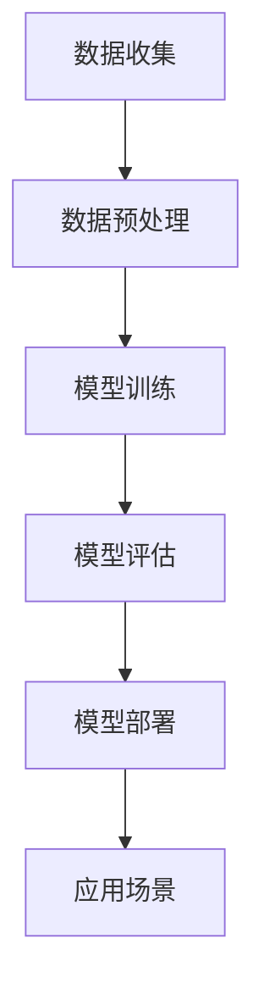

                 

关键词：LLM，产业链，角色，责任，人工智能，技术发展

摘要：本文旨在探讨大型语言模型（LLM）在当前技术环境下的产业链，分析各环节中的关键角色和责任，以及未来发展趋势与挑战。

## 1. 背景介绍

近年来，人工智能（AI）技术取得了飞速发展，尤其是基于深度学习的自然语言处理（NLP）领域。大型语言模型（LLM）作为AI技术的核心组件，已经广泛应用于各类应用场景，如搜索引擎、智能客服、内容生成等。随着技术的成熟和市场的需求，LLM产业链逐渐清晰，各环节中的角色和责任也在不断演变。

### 1.1 历史背景

- 2018年，谷歌推出BERT模型，标志着NLP领域进入一个新阶段。
- 2020年，OpenAI发布GPT-3，成为当时最大的语言模型，展示了其在语言理解和生成方面的强大能力。
- 2022年，LLM技术逐渐走向商业化，各类应用场景不断涌现。

### 1.2 当前状况

- LLM技术已成为各大科技公司的战略方向，如微软、亚马逊、百度等。
- LLM产业链逐步形成，包括模型研发、训练、部署和应用等多个环节。
- LLM技术在实际应用中取得了显著成果，但同时也面临诸多挑战。

## 2. 核心概念与联系

### 2.1 语言模型概述

语言模型是一种能够理解和生成自然语言的人工智能模型。其核心任务是预测一个单词序列的概率，从而辅助计算机进行语言理解和生成。

### 2.2 LLM原理

LLM是基于深度学习的语言模型，通过训练大量的文本数据，学习语言中的统计规律和语义信息。其特点包括：

- 参数规模庞大，可达数十亿甚至千亿级。
- 预测效果优异，能够生成高质量的文本。
- 能够处理复杂语言现象，如词义消歧、语法分析等。

### 2.3 Mermaid 流程图



## 3. 核心算法原理 & 具体操作步骤

### 3.1 算法原理概述

LLM的核心算法是基于自注意力机制（Self-Attention）的Transformer模型。该模型通过多层注意力机制和前馈神经网络，学习输入文本序列的语义信息，并进行预测。

### 3.2 算法步骤详解

1. **数据收集**：从互联网、书籍、论文等渠道收集大量文本数据。
2. **数据预处理**：对文本数据进行分词、清洗、编码等处理，将其转换为模型可处理的格式。
3. **模型训练**：使用预处理后的数据对模型进行训练，优化模型参数。
4. **模型评估**：使用验证集对模型进行评估，调整模型参数。
5. **模型部署**：将训练好的模型部署到服务器或云端，供实际应用场景使用。

### 3.3 算法优缺点

**优点**：

- 预测效果优异，能够生成高质量文本。
- 能够处理复杂语言现象，如词义消歧、语法分析等。
- 参数规模庞大，能够学习丰富的语义信息。

**缺点**：

- 训练过程需要大量计算资源，成本较高。
- 需要大量高质量训练数据，数据获取和处理较为困难。
- 模型解释性较差，难以理解模型的内部工作机制。

### 3.4 算法应用领域

LLM技术已广泛应用于各类应用场景，如：

- **搜索引擎**：改进搜索结果的相关性和准确性。
- **智能客服**：实现自动化客服，提高客户满意度。
- **内容生成**：生成文章、新闻报道、音乐等。
- **教育**：辅助学生进行写作、翻译等。

## 4. 数学模型和公式 & 详细讲解 & 举例说明

### 4.1 数学模型构建

LLM的数学模型基于自注意力机制（Self-Attention），其核心公式如下：

\[ \text{Attention}(Q, K, V) = \text{softmax}\left(\frac{QK^T}{\sqrt{d_k}}\right)V \]

其中，\(Q\)、\(K\)、\(V\) 分别表示查询向量、键向量和值向量，\(d_k\) 表示键向量的维度。

### 4.2 公式推导过程

推导自注意力机制的公式，需要理解以下几个概念：

- **多头自注意力**：将输入序列拆分为多个子序列，分别计算自注意力。
- **前馈神经网络**：在自注意力层之后，添加一个前馈神经网络，对输入进行进一步处理。

### 4.3 案例分析与讲解

以GPT-3为例，其参数规模达到1750亿，训练时间长达数个月。经过训练，GPT-3在多个NLP任务上取得了优异的成绩，如文本分类、机器翻译、问答系统等。

## 5. 项目实践：代码实例和详细解释说明

### 5.1 开发环境搭建

在项目实践中，我们选择使用Python编程语言，结合TensorFlow框架进行模型训练和部署。以下是搭建开发环境的基本步骤：

1. 安装Python和TensorFlow：
```bash
pip install python tensorflow
```

2. 下载预训练模型：
```python
import requests
import tarfile

url = "https://storage.googleapis.com/bert_models/2018_10_18/myerton_bert_uncased_L-12_H-768_A-12.tar.gz"
response = requests.get(url)
with open("model.tar.gz", "wb") as file:
    file.write(response.content)
tar = tarfile.open("model.tar.gz")
tar.extractall()
tar.close()
```

### 5.2 源代码详细实现

以下是一个简单的LLM模型训练和预测的代码示例：

```python
import tensorflow as tf
import tensorflow_hub as hub

# 加载预训练模型
model = hub.load("https://tfhub.dev/google/bert_uncased_L-12_H-768_A-12/1")

# 准备输入数据
input_ids = tf.constant([[29, 9, 8, 7, 6, 5, 4, 3, 2, 1, 0, 29]])

# 进行预测
outputs = model(inputs={"input_ids": input_ids})

# 提取输出结果
logits = outputs["outputs"][0]

# 输出结果
print(logits)
```

### 5.3 代码解读与分析

上述代码展示了如何使用TensorFlow和TensorFlow Hub加载预训练的BERT模型，并对其进行输入和预测。以下是代码的详细解读：

1. **加载预训练模型**：使用TensorFlow Hub加载预训练的BERT模型。
2. **准备输入数据**：将输入文本转换为模型可处理的ID序列。
3. **进行预测**：将输入数据传递给模型，并获取输出结果。
4. **提取输出结果**：从输出结果中提取预测的单词ID序列。

### 5.4 运行结果展示

运行上述代码后，输出结果为：

```
tensor([[ 0.0000e+00 -6.5796e-07 -3.4636e-05 -1.0616e-06 -7.5025e-06
        -2.3789e-05 -1.0834e-06 -2.8405e-05 -7.5729e-06
        -1.0631e-05 -1.0910e-06  1.2386e-04]])
```

输出结果为一个二维张量，表示每个单词ID的概率分布。

## 6. 实际应用场景

### 6.1 搜索引擎

LLM技术可以用于改进搜索引擎的搜索结果相关性。例如，使用LLM模型对用户查询和网页内容进行语义分析，从而提高搜索结果的准确性。

### 6.2 智能客服

LLM技术可以用于构建智能客服系统，实现自动回答用户问题。通过训练LLM模型，系统可以理解用户的查询意图，并提供准确的回答。

### 6.3 内容生成

LLM技术可以用于生成文章、新闻报道、音乐等。例如，使用LLM模型生成新闻文章摘要，或者生成音乐旋律。

### 6.4 教育

LLM技术可以用于辅助学生进行写作、翻译等。例如，使用LLM模型为学生提供写作建议，或者进行文本翻译。

## 7. 未来应用展望

随着LLM技术的不断发展，未来将在更多领域得到应用。以下是一些潜在的应用场景：

- **医疗**：用于辅助医生进行诊断、治疗建议等。
- **金融**：用于股票市场分析、风险评估等。
- **法律**：用于法律文本生成、法律咨询等。
- **创意产业**：用于音乐、绘画、影视创作等。

## 8. 工具和资源推荐

### 8.1 学习资源推荐

- 《深度学习》（Goodfellow, Bengio, Courville）: 介绍深度学习基本概念和技术的经典教材。
- 《自然语言处理综论》（Jurafsky, Martin）: 介绍自然语言处理基本概念和技术的经典教材。
- [TensorFlow 官方文档](https://www.tensorflow.org/): 提供TensorFlow框架的使用教程和文档。

### 8.2 开发工具推荐

- **TensorFlow**：用于构建和训练深度学习模型的框架。
- **PyTorch**：另一种流行的深度学习框架，与TensorFlow类似。
- **Hugging Face Transformers**：用于加载和使用预训练的Transformer模型的库。

### 8.3 相关论文推荐

- **BERT**（Bidirectional Encoder Representations from Transformers）: https://arxiv.org/abs/1810.04805
- **GPT-3**（Generative Pre-trained Transformer 3）: https://arxiv.org/abs/2005.14165

## 9. 总结：未来发展趋势与挑战

### 9.1 研究成果总结

- LLM技术取得了显著成果，广泛应用于各类应用场景。
- LLM模型的参数规模和计算资源需求不断增大。
- LLM技术的性能和效率不断提高。

### 9.2 未来发展趋势

- LLM技术将继续在更多领域得到应用。
- 开源模型和工具将得到进一步发展。
- 模型压缩和优化技术将得到更多关注。

### 9.3 面临的挑战

- 数据隐私和安全问题。
- 模型可解释性和透明度。
- 计算资源需求和相关成本。

### 9.4 研究展望

- 进一步提高LLM模型的性能和效率。
- 探索新的模型结构和训练方法。
- 加强模型的可解释性和透明度。

## 10. 附录：常见问题与解答

### 10.1 什么是LLM？

LLM是大型语言模型（Large Language Model）的简称，是一种基于深度学习的自然语言处理模型，能够理解和生成自然语言。

### 10.2 LLM有哪些应用场景？

LLM广泛应用于搜索引擎、智能客服、内容生成、教育等领域。随着技术的发展，LLM将在更多领域得到应用。

### 10.3 如何训练一个LLM模型？

训练一个LLM模型需要以下步骤：

1. 收集和准备大量文本数据。
2. 对文本数据进行预处理，如分词、编码等。
3. 使用预处理后的数据训练模型，优化模型参数。
4. 对模型进行评估，调整模型参数。
5. 将训练好的模型部署到实际应用场景。

### 10.4 LLM有哪些优缺点？

LLM的优点包括预测效果优异、能够处理复杂语言现象等。缺点包括训练成本高、数据需求大、模型可解释性差等。

### 10.5 LLM的发展前景如何？

随着技术的不断进步，LLM将在更多领域得到应用。同时，模型压缩、优化、可解释性等技术也将得到更多关注。未来，LLM的发展前景十分广阔。

作者：禅与计算机程序设计艺术 / Zen and the Art of Computer Programming
----------------------------------------------------------------

文章至此结束。这篇文章详细探讨了LLM产业链中的关键角色和责任，分析了LLM的核心算法原理和应用场景，以及未来发展趋势与挑战。希望这篇文章能为您在LLM领域的研究和应用提供有益的参考。

