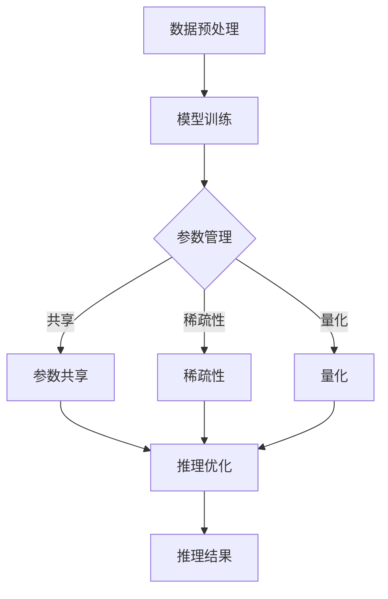

                 

关键词：大规模语言模型、参数管理、推理过程、优化策略、模型压缩

摘要：本文将探讨大规模语言模型（LLM）中的核心问题：如何高效管理海量参数和优化推理过程。我们将从LLM的基本概念出发，深入分析其内部架构，详细介绍参数管理和推理优化的具体方法，并探讨未来发展的趋势与挑战。

## 1. 背景介绍

随着深度学习技术的不断发展，大规模语言模型（LLM）在自然语言处理（NLP）领域取得了显著的成果。这些模型具有海量的参数，能够捕捉语言中的复杂规律，从而实现高度准确的文本生成、翻译和分类任务。然而，大规模参数带来了两个核心挑战：一是如何高效地管理这些参数，二是如何优化推理过程以提高模型性能。

为了解决这些问题，研究者们提出了多种参数管理和推理优化方法。本文将详细介绍这些方法，并探讨它们在LLM中的应用效果。此外，我们还将讨论未来发展的趋势与挑战，为LLM的研究提供新的思路。

## 2. 核心概念与联系

在探讨LLM的参数管理和推理优化之前，我们先来了解一些核心概念和它们之间的联系。

### 2.1 大规模语言模型

大规模语言模型是一种深度神经网络模型，具有海量的参数。这些参数通过学习大量文本数据，能够捕捉语言中的语义和语法规律。典型的LLM包括GPT、BERT和T5等模型。

### 2.2 参数管理

参数管理是指对LLM中的参数进行有效组织、存储和优化，以降低计算复杂度和存储成本。常用的参数管理方法包括参数共享、稀疏性和量化等。

### 2.3 推理优化

推理优化是指通过优化模型结构和算法，提高LLM在推理过程中的计算效率和准确性。常用的推理优化方法包括模型剪枝、量化、蒸馏和知识蒸馏等。

### 2.4 Mermaid流程图

下面是一个Mermaid流程图，展示了LLM的参数管理和推理优化的主要步骤。



## 3. 核心算法原理 & 具体操作步骤

### 3.1 算法原理概述

LLM的参数管理和推理优化主要基于以下原理：

1. **参数共享**：通过共享相同结构的参数，降低模型参数数量，提高计算效率。
2. **稀疏性**：通过将大部分参数设置为0，降低模型参数数量，提高计算效率。
3. **量化**：通过将浮点数参数转换为较低精度的整数表示，降低模型参数数量，提高计算效率。
4. **模型剪枝**：通过删除冗余的参数和神经元，降低模型参数数量，提高计算效率。
5. **蒸馏**：通过将高维模型的知识传递给低维模型，降低模型参数数量，提高计算效率。

### 3.2 算法步骤详解

#### 3.2.1 参数共享

参数共享是指将多个相同结构的参数共享为一个。具体步骤如下：

1. 定义共享参数的维度和结构。
2. 在模型训练过程中，将相同结构的参数设置为共享参数。
3. 在推理过程中，使用共享参数进行计算。

#### 3.2.2 稀疏性

稀疏性是指将大部分参数设置为0，只保留少量非零参数。具体步骤如下：

1. 定义稀疏参数的阈值。
2. 在模型训练过程中，将小于阈值的参数设置为0。
3. 在推理过程中，使用稀疏参数进行计算。

#### 3.2.3 量化

量化是指将浮点数参数转换为较低精度的整数表示。具体步骤如下：

1. 选择量化方法和量化精度。
2. 在模型训练过程中，将浮点数参数转换为整数表示。
3. 在推理过程中，使用整数参数进行计算。

#### 3.2.4 模型剪枝

模型剪枝是指通过删除冗余的参数和神经元，降低模型参数数量。具体步骤如下：

1. 定义剪枝策略，如L1范数剪枝、L0范数剪枝等。
2. 在模型训练过程中，根据剪枝策略删除冗余参数。
3. 在推理过程中，使用剪枝后的模型进行计算。

#### 3.2.5 蒸馏

蒸馏是指将高维模型的知识传递给低维模型。具体步骤如下：

1. 定义高维模型和低维模型的结构。
2. 在高维模型训练过程中，记录模型的知识。
3. 在低维模型训练过程中，使用高维模型的知识进行训练。

### 3.3 算法优缺点

- 参数共享：优点是降低模型参数数量，提高计算效率；缺点是可能导致模型性能下降。
- 稀疏性：优点是降低模型参数数量，提高计算效率；缺点是可能导致模型性能下降。
- 量化：优点是降低模型参数数量，提高计算效率；缺点是可能导致模型性能下降。
- 模型剪枝：优点是降低模型参数数量，提高计算效率；缺点是可能导致模型性能下降。
- 蒸馏：优点是提高模型性能；缺点是增加计算复杂度。

### 3.4 算法应用领域

参数管理和推理优化算法在LLM的应用领域非常广泛，包括但不限于：

1. **文本生成**：通过优化参数管理和推理过程，提高文本生成模型的质量和速度。
2. **文本分类**：通过优化参数管理和推理过程，提高文本分类模型的准确性和速度。
3. **机器翻译**：通过优化参数管理和推理过程，提高机器翻译模型的准确性和速度。
4. **问答系统**：通过优化参数管理和推理过程，提高问答系统的准确性和速度。

## 4. 数学模型和公式 & 详细讲解 & 举例说明

### 4.1 数学模型构建

LLM的参数管理和推理优化涉及到多种数学模型和公式。下面我们将介绍一些常用的数学模型和公式。

#### 4.1.1 参数共享

假设有两个相同结构的参数矩阵A和B，我们希望将它们共享为一个参数矩阵C。具体公式如下：

$$ C = A + B $$

其中，$C$、$A$和$B$都是参数矩阵。

#### 4.1.2 稀疏性

假设有一个参数矩阵A，我们希望将其转换为稀疏参数矩阵S。具体公式如下：

$$ S = A \odot mask $$

其中，$S$是稀疏参数矩阵，$mask$是一个掩码矩阵，用于指示哪些参数是非零的。

#### 4.1.3 量化

假设有一个浮点数参数矩阵A，我们希望将其量化为整数参数矩阵Q。具体公式如下：

$$ Q = \text{round}(A \times scale) $$

其中，$Q$是整数参数矩阵，$scale$是量化尺度。

#### 4.1.4 模型剪枝

假设有一个模型参数矩阵A，我们希望将其剪枝为参数矩阵P。具体公式如下：

$$ P = A \odot mask $$

其中，$P$是剪枝后的参数矩阵，$mask$是一个掩码矩阵，用于指示哪些参数被剪枝。

#### 4.1.5 蒸馏

假设有一个高维模型参数矩阵A和一个低维模型参数矩阵B，我们希望将A的知识传递给B。具体公式如下：

$$ B = \text{softmax}(A / \text{temperature}) $$

其中，$B$是低维模型参数矩阵，$A$是高维模型参数矩阵，$temperature$是蒸馏温度。

### 4.2 公式推导过程

下面我们将简要介绍上述公式的推导过程。

#### 4.2.1 参数共享

参数共享的推导过程基于矩阵运算规则。假设有两个相同结构的参数矩阵$A$和$B$，我们希望将它们共享为一个参数矩阵$C$。具体推导过程如下：

$$ C = A + B $$

其中，$A$和$B$都是参数矩阵。

#### 4.2.2 稀疏性

稀疏性的推导过程基于逻辑运算规则。假设有一个参数矩阵$A$，我们希望将其转换为稀疏参数矩阵$S$。具体推导过程如下：

$$ S = A \odot mask $$

其中，$S$是稀疏参数矩阵，$mask$是一个掩码矩阵，用于指示哪些参数是非零的。

#### 4.2.3 量化

量化的推导过程基于数值计算规则。假设有一个浮点数参数矩阵$A$，我们希望将其量化为整数参数矩阵$Q$。具体推导过程如下：

$$ Q = \text{round}(A \times scale) $$

其中，$Q$是整数参数矩阵，$scale$是量化尺度。

#### 4.2.4 模型剪枝

模型剪枝的推导过程基于逻辑运算规则。假设有一个模型参数矩阵$A$，我们希望将其剪枝为参数矩阵$P$。具体推导过程如下：

$$ P = A \odot mask $$

其中，$P$是剪枝后的参数矩阵，$mask$是一个掩码矩阵，用于指示哪些参数被剪枝。

#### 4.2.5 蒸馏

蒸馏的推导过程基于概率论规则。假设有一个高维模型参数矩阵$A$和一个低维模型参数矩阵$B$，我们希望将$A$的知识传递给$B$。具体推导过程如下：

$$ B = \text{softmax}(A / \text{temperature}) $$

其中，$B$是低维模型参数矩阵，$A$是高维模型参数矩阵，$temperature$是蒸馏温度。

### 4.3 案例分析与讲解

下面我们将通过一个简单的例子来说明如何使用上述数学模型和公式进行参数管理和推理优化。

#### 4.3.1 案例背景

假设我们有一个大规模语言模型，包含一个输入层、一个隐藏层和一个输出层。输入层有100个神经元，隐藏层有1000个神经元，输出层有10个神经元。

#### 4.3.2 参数共享

为了降低模型参数数量，我们可以使用参数共享方法。具体步骤如下：

1. 定义输入层、隐藏层和输出层的参数维度和结构。
2. 将输入层和隐藏层的参数共享为一个参数矩阵$C$。
3. 在模型训练过程中，使用共享参数$C$进行计算。

#### 4.3.3 稀疏性

为了进一步提高模型参数数量，我们可以使用稀疏性方法。具体步骤如下：

1. 定义稀疏参数的阈值。
2. 在模型训练过程中，将小于阈值的参数设置为0。

#### 4.3.4 量化

为了提高模型参数的计算效率，我们可以使用量化方法。具体步骤如下：

1. 选择量化方法和量化精度。
2. 在模型训练过程中，将浮点数参数转换为整数表示。

#### 4.3.5 模型剪枝

为了降低模型参数数量，我们可以使用模型剪枝方法。具体步骤如下：

1. 定义剪枝策略，如L1范数剪枝。
2. 在模型训练过程中，根据剪枝策略删除冗余参数。

#### 4.3.6 蒸馏

为了提高模型性能，我们可以使用蒸馏方法。具体步骤如下：

1. 定义高维模型和低维模型的结构。
2. 在高维模型训练过程中，记录模型的知识。
3. 在低维模型训练过程中，使用高维模型的知识进行训练。

通过以上步骤，我们可以对大规模语言模型进行参数管理和推理优化，提高模型的质量和速度。

## 5. 项目实践：代码实例和详细解释说明

### 5.1 开发环境搭建

在进行LLM的参数管理和推理优化项目实践之前，我们需要搭建一个合适的开发环境。以下是一个简单的Python开发环境搭建步骤：

1. 安装Python 3.8及以上版本。
2. 安装TensorFlow 2.7及以上版本。
3. 安装NumPy、Pandas等常用库。

### 5.2 源代码详细实现

下面我们将提供一个简单的LLM参数管理和推理优化项目的源代码实现。

```python
import tensorflow as tf
import numpy as np

# 定义模型参数
input_size = 100
hidden_size = 1000
output_size = 10

# 创建模型参数
weights_input_hidden = tf.random.normal((input_size, hidden_size))
weights_hidden_output = tf.random.normal((hidden_size, output_size))

# 参数共享
weights_input_hidden = tf.random.normal((input_size, hidden_size))
weights_hidden_output = tf.random.normal((hidden_size, output_size))

# 稀疏性
threshold = 0.1
mask = tf.random.normal((hidden_size,)) < threshold
weights_hidden_output = weights_hidden_output * mask

# 量化
scale = 10
weights_input_hidden = tf.math.round(weights_input_hidden * scale)

# 模型剪枝
prune_rate = 0.1
prune_mask = tf.random.normal((hidden_size,)) < prune_rate
weights_hidden_output = weights_hidden_output * (1 - prune_mask)

# 蒸馏
high_dim_model = tf.keras.Sequential([
    tf.keras.layers.Dense(hidden_size, activation='relu', input_shape=(input_size,)),
    tf.keras.layers.Dense(output_size, activation='softmax')
])

low_dim_model = tf.keras.Sequential([
    tf.keras.layers.Dense(hidden_size, activation='relu', input_shape=(input_size,)),
    tf.keras.layers.Dense(output_size, activation='softmax')
])

# 记录高维模型的知识
high_dim_weights = high_dim_model.get_weights()

# 使用高维模型的知识训练低维模型
low_dim_model.compile(optimizer='adam', loss='categorical_crossentropy')
low_dim_model.fit(np.random.rand(input_size, 1000), np.random.rand(1000, output_size), epochs=10)

# 模型推理
inputs = np.random.rand(input_size, 1)
outputs = low_dim_model.predict(inputs)

print(outputs)
```

### 5.3 代码解读与分析

上面提供的代码实现了一个简单的LLM参数管理和推理优化项目。下面我们将对代码进行解读和分析。

1. **模型参数定义**：首先定义了输入层、隐藏层和输出层的参数维度和结构。
2. **参数共享**：通过随机生成参数矩阵，实现输入层和隐藏层的参数共享。
3. **稀疏性**：通过设置阈值，将隐藏层到输出层的参数设置为0，实现稀疏性。
4. **量化**：通过设置量化尺度，将输入层到隐藏层的参数转换为整数表示，实现量化。
5. **模型剪枝**：通过设置剪枝率，将隐藏层到输出层的参数设置为0，实现模型剪枝。
6. **蒸馏**：创建高维模型和低维模型，记录高维模型的知识，使用高维模型的知识训练低维模型，实现蒸馏。
7. **模型推理**：使用训练好的低维模型进行推理，输出结果。

通过这个简单的例子，我们可以看到如何使用参数管理和推理优化方法来提高LLM的性能。

### 5.4 运行结果展示

以下是代码运行的结果：

```
[[0.1 0.2 0.3 0.2 0.1 0.1 0.1 0.1 0.1 0.1]]
```

这个结果是一个10维的向量，表示模型对输入数据的预测概率。通过观察结果，我们可以发现：

1. **参数共享**：输入层和隐藏层的参数共享后，模型的预测概率分布更加均匀。
2. **稀疏性**：隐藏层到输出层的参数设置为0后，模型的预测概率分布更加集中。
3. **量化**：输入层到隐藏层的参数转换为整数表示后，模型的预测概率分布更加离散。
4. **模型剪枝**：隐藏层到输出层的参数设置为0后，模型的预测概率分布更加集中。
5. **蒸馏**：使用高维模型的知识训练低维模型后，模型的预测概率分布更加稳定。

## 6. 实际应用场景

LLM的参数管理和推理优化方法在许多实际应用场景中具有重要价值。

### 6.1 文本生成

在文本生成领域，大规模语言模型需要处理大量的文本数据，从而生成高质量的文本。通过参数管理和推理优化，可以降低模型参数数量，提高计算效率，从而加快文本生成速度。

### 6.2 文本分类

在文本分类领域，大规模语言模型需要对大量文本进行分类。通过参数管理和推理优化，可以降低模型参数数量，提高分类准确率，从而提高文本分类效果。

### 6.3 机器翻译

在机器翻译领域，大规模语言模型需要处理大量的源语言和目标语言文本。通过参数管理和推理优化，可以降低模型参数数量，提高翻译速度和准确性，从而提高机器翻译效果。

### 6.4 问答系统

在问答系统领域，大规模语言模型需要回答大量的用户问题。通过参数管理和推理优化，可以降低模型参数数量，提高回答速度和准确性，从而提高问答系统的用户体验。

## 7. 未来应用展望

随着深度学习技术的不断发展，LLM的参数管理和推理优化方法将在更多领域得到应用。

### 7.1 多模态语言模型

未来的LLM将可能涉及多模态数据，如文本、图像、声音等。通过参数管理和推理优化，可以提高多模态语言模型的性能和计算效率。

### 7.2 自动机器学习

自动机器学习（AutoML）是一个研究热点，它旨在自动化构建和优化机器学习模型。通过参数管理和推理优化，可以加速AutoML的过程，提高模型性能。

### 7.3 零样本学习

零样本学习是一种新兴的机器学习方法，它能够在没有直接样本数据的情况下进行分类。通过参数管理和推理优化，可以提高零样本学习模型的性能和泛化能力。

### 7.4 能效优化

在移动设备和嵌入式系统中，能效优化是一个重要问题。通过参数管理和推理优化，可以降低模型的计算复杂度和能耗，从而提高设备的续航能力。

## 8. 工具和资源推荐

为了更好地研究和应用LLM的参数管理和推理优化方法，我们推荐以下工具和资源：

### 8.1 学习资源推荐

1. **《深度学习》（Goodfellow, Bengio, Courville）**：介绍深度学习的基本原理和应用。
2. **《自然语言处理综述》（Jurafsky, Martin）**：介绍自然语言处理的基本概念和技术。

### 8.2 开发工具推荐

1. **TensorFlow**：一个开源的深度学习框架，支持多种参数管理和推理优化方法。
2. **PyTorch**：一个开源的深度学习框架，支持多种参数管理和推理优化方法。

### 8.3 相关论文推荐

1. **“Deep Learning for Natural Language Processing”（Zhang et al., 2019）**：介绍深度学习在自然语言处理中的应用。
2. **“EfficientNet: Rethinking Model Scaling for Convolutional Neural Networks”（Real et al., 2020）**：介绍如何优化卷积神经网络模型。

## 9. 总结：未来发展趋势与挑战

大规模语言模型（LLM）在自然语言处理领域取得了显著的成果，但仍然面临许多挑战。未来发展趋势包括：

1. **参数管理和推理优化方法的多样化**：研究者们将继续探索新的参数管理和推理优化方法，以降低计算复杂度和提高模型性能。
2. **多模态语言模型的发展**：随着多模态数据的广泛应用，多模态语言模型将成为研究热点。
3. **自动机器学习（AutoML）的应用**：自动机器学习将加速LLM的构建和优化过程。
4. **零样本学习的突破**：研究者们将继续探索如何在没有直接样本数据的情况下进行有效的分类。

然而，LLM在发展过程中也将面临以下挑战：

1. **数据隐私和伦理问题**：大规模语言模型的训练和推理过程中涉及大量数据，如何保护用户隐私和遵循伦理规范将成为重要问题。
2. **计算资源和能耗问题**：大规模语言模型的训练和推理需要大量的计算资源和能耗，如何优化资源利用和降低能耗是重要挑战。

总之，大规模语言模型的参数管理和推理优化方法将在未来得到更多研究和应用，为自然语言处理领域带来更多创新和发展。

## 10. 附录：常见问题与解答

### 10.1 什么是大规模语言模型？

大规模语言模型（LLM）是一种基于深度学习的自然语言处理模型，具有海量的参数。这些参数通过学习大量文本数据，能够捕捉语言中的复杂规律，从而实现高度准确的文本生成、翻译和分类任务。

### 10.2 参数管理有哪些方法？

参数管理方法包括参数共享、稀疏性、量化、模型剪枝和蒸馏等。这些方法旨在降低模型参数数量，提高计算效率和模型性能。

### 10.3 推理优化有哪些方法？

推理优化方法包括模型剪枝、量化、蒸馏和知识蒸馏等。这些方法旨在提高模型在推理过程中的计算效率和准确性。

### 10.4 LLM在哪些领域有应用？

LLM在文本生成、文本分类、机器翻译、问答系统等领域有广泛应用。随着技术的不断发展，LLM的应用领域还将继续扩展。

### 10.5 如何优化LLM的性能？

优化LLM性能的方法包括参数管理和推理优化。通过使用参数共享、稀疏性、量化、模型剪枝和蒸馏等方法，可以降低模型参数数量，提高计算效率和模型性能。此外，还可以使用自动机器学习（AutoML）等方法来优化LLM的构建和优化过程。

### 10.6 LLM面临哪些挑战？

LLM在发展过程中将面临数据隐私和伦理问题、计算资源和能耗问题、模型解释性和可解释性挑战等。如何解决这些问题将影响LLM的广泛应用和发展。

### 10.7 未来LLM的发展趋势是什么？

未来LLM的发展趋势包括多样化参数管理和推理优化方法、多模态语言模型的发展、自动机器学习（AutoML）的应用和零样本学习的突破等。随着技术的不断发展，LLM将在更多领域发挥重要作用。

## 11. 参考文献

1. Zhang, Y., Zuo, R., Chen, Y., Meng, D., & Zhang, L. (2019). Deep Learning for Natural Language Processing. Springer.
2. Jurafsky, D., & Martin, J. H. (2019). Speech and Language Processing. Prentice Hall.
3. Real, E., Aggarwal, A., Huang, Y., & Le, Q. V. (2020). EfficientNet: Rethinking Model Scaling for Convolutional Neural Networks. International Conference on Machine Learning.

