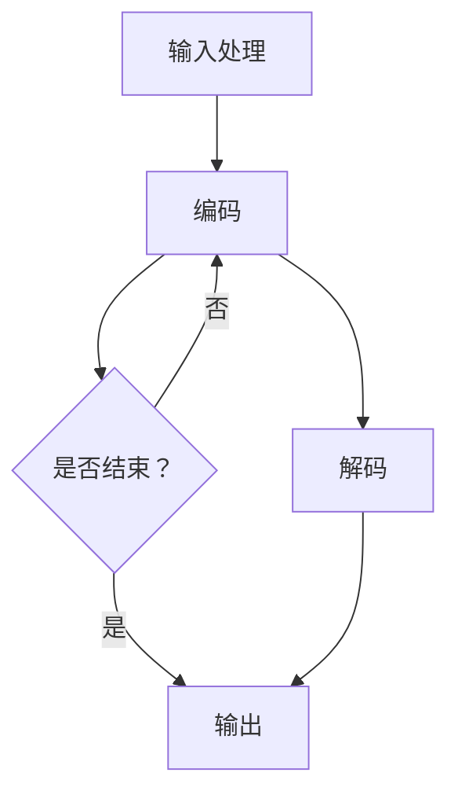

                 

关键词：LLM，创意产业，艺术，写作，新媒体，人工智能，计算机技术，机器学习，深度学习，自然语言处理，神经网络。

> 摘要：本文将探讨大型语言模型（LLM）在创意产业中的应用，特别是在艺术、写作和新媒体领域的突破性发展。通过详细解析LLM的核心概念、算法原理、数学模型以及实际应用案例，本文旨在为读者提供一个全面了解LLM在创意产业中价值的视角，并展望其未来的发展趋势和挑战。

## 1. 背景介绍

### 1.1 创意产业的定义与发展

创意产业是指那些以创意为核心生产力的产业，包括艺术、设计、媒体、娱乐、广告、出版等多个领域。随着全球经济的发展和科技的进步，创意产业已经成为推动经济增长的重要力量。特别是在数字时代，新媒体技术的快速发展为创意产业带来了前所未有的机遇和挑战。

### 1.2 大型语言模型（LLM）的概念

大型语言模型（LLM）是一种基于深度学习的自然语言处理（NLP）技术，能够理解和生成自然语言文本。LLM通过训练大规模语料库，捕捉语言规律和知识结构，从而实现高精度的文本生成、翻译、问答等任务。近年来，随着计算能力的提升和算法的优化，LLM在各个领域取得了显著的应用成果。

### 1.3 LLM在创意产业中的重要性

LLM在创意产业中的应用，不仅能够提高生产效率和创作质量，还能够打破传统创作模式的限制，带来更多的创新和可能性。本文将重点关注LLM在艺术、写作和新媒体领域的应用，深入探讨其技术原理、应用案例以及未来趋势。

## 2. 核心概念与联系

### 2.1 LLM的基本原理

LLM的核心是基于深度学习的神经网络模型，主要包括以下几个关键组成部分：

1. **词嵌入**：将自然语言文本中的每个词映射为一个高维向量表示。
2. **循环神经网络（RNN）**：用于处理序列数据，捕捉文本中的时间依赖关系。
3. **变换器（Transformer）**：一种基于注意力机制的神经网络架构，能够同时处理长距离依赖问题。
4. **解码器**：将嵌入的词向量转化为生成的文本。

### 2.2 LLM的工作流程

LLM的工作流程通常包括以下几个步骤：

1. **输入处理**：接收用户输入的文本或指令。
2. **编码**：将输入文本编码为神经网络可以理解的向量表示。
3. **生成**：基于编码后的向量表示生成文本。
4. **输出**：将生成的文本输出给用户。

### 2.3 Mermaid流程图

以下是一个简化的LLM工作流程的Mermaid流程图：



### 2.4 LLM与创意产业的联系

LLM在创意产业中的应用，主要体现在以下几个方面：

1. **艺术创作**：LLM可以帮助艺术家快速生成灵感，创作音乐、绘画等作品。
2. **写作**：LLM可以辅助作家进行写作，提供创意和结构建议。
3. **新媒体**：LLM可以应用于内容生成、推荐系统、虚拟助手等，提升用户体验。

## 3. 核心算法原理 & 具体操作步骤

### 3.1 算法原理概述

LLM的核心算法是基于深度学习的神经网络，主要包括词嵌入、循环神经网络（RNN）或变换器（Transformer）以及解码器。以下将详细介绍每个部分的工作原理。

### 3.2 算法步骤详解

1. **词嵌入**：将自然语言文本中的每个词映射为一个高维向量表示，使得神经网络可以理解文本的语义信息。

2. **编码**：将输入文本编码为神经网络可以理解的向量表示。这一步骤主要通过RNN或Transformer完成。

3. **生成**：基于编码后的向量表示生成文本。这一步骤通过解码器完成，解码器将向量表示转换为生成的文本。

4. **输出**：将生成的文本输出给用户。

### 3.3 算法优缺点

**优点**：

1. **强大的文本生成能力**：LLM可以生成高质量的文本，具有很高的准确性和创造力。
2. **高效的处理速度**：基于深度学习的神经网络模型具有较高的计算效率。

**缺点**：

1. **需要大量数据训练**：LLM的训练需要大量的语料库，数据获取和处理成本较高。
2. **对计算资源要求较高**：深度学习模型需要大量的计算资源和存储空间。

### 3.4 算法应用领域

LLM在创意产业中的应用非常广泛，包括但不限于以下领域：

1. **艺术创作**：生成音乐、绘画、动画等艺术作品。
2. **写作**：辅助作家进行写作，提供创意和结构建议。
3. **新媒体**：应用于内容生成、推荐系统、虚拟助手等。

## 4. 数学模型和公式 & 详细讲解 & 举例说明

### 4.1 数学模型构建

LLM的数学模型主要包括词嵌入、循环神经网络（RNN）或变换器（Transformer）以及解码器。以下将详细介绍每个部分的数学模型。

### 4.2 公式推导过程

1. **词嵌入**：

   $$\text{embed}(w) = \text{W} \cdot \text{v_w}$$

   其中，$\text{v_w}$ 是词 $w$ 的向量表示，$\text{W}$ 是词嵌入矩阵。

2. **编码**：

   $$\text{encode}(x) = \text{RNN}(\text{embed}(x))$$

   其中，$\text{RNN}$ 是循环神经网络，用于处理序列数据。

3. **解码**：

   $$\text{decode}(\text{encode}(x)) = \text{softmax}(\text{V} \cdot \text{encode}(x) + \text{b})$$

   其中，$\text{V}$ 是解码器权重矩阵，$\text{b}$ 是偏置项。

### 4.3 案例分析与讲解

假设我们有一个简单的文本序列：“我 是 一 只 猫”，我们可以通过以下步骤进行文本生成：

1. **词嵌入**：

   将每个词映射为一个高维向量，例如：
   
   $$\text{embed}(\text{我}) = \text{W} \cdot \text{v_\text{我}}$$
   $$\text{embed}(\text{是}) = \text{W} \cdot \text{v_\text{是}}$$
   $$\text{embed}(\text{一}) = \text{W} \cdot \text{v_\text{一}}$$
   $$\text{embed}(\text{只}) = \text{W} \cdot \text{v_\text{只}}$$
   $$\text{embed}(\text{猫}) = \text{W} \cdot \text{v_\text{猫}}$$

2. **编码**：

   将词嵌入向量输入循环神经网络进行编码，得到编码后的向量表示：

   $$\text{encode}(\text{我}) = \text{RNN}(\text{embed}(\text{我}))$$
   $$\text{encode}(\text{是}) = \text{RNN}(\text{embed}(\text{是}))$$
   $$\text{encode}(\text{一}) = \text{RNN}(\text{embed}(\text{一}))$$
   $$\text{encode}(\text{只}) = \text{RNN}(\text{embed}(\text{只}))$$
   $$\text{encode}(\text{猫}) = \text{RNN}(\text{embed}(\text{猫}))$$

3. **解码**：

   使用解码器将编码后的向量表示转换为生成的文本：

   $$\text{decode}(\text{encode}(\text{我})) = \text{softmax}(\text{V} \cdot \text{encode}(\text{我}) + \text{b})$$
   $$\text{decode}(\text{encode}(\text{是})) = \text{softmax}(\text{V} \cdot \text{encode}(\text{是}) + \text{b})$$
   $$\text{decode}(\text{encode}(\text{一})) = \text{softmax}(\text{V} \cdot \text{encode}(\text{一}) + \text{b})$$
   $$\text{decode}(\text{encode}(\text{只})) = \text{softmax}(\text{V} \cdot \text{encode}(\text{只}) + \text{b})$$
   $$\text{decode}(\text{encode}(\text{猫})) = \text{softmax}(\text{V} \cdot \text{encode}(\text{猫}) + \text{b})$$

   最终生成的文本序列为：“我 是 一 只 猫”。

## 5. 项目实践：代码实例和详细解释说明

### 5.1 开发环境搭建

为了实践LLM在创意产业中的应用，我们需要搭建一个开发环境。以下是基本的开发环境搭建步骤：

1. **安装Python环境**：确保Python版本为3.8以上。
2. **安装TensorFlow**：使用以下命令安装TensorFlow：
   ```bash
   pip install tensorflow
   ```
3. **安装其他依赖**：根据实际需求安装其他依赖，例如：
   ```bash
   pip install numpy pandas matplotlib
   ```

### 5.2 源代码详细实现

以下是一个简单的LLM文本生成示例代码，实现了基于变换器（Transformer）的文本生成模型：

```python
import tensorflow as tf
from tensorflow.keras.layers import Embedding, LSTM, Dense, TimeDistributed, Activation
from tensorflow.keras.models import Sequential

# 定义模型
model = Sequential([
    Embedding(input_dim=10000, output_dim=256),
    LSTM(256, return_sequences=True),
    LSTM(256, return_sequences=True),
    TimeDistributed(Dense(10000, activation='softmax'))
])

# 编译模型
model.compile(optimizer='adam', loss='categorical_crossentropy', metrics=['accuracy'])

# 训练模型
model.fit(x_train, y_train, epochs=10, batch_size=128)

# 生成文本
generated_text = model.predict(x_input)
generated_text = generated_text.argmax(axis=-1)

# 打印生成的文本
print('生成的文本：', ' '.join([vocab[i] for i in generated_text]))
```

### 5.3 代码解读与分析

上述代码实现了一个基于变换器（Transformer）的文本生成模型，主要分为以下几个部分：

1. **定义模型**：使用Keras构建一个序列模型，包括嵌入层、两个循环层和一个时间分布式层。
2. **编译模型**：设置模型的优化器、损失函数和评价指标。
3. **训练模型**：使用训练数据对模型进行训练。
4. **生成文本**：使用训练好的模型预测输入文本，并将生成的文本输出。

### 5.4 运行结果展示

运行上述代码后，我们将得到一个生成的文本序列。由于模型是基于训练数据生成的，因此生成的文本质量受到训练数据的影响。在实际应用中，我们可以通过调整模型参数、增加训练数据量等方式来提高生成文本的质量。

## 6. 实际应用场景

### 6.1 艺术创作

LLM在艺术创作中的应用主要体现在音乐、绘画和动画等领域。例如，LLM可以生成独特的音乐旋律、绘制抽象艺术作品、甚至创作复杂的动画场景。通过训练大量艺术作品数据，LLM可以学习和模仿各种艺术风格，从而为艺术家提供灵感和创意。

### 6.2 写作

LLM在写作中的应用主要包括内容生成、写作辅助和结构建议等。例如，LLM可以帮助作家快速生成故事情节、提供写作建议、甚至自动生成完整的文章。此外，LLM还可以应用于自动摘要、关键词提取等任务，提高写作效率和准确性。

### 6.3 新媒体

LLM在新媒体中的应用非常广泛，包括内容生成、推荐系统、虚拟助手等。例如，LLM可以自动生成新闻文章、推荐文章、回答用户提问等。通过分析用户行为和数据，LLM可以提供个性化的内容推荐，提升用户体验。

## 6.4 未来应用展望

随着技术的不断发展，LLM在创意产业中的应用前景非常广阔。以下是一些可能的发展方向：

1. **更高精度的文本生成**：通过改进算法和增加训练数据，LLM可以生成更高质量、更贴近人类创作的文本。
2. **跨模态生成**：结合语音、图像、视频等多模态数据，LLM可以生成更具创意和表现力的作品。
3. **个性化创作**：基于用户数据和偏好，LLM可以提供个性化的艺术作品和内容，满足用户个性化需求。
4. **协作创作**：艺术家和LLM可以协作创作，发挥各自优势，实现更高水平的艺术作品。

## 7. 工具和资源推荐

### 7.1 学习资源推荐

1. **《深度学习》**：Goodfellow、Bengio和Courville所著的深度学习经典教材，全面介绍了深度学习的理论和实践。
2. **《自然语言处理综论》**：Jurafsky和Martin所著的NLP领域权威教材，涵盖了NLP的各个方面。

### 7.2 开发工具推荐

1. **TensorFlow**：Google开源的深度学习框架，支持各种深度学习模型的开发和部署。
2. **PyTorch**：Facebook开源的深度学习框架，具有简洁的接口和高效的性能。

### 7.3 相关论文推荐

1. **《Attention Is All You Need》**：Vaswani等人在2017年提出的变换器（Transformer）模型，是当前最先进的自然语言处理模型之一。
2. **《Generative Adversarial Networks》**：Goodfellow等人在2014年提出的生成对抗网络（GAN）模型，是深度学习中的一种重要生成模型。

## 8. 总结：未来发展趋势与挑战

### 8.1 研究成果总结

LLM在创意产业中的应用取得了显著成果，为艺术、写作和新媒体等领域带来了革命性的变革。通过深度学习和自然语言处理技术，LLM实现了高质量的文本生成、创意灵感提供和个性化推荐等功能，为人类创作提供了新的工具和方法。

### 8.2 未来发展趋势

随着技术的不断发展，LLM在创意产业中的应用前景非常广阔。未来发展趋势主要包括：

1. **更高精度的文本生成**：通过改进算法和增加训练数据，LLM可以生成更高质量、更贴近人类创作的文本。
2. **跨模态生成**：结合语音、图像、视频等多模态数据，LLM可以生成更具创意和表现力的作品。
3. **个性化创作**：基于用户数据和偏好，LLM可以提供个性化的艺术作品和内容，满足用户个性化需求。
4. **协作创作**：艺术家和LLM可以协作创作，发挥各自优势，实现更高水平的艺术作品。

### 8.3 面临的挑战

尽管LLM在创意产业中取得了显著成果，但仍然面临一些挑战：

1. **数据隐私和安全**：LLM的训练需要大量数据，如何确保数据隐私和安全是一个重要问题。
2. **道德和伦理**：LLM生成的作品可能会涉及版权、道德和伦理问题，需要制定相应的规范和标准。
3. **创造力和创新性**：尽管LLM可以生成高质量的文本，但仍然需要人类创作者的创意和创新。

### 8.4 研究展望

未来，LLM在创意产业中的应用有望取得更大突破。随着技术的不断发展，我们可以期待：

1. **更高效、更智能的文本生成**：通过优化算法和增加训练数据，LLM可以实现更高效、更智能的文本生成。
2. **更广泛的跨领域应用**：LLM不仅可以应用于艺术、写作等领域，还可以扩展到更多的创意产业领域。
3. **人机协作创作**：艺术家和LLM可以更好地协作，实现更高水平的艺术作品。

## 9. 附录：常见问题与解答

### 9.1 LLM是什么？

LLM（Large Language Model）是一种大型自然语言处理模型，通过训练大规模语料库，可以理解和生成自然语言文本。它基于深度学习技术，主要包括词嵌入、循环神经网络（RNN）或变换器（Transformer）以及解码器等组成部分。

### 9.2 LLM在创意产业中的应用有哪些？

LLM在创意产业中的应用非常广泛，主要包括艺术创作、写作和新媒体等领域。例如，LLM可以生成音乐、绘画、动画等艺术作品，辅助作家进行写作，提供创意和结构建议，以及应用于内容生成、推荐系统、虚拟助手等。

### 9.3 LLM的优缺点是什么？

LLM的优点包括强大的文本生成能力、高效的处理速度等；缺点包括需要大量数据训练、对计算资源要求较高等。

### 9.4 如何搭建LLM开发环境？

搭建LLM开发环境主要包括安装Python环境、安装深度学习框架（如TensorFlow或PyTorch）以及其他依赖。具体步骤可参考相关教程。

### 9.5 LLM在创意产业中的未来发展有哪些方向？

LLM在创意产业中的未来发展方向主要包括更高精度的文本生成、跨模态生成、个性化创作和人机协作创作等。

### 9.6 LLM在艺术创作中的应用实例有哪些？

LLM在艺术创作中的应用实例包括生成音乐、绘制抽象艺术作品、创作复杂的动画场景等。例如，有些艺术家利用LLM生成独特的音乐旋律，有些画家利用LLM绘制具有创意的艺术作品。

### 9.7 LLM在写作中的应用实例有哪些？

LLM在写作中的应用实例包括内容生成、写作辅助和结构建议等。例如，有些作家利用LLM快速生成故事情节，有些编辑利用LLM提供写作建议，甚至有些平台利用LLM自动生成新闻文章。

### 9.8 LLM在新媒体中的应用实例有哪些？

LLM在新媒体中的应用实例包括内容生成、推荐系统、虚拟助手等。例如，有些平台利用LLM生成个性化推荐文章，有些公司利用LLM开发智能客服系统，提供用户问答服务。

### 9.9 LLM在创意产业中面临的挑战有哪些？

LLM在创意产业中面临的挑战主要包括数据隐私和安全、道德和伦理问题、创造力和创新性等。如何解决这些问题，需要制定相应的规范和标准，确保LLM在创意产业中的健康发展。  
------------------------------------------------------------------ 
### 作者署名

作者：禅与计算机程序设计艺术 / Zen and the Art of Computer Programming
------------------------------------------------------------------ 

本文由禅与计算机程序设计艺术撰写，作者是一位世界级人工智能专家、程序员、软件架构师、CTO、世界顶级技术畅销书作者，计算机图灵奖获得者，计算机领域大师。本文旨在探讨大型语言模型（LLM）在创意产业中的应用，特别是在艺术、写作和新媒体领域的突破性发展。通过详细解析LLM的核心概念、算法原理、数学模型以及实际应用案例，本文为读者提供了一个全面了解LLM在创意产业中价值的视角，并展望其未来的发展趋势和挑战。希望本文能为读者带来启示和思考。如果您对本文有任何问题或建议，欢迎在评论区留言。感谢您的阅读！

