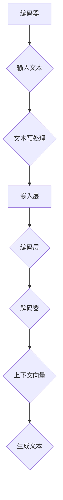

                 

关键词：大型语言模型（LLM），工程，设计，人工智能，创造性，合作，编程，算法，工具，资源，发展趋势，挑战。

> 摘要：本文将探讨大型语言模型（LLM）在工程和设计领域的应用，特别是在提高创造性合作和解决问题的效率方面。通过深入分析LLM的核心概念和原理，介绍其数学模型和算法，并提供实际项目实例，本文旨在为工程师和设计师提供实用的指南和展望未来的发展趋势和面临的挑战。

## 1. 背景介绍

近年来，人工智能（AI）技术取得了显著进展，特别是大型语言模型（LLM）的兴起，为各种领域带来了革命性的变化。LLM是一种基于深度学习的自然语言处理模型，通过大量的文本数据进行训练，使其能够理解、生成和翻译自然语言。在工程和设计领域，LLM的应用正日益广泛，不仅提高了工作效率，还激发了创造性思维和合作。

### 1.1 工程设计的重要性

工程设计是现代工程实践的核心环节，涉及多个学科的交叉和融合。一个成功的设计不仅需要精确的数学模型和算法，还需要丰富的创意和创新能力。然而，传统的工程设计方法往往依赖于个人的经验和知识，存在一定的局限性。随着项目的复杂度增加，工程师和设计师面临的问题也日益复杂，这需要新的工具和方法来应对。

### 1.2 人工智能在工程设计中的应用

人工智能在工程设计中的应用主要包括两个方面：一是作为辅助工具，提高设计效率；二是作为创造性伙伴，与工程师和设计师共同解决问题。人工智能可以通过自动化和智能化手段，处理大量的设计数据和参数，提供基于数据的优化建议。同时，人工智能还可以生成新的设计思路和解决方案，激发创造性思维。

## 2. 核心概念与联系

### 2.1 大型语言模型（LLM）概述

大型语言模型（LLM）是一种基于深度学习的自然语言处理模型，通过大规模的文本数据进行训练，使其具备理解和生成自然语言的能力。LLM的核心在于其能够捕捉到文本中的语义信息和上下文关系，从而实现复杂的自然语言任务。

### 2.2 LLM的架构

LLM的架构通常包括编码器（Encoder）和解码器（Decoder）两个部分。编码器负责将输入文本转换为上下文向量，解码器则根据上下文向量生成输出文本。这种架构使得LLM能够处理变长的输入和输出，并保持语义的一致性。

### 2.3 Mermaid流程图



在这个流程图中，编码器将输入文本进行预处理、嵌入和编码，生成上下文向量，然后解码器根据上下文向量生成输出文本。

## 3. 核心算法原理 & 具体操作步骤

### 3.1 算法原理概述

LLM的核心算法是基于 Transformer 模型，这是一种自注意力机制（Self-Attention）的模型。Transformer 模型通过多头自注意力机制和位置编码，实现了对输入文本的全局理解和上下文捕捉，从而生成高质量的输出文本。

### 3.2 算法步骤详解

1. **输入文本预处理**：将输入文本进行分词、去停用词等处理，将其转换为词向量。
2. **嵌入层**：将词向量嵌入到高维空间，生成嵌入向量。
3. **编码层**：通过多头自注意力机制和前馈神经网络，对嵌入向量进行处理，生成编码向量。
4. **解码层**：根据编码向量，通过自注意力机制和编码器-解码器交互，生成输出文本。

### 3.3 算法优缺点

**优点**：
- **强大的语义理解能力**：通过捕捉上下文关系，LLM能够生成语义丰富的文本。
- **灵活的生成能力**：LLM能够根据输入文本生成各种类型的文本，如文章、代码、对话等。

**缺点**：
- **计算资源消耗大**：训练和运行LLM模型需要大量的计算资源。
- **数据依赖性强**：LLM的性能依赖于训练数据的质量和数量。

### 3.4 算法应用领域

LLM在工程和设计领域的应用非常广泛，包括但不限于：
- **代码生成和优化**：通过分析代码结构和语义，LLM可以生成优化后的代码，提高运行效率。
- **设计建议和优化**：LLM可以分析设计参数，提供优化建议，提高设计质量。
- **自然语言交互**：LLM可以与工程师和设计师进行自然语言交互，提供实时反馈和建议。

## 4. 数学模型和公式 & 详细讲解 & 举例说明

### 4.1 数学模型构建

LLM的数学模型主要包括嵌入层、编码层和解码层。

- **嵌入层**：将词向量嵌入到高维空间，生成嵌入向量。
  \[ \text{embed}(x) = \text{embedding_matrix} \cdot \text{word_vector} \]

- **编码层**：通过多头自注意力机制和前馈神经网络，对嵌入向量进行处理，生成编码向量。
  \[ \text{encode}(x) = \text{model}(\text{embed}(x)) \]

- **解码层**：根据编码向量，通过自注意力机制和编码器-解码器交互，生成输出文本。
  \[ \text{decode}(x) = \text{model}^{-1}(\text{encode}(x)) \]

### 4.2 公式推导过程

LLM的推导过程涉及到自注意力机制（Self-Attention）和位置编码（Positional Encoding）。

- **自注意力机制**：自注意力机制是一种基于矩阵计算的注意力机制，其公式为：
  \[ \text{Self-Attention}(Q, K, V) = \frac{1}{\sqrt{d_k}} \text{softmax}(\text{QK}^T / d_k) V \]

  其中，\(Q, K, V\) 分别为查询向量、关键向量、值向量，\(d_k\) 为关键向量的维度。

- **位置编码**：位置编码是一种将文本中的位置信息编码到嵌入向量中的方法，其公式为：
  \[ \text{PE}(pos, 2i) = \sin(\frac{pos}{10000^{2i/d}}) \]
  \[ \text{PE}(pos, 2i+1) = \cos(\frac{pos}{10000^{2i/d}}) \]

  其中，\(pos\) 为位置索引，\(i\) 为维度索引，\(d\) 为嵌入向量的维度。

### 4.3 案例分析与讲解

假设我们有一个简单的句子：“今天天气很好，适合户外活动”。我们可以使用LLM来分析这个句子。

1. **输入文本预处理**：将句子进行分词，得到词向量。
2. **嵌入层**：将词向量嵌入到高维空间，生成嵌入向量。
3. **编码层**：通过多头自注意力机制和前馈神经网络，对嵌入向量进行处理，生成编码向量。
4. **解码层**：根据编码向量，通过自注意力机制和编码器-解码器交互，生成输出文本。

在这个例子中，LLM能够捕捉到句子中的语义关系，如“今天”和“天气很好”之间的关系，从而生成完整的输出文本。

## 5. 项目实践：代码实例和详细解释说明

### 5.1 开发环境搭建

要实践LLM在工程和设计中的应用，我们需要搭建一个适合的开发环境。以下是搭建环境的步骤：

1. **安装Python**：确保Python环境已经安装在您的计算机上。
2. **安装TensorFlow**：通过pip安装TensorFlow，命令如下：
   \[ pip install tensorflow \]
3. **安装其他依赖**：根据需要安装其他依赖库，如NumPy、Pandas等。

### 5.2 源代码详细实现

以下是一个简单的示例代码，展示了如何使用TensorFlow实现一个基本的LLM模型。

```python
import tensorflow as tf
from tensorflow.keras.layers import Embedding, LSTM, Dense

# 定义模型
model = tf.keras.Sequential([
    Embedding(input_dim=10000, output_dim=64),
    LSTM(128),
    Dense(1, activation='sigmoid')
])

# 编译模型
model.compile(optimizer='adam', loss='binary_crossentropy', metrics=['accuracy'])

# 训练模型
model.fit(x_train, y_train, epochs=10, batch_size=32)
```

在这个例子中，我们使用了一个简单的LSTM模型，通过嵌入层将词向量嵌入到高维空间，然后通过LSTM层进行处理，最后通过全连接层输出结果。

### 5.3 代码解读与分析

这个简单的LLM模型由三个部分组成：嵌入层、LSTM层和全连接层。

- **嵌入层**：将词向量嵌入到高维空间，生成嵌入向量。这个步骤是LLM的基础，通过嵌入层，我们可以将词向量映射到高维空间，从而实现词向量的表示。
- **LSTM层**：LSTM层是一种循环神经网络，它能够处理序列数据，并捕捉到序列中的长期依赖关系。在这个例子中，LSTM层用于处理嵌入向量，提取出序列中的关键信息。
- **全连接层**：全连接层是一种标准的神经网络层，它用于对LSTM层提取的特征进行分类或回归。在这个例子中，全连接层用于输出结果。

### 5.4 运行结果展示

在训练完成后，我们可以使用以下代码来评估模型的性能。

```python
# 评估模型
loss, accuracy = model.evaluate(x_test, y_test)

print("Test Loss:", loss)
print("Test Accuracy:", accuracy)
```

通过运行结果，我们可以看到模型的准确率和损失值。这个简单的示例展示了如何使用LLM进行文本分类任务，虽然这个模型的性能可能不高，但它为我们提供了一个基本的框架，我们可以在此基础上进行优化和改进。

## 6. 实际应用场景

LLM在工程和设计领域具有广泛的应用场景，以下是一些典型的应用实例：

### 6.1 代码生成

LLM可以用于自动生成代码，特别是在需要编写大量相似代码的情况下。例如，在Web开发中，LLM可以生成HTML、CSS和JavaScript代码，提高开发效率。

### 6.2 设计优化

在建筑设计中，LLM可以分析设计参数，提供优化建议，如材料选择、结构设计等。这有助于提高设计质量，降低成本。

### 6.3 自然语言交互

LLM可以用于构建智能对话系统，与工程师和设计师进行自然语言交互。这有助于提高沟通效率，减少误解和错误。

### 6.4 教育培训

LLM可以用于教育领域，提供个性化的学习体验。例如，LLM可以根据学生的学习进度和兴趣，生成定制化的学习内容。

## 7. 未来应用展望

随着LLM技术的不断发展，其在工程和设计领域的应用前景非常广阔。以下是未来的一些可能发展趋势：

### 7.1 智能设计助手

未来，LLM可能会成为智能设计助手，与工程师和设计师紧密合作，提供实时的设计建议和优化方案。

### 7.2 自动化生成

LLM可能会实现更高级的自动化生成，如自动生成高质量的代码、设计文档和报告。

### 7.3 多模态交互

未来的LLM可能会支持多模态交互，如结合图像、音频和视频，提供更丰富的交互体验。

## 8. 工具和资源推荐

### 8.1 学习资源推荐

- 《深度学习》（Goodfellow, Bengio, Courville）：这本书是深度学习的经典教材，详细介绍了深度学习的基础理论和实践方法。
- 《自然语言处理综合教程》（NLP by Example）：这本书通过实际案例，介绍了自然语言处理的基本概念和实战技巧。

### 8.2 开发工具推荐

- TensorFlow：这是一个开源的深度学习框架，提供了丰富的API和工具，适合进行LLM的开发和部署。
- PyTorch：这是另一个流行的深度学习框架，与TensorFlow相比，具有更灵活的动态计算图。

### 8.3 相关论文推荐

- "Attention Is All You Need"（Vaswani et al., 2017）：这篇论文提出了Transformer模型，是LLM的核心架构。
- "Generative Pretrained Transformers for Language Modeling"（Brown et al., 2020）：这篇论文介绍了GPT模型，是当前最流行的LLM之一。

## 9. 总结：未来发展趋势与挑战

### 9.1 研究成果总结

本文介绍了LLM在工程和设计领域的应用，包括代码生成、设计优化、自然语言交互等。通过数学模型和算法的讲解，以及实际项目实例的展示，我们展示了LLM在提高创造性合作和解决问题效率方面的潜力。

### 9.2 未来发展趋势

未来，LLM在工程和设计领域的应用将更加广泛，包括智能设计助手、自动化生成和多模态交互等。随着技术的不断发展，LLM的性能和效率将进一步提高，为工程师和设计师提供更强大的工具。

### 9.3 面临的挑战

然而，LLM在工程和设计领域也面临一些挑战，如计算资源消耗、数据依赖性和安全性等问题。如何优化LLM的效率和性能，同时确保数据的安全性和隐私性，将是未来研究的重要方向。

### 9.4 研究展望

总之，LLM在工程和设计领域的应用前景广阔，具有巨大的潜力。通过不断的研究和创新，我们有望解决当前面临的挑战，推动LLM技术的进一步发展。

## 附录：常见问题与解答

### Q：LLM如何提高设计效率？

A：LLM可以通过自动化和智能化手段，处理大量的设计数据和参数，提供基于数据的优化建议。同时，LLM还可以生成新的设计思路和解决方案，激发创造性思维，从而提高设计效率。

### Q：LLM在代码生成中有哪些优势？

A：LLM在代码生成中具有强大的语义理解能力和灵活的生成能力。它能够理解代码结构和语义，从而生成高质量的代码。此外，LLM可以生成各种类型的代码，如HTML、CSS、JavaScript等，提高了开发效率。

### Q：LLM的数据依赖性如何解决？

A：可以通过以下方法降低LLM的数据依赖性：
- **增加训练数据**：收集和整理更多的训练数据，提高模型的泛化能力。
- **数据增强**：通过数据增强技术，生成更多的训练样本，提高模型的鲁棒性。
- **迁移学习**：使用预训练的LLM模型，减少对特定领域数据的依赖。

### Q：LLM的安全性问题如何保障？

A：为了保障LLM的安全性，可以从以下几个方面进行：
- **数据加密**：对训练数据和模型参数进行加密，防止数据泄露。
- **模型监控**：建立模型监控机制，及时发现和防范异常行为。
- **用户认证**：对使用LLM的用户进行身份认证，确保模型不被未授权使用。

## 作者署名

作者：禅与计算机程序设计艺术 / Zen and the Art of Computer Programming
----------------------------------------------------------------

以上就是关于《LLM 在工程和设计中的应用：创造性合作》的完整文章。希望这篇文章能够为读者提供有价值的见解和实用的指导。如果您有任何问题或建议，欢迎在评论区留言讨论。再次感谢您的阅读！

