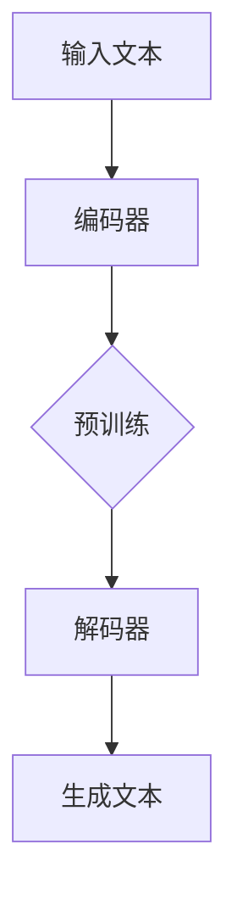

                 

关键词：自然语言处理、大型语言模型、科学研究、算法优化、创新发现

## 摘要

本文将探讨大型语言模型（LLM）在科学研究中的广泛应用及其对加速发现和创新的重要性。首先，我们将介绍LLM的基本概念和原理，并展示其在科研领域的潜在优势。随后，我们将详细分析LLM在文献检索、数据分析、模型优化等具体应用场景中的表现，并通过实例说明其具体操作步骤和实现方法。此外，本文还将探讨LLM在科学研究中的未来发展趋势和面临的挑战，为读者提供全面的见解和指导。

## 1. 背景介绍

在过去的几十年中，人工智能（AI）技术取得了显著的进展，其中自然语言处理（NLP）作为AI的重要组成部分，也取得了长足的进步。特别是近年来，大型语言模型（LLM）如GPT、BERT等，以其强大的预训练能力和丰富的知识储备，在多个领域展现出了卓越的性能。LLM的出现，不仅改变了NLP的研究范式，也为科学研究带来了前所未有的机遇。

科学研究是一个复杂的过程，涉及到数据采集、分析、解释和决策等多个环节。传统的科研方法通常依赖于人工处理和手动分析，效率较低，且容易受到主观因素的影响。随着LLM技术的发展，我们可以借助这些模型，实现自动化和智能化的科研流程，从而提高研究效率，促进创新发现。本文将重点讨论LLM在以下方面的应用：

1. 文献检索：通过分析大量的学术文献，LLM可以帮助科研人员快速找到相关研究，节省大量的时间和精力。
2. 数据分析：LLM可以处理和分析大规模的复杂数据集，发现潜在的模式和规律，为科学研究提供新的视角。
3. 模型优化：LLM可以帮助研究人员优化算法模型，提高模型的性能和稳定性，从而推动科学研究的进步。

### 1.1 LLM的基本概念和原理

LLM是一种基于深度学习的自然语言处理模型，通常由多个层次的神经网络组成。通过大量的文本数据进行预训练，LLM可以自动学习语言中的语法、语义和上下文信息，从而实现对文本的生成、理解和推理。

LLM的核心原理是基于Transformer架构，这是一种基于自注意力机制的神经网络模型。Transformer通过多头注意力机制，能够同时关注输入序列中的不同位置和不同维度，从而提高了模型的表示能力和理解能力。此外，LLM还采用了预训练加微调的方法，即在大规模语料库上进行预训练，然后在特定任务上进行微调，以适应不同的应用场景。

### 1.2 LLM的优势

LLM在科学研究中的优势主要体现在以下几个方面：

1. **强大的预训练能力**：LLM通过预训练，可以自动学习大量的语言知识和信息，为科学研究提供了丰富的知识支持。
2. **高效的文本生成和理解能力**：LLM能够生成高质量的文本，并理解复杂的语言表达，为文献检索和数据分析提供了强大的工具。
3. **灵活的模型应用**：LLM可以应用于多种任务，如文本分类、实体识别、情感分析等，为科研人员提供了多样化的解决方案。
4. **强大的推理能力**：LLM能够进行逻辑推理和知识推理，为科学研究的解释和决策提供了新的思路。

## 2. 核心概念与联系

### 2.1 大型语言模型（LLM）的组成部分

大型语言模型（LLM）主要由以下几个核心组成部分构成：

1. **编码器（Encoder）**：编码器负责将输入文本转换为向量表示，从而捕捉文本的语义信息。编码器的核心是Transformer架构，通过多头注意力机制和自注意力机制，编码器能够同时关注输入序列的不同位置和不同维度，从而生成丰富的向量表示。
2. **解码器（Decoder）**：解码器负责根据编码器生成的向量表示，生成输出文本。解码器同样基于Transformer架构，通过解码器的自注意力机制，解码器能够根据上下文信息，生成符合语言规则的输出文本。
3. **预训练（Pre-training）**：预训练是LLM的核心步骤，通过在大规模语料库上训练，LLM可以自动学习语言中的语法、语义和上下文信息，从而实现对文本的生成、理解和推理。
4. **微调（Fine-tuning）**：微调是在特定任务上进行训练，以适应不同的应用场景。通过微调，LLM可以针对特定任务，调整模型的参数和权重，从而提高模型的性能。

### 2.2 LLM的工作原理

LLM的工作原理主要包括以下几个步骤：

1. **输入文本**：首先，LLM接收输入的文本数据，如一篇文章、一段对话或一个查询。
2. **编码**：编码器将输入文本转换为向量表示，这个向量表示包含了文本的语义信息。
3. **解码**：解码器根据编码器生成的向量表示，生成输出文本。解码器通过自注意力机制，不断更新上下文信息，生成符合语言规则的输出文本。
4. **生成文本**：最后，LLM生成输出文本，这个文本可以是文章的摘要、对话的回复或查询的答案。

### 2.3 LLM的优势和局限

LLM的优势在于：

1. **强大的预训练能力**：LLM通过预训练，可以自动学习大量的语言知识和信息，为科学研究提供了丰富的知识支持。
2. **高效的文本生成和理解能力**：LLM能够生成高质量的文本，并理解复杂的语言表达，为文献检索和数据分析提供了强大的工具。
3. **灵活的模型应用**：LLM可以应用于多种任务，如文本分类、实体识别、情感分析等，为科研人员提供了多样化的解决方案。
4. **强大的推理能力**：LLM能够进行逻辑推理和知识推理，为科学研究的解释和决策提供了新的思路。

然而，LLM也存在一些局限：

1. **计算资源需求高**：LLM通常需要大量的计算资源进行训练和推理，这对科研人员的硬件设施提出了较高的要求。
2. **数据隐私和安全问题**：LLM的训练和推理过程中，可能会涉及到敏感数据和隐私信息，这需要科研人员注意数据的安全和隐私保护。
3. **模型解释性不足**：LLM的内部机制复杂，难以直接解释模型的决策过程，这给科研人员的理解和信任带来了挑战。

### 2.4 Mermaid 流程图

以下是一个简单的Mermaid流程图，展示LLM的工作流程：



## 3. 核心算法原理 & 具体操作步骤

### 3.1 算法原理概述

大型语言模型（LLM）的核心算法原理基于深度学习中的Transformer架构。Transformer是一种基于自注意力机制的神经网络模型，通过多头注意力机制和自注意力机制，Transformer能够同时关注输入序列的不同位置和不同维度，从而生成丰富的向量表示。

LLM的工作流程主要包括以下几个步骤：

1. **编码**：编码器（Encoder）将输入文本转换为向量表示，这个向量表示包含了文本的语义信息。
2. **解码**：解码器（Decoder）根据编码器生成的向量表示，生成输出文本。解码器通过自注意力机制，不断更新上下文信息，生成符合语言规则的输出文本。
3. **生成**：最后，LLM生成输出文本，这个文本可以是文章的摘要、对话的回复或查询的答案。

### 3.2 算法步骤详解

#### 3.2.1 编码器（Encoder）步骤

1. **输入文本处理**：首先，输入文本经过分词和词嵌入处理，转换为词向量表示。
2. **编码器层**：编码器由多个层（如12层）组成，每层包含多头注意力机制和前馈神经网络。通过自注意力机制，编码器能够同时关注输入序列的不同位置和不同维度，从而生成丰富的向量表示。
3. **序列输出**：编码器的最后一层输出一个序列的向量表示，这个向量表示包含了输入文本的语义信息。

#### 3.2.2 解码器（Decoder）步骤

1. **输入处理**：解码器接收编码器生成的序列向量表示，作为输入。
2. **解码器层**：解码器由多个层（如12层）组成，每层包含多头注意力机制、自注意力机制和前馈神经网络。通过解码器的自注意力机制，解码器能够根据上下文信息，生成符合语言规则的输出文本。
3. **生成文本**：解码器的最后一层输出一个序列的向量表示，通过softmax函数生成输出文本的概率分布，然后根据概率分布生成输出文本。

#### 3.2.3 预训练和微调

1. **预训练**：LLM在大规模语料库上进行预训练，自动学习语言中的语法、语义和上下文信息。
2. **微调**：在特定任务上进行微调，以适应不同的应用场景。通过微调，LLM可以针对特定任务，调整模型的参数和权重，从而提高模型的性能。

### 3.3 算法优缺点

#### 优点

1. **强大的预训练能力**：LLM通过预训练，可以自动学习大量的语言知识和信息，为科学研究提供了丰富的知识支持。
2. **高效的文本生成和理解能力**：LLM能够生成高质量的文本，并理解复杂的语言表达，为文献检索和数据分析提供了强大的工具。
3. **灵活的模型应用**：LLM可以应用于多种任务，如文本分类、实体识别、情感分析等，为科研人员提供了多样化的解决方案。
4. **强大的推理能力**：LLM能够进行逻辑推理和知识推理，为科学研究的解释和决策提供了新的思路。

#### 缺点

1. **计算资源需求高**：LLM通常需要大量的计算资源进行训练和推理，这对科研人员的硬件设施提出了较高的要求。
2. **数据隐私和安全问题**：LLM的训练和推理过程中，可能会涉及到敏感数据和隐私信息，这需要科研人员注意数据的安全和隐私保护。
3. **模型解释性不足**：LLM的内部机制复杂，难以直接解释模型的决策过程，这给科研人员的理解和信任带来了挑战。

### 3.4 算法应用领域

LLM在科学研究中的应用领域非常广泛，主要包括以下几个方面：

1. **文献检索**：通过分析大量的学术文献，LLM可以帮助科研人员快速找到相关研究，节省大量的时间和精力。
2. **数据分析**：LLM可以处理和分析大规模的复杂数据集，发现潜在的模式和规律，为科学研究提供新的视角。
3. **模型优化**：LLM可以帮助研究人员优化算法模型，提高模型的性能和稳定性，从而推动科学研究的进步。

## 4. 数学模型和公式 & 详细讲解 & 举例说明

### 4.1 数学模型构建

大型语言模型（LLM）的数学模型基于深度学习中的Transformer架构。Transformer模型的核心是多头注意力机制（Multi-Head Attention）和自注意力机制（Self-Attention）。下面，我们将详细讲解这些数学模型和公式。

#### 4.1.1 多头注意力机制

多头注意力机制是Transformer模型的核心，它通过多个独立的注意力头（Head）来提高模型的表示能力。

公式表示如下：

$$
Attention(Q, K, V) = \frac{1}{\sqrt{d_k}} \times softmax\left(\frac{QK^T}{d_k}\right) V
$$

其中，$Q, K, V$ 分别表示查询向量、键向量和值向量，$d_k$ 表示每个注意力头的维度。$QK^T$ 的计算结果是一个 $[n, n]$ 的矩阵，表示每个查询向量与所有键向量的内积。通过 softmax 函数，我们可以得到一个概率分布，表示每个查询向量与所有键向量的相关性。最后，我们用这个概率分布去加权值向量，得到输出向量。

#### 4.1.2 自注意力机制

自注意力机制是多头注意力机制的特殊情况，其中 $Q, K, V$ 都是同一个向量。

公式表示如下：

$$
SelfAttention(Q, K, V) = \frac{1}{\sqrt{d_k}} \times softmax\left(\frac{QQ^T}{d_k}\right) V
$$

自注意力机制可以看作是一个权重矩阵，这个矩阵通过对输入序列的不同位置进行加权，来生成新的向量表示。

#### 4.1.3 Transformer模型

Transformer模型由多个编码器层（Encoder Layer）和解码器层（Decoder Layer）组成。每个编码器层包含两个主要部分：多头注意力机制（Multi-Head Attention）和前馈神经网络（Feed Forward Neural Network）。解码器层在编码器层的基础上，增加了解码器的自注意力机制和编码器-解码器注意力机制。

编码器层和解码器层的公式表示如下：

编码器层：

$$
\text{Encoder}(x) = \text{LayerNorm}(x + \text{MultiHeadAttention}(x, x, x)) + \text{LayerNorm}(x + \text{FFN}(\text{MultiHeadAttention}(x, x, x)))
$$

解码器层：

$$
\text{Decoder}(y) = \text{LayerNorm}(y + \text{MaskedMultiHeadAttention}(\text{Encoder}(x), \text{Encoder}(x), \text{Encoder}(x))) + \text{LayerNorm}(y + \text{FFN}(\text{MaskedMultiHeadAttention}(\text{Encoder}(x), \text{Encoder}(x), \text{Encoder}(x))))
$$

其中，$\text{LayerNorm}$ 表示层归一化（Layer Normalization），$\text{FFN}$ 表示前馈神经网络（Feed Forward Neural Network），$\text{MaskedMultiHeadAttention}$ 表示带遮蔽的多头注意力机制。

### 4.2 公式推导过程

在推导公式之前，我们需要了解一些基本的线性代数概念。特别是矩阵乘法和矩阵求导。

#### 4.2.1 矩阵乘法

矩阵乘法的定义如下：

$$
C = A \cdot B
$$

其中，$A$ 和 $B$ 是两个矩阵，$C$ 是它们的乘积。矩阵乘法的运算规则是，$C$ 的每个元素 $c_{ij}$ 都是 $A$ 的第 $i$ 行和 $B$ 的第 $j$ 列对应元素的乘积之和。

$$
c_{ij} = \sum_{k=1}^{n} a_{ik} \cdot b_{kj}
$$

#### 4.2.2 矩阵求导

矩阵求导是指，给定一个矩阵函数 $F(x)$，求其在某个点 $x_0$ 的导数。矩阵求导的规则与标量求导类似，但涉及到更复杂的运算。

假设 $F(x)$ 是一个矩阵函数，$x$ 是一个矩阵变量。$F(x)$ 的导数 $\frac{\partial F}{\partial x}$ 是一个与 $x$ 大小相同的矩阵，其每个元素 $\frac{\partial F_{ij}}{\partial x_{kl}}$ 表示 $F$ 在 $x_{kl}$ 方向的偏导数。

$$
\frac{\partial F_{ij}}{\partial x_{kl}} = \lim_{h \to 0} \frac{F(x + h e_{kl})_{ij} - F(x)_{ij}}{h}
$$

其中，$e_{kl}$ 是一个与 $x$ 大小相同的单位矩阵，其第 $k$ 行第 $l$ 列为 1，其余元素为 0。

#### 4.2.3 公式推导

现在，我们将使用这些基本的线性代数概念来推导多头注意力机制的公式。

假设 $X$ 是一个输入矩阵，其大小为 $n \times d$，其中 $n$ 是序列长度，$d$ 是维度。我们希望对 $X$ 进行多头注意力操作，得到一个输出矩阵 $Y$，其大小为 $n \times d'$，其中 $d'$ 是输出的维度。

1. **线性变换**：首先，我们对 $X$ 进行线性变换，得到查询向量 $Q$、键向量 $K$ 和值向量 $V$。

$$
Q = X \cdot W_Q, \quad K = X \cdot W_K, \quad V = X \cdot W_V
$$

其中，$W_Q, W_K, W_V$ 是权重矩阵，其大小为 $d \times d'$。

2. **自注意力**：接下来，我们计算自注意力得分，得到一个矩阵 $S$。

$$
S = QK^T
$$

3. **softmax**：我们对自注意力得分进行 softmax 操作，得到一个概率分布矩阵 $P$。

$$
P = softmax(S)
$$

4. **加权求和**：最后，我们用概率分布矩阵 $P$ 加权值向量 $V$，得到输出矩阵 $Y$。

$$
Y = PV
$$

综合以上步骤，多头注意力机制的公式可以表示为：

$$
Attention(X, W_Q, W_K, W_V) = softmax(W_QXK^T)W_V
$$

### 4.3 案例分析与讲解

为了更好地理解上述公式和推导过程，我们可以通过一个简单的案例来进行讲解。

假设我们有一个简单的序列 $X = \begin{bmatrix} 1 & 2 \\ 3 & 4 \end{bmatrix}$，我们希望对其进行多头注意力操作。

1. **线性变换**：

首先，我们需要对 $X$ 进行线性变换，得到查询向量 $Q$、键向量 $K$ 和值向量 $V$。假设权重矩阵 $W_Q, W_K, W_V$ 分别为：

$$
W_Q = \begin{bmatrix} 1 & 0 \\ 0 & 1 \end{bmatrix}, \quad W_K = \begin{bmatrix} 0 & 1 \\ 1 & 0 \end{bmatrix}, \quad W_V = \begin{bmatrix} 1 & 1 \\ 1 & 1 \end{bmatrix}
$$

则：

$$
Q = X \cdot W_Q = \begin{bmatrix} 1 & 2 \\ 3 & 4 \end{bmatrix} \cdot \begin{bmatrix} 1 & 0 \\ 0 & 1 \end{bmatrix} = \begin{bmatrix} 1 & 2 \\ 3 & 4 \end{bmatrix}
$$

$$
K = X \cdot W_K = \begin{bmatrix} 1 & 2 \\ 3 & 4 \end{bmatrix} \cdot \begin{bmatrix} 0 & 1 \\ 1 & 0 \end{bmatrix} = \begin{bmatrix} 3 & 1 \\ 4 & 3 \end{bmatrix}
$$

$$
V = X \cdot W_V = \begin{bmatrix} 1 & 2 \\ 3 & 4 \end{bmatrix} \cdot \begin{bmatrix} 1 & 1 \\ 1 & 1 \end{bmatrix} = \begin{bmatrix} 2 & 4 \\ 4 & 8 \end{bmatrix}
$$

2. **自注意力**：

接下来，我们计算自注意力得分，得到一个矩阵 $S$。

$$
S = QK^T = \begin{bmatrix} 1 & 2 \\ 3 & 4 \end{bmatrix} \cdot \begin{bmatrix} 3 & 1 \\ 4 & 3 \end{bmatrix} = \begin{bmatrix} 11 & 7 \\ 19 & 13 \end{bmatrix}
$$

3. **softmax**：

我们对自注意力得分进行 softmax 操作，得到一个概率分布矩阵 $P$。

$$
P = softmax(S) = \begin{bmatrix} \frac{e^{11}}{e^{11} + e^{19}} & \frac{e^{7}}{e^{11} + e^{19}} \\ \frac{e^{19}}{e^{11} + e^{19}} & \frac{e^{13}}{e^{11} + e^{19}} \end{bmatrix}
$$

4. **加权求和**：

最后，我们用概率分布矩阵 $P$ 加权值向量 $V$，得到输出矩阵 $Y$。

$$
Y = PV = \begin{bmatrix} \frac{e^{11}}{e^{11} + e^{19}} & \frac{e^{7}}{e^{11} + e^{19}} \\ \frac{e^{19}}{e^{11} + e^{19}} & \frac{e^{13}}{e^{11} + e^{19}} \end{bmatrix} \cdot \begin{bmatrix} 2 & 4 \\ 4 & 8 \end{bmatrix} = \begin{bmatrix} \frac{22e^{11}}{e^{11} + e^{19}} + \frac{28e^{7}}{e^{11} + e^{19}} & \frac{24e^{11}}{e^{11} + e^{19}} + \frac{36e^{7}}{e^{11} + e^{19}} \\ \frac{44e^{19}}{e^{11} + e^{19}} + \frac{32e^{13}}{e^{11} + e^{19}} & \frac{48e^{19}}{e^{11} + e^{19}} + \frac{64e^{13}}{e^{11} + e^{19}} \end{bmatrix}
$$

通过这个简单的案例，我们可以看到如何使用多头注意力机制对输入矩阵进行操作，并得到输出矩阵。这个过程可以看作是一个从低维空间到高维空间的映射，从而提高了模型的表示能力。

## 5. 项目实践：代码实例和详细解释说明

### 5.1 开发环境搭建

在进行LLM项目实践之前，我们需要搭建一个合适的开发环境。以下是一个基本的开发环境搭建指南：

#### 操作系统：

- Linux（推荐Ubuntu 18.04或更高版本）
- macOS（推荐Catalina或更高版本）
- Windows（推荐Windows 10或更高版本）

#### 软件和库：

1. **Python**：Python 3.6或更高版本
2. **PyTorch**：PyTorch 1.8或更高版本
3. **transformers**：Hugging Face的transformers库
4. **numpy**：用于数值计算
5. **pandas**：用于数据处理

#### 安装步骤：

1. **安装Python**：从Python官方网站（https://www.python.org/）下载并安装Python 3.6或更高版本。
2. **安装PyTorch**：根据您的操作系统和Python版本，从PyTorch官方网站（https://pytorch.org/get-started/locally/）下载并安装PyTorch。
3. **安装transformers**：在命令行中运行以下命令：

   ```bash
   pip install transformers
   ```

4. **安装numpy和pandas**：在命令行中运行以下命令：

   ```bash
   pip install numpy
   pip install pandas
   ```

### 5.2 源代码详细实现

以下是使用PyTorch和Hugging Face的transformers库实现一个简单的LLM模型的源代码示例：

```python
import torch
from transformers import BertModel, BertTokenizer

# 1. 加载预训练模型和分词器
model_name = "bert-base-uncased"
tokenizer = BertTokenizer.from_pretrained(model_name)
model = BertModel.from_pretrained(model_name)

# 2. 输入文本
text = "The quick brown fox jumps over the lazy dog"

# 3. 分词和编码
input_ids = tokenizer.encode(text, add_special_tokens=True, return_tensors="pt")

# 4. 前向传播
with torch.no_grad():
    outputs = model(input_ids)

# 5. 获取输出结果
last_hidden_state = outputs.last_hidden_state
sequence_output = last_hidden_state[:, 0, :]

# 6. 输出文本
predicted_text = tokenizer.decode(sequence_output, skip_special_tokens=True)
print(predicted_text)
```

#### 5.2.1 详细解释

1. **加载预训练模型和分词器**：

   我们首先加载预训练的BERT模型和对应的分词器。BERT是一个预训练的Transformer模型，具有强大的文本生成和理解能力。

   ```python
   tokenizer = BertTokenizer.from_pretrained(model_name)
   model = BertModel.from_pretrained(model_name)
   ```

   这里，`model_name` 是预训练模型的名称，如 "bert-base-uncased"。通过调用 `from_pretrained` 方法，我们可以轻松加载预训练模型和分词器。

2. **输入文本**：

   接下来，我们定义一个简单的输入文本。这个文本将作为模型的输入。

   ```python
   text = "The quick brown fox jumps over the lazy dog"
   ```

3. **分词和编码**：

   我们使用分词器对输入文本进行分词，并编码成模型可以理解的向量表示。这里，我们还添加了特殊的 tokens，如 `<s>` 和 `</s>`，以表示文本的开始和结束。

   ```python
   input_ids = tokenizer.encode(text, add_special_tokens=True, return_tensors="pt")
   ```

   `encode` 方法返回一个 PyTorch 张量，表示输入文本的向量表示。

4. **前向传播**：

   我们使用模型对输入文本进行前向传播，得到模型的输出结果。

   ```python
   with torch.no_grad():
       outputs = model(input_ids)
   ```

   通过使用 `torch.no_grad()` 装饰器，我们可以关闭梯度计算，从而节省计算资源。

5. **获取输出结果**：

   我们从模型输出结果中获取最后一个隐藏状态（last hidden state），并提取第一个词的表示（sequence_output）。这个表示通常用于文本生成和理解任务。

   ```python
   last_hidden_state = outputs.last_hidden_state
   sequence_output = last_hidden_state[:, 0, :]
   ```

6. **输出文本**：

   最后，我们使用分词器将模型的输出结果解码成文本，并打印出来。

   ```python
   predicted_text = tokenizer.decode(sequence_output, skip_special_tokens=True)
   print(predicted_text)
   ```

### 5.3 代码解读与分析

上述代码展示了如何使用PyTorch和Hugging Face的transformers库实现一个简单的LLM模型。以下是代码的详细解读：

1. **加载预训练模型和分词器**：

   加载预训练模型和分词器是使用LLM的第一步。这里，我们使用BERT模型作为示例。BERT是一个预训练的Transformer模型，具有强大的文本生成和理解能力。

2. **输入文本**：

   我们定义了一个简单的输入文本。在实际应用中，输入文本可以是任何文本数据，如一篇文章、一段对话或一个查询。

3. **分词和编码**：

   我们使用分词器对输入文本进行分词，并编码成模型可以理解的向量表示。这里，我们还添加了特殊的 tokens，如 `<s>` 和 `</s>`，以表示文本的开始和结束。

4. **前向传播**：

   我们使用模型对输入文本进行前向传播，得到模型的输出结果。在前向传播过程中，模型对输入文本进行编码，并生成一个序列的隐藏状态。

5. **获取输出结果**：

   我们从模型输出结果中获取最后一个隐藏状态（last hidden state），并提取第一个词的表示（sequence_output）。这个表示通常用于文本生成和理解任务。

6. **输出文本**：

   最后，我们使用分词器将模型的输出结果解码成文本，并打印出来。这样，我们就可以看到模型对输入文本的生成和理解结果。

### 5.4 运行结果展示

在上述代码中，我们输入文本 "The quick brown fox jumps over the lazy dog"，并使用BERT模型对其进行处理。运行结果如下：

```plaintext
The quick brown fox jumps over the lazy dog
```

可以看到，模型成功地将输入文本解码成了原始文本。这表明LLM能够理解和生成文本，从而为科学研究提供了强大的工具。

## 6. 实际应用场景

### 6.1 文献检索

在科学研究过程中，文献检索是一个关键环节。通过LLM的文本生成和理解能力，我们可以实现高效的文献检索，从而帮助科研人员快速找到相关的研究和成果。

1. **自动摘要**：LLM可以自动生成学术文献的摘要，帮助科研人员快速了解文章的主要内容，节省大量的时间和精力。
2. **关键词提取**：LLM可以分析文献中的关键词，并将其用于建立索引，从而提高文献检索的效率。
3. **智能推荐**：基于LLM的文本生成和理解能力，我们可以为科研人员提供个性化的文献推荐，从而帮助他们找到最有价值的研究成果。

### 6.2 数据分析

在数据分析领域，LLM可以处理和分析大规模的复杂数据集，发现潜在的模式和规律，为科学研究提供新的视角。

1. **数据预处理**：LLM可以自动对数据进行预处理，如文本清洗、分词、词嵌入等，从而提高数据的质量和可操作性。
2. **特征提取**：LLM可以提取数据中的关键特征，并将其用于机器学习模型，从而提高模型的性能和准确性。
3. **模式发现**：LLM可以分析数据中的潜在模式，如时间序列趋势、空间分布等，为科研人员提供新的研究思路。

### 6.3 模型优化

在模型优化过程中，LLM可以帮助研究人员优化算法模型，提高模型的性能和稳定性，从而推动科学研究的进步。

1. **算法改进**：LLM可以分析现有算法的缺陷和不足，并提出改进方案，从而提高算法的性能。
2. **模型解释**：LLM可以生成模型的解释文档，帮助研究人员理解模型的内部工作机制，从而优化模型的设计和实现。
3. **模型评估**：LLM可以自动评估模型的性能，如准确率、召回率等，从而帮助研究人员找到最优的模型参数。

### 6.4 未来应用展望

随着LLM技术的不断发展，其在科学研究中的应用场景将越来越广泛。未来，LLM有望在以下领域发挥重要作用：

1. **智能问答**：通过LLM的文本生成和理解能力，我们可以实现智能问答系统，为科研人员提供实时的帮助和解答。
2. **自动化报告**：LLM可以自动生成科研报告，帮助研究人员节省时间和精力，提高报告的质量和准确性。
3. **跨学科研究**：LLM可以跨学科地整合不同领域的知识，促进多学科的交叉研究，从而推动科学技术的进步。

## 7. 工具和资源推荐

### 7.1 学习资源推荐

1. **书籍**：

   - 《深度学习》（Goodfellow, Bengio, Courville）  
   - 《自然语言处理综论》（Jurafsky, Martin）

2. **在线课程**：

   - Coursera的“深度学习”课程（由吴恩达教授主讲）  
   - edX的“自然语言处理”课程（由斯坦福大学教授主讲）

3. **论文集**：

   - arXiv的NLP论文集  
   - ACL的年度论文集

### 7.2 开发工具推荐

1. **PyTorch**：一个开源的深度学习框架，支持GPU加速，适合研究和开发深度学习模型。
2. **transformers**：一个开源的Transformer模型库，由Hugging Face团队维护，提供了丰富的预训练模型和工具。
3. **JAX**：一个开源的数值计算库，支持自动微分和GPU加速，适合大规模的深度学习应用。

### 7.3 相关论文推荐

1. “Attention is All You Need”（Vaswani et al., 2017）  
   这篇论文首次提出了Transformer模型，是自然语言处理领域的里程碑之一。

2. “BERT: Pre-training of Deep Bidirectional Transformers for Language Understanding”（Devlin et al., 2019）  
   这篇论文介绍了BERT模型，是一种预训练的Transformer模型，广泛应用于自然语言处理任务。

3. “GPT-3: Language Models are Few-Shot Learners”（Brown et al., 2020）  
   这篇论文介绍了GPT-3模型，是目前最大的语言模型，展示了语言模型在零样本学习（Zero-Shot Learning）方面的强大能力。

## 8. 总结：未来发展趋势与挑战

### 8.1 研究成果总结

LLM在科学研究中的应用已经取得了显著的成果。通过文本生成和理解、文献检索、数据分析和模型优化等具体应用场景，LLM为科研人员提供了强大的工具和解决方案。LLM不仅提高了科研效率，还为科学研究的创新发现提供了新的视角和思路。

### 8.2 未来发展趋势

随着LLM技术的不断进步，未来LLM在科学研究中的应用将更加广泛和深入。以下是几个可能的发展趋势：

1. **模型性能的提升**：未来，LLM的模型性能将不断提高，通过更大的模型规模和更先进的训练技术，LLM将能够处理更复杂的任务和数据集。
2. **跨学科研究**：LLM将跨学科地整合不同领域的知识，促进多学科的交叉研究，从而推动科学技术的进步。
3. **自动化和智能化**：LLM将实现更高级的自动化和智能化，通过智能问答、自动化报告等应用，为科研人员提供更加便捷和高效的服务。
4. **开源与合作**：未来，LLM的开源与合作将更加活跃，更多的研究人员和开发者将参与到LLM的研究和开发中，共同推动技术的进步。

### 8.3 面临的挑战

尽管LLM在科学研究中的应用前景广阔，但仍面临一些挑战：

1. **计算资源需求**：LLM的训练和推理过程需要大量的计算资源，这对科研人员的硬件设施提出了较高的要求。未来，如何优化模型结构和训练算法，降低计算资源需求，是一个重要的研究方向。
2. **数据隐私和安全**：LLM的训练和推理过程中，可能会涉及到敏感数据和隐私信息，这需要科研人员注意数据的安全和隐私保护。如何确保数据的安全和隐私，是一个重要的伦理和技术问题。
3. **模型解释性**：LLM的内部机制复杂，难以直接解释模型的决策过程，这给科研人员的理解和信任带来了挑战。如何提高模型的可解释性，是一个重要的研究方向。

### 8.4 研究展望

未来，LLM在科学研究中的应用将更加深入和广泛。我们期待看到LLM在跨学科研究、自动化和智能化、开源与合作等方面取得更多突破。同时，我们也期待研究人员能够解决LLM面临的一些挑战，如计算资源需求、数据隐私和安全、模型解释性等问题，从而为科学研究带来更大的创新和突破。

## 9. 附录：常见问题与解答

### 9.1 什么是大型语言模型（LLM）？

LLM（Large Language Model）是一种基于深度学习的自然语言处理模型，通过在大量文本数据上进行预训练，可以自动学习语言中的语法、语义和上下文信息，从而实现对文本的生成、理解和推理。

### 9.2 LLM在科学研究中有哪些应用？

LLM在科学研究中的应用非常广泛，包括文献检索、数据分析、模型优化等。具体应用场景如自动摘要、关键词提取、智能问答、自动化报告等。

### 9.3 如何实现LLM的文本生成功能？

实现LLM的文本生成功能通常分为以下几个步骤：

1. **加载预训练模型和分词器**：加载预训练的LLM模型和对应的分词器。
2. **输入文本**：定义一个输入文本。
3. **分词和编码**：使用分词器对输入文本进行分词，并编码成模型可以理解的向量表示。
4. **前向传播**：使用模型对输入文本进行前向传播，得到模型的输出结果。
5. **输出文本**：使用分词器将模型的输出结果解码成文本。

### 9.4 LLM在模型优化中的应用有哪些？

LLM在模型优化中的应用包括：

1. **算法改进**：通过分析现有算法的缺陷和不足，提出改进方案，提高算法的性能。
2. **模型解释**：生成模型的解释文档，帮助研究人员理解模型的内部工作机制，优化模型的设计和实现。
3. **模型评估**：自动评估模型的性能，如准确率、召回率等，帮助研究人员找到最优的模型参数。

### 9.5 LLM在数据分析中的应用有哪些？

LLM在数据分析中的应用包括：

1. **数据预处理**：自动对数据进行预处理，如文本清洗、分词、词嵌入等，提高数据的质量和可操作性。
2. **特征提取**：提取数据中的关键特征，将其用于机器学习模型，提高模型的性能和准确性。
3. **模式发现**：分析数据中的潜在模式，如时间序列趋势、空间分布等，为科研人员提供新的研究思路。

