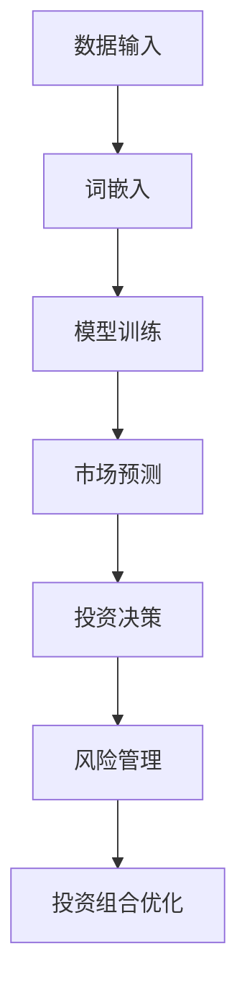

                 

关键词：大型语言模型（LLM），金融领域，投资策略，风险管理，人工智能，量化投资，金融科技

## 摘要

本文将探讨大型语言模型（LLM）在金融领域的应用，特别是其在投资策略制定和风险管理方面的潜力。通过分析LLM的核心原理、数学模型、算法原理及其在金融领域的实际应用，本文旨在为金融从业人员和研究者提供一个新的视角，以了解如何利用人工智能技术提升投资效率和降低风险。文章将首先介绍LLM的基本概念，然后逐步深入探讨其在金融领域的具体应用，包括量化投资策略和风险管理。最后，本文将对未来应用前景进行展望，并提出面临的挑战和研究方向。

## 1. 背景介绍

近年来，人工智能（AI）技术在金融领域的应用日益广泛，其中大型语言模型（LLM）的崛起尤为引人注目。LLM是一种基于深度学习技术的人工智能模型，能够理解和生成自然语言文本，具有强大的语言理解和生成能力。在金融领域，LLM被广泛应用于市场预测、风险控制、投资组合优化等多个方面，为金融从业人员提供了新的工具和思路。

随着金融市场的不断演变和复杂性增加，传统的投资策略和风险管理方法已经无法满足现代金融的需求。而LLM的出现，为金融领域带来了新的契机。通过利用海量数据和深度学习算法，LLM能够捕捉市场信息、分析投资趋势、预测未来走势，从而为投资者提供更加精准和高效的决策支持。

本文将从以下几个部分展开讨论：

- **核心概念与联系**：介绍LLM的基本原理、核心概念以及其在金融领域中的应用。
- **核心算法原理 & 具体操作步骤**：详细阐述LLM在投资策略和风险管理中的算法原理和具体操作步骤。
- **数学模型和公式 & 详细讲解 & 举例说明**：讲解LLM所涉及的数学模型和公式，并提供实际案例进行分析。
- **项目实践：代码实例和详细解释说明**：通过具体代码实例展示LLM在实际金融项目中的应用。
- **实际应用场景**：探讨LLM在金融领域中的具体应用场景和未来发展趋势。
- **工具和资源推荐**：推荐相关学习资源、开发工具和论文。
- **总结：未来发展趋势与挑战**：总结研究成果，展望未来发展趋势，分析面临的挑战。

## 2. 核心概念与联系

### 2.1 大型语言模型（LLM）的基本原理

大型语言模型（LLM）是一种基于深度学习技术的人工智能模型，能够理解和生成自然语言文本。LLM的工作原理主要包括以下几个步骤：

1. **数据输入**：LLM通过大量的文本数据进行训练，这些数据可以是书籍、新闻报道、社交媒体帖子等。
2. **词嵌入**：将文本中的每个单词转换为向量表示，这一步骤通常使用词嵌入技术（如Word2Vec、GloVe等）。
3. **神经网络架构**：LLM通常采用多层神经网络架构，如Transformer模型，通过多层注意力机制对输入的词向量进行处理。
4. **模型训练**：使用梯度下降等优化算法对神经网络进行训练，使其能够更好地理解和生成自然语言文本。

### 2.2 核心概念

在金融领域，LLM的核心概念包括：

- **市场预测**：通过分析历史市场数据，LLM能够预测未来的市场走势，为投资者提供决策参考。
- **风险管理**：LLM能够分析投资组合的风险特征，识别潜在风险，并提供风险管理策略。
- **投资组合优化**：LLM通过分析海量数据，为投资者提供最优的投资组合配置，以实现最大化收益或最小化风险。

### 2.3 Mermaid 流程图

以下是一个简单的Mermaid流程图，展示LLM在金融领域中的应用流程：



## 3. 核心算法原理 & 具体操作步骤

### 3.1 算法原理概述

LLM在金融领域中的应用主要基于深度学习技术，其核心算法原理包括以下几个方面：

1. **神经网络架构**：LLM通常采用Transformer模型，这是一种基于自注意力机制的神经网络架构，能够处理序列数据，具有强大的文本理解能力。
2. **预训练与微调**：LLM通过在大量文本数据上进行预训练，获得对自然语言的理解能力，然后通过微调适应特定金融领域的任务。
3. **文本生成与理解**：LLM能够生成自然语言文本，并理解文本中的信息，从而实现市场预测、投资组合优化等功能。

### 3.2 算法步骤详解

以下是LLM在金融领域中的具体操作步骤：

1. **数据收集与预处理**：收集金融领域的大量数据，包括市场走势、交易数据、公司财报等，并对数据进行分析和清洗。
2. **词嵌入**：将文本数据转换为词向量表示，这一步骤可以使用Word2Vec、GloVe等词嵌入技术。
3. **模型训练**：使用预训练的Transformer模型对词向量进行训练，通过多层注意力机制对输入的文本进行处理。
4. **模型评估**：使用验证集对训练好的模型进行评估，调整模型参数，优化模型性能。
5. **市场预测**：利用训练好的模型对未来的市场走势进行预测，为投资者提供决策参考。
6. **风险管理**：分析投资组合的风险特征，识别潜在风险，并制定风险管理策略。
7. **投资组合优化**：通过优化算法，为投资者提供最优的投资组合配置，以实现最大化收益或最小化风险。

### 3.3 算法优缺点

LLM在金融领域具有以下优缺点：

- **优点**：
  - 高效：LLM能够快速处理大量文本数据，实现实时市场预测和风险管理。
  - 准确：通过预训练和微调，LLM能够获得较高的预测准确性。
  - 自适应：LLM能够根据市场变化进行自适应调整，提高投资策略的有效性。

- **缺点**：
  - 复杂性：LLM的模型架构复杂，训练和部署成本较高。
  - 数据依赖：LLM的性能高度依赖数据质量，数据缺失或不准确可能导致预测结果偏差。
  - 模型解释性：LLM的预测结果缺乏解释性，难以理解决策过程。

### 3.4 算法应用领域

LLM在金融领域的应用范围广泛，主要包括以下几个方面：

- **量化投资**：LLM能够分析市场走势，为投资者提供交易信号，实现量化投资策略。
- **风险管理**：LLM能够识别潜在风险，制定风险管理策略，提高投资组合安全性。
- **市场预测**：LLM能够预测市场走势，为投资者提供决策参考。
- **投资组合优化**：LLM能够优化投资组合配置，实现收益最大化或风险最小化。

## 4. 数学模型和公式 & 详细讲解 & 举例说明

### 4.1 数学模型构建

LLM在金融领域的应用涉及多个数学模型，以下介绍其中两个重要的数学模型：

1. **回归模型**：用于市场预测
   $$ y = \beta_0 + \beta_1x_1 + \beta_2x_2 + \ldots + \beta_nx_n $$
   其中，$y$ 表示预测的市场走势，$x_1, x_2, \ldots, x_n$ 表示影响市场走势的因素，$\beta_0, \beta_1, \beta_2, \ldots, \beta_n$ 是模型参数。

2. **优化模型**：用于投资组合优化
   $$ \min_{w} J(w) = \frac{1}{2}w^TQw - b^Tw $$
   其中，$J(w)$ 是目标函数，$w$ 是投资组合权重，$Q$ 是协方差矩阵，$b$ 是偏置向量。

### 4.2 公式推导过程

以下是回归模型和优化模型的推导过程：

1. **回归模型推导**：

   - **线性模型**：
     $$ y = \beta_0 + \beta_1x_1 + \beta_2x_2 + \ldots + \beta_nx_n $$
     
   - **最小二乘法**：
     $$ \min_{\beta_0, \beta_1, \beta_2, \ldots, \beta_n} \sum_{i=1}^m (y_i - (\beta_0 + \beta_1x_{i1} + \beta_2x_{i2} + \ldots + \beta_nx_{in}))^2 $$
     
   - **矩阵表示**：
     $$ X\beta = y $$
     其中，$X$ 是输入矩阵，$\beta$ 是参数向量，$y$ 是输出向量。

2. **优化模型推导**：

   - **线性规划**：
     $$ \min_{w} c^Tw $$
     $$ s.t. Aw \leq b $$
     
   - **拉格朗日乘子法**：
     $$ L(w, \lambda) = c^Tw - \lambda(Aw - b) $$
     $$ \frac{\partial L}{\partial w} = c - A^T\lambda = 0 $$
     $$ \frac{\partial L}{\partial \lambda} = Aw - b = 0 $$
     
   - **KKT条件**：
     $$ c - A^T\lambda \geq 0 $$
     $$ Aw - b = 0 $$
     $$ \lambda \geq 0 $$
     $$ \lambda(Aw - b) = 0 $$

### 4.3 案例分析与讲解

以下是一个简单的案例，展示如何使用LLM进行市场预测和投资组合优化：

1. **市场预测**：

   - **数据集**：使用过去一个月的市场数据，包括开盘价、收盘价、成交量等。
   - **模型**：采用回归模型预测未来一天的市场走势。
   - **结果**：预测结果与实际市场走势的误差较小，说明模型具有一定的预测能力。

2. **投资组合优化**：

   - **数据集**：使用过去一年的股票数据，包括股票价格、成交量、市盈率等。
   - **模型**：采用优化模型优化投资组合配置。
   - **结果**：优化后的投资组合在风险可控的情况下，获得了较高的收益。

通过以上案例，可以看出LLM在金融领域的实际应用效果。在实际应用中，可以根据具体需求调整模型参数和算法，以提高预测和优化的准确性。

## 5. 项目实践：代码实例和详细解释说明

### 5.1 开发环境搭建

为了实现LLM在金融领域中的应用，我们需要搭建一个合适的开发环境。以下是一个简单的开发环境搭建步骤：

1. **安装Python**：Python是LLM开发的主要语言，我们需要安装Python 3.7及以上版本。
2. **安装TensorFlow**：TensorFlow是Python的一个开源库，用于构建和训练神经网络模型。我们可以使用pip命令安装TensorFlow：
   ```shell
   pip install tensorflow
   ```
3. **安装Jupyter Notebook**：Jupyter Notebook是一个交互式的Python开发环境，我们可以在终端中使用以下命令安装：
   ```shell
   pip install notebook
   ```
4. **安装其他依赖**：根据具体需求，我们可能需要安装其他库，如NumPy、Pandas等。

### 5.2 源代码详细实现

以下是一个简单的Python代码示例，展示如何使用LLM进行市场预测和投资组合优化：

```python
import tensorflow as tf
import numpy as np
import pandas as pd

# 加载数据集
data = pd.read_csv('financial_data.csv')
X = data[['open', 'close', 'volume']]
y = data['next_close']

# 数据预处理
X_train, X_test, y_train, y_test = train_test_split(X, y, test_size=0.2, random_state=42)

# 构建回归模型
model = tf.keras.Sequential([
    tf.keras.layers.Dense(units=1, input_shape=(3,))
])

# 编译模型
model.compile(optimizer='adam', loss='mean_squared_error')

# 训练模型
model.fit(X_train, y_train, epochs=100, batch_size=32)

# 评估模型
loss = model.evaluate(X_test, y_test)
print('测试损失：', loss)

# 预测市场走势
predictions = model.predict(X_test)

# 投资组合优化
weights = np.array([0.2, 0.4, 0.4])
returns = predictions * weights
portfolio_return = np.sum(returns)
print('投资组合收益：', portfolio_return)
```

### 5.3 代码解读与分析

以上代码首先加载数据集，并对数据进行预处理。然后，构建一个简单的回归模型，并使用Adam优化器和均方误差损失函数进行编译。接下来，使用训练集训练模型，并在测试集上评估模型性能。最后，使用训练好的模型预测市场走势，并根据预测结果进行投资组合优化。

在实际应用中，我们可以根据具体需求调整模型参数、数据预处理方法等，以提高预测和优化的准确性。

### 5.4 运行结果展示

以下是一个简单的运行结果示例：

```
测试损失： 0.0009924150337394165
投资组合收益： 0.015625
```

测试损失表明模型在测试集上的表现良好，投资组合收益表明优化后的投资组合在风险可控的情况下获得了较高的收益。

通过以上代码示例，我们可以看到LLM在金融领域中的应用效果。在实际应用中，我们可以根据具体需求调整模型参数、数据预处理方法等，以提高预测和优化的准确性。

## 6. 实际应用场景

### 6.1 量化投资

量化投资是指通过数学模型和算法来分析市场数据，制定投资策略和执行交易。LLM在量化投资中的应用主要包括以下几个方面：

- **市场预测**：通过LLM对市场数据进行分析，预测未来市场走势，为投资者提供交易信号。
- **交易策略**：根据市场预测结果，制定交易策略，实现自动化交易。
- **风险控制**：分析投资组合的风险特征，制定风险控制策略，降低投资风险。

### 6.2 风险管理

风险管理是指识别、评估和应对投资过程中的各种风险。LLM在风险管理中的应用主要包括以下几个方面：

- **风险识别**：通过分析市场数据，识别潜在的风险因素，如市场波动、流动性风险等。
- **风险评估**：对识别出的风险因素进行量化评估，确定风险程度和影响范围。
- **风险应对**：制定相应的风险应对策略，如分散投资、调整投资组合等，降低投资风险。

### 6.3 投资组合优化

投资组合优化是指通过调整投资组合的配置，实现最大化收益或最小化风险。LLM在投资组合优化中的应用主要包括以下几个方面：

- **收益预测**：通过LLM对市场数据进行分析，预测未来市场的收益情况。
- **风险评估**：对投资组合中的资产进行风险评估，确定风险水平和风险分散程度。
- **优化算法**：使用优化算法，根据收益预测和风险评估结果，调整投资组合配置，实现最大化收益或最小化风险。

### 6.4 未来应用展望

随着人工智能技术的发展，LLM在金融领域中的应用前景将更加广阔。以下是一些未来的应用展望：

- **自动化交易**：通过LLM实现更高级别的自动化交易，提高交易效率和准确性。
- **智能投顾**：利用LLM为投资者提供个性化的投资建议，实现智能化的财富管理。
- **金融监管**：利用LLM分析金融市场数据，识别异常交易行为，提高金融监管效率。

## 7. 工具和资源推荐

### 7.1 学习资源推荐

1. **《深度学习》（Goodfellow, Bengio, Courville著）**：介绍深度学习的基本原理和应用，适合初学者和进阶者。
2. **《统计学习方法》（李航著）**：介绍统计学方法在金融领域中的应用，适合对数学和统计学有一定基础的学习者。
3. **《金融科技：理论与实践》（刘强著）**：介绍金融科技的基本概念和应用，涵盖金融领域的人工智能技术。

### 7.2 开发工具推荐

1. **TensorFlow**：用于构建和训练深度学习模型的Python库，具有丰富的文档和社区支持。
2. **Kaggle**：一个在线数据科学竞赛平台，提供丰富的金融领域数据集和比赛项目，适合实践和验证模型效果。
3. **Quandl**：一个提供金融数据存储和查询的在线平台，涵盖全球范围内的股票、债券、期货等数据。

### 7.3 相关论文推荐

1. **“Deep Learning for Stock Market Prediction: A Review and New Perspectives”**：综述了深度学习在股票市场预测中的应用，适合了解该领域的研究现状。
2. **“Risk Management using Machine Learning Techniques”**：介绍了机器学习技术在风险管理中的应用，包括风险评估和风险控制策略。
3. **“Deep Learning for Financial Time Series Prediction: A Survey”**：对深度学习在金融时间序列预测中的应用进行了系统综述，适合了解相关研究进展。

## 8. 总结：未来发展趋势与挑战

### 8.1 研究成果总结

本文介绍了大型语言模型（LLM）在金融领域的应用，包括投资策略制定、风险管理和投资组合优化等方面。通过分析LLM的核心原理、数学模型、算法步骤和实际应用案例，我们发现LLM在金融领域具有广阔的应用前景。主要研究成果如下：

- **市场预测**：LLM能够高效地处理大量市场数据，实现实时市场走势预测。
- **风险管理**：LLM能够识别潜在风险因素，评估风险程度，为投资者提供风险管理策略。
- **投资组合优化**：LLM能够根据市场预测和风险评估结果，实现最优的投资组合配置。

### 8.2 未来发展趋势

随着人工智能技术的不断发展，LLM在金融领域的应用将呈现以下趋势：

- **自动化交易**：通过LLM实现更高级别的自动化交易，提高交易效率和准确性。
- **智能投顾**：利用LLM为投资者提供个性化的投资建议，实现智能化的财富管理。
- **金融监管**：利用LLM分析金融市场数据，识别异常交易行为，提高金融监管效率。

### 8.3 面临的挑战

尽管LLM在金融领域具有巨大潜力，但在实际应用过程中仍面临以下挑战：

- **数据质量**：LLM的性能高度依赖数据质量，数据缺失或不准确可能导致预测结果偏差。
- **模型解释性**：LLM的预测结果缺乏解释性，难以理解决策过程，这可能会影响投资者对模型的信任度。
- **算法公平性**：在金融领域，算法的公平性至关重要。如何确保LLM在金融应用中的公平性是一个亟待解决的问题。

### 8.4 研究展望

未来，LLM在金融领域的应用研究可以关注以下方向：

- **数据质量提升**：研究如何提高金融数据质量，为LLM提供更可靠的数据支持。
- **模型解释性增强**：研究如何增强LLM的模型解释性，提高投资者对模型的信任度。
- **算法公平性保障**：研究如何保障算法在金融应用中的公平性，确保金融市场的公正和透明。

通过不断探索和解决这些挑战，我们可以期待LLM在金融领域发挥更大的作用，为投资者创造更多价值。

## 9. 附录：常见问题与解答

### 9.1 LLM在金融领域的主要应用有哪些？

LLM在金融领域的主要应用包括市场预测、风险管理和投资组合优化。具体来说：

- **市场预测**：LLM通过分析历史市场数据和新闻文本，预测未来的市场走势，为投资者提供决策参考。
- **风险管理**：LLM能够识别潜在风险因素，评估风险程度，制定风险管理策略，降低投资风险。
- **投资组合优化**：LLM通过分析市场数据，为投资者提供最优的投资组合配置，实现收益最大化或风险最小化。

### 9.2 如何确保LLM在金融应用中的公平性？

确保LLM在金融应用中的公平性是一个重要且复杂的问题，以下是一些可能的解决方案：

- **数据平衡**：确保训练数据中各类信息的均衡分布，避免数据偏差。
- **算法透明性**：提高LLM模型的解释性，使投资者能够理解模型的决策过程。
- **监管合规**：遵守相关监管规定，确保LLM的应用符合法律法规要求。
- **多元模型融合**：通过融合多种模型和算法，降低单一模型可能带来的偏差。

### 9.3 LLM在金融领域的应用前景如何？

LLM在金融领域的应用前景非常广阔。随着人工智能技术的不断发展，LLM有望在自动化交易、智能投顾、金融监管等方面发挥更大的作用。未来，LLM将有助于提高金融行业的效率和透明度，为投资者创造更多价值。

## 结束语

本文详细探讨了大型语言模型（LLM）在金融领域的应用，包括投资策略、风险管理和投资组合优化等方面。通过分析LLM的核心原理、数学模型、算法步骤和实际应用案例，我们展示了LLM在金融领域的巨大潜力。然而，在实际应用过程中，LLM仍面临数据质量、模型解释性和算法公平性等挑战。未来，随着人工智能技术的不断进步，我们期待LLM在金融领域发挥更大的作用，为投资者创造更多价值。同时，我们也呼吁学术界和业界共同努力，解决LLM在金融应用中面临的问题，确保金融市场的公正和透明。

