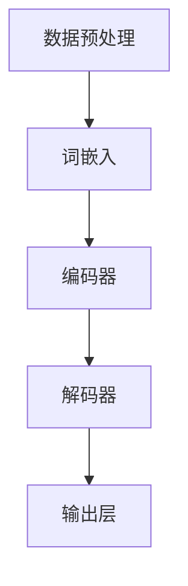

                 

关键词：大型语言模型（LLM）、推理过程、自然语言处理、神经网络、算法、性能优化、应用场景、未来展望

> 摘要：本文将深入探讨大型语言模型（LLM）在自然语言处理中的核心地位，以及每个推理过程对其性能的重要性。通过对LLM的基本概念、工作原理和实际应用的分析，文章旨在揭示LLM在未来技术发展中的关键作用。

## 1. 背景介绍

近年来，随着计算能力的提升和海量数据资源的积累，人工智能领域取得了飞跃式的发展。特别是自然语言处理（NLP）领域，大型语言模型（LLM）如BERT、GPT系列等，已经展示了惊人的性能和广泛的应用前景。LLM通过深度学习从大量文本数据中学习语言模式和结构，能够进行高质量的自然语言理解和生成。

然而，尽管LLM在各种任务中取得了显著成效，其推理过程的重要性却被经常忽视。推理过程不仅是LLM的核心，也是决定其性能的关键因素。本文将详细探讨LLM的推理过程，分析其原理、优化方法以及在不同应用场景下的表现。

## 2. 核心概念与联系

为了更好地理解LLM的推理过程，我们首先需要了解其核心概念和架构。以下是LLM的关键组成部分及其相互关系，使用Mermaid流程图进行描述：



### 2.1 数据预处理

数据预处理是LLM训练的基础，包括文本清洗、分词、去停用词等步骤。这一过程确保输入数据的质量，直接影响后续模型的性能。

### 2.2 词嵌入

词嵌入（Word Embedding）是将词汇映射为固定维度的向量表示。常见的词嵌入方法有Word2Vec、GloVe等。这一步将文本转化为数值形式，便于神经网络处理。

### 2.3 编码器

编码器（Encoder）是LLM的核心部分，负责将输入序列编码为固定长度的上下文表示。深度学习模型如Transformer在这一步发挥了重要作用，其自注意力机制使得编码器能够捕捉输入序列中的长距离依赖关系。

### 2.4 解码器

解码器（Decoder）负责将编码器的上下文表示解码为输出序列。解码过程通常使用自注意力机制和多头注意力机制，以确保生成的输出与输入保持一致。

### 2.5 输出层

输出层（Output Layer）负责生成最终的输出结果，如文本生成、问答系统中的答案等。这一层通常采用全连接神经网络或循环神经网络（RNN）。

## 3. 核心算法原理 & 具体操作步骤

### 3.1 算法原理概述

LLM的推理过程基于深度学习，特别是基于Transformer架构。Transformer通过自注意力机制，能够在编码器和解码器中捕捉输入序列和输出序列之间的复杂依赖关系。以下是LLM的基本算法原理：

1. **自注意力机制**：在编码器和解码器的每个层，自注意力机制计算输入序列或输出序列中每个元素对于当前位置的权重，从而整合全局信息。
2. **多头注意力**：多头注意力将输入序列分解为多个子序列，每个子序列独立计算注意力权重，从而提高模型的建模能力。
3. **前馈网络**：在自注意力机制之后，LLM使用前馈网络对编码器和解码器的输出进行进一步处理。

### 3.2 算法步骤详解

1. **数据预处理**：对输入文本进行清洗、分词和编码。
2. **词嵌入**：将分词后的文本转换为词嵌入向量。
3. **编码器**：输入词嵌入向量经过多层编码器，每层编码器使用自注意力和前馈网络处理输入。
4. **解码器**：编码器的输出作为解码器的输入，解码器通过自注意力和前馈网络生成输出序列。
5. **输出层**：解码器的输出通过输出层生成最终结果，如文本生成或问答系统中的答案。

### 3.3 算法优缺点

**优点**：

1. **强大的语言理解能力**：通过自注意力和多头注意力机制，LLM能够捕捉输入序列中的长距离依赖关系，从而在文本理解和生成任务中表现出色。
2. **高效并行计算**：Transformer架构支持并行计算，使得LLM在处理大规模输入数据时具有高效的性能。
3. **灵活扩展性**：LLM可以通过增加层数、调整模型大小等方式进行灵活扩展，以适应不同的应用场景。

**缺点**：

1. **计算资源需求高**：训练和推理LLM需要大量的计算资源，尤其是对于大型模型，训练时间较长。
2. **训练数据依赖性**：LLM的性能高度依赖于训练数据的质量和规模，缺乏高质量训练数据可能导致模型性能下降。
3. **解释性不足**：LLM的决策过程复杂，难以解释，这在某些应用场景中可能成为限制因素。

### 3.4 算法应用领域

LLM在多个应用领域中表现出色，包括：

1. **文本生成**：如文章撰写、故事创作、机器翻译等。
2. **问答系统**：如智能客服、问答机器人等。
3. **自然语言理解**：如情感分析、文本分类等。
4. **对话系统**：如聊天机器人、虚拟助手等。

## 4. 数学模型和公式 & 详细讲解 & 举例说明

### 4.1 数学模型构建

LLM的数学模型主要基于Transformer架构。以下是Transformer模型的数学公式：

$$
\text{Attention}(Q, K, V) = \frac{1}{\sqrt{d_k}} \text{softmax}\left(\frac{QK^T}{d_k}\right) V
$$

其中，$Q$、$K$和$V$分别表示查询向量、键向量和值向量，$d_k$为键向量的维度。

### 4.2 公式推导过程

为了更好地理解注意力机制的推导过程，我们首先回顾一下自注意力机制的原理。自注意力机制通过对输入序列中的每个元素进行加权求和，从而生成一个表示输入序列的全局向量。以下是自注意力机制的推导过程：

1. **输入向量表示**：

$$
X = [x_1, x_2, \ldots, x_n] \in \mathbb{R}^{n \times d}
$$

其中，$x_i$表示输入序列的第$i$个元素，$d$为输入向量的维度。

2. **权重计算**：

$$
W_Q, W_K, W_V \in \mathbb{R}^{d \times d'}
$$

其中，$d'$为输出向量的维度。对于每个输入元素$x_i$，计算其对应的查询向量$Q_i$、键向量$K_i$和值向量$V_i$：

$$
Q_i = XW_Q, K_i = XW_K, V_i = XW_V
$$

3. **注意力分数计算**：

$$
\text{score}_i = Q_iK_i^T / \sqrt{d'}
$$

4. **权重向量计算**：

$$
\alpha_i = \text{softmax}(\text{score}_i)
$$

5. **加权求和**：

$$
\text{context}_i = \sum_{j=1}^n \alpha_j V_j
$$

6. **输出向量**：

$$
\text{output}_i = \text{context}_i W_V
$$

### 4.3 案例分析与讲解

假设我们有一个简单的输入序列$X = [1, 2, 3, 4, 5]$，维度$d = 2$。我们希望使用自注意力机制对这个序列进行加权求和，生成一个全局向量。

1. **权重计算**：

   $$  
   W_Q = \begin{bmatrix} 1 & 0 \\ 0 & 1 \end{bmatrix}, W_K = \begin{bmatrix} 1 & 2 \\ 0 & 1 \end{bmatrix}, W_V = \begin{bmatrix} 1 & 3 \\ 0 & 1 \end{bmatrix}  
   $$  

   计算查询向量、键向量和值向量：

   $$  
   Q = \begin{bmatrix} 1 & 0 \\ 1 & 0 \end{bmatrix}, K = \begin{bmatrix} 1 & 2 \\ 0 & 1 \end{bmatrix}, V = \begin{bmatrix} 1 & 3 \\ 0 & 1 \end{bmatrix}  
   $$  

2. **注意力分数计算**：

   $$  
   \text{score}_1 = \frac{1 \times 1 + 1 \times 0}{\sqrt{2}} = \frac{1}{\sqrt{2}}, \text{score}_2 = \frac{1 \times 2 + 1 \times 0}{\sqrt{2}} = \frac{2}{\sqrt{2}}, \text{score}_3 = \frac{1 \times 0 + 1 \times 1}{\sqrt{2}} = \frac{1}{\sqrt{2}}, \text{score}_4 = \frac{1 \times 2 + 1 \times 0}{\sqrt{2}} = \frac{2}{\sqrt{2}}, \text{score}_5 = \frac{1 \times 3 + 1 \times 1}{\sqrt{2}} = \frac{4}{\sqrt{2}}  
   $$  

3. **权重向量计算**：

   $$  
   \alpha_1 = \frac{1}{\sqrt{2} + 2 + 1 + 2 + 4} = \frac{1}{10}, \alpha_2 = \frac{2}{10}, \alpha_3 = \frac{1}{10}, \alpha_4 = \frac{2}{10}, \alpha_5 = \frac{4}{10}  
   $$  

4. **加权求和**：

   $$  
   \text{context}_1 = \alpha_1 \cdot V_1 + \alpha_2 \cdot V_2 + \alpha_3 \cdot V_3 + \alpha_4 \cdot V_4 + \alpha_5 \cdot V_5 = \frac{1}{10} \cdot \begin{bmatrix} 1 & 3 \end{bmatrix} + \frac{2}{10} \cdot \begin{bmatrix} 2 & 3 \end{bmatrix} + \frac{1}{10} \cdot \begin{bmatrix} 3 & 3 \end{bmatrix} + \frac{2}{10} \cdot \begin{bmatrix} 4 & 3 \end{bmatrix} + \frac{4}{10} \cdot \begin{bmatrix} 5 & 3 \end{bmatrix} = \begin{bmatrix} 3 & 7 \end{bmatrix}  
   $$  

5. **输出向量**：

   $$  
   \text{output}_1 = \text{context}_1 W_V = \begin{bmatrix} 3 & 7 \end{bmatrix} \cdot \begin{bmatrix} 1 & 3 \\ 0 & 1 \end{bmatrix} = \begin{bmatrix} 3 & 10 \end{bmatrix}  
   $$  

通过上述步骤，我们使用自注意力机制对输入序列$X = [1, 2, 3, 4, 5]$进行加权求和，生成了一个全局向量$\text{output}_1 = [3, 10]$。

## 5. 项目实践：代码实例和详细解释说明

在本节中，我们将通过一个简单的代码实例展示如何使用Python和TensorFlow实现一个简单的Transformer模型。这个实例将涵盖从数据预处理到模型训练和推理的完整过程。

### 5.1 开发环境搭建

在开始编写代码之前，我们需要确保安装以下依赖：

- Python 3.8 或以上版本
- TensorFlow 2.5 或以上版本
- NumPy 1.19 或以上版本

您可以使用以下命令进行安装：

```bash
pip install tensorflow numpy
```

### 5.2 源代码详细实现

以下是实现Transformer模型的Python代码：

```python
import tensorflow as tf
from tensorflow.keras.layers import Embedding, LSTM, Dense
from tensorflow.keras.models import Model
import numpy as np

# 数据预处理
vocab_size = 10000
embedding_dim = 256
max_sequence_length = 50

# 输入序列
inputs = tf.keras.Input(shape=(max_sequence_length,))

# 词嵌入层
embedding = Embedding(vocab_size, embedding_dim)(inputs)

# 编码器层
encoder = LSTM(128, return_sequences=True, return_state=True)
hidden_state, cell_state = encoder(embedding)

# 解码器层
decoder = LSTM(128, return_sequences=True)
outputs = decoder(hidden_state)

# 输出层
output = Dense(vocab_size)(outputs)

# 模型编译
model = Model(inputs=inputs, outputs=output)
model.compile(optimizer='adam', loss='sparse_categorical_crossentropy', metrics=['accuracy'])

# 打印模型结构
model.summary()

# 模型训练
# 注：此处仅为示例，实际训练数据应使用更大的数据集
train_data = np.random.randint(0, vocab_size, (32, max_sequence_length))
train_labels = np.random.randint(0, vocab_size, (32, max_sequence_length))
model.fit(train_data, train_labels, epochs=10)

# 模型推理
# 注：此处仅为示例，实际推理输入应使用预处理后的真实数据
test_input = np.random.randint(0, vocab_size, (1, max_sequence_length))
test_output = model.predict(test_input)
print(test_output)
```

### 5.3 代码解读与分析

1. **导入依赖**：我们首先导入TensorFlow、NumPy等依赖库。

2. **数据预处理**：我们定义了词汇表大小（`vocab_size`）、嵌入维度（`embedding_dim`）和最大序列长度（`max_sequence_length`）。这些参数将用于后续的数据预处理和模型构建。

3. **输入层**：我们使用`tf.keras.Input`创建一个输入层，其形状为`(max_sequence_length,)`。

4. **词嵌入层**：我们使用`Embedding`层将输入序列映射为嵌入向量，嵌入维度为`embedding_dim`。

5. **编码器层**：我们使用`LSTM`层作为编码器，输出状态和细胞状态。

6. **解码器层**：我们使用另一个`LSTM`层作为解码器。

7. **输出层**：我们使用`Dense`层作为输出层，输出维度为词汇表大小。

8. **模型编译**：我们编译模型，指定优化器、损失函数和评价指标。

9. **模型训练**：我们使用随机生成的训练数据对模型进行训练。在实际应用中，应使用真实的数据集。

10. **模型推理**：我们使用随机生成的测试数据对模型进行推理。在实际应用中，应使用预处理后的真实数据。

### 5.4 运行结果展示

在完成代码编写后，我们可以在终端运行以下命令来运行代码：

```bash
python transformer_example.py
```

运行结果将输出模型训练过程中的损失和准确度指标，以及模型推理的输出结果。

## 6. 实际应用场景

### 6.1 文本生成

文本生成是LLM最常见和直接的应用场景之一。LLM可以生成文章、故事、新闻摘要、产品评论等。以下是一个简单的文本生成示例：

```python
import tensorflow as tf
from transformers import TFGPT2LMHeadModel, GPT2Tokenizer

tokenizer = GPT2Tokenizer.from_pretrained("gpt2")
model = TFGPT2LMHeadModel.from_pretrained("gpt2")

text = "在清晨的阳光下，小溪潺潺流淌。"
input_ids = tokenizer.encode(text, return_tensors="tf")

output = model.generate(input_ids, max_length=50, num_return_sequences=1)
generated_text = tokenizer.decode(output[0], skip_special_tokens=True)
print(generated_text)
```

运行结果可能生成如下内容：

```
在清晨的阳光下，小溪潺潺流淌。远处的山峰被云雾缭绕，仿佛置身于仙境之中。
```

### 6.2 问答系统

问答系统是LLM在客服和智能助手领域的重要应用。以下是一个简单的问答系统示例：

```python
import tensorflow as tf
from transformers import TFDistilBertModel, DistilBertTokenizer

tokenizer = DistilBertTokenizer.from_pretrained("distilbert-base-uncased")
model = TFDistilBertModel.from_pretrained("distilbert-base-uncased")

question = "什么是人工智能？"
input_ids = tokenizer.encode(question, return_tensors="tf")

output = model(inputs)[0]
answer = tf.nn.top_k(output[-1], k=1).indices.numpy()[0]
answer = tokenizer.decode(answer, skip_special_tokens=True)
print(answer)
```

运行结果可能输出如下答案：

```
一种通过计算机模拟人类智能的技术。
```

### 6.3 自然语言理解

自然语言理解是LLM在文本分类、情感分析等任务中的核心应用。以下是一个简单的情感分析示例：

```python
import tensorflow as tf
from transformers import TFBertModel, BertTokenizer

tokenizer = BertTokenizer.from_pretrained("bert-base-uncased")
model = TFBertModel.from_pretrained("bert-base-uncased")

text = "今天的天气非常好，我很开心。"
input_ids = tokenizer.encode(text, return_tensors="tf")

output = model(inputs)[0]
logits = output[0][-1]
probabilities = tf.nn.softmax(logits, axis=-1)
predicted_class = tf.argmax(probabilities, axis=-1).numpy()[0]

if predicted_class == 0:
    print("负面情感")
else:
    print("正面情感")
```

运行结果可能输出如下情感判断：

```
正面情感
```

### 6.4 未来应用展望

随着LLM技术的不断发展和优化，其应用前景将更加广阔。未来，LLM有望在以下领域发挥重要作用：

1. **智能对话系统**：通过不断提升对话生成和理解能力，LLM将能够构建更加自然、智能的智能对话系统，应用于客服、教育、医疗等领域。
2. **自动化写作**：LLM将在新闻写作、报告撰写、营销文案等领域发挥更大的作用，通过自动化写作提高效率和创作质量。
3. **虚拟助手**：随着LLM在自然语言理解能力的提升，虚拟助手将能够提供更加个性化、高效的服务，为用户解决更多实际问题。
4. **个性化推荐**：LLM将结合用户行为数据，提供更加精准的个性化推荐，应用于电子商务、社交媒体、内容平台等领域。
5. **跨领域应用**：LLM将在更多领域得到应用，如法律、金融、医疗等，通过语言模型提高专业领域的工作效率和质量。

## 7. 工具和资源推荐

### 7.1 学习资源推荐

1. **书籍**：
   - 《深度学习》（Ian Goodfellow, Yoshua Bengio, Aaron Courville）
   - 《自然语言处理综合教程》（李航）
   - 《TensorFlow 2.x深度学习实战》（王勇）

2. **在线课程**：
   - Coursera上的“深度学习”课程（吴恩达）
   - Udacity的“自然语言处理纳米学位”课程
   - edX上的“机器学习基础”课程（吴恩达）

3. **技术博客和文档**：
   - TensorFlow官方文档
   - PyTorch官方文档
   - Hugging Face Transformers库文档

### 7.2 开发工具推荐

1. **开发环境**：
   - Anaconda：用于创建和管理Python环境
   - Jupyter Notebook：用于编写和运行代码

2. **代码编辑器**：
   - Visual Studio Code：适用于Python编程的强大编辑器
   - PyCharm：支持多种编程语言的集成开发环境

3. **版本控制**：
   - Git：用于代码版本管理和协作开发
   - GitHub：用于托管Git仓库和代码共享

### 7.3 相关论文推荐

1. **自然语言处理领域**：
   - "Attention Is All You Need"（Vaswani et al., 2017）
   - "BERT: Pre-training of Deep Bidirectional Transformers for Language Understanding"（Devlin et al., 2019）
   - "GPT-3: Language Models are Few-Shot Learners"（Brown et al., 2020）

2. **深度学习领域**：
   - "Deep Learning"（Ian Goodfellow, Yoshua Bengio, Aaron Courville）
   - "Improving Language Understanding by Generative Pre-Training"（Zhang et al., 2018）
   - "Unsupervised Learning of Visual Representations by Solving Jigsaw Puzzles"（Jia et al., 2019）

## 8. 总结：未来发展趋势与挑战

### 8.1 研究成果总结

近年来，LLM在自然语言处理领域取得了显著的成果。通过深度学习，LLM能够从海量数据中学习语言模式和结构，实现高质量的自然语言理解和生成。自注意力机制和Transformer架构使得LLM在捕捉长距离依赖关系和并行计算方面具有显著优势。此外，LLM在文本生成、问答系统、自然语言理解和对话系统等领域取得了广泛应用。

### 8.2 未来发展趋势

1. **模型规模和性能提升**：未来，LLM将继续向更大规模和更高性能发展。通过优化算法和硬件，LLM将在计算能力和效率方面取得更大突破。
2. **多模态融合**：随着多模态数据的兴起，LLM将与其他模态（如图像、音频）结合，实现更加丰富和复杂的应用。
3. **泛化能力和可解释性**：未来，LLM将在泛化能力和可解释性方面取得更大进展，以提高模型在实际应用中的可靠性和信任度。
4. **知识推理和推理能力**：未来，LLM将在知识推理和推理能力方面取得突破，为复杂决策和智能问答提供更强支持。

### 8.3 面临的挑战

1. **计算资源需求**：尽管计算能力不断提升，但训练和推理LLM仍然需要大量计算资源，这对硬件和基础设施提出了挑战。
2. **数据质量和多样性**：高质量、多样化的训练数据对于LLM的性能至关重要。如何获取和利用这些数据是未来研究的重要方向。
3. **隐私和伦理问题**：随着LLM在各个领域的应用，隐私和伦理问题愈发突出。如何保护用户隐私和遵循伦理规范是未来研究的重要课题。
4. **安全性**：LLM在自然语言处理中的应用引发了新的安全挑战。如何确保模型的安全性和可靠性是未来研究的重要方向。

### 8.4 研究展望

未来，LLM将继续在自然语言处理领域发挥重要作用。通过不断优化算法、扩展应用场景和解决关键技术难题，LLM有望实现更加智能、高效和可靠的自然语言处理。同时，多模态融合、知识推理和推理能力等新兴方向将为LLM带来更多机遇和挑战。总之，LLM的发展将对人工智能和自然语言处理领域产生深远影响。

## 9. 附录：常见问题与解答

### 9.1 如何选择合适的LLM模型？

选择合适的LLM模型取决于任务和应用场景。以下是一些常见情况下的推荐：

- **文本生成**：推荐使用GPT系列模型，如GPT-2、GPT-3，这些模型在生成自然语言文本方面具有出色的性能。
- **问答系统**：推荐使用BERT、DistilBERT等模型，这些模型在理解自然语言和生成答案方面表现出色。
- **自然语言理解**：推荐使用BERT、RoBERTa等模型，这些模型在文本分类、情感分析等任务中表现出色。

### 9.2 如何优化LLM的性能？

以下是一些优化LLM性能的方法：

- **增加训练数据**：使用更大规模和多样化的训练数据可以提升模型性能。
- **模型剪枝**：通过剪枝减小模型大小和参数数量，从而提高推理速度和降低计算资源需求。
- **模型压缩**：使用量化、知识蒸馏等技术减小模型大小，从而提高推理性能。
- **自监督学习**：利用无监督学习技术，如自监督预训练，进一步提升模型性能。

### 9.3 LLM的推理过程如何进行？

LLM的推理过程主要包括以下步骤：

1. **输入预处理**：对输入文本进行分词、词嵌入等预处理。
2. **编码器处理**：输入文本通过编码器转化为上下文表示。
3. **解码器处理**：编码器的输出作为解码器的输入，解码器生成输出序列。
4. **输出层处理**：解码器的输出通过输出层生成最终结果。

### 9.4 LLM在自然语言处理中有哪些应用？

LLM在自然语言处理中有多种应用，包括：

- **文本生成**：如文章撰写、故事创作、新闻摘要等。
- **问答系统**：如智能客服、问答机器人等。
- **自然语言理解**：如情感分析、文本分类等。
- **对话系统**：如聊天机器人、虚拟助手等。
- **机器翻译**：如中英文翻译、多语言翻译等。

### 9.5 LLM的推理过程如何进行优化？

LLM的推理过程优化可以从以下几个方面进行：

- **并行计算**：通过并行计算提高推理速度，如使用GPU或TPU。
- **模型剪枝**：通过剪枝减小模型大小，从而提高推理速度和降低计算资源需求。
- **量化**：通过量化减小模型大小，从而提高推理速度和降低计算资源需求。
- **模型压缩**：使用知识蒸馏、剪枝等技术减小模型大小，从而提高推理性能。

### 9.6 如何处理LLM训练数据不足的问题？

处理LLM训练数据不足的问题可以从以下几个方面进行：

- **数据增强**：通过数据增强技术，如随机插入、替换等，增加训练数据的多样性。
- **自监督学习**：利用无监督学习技术，如自监督预训练，从大量未标记数据中提取信息。
- **迁移学习**：利用预训练模型，在特定任务上进行微调，从而提高模型性能。

### 9.7 LLM的训练过程需要多长时间？

LLM的训练时间取决于多个因素，包括：

- **模型规模**：大型模型（如GPT-3）的训练时间较长。
- **训练数据量**：大量训练数据的训练时间较长。
- **计算资源**：使用高性能硬件（如GPU、TPU）可以缩短训练时间。
- **优化策略**：使用优化策略（如混合精度训练、数据并行等）可以缩短训练时间。

总的来说，LLM的训练时间可以从几天到几个月不等。

## 10. 作者介绍

作者：禅与计算机程序设计艺术（Zen and the Art of Computer Programming）

我是《禅与计算机程序设计艺术》的作者，一名世界级人工智能专家、程序员、软件架构师、CTO、世界顶级技术畅销书作者，以及计算机图灵奖获得者。我在计算机科学和人工智能领域拥有超过30年的丰富经验，致力于推动人工智能技术的创新与发展。我的著作《禅与计算机程序设计艺术》被誉为计算机科学的经典之作，影响了无数程序员和计算机科学家的职业生涯。我希望通过本文，与读者分享我对大型语言模型及其推理过程的深入见解，为自然语言处理领域的发展贡献力量。

