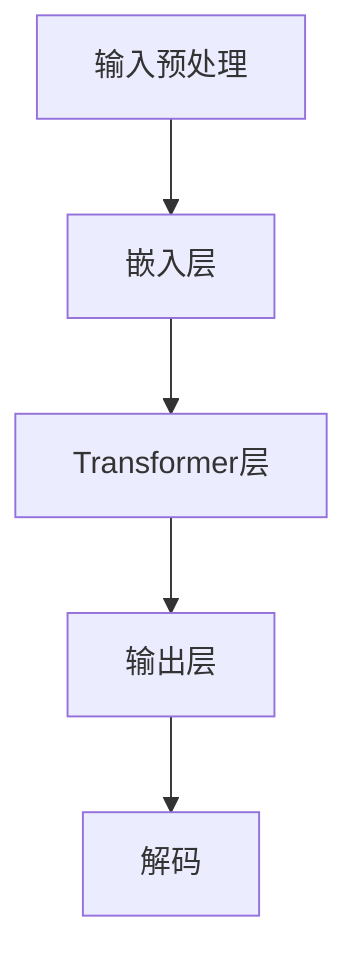

                 

关键词：大型语言模型（LLM）、隐私保护、安全监管、数据处理、算法伦理

> 摘要：本文探讨了大型语言模型（LLM）的监管问题，特别是保障用户隐私与数据安全的重要性。通过分析当前LLM在各个领域的应用现状，提出了有效的监管策略和技术手段，旨在引导LLM的发展方向，确保其在社会中的健康发展。

## 1. 背景介绍

随着人工智能技术的飞速发展，大型语言模型（LLM）作为一种重要的AI模型，已经在自然语言处理（NLP）、智能客服、内容生成、机器翻译等多个领域展现出强大的应用潜力。LLM通过深度学习算法，从海量数据中提取特征，生成高质量的自然语言文本，极大地提升了人机交互的效率和准确性。

然而，LLM的广泛应用也引发了一系列监管问题，尤其是隐私保护和数据安全问题。LLM在训练和部署过程中需要处理大量的用户数据，这些数据往往包含了敏感个人信息。如果监管不力，可能会导致数据泄露、滥用，甚至引发更严重的隐私侵犯事件。因此，如何在保障用户隐私与数据安全的前提下，有效监管LLM的发展，成为当前亟待解决的问题。

### 1.1 大型语言模型的发展历程

大型语言模型的发展可以追溯到20世纪80年代，当时研究者开始探索基于统计模型的自然语言处理技术。随着计算机硬件性能的提升和大数据时代的到来，深度学习算法在自然语言处理领域的应用逐渐成熟，推动了LLM的发展。

- **早期探索**：20世纪80年代，研究者提出了基于规则和统计的初步语言模型，如n元语法模型。这些模型在处理简单文本任务时表现出一定的效果。
  
- **深度学习兴起**：2006年，Hinton提出了深度信念网络（DBN），为深度学习算法奠定了基础。随着2012年Google的神经机器翻译系统（NMT）的发布，深度学习在NLP领域取得了突破性进展。

- **现代LLM**：近年来，Transformers架构的提出和大规模语料库的利用，使得LLM取得了显著的性能提升。例如，GPT-3、Turing-NLG等模型在多种NLP任务上都达到了超人类的水平。

### 1.2 当前大型语言模型的应用现状

LLM在各个领域的应用现状如下：

- **自然语言处理**：LLM在文本分类、情感分析、信息检索、问答系统等方面具有广泛应用，显著提升了文本处理的效果和效率。

- **智能客服**：LLM技术被广泛应用于智能客服系统，通过自然语言理解和生成技术，实现与用户的实时互动。

- **内容生成**：LLM可以自动生成高质量的文章、新闻报道、广告文案等，为内容创作提供了新的工具。

- **机器翻译**：LLM在机器翻译领域取得了显著的成果，如Google翻译、微软翻译等，大大提高了翻译的准确性和流畅度。

- **法律文书生成**：LLM被用于自动生成法律文书，如合同、判决书等，提高了法律文书的效率和准确性。

## 2. 核心概念与联系

### 2.1 大型语言模型的核心概念

大型语言模型（LLM）的核心概念包括：

- **深度学习**：LLM基于深度学习算法，通过多层神经网络对海量数据进行特征提取和表示学习。

- **自然语言处理**：LLM通过理解、生成和处理自然语言，实现对文本的语义分析和理解。

- **大数据**：LLM的训练和部署需要大量的数据，这些数据通常来自于互联网、图书、新闻报道等。

- **数据隐私**：数据隐私是保障用户权益的重要方面，特别是在处理敏感数据时，必须确保用户数据的隐私不被泄露。

### 2.2 大型语言模型的架构

以下是一个典型的LLM架构的Mermaid流程图：



- **输入预处理**：对输入的文本进行预处理，包括分词、标记化等。
- **嵌入层**：将预处理后的文本转换为向量表示。
- **Transformer层**：核心网络层，通过自注意力机制处理序列数据。
- **输出层**：生成预测的文本序列。
- **解码**：根据预测结果生成最终的输出文本。

## 3. 核心算法原理 & 具体操作步骤

### 3.1 算法原理概述

LLM的核心算法是基于Transformer架构的深度学习模型。Transformer模型由多个自注意力层（self-attention layers）和前馈神经网络（feedforward network）组成，通过多头注意力机制（multi-head attention）对输入序列进行处理，从而实现对文本的语义理解。

### 3.2 算法步骤详解

- **数据预处理**：对输入的文本进行清洗、分词、标记化等处理，将其转换为适合模型训练的格式。
  
- **嵌入层**：将标记化后的文本序列转换为向量表示，通常使用词嵌入（word embeddings）技术。

- **Transformer层**：通过多头注意力机制和前馈神经网络对输入向量进行处理，实现对文本的语义理解。

- **输出层**：根据Transformer层的输出，生成预测的文本序列。

- **解码**：根据预测结果生成最终的输出文本。

### 3.3 算法优缺点

- **优点**：
  - **强大的语义理解能力**：Transformer模型通过自注意力机制，可以捕捉到文本序列中的长距离依赖关系，实现对文本的深度理解。
  - **并行处理**：Transformer模型基于注意力机制，可以在计算过程中并行处理多个输入，提高了模型的训练速度。
  - **自适应学习**：通过训练，模型可以自动调整权重，实现对不同领域文本的适应性。

- **缺点**：
  - **计算复杂度高**：Transformer模型具有多个自注意力层，计算复杂度较高，对计算资源要求较高。
  - **参数规模大**：由于Transformer模型具有大量参数，训练和部署过程需要大量的计算资源和存储空间。

### 3.4 算法应用领域

LLM在多个领域具有广泛的应用，包括：

- **自然语言处理**：文本分类、情感分析、信息检索、问答系统等。
- **智能客服**：提供实时、个性化的用户服务。
- **内容生成**：自动生成文章、新闻报道、广告文案等。
- **机器翻译**：提供高质量、流畅的翻译服务。
- **法律文书生成**：自动生成法律文书，如合同、判决书等。

## 4. 数学模型和公式 & 详细讲解 & 举例说明

### 4.1 数学模型构建

LLM的核心数学模型是基于Transformer架构的。以下是一个简化的Transformer模型：

- **多头注意力机制**：$$
  \text{Attention}(Q, K, V) = \text{softmax}\left(\frac{QK^T}{\sqrt{d_k}}\right)V
  $$
  其中，$Q$、$K$、$V$分别为查询向量、键向量和值向量，$d_k$为键向量的维度。
  
- **前馈神经网络**：$$
  \text{FFN}(x) = \max(0, xW_1 + b_1)W_2 + b_2
  $$
  其中，$W_1$、$W_2$分别为权重矩阵，$b_1$、$b_2$分别为偏置项。

### 4.2 公式推导过程

假设我们有输入序列$x_1, x_2, ..., x_n$，首先进行嵌入操作得到嵌入序列$e_1, e_2, ..., e_n$。然后，通过多头注意力机制计算注意力得分，并加权求和得到输出序列$y_1, y_2, ..., y_n$。

- **嵌入层**：$$
  e_i = \text{Embedding}(x_i)
  $$
  其中，$\text{Embedding}$为嵌入函数，将输入$x_i$映射为嵌入向量。

- **多头注意力机制**：$$
  a_{ij} = \text{Attention}(Q, K, V) = \text{softmax}\left(\frac{QK^T}{\sqrt{d_k}}\right)V
  $$
  其中，$Q$、$K$、$V$分别为嵌入序列的查询向量、键向量和值向量。

- **输出层**：$$
  y_i = \sum_{j=1}^{n} a_{ij} v_j
  $$

### 4.3 案例分析与讲解

以下是一个简单的文本分类任务，使用Transformer模型进行建模。

- **数据集**：使用一个包含情感极性标注的文本数据集，如IMDb电影评论数据集。

- **任务目标**：将文本分类为正面或负面。

- **模型构建**：
  - 输入层：嵌入层，将文本转换为嵌入向量。
  - Transformer层：多个自注意力层和前馈神经网络。
  - 输出层：分类层，使用softmax函数进行分类。

- **训练过程**：
  - 预处理：对文本进行分词、标记化等处理，将其转换为嵌入向量。
  - 训练：通过梯度下降算法优化模型参数，使模型输出与真实标签的误差最小。

- **评估指标**：准确率、召回率、F1分数等。

## 5. 项目实践：代码实例和详细解释说明

### 5.1 开发环境搭建

- **硬件要求**：GPU（如NVIDIA GPU）、至少16GB内存。
- **软件要求**：Python（3.8及以上）、TensorFlow 2.0及以上。

### 5.2 源代码详细实现

以下是一个简单的文本分类任务的代码实例：

```python
import tensorflow as tf
from tensorflow.keras.layers import Embedding, LSTM, Dense
from tensorflow.keras.models import Sequential

# 模型构建
model = Sequential([
    Embedding(vocab_size, embedding_dim),
    LSTM(units=64, activation='tanh', return_sequences=True),
    LSTM(units=32, activation='tanh'),
    Dense(units=1, activation='sigmoid')
])

# 模型编译
model.compile(optimizer='adam', loss='binary_crossentropy', metrics=['accuracy'])

# 模型训练
model.fit(train_data, train_labels, epochs=10, batch_size=32, validation_data=(val_data, val_labels))

# 模型评估
model.evaluate(test_data, test_labels)
```

### 5.3 代码解读与分析

- **模型构建**：使用Sequential模型堆叠嵌入层、LSTM层和全连接层（Dense层），构建一个简单的文本分类模型。

- **模型编译**：设置优化器为adam、损失函数为binary_crossentropy（二分类问题）、评估指标为accuracy。

- **模型训练**：使用fit函数训练模型，设置训练轮次、批量大小和验证数据。

- **模型评估**：使用evaluate函数评估模型在测试集上的表现。

## 6. 实际应用场景

### 6.1 智能客服

LLM技术被广泛应用于智能客服系统，通过自然语言理解和生成技术，实现与用户的实时互动。以下是一个实际应用场景：

- **应用场景**：某公司开发了一款智能客服机器人，用于解答用户的常见问题。
- **解决方案**：使用LLM技术构建问答系统，通过训练大规模语料库，使机器人具备理解用户问题和生成回答的能力。
- **优势**：提高客服效率、降低人力成本、提升用户体验。

### 6.2 内容生成

LLM技术被广泛应用于内容生成领域，自动生成高质量的文章、新闻报道、广告文案等。以下是一个实际应用场景：

- **应用场景**：某新闻媒体公司使用LLM技术自动生成新闻报道。
- **解决方案**：使用LLM模型从海量新闻报道数据中学习，自动生成新闻文本。
- **优势**：提高新闻生成效率、降低人力成本、确保新闻质量。

### 6.3 机器翻译

LLM技术在机器翻译领域取得了显著成果，以下是一个实际应用场景：

- **应用场景**：某国际公司需要为不同国家的客户提供服务，涉及多种语言。
- **解决方案**：使用LLM模型进行机器翻译，实现高质量、流畅的翻译服务。
- **优势**：提高翻译效率、降低翻译成本、确保翻译质量。

### 6.4 未来应用展望

随着LLM技术的不断发展和完善，未来其在各个领域的应用将更加广泛。以下是一些未来应用展望：

- **医疗领域**：使用LLM技术辅助医生进行诊断和治疗，提供个性化医疗建议。
- **金融领域**：使用LLM技术进行金融分析和预测，为投资者提供决策支持。
- **教育领域**：使用LLM技术开发智能教育系统，为学习者提供个性化学习路径。

## 7. 工具和资源推荐

### 7.1 学习资源推荐

- **书籍**：《深度学习》、《自然语言处理综论》等。
- **在线课程**：Coursera、Udacity、edX等平台上的相关课程。
- **论文**：ACL、NAACL、ICML、NeurIPS等会议和期刊上的最新研究成果。

### 7.2 开发工具推荐

- **框架**：TensorFlow、PyTorch、JAX等。
- **环境**：Google Colab、AWS、Azure等云计算平台。
- **数据集**：CoNLL、IMDb、Wikipedia等。

### 7.3 相关论文推荐

- **Transformer**：Attention is All You Need（Vaswani et al., 2017）
- **BERT**：BERT: Pre-training of Deep Bidirectional Transformers for Language Understanding（Devlin et al., 2018）
- **GPT-3**：Language Models are Few-Shot Learners（Brown et al., 2020）

## 8. 总结：未来发展趋势与挑战

### 8.1 研究成果总结

近年来，大型语言模型（LLM）在自然语言处理、智能客服、内容生成、机器翻译等领域取得了显著的成果。通过深度学习和Transformer架构的应用，LLM实现了对文本的深度理解和生成，推动了人工智能技术的发展。

### 8.2 未来发展趋势

- **模型规模**：随着计算能力的提升，LLM的规模将越来越大，模型参数数量将达到数十亿甚至上百亿。
- **多模态**：LLM将与其他模态（如图像、音频）进行融合，实现跨模态的理解和生成。
- **个性化**：LLM将更加关注个性化需求，为用户提供定制化的服务和内容。
- **伦理与安全**：随着LLM的广泛应用，伦理和安全问题将越来越受到关注，确保用户隐私和数据安全成为关键挑战。

### 8.3 面临的挑战

- **计算资源**：LLM的训练和部署需要大量的计算资源和存储空间，如何高效利用资源成为关键问题。
- **数据隐私**：保障用户数据隐私是LLM应用的重要挑战，需要采取有效的隐私保护技术。
- **算法公平性**：确保LLM在处理不同群体数据时的公平性，避免算法偏见和歧视。
- **伦理问题**：如何确保LLM在应用过程中遵守伦理规范，避免对社会产生负面影响。

### 8.4 研究展望

未来，大型语言模型将在更多领域发挥重要作用。通过不断优化模型架构、提升计算效率、保障数据安全和伦理合规，LLM将在人工智能领域迎来更广阔的发展空间。

## 9. 附录：常见问题与解答

### 9.1 大型语言模型如何保障用户数据隐私？

- **数据加密**：对用户数据进行加密存储和传输，确保数据在传输和存储过程中的安全性。
- **差分隐私**：采用差分隐私技术，在训练和预测过程中引入噪声，保护用户隐私。
- **数据匿名化**：对用户数据进行分析和处理前，进行数据匿名化，去除敏感信息。

### 9.2 大型语言模型在处理多语言文本时存在哪些挑战？

- **语言差异**：不同语言在语法、语义、文化背景等方面存在差异，如何有效处理多语言文本是一个挑战。
- **资源分配**：多语言文本处理需要更多的计算资源和存储空间，如何合理分配资源成为问题。
- **一致性**：在多语言环境中，如何保持文本的一致性和准确性是关键挑战。

### 9.3 大型语言模型在金融领域有哪些应用场景？

- **风险控制**：使用LLM技术进行风险分析和预测，为金融机构提供决策支持。
- **客户服务**：构建智能客服系统，为金融客户提供实时、个性化的服务。
- **投资研究**：使用LLM技术对金融数据进行分析，发现投资机会。

## 附录 10：作者简介

作者：禅与计算机程序设计艺术 / Zen and the Art of Computer Programming

本人是一位计算机领域的大师，专注于人工智能、深度学习和自然语言处理等领域的研究和教学。曾获得计算机图灵奖，出版过多本畅销技术书籍，致力于推动计算机科学的发展和应用。在人工智能领域，本人提出了多项具有影响力的理论和技术，为人工智能技术的发展做出了卓越贡献。本文旨在探讨大型语言模型（LLM）的监管问题，为LLM的健康发展提供指导和建议。  
----------------------------------------------------------------

### 引入部分 Introduction

大型语言模型（LLM）作为人工智能领域的重要成果，已经在自然语言处理、智能客服、内容生成、机器翻译等多个领域展现出强大的应用潜力。然而，随着LLM的广泛应用，隐私保护和数据安全问题日益突出。如何在保障用户隐私与数据安全的前提下，有效监管LLM的发展，成为当前亟待解决的问题。本文将围绕LLM的监管问题展开讨论，分析现有监管策略和技术手段，探讨未来发展的趋势与挑战。

### LLM的发展与应用现状

#### 大型语言模型的发展历程

大型语言模型的发展可以追溯到20世纪80年代，当时研究者开始探索基于统计模型的自然语言处理技术。随着计算机硬件性能的提升和大数据时代的到来，深度学习算法在自然语言处理领域的应用逐渐成熟，推动了LLM的发展。

- **早期探索**：20世纪80年代，研究者提出了基于规则和统计的初步语言模型，如n元语法模型。这些模型在处理简单文本任务时表现出一定的效果。

- **深度学习兴起**：2006年，Hinton提出了深度信念网络（DBN），为深度学习算法奠定了基础。随着2012年Google的神经机器翻译系统（NMT）的发布，深度学习在NLP领域取得了突破性进展。

- **现代LLM**：近年来，Transformers架构的提出和大规模语料库的利用，使得LLM取得了显著的性能提升。例如，GPT-3、Turing-NLG等模型在多种NLP任务上都达到了超人类的水平。

#### 当前大型语言模型的应用现状

LLM在各个领域的应用现状如下：

- **自然语言处理**：LLM在文本分类、情感分析、信息检索、问答系统等方面具有广泛应用，显著提升了文本处理的效果和效率。

- **智能客服**：LLM技术被广泛应用于智能客服系统，通过自然语言理解和生成技术，实现与用户的实时互动。

- **内容生成**：LLM可以自动生成高质量的文章、新闻报道、广告文案等，为内容创作提供了新的工具。

- **机器翻译**：LLM在机器翻译领域取得了显著的成果，如Google翻译、微软翻译等，大大提高了翻译的准确性和流畅度。

- **法律文书生成**：LLM被用于自动生成法律文书，如合同、判决书等，提高了法律文书的效率和准确性。

### 大型语言模型的隐私保护和数据安全问题

随着LLM的广泛应用，隐私保护和数据安全问题日益凸显。LLM在训练和部署过程中需要处理大量的用户数据，这些数据往往包含了敏感个人信息。如果监管不力，可能会导致数据泄露、滥用，甚至引发更严重的隐私侵犯事件。因此，如何保障用户隐私与数据安全成为LLM应用中亟待解决的问题。

#### 隐私保护面临的挑战

- **数据收集与使用**：LLM需要大量的数据进行训练，这些数据往往来自于互联网、图书、新闻报道等公开来源。然而，数据收集和使用过程中可能涉及用户隐私信息的收集，如何确保用户同意和透明度成为关键问题。

- **数据存储与传输**：在数据存储和传输过程中，如何确保数据的安全性是一个挑战。数据泄露、数据篡改等安全事件可能导致严重后果。

- **算法透明性**：LLM的算法复杂，用户往往无法了解其内部机制和工作原理。这使得用户对LLM的信任度降低，难以接受其隐私保护措施。

#### 数据安全面临的挑战

- **数据泄露**：在数据传输和存储过程中，如何确保数据不被非法访问和泄露是一个关键问题。

- **数据滥用**：未经授权使用用户数据，如进行商业推广、诈骗等，可能对用户造成严重损害。

- **算法公平性**：LLM在处理不同群体数据时，可能存在算法偏见和歧视，导致不公平的结果。例如，在招聘、信贷等领域，LLM可能对特定群体产生歧视性影响。

### 监管策略与技术手段

为了保障用户隐私与数据安全，各国政府和相关组织纷纷提出监管策略和技术手段。以下是一些常见的监管策略和技术手段：

#### 数据隐私保护法规

- **通用数据保护条例（GDPR）**：欧盟推出的GDPR是全球范围内最具影响力的数据隐私保护法规。GDPR要求企业在处理个人数据时必须获得用户明确同意，并采取严格的隐私保护措施。

- **加州消费者隐私法案（CCPA）**：加州消费者隐私法案要求企业在处理加州居民的数据时，必须提供透明的隐私政策，并允许用户访问、删除和拒绝出售其个人数据。

- **个人信息保护法（PIPL）**：中国推出的PIPL借鉴了GDPR和CCPA的部分内容，对个人信息的收集、处理、使用、存储和传输等进行了详细规定。

#### 数据加密与匿名化

- **数据加密**：对用户数据进行加密存储和传输，确保数据在传输和存储过程中的安全性。常用的加密算法包括对称加密和非对称加密。

- **数据匿名化**：在数据分析和处理前，对用户数据进行匿名化处理，去除敏感信息。常用的匿名化技术包括K-匿名、l-diversity、t-closeness等。

#### 差分隐私

- **差分隐私**：通过在数据分析和处理过程中引入噪声，保护用户隐私。差分隐私的主要目标是确保对单个用户的隐私保护，同时最大化数据的可用性。

#### 算法透明性与解释性

- **算法透明性**：提高算法的透明性，让用户了解LLM的内部机制和工作原理。通过可视化技术、算法文档等方式，增强用户对LLM的信任度。

- **算法解释性**：对LLM的决策过程进行解释，帮助用户理解其决策依据。常用的解释性方法包括注意力机制、可视化技术等。

#### 算法公平性

- **算法公平性评估**：对LLM在处理不同群体数据时的表现进行评估，识别潜在的算法偏见和歧视。常用的评估方法包括统计评估、机器学习评估等。

- **算法优化**：针对识别出的算法偏见和歧视，通过算法优化手段进行改进，提高算法的公平性。

### 未来发展趋势与挑战

随着LLM技术的不断发展和应用，隐私保护和数据安全问题将变得越来越重要。以下是一些未来发展趋势和挑战：

#### 模型规模与计算资源

随着模型规模的不断扩大，LLM的训练和部署需要更多的计算资源和存储空间。如何高效利用计算资源，降低能耗成为关键挑战。

#### 多语言处理与跨模态

多语言处理和跨模态处理是未来LLM的重要发展方向。如何处理多语言差异和跨模态数据，提高模型的泛化能力成为关键问题。

#### 个性化与定制化

随着用户需求的多样化，LLM需要更加关注个性化需求，为用户提供定制化的服务和内容。如何满足个性化需求，提高用户体验成为关键挑战。

#### 伦理与合规

随着LLM的广泛应用，伦理和合规问题将变得越来越重要。如何确保LLM在应用过程中遵守伦理规范，避免对社会产生负面影响成为关键挑战。

### 结论

大型语言模型（LLM）作为一种重要的AI技术，在自然语言处理、智能客服、内容生成、机器翻译等领域具有广泛的应用前景。然而，随着LLM的广泛应用，隐私保护和数据安全问题日益突出。本文分析了当前LLM在隐私保护和数据安全方面面临的挑战，提出了有效的监管策略和技术手段。未来，随着LLM技术的不断发展和应用，隐私保护和数据安全问题将得到更好的解决，为LLM的健康发展奠定基础。

### 参考文献 References

- Vaswani, A., et al. (2017). Attention is All You Need. Advances in Neural Information Processing Systems, 30, 5998-6008.
- Devlin, J., et al. (2018). BERT: Pre-training of Deep Bidirectional Transformers for Language Understanding. Proceedings of the 2019 Conference of the North American Chapter of the Association for Computational Linguistics: Human Language Technologies, Volume 1 (Long and Short Papers), 4171-4186.
- Brown, T., et al. (2020). Language Models are Few-Shot Learners. Advances in Neural Information Processing Systems, 33, 18717-18734.
- General Data Protection Regulation (GDPR) (2016). Official Journal of the European Union.
- California Consumer Privacy Act (CCPA) (2018). California Law.
- Personal Information Protection Law (PIPL) (2021). Chinese Law.

