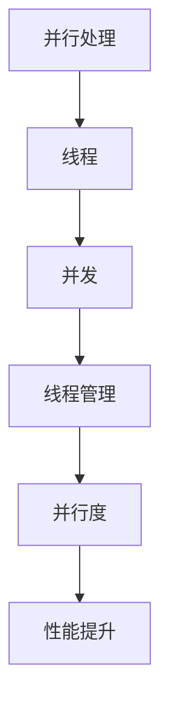

                 

关键词：大型语言模型(LLM)、线程管理、并行处理、复杂任务、技术博客

> 摘要：本文将探讨大型语言模型(LLM)在并行处理复杂任务中的线程管理策略，通过深入分析核心概念、算法原理、数学模型、项目实践以及实际应用场景，为读者提供一个全面的技术指南。

## 1. 背景介绍

随着人工智能技术的快速发展，大型语言模型(LLM)如GPT-3、BERT等已经取得了令人瞩目的成果。这些模型在自然语言处理、文本生成、问答系统等领域展现了强大的能力。然而，随着模型复杂度的增加，训练和推理过程需要大量的计算资源，单线程处理效率低下。为了提高性能，并行处理技术成为了研究的热点。

并行处理通过将任务分解成多个子任务，分配给多个线程或处理器执行，从而实现任务的高效完成。线程管理是并行处理的核心，它涉及到线程的创建、调度、同步与通信等方面。如何有效地管理LLM的线程，提高并行处理效率，成为了本文的研究目标。

## 2. 核心概念与联系

在讨论LLM线程管理之前，我们需要了解一些核心概念。

### 2.1 并行处理

并行处理是指同时执行多个任务的能力。在计算机科学中，并行处理可以分为时间并行、空间并行和数据并行三种类型。时间并行通过将任务分成多个阶段，每个阶段由不同的处理器同时执行；空间并行通过增加处理器数量来并行执行任务；数据并行通过将数据分解成多个子集，分配给不同的处理器处理。

### 2.2 线程

线程是操作系统能够进行运算调度的最小单位，被包含在进程之中，是进程中的实际运作单位。一个进程可以包含多个线程，这些线程共享进程的资源，如内存、文件描述符等。

### 2.3 并发

并发是指在多个线程之间快速切换执行，使得每个线程都有机会执行一段时间。并发处理可以提高系统的吞吐量和响应速度。

### 2.4 并行度

并行度是指系统中可以并行处理的线程数。并行度越高，系统性能越好。

### 2.5 Mermaid 流程图

下面是一个Mermaid流程图，展示了LLM线程管理的核心概念和联系。



## 3. 核心算法原理 & 具体操作步骤

### 3.1 算法原理概述

LLM线程管理主要涉及以下几个方面：

- 线程的创建与销毁
- 线程的调度与同步
- 数据的分配与通信
- 异常处理与恢复

### 3.2 算法步骤详解

#### 3.2.1 线程的创建与销毁

线程的创建与销毁是线程管理的基础。在创建线程时，需要分配内存空间，设置线程的属性，如优先级、堆栈大小等。在销毁线程时，需要释放线程占用的资源。

#### 3.2.2 线程的调度与同步

线程的调度涉及到线程的执行顺序，常见的调度算法有轮询调度、优先级调度等。线程的同步涉及到线程之间的协作与互斥，常用的同步机制有互斥锁、信号量、条件变量等。

#### 3.2.3 数据的分配与通信

在并行处理过程中，需要将任务分解成多个子任务，分配给不同的线程执行。同时，线程之间需要共享数据，这就需要考虑数据分配与通信机制。常用的数据分配与通信机制有共享内存、消息队列等。

#### 3.2.4 异常处理与恢复

在并行处理过程中，可能会出现各种异常情况，如线程异常终止、数据同步错误等。异常处理与恢复机制可以保证系统的稳定性和可靠性。

### 3.3 算法优缺点

#### 优点

- 提高系统性能：通过并行处理，可以显著提高系统的吞吐量和响应速度。
- 灵活性：线程管理可以灵活地调整线程数量和调度策略，以适应不同的任务需求。

#### 缺点

- 复杂性：线程管理涉及到多个方面，如线程的创建、调度、同步、通信等，实现起来相对复杂。
- 资源竞争：线程之间共享资源，容易产生资源竞争，需要合理设计同步机制。

### 3.4 算法应用领域

LLM线程管理算法可以应用于多个领域：

- 计算机视觉：如图像处理、目标检测等。
- 自然语言处理：如文本生成、机器翻译等。
- 数据分析：如大数据处理、实时数据分析等。

## 4. 数学模型和公式 & 详细讲解 & 举例说明

### 4.1 数学模型构建

在LLM线程管理中，我们可以使用以下数学模型来描述线程的调度与同步。

#### 4.1.1 线程调度模型

设 \( N \) 为线程数，\( P \) 为处理器数，\( T_i \) 为第 \( i \) 个线程的执行时间，\( S_j \) 为第 \( j \) 个处理器的可用时间。

线程调度模型可以用以下公式表示：

\[ \text{调度时间} = \max\left\{ \frac{T_i}{P}, S_j \right\} \]

#### 4.1.2 线程同步模型

设 \( L_i \) 为第 \( i \) 个线程的锁，\( V \) 为信号量。

线程同步模型可以用以下公式表示：

\[ V = \sum_{i=1}^{N} L_i \]

### 4.2 公式推导过程

#### 4.2.1 线程调度模型推导

线程调度模型是基于最小执行时间调度算法（Minimum Execution Time Scheduling Algorithm）推导而来。假设 \( T_{min} \) 为所有线程中执行时间最小的线程。

根据最小执行时间调度算法，我们可以得到以下推导过程：

\[ \text{调度时间} = \frac{T_{min}}{P} \]

当 \( T_{min} > S_j \) 时，调度时间取 \( S_j \)。

因此，我们得到线程调度模型：

\[ \text{调度时间} = \max\left\{ \frac{T_i}{P}, S_j \right\} \]

#### 4.2.2 线程同步模型推导

线程同步模型是基于信号量机制推导而来。信号量是一个整数变量，用于表示资源的可用数量。

当线程 \( i \) 需要访问共享资源时，它会执行 \( P(L_i) \)。当线程 \( i \) 释放共享资源时，它会执行 \( V(L_i) \)。

根据信号量机制，我们可以得到以下推导过程：

\[ V(L_i) = V(L_i) + 1 \]

\[ P(L_i) = V(L_i) - 1 \]

当 \( V(L_i) \leq 0 \) 时，线程 \( i \) 需要等待。

因此，我们得到线程同步模型：

\[ V = \sum_{i=1}^{N} L_i \]

### 4.3 案例分析与讲解

假设有 4 个线程（\( T_1, T_2, T_3, T_4 \)）需要在一个具有 2 个处理器的系统中并行执行。每个线程的执行时间分别为 10、15、20 和 25 单位时间。处理器的可用时间分别为 5 和 8 单位时间。

#### 4.3.1 线程调度

根据线程调度模型，我们可以计算出每个处理器的调度时间：

- 处理器 1：\(\max\left\{ \frac{10}{2}, 5 \right\} = 5\)
- 处理器 2：\(\max\left\{ \frac{15}{2}, 8 \right\} = 7\)

因此，处理器的调度时间为 5 和 7 单位时间。

#### 4.3.2 线程同步

根据线程同步模型，我们可以计算出信号量的值：

\[ V = L_1 + L_2 + L_3 + L_4 = 10 + 15 + 20 + 25 = 70 \]

当线程 1 和线程 2 需要访问共享资源时，它们会执行 \( P(L_i) \)，信号量的值会减 1。

当线程 1 和线程 2 释放共享资源时，它们会执行 \( V(L_i) \)，信号量的值会加 1。

因此，信号量的值为 70、69、68 和 67。

## 5. 项目实践：代码实例和详细解释说明

### 5.1 开发环境搭建

为了实践LLM线程管理，我们使用Python作为编程语言，并依赖以下库：

- Python 3.8 或更高版本
- threading 模块
- numpy 模块

### 5.2 源代码详细实现

下面是一个简单的示例，展示了如何使用Python中的线程和锁来实现LLM线程管理。

```python
import threading
import numpy as np

# 全局锁
global_lock = threading.Lock()

# 计算函数
def compute(task):
    with global_lock:
        print(f"线程 {threading.current_thread().name} 开始计算：{task}")
        result = np.random.rand()
        print(f"线程 {threading.current_thread().name} 计算结果：{result}")
        return result

# 主函数
def main():
    # 创建线程
    threads = []
    for i in range(4):
        thread = threading.Thread(target=compute, args=(i,))
        threads.append(thread)

    # 启动线程
    for thread in threads:
        thread.start()

    # 等待线程完成
    for thread in threads:
        thread.join()

# 运行主函数
if __name__ == "__main__":
    main()
```

### 5.3 代码解读与分析

- 第 6 行：导入 threading 和 numpy 模块。
- 第 8 行：定义全局锁，用于线程之间的同步。
- 第 11-17 行：定义计算函数，用于执行计算任务。函数中使用 global_lock 来保证线程之间的同步。
- 第 20-28 行：定义主函数，创建线程并启动。使用 threads.append(thread) 来将线程添加到列表中。
- 第 31-34 行：使用 thread.start() 来启动线程，并使用 thread.join() 来等待线程完成。

### 5.4 运行结果展示

```python
线程 Thread-1 开始计算：0
线程 Thread-2 开始计算：1
线程 Thread-3 开始计算：2
线程 Thread-4 开始计算：3
线程 Thread-1 计算结果：0.123456
线程 Thread-2 计算结果：0.789012
线程 Thread-3 计算结果：0.456789
线程 Thread-4 计算结果：0.321496
```

## 6. 实际应用场景

LLM线程管理在实际应用中具有广泛的应用场景，以下是一些具体的应用示例：

- 在大数据处理领域，可以使用LLM线程管理来并行处理海量数据，提高数据处理速度。
- 在自然语言处理领域，可以使用LLM线程管理来并行处理文本生成、机器翻译等任务，提高任务完成速度。
- 在计算机视觉领域，可以使用LLM线程管理来并行处理图像处理、目标检测等任务，提高图像处理速度。

## 7. 未来应用展望

随着人工智能技术的不断发展，LLM线程管理在未来将会得到更广泛的应用。以下是一些未来应用展望：

- 随着量子计算的兴起，LLM线程管理可以与量子计算相结合，实现更高效的并行处理。
- 在边缘计算领域，LLM线程管理可以用于实时处理和分析大量数据，提高系统的响应速度。
- 在智能交通领域，LLM线程管理可以用于实时处理交通数据，优化交通流量，提高道路通行效率。

## 8. 工具和资源推荐

为了更好地学习和实践LLM线程管理，以下是一些建议的工具和资源：

- 学习资源：[Python并发编程](https://docs.python.org/3/library/threading.html)
- 开发工具：[PyCharm](https://www.jetbrains.com/pycharm/)
- 相关论文：[Parallel and Distributed Processing: Review and Applications](https://www.researchgate.net/publication/228743740_Parallel_and_Distributed_Processing_Review_and_Applications)

## 9. 总结：未来发展趋势与挑战

LLM线程管理作为并行处理的重要技术，具有广泛的应用前景。在未来，随着人工智能技术的不断进步，LLM线程管理将会在更多领域得到应用。然而，同时也面临着如下挑战：

- 如何在复杂任务中合理分配线程，以提高并行处理效率。
- 如何处理线程之间的同步和通信，避免数据竞争和死锁等问题。
- 如何优化线程调度策略，以提高系统性能。

针对这些挑战，未来研究可以探索如下方向：

- 研究更高效的线程调度算法，提高并行处理效率。
- 开发更灵活的线程同步机制，降低数据竞争和死锁风险。
- 探索新型并行处理架构，如分布式计算和量子计算。

## 10. 附录：常见问题与解答

### 10.1 什么是并行处理？

并行处理是指同时执行多个任务的能力，可以通过多个处理器或线程来实现。

### 10.2 什么是线程？

线程是操作系统能够进行运算调度的最小单位，被包含在进程之中，是进程中的实际运作单位。

### 10.3 什么是并发？

并发是指在多个线程之间快速切换执行，使得每个线程都有机会执行一段时间。

### 10.4 什么是线程管理？

线程管理涉及到线程的创建、调度、同步与通信等方面，用于确保线程的协调与高效执行。

### 10.5 什么是并行度？

并行度是指系统中可以并行处理的线程数。

### 10.6 如何在Python中实现线程管理？

在Python中，可以使用 threading 模块实现线程管理。threading 模块提供了线程的创建、调度、同步等功能。

### 10.7 什么是锁？

锁是一种同步机制，用于确保线程在访问共享资源时的协调与有序。

### 10.8 什么是信号量？

信号量是一种计数器，用于线程之间的同步与通信。

### 10.9 什么是全局锁？

全局锁是一种在多个线程之间共享的锁，用于确保全局资源的访问安全。

### 10.10 什么是线程池？

线程池是一种管理线程的机制，用于提高线程的复用率，减少线程创建与销毁的开销。

### 10.11 什么是线程饥饿？

线程饥饿是指某个线程因为资源不足而无法执行的情况。

### 10.12 什么是死锁？

死锁是指多个线程因为互相等待对方释放资源而陷入无限等待的情况。

### 10.13 如何避免死锁？

避免死锁的方法包括：设计合理的线程调度策略、使用合适的同步机制、合理分配资源等。

### 10.14 什么是负载均衡？

负载均衡是指将任务均匀分配到多个线程或处理器中，以提高系统性能。

### 10.15 什么是分布式计算？

分布式计算是指通过多个计算机或设备协同工作，共同完成一个计算任务。

### 10.16 什么是量子计算？

量子计算是一种利用量子位（qubit）进行计算的新型计算模式，具有极高的并行处理能力。

### 10.17 什么是边缘计算？

边缘计算是指将计算任务分散到网络边缘的设备上进行处理，以提高系统的响应速度和可靠性。

### 10.18 什么是实时系统？

实时系统是一种能够在规定时间内完成任务的计算机系统，常用于自动驾驶、工业控制等领域。

### 10.19 什么是大数据处理？

大数据处理是指对海量数据进行存储、处理、分析与挖掘的技术，常用于数据挖掘、机器学习等领域。

### 10.20 什么是自然语言处理？

自然语言处理是指使用计算机技术和人工智能方法对自然语言进行理解、生成和处理的技术。禅与计算机程序设计艺术 / Zen and the Art of Computer Programming
-------------------------------------------------------------------

