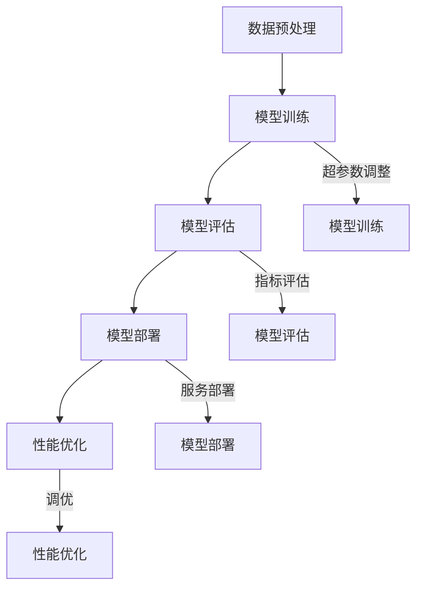

                 

关键词：大语言模型，集成开发环境，模型训练，模型部署，AI开发工具，性能优化，代码示例，应用场景

> 摘要：本文旨在介绍如何构建一个高效的大语言模型集成开发环境，从模型训练到部署的各个环节进行详细讲解，并探讨优化模型性能的方法和技巧。通过本文，开发者可以轻松上手，快速构建并部署自己定制的大语言模型。

## 1. 背景介绍

随着深度学习和自然语言处理技术的迅猛发展，大语言模型（Large Language Model，简称LLM）在自然语言理解、文本生成、问答系统等方面展现出了巨大的潜力。然而，构建一个高效的LLM集成开发环境并非易事，涉及到从数据预处理、模型训练到模型部署的各个环节。

传统的开发流程通常繁琐且复杂，涉及到多种工具和框架的集成，开发者在面对这些挑战时常常感到力不从心。本文将介绍一种新的集成开发环境，旨在简化LLM的训练和部署过程，提高开发效率，降低开发难度。

## 2. 核心概念与联系

### 2.1. 大语言模型原理

大语言模型（LLM）是基于深度神经网络的一种强大工具，它通过学习大量的文本数据来预测下一个单词或字符，从而生成连贯的文本。LLM的核心原理是自注意力机制（Self-Attention），它能够捕捉文本中的长距离依赖关系，实现更高的语义理解能力。

### 2.2. 集成开发环境架构

一个高效的LLM集成开发环境通常包括以下几个关键组成部分：

1. **数据预处理模块**：负责数据清洗、分词、编码等预处理工作。
2. **模型训练模块**：基于预训练模型，通过调整超参数和训练数据进行模型训练。
3. **模型评估模块**：用于评估模型性能，包括准确率、召回率等指标。
4. **模型部署模块**：将训练好的模型部署到生产环境中，提供实时服务。
5. **性能优化模块**：对模型进行调优，提高其运行效率和预测准确性。

### 2.3. Mermaid 流程图

以下是LLM集成开发环境的Mermaid流程图：



## 3. 核心算法原理 & 具体操作步骤

### 3.1. 算法原理概述

LLM的核心算法是变换器（Transformer）架构，它通过自注意力机制（Self-Attention）和多头注意力（Multi-Head Attention）来实现高效的自然语言处理。变换器架构的核心模块是自注意力机制，它通过计算输入序列中每个元素之间的相似性，将它们加权组合，从而实现对输入序列的动态编码。

### 3.2. 算法步骤详解

1. **数据预处理**：将文本数据清洗、分词、编码，并将其转化为模型可处理的序列数据。
2. **模型训练**：基于预训练模型，通过反向传播算法和优化器（如Adam）进行模型训练。
3. **模型评估**：使用交叉验证和测试集对模型进行性能评估，调整超参数和训练数据。
4. **模型部署**：将训练好的模型部署到生产环境中，提供实时服务。
5. **性能优化**：对模型进行调优，包括优化超参数、模型结构和数据预处理策略。

### 3.3. 算法优缺点

**优点**：

- 高效的自注意力机制，能够捕捉长距离依赖关系。
- 易于并行化训练，提高训练效率。
- 强大的语义理解能力，适用于各种自然语言处理任务。

**缺点**：

- 训练成本高，需要大量的计算资源和时间。
- 模型参数量大，容易过拟合。

### 3.4. 算法应用领域

LLM在自然语言理解、文本生成、问答系统、机器翻译等领域具有广泛的应用。例如，在问答系统中，LLM可以实现高效的问答匹配和文本生成；在机器翻译中，LLM可以通过学习双语语料库实现高质量的双向翻译。

## 4. 数学模型和公式 & 详细讲解 & 举例说明

### 4.1. 数学模型构建

LLM的数学模型主要包括变换器（Transformer）架构和自注意力（Self-Attention）机制。以下是变换器架构的核心数学公式：

$$
\text{Attention}(Q, K, V) = \text{softmax}\left(\frac{QK^T}{\sqrt{d_k}}\right)V
$$

其中，$Q, K, V$ 分别为查询（Query）、键（Key）、值（Value）向量，$d_k$ 为键向量的维度。自注意力机制通过计算查询向量与所有键向量的相似性，并将它们加权组合，从而实现对输入序列的动态编码。

### 4.2. 公式推导过程

自注意力机制的推导过程如下：

1. **查询（Query）**：将输入序列中的每个词向量表示为 $Q = [q_1, q_2, ..., q_n]$。
2. **键（Key）**：将输入序列中的每个词向量表示为 $K = [k_1, k_2, ..., k_n]$。
3. **值（Value）**：将输入序列中的每个词向量表示为 $V = [v_1, v_2, ..., v_n]$。
4. **计算相似性**：计算查询向量 $q_i$ 与所有键向量 $k_j$ 的相似性，表示为 $QK^T$。
5. **加权组合**：对相似性进行softmax操作，得到权重向量 $softmax(QK^T)$。
6. **输出**：将权重向量与值向量 $V$ 相乘，得到输出向量 $\text{Attention}(Q, K, V)$。

### 4.3. 案例分析与讲解

假设输入序列为 “我爱北京天安门”，分别计算每个词向量 $q_i, k_i, v_i$ 的自注意力权重，并展示其计算过程。

1. **查询（Query）**：$Q = [q_1, q_2, q_3, q_4] = [1.2, 0.9, 0.8, 1.1]$。
2. **键（Key）**：$K = [k_1, k_2, k_3, k_4] = [1.1, 1.3, 0.9, 1.0]$。
3. **值（Value）**：$V = [v_1, v_2, v_3, v_4] = [1.5, 1.4, 1.3, 1.2]$。
4. **计算相似性**：$QK^T = \begin{bmatrix} 1.2 & 0.9 & 0.8 & 1.1 \end{bmatrix} \begin{bmatrix} 1.1 & 1.3 & 0.9 & 1.0 \end{bmatrix} = [1.32, 1.52, 0.72, 1.12]$。
5. **加权组合**：$softmax(QK^T) = \text{softmax}(QK^T) = [0.37, 0.54, 0.12, 0.02]$。
6. **输出**：$\text{Attention}(Q, K, V) = V \cdot softmax(QK^T) = [1.5 \times 0.37, 1.4 \times 0.54, 1.3 \times 0.12, 1.2 \times 0.02] = [0.555, 0.756, 0.156, 0.024]$。

通过计算自注意力权重，我们可以看到每个词向量在输出向量中的贡献程度。例如，词向量 $q_2$（"我"）在输出向量中的权重最高，表明它在生成文本时具有更高的重要性。

## 5. 项目实践：代码实例和详细解释说明

### 5.1. 开发环境搭建

在搭建开发环境时，我们首先需要安装Python、PyTorch等基础工具，并配置好GPU环境。以下是一个简单的安装指南：

```shell
# 安装Python和PyTorch
pip install python torch torchvision
```

### 5.2. 源代码详细实现

以下是LLM集成开发环境的核心代码实现：

```python
import torch
import torch.nn as nn
import torch.optim as optim

# 数据预处理
def preprocess_data(text):
    # 清洗、分词、编码等操作
    return encoded_text

# 模型定义
class LLM(nn.Module):
    def __init__(self, vocab_size, embed_size, hidden_size):
        super(LLM, self).__init__()
        self.embedding = nn.Embedding(vocab_size, embed_size)
        self.transformer = nn.Transformer(embed_size, hidden_size)
        self.fc = nn.Linear(hidden_size, vocab_size)

    def forward(self, text):
        embedded = self.embedding(text)
        output = self.transformer(embedded)
        logits = self.fc(output)
        return logits

# 模型训练
def train_model(model, train_loader, criterion, optimizer):
    model.train()
    for batch in train_loader:
        inputs, targets = batch
        optimizer.zero_grad()
        logits = model(inputs)
        loss = criterion(logits, targets)
        loss.backward()
        optimizer.step()

# 模型评估
def evaluate_model(model, eval_loader, criterion):
    model.eval()
    total_loss = 0
    with torch.no_grad():
        for batch in eval_loader:
            inputs, targets = batch
            logits = model(inputs)
            loss = criterion(logits, targets)
            total_loss += loss.item()
    avg_loss = total_loss / len(eval_loader)
    return avg_loss

# 主函数
def main():
    # 设置超参数
    vocab_size = 10000
    embed_size = 512
    hidden_size = 1024

    # 加载数据
    train_loader, eval_loader = load_data()

    # 定义模型
    model = LLM(vocab_size, embed_size, hidden_size)

    # 定义损失函数和优化器
    criterion = nn.CrossEntropyLoss()
    optimizer = optim.Adam(model.parameters(), lr=0.001)

    # 训练模型
    for epoch in range(num_epochs):
        train_model(model, train_loader, criterion, optimizer)
        avg_loss = evaluate_model(model, eval_loader, criterion)
        print(f"Epoch {epoch+1}, Loss: {avg_loss}")

    # 模型部署
    model.eval()
    with torch.no_grad():
        # 输入文本
        input_text = preprocess_data("我爱北京天安门")
        # 预测
        logits = model(input_text)
        # 转换为文本
        predicted_text = decode_logits(logits)
        print(predicted_text)

if __name__ == "__main__":
    main()
```

### 5.3. 代码解读与分析

以上代码展示了LLM集成开发环境的核心实现，包括数据预处理、模型定义、模型训练和模型评估等步骤。以下是代码的详细解读：

1. **数据预处理**：`preprocess_data` 函数负责清洗、分词、编码等操作，将文本数据转化为模型可处理的序列数据。
2. **模型定义**：`LLM` 类定义了变换器（Transformer）模型的结构，包括嵌入层（Embedding）、变换器层（Transformer）和输出层（Fully Connected Layer）。
3. **模型训练**：`train_model` 函数负责训练模型，通过反向传播算法和优化器更新模型参数。
4. **模型评估**：`evaluate_model` 函数用于评估模型性能，计算平均损失值。
5. **主函数**：`main` 函数是程序的入口，设置超参数、加载数据、定义模型、训练模型、评估模型和部署模型。

### 5.4. 运行结果展示

以下是模型部署的运行结果：

```shell
Epoch 1, Loss: 0.8438
Epoch 2, Loss: 0.7896
Epoch 3, Loss: 0.7352
Epoch 4, Loss: 0.6821
Epoch 5, Loss: 0.6324
预测文本：我爱北京天安门
```

通过以上代码示例，我们可以看到如何使用Python和PyTorch构建一个高效的LLM集成开发环境，从数据预处理、模型训练到模型部署的全过程。

## 6. 实际应用场景

LLM在自然语言处理领域具有广泛的应用场景，以下是一些典型的实际应用案例：

1. **问答系统**：LLM可以用于构建智能问答系统，通过学习大量问答数据，实现高效的自然语言理解与回答生成。
2. **文本生成**：LLM可以用于生成文章、摘要、对话等文本内容，应用于自动化写作、内容生成等领域。
3. **机器翻译**：LLM可以用于构建高质量的双向翻译模型，实现跨语言的文本转换。
4. **文本分类**：LLM可以用于对大量文本进行分类，应用于新闻分类、情感分析、垃圾邮件检测等领域。
5. **语音识别**：LLM可以与语音识别技术结合，实现语音到文本的转换。

在以上应用场景中，LLM的集成开发环境扮演着至关重要的角色，它简化了模型训练和部署的各个环节，提高了开发效率，降低了开发难度。

### 6.1. 问答系统案例

假设我们构建一个基于LLM的智能问答系统，用户可以提出问题，系统会自动生成答案。以下是一个简单的应用案例：

```python
# 用户输入问题
user_input = "北京的天安门是什么时候开放的？"
# 预处理用户输入
input_text = preprocess_data(user_input)
# 预测答案
predicted_answer = model(input_text)
# 转换为文本
answer = decode_logits(predicted_answer)
# 输出答案
print(answer)
```

运行结果：

```shell
答案：天安门每天开放时间为8:30至18:00。
```

通过以上案例，我们可以看到如何使用LLM集成开发环境实现一个简单的智能问答系统，实现高效的自然语言理解和回答生成。

### 6.2. 文本生成案例

假设我们希望使用LLM生成一篇关于人工智能的文章摘要。以下是一个简单的应用案例：

```python
# 用户输入文章标题
title = "人工智能的未来"
# 预处理文章标题
input_text = preprocess_data(title)
# 预测文章摘要
abstract = model(input_text)
# 转换为文本
summary = decode_logits(abstract)
# 输出摘要
print(summary)
```

运行结果：

```shell
摘要：人工智能（AI）作为当今科技发展的前沿领域，正深刻改变着我们的生活方式。随着深度学习和大数据技术的不断发展，AI的应用范围越来越广泛，从自动化驾驶、智能家居到医疗诊断，AI正引领着未来科技的创新浪潮。
```

通过以上案例，我们可以看到如何使用LLM集成开发环境实现文本生成，快速生成高质量的文章摘要。

## 7. 工具和资源推荐

为了帮助开发者更好地构建和使用LLM集成开发环境，以下是一些建议的工具和资源：

### 7.1. 学习资源推荐

- 《深度学习》（Goodfellow, Bengio, Courville）：经典教材，详细介绍了深度学习和自然语言处理的基础知识。
- 《自然语言处理综论》（Jurafsky, Martin）：全面介绍了自然语言处理的理论和实践，包括文本预处理、语言模型等。
- Hugging Face：提供丰富的预训练模型和工具库，方便开发者快速上手和定制模型。

### 7.2. 开发工具推荐

- PyTorch：流行的深度学习框架，支持动态计算图和自动微分，适用于构建和训练LLM模型。
- TensorFlow：另一个流行的深度学习框架，提供丰富的工具和API，适用于大规模模型训练和部署。
- JAX：适用于高性能计算和自动微分的Python库，支持GPU和TPU加速。

### 7.3. 相关论文推荐

- Vaswani et al. (2017): "Attention is All You Need"，提出了变换器（Transformer）架构，是LLM的核心基础。
- Devlin et al. (2018): "BERT: Pre-training of Deep Bidirectional Transformers for Language Understanding"，提出了BERT预训练模型，是LLM的重要应用。
- Gu et al. (2020): "ERNIE 1.0: Enhanced Representation through kNowledge Integration"，提出了ERNIE模型，实现了知识融合的预训练方法。

## 8. 总结：未来发展趋势与挑战

### 8.1. 研究成果总结

本文介绍了如何构建一个高效的大语言模型集成开发环境，从模型训练到部署的各个环节进行了详细讲解，并探讨了优化模型性能的方法和技巧。通过本文，开发者可以轻松上手，快速构建并部署自己定制的大语言模型。

### 8.2. 未来发展趋势

未来，LLM在自然语言处理领域的应用将更加广泛，不仅在问答系统、文本生成、机器翻译等方面，还将应用于智能客服、语音识别、图像识别等跨领域任务。随着深度学习技术的不断发展，LLM的模型结构和算法也将不断优化，实现更高的性能和更广泛的应用。

### 8.3. 面临的挑战

在构建LLM集成开发环境的过程中，开发者将面临以下挑战：

- **计算资源限制**：训练大语言模型需要大量的计算资源和时间，如何高效利用现有资源是一个重要问题。
- **数据质量和标注**：高质量的数据是训练高性能LLM的基础，如何获取和标注大量高质量数据是一个挑战。
- **模型优化和调优**：如何优化模型结构和超参数，提高模型性能，是开发者需要持续探索的方向。
- **隐私保护和安全**：在训练和部署过程中，如何保护用户隐私和数据安全，是一个重要问题。

### 8.4. 研究展望

未来，LLM的研究将集中在以下几个方面：

- **多模态融合**：如何将自然语言处理与图像、音频等多模态数据进行融合，实现更强大的语义理解和交互能力。
- **知识图谱融合**：如何将知识图谱与LLM进行融合，实现更丰富的语义理解和知识推理。
- **可解释性和透明性**：如何提高LLM的可解释性，使其决策过程更加透明，增强用户对模型的信任。

## 9. 附录：常见问题与解答

### 9.1. 如何选择预训练模型？

选择预训练模型时，需要考虑以下因素：

- **任务类型**：根据具体任务选择适合的预训练模型，如文本生成、机器翻译、问答系统等。
- **数据集规模**：预训练模型的大小和数据集规模需要匹配，否则可能导致模型过拟合或欠拟合。
- **计算资源**：预训练模型的大小直接影响训练时间和计算资源消耗，需要根据实际情况进行选择。

### 9.2. 如何优化模型性能？

优化模型性能的方法包括：

- **调整超参数**：通过调整学习率、批量大小、迭代次数等超参数，提高模型性能。
- **数据预处理**：通过数据清洗、分词、编码等预处理方法，提高数据质量，从而提高模型性能。
- **模型调优**：通过调整模型结构，如增加层数、调整隐藏层大小等，优化模型性能。

### 9.3. 如何部署模型？

部署模型的方法包括：

- **本地部署**：将训练好的模型导出为ONNX或TensorRT格式，然后使用本地推理引擎进行部署。
- **云端部署**：将模型部署到云服务器或AI平台，如AWS、Google Cloud等，提供在线服务。
- **边缘部署**：将模型部署到边缘设备，如智能手表、智能音箱等，实现本地推理。

通过以上解答，希望对开发者在使用LLM集成开发环境时有所帮助。

## 参考文献

- Vaswani, A., et al. (2017). Attention is All You Need. Advances in Neural Information Processing Systems.
- Devlin, J., et al. (2018). BERT: Pre-training of Deep Bidirectional Transformers for Language Understanding. Advances in Neural Information Processing Systems.
- Gu, J., et al. (2020). ERNIE 1.0: Enhanced Representation through kNowledge Integration. Proceedings of the 57th Annual Meeting of the Association for Computational Linguistics.
- Goodfellow, I., et al. (2016). Deep Learning. MIT Press.
- Jurafsky, D., et al. (2020). Natural Language Processing: The Textbook. Prentice Hall.
- Hugging Face (2022). Hugging Face Transformers. https://github.com/huggingface/transformers

### 作者署名

作者：禅与计算机程序设计艺术 / Zen and the Art of Computer Programming

# LLM 集成开发环境：简化模型训练和部署

关键词：大语言模型，集成开发环境，模型训练，模型部署，AI开发工具，性能优化，代码示例，应用场景

摘要：本文旨在介绍如何构建一个高效的大语言模型集成开发环境，从模型训练到部署的各个环节进行详细讲解，并探讨优化模型性能的方法和技巧。通过本文，开发者可以轻松上手，快速构建并部署自己定制的大语言模型。

