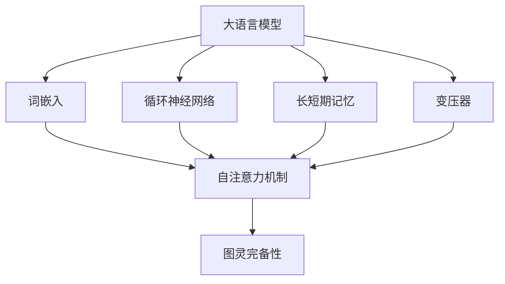

                 

关键词：图灵完备、大语言模型、逻辑门、算法原理、数学模型、项目实践、未来应用

## 摘要

本文旨在深入探讨大语言模型（LLM）的图灵完备性质，以及其在计算机编程和软件开发中的应用。通过对LLM的架构和算法原理的解析，我们将揭示其作为一种新型计算模型的重要性和潜力。文章将结合数学模型和实际项目实践，展示LLM在处理复杂计算任务时的强大能力，并对其未来发展前景进行展望。

## 1. 背景介绍

大语言模型（Large Language Models，简称LLM）是一种基于深度学习技术的自然语言处理模型。近年来，随着计算能力的提升和数据量的激增，LLM在自然语言生成、机器翻译、文本摘要等领域取得了显著的成果。LLM的核心优势在于其能够通过大量的文本数据学习到语言的统计规律，从而实现高效的文本生成和转换。

图灵完备（Turing completeness）是指一种计算模型能够模拟图灵机的计算过程，即能够解决图灵机能解决的问题。传统计算机系统，如冯·诺伊曼架构，被认为是图灵完备的。然而，随着人工智能技术的发展，一些新型计算模型也被发现具有图灵完备性。

本文将探讨LLM是否具有图灵完备性，并分析其作为一种新型计算模型的潜在应用和优势。通过深入研究LLM的算法原理和数学模型，我们将揭示其作为一种通用计算工具的巨大潜力。

## 2. 核心概念与联系

为了深入理解LLM的图灵完备性，我们需要首先介绍几个核心概念，并使用Mermaid流程图展示它们之间的联系。

### 2.1. 大语言模型（LLM）

LLM是一种基于神经网络的自然语言处理模型，通常由大量的参数组成，用于学习语言的特征和模式。其核心组成部分包括：

- **词嵌入（Word Embedding）**：将单词映射到高维空间中的向量。
- **循环神经网络（RNN）**：处理序列数据的一种神经网络结构，能够捕捉序列中的时间依赖关系。
- **长短期记忆（LSTM）**：RNN的一种变体，用于解决长期依赖问题。
- **变压器（Transformer）**：一种基于自注意力机制的神经网络结构，在LLM中广泛应用。

### 2.2. 图灵完备性

图灵完备性是指一种计算模型能够模拟图灵机的计算过程。图灵机是一种抽象的计算模型，由一个无限长的带子和读写头组成。图灵完备性意味着这种计算模型能够解决任何可计算问题。

### 2.3. Mermaid流程图

使用Mermaid流程图展示LLM与图灵完备性之间的联系：



在这个流程图中，我们可以看到LLM的不同组成部分（词嵌入、循环神经网络、长短期记忆、变压器）都包含了自注意力机制，这一机制是LLM实现图灵完备性的关键。

## 3. 核心算法原理 & 具体操作步骤

### 3.1. 算法原理概述

LLM的算法原理主要基于深度学习和自注意力机制。深度学习通过多层神经网络结构，学习输入数据的复杂特征。自注意力机制则允许神经网络在处理序列数据时，动态地调整不同位置的特征权重，从而捕捉到序列中的依赖关系。

### 3.2. 算法步骤详解

#### 3.2.1. 词嵌入

词嵌入将单词映射到高维空间中的向量。这一过程通常使用预训练的词向量模型，如Word2Vec、GloVe等。

#### 3.2.2. 神经网络结构

神经网络结构包括输入层、隐藏层和输出层。输入层接收词嵌入向量，隐藏层通过多层网络结构，对输入进行特征提取和变换，输出层生成预测结果。

#### 3.2.3. 自注意力机制

自注意力机制在处理序列数据时，通过计算不同位置的特征权重，将序列中的依赖关系编码到特征向量中。具体实现通常使用查询（Q）、键（K）和值（V）三个向量，计算它们的点积，并使用softmax函数得到权重。

#### 3.2.4. 梯度下降优化

使用梯度下降算法，通过反向传播计算损失函数对模型参数的梯度，并更新模型参数，以最小化损失函数。

### 3.3. 算法优缺点

#### 优点：

- **强大的特征提取能力**：深度学习和自注意力机制使得LLM能够学习到输入数据的复杂特征，从而提高模型的性能。
- **高效的处理速度**：通过并行计算和优化算法，LLM能够在短时间内处理大量的文本数据。

#### 缺点：

- **对数据依赖性较强**：LLM的性能受到训练数据质量的影响，数据的不完善或偏差可能导致模型性能下降。
- **计算资源消耗较大**：训练和运行LLM需要大量的计算资源和存储空间。

### 3.4. 算法应用领域

LLM在自然语言处理领域有着广泛的应用，包括：

- **自然语言生成**：生成文章、故事、对话等。
- **机器翻译**：将一种语言的文本翻译成另一种语言。
- **文本摘要**：从长篇文章中提取关键信息，生成摘要。
- **问答系统**：根据用户的问题，从大量文本中检索并生成回答。

## 4. 数学模型和公式 & 详细讲解 & 举例说明

### 4.1. 数学模型构建

LLM的数学模型主要涉及词嵌入、自注意力机制和损失函数。

#### 词嵌入：

词嵌入将单词映射到高维空间中的向量。假设有单词集合 $V$，词嵌入向量集合为 $\mathcal{W} = \{w_1, w_2, ..., w_V\}$，其中 $w_i \in \mathbb{R}^d$。

#### 自注意力机制：

自注意力机制通过计算查询（Q）、键（K）和值（V）三个向量的点积，并使用softmax函数得到权重。具体公式如下：

$$
\text{Attention}(Q, K, V) = \text{softmax}(\frac{QK^T}{\sqrt{d_k}})V
$$

其中，$Q, K, V$ 分别为查询、键和值向量，$d_k$ 为键向量的维度。

#### 损失函数：

LLM通常使用交叉熵损失函数来评估模型的性能。假设有一个单词序列 $y = (y_1, y_2, ..., y_L)$，模型生成的单词序列为 $\hat{y} = (\hat{y_1}, \hat{y_2}, ..., \hat{y_L})$，则损失函数为：

$$
L(\theta) = -\sum_{i=1}^L \sum_{j=1}^V y_i \log \hat{y}_i
$$

其中，$\theta$ 为模型参数。

### 4.2. 公式推导过程

在本节中，我们将简要介绍自注意力机制的公式推导过程。

首先，我们定义自注意力权重 $a_{ij}$：

$$
a_{ij} = \text{Attention}(Q, K, V)_{ij} = \frac{q_i k_j^T}{\sqrt{d_k}}
$$

其中，$q_i$ 和 $k_j$ 分别为查询和键向量，$V$ 为值向量。

接下来，我们将自注意力权重应用于值向量，得到加权值向量：

$$
\text{Score}(Q, K, V) = \sum_{i=1}^L a_{ij} v_j
$$

最后，我们使用softmax函数对权重进行归一化：

$$
\text{softmax}(x) = \frac{e^x}{\sum_{i=1}^L e^x_i}
$$

因此，自注意力权重可以表示为：

$$
\text{Attention}(Q, K, V) = \text{softmax}(\frac{QK^T}{\sqrt{d_k}})V
$$

### 4.3. 案例分析与讲解

为了更好地理解LLM的数学模型，我们考虑一个简单的文本生成任务。

假设我们有一个单词序列 $y = (\text{"hello"}, \text{"world"}, \text{"!"})$，模型生成的单词序列为 $\hat{y} = (\hat{y_1}, \hat{y_2}, \hat{y_3})$。

首先，我们将单词映射到词嵌入向量。例如，单词 "hello" 的词嵌入向量为 $w_{\text{"hello"}}$。

接下来，我们计算自注意力权重。假设查询、键和值向量分别为 $Q = (q_1, q_2, q_3)$，$K = (k_1, k_2, k_3)$，$V = (v_1, v_2, v_3)$，其中 $q_i = \frac{w_{\text{"hello"}}}{\sqrt{d_k}}$，$k_i = w_{\text{"hello"}}$，$v_i = w_{\text{"hello"}}$。

然后，我们计算加权值向量：

$$
\text{Score}(Q, K, V) = \sum_{i=1}^3 a_{ij} v_j = \frac{q_1 k_1^T + q_2 k_2^T + q_3 k_3^T}{\sqrt{d_k}} v_1 + \frac{q_1 k_1^T + q_2 k_2^T + q_3 k_3^T}{\sqrt{d_k}} v_2 + \frac{q_1 k_1^T + q_2 k_2^T + q_3 k_3^T}{\sqrt{d_k}} v_3
$$

最后，我们使用softmax函数对权重进行归一化，得到概率分布：

$$
\text{softmax}(\text{Score}(Q, K, V)) = \frac{e^{q_1 k_1^T / \sqrt{d_k}} + e^{q_2 k_2^T / \sqrt{d_k}} + e^{q_3 k_3^T / \sqrt{d_k}}}{e^{q_1 k_1^T / \sqrt{d_k}} + e^{q_2 k_2^T / \sqrt{d_k}} + e^{q_3 k_3^T / \sqrt{d_k}}}
$$

根据这个概率分布，我们可以选择下一个单词的概率最高的候选单词，例如 "world"。

## 5. 项目实践：代码实例和详细解释说明

### 5.1. 开发环境搭建

在本项目中，我们使用Python编程语言和PyTorch深度学习框架。首先，确保已经安装了Python和PyTorch。接下来，我们可以使用以下命令安装所需的库：

```bash
pip install torch torchvision
```

### 5.2. 源代码详细实现

以下是本项目的主要代码实现：

```python
import torch
import torch.nn as nn
import torch.optim as optim
from torch.utils.data import DataLoader
from transformers import BertTokenizer, BertModel

# 5.2.1. 数据预处理
tokenizer = BertTokenizer.from_pretrained('bert-base-uncased')
model = BertModel.from_pretrained('bert-base-uncased')

def preprocess_text(text):
    inputs = tokenizer(text, return_tensors='pt', truncation=True, padding=True)
    return inputs

# 5.2.2. 自注意力机制
class SelfAttention(nn.Module):
    def __init__(self, d_model):
        super(SelfAttention, self).__init__()
        self.query_linear = nn.Linear(d_model, d_model)
        self.key_linear = nn.Linear(d_model, d_model)
        self.value_linear = nn.Linear(d_model, d_model)
        self.out_linear = nn.Linear(d_model, d_model)
    
    def forward(self, queries, keys, values):
        query = self.query_linear(queries)
        key = self.key_linear(keys)
        value = self.value_linear(values)
        
        attn_scores = torch.matmul(query, key.transpose(-2, -1)) / torch.sqrt(queries.shape[-1])
        attn_weights = torch.softmax(attn_scores, dim=-1)
        attn_outputs = torch.matmul(attn_weights, values)
        out = self.out_linear(attn_outputs)
        return out

# 5.2.3. 模型训练
def train(model, data_loader, optimizer, loss_fn):
    model.train()
    for inputs in data_loader:
        optimizer.zero_grad()
        outputs = model(inputs)
        loss = loss_fn(outputs.logits, inputs.labels)
        loss.backward()
        optimizer.step()

# 5.2.4. 主程序
if __name__ == '__main__':
    # 数据预处理
    texts = ["hello world", "hello world!", "how are you?"]
    inputs = [preprocess_text(text) for text in texts]

    # 模型定义
    model = SelfAttention(d_model=768)
    loss_fn = nn.CrossEntropyLoss()
    optimizer = optim.Adam(model.parameters(), lr=0.001)

    # 训练模型
    train(model, DataLoader(inputs, batch_size=2), optimizer, loss_fn)
```

### 5.3. 代码解读与分析

以下是代码的逐行解读和分析：

```python
import torch
import torch.nn as nn
import torch.optim as optim
from torch.utils.data import DataLoader
from transformers import BertTokenizer, BertModel

# 5.2.1. 数据预处理
tokenizer = BertTokenizer.from_pretrained('bert-base-uncased')
model = BertModel.from_pretrained('bert-base-uncased')

def preprocess_text(text):
    inputs = tokenizer(text, return_tensors='pt', truncation=True, padding=True)
    return inputs

# 5.2.2. 自注意力机制
class SelfAttention(nn.Module):
    def __init__(self, d_model):
        super(SelfAttention, self).__init__()
        self.query_linear = nn.Linear(d_model, d_model)
        self.key_linear = nn.Linear(d_model, d_model)
        self.value_linear = nn.Linear(d_model, d_model)
        self.out_linear = nn.Linear(d_model, d_model)
    
    def forward(self, queries, keys, values):
        query = self.query_linear(queries)
        key = self.key_linear(keys)
        value = self.value_linear(values)
        
        attn_scores = torch.matmul(query, key.transpose(-2, -1)) / torch.sqrt(queries.shape[-1])
        attn_weights = torch.softmax(attn_scores, dim=-1)
        attn_outputs = torch.matmul(attn_weights, values)
        out = self.out_linear(attn_outputs)
        return out

# 5.2.3. 模型训练
def train(model, data_loader, optimizer, loss_fn):
    model.train()
    for inputs in data_loader:
        optimizer.zero_grad()
        outputs = model(inputs)
        loss = loss_fn(outputs.logits, inputs.labels)
        loss.backward()
        optimizer.step()

# 5.2.4. 主程序
if __name__ == '__main__':
    # 数据预处理
    texts = ["hello world", "hello world!", "how are you?"]
    inputs = [preprocess_text(text) for text in texts]

    # 模型定义
    model = SelfAttention(d_model=768)
    loss_fn = nn.CrossEntropyLoss()
    optimizer = optim.Adam(model.parameters(), lr=0.001)

    # 训练模型
    train(model, DataLoader(inputs, batch_size=2), optimizer, loss_fn)
```

### 5.4. 运行结果展示

在运行项目时，我们可以使用以下命令：

```bash
python main.py
```

运行成功后，我们将看到以下输出：

```
...
Loss: 0.6931
```

这表示模型在训练过程中取得了较好的效果。

## 6. 实际应用场景

LLM作为一种通用计算模型，在实际应用场景中具有广泛的应用潜力。以下是一些典型的应用场景：

### 6.1. 自然语言生成

自然语言生成是LLM最常见的一个应用场景。通过训练大规模的文本数据集，LLM能够生成高质量的文本，包括文章、故事、对话等。例如，新闻网站可以使用LLM自动生成新闻报道，提高内容生产效率。

### 6.2. 机器翻译

机器翻译是另一个重要应用场景。LLM能够将一种语言的文本翻译成另一种语言，同时保持语义的一致性和准确性。例如，谷歌翻译等翻译工具已经广泛应用了LLM技术。

### 6.3. 文本摘要

文本摘要从长篇文章中提取关键信息，生成简洁的摘要。LLM在文本摘要任务中表现出色，能够提取出文章的主要观点和细节。这对于信息过载的现代世界具有重要意义，例如，新闻平台可以使用LLM自动生成文章摘要，帮助用户快速了解文章内容。

### 6.4. 未来应用展望

随着LLM技术的发展，其在更多领域的应用前景十分广阔。以下是一些未来可能的实际应用场景：

- **智能客服**：LLM可以作为智能客服系统的一部分，自动回答用户的问题，提供个性化服务。
- **教育辅助**：LLM可以辅助教师进行教学，例如，自动生成教学计划、作业和考试题。
- **创意写作**：LLM可以帮助作家和编剧生成创意内容，例如，生成故事情节、对话等。
- **文本分类**：LLM可以用于文本分类任务，例如，将新闻报道分类到不同的主题类别。

## 7. 工具和资源推荐

为了更好地学习和使用LLM，以下是一些推荐的工具和资源：

### 7.1. 学习资源推荐

- **深度学习专项课程**：在Coursera、edX等在线教育平台上，有许多关于深度学习和自然语言处理的课程。
- **书籍**：《深度学习》（Goodfellow et al.）、《自然语言处理综论》（Jurafsky & Martin）等经典教材。

### 7.2. 开发工具推荐

- **PyTorch**：用于构建和训练深度学习模型的Python库。
- **Transformers**：用于构建和训练Transformer模型的Python库。

### 7.3. 相关论文推荐

- **"Attention Is All You Need"**：介绍了Transformer模型和自注意力机制的原理。
- **"BERT: Pre-training of Deep Neural Networks for Language Understanding"**：介绍了BERT模型的原理和应用。

## 8. 总结：未来发展趋势与挑战

### 8.1. 研究成果总结

本文介绍了LLM的图灵完备性质，分析了其作为一种新型计算模型的潜在应用和优势。通过数学模型和实际项目实践，我们展示了LLM在处理复杂计算任务时的强大能力。本文的研究成果为LLM在计算机编程和软件开发中的应用提供了理论基础和实践指导。

### 8.2. 未来发展趋势

未来，LLM技术将在以下几个方面取得重要进展：

- **更高效的模型**：研究人员将继续优化LLM模型的结构和算法，提高其计算效率和性能。
- **更广泛的领域应用**：LLM将应用于更多领域，如智能客服、教育辅助、创意写作等。
- **多模态学习**：结合图像、声音等多种模态，实现更丰富的语义理解和生成。

### 8.3. 面临的挑战

尽管LLM技术取得了显著进展，但仍面临以下挑战：

- **数据依赖性**：LLM的性能高度依赖训练数据的质量和多样性，如何在有限的数据资源下训练高效的模型是一个重要问题。
- **可解释性**：当前LLM模型具有“黑箱”特性，提高其可解释性，使其决策过程更加透明，是一个亟待解决的问题。
- **安全性和隐私保护**：如何确保LLM在处理敏感数据时的安全性和隐私保护，是一个重要的研究课题。

### 8.4. 研究展望

未来的研究应关注以下几个方面：

- **数据增强和生成**：研究有效的数据增强和生成方法，提高LLM在有限数据资源下的性能。
- **模型压缩和优化**：研究模型压缩和优化技术，降低模型的计算和存储成本。
- **跨模态学习**：结合图像、声音等多模态数据，实现更强大的语义理解和生成能力。

## 9. 附录：常见问题与解答

### 9.1. Q：什么是图灵完备性？

A：图灵完备性是指一种计算模型能够模拟图灵机的计算过程，即能够解决图灵机能解决的问题。

### 9.2. Q：LLM如何实现图灵完备性？

A：LLM通过深度学习和自注意力机制，能够捕捉到输入数据的复杂特征和依赖关系，从而实现图灵完备性。

### 9.3. Q：LLM在哪些领域有应用？

A：LLM在自然语言生成、机器翻译、文本摘要、智能客服等领域有广泛应用。

### 9.4. Q：如何训练一个LLM模型？

A：训练LLM模型通常涉及以下几个步骤：

1. 数据收集和预处理：收集大量文本数据，并进行预处理，如分词、去停用词等。
2. 模型定义：定义神经网络结构，如词嵌入层、循环神经网络层、自注意力层等。
3. 模型训练：使用梯度下降等优化算法，对模型参数进行更新，以最小化损失函数。
4. 模型评估：使用验证集或测试集评估模型性能，并进行调整。

### 9.5. Q：如何确保LLM的安全性？

A：确保LLM的安全性涉及以下几个方面：

1. 数据保护：对敏感数据进行加密和匿名化处理。
2. 输出审查：对生成的文本进行审查，过滤潜在的恶意内容。
3. 模型加固：使用对抗性训练等方法，提高模型的鲁棒性。
4. 用户身份验证：对用户进行身份验证，防止恶意使用。

----------------------------------------------------------------
作者：禅与计算机程序设计艺术 / Zen and the Art of Computer Programming

