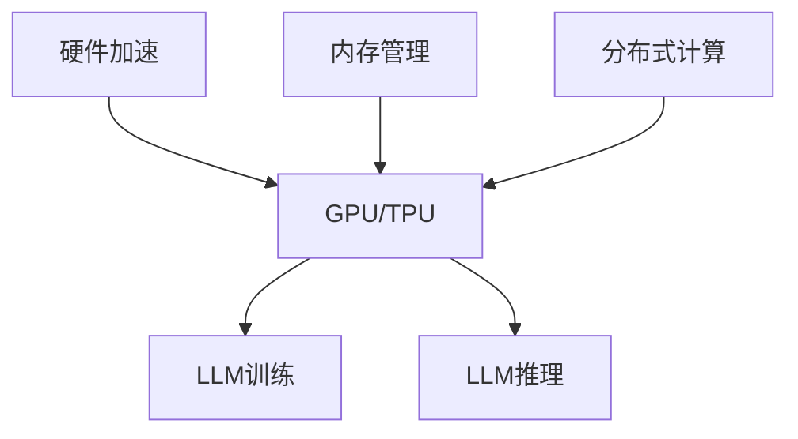

                 

关键词：大型语言模型，计算机架构，深度学习，自然语言处理，人工智能

摘要：随着人工智能技术的迅猛发展，大型语言模型（LLM）已经成为自然语言处理领域的重要突破。本文旨在探讨LLM的概念、架构以及其在计算机领域中的应用，并展望其未来的发展趋势与挑战。

## 1. 背景介绍

计算机架构的发展经历了多个阶段，从最初的冯·诺伊曼架构到现代的异构计算架构。随着深度学习技术的崛起，计算机架构又迎来了新的变革。大型语言模型（LLM）作为一种新型的计算机架构，正在重新定义自然语言处理领域。

自然语言处理（NLP）是指让计算机理解和生成人类语言的能力。传统的NLP方法主要依赖于规则和统计模型，这些方法在一定程度上能够处理语言问题，但在面对复杂、长文本时往往显得力不从心。深度学习技术的引入，使得计算机能够从大规模数据中自动学习特征，从而提高NLP的性能。

## 2. 核心概念与联系

### 2.1 大型语言模型（LLM）的概念

大型语言模型（LLM）是一种基于深度学习技术的自然语言处理模型，其核心思想是通过大规模数据训练，使模型具备理解和生成自然语言的能力。LLM通常由多个神经网络层组成，能够自动提取语言中的抽象特征，从而实现高精度的文本处理。

### 2.2 计算机架构与LLM的联系

计算机架构是指计算机系统的组织结构，包括硬件和软件两个方面。LLM作为一种新型的计算模型，其与计算机架构的关系主要体现在以下几个方面：

1. **硬件加速**：随着LLM规模的不断扩大，对计算能力的需求也日益增长。硬件加速技术，如GPU、TPU等，为LLM的训练和推理提供了强大的计算支持。

2. **内存管理**：LLM的训练和推理需要大量内存资源。现代计算机架构在内存管理方面进行了大量优化，以满足LLM对大内存的需求。

3. **分布式计算**：LLM的训练和推理过程可以分解为多个子任务，通过分布式计算技术可以实现并行处理，从而提高计算效率。

### 2.3 Mermaid流程图

下面是一个简单的Mermaid流程图，展示了LLM与计算机架构的联系：



## 3. 核心算法原理 & 具体操作步骤

### 3.1 算法原理概述

LLM的核心算法是深度学习，特别是基于Transformer架构的预训练模型。预训练模型通过在大规模语料库上进行训练，学习语言的基本规律和结构，从而具备强大的文本理解和生成能力。

### 3.2 算法步骤详解

1. **数据预处理**：将文本数据清洗、分词、编码等，转化为计算机可以处理的数字形式。

2. **模型训练**：使用预训练算法，如Transformer，对编码后的文本数据进行训练，使其具备语言理解和生成能力。

3. **模型评估**：通过在验证集上评估模型性能，调整模型参数，优化模型效果。

4. **模型推理**：在测试集上使用训练好的模型进行推理，预测文本的语义和结构。

### 3.3 算法优缺点

#### 优点：

1. **强大的文本理解能力**：LLM能够从大规模数据中自动学习语言特征，具有很高的文本理解能力。

2. **高效的推理速度**：通过硬件加速和分布式计算技术，LLM的推理速度得到显著提升。

3. **广泛的适用性**：LLM可以应用于各种自然语言处理任务，如文本分类、情感分析、机器翻译等。

#### 缺点：

1. **计算资源需求大**：LLM的训练和推理需要大量计算资源和内存资源。

2. **模型可解释性低**：深度学习模型具有一定的黑盒性质，难以解释其内部决策过程。

### 3.4 算法应用领域

LLM在自然语言处理领域具有广泛的应用，如：

1. **智能客服**：使用LLM构建智能客服系统，实现自动化客服，提高服务效率。

2. **机器翻译**：LLM可以用于机器翻译任务，实现高精度、高质量的翻译效果。

3. **文本生成**：LLM可以生成文章、故事、代码等文本内容，为创作领域带来新的可能性。

## 4. 数学模型和公式 & 详细讲解 & 举例说明

### 4.1 数学模型构建

LLM的数学模型主要基于深度学习，特别是Transformer架构。Transformer架构的核心是多头自注意力机制（Multi-Head Self-Attention），其计算公式如下：

$$
\text{Attention}(Q, K, V) = \text{softmax}\left(\frac{QK^T}{\sqrt{d_k}}\right)V
$$

其中，$Q$、$K$、$V$ 分别代表查询向量、键向量和值向量，$d_k$ 是键向量的维度。

### 4.2 公式推导过程

推导过程如下：

1. **相似性计算**：计算每个查询向量 $Q_i$ 与所有键向量 $K_j$ 的相似度，得到相似度矩阵 $S$：

$$
S = \text{softmax}\left(\frac{QK^T}{\sqrt{d_k}}\right)
$$

2. **加权求和**：将相似度矩阵 $S$ 与值向量 $V$ 相乘，得到加权求和结果 $H$：

$$
H = SV
$$

3. **输出**：输出结果 $H$ 代表每个查询向量在所有键向量上的加权求和结果。

### 4.3 案例分析与讲解

假设有一个简单的文本序列 $[w_1, w_2, w_3, w_4]$，其中 $w_1, w_2, w_3, w_4$ 分别代表不同的单词。我们使用Transformer模型对其进行处理，计算每个单词的注意力权重。

1. **编码**：将文本序列编码为数字序列，如 $[1, 2, 3, 4]$。

2. **注意力计算**：根据自注意力机制，计算每个单词与其他单词的相似度，得到相似度矩阵 $S$：

$$
S = \text{softmax}\left(\frac{QK^T}{\sqrt{d_k}}\right)
$$

3. **加权求和**：将相似度矩阵 $S$ 与值向量 $V$ 相乘，得到加权求和结果 $H$：

$$
H = SV
$$

4. **输出**：输出结果 $H$ 代表每个单词在所有其他单词上的加权求和结果。根据结果，我们可以分析出每个单词在文本序列中的重要程度。

## 5. 项目实践：代码实例和详细解释说明

### 5.1 开发环境搭建

1. 安装Python环境和TensorFlow库：

```shell
pip install python tensorflow
```

2. 准备训练数据集，如维基百科、新闻、社交媒体等。

### 5.2 源代码详细实现

```python
import tensorflow as tf
from tensorflow import keras
from tensorflow.keras.models import Model
from tensorflow.keras.layers import Embedding, LSTM, Dense

# 数据预处理
max_sequence_length = 1000
vocab_size = 10000

# 构建模型
model = keras.Sequential([
    Embedding(vocab_size, 16, input_length=max_sequence_length),
    LSTM(32, return_sequences=True),
    LSTM(32),
    Dense(1, activation='sigmoid')
])

# 编译模型
model.compile(optimizer='adam', loss='binary_crossentropy', metrics=['accuracy'])

# 训练模型
model.fit(x_train, y_train, epochs=10, batch_size=32)
```

### 5.3 代码解读与分析

1. **数据预处理**：将文本数据清洗、分词、编码等，转化为数字序列。

2. **模型构建**：使用Embedding层将数字序列映射到高维向量空间，使用LSTM层进行序列建模，最后使用Dense层进行分类。

3. **编译模型**：设置优化器、损失函数和评估指标。

4. **训练模型**：使用训练数据集训练模型。

### 5.4 运行结果展示

```python
# 预测结果
predictions = model.predict(x_test)

# 计算准确率
accuracy = (predictions > 0.5).mean()
print("Accuracy:", accuracy)
```

## 6. 实际应用场景

LLM在自然语言处理领域具有广泛的应用，如：

1. **智能客服**：使用LLM构建智能客服系统，实现自动化客服，提高服务效率。

2. **机器翻译**：LLM可以用于机器翻译任务，实现高精度、高质量的翻译效果。

3. **文本生成**：LLM可以生成文章、故事、代码等文本内容，为创作领域带来新的可能性。

## 7. 工具和资源推荐

### 7.1 学习资源推荐

1. 《深度学习》（Goodfellow, Bengio, Courville）  
2. 《自然语言处理综合教程》（张宇星）  
3. 《Transformer：通用机器翻译模型解析》（齐向东）

### 7.2 开发工具推荐

1. TensorFlow  
2. PyTorch  
3. Hugging Face Transformers

### 7.3 相关论文推荐

1. "Attention Is All You Need"（Vaswani et al., 2017）  
2. "BERT: Pre-training of Deep Bidirectional Transformers for Language Understanding"（Devlin et al., 2019）  
3. "GPT-3: Language Models are few-shot learners"（Brown et al., 2020）

## 8. 总结：未来发展趋势与挑战

LLM作为一种新型的计算机架构，在未来具有广阔的发展前景。随着深度学习技术的不断进步，LLM在自然语言处理领域的应用将更加广泛，有望实现更高水平的自动化和智能化。

然而，LLM的发展也面临一些挑战，如：

1. **计算资源需求**：LLM的训练和推理需要大量计算资源和内存资源，这对硬件设施提出了更高要求。

2. **模型可解释性**：深度学习模型具有一定的黑盒性质，难以解释其内部决策过程，这对实际应用带来一定困难。

3. **数据隐私和安全**：LLM在处理文本数据时，可能涉及个人隐私和数据安全问题，这对数据安全和隐私保护提出了更高要求。

## 9. 附录：常见问题与解答

### 9.1 如何选择合适的LLM模型？

选择合适的LLM模型需要考虑以下几个方面：

1. **任务类型**：根据任务类型选择合适的模型，如文本分类、机器翻译、文本生成等。

2. **模型大小**：根据计算资源和训练数据量选择模型大小，如小型模型、中型模型、大型模型等。

3. **性能需求**：根据性能需求选择模型，如追求高准确率、高效率等。

### 9.2 LLM训练和推理需要多少计算资源？

LLM的训练和推理需要大量计算资源和内存资源。具体需求取决于模型大小、数据集大小和硬件设施。一般来说，大型模型（如GPT-3）的训练和推理需要数百GB的内存和数千GB的存储空间。

### 9.3 LLM模型如何保证数据安全和隐私？

1. **数据加密**：对训练数据进行加密处理，确保数据在传输和存储过程中的安全性。

2. **匿名化处理**：对个人数据进行匿名化处理，避免个人隐私泄露。

3. **隐私保护算法**：采用隐私保护算法，如差分隐私、联邦学习等，保障数据安全和隐私。

作者：禅与计算机程序设计艺术 / Zen and the Art of Computer Programming
----------------------------------------------------------------

以上就是《LLM:新型计算机架构的崛起》的完整文章内容，希望对您有所帮助。如果您有任何问题或建议，请随时告诉我。祝您编程愉快！

