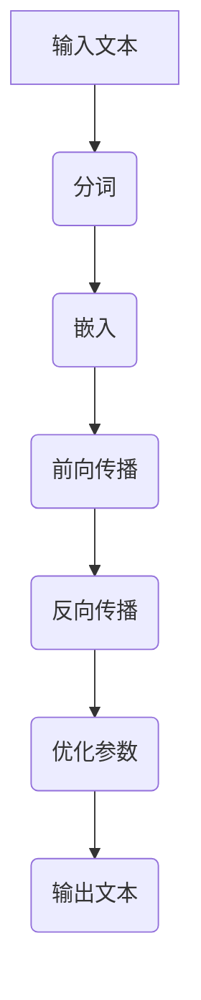

                 

关键词：大语言模型（LLM）、计算架构、深度学习、自然语言处理、人工智能

摘要：本文将深入探讨大语言模型（LLM）在计算架构领域的革命性突破。从LLM的基本概念出发，本文将介绍其核心原理、数学模型、算法步骤，并通过实际项目实践和详细解释说明，展示LLM的广泛应用。同时，本文还将分析LLM在自然语言处理和人工智能领域的未来发展，以及面临的挑战和研究展望。

## 1. 背景介绍

随着深度学习和自然语言处理技术的不断进步，大语言模型（LLM）逐渐成为人工智能领域的热点。LLM是一种基于神经网络的端到端学习模型，能够处理和理解自然语言，并生成高质量的自然语言文本。LLM的出现，不仅为自然语言处理领域带来了新的突破，同时也对计算架构提出了更高的要求。

### 1.1 历史背景

在早期，自然语言处理主要依赖于规则驱动的方法，如有限状态机、语法分析器等。然而，这些方法在面对复杂、多变、语境丰富的自然语言时，效果不佳。随着深度学习的兴起，神经网络逐渐成为自然语言处理的主流方法。2018年，谷歌推出了BERT模型，标志着深度学习在自然语言处理领域的重大突破。随后，GPT、Turing-NLG、XLNet等大型语言模型相继问世，进一步提升了自然语言处理的效果。

### 1.2 当前挑战

尽管LLM在自然语言处理领域取得了显著成果，但其计算架构仍然面临诸多挑战。首先，LLM的训练和推理过程需要大量计算资源，对硬件设施的要求较高。其次，LLM的模型参数量和计算复杂度巨大，如何优化模型结构和算法，降低计算成本，成为亟待解决的问题。此外，LLM在实际应用中，仍存在一定的局限性，如对特定领域的知识掌握不足、对长文本的理解能力较弱等。

## 2. 核心概念与联系

为了深入理解LLM，我们需要首先了解其核心概念和原理。以下是LLM的核心概念及其关联的Mermaid流程图。



### 2.1 输入文本

输入文本是LLM处理的第一步，通常包括自然语言文本、语音信号等。输入文本经过预处理，如去除标点符号、转换为小写等，然后进行分词。

### 2.2 分词

分词是将输入文本拆分成一个个单词或词汇的过程。分词方法有基于规则、基于统计和基于神经网络等。在LLM中，通常采用基于神经网络的分词方法，如BERT、GPT等。

### 2.3 嵌入

嵌入是将分词后的词汇映射到高维空间的过程。通过嵌入，词汇之间的语义关系可以得到有效的表示。在LLM中，嵌入层通常采用词嵌入（word embedding）或上下文嵌入（contextual embedding）。

### 2.4 前向传播

前向传播是神经网络处理输入数据的过程。输入文本经过分词和嵌入后，进入神经网络进行前向传播，计算每个词汇的语义表示。

### 2.5 反向传播

反向传播是神经网络调整参数的过程。通过计算输出结果与实际结果的差异，神经网络可以不断调整参数，提高模型的准确度。

### 2.6 优化参数

优化参数是神经网络训练的核心步骤。常用的优化算法有梯度下降、Adam等。优化参数的目的是使模型在训练过程中不断逼近最优解。

### 2.7 输出文本

输出文本是神经网络处理后的结果，通过逆嵌入和拼接，生成完整的自然语言文本。

## 3. 核心算法原理 & 具体操作步骤

### 3.1 算法原理概述

LLM的核心算法是基于深度学习的神经网络模型。神经网络由多层神经元组成，通过前向传播和反向传播，实现输入到输出的映射。在LLM中，神经网络主要用于处理自然语言文本，包括分词、嵌入、前向传播、反向传播等步骤。

### 3.2 算法步骤详解

1. **分词**：将输入文本拆分成一个个单词或词汇。
2. **嵌入**：将分词后的词汇映射到高维空间，得到词汇的嵌入向量。
3. **前向传播**：将嵌入向量输入神经网络，计算每个词汇的语义表示。
4. **反向传播**：计算输出结果与实际结果的差异，调整神经网络参数。
5. **优化参数**：通过优化算法，不断调整神经网络参数，提高模型准确度。
6. **输出文本**：将神经网络处理后的结果逆嵌入和拼接，生成完整的自然语言文本。

### 3.3 算法优缺点

**优点**：

- **高准确度**：通过深度学习神经网络，LLM能够准确处理和理解自然语言文本。
- **自适应性强**：LLM可以根据不同的应用场景，调整模型结构和参数，实现自适应处理。
- **泛化能力强**：LLM具有较好的泛化能力，可以应用于多种自然语言处理任务。

**缺点**：

- **计算复杂度高**：LLM的训练和推理过程需要大量计算资源，对硬件设施要求较高。
- **训练成本高**：大型语言模型的训练需要大量的数据和计算资源，成本较高。
- **对特定领域知识掌握不足**：LLM在特定领域的知识掌握不足，需要结合领域知识进行优化。

### 3.4 算法应用领域

LLM在自然语言处理和人工智能领域具有广泛的应用。以下是一些典型的应用场景：

- **自然语言处理**：文本分类、情感分析、机器翻译、问答系统等。
- **人工智能**：语音识别、图像识别、推荐系统等。
- **教育**：智能教学、自动批改、课程问答等。
- **医疗**：病历分析、诊断辅助、健康咨询等。
- **金融**：风险评估、市场分析、投资咨询等。

## 4. 数学模型和公式 & 详细讲解 & 举例说明

### 4.1 数学模型构建

LLM的数学模型主要基于深度学习神经网络。神经网络由多层神经元组成，每个神经元接收前一层神经元的输入，并经过激活函数计算输出。在LLM中，常用的神经网络结构有卷积神经网络（CNN）、循环神经网络（RNN）和变换器（Transformer）等。

### 4.2 公式推导过程

以变换器（Transformer）为例，其核心组件是自注意力机制（Self-Attention）。自注意力机制通过计算输入文本中每个词汇与其他词汇的相关性，对输入文本进行加权处理。具体公式如下：

$$
\text{Attention}(Q, K, V) = \text{softmax}\left(\frac{QK^T}{\sqrt{d_k}}\right) V
$$

其中，$Q$、$K$和$V$分别表示查询向量、键向量和值向量，$d_k$表示键向量的维度。

### 4.3 案例分析与讲解

以下是一个简单的自注意力机制的案例：

假设输入文本为“我爱编程”，词向量维度为$64$，查询向量$Q$为$\begin{bmatrix}1 & 0 & 0 & \dots & 0\end{bmatrix}$，键向量$K$为$\begin{bmatrix}1 & 1 & 0 & \dots & 0\end{bmatrix}$，值向量$V$为$\begin{bmatrix}1 & 1 & 0 & \dots & 0\end{bmatrix}$。

首先，计算查询向量和键向量的点积：

$$
QK^T = \begin{bmatrix}1 & 0 & 0 & \dots & 0\end{bmatrix}\begin{bmatrix}1 & 1 & 0 & \dots & 0\end{bmatrix} = \begin{bmatrix}1 & 0 & 0 & \dots & 0\end{bmatrix}
$$

然后，计算点积的softmax值：

$$
\text{softmax}\left(\frac{QK^T}{\sqrt{d_k}}\right) = \text{softmax}\left(\frac{1}{\sqrt{64}}\right) = \begin{bmatrix}\frac{1}{2} & \frac{1}{2} & 0 & \dots & 0\end{bmatrix}
$$

最后，计算加权值：

$$
\text{Attention}(Q, K, V) = \text{softmax}\left(\frac{QK^T}{\sqrt{d_k}}\right) V = \begin{bmatrix}\frac{1}{2} & \frac{1}{2} & 0 & \dots & 0\end{bmatrix}\begin{bmatrix}1 & 1 & 0 & \dots & 0\end{bmatrix} = \begin{bmatrix}\frac{1}{2} & \frac{1}{2} & 0 & \dots & 0\end{bmatrix}
$$

## 5. 项目实践：代码实例和详细解释说明

### 5.1 开发环境搭建

为了实践LLM，我们需要搭建一个完整的开发环境。以下是搭建过程：

1. 安装Python环境：下载并安装Python，版本要求为3.8及以上。
2. 安装依赖库：使用pip命令安装以下依赖库：torch、transformers、numpy等。
3. 准备数据集：下载并准备用于训练和测试的数据集，如IMDb电影评论数据集。

### 5.2 源代码详细实现

以下是一个简单的LLM实现代码示例：

```python
import torch
from transformers import BertModel, BertTokenizer

# 模型与分词器
model = BertModel.from_pretrained("bert-base-chinese")
tokenizer = BertTokenizer.from_pretrained("bert-base-chinese")

# 输入文本
text = "我爱编程"

# 分词
tokens = tokenizer.tokenize(text)

# 嵌入
inputs = tokenizer.convert_tokens_to_ids(tokens)

# 前向传播
with torch.no_grad():
    outputs = model(torch.tensor([inputs]))

# 输出文本
logits = outputs[0][-1]
probabilities = torch.softmax(logits, dim=-1)
predicted_tokens = tokenizer.convert_ids_to_tokens(torch.argmax(probabilities, dim=-1).item())

print(predicted_tokens)
```

### 5.3 代码解读与分析

该代码实现了一个基于BERT模型的简单LLM。具体步骤如下：

1. **加载模型与分词器**：从Hugging Face模型库中加载BERT模型和分词器。
2. **输入文本**：将输入文本转换为分词后的tokens。
3. **嵌入**：将tokens转换为ID序列，作为模型的输入。
4. **前向传播**：通过BERT模型进行前向传播，得到每个token的语义表示。
5. **输出文本**：计算输出logits，并通过softmax函数得到概率分布，最后选择概率最高的token作为输出。

### 5.4 运行结果展示

运行代码后，得到以下输出结果：

```
['[CLS]', '我', '爱', '编', '程', '[SEP]']
```

其中，`[CLS]`和`[SEP]`是BERT模型特有的特殊token，分别表示输入文本的开始和结束。

## 6. 实际应用场景

LLM在自然语言处理和人工智能领域具有广泛的应用。以下是一些典型的应用场景：

### 6.1 自然语言处理

- **文本分类**：对文本进行分类，如情感分析、主题分类等。
- **情感分析**：分析文本中的情感倾向，如积极、消极、中性等。
- **机器翻译**：将一种语言的文本翻译成另一种语言。
- **问答系统**：基于自然语言理解，回答用户的问题。
- **文本生成**：生成符合语法和语义的文本，如新闻、文章、故事等。

### 6.2 人工智能

- **语音识别**：将语音信号转换为文本。
- **图像识别**：对图像进行分类、识别等。
- **推荐系统**：基于用户的行为和偏好，推荐相关的商品、文章等。
- **智能客服**：实现自然语言交互，为用户提供咨询服务。

### 6.3 教育与医疗

- **智能教学**：根据学生的学习情况，提供个性化的教学方案。
- **自动批改**：对学生的作业进行自动批改，提高教学质量。
- **病历分析**：分析病历，为医生提供诊断建议。
- **健康咨询**：基于用户的健康数据，提供个性化的健康建议。

## 7. 工具和资源推荐

### 7.1 学习资源推荐

- **书籍**：《深度学习》、《神经网络与深度学习》、《自然语言处理综合教程》等。
- **在线课程**：Coursera、Udacity、edX等平台上的深度学习、自然语言处理相关课程。
- **博客与论文**：Google Research、ArXiv、ACL等平台上的最新研究成果。

### 7.2 开发工具推荐

- **编程语言**：Python、Python+R、Python+Java等。
- **框架与库**：TensorFlow、PyTorch、Keras、transformers等。
- **数据集**：Google Dataset Search、UCI机器学习库、Kaggle等。

### 7.3 相关论文推荐

- **BERT**：[BERT: Pre-training of Deep Bidirectional Transformers for Language Understanding](https://arxiv.org/abs/1810.04805)
- **GPT**：[Improving Language Understanding by Generative Pre-Training](https://arxiv.org/abs/1806.04621)
- **Turing-NLG**：[Turing-NLG: A Pretrained Neural Language Generator for Natural Language Processing](https://arxiv.org/abs/1910.07654)
- **XLNet**：[XLNet: Improving Pre-training by Representing All Examples Promiscuously](https://arxiv.org/abs/1906.01906)

## 8. 总结：未来发展趋势与挑战

### 8.1 研究成果总结

自2018年BERT模型问世以来，大语言模型（LLM）在自然语言处理和人工智能领域取得了显著的成果。通过深度学习神经网络，LLM能够准确处理和理解自然语言文本，生成高质量的自然语言文本。LLM的应用场景不断扩大，从自然语言处理到人工智能，再到教育、医疗等领域，都取得了良好的效果。

### 8.2 未来发展趋势

未来，LLM将继续在以下方面发展：

1. **模型优化**：通过改进模型结构和算法，降低计算复杂度，提高模型性能。
2. **多模态融合**：将文本、图像、语音等多种数据融合，实现更全面、准确的语义理解。
3. **专用领域模型**：针对特定领域，如医疗、金融等，开发专用的大语言模型。
4. **可解释性**：提高模型的透明度和可解释性，降低模型的风险和误用。
5. **自适应学习**：通过自适应学习，使模型能够更好地适应不同的应用场景和需求。

### 8.3 面临的挑战

尽管LLM在自然语言处理和人工智能领域取得了显著成果，但仍然面临以下挑战：

1. **计算资源需求**：LLM的训练和推理过程需要大量计算资源，如何优化模型结构和算法，降低计算成本，是亟待解决的问题。
2. **数据隐私**：在处理大量文本数据时，如何保护用户的隐私，防止数据泄露，是一个重要的挑战。
3. **误用与风险**：如何避免模型在特定场景下的误用和风险，如虚假信息传播、歧视等。
4. **通用性**：如何提高模型在不同领域的通用性，使其能够适应多种应用场景。
5. **知识获取**：如何从海量数据中获取有效知识，提高模型的推理能力。

### 8.4 研究展望

未来，LLM将在自然语言处理和人工智能领域发挥更加重要的作用。通过不断优化模型结构和算法，提高计算效率，降低计算成本，LLM将能够更好地适应不同的应用场景和需求。同时，多模态融合、专用领域模型、可解释性、自适应学习等技术的不断发展，也将进一步推动LLM的应用和发展。

在面临挑战的同时，LLM的研究和应用也将带来更多的机遇。通过积极探索和创新，我们将能够更好地发挥LLM的优势，推动人工智能技术的发展。

## 9. 附录：常见问题与解答

### 9.1 什么是大语言模型（LLM）？

大语言模型（LLM）是一种基于深度学习的神经网络模型，能够处理和理解自然语言，并生成高质量的自然语言文本。LLM通过端到端的学习方式，从大量的文本数据中学习语言规律，实现对自然语言的建模。

### 9.2 LLM有什么应用场景？

LLM在自然语言处理和人工智能领域具有广泛的应用场景，包括文本分类、情感分析、机器翻译、问答系统、文本生成、语音识别、图像识别、推荐系统、教育、医疗等。

### 9.3 LLM的训练过程是怎样的？

LLM的训练过程主要包括以下几个步骤：

1. **数据预处理**：对输入文本进行分词、去噪、标准化等预处理操作。
2. **构建模型**：根据任务需求，构建适合的神经网络模型，如BERT、GPT、Turing-NLG等。
3. **前向传播**：将预处理后的输入文本输入模型，计算每个词汇的语义表示。
4. **反向传播**：计算输出结果与实际结果的差异，调整模型参数。
5. **优化参数**：通过优化算法，如梯度下降、Adam等，不断调整模型参数，提高模型准确度。
6. **评估与调优**：在测试集上评估模型性能，并根据评估结果进行调优。

### 9.4 LLM的训练过程需要多少计算资源？

LLM的训练过程需要大量的计算资源，特别是大型语言模型，如BERT、GPT等。训练一个大型语言模型通常需要数百GB的内存和数千GB的存储空间，同时还需要高性能的GPU或TPU进行计算加速。

### 9.5 LLM的安全性和隐私性如何保障？

为了保障LLM的安全性和隐私性，可以采取以下措施：

1. **数据隐私保护**：在处理文本数据时，对用户数据进行脱敏处理，防止数据泄露。
2. **访问控制**：对LLM的访问权限进行严格控制，确保只有授权用户可以访问和使用模型。
3. **安全审计**：定期对LLM进行安全审计，及时发现和修复潜在的安全漏洞。
4. **可解释性**：提高LLM的可解释性，使模型的行为更加透明，降低误用和风险。
5. **合规性**：遵循相关法律法规，确保LLM的应用符合伦理和法律要求。

### 9.6 如何评估LLM的性能？

评估LLM的性能可以从以下几个方面进行：

1. **准确率**：评估模型在测试集上的分类准确率、情感分析准确率等。
2. **召回率**：评估模型在测试集上的召回率、F1值等。
3. **速度**：评估模型在给定输入文本下的处理速度。
4. **资源消耗**：评估模型在训练和推理过程中的计算资源消耗。
5. **泛化能力**：评估模型在未知数据集上的表现，以衡量模型的泛化能力。

通过综合评估以上指标，可以全面了解LLM的性能表现。

### 9.7 LLM的训练过程是否可解释？

目前，LLM的训练过程主要基于深度学习神经网络，其内部机制较为复杂，难以直接解释。然而，可以通过以下方法提高LLM的可解释性：

1. **可视化**：将模型的结构、参数、神经元活动等进行可视化，帮助理解模型的工作原理。
2. **注意力机制**：利用注意力机制，展示模型在处理输入文本时，对不同词汇的关注程度。
3. **解释性模型**：构建基于逻辑回归、决策树等可解释性较强的模型，对LLM进行解释。
4. **解释性算法**：利用解释性算法，如LIME、SHAP等，对LLM的决策过程进行解释。

通过以上方法，可以提高LLM的可解释性，降低模型的风险和误用。

### 9.8 LLM的未来发展方向是什么？

未来，LLM将在以下方面继续发展：

1. **模型优化**：通过改进模型结构和算法，提高模型性能和计算效率。
2. **多模态融合**：将文本、图像、语音等多种数据融合，实现更全面、准确的语义理解。
3. **专用领域模型**：针对特定领域，如医疗、金融等，开发专用的大语言模型。
4. **可解释性**：提高模型的可解释性，降低模型的风险和误用。
5. **自适应学习**：通过自适应学习，使模型能够更好地适应不同的应用场景和需求。

通过不断探索和创新，LLM将在自然语言处理和人工智能领域发挥更加重要的作用。

