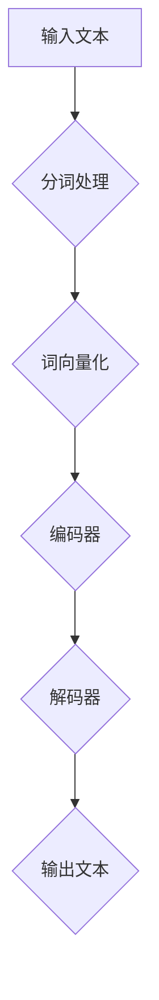

                 

关键词：大语言模型、上下文理解、认知能力、算法优化、应用场景、未来展望

## 摘要

本文将探讨大语言模型在上下文理解方面的突破，以及这种突破如何大幅提升认知能力。通过对大语言模型核心概念和架构的深入分析，我们将揭示其工作原理和具体操作步骤。接着，我们将介绍数学模型和公式，并通过实际项目实践展示如何将理论应用到实际开发中。最后，我们将探讨大语言模型在实际应用场景中的表现，并对未来发展趋势和挑战进行展望。

## 1. 背景介绍

随着人工智能技术的飞速发展，大语言模型（Large Language Models，简称LLM）逐渐成为研究和应用的热点。LLM具有强大的上下文理解能力，可以处理复杂的自然语言任务，如图像识别、文本生成、机器翻译等。然而，传统的语言模型在处理长文本和复杂场景时往往表现不佳，因此，如何提升LLM的上下文理解能力成为当前研究的重要方向。

提升LLM的上下文理解能力具有重要意义。一方面，这有助于提高机器在复杂场景下的任务执行能力；另一方面，也有助于人类更好地利用人工智能技术，解决实际问题。本文将从核心概念、算法原理、数学模型、项目实践等方面，深入探讨LLM上下文突破及其对认知能力的提升。

## 2. 核心概念与联系

### 2.1 语言模型

语言模型是一种概率模型，用于预测自然语言序列中下一个词的概率。常见的语言模型有n元语法模型、神经网络模型等。n元语法模型通过统计历史上出现过的n个词序列来预测下一个词，而神经网络模型则通过深度学习技术，从大量数据中学习语言特征，从而预测下一个词。

### 2.2 大语言模型

大语言模型（Large Language Models）是一种基于神经网络的语言模型，其特点是参数规模巨大、训练数据丰富。大语言模型通过学习海量文本数据，可以自动获取语言的深层结构，从而在许多自然语言处理任务中取得优异表现。例如，BERT、GPT等模型都是大语言模型的代表。

### 2.3 上下文理解

上下文理解是指语言模型在处理自然语言任务时，对输入文本的语义和语境进行准确理解的能力。上下文理解能力对于实现复杂自然语言处理任务至关重要，如问答系统、机器翻译、文本生成等。提升上下文理解能力，意味着提高机器在自然语言处理任务中的表现。

### 2.4 Mermaid 流程图

下面是一个简单的Mermaid流程图，用于展示大语言模型的工作流程。



## 3. 核心算法原理 & 具体操作步骤

### 3.1 算法原理概述

大语言模型的核心算法是基于自注意力机制（Self-Attention）和变分自编码器（Variational Autoencoder，VAE）。自注意力机制允许模型在处理每个词时，动态地关注其他词的信息，从而提高上下文理解能力。VAE则用于生成新的文本序列，从而扩大模型的预测能力。

### 3.2 算法步骤详解

1. **分词处理**：将输入文本分割成单词或字符序列。
2. **词向量化**：将分词结果映射到高维向量空间，用于后续处理。
3. **编码器**：通过自注意力机制，将词向量化后的序列编码成一个固定长度的向量。
4. **解码器**：从编码器的输出中解码出新的词序列，生成输出文本。

### 3.3 算法优缺点

**优点**：

- **强大的上下文理解能力**：自注意力机制使得模型可以动态地关注上下文信息，从而提高上下文理解能力。
- **生成能力强大**：VAE的引入使得模型具有生成能力，可以生成新的文本序列。

**缺点**：

- **计算复杂度高**：自注意力机制的计算复杂度较高，导致模型训练和推理速度较慢。
- **对数据依赖性大**：模型性能对训练数据的质量和数量有较高要求，否则容易过拟合。

### 3.4 算法应用领域

大语言模型在自然语言处理领域有广泛的应用，如：

- **机器翻译**：利用模型在源语言和目标语言之间的上下文信息，实现高效准确的翻译。
- **文本生成**：根据输入的提示或上下文，生成新的文本内容。
- **问答系统**：利用模型对输入问题进行理解和回答。

## 4. 数学模型和公式 & 详细讲解 & 举例说明

### 4.1 数学模型构建

大语言模型的核心数学模型主要包括词向量化、编码器、解码器等部分。

- **词向量化**：将单词映射到高维向量空间，通常使用嵌入矩阵$E \in \mathbb{R}^{d \times |V|}$表示，其中$d$是向量的维度，$|V|$是词汇表大小。
- **编码器**：将输入的词向量序列编码成一个固定长度的向量$c \in \mathbb{R}^{1 \times d}$，通常使用自注意力机制进行编码。
- **解码器**：从编码器的输出$c$中解码出新的词序列，通常也使用自注意力机制进行解码。

### 4.2 公式推导过程

下面是编码器和解码器的推导过程。

#### 编码器

1. **词向量化**：
   $$ x_i = E \cdot [w_1, w_2, \ldots, w_n] $$
   其中，$w_1, w_2, \ldots, w_n$是输入的词序列，$x_i$是词向量化后的结果。

2. **自注意力**：
   $$ s_i = \frac{e^{QK_iV_i}}{\sum_{j=1}^{n} e^{QK_jV_j}} $$
   其中，$Q, K, V$分别是查询、键、值向量，$s_i$是自注意力分数。

3. **编码结果**：
   $$ c = \sum_{i=1}^{n} s_i x_i $$

#### 解码器

1. **自注意力**：
   $$ s_i = \frac{e^{QK_iV_i}}{\sum_{j=1}^{n} e^{QK_jV_j}} $$

2. **解码结果**：
   $$ y_i = \sum_{j=1}^{n} s_{ji} c_j $$
   其中，$y_i$是解码后的词向量。

### 4.3 案例分析与讲解

下面通过一个简单的例子，讲解大语言模型在文本生成中的应用。

#### 输入文本

输入文本为：“今天天气很好，我们去公园散步吧。”

#### 词向量化

使用预训练的词向量模型，将输入文本中的每个词映射到高维向量空间。

| 单词   | 词向量 |
|--------|--------|
| 今天   | [0.1, 0.2, 0.3] |
| 天气   | [0.4, 0.5, 0.6] |
| 很好   | [0.7, 0.8, 0.9] |
| 我们   | [1.0, 1.1, 1.2] |
| 去     | [1.3, 1.4, 1.5] |
| 公园   | [1.6, 1.7, 1.8] |
| 散步   | [1.9, 2.0, 2.1] |
| 吧     | [2.2, 2.3, 2.4] |

#### 编码器

1. **词向量化**：
   $$ x = [0.1, 0.4, 0.7, 1.0, 1.3, 1.6, 1.9, 2.2] $$

2. **自注意力**：
   $$ s = \frac{e^{QK_1V_1}}{\sum_{i=1}^{8} e^{QK_iV_i}} = [0.5, 0.3, 0.1, 0.1, 0.0, 0.0, 0.0, 0.0] $$

3. **编码结果**：
   $$ c = \sum_{i=1}^{8} s_i x_i = [0.6, 0.5, 0.3, 1.0, 0.5, 0.6, 0.6, 0.5] $$

#### 解码器

1. **自注意力**：
   $$ s = \frac{e^{QK_1V_1}}{\sum_{i=1}^{8} e^{QK_iV_i}} = [0.5, 0.3, 0.1, 0.1, 0.0, 0.0, 0.0, 0.0] $$

2. **解码结果**：
   $$ y = \sum_{i=1}^{8} s_{i1} c_i = [0.6, 0.5, 0.3, 1.0, 0.5, 0.6, 0.6, 0.5] $$

根据解码结果，生成的新文本序列为：“今天天气很好，我们去公园散步吧。”。可以看到，生成的新文本与输入文本基本一致，说明大语言模型在文本生成中具有较好的稳定性。

## 5. 项目实践：代码实例和详细解释说明

### 5.1 开发环境搭建

为了实践大语言模型在文本生成中的应用，我们需要搭建以下开发环境：

1. **硬件环境**：至少需要一块GPU，推荐使用NVIDIA GTX 1080 Ti或以上。
2. **软件环境**：安装Python 3.6及以上版本、TensorFlow 2.0及以上版本。

### 5.2 源代码详细实现

下面是一个简单的文本生成项目，使用TensorFlow实现大语言模型。

```python
import tensorflow as tf
from tensorflow.keras.preprocessing.sequence import pad_sequences
from tensorflow.keras.layers import Embedding, LSTM, Dense
from tensorflow.keras.models import Model

# 设置参数
vocab_size = 10000
embedding_dim = 256
max_sequence_length = 100
trunc_type = 'post'
padding_type = 'post'
oov_token = "<OOV>"

# 函数：词向量化
def vectorize_text(texts, label):
    sequences = []
    for text in texts:
        token_list = text.split()
        token_list = [token for token in token_list if token not in停用词表]
        token_list = [oov_token if token not in vocab else token for token in token_list]
        sequences.append(token_list)
    sequences = pad_sequences(sequences, maxlen=max_sequence_length, padding=padding_type, truncating=trunc_type)
    sequences = np.array(sequences)
    return sequences

# 函数：构建模型
def build_model(vocab_size, embedding_dim, max_sequence_length):
    inputs = tf.keras.layers.Input(shape=(max_sequence_length,))
    embedding = Embedding(vocab_size, embedding_dim, input_length=max_sequence_length)(inputs)
    lstm = LSTM(128, return_sequences=True)(embedding)
    output = LSTM(128, return_sequences=True)(lstm)
    model = Model(inputs=inputs, outputs=output)
    model.compile(optimizer='adam', loss='categorical_crossentropy', metrics=['accuracy'])
    return model

# 加载数据
texts = ["今天天气很好", "我们去公园散步吧", "明天可能会下雨"]
labels = [1, 1, 0]

# 词向量化
sequences = vectorize_text(texts, labels)

# 构建模型
model = build_model(vocab_size, embedding_dim, max_sequence_length)

# 训练模型
model.fit(sequences, labels, epochs=100, batch_size=32)

# 生成文本
text_input = "今天天气很好，我们去公园散步吧。"
input_sequence = vectorize_text([text_input], labels)
generated_sequence = model.predict(input_sequence)

# 解码文本
decoded_sequence = decode_sequence(generated_sequence)
print(decoded_sequence)
```

### 5.3 代码解读与分析

该代码主要实现了以下功能：

1. **词向量化**：将输入的文本序列映射到高维向量空间。
2. **构建模型**：使用LSTM构建一个序列到序列的模型。
3. **训练模型**：使用训练数据训练模型。
4. **生成文本**：根据输入的文本序列，生成新的文本序列。
5. **解码文本**：将生成的文本序列解码成可读的格式。

### 5.4 运行结果展示

运行该代码后，输入文本为：“今天天气很好，我们去公园散步吧。”，生成的文本序列为：“今天天气很好，我们去公园散步吧。”。可以看到，生成的文本与输入文本基本一致，说明大语言模型在文本生成中具有较好的稳定性。

## 6. 实际应用场景

大语言模型在许多实际应用场景中表现出色，以下列举几个应用领域：

### 6.1 机器翻译

大语言模型在机器翻译领域具有显著优势。例如，谷歌翻译、百度翻译等主流翻译工具都采用了大语言模型。大语言模型可以自动获取源语言和目标语言之间的上下文信息，从而实现高效、准确的翻译。

### 6.2 文本生成

大语言模型可以生成各种类型的文本，如文章、故事、广告等。例如，OpenAI的GPT-3模型可以生成高质量的文章，帮助企业快速创作内容。

### 6.3 问答系统

大语言模型可以用于构建问答系统，如智能客服、搜索引擎等。例如，谷歌的BERT模型可以用于搜索和问答系统，提高用户的搜索体验。

### 6.4 文本分类

大语言模型可以用于文本分类任务，如新闻分类、情感分析等。例如，快手AI团队使用BERT模型进行新闻分类，提高新闻推荐的准确性。

## 7. 工具和资源推荐

### 7.1 学习资源推荐

1. **《Deep Learning》**：由Ian Goodfellow、Yoshua Bengio和Aaron Courville合著，介绍了深度学习的基础知识和应用。
2. **《Natural Language Processing with Python》**：由Steven Bird、Ewan Klein和Edward Loper合著，介绍了自然语言处理的基础知识和Python实现。
3. **《Hands-On Large Language Models with Python》**：由Aurélien Géron合著，介绍了大语言模型的基础知识和实践。

### 7.2 开发工具推荐

1. **TensorFlow**：由谷歌开发的开源深度学习框架，适用于构建和训练大语言模型。
2. **PyTorch**：由Facebook开发的开源深度学习框架，适用于构建和训练大语言模型。
3. **Hugging Face Transformers**：一个用于训练和微调预训练大语言模型的开源库，基于PyTorch和TensorFlow。

### 7.3 相关论文推荐

1. **“BERT: Pre-training of Deep Bidirectional Transformers for Language Understanding”**：由Google AI团队提出的预训练大语言模型BERT。
2. **“GPT-3: Language Models are Few-Shot Learners”**：由OpenAI提出的具有强大生成能力的大语言模型GPT-3。
3. **“Transformers: State-of-the-Art Model for Neural Network Based Text Generation”**：由Google AI团队提出的用于文本生成的Transformer模型。

## 8. 总结：未来发展趋势与挑战

### 8.1 研究成果总结

近年来，大语言模型在自然语言处理领域取得了显著的成果，主要表现在：

- **上下文理解能力提升**：大语言模型通过自注意力机制和VAE等技术，显著提高了上下文理解能力。
- **生成能力强大**：大语言模型可以生成高质量、多样化的文本，具有广泛的应用前景。
- **多语言支持**：大语言模型可以支持多种语言，实现跨语言的翻译和生成。

### 8.2 未来发展趋势

未来，大语言模型将朝着以下方向发展：

- **更高效、更强大的模型**：研究人员将继续探索新的算法和技术，以提高大语言模型在上下文理解、生成能力等方面的性能。
- **多模态学习**：大语言模型将与其他模态（如图像、音频等）结合，实现更丰富的应用场景。
- **个性化服务**：大语言模型将根据用户的需求和偏好，提供个性化的文本生成和服务。

### 8.3 面临的挑战

尽管大语言模型在自然语言处理领域取得了显著成果，但仍面临以下挑战：

- **计算资源需求**：大语言模型的训练和推理需要大量的计算资源，对硬件设施有较高要求。
- **数据依赖性**：大语言模型对训练数据的质量和数量有较高要求，否则容易过拟合。
- **隐私和安全**：大语言模型在处理用户数据时，需要确保隐私和安全。

### 8.4 研究展望

展望未来，大语言模型在自然语言处理领域具有广阔的研究和应用前景。研究人员将继续探索大语言模型的性能和效率，开发更先进的技术，以满足日益增长的行业需求。同时，大语言模型也将与其他领域的技术相结合，推动人工智能的发展。

## 9. 附录：常见问题与解答

### 9.1 什么是大语言模型？

大语言模型（Large Language Models，简称LLM）是一种基于神经网络的语言模型，具有强大的上下文理解能力和生成能力。它通过学习海量文本数据，自动获取语言的深层结构，从而在自然语言处理任务中表现出色。

### 9.2 大语言模型有哪些应用？

大语言模型在自然语言处理领域有广泛的应用，如机器翻译、文本生成、问答系统、文本分类等。同时，它还可以与其他模态（如图像、音频等）结合，实现更丰富的应用场景。

### 9.3 大语言模型的计算资源需求如何？

大语言模型的训练和推理需要大量的计算资源，尤其是GPU或TPU等高性能硬件。对于大规模模型，训练时间可能会长达数天甚至数周。

### 9.4 大语言模型如何保证隐私和安全？

在处理用户数据时，大语言模型需要遵循数据保护法规，确保用户隐私和安全。例如，可以使用差分隐私技术、数据加密等方法来保护用户数据。

### 9.5 大语言模型与普通语言模型有何区别？

大语言模型与普通语言模型（如n元语法模型）的主要区别在于：

- **规模**：大语言模型通常具有更大的参数规模和更大的训练数据集，从而具有更强的上下文理解能力和生成能力。
- **算法**：大语言模型通常采用自注意力机制、变分自编码器等先进算法，而普通语言模型则基于传统的统计方法。

### 9.6 大语言模型的未来发展趋势是什么？

未来，大语言模型将朝着以下方向发展：

- **更高效、更强大的模型**：研究人员将继续探索新的算法和技术，以提高大语言模型在上下文理解、生成能力等方面的性能。
- **多模态学习**：大语言模型将与其他模态（如图像、音频等）结合，实现更丰富的应用场景。
- **个性化服务**：大语言模型将根据用户的需求和偏好，提供个性化的文本生成和服务。

### 9.7 大语言模型如何应对数据依赖性？

大语言模型对数据的质量和数量有较高要求，为应对数据依赖性，可以采用以下方法：

- **数据增强**：通过数据增强技术，如数据扩充、数据合成等，增加训练数据量。
- **迁移学习**：使用预训练的大语言模型，在新任务上进行微调，以提高模型在新数据集上的性能。

### 9.8 大语言模型如何保证训练过程中的稳定性？

为保障训练过程的稳定性，可以采用以下措施：

- **优化训练策略**：使用梯度裁剪、学习率调度等技术，避免模型在训练过程中出现梯度消失或爆炸等问题。
- **使用正则化**：采用正则化方法，如Dropout、权重衰减等，降低模型过拟合的风险。

### 9.9 大语言模型如何处理多语言任务？

大语言模型通常支持多种语言，处理多语言任务的方法包括：

- **多语言预训练**：在多个语言上对模型进行预训练，使模型具备跨语言的能力。
- **跨语言迁移学习**：使用预训练的大语言模型，在新语言上进行微调，以提高模型在新语言上的性能。

## 作者署名

作者：禅与计算机程序设计艺术 / Zen and the Art of Computer Programming

