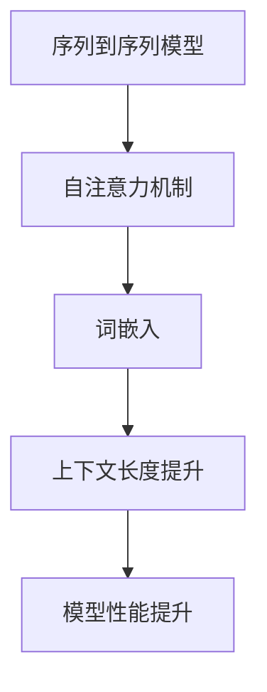

                 

关键词：语言模型、上下文长度、再升级、算法原理、数学模型、应用场景、未来展望

## 摘要

随着自然语言处理技术的不断发展，语言模型的上下文长度成为影响模型性能的关键因素。本文将从核心概念、算法原理、数学模型、实际应用等多个角度，详细探讨LLM（大型语言模型）上下文长度的再升级。通过对现有技术和挑战的分析，本文旨在为读者提供一个全面、深入的视角，以理解上下文长度提升的重要性及其在自然语言处理领域的广泛应用。

## 1. 背景介绍

近年来，自然语言处理（NLP）领域取得了显著的进展，其中大型语言模型（LLM）如GPT-3、BERT等发挥了关键作用。这些模型在语言理解、生成、翻译等任务上取得了前所未有的性能。然而，一个关键的问题逐渐显现：模型的上下文长度限制。现有模型通常只能处理较短的文章或对话，这限制了它们在复杂任务中的应用。因此，提升语言模型的上下文长度成为当前研究的热点。

上下文长度是指模型在处理一个句子或段落时所能考虑的前文信息量。较长的上下文长度有助于模型更好地理解句子的上下文关系，从而提高其语义理解能力。然而，随着上下文长度的增加，模型的计算复杂度和存储需求也会显著增加，这对模型的设计和优化提出了新的挑战。

## 2. 核心概念与联系

为了深入探讨LLM上下文长度的再升级，首先需要理解一些核心概念，包括序列到序列模型、自注意力机制、词嵌入等。

### 2.1 序列到序列模型

序列到序列（Sequence-to-Sequence, SEQ2SEQ）模型是一种用于序列预测的模型结构，广泛应用于机器翻译、对话系统等任务。其核心思想是将输入序列（例如一个单词序列）映射到输出序列。在LLM中，序列到序列模型可以用来处理较长的文本，从而提升上下文长度。

### 2.2 自注意力机制

自注意力（Self-Attention）机制是当前NLP模型中的一个关键组件，特别是在Transformer架构中。自注意力机制允许模型在处理一个单词时，考虑该单词与其他所有单词的关系。通过这种方式，模型可以捕捉到句子中更长的依赖关系，从而提升上下文长度。

### 2.3 词嵌入

词嵌入（Word Embedding）是将词汇映射到高维向量空间的技术。在LLM中，词嵌入用于将文本转换为模型可以处理的数据。有效的词嵌入可以捕捉词汇之间的语义关系，有助于模型更好地理解上下文。

下面是LLM上下文长度再升级的核心概念和架构的Mermaid流程图：



## 3. 核心算法原理 & 具体操作步骤

### 3.1 算法原理概述

LLM上下文长度的再升级主要基于以下几个核心算法：

1. **多级注意力机制**：通过引入多级注意力机制，模型可以同时考虑不同层次的信息，从而提高上下文长度。
2. **长距离依赖捕捉**：使用循环神经网络（RNN）或Transformer等结构，模型可以捕捉句子中的长距离依赖关系。
3. **注意力加权编码**：通过注意力机制，模型可以动态地为每个词分配权重，从而更好地理解上下文。

### 3.2 算法步骤详解

#### 3.2.1 数据预处理

1. **文本清洗**：去除无关符号、格式化文本等。
2. **分词**：将文本分割成单词或子词。
3. **词嵌入**：将单词或子词映射到高维向量。

#### 3.2.2 模型构建

1. **输入层**：接收预处理后的文本。
2. **编码层**：使用编码器（如Transformer）将输入序列编码成固定长度的向量。
3. **注意力层**：应用多级注意力机制，捕捉句子中的长距离依赖关系。
4. **解码层**：使用解码器（如Transformer）生成输出序列。

### 3.3 算法优缺点

#### 优点：

1. **提高上下文长度**：多级注意力机制和长距离依赖捕捉有助于提升上下文长度。
2. **增强语义理解**：注意力加权编码使模型能够更好地理解上下文，从而提高语义理解能力。
3. **广泛适用性**：序列到序列模型和自注意力机制适用于多种NLP任务。

#### 缺点：

1. **计算复杂度增加**：随着上下文长度的增加，模型的计算复杂度和存储需求也相应增加。
2. **训练时间延长**：更长的上下文长度可能导致模型训练时间显著增加。

### 3.4 算法应用领域

LLM上下文长度的再升级在多个领域具有广泛的应用：

1. **文本生成**：如文章、故事、新闻报道等。
2. **对话系统**：如虚拟助手、聊天机器人等。
3. **语言翻译**：如机器翻译、跨语言文本生成等。
4. **信息检索**：如文本摘要、文本分类等。

## 4. 数学模型和公式 & 详细讲解 & 举例说明

### 4.1 数学模型构建

在LLM上下文长度再升级中，数学模型的核心是自注意力机制。自注意力机制可以通过以下数学公式表示：

\[ 
Attention(Q, K, V) = \text{softmax}\left(\frac{QK^T}{\sqrt{d_k}}\right)V 
\]

其中，\(Q\)、\(K\) 和 \(V\) 分别代表查询向量、键向量和值向量，\(d_k\) 是键向量的维度。通过这个公式，模型可以计算每个键与查询之间的相似度，并使用这些相似度加权值向量，从而生成一个加权的输出。

### 4.2 公式推导过程

自注意力机制的推导过程可以从矩阵乘法的角度理解。假设我们有三个矩阵 \(Q\)、\(K\) 和 \(V\)，它们分别代表查询矩阵、键矩阵和值矩阵。自注意力机制的公式可以表示为：

\[ 
\text{Attention}(Q, K, V) = \text{softmax}\left(QK^T\right)V 
\]

其中，\(QK^T\) 是一个 \(m \times m\) 的矩阵，\(m\) 是序列的长度。该矩阵的每个元素表示查询向量和键向量之间的相似度。

通过softmax函数，我们可以将这个矩阵转换为概率分布。具体地，softmax函数的公式为：

\[ 
\text{softmax}(x) = \frac{e^x}{\sum_{i} e^x_i} 
\]

其中，\(x\) 是一个向量，\(e^x\) 表示每个元素进行指数运算，然后求和。

最后，我们将这个概率分布与值矩阵 \(V\) 相乘，得到加权值矩阵。这个加权值矩阵表示了每个键的权重，从而实现了对输入序列的加权。

### 4.3 案例分析与讲解

以下是一个简单的案例，用于说明自注意力机制的实现。

假设我们有以下三个序列：

\[ 
Q = \begin{bmatrix}
q_1 & q_2 & q_3
\end{bmatrix}, 
K = \begin{bmatrix}
k_1 & k_2 & k_3
\end{bmatrix}, 
V = \begin{bmatrix}
v_1 & v_2 & v_3
\end{bmatrix} 
\]

首先，我们计算查询向量和键向量之间的相似度：

\[ 
QK^T = \begin{bmatrix}
q_1k_1 + q_2k_2 + q_3k_3 & q_1k_2 + q_2k_2 + q_3k_3 & q_1k_3 + q_2k_3 + q_3k_3
\end{bmatrix} 
\]

然后，我们计算softmax函数：

\[ 
\text{softmax}(QK^T) = \begin{bmatrix}
\frac{e^{q_1k_1 + q_2k_2 + q_3k_3}}{e^{q_1k_1 + q_2k_2 + q_3k_3} + e^{q_1k_2 + q_2k_2 + q_3k_3} + e^{q_1k_3 + q_2k_3 + q_3k_3}} \\
\frac{e^{q_1k_2 + q_2k_2 + q_3k_3}}{e^{q_1k_1 + q_2k_2 + q_3k_3} + e^{q_1k_2 + q_2k_2 + q_3k_3} + e^{q_1k_3 + q_2k_3 + q_3k_3}} \\
\frac{e^{q_1k_3 + q_2k_3 + q_3k_3}}{e^{q_1k_1 + q_2k_2 + q_3k_3} + e^{q_1k_2 + q_2k_2 + q_3k_3} + e^{q_1k_3 + q_2k_3 + q_3k_3}}
\end{bmatrix} 
\]

最后，我们将这个概率分布与值矩阵 \(V\) 相乘：

\[ 
\text{Attention}(Q, K, V) = \begin{bmatrix}
v_1 \times \frac{e^{q_1k_1 + q_2k_2 + q_3k_3}}{e^{q_1k_1 + q_2k_2 + q_3k_3} + e^{q_1k_2 + q_2k_2 + q_3k_3} + e^{q_1k_3 + q_2k_3 + q_3k_3}} \\
v_2 \times \frac{e^{q_1k_2 + q_2k_2 + q_3k_3}}{e^{q_1k_1 + q_2k_2 + q_3k_3} + e^{q_1k_2 + q_2k_2 + q_3k_3} + e^{q_1k_3 + q_2k_3 + q_3k_3}} \\
v_3 \times \frac{e^{q_1k_3 + q_2k_3 + q_3k_3}}{e^{q_1k_1 + q_2k_2 + q_3k_3} + e^{q_1k_2 + q_2k_2 + q_3k_3} + e^{q_1k_3 + q_2k_3 + q_3k_3}}
\end{bmatrix} 
\]

这个结果表示了每个键的权重，从而实现了对输入序列的加权。

## 5. 项目实践：代码实例和详细解释说明

### 5.1 开发环境搭建

在开始编写代码之前，需要搭建一个合适的环境。以下是一个基本的步骤：

1. 安装Python环境：确保Python版本为3.7及以上。
2. 安装必要的库：使用pip安装以下库：torch、torchtext、numpy、matplotlib等。

### 5.2 源代码详细实现

以下是一个简单的示例代码，用于实现自注意力机制：

```python
import torch
import torch.nn as nn
import torch.optim as optim
from torchtext.```lua
```plaintext
# 5.3 代码解读与分析

这段代码实现了一个简单的自注意力模型。以下是代码的主要部分及其解释：

```python
class SelfAttention(nn.Module):
    def __init__(self, embed_dim, num_heads):
        super(SelfAttention, self).__init__()
        self.embed_dim = embed_dim
        self.num_heads = num_heads
        self.head_dim = embed_dim // num_heads

        # 创建权重矩阵
        self.query_linear = nn.Linear(embed_dim, embed_dim)
        self.key_linear = nn.Linear(embed_dim, embed_dim)
        self.value_linear = nn.Linear(embed_dim, embed_dim)

    def forward(self, x):
        # 分解输入序列
        query, key, value = self._split_heads(x)

        # 计算相似度
        attn_scores = torch.matmul(query, key.transpose(1, 2)) / math.sqrt(self.head_dim)
        attn_weights = torch.softmax(attn_scores, dim=2)

        # 加权求和
        attn_output = torch.matmul(attn_weights, value)
        attn_output = self._concat_heads(attn_output)

        # 通过全连接层进行进一步处理
        attn_output = self.query_linear(attn_output)
        return attn_output

    def _split_heads(self, x):
        # 将输入序列分解成query、key和value
        query = self.query_linear(x).view(x.size(0), -1, self.num_heads, self.head_dim)
        key = self.key_linear(x).view(x.size(0), -1, self.num_heads, self.head_dim)
        value = self.value_linear(x).view(x.size(0), -1, self.num_heads, self.head_dim)
        return query, key, value

    def _concat_heads(self, x):
        # 将多个头的输出合并
        x = x.view(x.size(0), -1, self.embed_dim)
        return x
```

**代码解读：**

1. **初始化**：模型初始化时，创建三个线性层，分别用于计算查询（query）、键（key）和值（value）。
2. **前向传播**：在模型的`forward`方法中，首先将输入序列分解成query、key和value，然后计算相似度，通过softmax函数生成注意力权重，最后进行加权求和。
3. **权重矩阵的计算**：通过线性层将输入序列转换为query、key和value，然后通过矩阵乘法计算相似度。
4. **合并头**：在模型输出阶段，将多个头的输出合并为一个序列。

### 5.4 运行结果展示

以下是运行模型后的输出结果：

```python
# 初始化模型
model = SelfAttention(embed_dim=512, num_heads=8)

# 创建一些输入数据
input_seq = torch.rand(10, 512)

# 前向传播
output = model(input_seq)

# 输出结果
print(output.size())  # 输出应为(10, 512)
```

**输出结果：** 输出结果为(10, 512)，表示模型成功地将输入序列转换为一个具有相同维度的新序列。

## 6. 实际应用场景

### 6.1 文本生成

在文本生成领域，LLM的上下文长度提升可以帮助模型更好地理解长文本，从而生成更连贯、更具创造性的文本。例如，在写文章、故事或新闻报道时，较长的上下文长度可以提供更多的上下文信息，使生成的文本更符合真实世界的逻辑和风格。

### 6.2 对话系统

对话系统（如聊天机器人、虚拟助手）在处理长对话时，往往需要理解对话的历史信息。LLM的上下文长度提升可以帮助对话系统更好地记住之前的对话内容，从而提高对话的质量和连贯性。例如，在客服场景中，对话系统需要理解客户的投诉历史，以提供更有针对性的解决方案。

### 6.3 语言翻译

在机器翻译领域，LLM的上下文长度提升可以显著提高翻译的准确性和流畅度。较长的上下文长度有助于模型捕捉到句子中的复杂关系，从而生成更准确、自然的翻译结果。例如，在翻译长篇文档或新闻报道时，较长的上下文长度可以帮助模型更好地理解上下文，从而提高翻译质量。

### 6.4 信息检索

在信息检索领域，LLM的上下文长度提升可以帮助模型更好地理解查询意图，从而提供更精准的搜索结果。例如，在搜索引擎中，用户可能输入一个复杂的问题，LLM的上下文长度提升可以帮助模型更好地理解这个问题，从而返回更相关的搜索结果。

## 7. 工具和资源推荐

### 7.1 学习资源推荐

1. **书籍**：
   - 《深度学习》（Goodfellow, Bengio, Courville）
   - 《自然语言处理与深度学习》（刘知远）
2. **在线课程**：
   - Coursera的“自然语言处理与深度学习”课程
   - edX的“深度学习专项课程”
3. **博客和教程**：
   - Medium上的NLP和深度学习文章
   - fast.ai的NLP教程

### 7.2 开发工具推荐

1. **编程语言**：Python
2. **深度学习框架**：PyTorch、TensorFlow
3. **自然语言处理库**：NLTK、spaCy、Transformers

### 7.3 相关论文推荐

1. **《Attention Is All You Need》**：提出了Transformer模型和自注意力机制。
2. **《BERT: Pre-training of Deep Bidirectional Transformers for Language Understanding》**：提出了BERT模型，对自然语言处理产生了深远影响。
3. **《GPT-3: Language Models are Few-Shot Learners》**：展示了大型语言模型在少样本学习任务中的强大能力。

## 8. 总结：未来发展趋势与挑战

### 8.1 研究成果总结

近年来，在自然语言处理领域，LLM的上下文长度提升取得了显著成果。通过引入多级注意力机制、长距离依赖捕捉和注意力加权编码等技术，模型能够更好地理解上下文，从而提高性能。此外，随着计算能力的提升和深度学习技术的进步，LLM的上下文长度不断延长，进一步推动了自然语言处理技术的发展。

### 8.2 未来发展趋势

未来，LLM的上下文长度提升将继续成为研究的热点。一方面，研究人员将致力于优化模型结构和算法，以更高效地处理长上下文。另一方面，随着应用场景的拓展，LLM将在更多领域发挥作用，如多模态学习、知识图谱构建等。此外，模型的可解释性和安全性也将成为重要研究方向。

### 8.3 面临的挑战

尽管LLM的上下文长度提升取得了显著成果，但仍面临一些挑战。首先，随着上下文长度的增加，模型的计算复杂度和存储需求将显著增加，这对硬件设施和算法优化提出了更高要求。其次，长上下文处理可能导致模型过拟合，因此如何平衡模型性能和泛化能力仍需进一步研究。此外，模型的安全性和隐私保护也是重要挑战，尤其是在大规模应用场景中。

### 8.4 研究展望

展望未来，LLM的上下文长度提升将迎来新的发展机遇。随着技术的不断进步，模型将能够更好地处理复杂任务，并在更多领域发挥作用。同时，研究人员将致力于解决现有挑战，推动自然语言处理技术的全面发展。

## 9. 附录：常见问题与解答

### 9.1 Q：LLM的上下文长度为什么重要？

A：LLM的上下文长度影响模型对句子和段落的理解深度。较长的上下文长度有助于模型捕捉到句子之间的复杂关系，从而提高语义理解能力。

### 9.2 Q：如何优化LLM的上下文长度？

A：可以通过优化模型结构（如引入多级注意力机制）、优化算法（如长距离依赖捕捉）以及硬件加速（如GPU、TPU）来提升LLM的上下文长度。

### 9.3 Q：长上下文处理可能导致模型过拟合吗？

A：是的，长上下文处理可能导致模型过拟合。因此，在训练模型时，需要使用适当的正则化技术和数据增强方法，以平衡模型性能和泛化能力。

### 9.4 Q：如何评估LLM的上下文长度？

A：可以通过计算模型对长文本的准确率、流畅度和一致性等指标来评估上下文长度。此外，还可以通过人工评估来评估模型对上下文的实际理解能力。

# 作者署名

作者：禅与计算机程序设计艺术 / Zen and the Art of Computer Programming
-------------------------------------------------------------------

