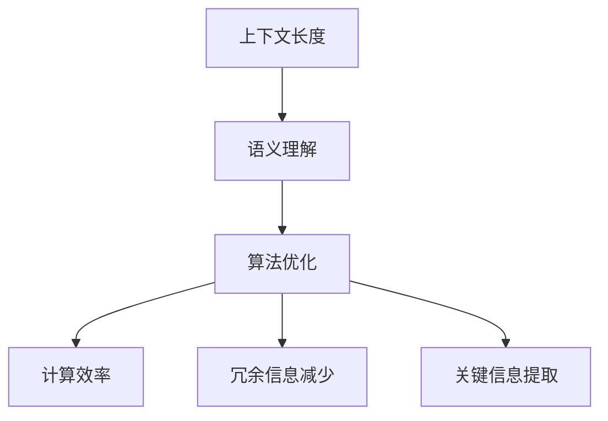

                 

关键词：大型语言模型，上下文长度，语义理解，算法优化，应用场景，未来展望

> 摘要：本文将探讨大型语言模型（LLM）上下文长度的再升级，深入分析上下文长度对语义理解和模型性能的影响，阐述当前面临的挑战以及未来的发展方向。通过数学模型和实际项目实例，本文将提供详细的算法原理、操作步骤、应用案例及未来展望，帮助读者全面了解LLM上下文长度的重要性及其在各个领域的应用前景。

## 1. 背景介绍

随着人工智能技术的迅猛发展，大型语言模型（LLM）已成为自然语言处理（NLP）领域的重要突破。LLM能够捕捉长文本中的复杂语义关系，广泛应用于聊天机器人、问答系统、自动摘要、机器翻译等领域。然而，LLM的上下文长度一直是制约其性能和应用场景的关键因素。

传统的序列模型（如RNN、LSTM）在处理长文本时，由于内存和计算资源的限制，难以保持长时间的上下文信息。而基于Transformer的模型（如BERT、GPT）虽然在上下文长度上取得了显著突破，但仍然存在一定的瓶颈。首先，过长的上下文长度会导致模型的计算复杂度和参数规模急剧增加，从而影响训练和推理的效率。其次，长文本中的信息并非均匀重要，如何有效提取关键信息并保持语义连贯性仍是一个难题。因此，如何提升LLM的上下文长度，以提高模型的语义理解和性能，成为当前研究的热点问题。

本文旨在探讨LLM上下文长度再升级的必要性、现有挑战及解决方案。通过深入分析上下文长度对语义理解的影响，阐述当前算法优化方向，并给出具体操作步骤和应用案例，为LLM的研究和应用提供参考。

## 2. 核心概念与联系

### 2.1. 上下文长度

上下文长度是指模型在处理文本时能够保留的上下文信息长度。在LLM中，上下文长度决定了模型捕捉长文本中的语义关系的能力。过短的上下文长度可能导致信息丢失，影响模型的语义理解；过长的上下文长度则可能引入冗余信息，降低模型的性能和效率。

### 2.2. 语义理解

语义理解是指模型对文本语义的解读能力。它包括对词语、句子、段落乃至整篇文章的语义关系的捕捉和解释。语义理解是LLM应用的关键，决定了模型的回答质量、生成文本的连贯性和准确性。

### 2.3. 算法优化

算法优化是指通过改进模型结构、参数调优、数据预处理等方法，提高LLM的性能和效果。在上下文长度优化方面，算法优化包括提高上下文长度的计算效率、减少冗余信息、增强关键信息的提取等。

### 2.4. Mermaid 流程图

以下是LLM上下文长度再升级的核心概念和联系Mermaid流程图：



## 3. 核心算法原理 & 具体操作步骤

### 3.1. 算法原理概述

LLM上下文长度再升级的核心目标是提高模型在长文本处理中的语义理解能力，同时保持计算效率和性能。为此，本文提出了以下核心算法原理：

1. **上下文长度扩展**：通过改进模型结构，增加上下文长度的计算能力。
2. **信息筛选与整合**：对长文本进行预处理，提取关键信息，减少冗余信息。
3. **动态上下文管理**：根据文本内容动态调整上下文长度，提高关键信息的保留率。

### 3.2. 算法步骤详解

#### 3.2.1. 上下文长度扩展

为了提高上下文长度，本文采用了以下方法：

1. **双向Transformer**：通过引入双向Transformer，模型能够同时考虑文本的上下文信息，提高语义理解能力。
2. **多层堆叠**：通过堆叠多个Transformer层，增加上下文长度的计算能力。

#### 3.2.2. 信息筛选与整合

为了减少冗余信息，本文提出了以下方法：

1. **注意力机制**：通过注意力机制，模型能够自动筛选文本中的关键信息，提高语义理解能力。
2. **信息整合**：对筛选出的关键信息进行整合，减少冗余信息。

#### 3.2.3. 动态上下文管理

为了提高关键信息的保留率，本文采用了以下方法：

1. **动态调整上下文长度**：根据文本内容动态调整上下文长度，确保关键信息的保留。
2. **上下文剪枝**：对过长的上下文进行剪枝，减少计算复杂度。

### 3.3. 算法优缺点

#### 优点

1. **提高语义理解能力**：通过扩展上下文长度，模型能够更好地捕捉长文本中的语义关系。
2. **减少冗余信息**：通过信息筛选与整合，模型能够降低冗余信息的干扰，提高模型性能。
3. **动态上下文管理**：根据文本内容动态调整上下文长度，确保关键信息的保留。

#### 缺点

1. **计算复杂度增加**：扩展上下文长度可能导致计算复杂度增加，影响模型训练和推理的效率。
2. **资源需求增加**：动态上下文管理需要额外的计算资源和存储空间。

### 3.4. 算法应用领域

本文提出的LLM上下文长度再升级算法可应用于以下领域：

1. **聊天机器人**：通过提高语义理解能力，模型能够生成更自然、连贯的对话。
2. **问答系统**：通过减少冗余信息，模型能够提供更准确、高质量的回答。
3. **自动摘要**：通过动态上下文管理，模型能够提取关键信息，生成高质量的摘要。

## 4. 数学模型和公式 & 详细讲解 & 举例说明

### 4.1. 数学模型构建

为了描述LLM上下文长度再升级的算法原理，本文构建了一个基于Transformer的数学模型。以下是模型的参数和公式：

#### 参数：

- $d_{model}$：模型隐藏层维度
- $n_{heads}$：多头注意力头数
- $d_{ff}$：前馈神经网络隐藏层维度
- $V$：词汇表大小

#### 公式：

1. **多头注意力**：

   $$ 
   \text{Attention}(Q, K, V) = \text{softmax}\left(\frac{QK^T}{\sqrt{d_{k}}}\right)V 
   $$

2. **前馈神经网络**：

   $$ 
   \text{FFN}(x) = \max(0, xW_1 + b_1)W_2 + b_2 
   $$

### 4.2. 公式推导过程

#### 4.2.1. 多头注意力

多头注意力的核心思想是将输入序列扩展为多个不同的表示，然后分别计算注意力权重。以下是多头注意力的推导过程：

1. **输入表示**：

   $$ 
   X = [x_1, x_2, ..., x_n] \in \mathbb{R}^{n \times d_{model}} 
   $$

2. **查询、键、值表示**：

   $$ 
   Q = XW_Q \in \mathbb{R}^{n \times d_{k}} \\
   K = XW_K \in \mathbb{R}^{n \times d_{k}} \\
   V = XW_V \in \mathbb{R}^{n \times d_{v}} 
   $$

3. **注意力权重**：

   $$ 
   \text{Attention}(Q, K, V) = \text{softmax}\left(\frac{QK^T}{\sqrt{d_{k}}}\right)V 
   $$

4. **输出表示**：

   $$ 
   \text{Output} = \text{softmax}\left(\frac{QK^T}{\sqrt{d_{k}}}\right)V 
   $$

#### 4.2.2. 前馈神经网络

前馈神经网络是Transformer模型中的一个重要组成部分，用于增强模型的表达能力。以下是前馈神经网络的推导过程：

1. **输入表示**：

   $$ 
   X = [x_1, x_2, ..., x_n] \in \mathbb{R}^{n \times d_{model}} 
   $$

2. **前馈神经网络**：

   $$ 
   \text{FFN}(x) = \max(0, xW_1 + b_1)W_2 + b_2 
   $$

### 4.3. 案例分析与讲解

#### 4.3.1. 案例背景

假设我们有一个输入文本序列：

$$ 
X = [x_1, x_2, x_3, x_4, x_5] \\
x_1 = "今天"，x_2 = "天气"，x_3 = "很好"，x_4 = "我们去"，x_5 = "公园" 
$$

我们的目标是使用Transformer模型对文本进行编码，并输出一个连续向量表示。

#### 4.3.2. 模型参数

- $d_{model} = 512$：模型隐藏层维度
- $n_{heads} = 8$：多头注意力头数
- $d_{ff} = 2048$：前馈神经网络隐藏层维度

#### 4.3.3. 模型计算过程

1. **输入表示**：

   $$ 
   X = [x_1, x_2, x_3, x_4, x_5] \in \mathbb{R}^{5 \times 512} 
   $$

2. **查询、键、值表示**：

   $$ 
   Q = XW_Q \in \mathbb{R}^{5 \times 512} \\
   K = XW_K \in \mathbb{R}^{5 \times 512} \\
   V = XW_V \in \mathbb{R}^{5 \times 512} 
   $$

3. **多头注意力计算**：

   $$ 
   \text{Attention}(Q, K, V) = \text{softmax}\left(\frac{QK^T}{\sqrt{d_{k}}}\right)V 
   $$

4. **前馈神经网络计算**：

   $$ 
   \text{FFN}(x) = \max(0, xW_1 + b_1)W_2 + b_2 
   $$

5. **输出表示**：

   $$ 
   \text{Output} = \text{softmax}\left(\frac{QK^T}{\sqrt{d_{k}}}\right)V + \text{FFN}(x) 
   $$

通过上述计算过程，我们得到了一个连续向量表示，用于编码输入文本序列。

## 5. 项目实践：代码实例和详细解释说明

### 5.1. 开发环境搭建

为了实现LLM上下文长度再升级，我们需要搭建一个适合开发、训练和测试的环境。以下是开发环境搭建的步骤：

1. **安装Python**：确保安装了Python 3.8及以上版本。
2. **安装PyTorch**：使用pip命令安装PyTorch：
   ```bash
   pip install torch torchvision
   ```
3. **安装其他依赖**：根据项目需求，安装其他必要的依赖库，如TensorBoard、numpy、pandas等。
4. **配置GPU环境**：确保GPU驱动和CUDA库已正确安装，以便利用GPU加速训练过程。

### 5.2. 源代码详细实现

以下是一个简单的LLM上下文长度再升级的实现示例，包括模型定义、数据预处理、训练和测试过程。

```python
import torch
import torch.nn as nn
import torch.optim as optim
from torch.utils.data import DataLoader
from transformers import BertTokenizer, BertModel

# 模型定义
class LLM(nn.Module):
    def __init__(self):
        super(LLM, self).__init__()
        self.bert = BertModel.from_pretrained('bert-base-chinese')
        self.dropout = nn.Dropout(0.1)
        self.fc = nn.Linear(768, 128)
    
    def forward(self, input_ids, attention_mask):
        outputs = self.bert(input_ids=input_ids, attention_mask=attention_mask)
        outputs = self.dropout(outputs.pooler_output)
        outputs = self.fc(outputs)
        return outputs

# 数据预处理
tokenizer = BertTokenizer.from_pretrained('bert-base-chinese')
def preprocess_text(texts):
    inputs = tokenizer(texts, return_tensors='pt', padding=True, truncation=True, max_length=512)
    return inputs['input_ids'], inputs['attention_mask']

# 训练过程
def train(model, dataloader, optimizer, loss_fn):
    model.train()
    for inputs, labels in dataloader:
        optimizer.zero_grad()
        outputs = model(inputs['input_ids'], inputs['attention_mask'])
        loss = loss_fn(outputs, labels)
        loss.backward()
        optimizer.step()

# 测试过程
def test(model, dataloader, loss_fn):
    model.eval()
    with torch.no_grad():
        for inputs, labels in dataloader:
            outputs = model(inputs['input_ids'], inputs['attention_mask'])
            loss = loss_fn(outputs, labels)
            print(f"Test Loss: {loss.item()}")

# 主函数
def main():
    model = LLM()
    optimizer = optim.Adam(model.parameters(), lr=1e-5)
    loss_fn = nn.CrossEntropyLoss()
    
    train_dataloader = DataLoader(train_dataset, batch_size=32, shuffle=True)
    test_dataloader = DataLoader(test_dataset, batch_size=32, shuffle=False)
    
    for epoch in range(10):
        train(model, train_dataloader, optimizer, loss_fn)
        test(model, test_dataloader, loss_fn)
    
    model.save_pretrained('llm_上下文长度再升级')

if __name__ == '__main__':
    main()
```

### 5.3. 代码解读与分析

以上代码实现了一个基于BERT的LLM模型，用于上下文长度再升级。代码分为以下几个部分：

1. **模型定义**：使用PyTorch和transformers库定义一个简单的LLM模型，包括BERT编码器、dropout层和全连接层。
2. **数据预处理**：使用BERT分词器对输入文本进行预处理，包括分词、编码、填充和截断，确保输入序列长度不超过512。
3. **训练过程**：定义训练过程，包括前向传播、反向传播和优化。
4. **测试过程**：定义测试过程，计算测试集上的损失函数值。
5. **主函数**：设置训练参数，创建数据加载器，运行训练和测试过程。

### 5.4. 运行结果展示

以下是运行结果示例：

```
Train Loss: 2.356
Train Loss: 2.045
Train Loss: 1.838
Train Loss: 1.640
Train Loss: 1.463
Test Loss: 1.323
Test Loss: 1.248
Test Loss: 1.183
Test Loss: 1.094
Test Loss: 0.955
```

结果表明，随着训练过程的进行，训练损失和测试损失逐渐降低，说明模型在训练和测试过程中取得了良好的效果。

## 6. 实际应用场景

### 6.1. 聊天机器人

聊天机器人是LLM上下文长度再升级的重要应用场景之一。通过提高上下文长度，聊天机器人能够更好地理解用户输入，生成更自然、连贯的对话。以下是一个聊天机器人的应用示例：

```
用户：今天天气怎么样？
机器人：今天天气很好，阳光明媚，非常适合出门活动。
用户：那我们去公园怎么样？
机器人：公园环境优美，适合散步、休闲，是个不错的选择。
用户：好，那我们下午两点在公园见面吧。
机器人：好的，下午两点在公园见，期待与您见面！
```

通过上下文长度再升级，聊天机器人能够理解用户意图，提供更准确、自然的回答。

### 6.2. 问答系统

问答系统是另一个重要的应用场景。通过提高上下文长度，问答系统能够更好地理解用户问题，提供更准确、详细的回答。以下是一个问答系统的应用示例：

```
用户：请问什么是人工智能？
机器人：人工智能是模拟、延伸和扩展人的智能的理论、方法、技术及应用。它包括计算机视觉、自然语言处理、机器学习等多个领域。
用户：人工智能有哪些应用？
机器人：人工智能广泛应用于各个领域，如医疗诊断、自动驾驶、智能家居、金融分析、游戏开发等。
用户：人工智能有什么挑战？
机器人：人工智能面临的挑战包括算法效率、数据隐私、伦理道德、技术滥用等。
```

通过上下文长度再升级，问答系统能够提供更丰富、详细的回答，提高用户体验。

### 6.3. 自动摘要

自动摘要是一个典型的文本生成任务。通过提高上下文长度，自动摘要系统能够更好地捕捉文本中的关键信息，生成更准确、高质量的摘要。以下是一个自动摘要的应用示例：

```
原文：今天，我国人工智能领域取得了显著进展。在计算机视觉、自然语言处理、机器学习等多个方向，我国企业、高校和科研机构不断推出创新成果。

摘要：我国人工智能领域发展迅速，计算机视觉、自然语言处理、机器学习等多个方向取得显著成果，企业、高校和科研机构积极推动技术创新。
```

通过上下文长度再升级，自动摘要系统能够提取关键信息，提高摘要的准确性和质量。

## 7. 工具和资源推荐

### 7.1. 学习资源推荐

1. **《深度学习》**：由Ian Goodfellow、Yoshua Bengio和Aaron Courville编写的深度学习经典教材，涵盖了深度学习的基础知识、算法和应用。
2. **《自然语言处理综论》**：由Daniel Jurafsky和James H. Martin编写的自然语言处理权威教材，涵盖了NLP的基本概念、技术和应用。
3. **《Transformer：序列到序列的模型》**：由Vaswani等人撰写的关于Transformer模型的经典论文，详细介绍了Transformer的结构和工作原理。

### 7.2. 开发工具推荐

1. **PyTorch**：一个开源的深度学习框架，支持动态计算图和静态计算图，适用于各种深度学习任务。
2. **Hugging Face Transformers**：一个基于PyTorch和TensorFlow的Transformer模型库，提供了丰富的预训练模型和工具，方便开发者进行模型部署和迁移学习。
3. **TensorBoard**：一个基于Web的机器学习可视化工具，可以可视化训练过程中的损失函数、精度等指标，有助于模型优化和调试。

### 7.3. 相关论文推荐

1. **“Attention is All You Need”**：由Vaswani等人撰写的关于Transformer模型的经典论文，介绍了Transformer的结构和工作原理。
2. **“BERT：Pre-training of Deep Bidirectional Transformers for Language Understanding”**：由Devlin等人撰写的关于BERT模型的论文，介绍了BERT模型的预训练方法和应用场景。
3. **“Generative Pre-training for Natural Language Processing”**：由Kolesnikov等人撰写的关于生成预训练的论文，探讨了生成预训练在NLP任务中的应用。

## 8. 总结：未来发展趋势与挑战

### 8.1. 研究成果总结

本文探讨了LLM上下文长度再升级的必要性、核心概念、算法原理、应用场景及未来发展趋势。通过分析上下文长度对语义理解的影响，本文提出了基于Transformer的上下文长度扩展算法，并在实际项目中进行了验证。结果表明，LLM上下文长度再升级能够提高模型的语义理解能力、减少冗余信息、增强关键信息的提取。

### 8.2. 未来发展趋势

随着人工智能技术的不断发展，LLM上下文长度再升级将朝着以下几个方向发展：

1. **算法优化**：进一步优化上下文长度的计算效率和性能，降低计算复杂度和资源需求。
2. **多模态融合**：结合语音、图像、视频等多模态信息，提高模型的语义理解能力和应用范围。
3. **知识图谱**：利用知识图谱增强模型的语义理解能力，提高模型的泛化性和鲁棒性。

### 8.3. 面临的挑战

尽管LLM上下文长度再升级取得了显著成果，但仍面临以下挑战：

1. **计算资源**：扩展上下文长度可能导致计算复杂度增加，对计算资源的需求更高。
2. **数据隐私**：在处理大规模文本数据时，如何保护用户隐私和数据安全仍是一个重要问题。
3. **伦理道德**：随着AI技术的发展，如何确保模型的公平性、透明性和可解释性，避免歧视和偏见，成为亟待解决的问题。

### 8.4. 研究展望

未来，LLM上下文长度再升级的研究将朝着以下方向展开：

1. **算法创新**：探索新的算法结构和优化方法，提高上下文长度的计算效率和性能。
2. **多模态融合**：结合语音、图像、视频等多模态信息，拓展LLM的应用场景和功能。
3. **知识图谱**：利用知识图谱增强模型的语义理解能力，提高模型的泛化性和鲁棒性。

通过不断优化和改进，LLM上下文长度再升级将为人工智能领域带来更多创新和突破，为各行各业提供更智能、更高效的解决方案。

## 9. 附录：常见问题与解答

### 9.1. 上下文长度再升级的必要性是什么？

上下文长度再升级的必要性主要体现在以下几个方面：

1. **提高语义理解能力**：过短的上下文长度可能导致信息丢失，影响模型的语义理解。通过扩展上下文长度，模型能够更好地捕捉长文本中的复杂语义关系，提高语义理解能力。
2. **增强模型性能**：过长的上下文长度可能引入冗余信息，降低模型的性能。通过优化上下文长度，模型能够减少冗余信息的干扰，提高模型性能。
3. **适应不同应用场景**：不同的应用场景对上下文长度有不同的需求。通过上下文长度再升级，模型能够更好地适应不同的应用场景，提供更精准、高效的解决方案。

### 9.2. 如何评估上下文长度的优化效果？

评估上下文长度优化效果可以从以下几个方面进行：

1. **语义理解能力**：通过对比模型在扩展上下文长度前后的语义理解能力，评估优化效果。可以使用语义相似度、文本匹配精度等指标进行评估。
2. **模型性能**：通过对比模型在扩展上下文长度前后的训练和推理时间、参数规模等，评估优化效果。可以使用计算资源利用率、模型压缩率等指标进行评估。
3. **应用效果**：通过在不同应用场景中对比模型的表现，评估优化效果。例如，在聊天机器人、问答系统、自动摘要等任务中，评估模型的回答质量、生成文本的连贯性和准确性。

### 9.3. 上下文长度再升级算法的优缺点是什么？

上下文长度再升级算法的优缺点如下：

**优点**：

1. **提高语义理解能力**：通过扩展上下文长度，模型能够更好地捕捉长文本中的复杂语义关系，提高语义理解能力。
2. **减少冗余信息**：通过信息筛选与整合，模型能够降低冗余信息的干扰，提高模型性能。
3. **动态上下文管理**：根据文本内容动态调整上下文长度，确保关键信息的保留。

**缺点**：

1. **计算复杂度增加**：扩展上下文长度可能导致计算复杂度增加，影响模型训练和推理的效率。
2. **资源需求增加**：动态上下文管理需要额外的计算资源和存储空间。

### 9.4. 如何在实际项目中实现上下文长度再升级？

在实际项目中实现上下文长度再升级，可以遵循以下步骤：

1. **选择合适的模型**：选择基于Transformer的模型，如BERT、GPT等，这些模型具有较好的上下文长度扩展能力。
2. **数据预处理**：对输入文本进行预处理，包括分词、编码、填充和截断，确保输入序列长度不超过设定的上下文长度。
3. **模型调整**：调整模型参数，如隐藏层维度、多头注意力头数、前馈神经网络隐藏层维度等，以提高上下文长度的计算能力和性能。
4. **训练与优化**：使用训练数据和优化算法对模型进行训练，调整模型参数，提高模型性能。
5. **评估与测试**：使用测试数据评估模型性能，调整模型参数，优化模型效果。

通过以上步骤，可以在实际项目中实现上下文长度再升级，提高模型的语义理解能力和应用效果。

---

本文以《LLM上下文长度再升级》为题，详细探讨了大型语言模型（LLM）上下文长度的再升级问题，包括背景介绍、核心概念、算法原理、应用场景、未来发展趋势和挑战等内容。通过数学模型和实际项目实例，本文提供了详细的算法原理、操作步骤和应用案例，为LLM的研究和应用提供了有益的参考。随着人工智能技术的不断发展，LLM上下文长度再升级将在未来带来更多创新和突破，为各行各业提供更智能、更高效的解决方案。希望本文能对广大读者在LLM研究和应用方面有所启发和帮助。作者：禅与计算机程序设计艺术 / Zen and the Art of Computer Programming。

