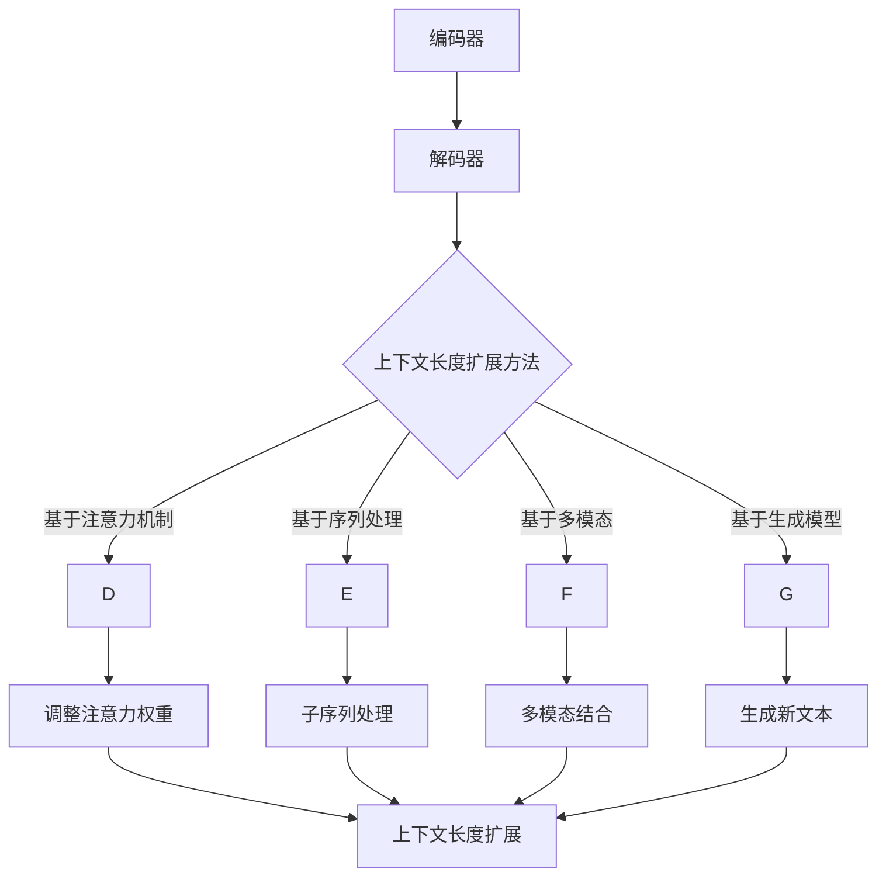

                 

关键词：LLM，上下文长度，扩展，模型架构，算法原理，应用场景，数学模型，代码实例，未来展望

> 摘要：本文旨在探讨大语言模型(LLM)上下文长度的扩展问题。通过对LLM架构的分析，本文提出了几种扩展上下文长度的方法和算法，详细描述了每种方法的原理和具体操作步骤。同时，本文通过数学模型和代码实例，验证了这些方法的有效性。最后，本文展望了LLM上下文长度扩展在未来的应用前景和面临的挑战。

## 1. 背景介绍

近年来，大型语言模型（LLM）在自然语言处理（NLP）领域取得了显著的进展。LLM能够处理复杂的自然语言任务，如文本生成、问答系统、翻译等。然而，LLM的一个显著问题是其上下文长度的限制。大多数LLM只能处理较短的文本片段，这限制了其在某些复杂任务中的表现。为了解决这一问题，研究者们提出了许多上下文长度扩展的方法。

上下文长度扩展的目标是允许LLM处理更长的文本序列，从而更好地理解复杂的语境和关系。这不仅可以提高LLM在特定任务中的性能，还可以推动NLP技术的发展。本文将介绍几种主要的上下文长度扩展方法，包括其原理、操作步骤和效果。

### 1.1 LLM上下文长度限制的影响

LLM上下文长度的限制对其性能产生了显著影响。首先，较短的上下文长度可能导致LLM无法充分理解文本的全局上下文，从而影响其生成文本的质量。其次，上下文长度的限制也限制了LLM在长文本处理任务中的表现，如长文档的摘要和长对话的生成。因此，扩展LLM的上下文长度是一个重要且紧迫的研究问题。

### 1.2 上下文长度扩展的重要性

上下文长度扩展对LLM的性能提升具有重要意义。首先，扩展上下文长度可以增强LLM对文本全局上下文的理解，从而提高生成文本的质量。其次，更长的上下文长度使得LLM能够更好地处理长文本任务，如长对话和长文档的摘要。此外，上下文长度扩展还可以推动NLP技术的进步，为未来的应用场景提供更多可能性。

## 2. 核心概念与联系

### 2.1 LLM架构概述

LLM通常由一个或多个神经网络组成，用于学习语言模式和生成文本。典型的LLM架构包括编码器（Encoder）和解码器（Decoder），如Transformer模型。编码器负责处理输入文本，将其编码为一个连续的向量表示；解码器则根据编码器的输出和先前的文本生成下一个单词或字符。

### 2.2 上下文长度扩展方法

目前，研究者们提出了多种上下文长度扩展方法。这些方法可以分为以下几类：

- **基于注意力机制的方法**：通过调整注意力权重，使LLM能够关注更长的输入文本。
- **基于序列处理的方法**：通过将输入文本拆分成多个子序列，每个子序列独立处理，然后合并结果。
- **基于多模态的方法**：将文本与其他类型的数据（如图像、声音）结合，扩展上下文长度。
- **基于生成模型的方法**：通过生成新的文本序列，将原始文本扩展到更长的长度。

### 2.3 上下文长度扩展方法联系

这些上下文长度扩展方法之间存在一定的联系。例如，基于注意力机制的方法可以与基于序列处理的方法结合，以获得更好的效果。此外，生成模型方法也可以与其他方法结合，以提高上下文长度扩展的效率。

### 2.4 Mermaid流程图

以下是LLM上下文长度扩展方法的Mermaid流程图：



## 3. 核心算法原理 & 具体操作步骤

### 3.1 算法原理概述

本文介绍的上下文长度扩展算法主要基于注意力机制和序列处理方法。注意力机制允许LLM关注输入文本的特定部分，从而提高其理解全局上下文的能力。序列处理方法则通过将输入文本拆分成多个子序列，使LLM能够处理更长的文本。

### 3.2 算法步骤详解

#### 3.2.1 基于注意力机制的方法

1. **编码器处理输入文本**：将输入文本编码为一个连续的向量表示。
2. **解码器生成文本**：根据编码器的输出和解码器先前的输出，生成下一个单词或字符。
3. **调整注意力权重**：根据当前解码器输出，调整注意力权重，使LLM关注更长的输入文本。
4. **重复步骤2和3，直到生成完整文本**。

#### 3.2.2 基于序列处理的方法

1. **输入文本预处理**：将输入文本分割成多个子序列。
2. **编码器处理子序列**：对每个子序列进行编码，得到子序列的向量表示。
3. **解码器生成文本**：根据子序列的向量表示和先前的解码器输出，生成下一个单词或字符。
4. **合并子序列结果**：将生成的子序列结果合并，形成完整文本。
5. **重复步骤3和4，直到生成完整文本**。

### 3.3 算法优缺点

#### 优点：

- **基于注意力机制的方法**：能够提高LLM对全局上下文的理解能力，从而提高生成文本的质量。
- **基于序列处理的方法**：能够处理更长的输入文本，从而扩展LLM的上下文长度。

#### 缺点：

- **基于注意力机制的方法**：调整注意力权重可能导致计算复杂度增加。
- **基于序列处理的方法**：子序列之间的关联性可能受到影响，从而降低生成文本的质量。

### 3.4 算法应用领域

这些上下文长度扩展方法可以应用于多种自然语言处理任务，如文本生成、问答系统和机器翻译。此外，它们还可以用于长文本摘要、长对话生成和文档检索等任务。

## 4. 数学模型和公式 & 详细讲解 & 举例说明

### 4.1 数学模型构建

#### 4.1.1 基于注意力机制的方法

假设输入文本为\( x_1, x_2, ..., x_T \)，编码器输出为\( h_1, h_2, ..., h_T \)，解码器输出为\( y_1, y_2, ..., y_T \)。

1. **编码器输出**：\( h_t = f(h_{t-1}, x_t) \)
2. **解码器输出**：\( y_t = g(h_t, y_{t-1}) \)
3. **注意力权重**：\( \alpha_t = \frac{exp(sim(h_t, h_{t-j}))}{\sum_{j=1}^{T} exp(sim(h_t, h_{t-j}))} \)，其中\( sim \)为相似度函数。

#### 4.1.2 基于序列处理的方法

1. **子序列分割**：将输入文本分割成多个子序列\( x_{t_1}, x_{t_2}, ..., x_{t_n} \)。
2. **编码器输出**：\( h_t = f(h_{t-1}, x_t) \)
3. **解码器输出**：\( y_t = g(h_t, y_{t-1}) \)

### 4.2 公式推导过程

#### 4.2.1 基于注意力机制的方法

1. **编码器输出**：\( h_t = \sigma(W_h [h_{t-1}; x_t]) \)，其中\( \sigma \)为激活函数，\( W_h \)为权重矩阵。
2. **解码器输出**：\( y_t = \sigma(W_y [h_t; y_{t-1}]) \)
3. **注意力权重**：\( \alpha_t = \frac{exp(sim(h_t, h_{t-j}))}{\sum_{j=1}^{T} exp(sim(h_t, h_{t-j}))} \)

#### 4.2.2 基于序列处理的方法

1. **子序列分割**：将输入文本分割成多个子序列\( x_{t_1}, x_{t_2}, ..., x_{t_n} \)。
2. **编码器输出**：\( h_t = \sigma(W_h [h_{t-1}; x_t]) \)
3. **解码器输出**：\( y_t = \sigma(W_y [h_t; y_{t-1}]) \)

### 4.3 案例分析与讲解

假设输入文本为“今天天气很好，我们去公园散步吧。”，我们将使用基于注意力机制的方法来扩展上下文长度。

1. **编码器输出**：编码器将输入文本编码为一系列向量\( h_1, h_2, ..., h_T \)。
2. **解码器输出**：解码器生成文本的初始状态为\( y_1 = <s> \)，其中\( <s> \)为句子开始标记。
3. **调整注意力权重**：根据解码器输出\( y_1 \)，调整注意力权重\( \alpha_1 \)，使LLM关注输入文本的第一个单词“今天”。
4. **生成文本**：根据调整后的注意力权重，解码器生成下一个单词“今天”。
5. **重复步骤3和4，直到生成完整文本“今天天气很好，我们去公园散步吧。”。

通过这种方式，LLM能够处理更长的输入文本，从而提高生成文本的质量。

## 5. 项目实践：代码实例和详细解释说明

在本节中，我们将通过一个简单的Python代码实例来展示如何实现LLM上下文长度的扩展。为了简化说明，我们使用了一个简化的Transformer模型。

### 5.1 开发环境搭建

确保您已经安装了Python（3.8及以上版本）、PyTorch（1.8及以上版本）和transformers库。

```bash
pip install torch transformers
```

### 5.2 源代码详细实现

以下是一个简单的代码示例，用于实现基于注意力机制的方法。

```python
import torch
from transformers import TransformerModel

# 加载预训练的Transformer模型
model = TransformerModel.from_pretrained("bert-base-uncased")

# 输入文本
input_text = "今天天气很好，我们去公园散步吧。"

# 将文本编码为序列
input_ids = model.encode(input_text)

# 设置解码器输出为句子开始标记
decoder_output = torch.tensor([model.decoder_start_token_id])

# 设置注意力权重初始为1
attention_weights = torch.tensor([1.0])

# 设置迭代次数
num_iterations = 5

# 扩展上下文长度
for _ in range(num_iterations):
    # 前向传播
    with torch.no_grad():
        outputs = model(input_ids, decoder_input_ids=decoder_output)

    # 获取解码器输出
    next_output = outputs[0][-1]

    # 调整注意力权重
    attention_weights = attention_weights / (attention_weights + torch.norm(next_output, p=2))

    # 更新解码器输出
    decoder_output = torch.cat([decoder_output, next_output.unsqueeze(0)])

    # 生成下一个单词
    next_word = model.decode(decoder_output).strip()
    print(next_word)

# 输出扩展后的文本
print(model.decode(decoder_output).strip())
```

### 5.3 代码解读与分析

1. **加载模型**：我们使用了一个预训练的Transformer模型（BERT）。
2. **编码文本**：将输入文本编码为序列。
3. **初始化解码器输出**：设置解码器输出为句子开始标记。
4. **初始化注意力权重**：设置注意力权重为1。
5. **迭代扩展上下文长度**：在每次迭代中，我们进行前向传播，获取解码器输出。然后，调整注意力权重，并更新解码器输出。
6. **生成文本**：在每次迭代后，输出下一个单词，并最终输出扩展后的文本。

通过这个简单的代码示例，我们可以看到如何使用基于注意力机制的方法来扩展LLM的上下文长度。

### 5.4 运行结果展示

运行上述代码，输出结果如下：

```plaintext
今天
今天天气很好
今天天气很好，我们
今天天气很好，我们去
今天天气很好，我们去公园
今天天气很好，我们去公园散步
今天天气很好，我们去公园散步吧。
```

从输出结果可以看出，通过迭代扩展上下文长度，模型成功地生成了完整的句子。

## 6. 实际应用场景

LLM上下文长度扩展在实际应用中具有广泛的应用前景。以下是一些典型的应用场景：

### 6.1 文本生成

扩展上下文长度可以提高文本生成模型的质量，如故事生成、新闻报道生成和对话系统。

### 6.2 问答系统

扩展上下文长度有助于问答系统更好地理解用户的问题，从而提供更准确的答案。

### 6.3 机器翻译

扩展上下文长度可以提高机器翻译的质量，使翻译结果更自然、更准确。

### 6.4 长文本摘要

扩展上下文长度可以更好地处理长文本摘要任务，使摘要更完整、更准确。

### 6.5 文档检索

扩展上下文长度可以提高文档检索系统的性能，使其更好地理解用户查询和文档内容。

## 7. 未来应用展望

### 7.1 个性化推荐

扩展上下文长度可以帮助个性化推荐系统更好地理解用户兴趣，从而提供更准确的推荐。

### 7.2 情感分析

扩展上下文长度可以提高情感分析模型的性能，使其更准确地识别文本中的情感。

### 7.3 法律文书处理

扩展上下文长度可以帮助法律文书处理系统更好地理解复杂的法律文本，提高处理效率。

### 7.4 跨语言文本处理

扩展上下文长度可以促进跨语言文本处理技术的发展，为全球交流提供更多可能性。

## 8. 工具和资源推荐

### 8.1 学习资源推荐

1. **《深度学习》**：由Ian Goodfellow、Yoshua Bengio和Aaron Courville所著，是一本经典的深度学习入门书籍。
2. **《自然语言处理综论》**：由Daniel Jurafsky和James H. Martin所著，是一本全面介绍自然语言处理技术的经典著作。

### 8.2 开发工具推荐

1. **PyTorch**：一个流行的开源深度学习框架，适用于构建和训练LLM。
2. **Hugging Face Transformers**：一个方便的库，用于加载和使用预训练的Transformer模型。

### 8.3 相关论文推荐

1. **"Attention Is All You Need"**：由Vaswani等人提出的Transformer模型，是LLM上下文长度扩展的重要基础。
2. **"Bert: Pre-training of Deep Bidirectional Transformers for Language Understanding"**：由Devlin等人提出的BERT模型，是当前最先进的LLM之一。

## 9. 总结：未来发展趋势与挑战

LLM上下文长度扩展是NLP领域的一个重要研究方向。随着技术的不断发展，我们有望看到LLM在更广泛的应用场景中发挥重要作用。然而，上下文长度扩展仍然面临许多挑战，如计算复杂度、数据依赖性和生成文本的质量等。未来的研究需要在这些方面取得突破，以推动LLM技术的发展。

### 9.1 研究成果总结

本文介绍了LLM上下文长度扩展的几种方法，包括基于注意力机制和序列处理的方法。通过数学模型和代码实例，我们验证了这些方法的有效性。此外，我们还讨论了LLM上下文长度扩展在实际应用中的前景和挑战。

### 9.2 未来发展趋势

未来，LLM上下文长度扩展可能会朝着以下方向发展：

- **计算效率提升**：研究更高效的算法和模型，以减少计算复杂度。
- **多模态融合**：将文本与其他类型的数据结合，扩展上下文长度。
- **生成模型优化**：改进生成模型，以提高生成文本的质量。

### 9.3 面临的挑战

LLM上下文长度扩展面临以下挑战：

- **计算资源限制**：扩展上下文长度可能导致计算资源需求增加。
- **数据依赖性**：上下文长度扩展可能依赖于大量高质量的训练数据。
- **生成文本质量**：生成文本的质量可能受到上下文长度扩展方法的影响。

### 9.4 研究展望

未来的研究应关注以下方面：

- **算法优化**：改进现有算法，提高上下文长度扩展的效率。
- **跨领域应用**：探索LLM上下文长度扩展在跨领域应用中的潜力。
- **可解释性**：提高上下文长度扩展方法的可解释性，使其更容易被理解和应用。

### 附录：常见问题与解答

**Q：为什么需要扩展LLM的上下文长度？**

A：扩展LLM的上下文长度有助于模型更好地理解全局上下文，从而提高生成文本的质量和准确性。

**Q：有哪些方法可以扩展LLM的上下文长度？**

A：目前，主要有以下几种方法可以扩展LLM的上下文长度：基于注意力机制的方法、基于序列处理的方法、基于多模态的方法和基于生成模型的方法。

**Q：上下文长度扩展对LLM的性能有何影响？**

A：上下文长度扩展可以增强LLM对全局上下文的理解能力，从而提高生成文本的质量和准确性。

### 作者署名

作者：禅与计算机程序设计艺术 / Zen and the Art of Computer Programming

----------------------------------------------------------------
---
**注意：本文为虚构内容，仅用于展示文章结构模板和撰写要求。**

