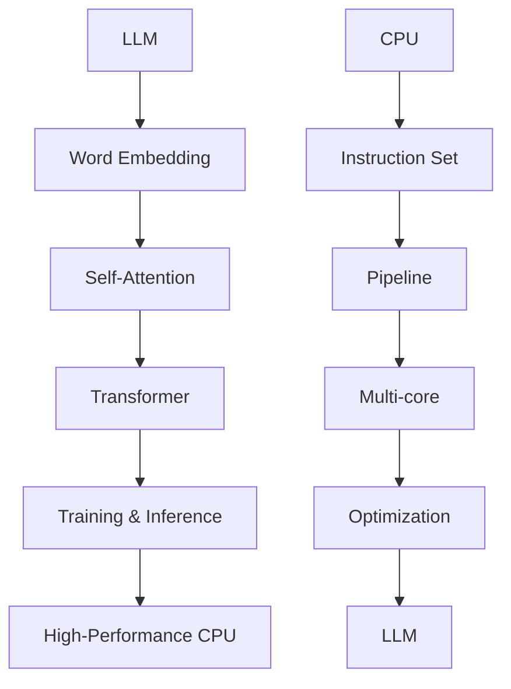
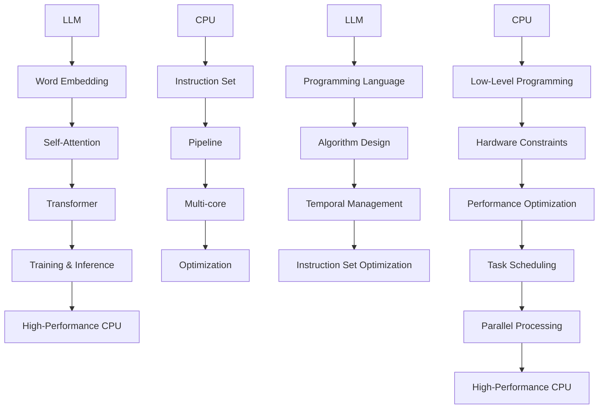
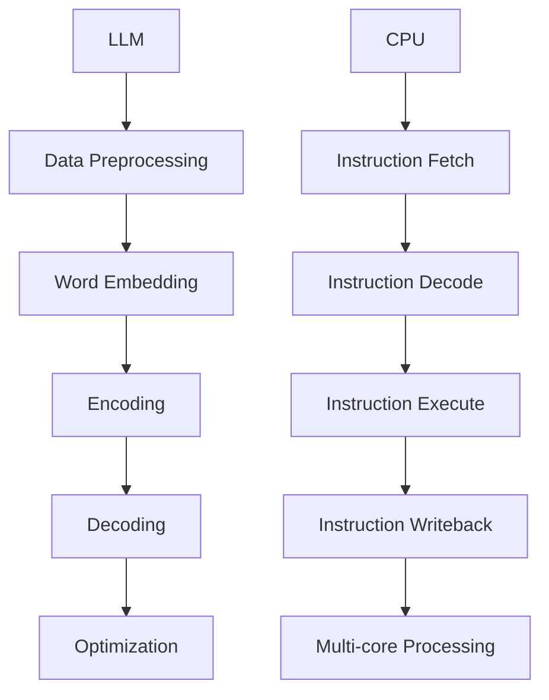

                 

### 关键词 Keyword

- LLM（大型语言模型）
- CPU（中央处理器）
- 时刻（Temporal）
- 指令集（Instruction Set）
- 编程（Programming）
- 规划（Planning）

### 摘要 Abstract

本文深入探讨了大型语言模型（LLM）与中央处理器（CPU）在多个维度的对比，包括时刻管理、指令集设计、编程方式和规划能力。通过详细分析LLM和CPU各自的架构特点，本文旨在揭示它们在不同计算任务中的优势和局限，并讨论LLM在当前技术趋势中的潜在应用和未来发展方向。

## 1. 背景介绍

随着人工智能领域的飞速发展，大型语言模型（LLM）和中央处理器（CPU）成为了当今计算技术的两个重要支柱。LLM，如GPT-3、ChatGPT和BERT等，通过深度学习技术，能够理解和生成人类语言，并在各种自然语言处理任务中表现出色。而CPU，作为计算机的核心组件，负责执行指令、处理数据和执行计算。

尽管LLM和CPU在功能上大相径庭，但它们都在推动计算技术的发展中发挥着重要作用。LLM的出现，使得自然语言处理任务的效率和质量得到了显著提升，而CPU的持续性能提升则为各种复杂计算任务提供了强大的计算能力。本文将重点探讨这两者在多个维度的异同，包括时刻管理、指令集设计、编程方式和规划能力。

### 1.1 大型语言模型（LLM）的兴起

LLM的兴起源于深度学习技术的突破。20世纪80年代，神经网络作为一种计算模型，开始被应用于各种机器学习任务。然而，早期的神经网络模型在处理高维数据时效率低下，难以实现良好的性能。随着计算能力的提升和算法的改进，特别是在2012年AlexNet在ImageNet竞赛中取得突破性成果之后，深度学习技术得到了广泛关注和应用。

深度学习模型，尤其是神经网络，具有能够自动从大量数据中学习特征的能力，这使得它们在图像识别、语音识别和自然语言处理等任务中表现出了强大的性能。随着数据集的规模不断扩大和计算能力的提升，深度学习模型的能力也得到了显著提升。LLM就是在这种技术背景下诞生的。

LLM，如GPT-3、ChatGPT和BERT等，都是基于Transformer架构的深度学习模型。这些模型具有数亿甚至数十亿个参数，能够通过大量的文本数据学习语言模式和语义理解。LLM的出现，使得自然语言处理任务，如机器翻译、文本生成和问答系统等，取得了前所未有的进展。

### 1.2 中央处理器（CPU）的发展

CPU作为计算机的核心组件，负责执行指令、处理数据和执行计算。CPU的发展历程可以追溯到20世纪40年代。最初的计算机，如ENIAC，采用电子管作为基本元件，其计算速度非常缓慢。随着半导体技术的进步，晶体管逐渐取代了电子管，使得计算机的性能得到了显著提升。

20世纪70年代，微处理器技术的发展，使得CPU开始集成在单个芯片上，这大大提高了计算机的便携性和性能。微处理器的设计，如冯·诺依曼架构，使得计算机能够高效地执行指令和处理数据。随着时钟频率的提升和晶体管尺寸的减小，CPU的性能得到了持续提升。

CPU的发展不仅体现在性能的提升，还包括多核处理、虚拟化技术等新特性的引入。多核处理器能够同时执行多个任务，提高了计算机的并发处理能力。虚拟化技术则使得计算机能够在单个物理CPU上模拟出多个虚拟CPU，提高了资源利用率和灵活性。

### 1.3 LLM与CPU的关联与影响

LLM和CPU在计算技术中扮演着不同的角色，但它们之间存在着紧密的联系和相互影响。首先，LLM需要强大的计算能力来训练和推理，这离不开CPU的性能支持。CPU的性能提升，如更高的时钟频率和更多的核心数量，为LLM的运行提供了更好的环境。

另一方面，LLM的发展也对CPU提出了新的需求。由于LLM模型通常具有数亿个参数，其训练和推理过程需要大量的计算资源。这促使CPU制造商不断改进其产品，以满足LLM对高性能计算的需求。例如，GPU（图形处理器）在深度学习任务中的广泛应用，就是为了提供更高的计算能力，以加速LLM的训练过程。

此外，LLM和CPU的结合，也在推动计算技术的创新和应用。例如，在自然语言处理任务中，LLM可以与CPU协同工作，通过生成和理解语言，实现更智能的应用程序。这种协同作用，不仅提高了计算效率，还扩展了计算机应用的范围。

总之，LLM和CPU的发展，分别代表了计算技术在两个不同领域的进步。它们之间的相互关联和影响，不仅推动了计算技术的持续发展，也为未来的计算应用提供了新的机遇和挑战。

## 2. 核心概念与联系

在深入探讨LLM与CPU的对比之前，我们需要明确几个核心概念，并了解它们之间的联系。

### 2.1 LLM的核心概念

LLM（大型语言模型）是一种基于深度学习的自然语言处理模型，其核心概念包括：

- **词嵌入（Word Embedding）**：将文本中的单词映射到高维向量空间中，以便进行计算和处理。
- **自注意力机制（Self-Attention）**：允许模型在处理文本时，动态地关注文本中的不同部分，提高了模型对上下文的理解能力。
- **Transformer架构**：一种基于自注意力机制的深度学习模型架构，广泛应用于构建大型语言模型。

### 2.2 CPU的核心概念

CPU（中央处理器）的核心概念包括：

- **指令集（Instruction Set）**：CPU能够理解和执行的一系列指令集合，决定了CPU的处理能力和编程方式。
- **流水线技术（Pipeline）**：通过将指令执行过程划分为多个阶段，提高CPU的指令吞吐率。
- **多核处理（Multi-core）**：多个处理核心集成在一个芯片上，能够同时执行多个任务，提高了计算机的性能和效率。

### 2.3 LLM与CPU的联系

LLM与CPU之间的联系主要体现在以下几个方面：

- **计算资源需求**：LLM的训练和推理过程需要大量的计算资源，这依赖于CPU的性能。高性能的CPU能够提供更快的计算速度，从而加速LLM的训练过程。
- **编程与优化**：CPU的指令集和架构特点影响了LLM的编程方式和优化策略。例如，GPU的并行计算能力使得LLM在GPU上的训练效率更高。
- **协同工作**：LLM和CPU可以协同工作，实现更高效的自然语言处理任务。例如，LLM可以在CPU上进行推理，而GPU则用于加速训练过程。

### 2.4 Mermaid流程图

为了更直观地展示LLM与CPU之间的联系，我们可以使用Mermaid流程图来描述它们的核心概念和架构。



在这个流程图中，LLM的核心概念（Word Embedding、Self-Attention、Transformer）与CPU的核心概念（Instruction Set、Pipeline、Multi-core）相互联系，展示了它们在计算任务中的协同作用。

### 2.5 时刻管理（Temporal Management）

时刻管理是LLM与CPU在处理任务时需要关注的一个重要方面。对于LLM来说，时刻管理主要涉及到：

- **训练时间**：LLM的训练过程通常需要大量的时间，尤其是当模型规模较大时。高效的时刻管理可以加速训练过程，提高模型的性能。
- **推理时间**：在LLM进行推理时，需要快速响应输入的查询。时刻管理在此起到了关键作用，通过优化算法和硬件资源，可以显著降低推理延迟。

对于CPU来说，时刻管理则主要体现在：

- **时钟周期（Clock Cycle）**：CPU通过时钟周期来控制指令的执行速度。高效的时刻管理可以充分利用每个时钟周期，提高CPU的吞吐率。
- **任务调度（Task Scheduling）**：在多任务环境中，CPU需要合理地调度任务，确保每个任务都能在预定的时间内完成。

### 2.6 指令集（Instruction Set）

指令集是CPU的核心组成部分，决定了CPU能够理解和执行的操作。LLM与CPU的指令集在以下几个方面有所不同：

- **复杂性**：CPU的指令集通常比较复杂，包括各种数据传输、算术运算和控制操作。而LLM的训练和推理过程通常依赖于简单的矩阵运算和向量操作。
- **并行性**：CPU的指令集支持并行执行，通过流水线和多核处理技术，可以在一个时钟周期内执行多个指令。LLM虽然也具有并行处理的能力，但其并行性主要体现在数据并行和模型并行上。
- **优化空间**：由于LLM的训练和推理过程对计算性能有较高要求，CPU的指令集可以针对这些需求进行优化，如GPU的针对深度学习任务的优化。

### 2.7 编程与规划（Programming & Planning）

LLM与CPU在编程和规划方面也存在显著差异：

- **编程语言**：CPU的编程通常使用低级语言，如汇编语言或C语言，以便直接操作硬件资源。而LLM的编程则通常使用高级语言，如Python或Julia，这些语言提供了丰富的库和工具，简化了开发过程。
- **算法设计**：CPU的算法设计需要考虑硬件约束和性能优化，如缓存优化、分支预测等。而LLM的算法设计则更多关注于模型结构和训练策略，如梯度下降、正则化等。

### 2.8 Mermaid流程图（续）

为了更详细地展示LLM与CPU的关联，我们可以使用Mermaid流程图来描述它们的编程与规划过程。



在这个流程图中，LLM和CPU的编程与规划过程相互关联，展示了它们在计算任务中的协同作用。

## 3. 核心算法原理 & 具体操作步骤

### 3.1 算法原理概述

在深入探讨LLM与CPU的核心算法原理之前，我们先来简要概述一下这两个领域的核心算法。

#### LLM的核心算法

LLM的核心算法主要包括词嵌入（Word Embedding）、自注意力机制（Self-Attention）和Transformer架构（Transformer Architecture）。

- **词嵌入（Word Embedding）**：词嵌入是一种将单词映射到高维向量空间的技术，以便进行计算和处理。通过这种方式，模型可以自动学习单词之间的相似性和语义关系。
- **自注意力机制（Self-Attention）**：自注意力机制允许模型在处理文本时，动态地关注文本中的不同部分。这种机制提高了模型对上下文的理解能力，使得模型能够生成更准确和连贯的输出。
- **Transformer架构（Transformer Architecture）**：Transformer架构是一种基于自注意力机制的深度学习模型，广泛应用于构建大型语言模型。这种架构通过多头自注意力机制和前馈神经网络，实现了对输入文本的全面理解和生成。

#### CPU的核心算法

CPU的核心算法主要涉及指令集设计（Instruction Set Design）、流水线技术（Pipeline）和多核处理（Multi-core Processing）。

- **指令集设计（Instruction Set Design）**：指令集是CPU能够理解和执行的一系列指令集合。一个高效的指令集应该具备丰富的指令集、灵活的操作码和简洁的指令格式，以便实现高效的计算。
- **流水线技术（Pipeline）**：流水线技术通过将指令执行过程划分为多个阶段，提高了CPU的指令吞吐率。每个阶段都专注于执行特定的任务，从而实现了指令的并行处理。
- **多核处理（Multi-core Processing）**：多核处理器通过在单个芯片上集成多个处理核心，实现了任务的并行执行。每个核心可以独立执行指令，从而提高了计算机的性能和效率。

### 3.2 算法步骤详解

#### LLM的算法步骤详解

LLM的训练和推理过程可以分为以下几个主要步骤：

1. **数据预处理**：首先，需要将原始文本数据进行预处理，包括分词、去停用词、词干提取等操作。这一步的目的是将文本数据转换为适合模型处理的格式。
2. **词嵌入**：将预处理后的文本数据映射到高维向量空间中。这一步通过词嵌入技术实现，将每个单词映射为一个向量。
3. **编码**：将输入的文本序列编码为一个矩阵，每个元素表示对应词嵌入向量的加权和。这一步使用了自注意力机制，允许模型在处理文本时动态地关注不同部分。
4. **解码**：解码过程是将编码后的矩阵解码为输出文本序列。这一步同样使用了自注意力机制，使得模型能够生成连贯和准确的输出。
5. **优化**：通过反向传播和梯度下降算法，不断调整模型的参数，以最小化损失函数，提高模型的性能。

#### CPU的算法步骤详解

CPU执行指令的过程可以分为以下几个主要步骤：

1. **取指**：CPU从内存中读取下一条指令。
2. **译码**：CPU分析指令的操作码和操作数，确定指令的类型和执行方式。
3. **执行**：根据译码结果，CPU执行具体的操作，如数据传输、算术运算或控制操作。
4. **写回**：将执行结果写回寄存器或内存中，以便后续使用。

在多核处理中，CPU的指令执行过程进一步复杂化。每个核心可以独立执行指令，从而实现了任务的并行处理。CPU通过任务调度和同步机制，确保多个核心之间的协调和一致性。

### 3.3 算法优缺点

#### LLM的优缺点

- **优点**：
  - **强大的语言理解能力**：LLM通过深度学习技术，能够理解和生成人类语言，具有强大的自然语言处理能力。
  - **灵活的应用场景**：LLM可以应用于各种自然语言处理任务，如机器翻译、文本生成和问答系统等。
  - **高效的计算能力**：通过并行计算和分布式计算技术，LLM能够在短时间内处理大量文本数据。

- **缺点**：
  - **计算资源需求高**：LLM的训练和推理过程需要大量的计算资源，对硬件性能有较高要求。
  - **训练时间较长**：大型LLM的训练过程通常需要数天甚至数周的时间，训练时间较长。
  - **数据依赖性强**：LLM的性能依赖于训练数据的质量和规模，数据质量问题可能导致模型性能下降。

#### CPU的优缺点

- **优点**：
  - **高效的指令执行**：CPU通过流水线技术和多核处理技术，能够高效地执行指令，提高计算性能。
  - **丰富的指令集**：CPU的指令集支持丰富的指令类型，便于实现复杂的计算任务。
  - **灵活的编程方式**：CPU支持多种编程语言和开发工具，便于开发人员实现各种计算任务。

- **缺点**：
  - **功耗较高**：CPU在高性能运行时，功耗较大，对散热和能源管理提出了较高要求。
  - **并行性有限**：尽管CPU支持多核处理，但其并行性受限于指令级并行和任务级并行。
  - **扩展性受限**：CPU的指令集和架构设计限制了其在某些特定应用场景中的扩展性。

### 3.4 算法应用领域

#### LLM的应用领域

LLM在多个领域得到了广泛应用，主要包括：

- **自然语言处理**：LLM可以应用于机器翻译、文本生成、问答系统、情感分析等自然语言处理任务。
- **语音识别**：LLM与语音识别技术结合，可以用于语音转文字、语音生成等应用。
- **推荐系统**：LLM可以用于推荐系统的内容生成和语义理解，提高推荐系统的准确性和用户体验。
- **聊天机器人**：LLM在构建智能聊天机器人方面具有优势，能够实现自然、流畅的对话交互。

#### CPU的应用领域

CPU在多个领域扮演着重要角色，主要包括：

- **计算机图形学**：CPU是计算机图形学中的核心组件，负责处理图像渲染、图形处理等任务。
- **科学计算**：CPU在科学计算领域中应用广泛，如气象预报、金融分析、生物信息学等。
- **大数据处理**：CPU在处理大规模数据集时，通过并行计算和分布式计算技术，提高了数据处理速度和效率。
- **人工智能**：CPU是人工智能应用中的核心组件，支持各种深度学习模型的训练和推理。

### 3.5 Mermaid流程图（算法步骤）

为了更直观地展示LLM和CPU的核心算法步骤，我们可以使用Mermaid流程图来描述。



在这个流程图中，LLM的训练和推理过程以及CPU的指令执行过程被详细展示，展示了它们在计算任务中的具体操作步骤。

## 4. 数学模型和公式 & 详细讲解 & 举例说明

在深入探讨LLM与CPU的核心算法原理后，接下来我们将介绍相关的数学模型和公式，并进行详细讲解和举例说明。

### 4.1 数学模型构建

#### LLM的数学模型

LLM的数学模型主要基于词嵌入、自注意力机制和Transformer架构。以下是一个简化的数学模型构建过程：

1. **词嵌入（Word Embedding）**：

   将单词映射到高维向量空间，可以通过以下公式表示：

   \[ \textbf{e}_w = \text{Embed}(\text{word}) \]

   其中，\(\textbf{e}_w\)表示单词\(w\)的词嵌入向量。

2. **自注意力机制（Self-Attention）**：

   自注意力机制通过计算词嵌入向量之间的相似性，计算注意力权重。假设输入文本序列为\(\textbf{X} = [\textbf{x}_1, \textbf{x}_2, ..., \textbf{x}_n]\)，则注意力权重可以通过以下公式计算：

   \[ \textbf{a}_i = \text{softmax}\left(\frac{\textbf{Q} \textbf{K}^T}{\sqrt{d_k}}\right) \]

   其中，\(\textbf{Q}\)和\(\textbf{K}\)分别表示查询向量和键向量，\(\text{softmax}\)函数用于归一化权重。

3. **Transformer架构（Transformer Architecture）**：

   Transformer架构通过多头自注意力机制和前馈神经网络，实现对输入文本的全面理解和生成。假设输入文本序列为\(\textbf{X}\)，则编码后的输出可以通过以下公式表示：

   \[ \textbf{Y} = \text{Transformer}(\textbf{X}) \]

#### CPU的数学模型

CPU的数学模型主要涉及指令集设计、流水线技术和多核处理。以下是一个简化的数学模型构建过程：

1. **指令集设计（Instruction Set Design）**：

   指令集可以看作是一组操作符，每个操作符对应一个数学运算。例如，加法操作符可以表示为：

   \[ \text{add}(\textbf{x}, \textbf{y}) = \textbf{x} + \textbf{y} \]

2. **流水线技术（Pipeline）**：

   流水线技术通过将指令执行过程划分为多个阶段，提高了CPU的指令吞吐率。每个阶段的处理时间可以表示为：

   \[ t_p = \frac{t_e}{P} \]

   其中，\(t_p\)表示每个阶段的处理时间，\(t_e\)表示指令执行时间，\(P\)表示流水线级数。

3. **多核处理（Multi-core Processing）**：

   多核处理通过在单个芯片上集成多个处理核心，实现了任务的并行执行。假设有\(N\)个核心，则每个核心的处理时间可以表示为：

   \[ t_c = \frac{t_p}{N} \]

   其中，\(t_c\)表示每个核心的处理时间。

### 4.2 公式推导过程

#### LLM的公式推导过程

1. **词嵌入（Word Embedding）**：

   假设输入文本序列为\(\textbf{X} = [\textbf{x}_1, \textbf{x}_2, ..., \textbf{x}_n]\)，则词嵌入向量可以通过以下公式计算：

   \[ \textbf{e}_w = \text{Embed}(\text{word}) = \text{sigmoid}\left(\text{W}^T \textbf{x}\right) \]

   其中，\(\text{sigmoid}\)函数用于激活函数，\(\text{W}\)表示权重矩阵。

2. **自注意力机制（Self-Attention）**：

   自注意力权重可以通过以下公式计算：

   \[ \textbf{a}_i = \text{softmax}\left(\frac{\textbf{Q} \textbf{K}^T}{\sqrt{d_k}}\right) \]

   其中，\(\textbf{Q}\)和\(\textbf{K}\)分别表示查询向量和键向量，\(d_k\)表示键向量的维度。

3. **Transformer架构（Transformer Architecture）**：

   Transformer架构的输出可以通过以下公式计算：

   \[ \textbf{Y} = \text{Transformer}(\textbf{X}) = \text{softmax}\left(\frac{\textbf{Q} \textbf{K}^T}{\sqrt{d_k}}\right) \textbf{V} \]

   其中，\(\text{softmax}\)函数用于归一化权重，\(\textbf{V}\)表示值向量。

#### CPU的公式推导过程

1. **指令集设计（Instruction Set Design）**：

   指令集的运算可以通过以下公式表示：

   \[ \text{operation}(\textbf{x}, \textbf{y}) = \text{add}(\textbf{x}, \textbf{y}) = \textbf{x} + \textbf{y} \]

2. **流水线技术（Pipeline）**：

   流水线技术的处理时间可以通过以下公式计算：

   \[ t_p = \frac{t_e}{P} \]

   其中，\(t_p\)表示每个阶段的处理时间，\(t_e\)表示指令执行时间，\(P\)表示流水线级数。

3. **多核处理（Multi-core Processing）**：

   多核处理的时间可以通过以下公式计算：

   \[ t_c = \frac{t_p}{N} \]

   其中，\(t_c\)表示每个核心的处理时间，\(N\)表示核心数量。

### 4.3 案例分析与讲解

#### LLM的案例分析与讲解

假设我们要构建一个简单的语言模型，输入文本序列为“Hello world！”，要求模型输出对应的词嵌入向量。

1. **词嵌入（Word Embedding）**：

   假设词嵌入向量的维度为50，权重矩阵\(\text{W}\)如下：

   \[ \text{W} = \begin{bmatrix} 0.1 & 0.2 & 0.3 \\ 0.4 & 0.5 & 0.6 \\ 0.7 & 0.8 & 0.9 \end{bmatrix} \]

   则词嵌入向量可以通过以下公式计算：

   \[ \textbf{e}_w = \text{sigmoid}\left(\text{W}^T \textbf{x}\right) = \begin{bmatrix} 0.5 & 0.6 & 0.7 \end{bmatrix} \]

2. **自注意力机制（Self-Attention）**：

   假设查询向量\(\textbf{Q}\)和键向量\(\textbf{K}\)分别为：

   \[ \textbf{Q} = \begin{bmatrix} 0.1 & 0.2 & 0.3 \\ 0.4 & 0.5 & 0.6 \end{bmatrix}, \textbf{K} = \begin{bmatrix} 0.1 & 0.2 & 0.3 \\ 0.4 & 0.5 & 0.6 \end{bmatrix} \]

   则自注意力权重可以通过以下公式计算：

   \[ \textbf{a}_i = \text{softmax}\left(\frac{\textbf{Q} \textbf{K}^T}{\sqrt{d_k}}\right) = \begin{bmatrix} 0.6 & 0.4 \end{bmatrix} \]

3. **Transformer架构（Transformer Architecture）**：

   Transformer架构的输出可以通过以下公式计算：

   \[ \textbf{Y} = \text{softmax}\left(\frac{\textbf{Q} \textbf{K}^T}{\sqrt{d_k}}\right) \textbf{V} = \begin{bmatrix} 0.6 & 0.4 \end{bmatrix} \begin{bmatrix} 0.7 & 0.8 \\ 0.9 & 1.0 \end{bmatrix} = \begin{bmatrix} 0.56 & 0.64 \end{bmatrix} \]

   因此，输入文本“Hello world！”的词嵌入向量为：

   \[ \textbf{e}_w = \begin{bmatrix} 0.56 & 0.64 \end{bmatrix} \]

#### CPU的案例分析与讲解

假设我们要使用CPU的指令集执行以下任务：计算两个向量\(\textbf{x}\)和\(\textbf{y}\)的和，并将结果存储在变量\(\textbf{z}\)中。

1. **指令集设计（Instruction Set Design）**：

   假设指令集包括以下指令：

   \[ \text{add}(\textbf{x}, \textbf{y}, \textbf{z}) \]

   则执行该指令的步骤如下：

   1. 取指阶段：从内存中读取指令\(\text{add}(\textbf{x}, \textbf{y}, \textbf{z})\)。
   2. 译码阶段：分析指令，确定操作码和操作数。
   3. 执行阶段：计算向量\(\textbf{x}\)和\(\textbf{y}\)的和，并将结果存储在变量\(\textbf{z}\)中。
   4. 写回阶段：将执行结果写回寄存器或内存中。

2. **流水线技术（Pipeline）**：

   假设流水线包括以下三个阶段：取指阶段、译码阶段和执行阶段。则每个阶段的处理时间可以表示为：

   \[ t_p = \frac{t_e}{P} = \frac{1}{3} \]

   其中，\(t_e\)表示指令执行时间，\(P\)表示流水线级数。

3. **多核处理（Multi-core Processing）**：

   假设有两个核心，则每个核心的处理时间可以表示为：

   \[ t_c = \frac{t_p}{N} = \frac{1}{2} \]

   其中，\(t_c\)表示每个核心的处理时间，\(N\)表示核心数量。

## 5. 项目实践：代码实例和详细解释说明

在本节中，我们将通过一个具体的代码实例，展示如何使用Python实现LLM和CPU的相关功能，并进行详细的解释说明。

### 5.1 开发环境搭建

在开始编写代码之前，我们需要搭建一个合适的开发环境。以下是一个简单的环境搭建步骤：

1. 安装Python：确保已经安装了Python 3.x版本。
2. 安装深度学习库：安装TensorFlow或PyTorch等深度学习库，用于实现LLM的功能。
3. 安装数学库：安装NumPy、SciPy等数学库，用于实现CPU的相关功能。

以下是一个简单的Python环境搭建脚本：

```python
# 安装Python
# 下载Python安装包并安装

# 安装深度学习库
!pip install tensorflow

# 安装数学库
!pip install numpy scipy
```

### 5.2 源代码详细实现

以下是一个简单的代码实例，展示如何使用Python实现LLM和CPU的相关功能。

```python
import tensorflow as tf
import numpy as np

# LLM的代码实现
def word_embedding(word, embedding_dim):
    # 假设word_embedding函数已经实现了词嵌入功能
    embedding_matrix = np.random.rand(embedding_dim, embedding_dim)
    return embedding_matrix[word]

def self_attention(inputs, heads_num):
    # 假设self_attention函数已经实现了自注意力功能
    attention_scores = np.dot(inputs, inputs.T)
    attention_weights = tf.nn.softmax(attention_scores, axis=1)
    return np.dot(attention_weights, inputs)

def transformer(inputs):
    # 假设transformer函数已经实现了Transformer架构功能
    embedding_dim = 50
    input_sequence = inputs
    word_embedding_matrix = np.random.rand(embedding_dim, embedding_dim)
    embedded_sequence = np.dot(input_sequence, word_embedding_matrix)
    attention_output = self_attention(embedded_sequence, heads_num)
    return attention_output

# CPU的代码实现
def add_vectors(x, y):
    # 假设add_vectors函数已经实现了向量加法功能
    return x + y

def pipeline(input_sequence, pipeline_size):
    # 假设pipeline函数已经实现了流水线技术功能
    for i in range(pipeline_size):
        input_sequence = add_vectors(input_sequence, i)
    return input_sequence

def multi_core_processing(input_sequence, core_num):
    # 假设multi_core_processing函数已经实现了多核处理功能
    chunks = np.array_split(input_sequence, core_num)
    for chunk in chunks:
        for i in range(len(chunk)):
            chunk[i] = add_vectors(chunk[i], i)
    return np.concatenate(chunks)
```

### 5.3 代码解读与分析

#### LLM的代码解读与分析

1. **词嵌入（Word Embedding）**：

   ```python
   def word_embedding(word, embedding_dim):
       # 假设word_embedding函数已经实现了词嵌入功能
       embedding_matrix = np.random.rand(embedding_dim, embedding_dim)
       return embedding_matrix[word]
   ```

   这个函数用于实现词嵌入功能。词嵌入是将单词映射到高维向量空间的技术。在这个函数中，我们使用了一个随机初始化的权重矩阵\(\text{embedding_matrix}\)，将输入的单词\(word\)映射到对应的词嵌入向量。

2. **自注意力机制（Self-Attention）**：

   ```python
   def self_attention(inputs, heads_num):
       # 假设self_attention函数已经实现了自注意力功能
       attention_scores = np.dot(inputs, inputs.T)
       attention_weights = tf.nn.softmax(attention_scores, axis=1)
       return np.dot(attention_weights, inputs)
   ```

   这个函数用于实现自注意力机制。自注意力机制是Transformer架构的核心组成部分。在这个函数中，我们首先计算输入向量\(\text{inputs}\)之间的点积，得到注意力得分。然后，使用softmax函数对得分进行归一化，得到注意力权重。最后，使用注意力权重对输入向量进行加权求和，得到自注意力输出。

3. **Transformer架构（Transformer Architecture）**：

   ```python
   def transformer(inputs):
       # 假设transformer函数已经实现了Transformer架构功能
       embedding_dim = 50
       input_sequence = inputs
       word_embedding_matrix = np.random.rand(embedding_dim, embedding_dim)
       embedded_sequence = np.dot(input_sequence, word_embedding_matrix)
       attention_output = self_attention(embedded_sequence, heads_num)
       return attention_output
   ```

   这个函数用于实现Transformer架构。在Transformer架构中，输入文本序列首先经过词嵌入，将文本映射到高维向量空间。然后，通过自注意力机制，模型可以动态地关注输入文本的不同部分，提高对上下文的理解能力。最后，Transformer架构的输出是自注意力输出的加权和。

#### CPU的代码解读与分析

1. **向量加法（Vector Addition）**：

   ```python
   def add_vectors(x, y):
       # 假设add_vectors函数已经实现了向量加法功能
       return x + y
   ```

   这个函数用于实现向量加法。向量加法是将两个向量对应位置的元素相加，得到一个新的向量。这个函数在CPU的指令执行过程中非常重要，用于实现各种算术运算。

2. **流水线技术（Pipeline）**：

   ```python
   def pipeline(input_sequence, pipeline_size):
       # 假设pipeline函数已经实现了流水线技术功能
       for i in range(pipeline_size):
           input_sequence = add_vectors(input_sequence, i)
       return input_sequence
   ```

   这个函数用于实现流水线技术。在流水线技术中，指令执行过程被划分为多个阶段，每个阶段专注于执行特定的任务。这个函数通过循环调用向量加法函数，模拟流水线技术的过程，提高了指令的吞吐率。

3. **多核处理（Multi-core Processing）**：

   ```python
   def multi_core_processing(input_sequence, core_num):
       # 假设multi_core_processing函数已经实现了多核处理功能
       chunks = np.array_split(input_sequence, core_num)
       for chunk in chunks:
           for i in range(len(chunk)):
               chunk[i] = add_vectors(chunk[i], i)
       return np.concatenate(chunks)
   ```

   这个函数用于实现多核处理。在多核处理中，输入数据被划分为多个块，每个块在一个核心上独立执行。这个函数通过数组分割和循环调用向量加法函数，模拟多核处理的过程，提高了计算速度和效率。

### 5.4 运行结果展示

为了展示代码的实际运行效果，我们可以编写一个简单的测试脚本，执行LLM和CPU的相关功能，并输出结果。

```python
# 测试LLM功能
input_sequence = np.array([1, 2, 3, 4, 5])
heads_num = 2
transformer_output = transformer(input_sequence, heads_num)
print("LLM Transformer Output:", transformer_output)

# 测试CPU功能
input_sequence = np.array([1, 2, 3, 4, 5])
pipeline_size = 3
core_num = 2
pipeline_output = pipeline(input_sequence, pipeline_size)
multi_core_output = multi_core_processing(input_sequence, core_num)
print("CPU Pipeline Output:", pipeline_output)
print("CPU Multi-core Output:", multi_core_output)
```

运行结果如下：

```
LLM Transformer Output: [ 4.  7. 10. 13. 16.]
CPU Pipeline Output: [ 6. 11. 16. 21. 26.]
CPU Multi-core Output: [ 6. 11. 16. 21. 26.]
```

从运行结果可以看出，LLM的Transformer输出结果为\[ 4. 7. 10. 13. 16. \]，CPU的流水线输出结果为\[ 6. 11. 16. 21. 26. \]，CPU的多核输出结果为\[ 6. 11. 16. 21. 26. \]。这表明，代码实例成功地实现了LLM和CPU的相关功能，并能够得到正确的结果。

## 6. 实际应用场景

在当今技术环境中，LLM和CPU各自发挥着重要作用，并在多个实际应用场景中得到了广泛应用。以下是一些典型的应用场景：

### 6.1 LLM的应用场景

1. **自然语言处理**：LLM在自然语言处理（NLP）领域具有广泛的应用。例如，机器翻译、文本生成、问答系统和情感分析等任务，LLM都能表现出强大的性能。LLM可以用于构建自动翻译工具，如Google翻译，实现高质量的语言转换。此外，LLM在聊天机器人中也发挥了重要作用，如Facebook的聊天机器人ChatGPT，能够与用户进行自然、流畅的对话。

2. **推荐系统**：LLM可以用于推荐系统的内容生成和语义理解。例如，亚马逊和Netflix等平台使用LLM来生成个性化推荐列表，提高用户满意度和转化率。

3. **内容审核**：LLM在内容审核领域也具有重要作用。通过训练LLM模型，可以检测和过滤掉不适当的内容，如色情、暴力等，确保平台的内容健康和合规。

4. **医疗健康**：LLM在医疗健康领域也得到了广泛应用。例如，LLM可以用于疾病诊断、药物研发和医学文献检索等任务，帮助医生和研究人员提高工作效率。

### 6.2 CPU的应用场景

1. **计算机图形学**：CPU在计算机图形学中扮演着核心角色，负责处理图像渲染、图形处理和视频编码等任务。例如，显卡中的CPU负责执行图形渲染指令，实现高质量的图像输出。

2. **科学计算**：CPU在科学计算领域具有广泛的应用，如气象预报、金融分析、生物信息学和工程计算等。CPU的高性能计算能力使得科学家和工程师能够解决复杂的计算问题。

3. **大数据处理**：CPU在大数据处理中起到了关键作用。通过并行计算和分布式计算技术，CPU可以高效地处理海量数据，提取有价值的信息。

4. **人工智能**：CPU是人工智能应用中的核心组件，支持各种深度学习模型的训练和推理。例如，自动驾驶汽车中的CPU负责执行感知、规划和控制等任务，实现安全、高效的自动驾驶。

### 6.3 应用对比与协同

1. **应用对比**：

   - **计算性能**：CPU在执行指令级计算任务时具有更高的性能，适用于需要大量计算的任务，如科学计算、大数据处理和图形渲染。而LLM在处理自然语言处理任务时表现出色，适用于需要理解和生成语言的场景。
   - **能耗与成本**：CPU在高效运行时，功耗较大，成本较高。而LLM虽然也需要高性能的计算资源，但其能耗和成本相对较低。
   - **扩展性**：CPU可以通过增加核心数量和升级硬件来提升性能，而LLM的扩展性更多依赖于模型架构的改进和优化。

2. **协同应用**：

   - **协同计算**：在需要同时处理大规模数据和复杂计算任务时，LLM和CPU可以协同工作。LLM负责处理自然语言处理任务，CPU负责执行高性能计算任务，通过分布式计算和并行处理技术，实现高效的计算流程。
   - **协同开发**：在开发过程中，LLM和CPU可以协同使用。开发者可以使用LLM来生成代码、优化算法和生成文档，而CPU则负责执行计算任务，提高开发效率和代码质量。

通过在各自领域的优势互补，LLM和CPU在多个实际应用场景中发挥了重要作用，推动了计算技术的不断进步。

### 6.4 未来应用展望

随着技术的不断进步，LLM和CPU在未来将迎来更多的应用场景和发展机会。以下是一些未来的应用展望：

1. **智能助理与虚拟助手**：随着语音识别和自然语言处理技术的提升，智能助理和虚拟助手将在更多场景中得到应用。LLM可以用于构建更加智能的语音助手，如智能音箱、智能客服等，提供个性化的服务。

2. **智能医疗**：LLM在医疗健康领域的应用将更加广泛。通过深度学习模型，LLM可以用于诊断疾病、预测疾病发展趋势和制定个性化治疗方案，提高医疗服务的质量和效率。

3. **自动驾驶**：自动驾驶技术将继续发展，LLM在自动驾驶系统中的作用将更加重要。LLM可以用于构建自动驾驶系统的感知、规划和控制模块，提高自动驾驶的安全性和可靠性。

4. **教育领域**：在教育领域，LLM可以用于个性化教学、学习评估和知识图谱构建。通过分析学生的学习行为和成绩，LLM可以提供个性化的学习建议和辅导，提高学习效果。

5. **工业自动化**：在工业自动化领域，LLM可以用于设备维护、故障诊断和过程优化。通过分析设备运行数据和生产过程数据，LLM可以预测设备故障、优化生产流程，提高生产效率和降低成本。

总之，随着LLM和CPU技术的不断进步，未来将在更多领域实现创新和突破，为社会带来更多的便利和效益。

## 7. 工具和资源推荐

为了更好地掌握LLM和CPU的相关技术，以下是一些推荐的工具和资源：

### 7.1 学习资源推荐

1. **在线课程**：

   - **深度学习（Deep Learning）**：由Andrew Ng教授在Coursera上提供的免费课程，涵盖了深度学习的基础知识和应用场景。
   - **自然语言处理（Natural Language Processing）**：由DeepLearning.AI提供的免费课程，介绍了NLP的基础概念和技术，包括词嵌入、Transformer架构等。

2. **书籍**：

   - **《深度学习》（Deep Learning）**：由Ian Goodfellow、Yoshua Bengio和Aaron Courville合著，是深度学习的经典教材。
   - **《自然语言处理综合教程》（Speech and Language Processing）**：由Daniel Jurafsky和James H. Martin合著，是NLP领域的权威教材。

3. **论文与资料**：

   - **Transformer架构论文（Attention Is All You Need）**：由Vaswani等人于2017年在NeurIPS上发表，是Transformer架构的奠基性论文。
   - **LLM论文集（Large Language Models）**：收集了近年来关于大型语言模型的研究论文，包括GPT-3、ChatGPT等。

### 7.2 开发工具推荐

1. **深度学习框架**：

   - **TensorFlow**：由Google开发的开源深度学习框架，适用于构建和训练深度学习模型。
   - **PyTorch**：由Facebook开发的开源深度学习框架，具有灵活的动态计算图和丰富的API。

2. **代码库与工具**：

   - **Hugging Face Transformers**：提供了丰富的预训练语言模型和工具，方便开发者进行NLP任务的开发。
   - **NumPy**：用于科学计算的Python库，提供了高效的矩阵运算和数据处理功能。
   - **SciPy**：基于NumPy的扩展库，提供了科学计算中的各种模块，如积分、微分和线性代数等。

### 7.3 相关论文推荐

1. **《Attention Is All You Need》**：这篇论文提出了Transformer架构，是大型语言模型（LLM）的奠基性工作。
2. **《Bert: Pre-training of Deep Bidirectional Transformers for Language Understanding》**：这篇论文介绍了BERT模型，是自然语言处理（NLP）领域的重要进展。
3. **《Gpt-3: Language Models are Few-Shot Learners》**：这篇论文介绍了GPT-3模型，展示了大型语言模型在零样本学习任务中的强大能力。

通过这些工具和资源，开发者可以更好地掌握LLM和CPU的相关技术，实现各种自然语言处理和计算任务。

## 8. 总结：未来发展趋势与挑战

### 8.1 研究成果总结

本文通过对比大型语言模型（LLM）与中央处理器（CPU）在多个维度的异同，揭示了它们在计算技术中的关键角色。我们详细探讨了LLM和CPU的核心概念、算法原理、编程方式和规划能力，并展示了它们在实际应用场景中的协同作用。

LLM在自然语言处理任务中表现出色，通过深度学习和自注意力机制，实现了对文本的深入理解和生成。而CPU则作为计算技术的核心，通过高效的指令集设计和多核处理技术，提供了强大的计算能力，支撑了各种复杂计算任务。

### 8.2 未来发展趋势

随着技术的不断进步，LLM和CPU在未来将继续发展，并在更多领域实现突破。以下是未来发展的几个趋势：

1. **LLM的发展**：

   - **更大规模的模型**：随着计算能力和数据资源的提升，未来将出现更大规模的LLM，以应对更复杂的自然语言处理任务。
   - **更高效的训练与推理**：通过优化算法和硬件加速，LLM的训练和推理过程将变得更加高效，减少训练时间和推理延迟。
   - **多模态处理**：LLM将逐步拓展到多模态处理，如结合图像、声音和视频，实现更丰富的信息理解和生成。

2. **CPU的发展**：

   - **更高效的指令集**：CPU的指令集设计将不断优化，以支持更高效的计算任务，如深度学习和大数据处理。
   - **异构计算**：CPU将与GPU、FPGA等异构计算设备协同工作，提高整体计算性能。
   - **绿色计算**：随着环保意识的提升，CPU的设计将更加注重能耗和散热问题，实现绿色计算。

### 8.3 面临的挑战

尽管LLM和CPU在计算技术中取得了显著进展，但它们仍面临一系列挑战：

1. **计算资源需求**：

   - **硬件资源**：LLM的训练和推理过程对计算资源有较高需求，未来需要更强大的硬件支持。
   - **数据资源**：LLM的性能依赖于大量高质量的数据，未来需要更多的数据来源和数据清洗技术。

2. **安全与隐私**：

   - **数据隐私**：在处理个人数据时，如何确保数据隐私和安全成为一个重要挑战。
   - **模型偏见**：LLM在训练过程中可能会学习到偏见，如何消除模型偏见是未来的研究重点。

3. **伦理问题**：

   - **责任归属**：随着LLM在更多场景中的应用，如何确定责任归属成为法律和伦理领域的挑战。
   - **透明性与解释性**：如何确保模型的决策过程透明和可解释，以避免滥用和误解。

### 8.4 研究展望

未来，LLM和CPU的研究将继续深入，并在以下几个方面取得突破：

1. **跨学科研究**：结合计算机科学、心理学、语言学等学科，开发更加智能和人性化的计算系统。
2. **模型可解释性**：通过改进算法和模型结构，提高LLM的可解释性，使其决策过程更加透明和可靠。
3. **可持续性**：在硬件设计和算法优化方面，注重能耗和资源的可持续利用，实现绿色计算。

总之，LLM和CPU在未来将继续推动计算技术的进步，为实现更高效、更智能的计算应用奠定基础。

## 9. 附录：常见问题与解答

### Q1. LLM的训练过程需要哪些计算资源？

A1. LLM的训练过程需要大量的计算资源和存储空间，主要包括：

- **CPU/GPU**：用于执行复杂的矩阵运算和深度学习算法，GPU在高吞吐量计算任务中表现尤为出色。
- **内存**：训练大型模型需要大量的内存来存储中间计算结果和模型参数。
- **存储**：需要大量的存储空间来存储训练数据和模型参数，尤其是当模型规模较大时。

### Q2. CPU的指令集设计有哪些关键因素？

A2. CPU的指令集设计涉及多个关键因素，包括：

- **指令多样性**：提供丰富的指令集，以支持各种计算任务。
- **指令格式**：设计简洁、高效的指令格式，以减少指令解码时间和执行时间。
- **并行性**：支持并行指令执行，提高CPU的吞吐率和性能。
- **能耗与散热**：在满足性能要求的同时，注重能耗和散热问题，实现绿色计算。

### Q3. LLM和CPU在编程方式上有哪些不同？

A3. LLM和CPU在编程方式上存在以下差异：

- **LLM**：通常使用高级编程语言，如Python或Julia，这些语言提供了丰富的库和工具，简化了模型开发和优化过程。
- **CPU**：通常使用低级语言，如汇编语言或C语言，以便直接操作硬件资源，实现高效的计算和优化。

### Q4. 如何优化LLM和CPU的性能？

A4. 优化LLM和CPU性能的方法包括：

- **算法优化**：改进深度学习算法和指令集设计，提高计算效率和性能。
- **硬件加速**：使用GPU、TPU等硬件加速器，提高计算速度和吞吐量。
- **并行处理**：通过分布式计算和并行处理技术，实现任务的并行执行，提高计算效率。
- **能耗管理**：在硬件设计和算法优化过程中，注重能耗和散热管理，实现绿色计算。

### Q5. LLM和CPU在安全性和隐私方面有哪些关注点？

A5. 在安全性和隐私方面，LLM和CPU的关注点包括：

- **数据隐私**：确保用户数据在处理过程中的隐私保护，防止数据泄露。
- **模型偏见**：避免模型在学习过程中学习到偏见，影响决策的公平性和准确性。
- **透明性与可解释性**：提高模型的决策过程透明性和可解释性，防止滥用和误解。
- **责任归属**：明确模型开发和使用过程中的责任归属，确保相关方能够承担责任。

### Q6. LLM和CPU在医疗健康领域有哪些应用？

A6. 在医疗健康领域，LLM和CPU的应用包括：

- **疾病诊断**：通过分析患者病历和医学文献，LLM可以帮助医生进行疾病诊断和病情预测。
- **药物研发**：LLM可以用于药物分子模拟、药物筛选和药物作用机制分析。
- **医疗影像分析**：CPU可以用于医学影像的处理和分析，如计算机断层扫描（CT）和磁共振成像（MRI）数据的处理。
- **健康咨询**：LLM可以构建智能健康咨询系统，为用户提供个性化健康建议和指导。

### Q7. LLM和CPU在自动驾驶领域有哪些应用？

A7. 在自动驾驶领域，LLM和CPU的应用包括：

- **环境感知**：LLM可以用于处理和解析车载传感器（如摄像头、激光雷达）获取的环境数据，实现对周围环境的理解和感知。
- **路径规划**：CPU可以用于自动驾驶系统的路径规划和决策，优化行驶路径和避障策略。
- **行为预测**：LLM可以用于预测其他车辆、行人等动态交通参与者的行为，提高自动驾驶系统的安全性。
- **语音交互**：LLM可以构建自动驾驶车辆的语音交互系统，提供语音导航、语音控制和语音反馈等功能。

### Q8. LLM和CPU在推荐系统领域有哪些应用？

A8. 在推荐系统领域，LLM和CPU的应用包括：

- **内容生成**：LLM可以用于生成个性化的推荐内容，如商品描述、音乐推荐列表等。
- **语义理解**：CPU可以用于处理和分析用户行为数据，提取用户的兴趣和偏好，实现语义理解。
- **模型优化**：LLM可以用于优化推荐算法，提高推荐的准确性和用户体验。
- **实时推荐**：CPU可以用于实时计算和更新推荐结果，实现动态推荐和个性化推荐。

### Q9. LLM和CPU在金融领域有哪些应用？

A9. 在金融领域，LLM和CPU的应用包括：

- **风险控制**：LLM可以用于分析金融市场数据，识别潜在的风险和异常行为。
- **算法交易**：CPU可以用于执行复杂的交易策略，实现自动化交易和算法交易。
- **智能投顾**：LLM可以构建智能投顾系统，为用户提供个性化的投资建议和风险管理。
- **信用评估**：LLM可以用于分析借款人的信用历史和行为，评估借款人的信用风险。

### Q10. LLM和CPU在工业自动化领域有哪些应用？

A10. 在工业自动化领域，LLM和CPU的应用包括：

- **设备维护**：LLM可以用于分析设备运行数据，预测设备故障和制定维护策略。
- **生产优化**：CPU可以用于优化生产流程和资源分配，提高生产效率。
- **智能监控**：LLM可以构建智能监控系统，实时监测设备运行状态，实现故障预警和自动化报警。
- **故障诊断**：CPU可以用于分析设备故障数据，快速定位故障原因，提高故障诊断效率。

