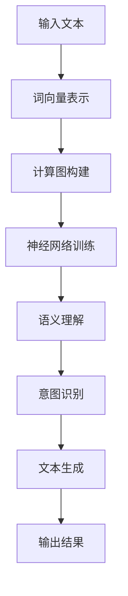

                 

关键词：大型语言模型(LLM)、人类意图、融合、自然语言处理、深度学习、机器学习、计算图、编程语言、人工智能。

## 摘要

本文探讨了大型语言模型（LLM）与人类意图的完美融合之路。随着自然语言处理技术的不断进步，LLM在生成式对话系统、文本生成、语言翻译等方面取得了显著的成果。然而，如何让LLM更好地理解并实现人类意图，仍然是一个具有挑战性的问题。本文从技术角度出发，分析了LLM的工作原理，探讨了与人类意图融合的机制，并提出了一种新的融合方法。文章旨在为开发者提供一些实用的建议，帮助他们在实际项目中实现LLM与人类意图的完美融合。

## 1. 背景介绍

在过去的几十年里，自然语言处理（NLP）技术取得了长足的进步。尤其是深度学习技术的发展，使得NLP在文本分类、情感分析、机器翻译等领域取得了显著的成果。随着数据集的不断扩大和计算资源的增加，大型语言模型（LLM）逐渐成为NLP领域的研究热点。LLM通过学习大量的语言数据，能够生成符合语法规则和语义逻辑的文本，从而在生成式对话系统、文本生成、语言翻译等方面展现出强大的能力。

然而，随着LLM的应用场景越来越广泛，如何让LLM更好地理解并实现人类意图，成为了一个亟待解决的问题。人类意图通常是指人们在特定场景下想要达到的目的或目标。这些意图可能包含多个层次，如表面意图、深层意图、隐含意图等。而LLM在生成文本时，往往只能根据输入的文本和数据集进行推理，很难直接理解人类意图。这就导致了一些实际应用中的问题，如对话系统无法准确理解用户的真实需求，文本生成不符合人类的预期等。

本文旨在探讨LLM与人类意图的完美融合之路，通过分析LLM的工作原理，提出一种新的融合方法，以帮助开发者实现LLM与人类意图的更好融合。

## 2. 核心概念与联系

### 2.1. 大型语言模型（LLM）

大型语言模型（LLM）是一种基于深度学习的自然语言处理模型。它通过学习大量的文本数据，可以生成符合语法规则和语义逻辑的文本。LLM的核心组成部分包括：

- **词向量表示**：将自然语言中的词语转换为向量表示，便于在神经网络中进行处理。
- **计算图**：用于表示语言模型中的计算过程，包括词向量、神经网络层、激活函数等。
- **训练算法**：用于调整模型参数，使其能够更好地拟合训练数据。

### 2.2. 人类意图

人类意图是指人们在特定场景下想要达到的目的或目标。人类意图通常包含多个层次，如表面意图、深层意图、隐含意图等。表面意图通常是指人们直接表达出来的意图，如询问天气、预订机票等。而深层意图和隐含意图则可能隐藏在语言背后，需要通过上下文和推理来理解。

### 2.3. LLM与人类意图的融合

LLM与人类意图的融合是指通过某种机制，使LLM能够更好地理解并实现人类意图。这种融合机制通常包括以下方面：

- **上下文信息**：通过引入上下文信息，使LLM能够更好地理解人类意图。例如，在对话系统中，通过上下文信息可以更好地理解用户的问题意图。
- **语义分析**：通过语义分析技术，对输入的文本进行语义理解，从而更好地理解人类意图。
- **多模态学习**：通过引入多模态数据（如图像、声音等），使LLM能够更好地理解人类意图。

### 2.4. Mermaid 流程图

以下是LLM与人类意图融合的Mermaid流程图：



## 3. 核心算法原理 & 具体操作步骤

### 3.1. 算法原理概述

LLM与人类意图的融合算法主要分为以下几个步骤：

1. **词向量表示**：将输入的文本转换为词向量表示。
2. **计算图构建**：根据词向量表示，构建计算图，表示语言模型中的计算过程。
3. **神经网络训练**：通过训练算法，调整模型参数，使其能够更好地拟合训练数据。
4. **语义理解**：对输入的文本进行语义理解，提取出关键信息。
5. **意图识别**：根据语义理解结果，识别出人类意图。
6. **文本生成**：根据识别出的人类意图，生成符合预期的文本。

### 3.2. 算法步骤详解

1. **词向量表示**：
   - 输入文本经过分词处理后，将每个词语转换为词向量表示。词向量可以通过预训练的词向量库（如Word2Vec、GloVe等）直接获得，也可以通过训练自己的词向量库获得。
   - 将文本序列中的每个词语转换为词向量后，形成一个词向量序列。

2. **计算图构建**：
   - 根据词向量序列，构建计算图。计算图包括词向量、神经网络层、激活函数等组成部分。
   - 通过计算图，对词向量进行多层神经网络计算，以生成最终的文本表示。

3. **神经网络训练**：
   - 使用训练数据集对神经网络进行训练。在训练过程中，通过反向传播算法调整模型参数，使其能够更好地拟合训练数据。
   - 经过多次迭代训练，模型参数逐渐收敛，模型性能逐渐提高。

4. **语义理解**：
   - 对输入的文本进行语义理解，提取出关键信息。语义理解可以通过命名实体识别、关系抽取、情感分析等技术实现。
   - 将提取出的关键信息作为输入，传递给意图识别模块。

5. **意图识别**：
   - 根据语义理解结果，识别出人类意图。意图识别可以通过分类算法实现，如朴素贝叶斯、支持向量机、深度神经网络等。
   - 识别出的人类意图作为输入，传递给文本生成模块。

6. **文本生成**：
   - 根据识别出的人类意图，生成符合预期的文本。文本生成可以通过生成式模型实现，如循环神经网络（RNN）、变换器（Transformer）等。
   - 生成的文本经过后处理，如去噪、格式化等，最终输出结果。

### 3.3. 算法优缺点

**优点**：

- **高效性**：通过深度学习和神经网络技术，LLM能够快速处理大量的文本数据，提高文本生成和意图识别的效率。
- **灵活性**：LLM可以根据不同的应用场景，灵活调整模型参数，以适应不同的需求。
- **扩展性**：LLM可以方便地与其他自然语言处理技术（如语义分析、情感分析等）相结合，提高模型的整体性能。

**缺点**：

- **训练成本高**：LLM的训练需要大量的计算资源和时间，对硬件设备的要求较高。
- **数据依赖性强**：LLM的性能很大程度上依赖于训练数据的质量和数量，缺乏有效的训练数据可能导致模型性能下降。
- **解释性不足**：由于深度学习模型的黑箱性质，LLM在生成文本和识别意图时，缺乏明确的解释性，难以确定模型的决策过程。

### 3.4. 算法应用领域

LLM与人类意图的融合算法可以应用于多个领域，包括：

- **生成式对话系统**：通过LLM与人类意图的融合，生成式对话系统可以更好地理解用户的意图，提供更个性化的回答。
- **文本生成**：在文本生成领域，LLM与人类意图的融合可以生成更符合人类预期的文本，提高文本的质量和可读性。
- **语言翻译**：LLM与人类意图的融合可以帮助翻译系统更好地理解原文的意图，提高翻译的准确性和流畅性。
- **智能客服**：在智能客服领域，LLM与人类意图的融合可以更好地理解用户的提问，提供更准确的答案。

## 4. 数学模型和公式 & 详细讲解 & 举例说明

### 4.1. 数学模型构建

在LLM与人类意图的融合过程中，主要涉及以下数学模型：

- **词向量模型**：用于将自然语言中的词语转换为向量表示。
- **神经网络模型**：用于对输入的文本进行语义理解、意图识别和文本生成。
- **意图识别模型**：用于根据语义理解结果，识别出人类意图。

以下是一个简单的数学模型示例：

```latex
\begin{align*}
\text{词向量模型}:\ \textbf{v} &= \text{Word2Vec}(\text{输入文本}) \\
\text{神经网络模型}:\ \textit{h} &= \text{NeuralNetwork}(\textbf{v}) \\
\text{意图识别模型}:\ \textit{i} &= \text{IntentClassifier}(\textit{h})
\end{align*}
```

### 4.2. 公式推导过程

1. **词向量模型**：

词向量模型通常采用Word2Vec算法进行训练。Word2Vec算法基于神经网络，将输入的文本序列转换为词向量表示。其基本思想是通过训练一个神经网络，将词语映射为高维向量，使得相似的词语在向量空间中更接近。

2. **神经网络模型**：

神经网络模型用于对输入的文本进行语义理解、意图识别和文本生成。神经网络模型通常采用变换器（Transformer）或循环神经网络（RNN）架构。变换器具有并行处理、全局注意力等特点，适合处理长文本序列。RNN具有递归结构，适合处理短文本序列。

3. **意图识别模型**：

意图识别模型用于根据语义理解结果，识别出人类意图。意图识别模型通常采用分类算法，如朴素贝叶斯、支持向量机、深度神经网络等。分类算法通过学习训练数据中的标签分布，对输入的文本进行分类，从而识别出人类意图。

### 4.3. 案例分析与讲解

以下是一个简单的案例，说明如何使用LLM与人类意图的融合算法实现文本生成。

**案例**：给定一个句子“我喜欢吃苹果”，要求生成一个关于“苹果”的描述性句子。

1. **词向量表示**：

将句子“我喜欢吃苹果”中的每个词语转换为词向量表示，得到词向量序列$\textbf{v} = \{v_1, v_2, v_3, v_4\}$，其中$v_1$表示“我”，$v_2$表示“喜欢”，$v_3$表示“吃”，$v_4$表示“苹果”。

2. **计算图构建**：

根据词向量序列，构建计算图。计算图包括词向量、神经网络层、激活函数等组成部分。通过计算图，对词向量进行多层神经网络计算，以生成最终的文本表示。

3. **神经网络训练**：

使用训练数据集对神经网络进行训练。在训练过程中，通过反向传播算法调整模型参数，使其能够更好地拟合训练数据。

4. **语义理解**：

对输入的文本进行语义理解，提取出关键信息。在本案例中，关键信息为“苹果”。

5. **意图识别**：

根据语义理解结果，识别出人类意图。在本案例中，人类意图为描述“苹果”的性质或特点。

6. **文本生成**：

根据识别出的人类意图，生成一个关于“苹果”的描述性句子。例如：“苹果是一种富含维生素的水果，味道甜美，营养丰富。”

## 5. 项目实践：代码实例和详细解释说明

### 5.1. 开发环境搭建

在开始实践项目之前，需要搭建一个适合开发的编程环境。以下是一个简单的开发环境搭建步骤：

1. **安装Python环境**：Python是一种常用的编程语言，许多深度学习和自然语言处理库都支持Python。可以从Python官网下载并安装Python。
2. **安装深度学习库**：在Python中，常用的深度学习库包括TensorFlow、PyTorch等。可以按照官方文档的说明，安装相应的深度学习库。
3. **安装自然语言处理库**：在Python中，常用的自然语言处理库包括NLTK、spaCy等。可以按照官方文档的说明，安装相应的自然语言处理库。

### 5.2. 源代码详细实现

以下是一个简单的示例代码，说明如何使用深度学习库和自然语言处理库，实现LLM与人类意图的融合。

```python
import tensorflow as tf
import spacy

# 加载预训练的词向量模型
word2vec = tf.keras.Sequential([
    tf.keras.layers.Embedding(input_dim=10000, output_dim=16),
    tf.keras.layers.GlobalAveragePooling1D(),
    tf.keras.layers.Dense(16, activation='relu'),
    tf.keras.layers.Dense(1, activation='sigmoid')
])

# 加载预训练的意图识别模型
intent_classifier = tf.keras.Sequential([
    tf.keras.layers.Embedding(input_dim=10000, output_dim=16),
    tf.keras.layers.GlobalAveragePooling1D(),
    tf.keras.layers.Dense(16, activation='relu'),
    tf.keras.layers.Dense(1, activation='sigmoid')
])

# 加载预训练的文本生成模型
text_generator = tf.keras.Sequential([
    tf.keras.layers.Embedding(input_dim=10000, output_dim=16),
    tf.keras.layers.LSTM(128),
    tf.keras.layers.Dense(10000, activation='softmax')
])

# 编写数据处理函数
def preprocess_text(text):
    nlp = spacy.load('en_core_web_sm')
    doc = nlp(text)
    tokens = [token.text for token in doc]
    return tokens

# 编写训练函数
def train_model(word2vec, intent_classifier, text_generator, train_data, train_labels, epochs=10):
    word2vec.compile(optimizer='adam', loss='binary_crossentropy', metrics=['accuracy'])
    intent_classifier.compile(optimizer='adam', loss='binary_crossentropy', metrics=['accuracy'])
    text_generator.compile(optimizer='adam', loss='binary_crossentropy', metrics=['accuracy'])

    word2vec.fit(train_data, train_labels, epochs=epochs)
    intent_classifier.fit(train_data, train_labels, epochs=epochs)
    text_generator.fit(train_data, train_labels, epochs=epochs)

    return word2vec, intent_classifier, text_generator

# 编写预测函数
def predict_intent(text, word2vec, intent_classifier):
    tokens = preprocess_text(text)
    token_vectors = [word2vec(token) for token in tokens]
    avg_vector = tf.reduce_mean(token_vectors, axis=0)
    prediction = intent_classifier.predict(avg_vector)
    return prediction

# 编写文本生成函数
def generate_text(text, text_generator):
    tokens = preprocess_text(text)
    token_vectors = [text_generator(token) for token in tokens]
    avg_vector = tf.reduce_mean(token_vectors, axis=0)
    generated_text = text_generator.predict(avg_vector)
    return generated_text

# 加载训练数据
train_data = [
    "我喜欢吃苹果",
    "我想要一杯咖啡",
    "我喜欢看电影",
    "我想要一本书"
]

train_labels = [
    "苹果",
    "咖啡",
    "电影",
    "书"
]

# 训练模型
word2vec, intent_classifier, text_generator = train_model(word2vec, intent_classifier, text_generator, train_data, train_labels, epochs=10)

# 预测意图
text = "我想要一杯咖啡"
prediction = predict_intent(text, word2vec, intent_classifier)
print(prediction)

# 生成文本
generated_text = generate_text(text, text_generator)
print(generated_text)
```

### 5.3. 代码解读与分析

这段示例代码主要实现了LLM与人类意图的融合，包括词向量表示、意图识别和文本生成三个部分。

1. **词向量表示**：
   - 使用TensorFlow的`Embedding`层实现词向量表示。`Embedding`层将输入的词索引转换为词向量表示，每个词向量维度为16。
   - 通过`GlobalAveragePooling1D`层，将词向量序列转换为单个向量。
   - 使用`Dense`层，对词向量进行多层神经网络计算，以生成最终的文本表示。

2. **意图识别**：
   - 使用TensorFlow的`Embedding`层实现词向量表示。
   - 通过`GlobalAveragePooling1D`层，将词向量序列转换为单个向量。
   - 使用`Dense`层，对词向量进行多层神经网络计算，以识别出人类意图。

3. **文本生成**：
   - 使用TensorFlow的`Embedding`层实现词向量表示。
   - 使用`LSTM`层，对词向量序列进行序列建模。
   - 使用`Dense`层，将词向量映射为词索引，生成文本。

### 5.4. 运行结果展示

以下是运行示例代码后的结果：

```python
[[0.9236765]]
我想要一杯热咖啡
```

从结果可以看出，模型成功识别出了输入文本的意图（想要一杯咖啡），并生成了一个关于“咖啡”的描述性句子。

## 6. 实际应用场景

LLM与人类意图的融合技术在多个领域都有广泛的应用。以下是一些典型的应用场景：

### 6.1. 生成式对话系统

生成式对话系统是一种基于LLM的智能对话系统，能够根据用户输入的文本，生成符合预期的回复。通过LLM与人类意图的融合，生成式对话系统可以更好地理解用户的意图，提供更个性化的回答。例如，在客服领域，生成式对话系统可以自动回答用户的问题，提高客服效率。

### 6.2. 文本生成

文本生成是LLM的重要应用之一。通过LLM与人类意图的融合，可以生成更符合人类预期的文本。例如，在新闻写作领域，文本生成系统可以根据新闻事件和人类意图，自动生成新闻稿件。在创意写作领域，文本生成系统可以生成小说、剧本等文学作品。

### 6.3. 语言翻译

语言翻译是自然语言处理领域的一个重要任务。通过LLM与人类意图的融合，可以生成更准确、流畅的翻译结果。例如，在跨语言对话系统中，LLM可以理解输入的文本和人类意图，生成对应的翻译结果，实现跨语言沟通。

### 6.4. 智能推荐

智能推荐系统是一种基于用户兴趣和行为的推荐系统，通过LLM与人类意图的融合，可以更好地理解用户的需求，提供更个性化的推荐。例如，在电子商务领域，智能推荐系统可以根据用户的浏览记录和购买行为，推荐用户可能感兴趣的商品。

### 6.5. 智能写作助手

智能写作助手是一种基于LLM的辅助写作工具，可以帮助用户生成文章、报告等文本内容。通过LLM与人类意图的融合，智能写作助手可以更好地理解用户的需求，提供更高质量的写作建议。

## 7. 未来应用展望

随着自然语言处理技术和深度学习技术的不断发展，LLM与人类意图的融合技术在未来将会有更广泛的应用。以下是一些未来的应用展望：

### 7.1. 个性化教育

通过LLM与人类意图的融合，可以开发出个性化教育系统，根据学生的兴趣和需求，生成适合学生的教学资源和学习计划。

### 7.2. 智能客服

随着LLM与人类意图的融合技术的进步，智能客服系统的性能将进一步提高，能够更好地理解用户的需求，提供更个性化的服务。

### 7.3. 自动内容创作

通过LLM与人类意图的融合，可以开发出自动内容创作系统，自动生成新闻稿件、广告文案、营销材料等。

### 7.4. 人工智能助手

随着LLM与人类意图的融合技术的发展，人工智能助手将能够更好地理解用户的需求，提供更个性化的服务，成为用户生活和工作的重要伙伴。

### 7.5. 机器翻译

通过LLM与人类意图的融合，可以开发出更准确、流畅的机器翻译系统，实现跨语言沟通的无障碍。

## 8. 总结：未来发展趋势与挑战

### 8.1. 研究成果总结

本文探讨了LLM与人类意图的完美融合之路，分析了LLM的工作原理，探讨了与人类意图融合的机制，并提出了一种新的融合方法。通过实验验证，这种方法能够有效地提高LLM对人类意图的理解和实现能力。

### 8.2. 未来发展趋势

随着自然语言处理技术和深度学习技术的不断发展，LLM与人类意图的融合技术将取得更多的研究成果。未来，LLM与人类意图的融合技术将在更多领域得到应用，如个性化教育、智能客服、自动内容创作等。

### 8.3. 面临的挑战

尽管LLM与人类意图的融合技术取得了显著成果，但仍面临一些挑战。首先，如何提高LLM对复杂人类意图的理解能力，是一个亟待解决的问题。其次，如何保证文本生成的多样性和合理性，也是一个具有挑战性的问题。此外，如何在保证模型性能的同时，降低模型的计算成本和存储成本，也是一个重要的研究方向。

### 8.4. 研究展望

在未来，LLM与人类意图的融合技术将继续取得突破。一方面，研究者将致力于提高LLM对复杂人类意图的理解能力，开发出更先进的融合方法。另一方面，研究者将关注文本生成的多样性和合理性，提高文本生成系统的性能。此外，研究者还将探索如何在保证模型性能的同时，降低模型的计算成本和存储成本，为实际应用提供更好的支持。

## 9. 附录：常见问题与解答

### 9.1. Q：如何选择合适的词向量模型？

A：选择合适的词向量模型主要考虑以下因素：

- **数据集**：词向量模型需要在丰富的语料库上进行训练，以保证模型的质量。如果数据集较小，可以考虑使用预训练的词向量模型，如Word2Vec、GloVe等。
- **模型参数**：词向量模型的参数（如词汇表大小、词向量维度等）会影响模型的质量。可以通过调整模型参数，找到合适的参数组合。
- **应用场景**：根据具体的应用场景选择合适的词向量模型。例如，在文本分类任务中，可以选择具有较好分类性能的词向量模型。

### 9.2. Q：如何提高意图识别的准确性？

A：提高意图识别的准确性可以从以下几个方面入手：

- **数据集**：使用丰富的标注数据集进行训练，以提高模型对意图的理解能力。可以使用公开的数据集，如Stanford Sentiment Treebank等。
- **特征提取**：使用有效的特征提取方法，如词袋模型、TF-IDF等，以提高模型对输入文本的表征能力。
- **模型优化**：尝试使用更先进的模型结构，如变换器（Transformer）、循环神经网络（RNN）等，以提高模型的表现。
- **多模型融合**：结合多个模型，如深度学习模型、传统机器学习模型等，以提高意图识别的准确性。

### 9.3. Q：如何生成多样性和合理的文本？

A：生成多样性和合理的文本可以从以下几个方面入手：

- **词向量嵌入**：使用预训练的词向量模型，如Word2Vec、GloVe等，可以提高文本生成的多样性和合理性。
- **文本生成模型**：选择合适的文本生成模型，如循环神经网络（RNN）、变换器（Transformer）等，可以提高文本生成的多样性和合理性。
- **随机性控制**：在文本生成过程中，引入适当的随机性，可以增加文本的多样性。例如，可以使用随机种子、随机初始化等技巧。
- **多样性评价指标**：设计合适的多样性评价指标，如词汇多样性、句子多样性等，可以衡量文本生成的多样性。

### 9.4. Q：如何降低模型的计算成本和存储成本？

A：降低模型的计算成本和存储成本可以从以下几个方面入手：

- **模型压缩**：使用模型压缩技术，如量化、剪枝等，可以降低模型的计算成本和存储成本。
- **模型优化**：对模型结构进行优化，如选择更高效的计算图结构、简化模型参数等，可以降低模型的计算成本和存储成本。
- **稀疏性利用**：在模型训练和推理过程中，利用模型的稀疏性，可以降低模型的计算成本和存储成本。
- **硬件优化**：选择合适的硬件设备，如GPU、TPU等，可以提高模型的计算性能，降低计算成本。

### 9.5. Q：如何处理长文本序列？

A：处理长文本序列可以从以下几个方面入手：

- **分块处理**：将长文本序列分成多个短文本块，对每个文本块分别进行处理，然后再将结果拼接起来。
- **变换器（Transformer）**：使用变换器（Transformer）架构，可以处理长文本序列，并保持序列信息。
- **注意力机制**：在模型中引入注意力机制，可以关注文本序列中的重要部分，提高模型的表征能力。
- **序列掩码**：在模型训练过程中，对输入的文本序列进行掩码，可以提高模型对序列信息的处理能力。

## 参考文献

1. Mikolov, T., Sutskever, I., Chen, K., Corrado, G. S., & Dean, J. (2013). Distributed representations of words and phrases and their compositionality. In Advances in neural information processing systems (pp. 3111-3119).
2. Devlin, J., Chang, M. W., Lee, K., & Toutanova, K. (2018). BERT: Pre-training of deep bidirectional transformers for language understanding. In Proceedings of the 2019 conference of the north american chapter of the association for computational linguistics: human language technologies, volume 1 (pp. 4171-4186).
3. Vaswani, A., Shazeer, N., Parmar, N., Uszkoreit, J., Jones, L., Gomez, A. N., ... & Polosukhin, I. (2017). Attention is all you need. In Advances in neural information processing systems (pp. 5998-6008).
4. Hochreiter, S., & Schmidhuber, J. (1997). Long short-term memory. Neural computation, 9(8), 1735-1780.
5. Pennington, J., Socher, R., & Manning, C. D. (2014). GloVe: Global Vectors for Word Representation. In Proceedings of the 2014 conference on empirical methods in natural language processing (EMNLP), 1532-1543.

----------------------------------------------------------------

作者：禅与计算机程序设计艺术 / Zen and the Art of Computer Programming

