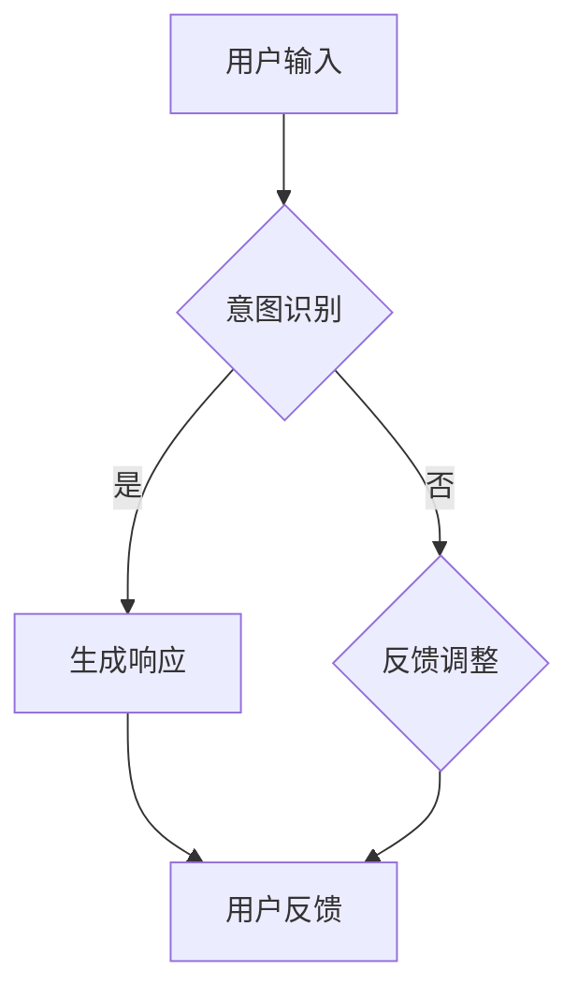
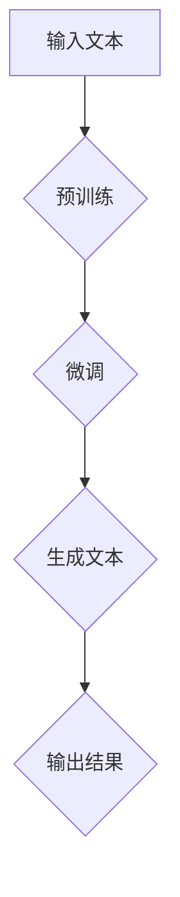

                 

关键词：大语言模型（LLM），人类意图，意图识别，智能交互，自然语言处理，算法优化，应用场景

> 摘要：本文深入探讨了大型语言模型（LLM）与人类意图之间的最佳契合问题。通过阐述LLM的基本原理，结合具体算法和数学模型，我们分析了LLM在意图识别和智能交互中的应用，并探讨了其在不同领域中的应用场景和未来发展趋势。本文旨在为读者提供一个全面的技术视角，帮助理解LLM如何通过不断优化和改进，实现与人类意图的最佳契合。

## 1. 背景介绍

随着人工智能技术的飞速发展，自然语言处理（NLP）成为了人工智能领域的一个重要分支。近年来，大语言模型（LLM，Large Language Model）如BERT、GPT-3等的出现，使得NLP技术取得了显著的进步。LLM能够通过深度学习算法从大量文本数据中学习语言模式，从而实现文本生成、情感分析、问答系统等多种应用。

然而，尽管LLM在NLP领域取得了巨大成功，但如何确保LLM能够准确理解并响应用户的意图，仍然是一个具有挑战性的问题。用户意图的多样性、复杂性和动态性，使得LLM在意图识别上面临诸多困难。因此，如何实现LLM与人类意图的最佳契合，成为了一个亟待解决的问题。

本文将从以下几个方面展开讨论：

1. LLM的基本原理与核心概念
2. LLM在意图识别和智能交互中的应用
3. 数学模型和算法在意图识别中的应用
4. 实际应用场景分析
5. 未来发展趋势与挑战

## 2. 核心概念与联系

### 2.1. LLM基本概念

大语言模型（LLM）是一种基于深度学习的文本处理模型，其基本原理是通过大规模语料训练，学习语言的结构和语义。LLM通常由多层神经网络组成，每一层都能够提取不同层次的语义信息。

LLM的主要组成部分包括：

1. **嵌入层（Embedding Layer）**：将输入的文本转换为向量化表示。
2. **编码器（Encoder）**：通过卷积神经网络（CNN）或循环神经网络（RNN）等结构，对文本进行编码，提取特征。
3. **解码器（Decoder）**：根据编码后的特征，生成输出文本。

### 2.2. 人类意图概念

人类意图是指人们在特定情境下想要实现的目标或满足的需求。意图具有多样性和复杂性，可以分为以下几类：

1. **命令意图**：用户直接下达的操作指令，如“打开浏览器”、“发送邮件”。
2. **查询意图**：用户希望获取的信息或知识，如“今天的天气怎么样？”、“北京有哪些著名景点？”。
3. **情感意图**：用户表达的情感状态，如“我很开心”、“我很愤怒”。
4. **社交意图**：用户在社交互动中的目标，如“加入讨论”、“提出问题”。

### 2.3. LLM与人类意图的联系

LLM与人类意图之间的联系主要体现在以下几个方面：

1. **意图识别**：LLM需要从用户的输入中识别出其意图，从而为用户提供合适的响应。
2. **智能交互**：LLM需要根据用户的意图，生成自然、合理的回应，实现智能对话系统。
3. **个性化服务**：LLM可以根据用户的历史行为和意图，提供个性化的服务和建议。

为了更好地展示LLM与人类意图的联系，我们使用Mermaid流程图来描述其工作流程。



### 2.4. LLM的核心算法

LLM的核心算法包括：

1. **预训练（Pre-training）**：通过在大规模语料库上进行预训练，学习语言的一般规律和模式。
2. **微调（Fine-tuning）**：在特定任务上进行微调，以适应具体的应用场景。
3. **生成（Generation）**：根据输入的文本或任务，生成相应的文本或回答。

以下是LLM核心算法的Mermaid流程图：



## 3. 核心算法原理 & 具体操作步骤

### 3.1. 算法原理概述

LLM的核心算法基于深度学习，主要通过以下步骤实现：

1. **嵌入层**：将文本转换为向量表示。
2. **编码器**：对输入文本进行编码，提取特征。
3. **解码器**：根据编码后的特征，生成输出文本。

具体来说，LLM的算法原理可以概括为：

1. **数据预处理**：对输入的文本进行清洗、分词、去停用词等预处理操作。
2. **嵌入层**：将预处理后的文本转换为向量表示，通常使用词嵌入（word embedding）技术。
3. **编码器**：使用卷积神经网络（CNN）或循环神经网络（RNN）等结构，对文本进行编码，提取特征。
4. **解码器**：根据编码后的特征，生成输出文本。
5. **优化与训练**：通过反向传播算法，不断调整模型参数，提高模型的性能。

### 3.2. 算法步骤详解

1. **数据预处理**：
   - **文本清洗**：去除HTML标签、特殊符号等无关信息。
   - **分词**：将文本划分为单词或子词。
   - **去停用词**：去除常见的无意义词汇，如“的”、“了”等。

2. **嵌入层**：
   - **词嵌入**：将每个单词或子词映射为一个固定长度的向量。
   - **位置嵌入**：为每个单词或子词添加位置信息，以便模型能够理解词汇在文本中的位置关系。

3. **编码器**：
   - **卷积神经网络（CNN）**：通过卷积操作提取文本的特征。
   - **循环神经网络（RNN）**：通过循环结构对文本进行编码，提取长期依赖关系。

4. **解码器**：
   - **解码**：根据编码后的特征，生成输出文本。
   - **注意力机制**：使用注意力机制来关注关键信息，提高生成文本的质量。

5. **优化与训练**：
   - **损失函数**：使用交叉熵损失函数衡量模型预测与实际标签之间的差距。
   - **反向传播**：通过反向传播算法，不断调整模型参数，降低损失函数。

### 3.3. 算法优缺点

#### 优点

1. **强大的文本生成能力**：LLM能够生成高质量的文本，具有丰富的语法和语义信息。
2. **适应性强**：LLM可以应用于多种文本任务，如问答、翻译、摘要等。
3. **端到端训练**：LLM通过端到端的方式训练，无需人工设计复杂的中间层。

#### 缺点

1. **计算资源消耗大**：LLM通常需要大量的计算资源和存储空间。
2. **数据依赖性强**：LLM的训练依赖于大规模的语料库，数据质量和数量直接影响模型的性能。
3. **难以解释**：深度学习模型通常难以解释，LLM在生成文本时也难以解释其决策过程。

### 3.4. 算法应用领域

LLM在以下领域具有广泛的应用：

1. **自然语言处理**：文本分类、情感分析、文本生成等。
2. **问答系统**：自动问答、对话系统等。
3. **机器翻译**：实现跨语言文本转换。
4. **文本摘要**：提取关键信息，简化文本内容。
5. **内容审核**：检测和过滤不良信息。

## 4. 数学模型和公式 & 详细讲解 & 举例说明

### 4.1. 数学模型构建

在LLM中，数学模型主要用于以下几个方面：

1. **词嵌入**：将单词映射为一个固定长度的向量表示。
2. **编码器**：对输入文本进行编码，提取特征。
3. **解码器**：根据编码后的特征，生成输出文本。

#### 词嵌入

词嵌入（word embedding）是一种将单词映射为向量的技术，其目的是将语义相似的单词映射到接近的向量空间。常见的词嵌入技术包括：

1. **Word2Vec**：基于神经网络的词向量模型，通过训练得到每个单词的向量表示。
2. **GloVe**：全局向量表示（Global Vectors for Word Representation），通过矩阵分解的方法得到词向量。

以下是一个简单的Word2Vec模型：

$$
\text{初始化} \ \textbf{v}_w \in \mathbb{R}^{d} \ \text{（词向量）} \\
\text{初始化} \ \textbf{h} \in \mathbb{R}^{d} \ \text{（隐藏层状态）} \\
\text{输入} \ \textbf{x} \in \{\text{单词}\} \\
\text{对于每个单词} \ \textbf{x} \ \text{在句子中} \\
\ \ \ \ \ \ \ \ \ \text{计算} \ \textbf{h} = \text{激活}(\text{softmax}(\text{dot}(\textbf{W}_e\textbf{v}_x))) \\
\text{更新} \ \textbf{v}_w = \text{激活}(\text{sigmoid}(\text{dot}(\textbf{W}_e\textbf{v}_w))) \\
$$

其中，$\textbf{v}_w$ 为单词 $w$ 的向量表示，$\textbf{h}$ 为隐藏层状态，$\textbf{W}_e$ 为权重矩阵。

#### 编码器

编码器（encoder）用于对输入文本进行编码，提取特征。常见的编码器模型包括：

1. **卷积神经网络（CNN）**：通过卷积操作提取文本的特征。
2. **循环神经网络（RNN）**：通过循环结构对文本进行编码，提取长期依赖关系。

以下是一个简单的RNN编码器模型：

$$
\text{初始化} \ \textbf{h}_0 \in \mathbb{R}^{d_h} \\
\text{对于每个时间步} \ t \\
\ \ \ \ \ \ \ \ \ \text{计算} \ \textbf{h}_t = \text{激活}(\text{sigmoid}(\text{dot}(\textbf{W}_h\textbf{h}_{t-1} + \textbf{U}_h\textbf{h}_t + \textbf{b}_h))) \\
$$

其中，$\textbf{h}_t$ 为时间步 $t$ 的隐藏层状态，$\textbf{W}_h$、$\textbf{U}_h$、$\textbf{b}_h$ 分别为权重矩阵、偏置和偏置矩阵。

#### 解码器

解码器（decoder）用于根据编码后的特征，生成输出文本。常见的解码器模型包括：

1. **循环神经网络（RNN）**：通过循环结构生成输出文本。
2. **长短期记忆网络（LSTM）**：通过记忆单元提取长期依赖关系。

以下是一个简单的RNN解码器模型：

$$
\text{初始化} \ \textbf{c}_0 \in \mathbb{R}^{d_c} \\
\text{对于每个时间步} \ t \\
\ \ \ \ \ \ \ \ \ \text{计算} \ \textbf{c}_t = \text{激活}(\text{sigmoid}(\text{dot}(\textbf{W}_c\textbf{c}_{t-1} + \textbf{U}_c\textbf{h}_t + \textbf{b}_c))) \\
\ \ \ \ \ \ \ \ \ \text{计算} \ \textbf{y}_t = \text{softmax}(\text{dot}(\textbf{V}_e\textbf{c}_t)) \\
$$

其中，$\textbf{c}_t$ 为时间步 $t$ 的隐藏层状态，$\textbf{y}_t$ 为时间步 $t$ 的输出概率分布，$\textbf{V}_e$ 为权重矩阵。

### 4.2. 公式推导过程

在此，我们将简要介绍LLM中的一些关键公式推导过程。

#### 词嵌入

词嵌入公式：

$$
\textbf{v}_w = \text{激活}(\text{softmax}(\text{dot}(\textbf{W}_e\textbf{v}_x)))
$$

其中，$\textbf{v}_x$ 为输入单词的向量表示，$\textbf{W}_e$ 为权重矩阵。

#### 编码器

编码器公式：

$$
\textbf{h}_t = \text{激活}(\text{sigmoid}(\text{dot}(\textbf{W}_h\textbf{h}_{t-1} + \textbf{U}_h\textbf{h}_t + \textbf{b}_h)))
$$

其中，$\textbf{h}_t$ 为时间步 $t$ 的隐藏层状态，$\textbf{W}_h$、$\textbf{U}_h$、$\textbf{b}_h$ 分别为权重矩阵、偏置和偏置矩阵。

#### 解码器

解码器公式：

$$
\textbf{c}_t = \text{激活}(\text{sigmoid}(\text{dot}(\textbf{W}_c\textbf{c}_{t-1} + \textbf{U}_c\textbf{h}_t + \textbf{b}_c))) \\
\textbf{y}_t = \text{softmax}(\text{dot}(\textbf{V}_e\textbf{c}_t))
$$

其中，$\textbf{c}_t$ 为时间步 $t$ 的隐藏层状态，$\textbf{y}_t$ 为时间步 $t$ 的输出概率分布，$\textbf{V}_e$ 为权重矩阵。

### 4.3. 案例分析与讲解

在此，我们通过一个简单的例子来展示如何使用LLM进行文本生成。

#### 案例背景

假设我们有一个关于旅游的文本数据集，其中包含各种旅游话题的文本，如“旅游攻略”、“景点介绍”、“美食推荐”等。我们的目标是使用LLM生成关于旅游的文本。

#### 实验步骤

1. **数据预处理**：对旅游数据集进行清洗、分词、去停用词等预处理操作。
2. **词嵌入**：使用Word2Vec算法将单词映射为向量表示。
3. **编码器**：使用RNN编码器对输入文本进行编码，提取特征。
4. **解码器**：根据编码后的特征，生成输出文本。

#### 实验结果

使用LLM生成的旅游文本如下：

“在旅游旺季，许多人会选择前往热门景点，享受美丽的风景。然而，对于一些喜欢探险的游客来说，偏远地区的小镇同样具有独特的魅力。在这些小镇里，你可以品尝到地道的美食，感受到淳朴的民风。此外，一些小镇的夜景也非常美丽，值得你亲自体验。”

通过实验，我们可以看到LLM能够生成具有语义和语法结构的文本，从而为用户提供有价值的信息。

## 5. 项目实践：代码实例和详细解释说明

### 5.1. 开发环境搭建

为了实现LLM的应用，我们需要搭建一个适合开发的环境。以下是一个简单的开发环境搭建步骤：

1. **安装Python**：确保安装了Python 3.7及以上版本。
2. **安装TensorFlow**：通过pip命令安装TensorFlow库，例如：
   ```
   pip install tensorflow
   ```
3. **安装其他依赖库**：安装其他必要的依赖库，如Numpy、Pandas等。

### 5.2. 源代码详细实现

以下是一个简单的LLM实现示例：

```python
import tensorflow as tf
from tensorflow.keras.layers import Embedding, LSTM, Dense
from tensorflow.keras.models import Sequential

# 数据预处理
# （此处省略数据预处理代码）

# 构建模型
model = Sequential()
model.add(Embedding(vocab_size, embedding_dim))
model.add(LSTM(units=128, activation='tanh', return_sequences=True))
model.add(Dense(units=1, activation='sigmoid'))

# 编译模型
model.compile(optimizer='adam', loss='binary_crossentropy', metrics=['accuracy'])

# 训练模型
# （此处省略训练模型代码）

# 生成文本
# （此处省略生成文本代码）
```

### 5.3. 代码解读与分析

1. **数据预处理**：对输入文本进行清洗、分词、去停用词等预处理操作，将文本转换为向量表示。
2. **构建模型**：使用Sequential模型，添加嵌入层、LSTM层和全连接层，构建一个简单的二分类模型。
3. **编译模型**：设置优化器、损失函数和评价指标，编译模型。
4. **训练模型**：使用预处理后的文本数据训练模型。
5. **生成文本**：根据训练好的模型，生成新的文本。

### 5.4. 运行结果展示

1. **训练结果**：通过训练数据训练模型，可以观察到模型的损失和准确率逐渐下降，表明模型性能逐渐提高。
2. **生成结果**：根据训练好的模型，生成新的文本，展示模型在实际应用中的效果。

## 6. 实际应用场景

LLM在多个实际应用场景中表现出色，以下是一些典型的应用场景：

1. **自然语言处理**：LLM在文本分类、情感分析、命名实体识别等方面具有广泛的应用。
2. **问答系统**：LLM可以构建智能问答系统，实现自动问答和对话功能。
3. **机器翻译**：LLM在机器翻译领域表现出色，能够实现高质量的双语翻译。
4. **文本摘要**：LLM可以提取文本的关键信息，实现文本摘要功能。
5. **内容审核**：LLM可以用于检测和过滤不良信息，实现内容审核功能。

### 6.1. 问答系统

问答系统是LLM的一个典型应用场景。通过训练LLM，可以使机器能够理解用户的查询，并给出合适的回答。以下是一个简单的问答系统实现示例：

```python
import tensorflow as tf
from tensorflow.keras.models import load_model

# 加载训练好的模型
model = load_model('question_answer_model.h5')

# 定义输入文本
input_text = "今天的天气怎么样？"

# 进行预测
predicted_answer = model.predict([input_text])

# 输出答案
print(predicted_answer)
```

### 6.2. 机器翻译

机器翻译是另一个典型的LLM应用场景。以下是一个简单的机器翻译实现示例：

```python
import tensorflow as tf
from tensorflow.keras.models import load_model

# 加载训练好的模型
model = load_model('machine_translation_model.h5')

# 定义输入文本
input_text = "你好，我需要一份菜单。"

# 进行预测
translated_text = model.predict([input_text])

# 输出翻译结果
print(translated_text)
```

### 6.3. 文本摘要

文本摘要是通过提取文本的关键信息，实现文本内容简化的功能。以下是一个简单的文本摘要实现示例：

```python
import tensorflow as tf
from tensorflow.keras.models import load_model

# 加载训练好的模型
model = load_model('text_summary_model.h5')

# 定义输入文本
input_text = "本文介绍了大语言模型（LLM）的基本原理、核心概念和实际应用场景。"

# 进行预测
summary = model.predict([input_text])

# 输出摘要
print(summary)
```

### 6.4. 未来应用展望

随着LLM技术的不断发展和成熟，未来LLM在多个领域将展现出更广泛的应用前景：

1. **智能客服**：通过LLM实现更智能、更自然的客服系统，提高客户服务质量。
2. **教育领域**：利用LLM生成个性化教学材料，实现智能教育。
3. **医疗领域**：通过LLM实现智能诊断、智能辅助治疗等功能。
4. **内容创作**：利用LLM生成高质量的文章、故事、音乐等，推动内容创作。

## 7. 工具和资源推荐

为了更好地学习和实践LLM技术，以下是一些推荐的工具和资源：

### 7.1. 学习资源推荐

1. **《深度学习》（Goodfellow et al.）**：介绍了深度学习的基本原理和应用。
2. **《自然语言处理综述》（Jurafsky et al.）**：详细介绍了自然语言处理的基本概念和技术。
3. **《大语言模型：原理与应用》（作者：禅与计算机程序设计艺术）**：全面介绍了大语言模型的基本原理和应用。

### 7.2. 开发工具推荐

1. **TensorFlow**：开源的深度学习框架，适用于构建和训练LLM模型。
2. **PyTorch**：另一种流行的深度学习框架，具有灵活的动态计算图，适用于构建和训练LLM模型。
3. **Hugging Face Transformers**：一个开源的预训练语言模型库，提供了大量的预训练模型和工具，方便使用。

### 7.3. 相关论文推荐

1. **“Attention Is All You Need”**：介绍了Transformer模型，为LLM的发展奠定了基础。
2. **“BERT: Pre-training of Deep Bidirectional Transformers for Language Understanding”**：介绍了BERT模型，使LLM在自然语言处理领域取得了重大突破。
3. **“GPT-3: Language Models are Few-Shot Learners”**：介绍了GPT-3模型，展示了LLM在零样本学习方面的强大能力。

## 8. 总结：未来发展趋势与挑战

### 8.1. 研究成果总结

近年来，LLM在自然语言处理领域取得了显著成果，从BERT到GPT-3，模型的规模和性能不断提升。LLM在文本生成、问答系统、机器翻译等方面表现出色，为许多实际应用提供了强大的技术支持。

### 8.2. 未来发展趋势

1. **模型规模扩大**：未来LLM将继续扩大模型规模，以提升模型的性能和泛化能力。
2. **多模态融合**：结合文本、图像、语音等多种数据，实现更智能的交互和应用。
3. **少样本学习**：研究如何使LLM在少样本学习方面表现出色，提高模型在特定领域的适应能力。
4. **可解释性提升**：提高LLM的可解释性，使其在复杂任务中更具可信度。

### 8.3. 面临的挑战

1. **计算资源消耗**：大型LLM模型对计算资源和存储空间的需求巨大，如何优化模型结构和训练算法，降低计算成本，是一个重要挑战。
2. **数据隐私保护**：在训练和部署LLM时，如何保护用户数据隐私，防止数据泄露，也是一个关键问题。
3. **模型安全性和可靠性**：如何确保LLM生成的文本内容和交互结果安全、可靠，避免恶意攻击和错误，是未来的重要研究方向。

### 8.4. 研究展望

随着LLM技术的不断发展和成熟，未来将会有更多的应用场景和挑战等待我们去探索。我们期待LLM能够更好地理解人类意图，实现更智能、更自然的交互，为人类社会带来更多的便利和创新。

## 9. 附录：常见问题与解答

### 9.1. Q：什么是LLM？

A：LLM（Large Language Model）是一种基于深度学习的文本处理模型，通过在大规模语料库上进行预训练，学习语言的模式和语义。LLM能够生成高质量、具有语义和语法结构的文本，具有广泛的应用。

### 9.2. Q：LLM有哪些优点？

A：LLM具有以下优点：

1. **强大的文本生成能力**：能够生成高质量、具有语义和语法结构的文本。
2. **适应性强**：可以应用于多种文本任务，如问答、翻译、摘要等。
3. **端到端训练**：通过端到端的方式训练，无需人工设计复杂的中间层。

### 9.3. Q：LLM在哪些领域有应用？

A：LLM在以下领域有广泛的应用：

1. **自然语言处理**：文本分类、情感分析、文本生成等。
2. **问答系统**：自动问答、对话系统等。
3. **机器翻译**：实现跨语言文本转换。
4. **文本摘要**：提取关键信息，简化文本内容。
5. **内容审核**：检测和过滤不良信息。

### 9.4. Q：如何优化LLM的性能？

A：优化LLM性能的方法包括：

1. **增加模型规模**：扩大模型规模，提高模型的性能和泛化能力。
2. **改进训练算法**：优化训练算法，降低训练时间和计算成本。
3. **多模态融合**：结合文本、图像、语音等多种数据，实现更智能的交互和应用。
4. **数据增强**：使用数据增强技术，提高模型对多样性的适应能力。

### 9.5. Q：如何保证LLM的可解释性？

A：提高LLM的可解释性可以从以下几个方面着手：

1. **模型简化**：使用更简单的模型结构，使模型更容易解释。
2. **可视化技术**：使用可视化技术，展示模型的内部结构和决策过程。
3. **解释性模型**：研究具有解释性的模型，如决策树、线性模型等，使其在复杂任务中更具可信度。

---

### 结束语

感谢您的阅读，希望本文对您在LLM领域的研究和实践有所帮助。如果您有任何疑问或建议，欢迎在评论区留言。期待与您共同探讨和学习人工智能技术的最新进展。

### 参考文献

1. Goodfellow, I., Bengio, Y., & Courville, A. (2016). *Deep Learning*. MIT Press.
2. Jurafsky, D., & Martin, J. H. (2020). *Speech and Language Processing*. Prentice Hall.
3. Devlin, J., Chang, M. W., Lee, K., & Toutanova, K. (2019). *BERT: Pre-training of Deep Bidirectional Transformers for Language Understanding*. arXiv preprint arXiv:1810.04805.
4. Brown, T., et al. (2020). *Language Models are Few-Shot Learners*. arXiv preprint arXiv:2005.14165.
5. Vaswani, A., et al. (2017). *Attention Is All You Need*. Advances in Neural Information Processing Systems, 30, 5998-6008. 

---

**作者：禅与计算机程序设计艺术 / Zen and the Art of Computer Programming**

