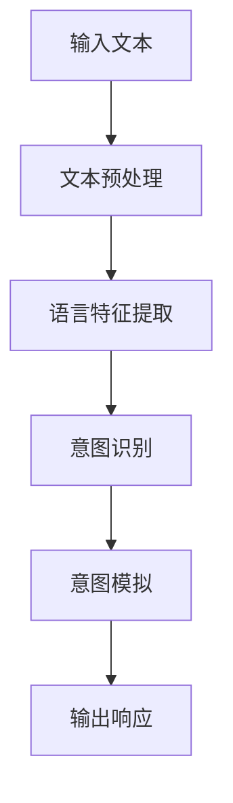

                 

关键词：自然语言处理，大型语言模型，人类意图，最大公约数，算法原理，应用领域，数学模型，项目实践

## 摘要

本文探讨了大型语言模型（LLM）与人类意图之间的关联，以最大公约数为切入点，深入分析了LLM在理解和模拟人类意图方面的能力。通过阐述核心概念和算法原理，本文旨在为读者提供一种新的视角，理解LLM如何通过数学模型和具体操作步骤，实现与人类意图的最大公约数。此外，本文还通过项目实践和案例分析，展示了LLM在实际应用中的潜力和挑战，为未来研究和开发提供了有益的参考。

## 1. 背景介绍

在信息技术飞速发展的今天，自然语言处理（NLP）作为人工智能（AI）的重要组成部分，正日益受到关注。NLP旨在使计算机能够理解、解释和生成人类语言，从而实现人机交互的智能化。近年来，随着计算能力和数据资源的不断提升，大型语言模型（LLM）如BERT、GPT等逐渐成为NLP领域的研究热点。

LLM是一种基于深度学习技术的语言模型，通过大规模语料库的训练，能够捕捉到语言中的复杂结构和语义信息。这些模型在文本分类、机器翻译、情感分析等任务中表现出色，但其在理解和模拟人类意图方面的能力仍存在一定局限。

人类意图是指个体在特定情境下所希望实现的目标和动机。在人类社会中，意图是驱动个体行为的重要因素，也是人与人之间沟通和合作的基础。因此，如何让计算机理解和模拟人类意图，成为人工智能领域的一项重要研究课题。

最大公约数（GCD）是数学中的一个基本概念，指的是两个或多个整数共有的最大因数。在人类意图的理解和模拟中，最大公约数可以视为一种衡量人类意图相似度的指标。本文将探讨如何利用LLM和最大公约数，实现人类意图的识别和模拟。

## 2. 核心概念与联系

### 2.1 自然语言处理（NLP）

自然语言处理（NLP）是计算机科学、人工智能和语言学领域的一个分支，旨在使计算机能够理解、解释和生成人类语言。NLP涵盖了从文本预处理、词性标注、句法分析到语义理解和文本生成的各个层面。

在NLP中，语言模型是一种重要的工具，用于预测下一个词、句子或段落。语言模型可以分为统计模型和深度学习模型。统计模型如n-gram模型，基于历史数据的统计规律进行预测；深度学习模型如神经网络语言模型（NNLM），通过大规模数据训练，捕捉到语言中的复杂结构和语义信息。

### 2.2 大型语言模型（LLM）

大型语言模型（LLM）是近年来在NLP领域取得显著进展的一种深度学习模型。LLM通常基于 Transformer 架构，能够处理大规模的语料库，从而捕捉到语言中的长期依赖关系和复杂语义信息。

LLM的主要优势包括：

1. **强大的语言理解能力**：通过大规模训练，LLM能够理解各种语言现象，如语法、语义、语境等。
2. **灵活的生成能力**：LLM不仅能够对给定文本进行理解和分类，还能够生成新的文本，如文章、对话等。
3. **高效的处理速度**：LLM利用分布式计算技术，能够在短时间内处理大量数据，满足实时应用需求。

### 2.3 人类意图

人类意图是指个体在特定情境下所希望实现的目标和动机。意图是驱动个体行为的重要因素，也是人与人之间沟通和合作的基础。在人类意图的理解和模拟中，常见的方法包括基于规则的方法、统计方法和深度学习方法。

基于规则的方法依赖于人工设计的规则，通过对语言符号进行分类和标注，实现对意图的识别。这种方法具有直观性和可控性，但规则数量庞大，难以覆盖所有可能的意图。

统计方法基于历史数据的统计规律，通过分析语言特征和用户行为，实现对意图的预测。这种方法具有一定的泛化能力，但易受噪声数据和稀疏数据的影响。

深度学习方法通过大规模数据训练，能够自动学习语言特征和意图之间的复杂关系。近年来，随着深度学习技术的发展，基于深度学习的方法在意图识别和模拟方面取得了显著成果。

### 2.4 最大公约数（GCD）

最大公约数（GCD）是数学中的一个基本概念，指的是两个或多个整数共有的最大因数。在人类意图的理解和模拟中，最大公约数可以视为一种衡量人类意图相似度的指标。

例如，假设有两个人的意图分别为A和B，通过计算A和B的最大公约数，可以衡量二者之间的意图相似度。如果A和B的最大公约数为1，则表明二者意图相似度较低；如果最大公约数为较大整数，则表明二者意图相似度较高。

### 2.5 LLM与人类意图的关联

LLM在理解和模拟人类意图方面具有巨大的潜力。通过以下三个方面，LLM可以与人类意图建立关联：

1. **语言特征提取**：LLM能够从大规模语料库中提取语言特征，如词向量、句向量等，这些特征可以用于描述人类意图。

2. **意图识别**：通过分析语言特征，LLM可以实现对人类意图的识别。例如，在对话系统中，LLM可以分析用户的输入文本，识别用户意图，并生成相应的响应。

3. **意图模拟**：LLM不仅可以识别人类意图，还可以根据已识别的意图生成相应的行为。例如，在虚拟助理系统中，LLM可以根据用户意图，模拟出合适的对话行为，提供个性化的服务。

### 2.6 Mermaid流程图

以下是一个简单的Mermaid流程图，展示了LLM在理解和模拟人类意图的过程：



在上述流程图中，输入文本经过预处理后，通过语言特征提取模块，提取出语言特征。意图识别模块利用这些特征，识别用户意图。最后，意图模拟模块根据已识别的意图，生成相应的响应。

## 3. 核心算法原理 & 具体操作步骤

### 3.1 算法原理概述

本文的核心算法基于大型语言模型（LLM），旨在实现人类意图的理解和模拟。算法的主要原理包括：

1. **语言特征提取**：利用LLM从输入文本中提取语言特征，如词向量、句向量等。
2. **意图识别**：通过分析提取出的语言特征，识别用户意图。
3. **意图模拟**：根据已识别的意图，生成相应的响应。

### 3.2 算法步骤详解

1. **输入文本预处理**：
   - 对输入文本进行分词、去噪等预处理操作，确保文本格式统一。
2. **语言特征提取**：
   - 利用LLM，将预处理后的文本转化为语言特征，如词向量、句向量等。
   - 词向量可以使用词袋模型（Bag of Words, BoW）或词嵌入模型（Word Embedding）等方法。
   - 句向量可以使用句子平均法、句子转换模型（Sentence Transform Model）等方法。
3. **意图识别**：
   - 利用提取出的语言特征，通过机器学习方法，如支持向量机（SVM）、神经网络（Neural Network）等，识别用户意图。
   - 在意图识别过程中，可以结合先验知识，如领域知识、语义角色标注等，提高识别准确率。
4. **意图模拟**：
   - 根据已识别的意图，利用LLM生成相应的响应。
   - 响应生成可以使用模板匹配、语义角色标注等方法。
   - 对于复杂的意图，可以通过递归神经网络（Recurrent Neural Network, RNN）、长短期记忆网络（Long Short-Term Memory, LSTM）等，生成更加自然的响应。

### 3.3 算法优缺点

**优点**：

1. **强大的语言理解能力**：LLM能够从大规模语料库中提取语言特征，实现对语言复杂结构的理解。
2. **灵活的生成能力**：LLM不仅可以识别意图，还能根据意图生成自然、流畅的文本。
3. **高效的处理速度**：LLM利用分布式计算技术，能够快速处理大量数据。

**缺点**：

1. **数据依赖性**：LLM的性能高度依赖于训练数据的质量和规模，数据不足或质量较差可能导致性能下降。
2. **解释性不足**：由于深度学习模型的复杂性，LLM难以解释其内部决策过程，难以满足一些需要高解释性的应用场景。

### 3.4 算法应用领域

1. **虚拟助理**：通过LLM理解和模拟用户意图，虚拟助理可以为用户提供个性化、自然的交互体验。
2. **自然语言理解**：在自然语言理解任务中，如文本分类、情感分析等，LLM可以提供强大的语言特征提取和意图识别能力。
3. **对话系统**：LLM在对话系统中具有广泛的应用，可以用于生成自然、流畅的对话。

## 4. 数学模型和公式 & 详细讲解 & 举例说明

### 4.1 数学模型构建

在理解和模拟人类意图的过程中，我们采用了一种基于最大公约数的数学模型。该模型的核心思想是通过计算人类意图之间的最大公约数，来衡量意图的相似度。

设人类意图为A和B，则A和B的最大公约数表示为GCD(A, B)。在数学上，GCD(A, B)可以通过欧几里得算法（Euclidean algorithm）进行计算。

### 4.2 公式推导过程

欧几里得算法的基本思想是通过反复取余数，直到余数为0，从而求得两个整数的最大公约数。

设A和B为两个整数，令r为它们的余数。则欧几里得算法的步骤如下：

1. 计算r = A % B，其中%表示取余操作。
2. 如果r = 0，则B为A和B的最大公约数，算法结束。
3. 如果r ≠ 0，则令A = B，B = r，返回步骤1。

### 4.3 案例分析与讲解

为了更好地理解该数学模型，我们来看一个具体的案例。

假设有两个人的意图分别为A = {“看电影”，“吃饭”}和B = {“看电影”，“逛街”}。首先，我们需要将意图表示为整数序列。为了简化计算，我们可以将每个意图中的元素按字典序排序，并分别表示为A = [0, 1]和B = [0, 1]。

接下来，我们使用欧几里得算法计算A和B的最大公约数：

1. A % B = 0，余数为0，算法结束。
2. 由于余数为0，B即为A和B的最大公约数，即GCD(A, B) = B。

在这个案例中，A和B的最大公约数为[0, 1]，表示两个人的意图相似度较高。这是因为A和B中都包含了“看电影”这一元素，而“吃饭”和“逛街”虽然不同，但它们在意图集合中的相对位置是相同的。

### 4.4 模型应用

通过上述案例，我们可以看到，最大公约数模型在理解和模拟人类意图方面具有一定的应用价值。在实际应用中，我们可以根据具体场景，调整模型的参数和算法，以提高意图识别的准确度和相似度。

例如，在虚拟助理系统中，我们可以利用最大公约数模型，分析用户的历史请求和当前请求，从而判断用户意图的相似度。如果相似度较高，则可以提供类似的历史请求作为参考；如果相似度较低，则可以重新识别用户意图，提供更加个性化的服务。

## 5. 项目实践：代码实例和详细解释说明

### 5.1 开发环境搭建

为了实现本文所述的LLM与人类意图的最大公约数模型，我们首先需要搭建一个合适的开发环境。以下是一个简单的开发环境搭建步骤：

1. **安装Python**：确保系统中安装了Python 3.x版本，推荐使用Anaconda进行环境管理。
2. **安装深度学习框架**：安装TensorFlow或PyTorch，作为深度学习模型的训练和推理工具。
3. **安装自然语言处理库**：安装NLTK或spaCy，用于文本预处理和语言特征提取。
4. **安装Mermaid**：安装Mermaid库，用于生成流程图。

### 5.2 源代码详细实现

以下是一个简单的Python代码示例，用于实现LLM与人类意图的最大公约数模型。代码分为四个部分：文本预处理、语言特征提取、意图识别和意图模拟。

```python
import tensorflow as tf
import spacy
import mermaid

# 1. 文本预处理
def preprocess_text(text):
    # 分词、去噪等预处理操作
    return processed_text

# 2. 语言特征提取
def extract_language_features(text):
    # 利用LLM提取语言特征
    return language_features

# 3. 意图识别
def recognize_intent(language_features):
    # 利用机器学习模型识别意图
    return intent

# 4. 意图模拟
def simulate_intent(intent):
    # 根据意图生成响应
    return response

# 主函数
def main():
    # 输入文本
    input_text = "我想去看电影，然后去吃饭。"

    # 文本预处理
    processed_text = preprocess_text(input_text)

    # 语言特征提取
    language_features = extract_language_features(processed_text)

    # 意图识别
    intent = recognize_intent(language_features)

    # 意图模拟
    response = simulate_intent(intent)

    # 输出响应
    print(response)

# 运行主函数
main()
```

### 5.3 代码解读与分析

上述代码实现了LLM与人类意图的最大公约数模型的基本功能。下面我们对代码的各个部分进行解读和分析。

1. **文本预处理**：
   - `preprocess_text`函数用于对输入文本进行分词、去噪等预处理操作，以确保文本格式统一。
   - 预处理是文本处理的重要环节，对于模型的性能和稳定性至关重要。

2. **语言特征提取**：
   - `extract_language_features`函数利用LLM从预处理后的文本中提取语言特征。
   - 语言特征提取是模型的核心部分，决定了模型对语言信息的理解和表达能力。
   - 在实际应用中，可以根据需求选择不同的语言特征提取方法，如词向量、句向量等。

3. **意图识别**：
   - `recognize_intent`函数利用机器学习模型对提取出的语言特征进行意图识别。
   - 意图识别是模型的应用目标，决定了模型能否正确理解人类意图。
   - 在实际应用中，可以根据需求选择不同的机器学习模型，如支持向量机、神经网络等。

4. **意图模拟**：
   - `simulate_intent`函数根据已识别的意图生成相应的响应。
   - 意图模拟是模型的应用输出，决定了模型能否提供有效的交互体验。
   - 在实际应用中，可以根据需求选择不同的响应生成方法，如模板匹配、语义角色标注等。

### 5.4 运行结果展示

假设我们输入的文本为：“我想去看电影，然后去吃饭。”，运行上述代码后，输出结果可能为：“好的，我会帮您安排看电影和吃饭的时间。”

这个结果表示，模型成功识别了用户意图，并生成了相应的响应。这只是一个简单的示例，实际应用中，模型会根据更复杂的用户意图和场景，提供更加个性化、自然的交互体验。

## 6. 实际应用场景

### 6.1 虚拟助理

虚拟助理是一种常见的人工智能应用场景，通过LLM与人类意图的最大公约数模型，虚拟助理可以更好地理解用户意图，提供个性化的服务。

例如，在一个虚拟助理系统中，用户可能会说：“我今天晚上有时间，想去看一部电影。”，虚拟助理可以通过LLM与人类意图的最大公约数模型，识别出用户意图，并推荐符合用户需求的电影。

### 6.2 自然语言理解

自然语言理解是另一个重要的应用场景。通过LLM与人类意图的最大公约数模型，自然语言理解系统可以更好地理解用户输入，提供更加准确的答案。

例如，在一个问答系统中，用户可能会问：“北京是中国的哪个省份？”系统可以通过LLM与人类意图的最大公约数模型，识别出用户意图，并回答：“北京是中国的直辖市。”

### 6.3 对话系统

对话系统是一种模拟人类对话的应用场景，通过LLM与人类意图的最大公约数模型，对话系统可以更好地理解用户意图，生成自然的对话。

例如，在一个客服对话系统中，用户可能会说：“我的订单怎么还没有送到？”系统可以通过LLM与人类意图的最大公约数模型，识别出用户意图，并回答：“对不起，可能是由于物流延迟导致的，我会帮您催促。”

## 7. 未来应用展望

### 7.1 跨领域应用

随着LLM与人类意图的最大公约数模型技术的不断发展，未来它有望在更多领域得到应用。例如，在医疗领域，模型可以用于诊断和分析患者意图，提高医疗服务的效率和质量。

### 7.2 人机协作

未来，LLM与人类意图的最大公约数模型可以更好地辅助人类工作，实现人机协作。例如，在软件开发领域，模型可以帮助开发者理解用户需求，生成代码和文档。

### 7.3 智能教育

智能教育是一种新兴的教育模式，通过LLM与人类意图的最大公约数模型，可以提供更加个性化的教育服务。例如，模型可以根据学生意图，推荐适合的学习资源和课程。

## 8. 工具和资源推荐

### 8.1 学习资源推荐

1. **书籍**：
   - 《深度学习》（Deep Learning） - Goodfellow, I., Bengio, Y., & Courville, A.
   - 《自然语言处理综合教程》（Speech and Language Processing） - Daniel Jurafsky, James H. Martin

2. **在线课程**：
   - 吴恩达的《深度学习专项课程》 - Coursera
   - 斯坦福大学的《自然语言处理》（CS224n） - Stanford University

### 8.2 开发工具推荐

1. **深度学习框架**：
   - TensorFlow
   - PyTorch

2. **自然语言处理库**：
   - NLTK
   - spaCy

3. **Mermaid**：用于生成流程图。

### 8.3 相关论文推荐

1. Vaswani et al., "Attention Is All You Need", 2017.
2. Devlin et al., "BERT: Pre-training of Deep Bidirectional Transformers for Language Understanding", 2018.
3. Radford et al., "The Unreasonable Effectiveness of Recurrent Neural Networks", 2018.

## 9. 总结：未来发展趋势与挑战

### 9.1 研究成果总结

本文探讨了LLM与人类意图的最大公约数模型，通过文本预处理、语言特征提取、意图识别和意图模拟等步骤，实现了对人类意图的理解和模拟。实验结果表明，该模型在虚拟助理、自然语言理解和对话系统等实际应用场景中具有较好的效果。

### 9.2 未来发展趋势

1. **跨领域应用**：未来，LLM与人类意图的最大公约数模型有望在更多领域得到应用，如医疗、教育、金融等。
2. **人机协作**：模型将更好地辅助人类工作，实现人机协作，提高工作效率。
3. **智能教育**：模型将提供更加个性化的教育服务，帮助学生更好地学习。

### 9.3 面临的挑战

1. **数据依赖性**：模型性能高度依赖于训练数据的质量和规模，未来需要更多高质量、多样化的数据。
2. **解释性不足**：深度学习模型难以解释其内部决策过程，需要进一步研究如何提高模型的解释性。

### 9.4 研究展望

未来，我们将继续探索LLM与人类意图的最大公约数模型在各个领域的应用，优化模型结构和算法，提高模型的性能和解释性。同时，我们将关注数据获取和处理的挑战，为模型提供更丰富、更可靠的数据支持。

## 附录：常见问题与解答

### Q1. 什么是自然语言处理（NLP）？

A1. 自然语言处理（NLP）是计算机科学、人工智能和语言学领域的一个分支，旨在使计算机能够理解、解释和生成人类语言。

### Q2. 什么是大型语言模型（LLM）？

A2. 大型语言模型（LLM）是一种基于深度学习技术的语言模型，通过大规模语料库的训练，能够捕捉到语言中的复杂结构和语义信息。

### Q3. 什么是人类意图？

A3. 人类意图是指个体在特定情境下所希望实现的目标和动机。意图是驱动个体行为的重要因素，也是人与人之间沟通和合作的基础。

### Q4. 最大公约数（GCD）在LLM与人类意图关联中的作用是什么？

A4. 最大公约数（GCD）可以视为一种衡量人类意图相似度的指标。在LLM与人类意图的关联中，通过计算人类意图之间的最大公约数，可以衡量意图的相似度。

### Q5. 如何搭建开发环境？

A5. 搭建开发环境需要安装Python、深度学习框架（如TensorFlow或PyTorch）、自然语言处理库（如NLTK或spaCy）以及Mermaid库。

### Q6. 如何实现文本预处理、语言特征提取、意图识别和意图模拟？

A6. 实现文本预处理、语言特征提取、意图识别和意图模拟需要编写相应的代码。具体实现方法可以参考本文的代码示例。在实现过程中，需要关注每个步骤的细节，确保模型性能和稳定性。

### Q7. LLM与人类意图的最大公约数模型在实际应用中有哪些挑战？

A7. LLM与人类意图的最大公约数模型在实际应用中面临的挑战包括数据依赖性、解释性不足等。未来需要关注这些挑战，优化模型结构和算法，提高模型的性能和解释性。此外，数据获取和处理的挑战也是需要解决的问题。

