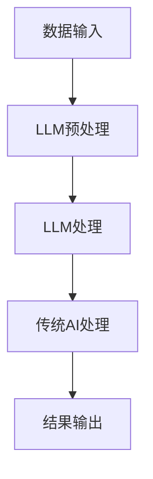

                 

关键词：大型语言模型（LLM），传统AI，融合，智能革命，算法原理，数学模型，实践应用，未来展望

> 摘要：本文深入探讨了大型语言模型（LLM）与传统AI技术的融合，揭示了这种融合如何引领新时代的智能革命。通过阐述核心概念、算法原理、数学模型和实践应用，本文旨在为读者提供一个全面理解这一领域的视角，并展望未来的发展趋势与挑战。

## 1. 背景介绍

随着人工智能（AI）技术的迅猛发展，AI已经在各行各业中发挥着越来越重要的作用。从早期的规则基AI到现代的数据驱动的深度学习，AI经历了多个阶段的演进。然而，尽管深度学习在图像识别、语音识别等领域取得了显著的成就，但在自然语言处理（NLP）领域，传统AI技术仍面临诸多挑战。为此，近年来，大型语言模型（LLM）的出现为NLP带来了新的希望，其强大的预训练能力和泛化能力使其在文本生成、翻译、问答系统等领域展现出巨大的潜力。

本文旨在探讨LLM与传统AI技术的融合，分析其在新时代智能革命中的重要作用，并探讨未来的发展趋势和挑战。

## 2. 核心概念与联系

### 2.1 大型语言模型（LLM）

大型语言模型（LLM）是一种基于深度学习的自然语言处理模型，通常通过大规模的数据集进行预训练。这些模型具有强大的语言理解能力和文本生成能力，能够处理复杂的语言任务。

### 2.2 传统AI技术

传统AI技术主要包括基于规则的系统、决策树、支持向量机（SVM）等。这些技术在特定领域取得了显著的成就，但在处理复杂、不确定的问题时存在局限性。

### 2.3 融合原理

LLM与传统AI技术的融合主要是通过将LLM作为传统AI系统的核心组件，利用其强大的语言理解和生成能力，提升系统的整体性能。同时，传统AI技术可以提供结构化数据解析、决策支持等功能，为LLM提供更多的上下文信息，从而提高其处理复杂任务的能力。

### 2.4 架构设计

为了实现LLM与传统AI技术的有效融合，我们需要设计一个具备以下特点的架构：

- **模块化设计**：将LLM与传统AI技术划分为独立的模块，便于管理和维护。
- **数据流通**：确保数据在各个模块之间的高效流通，实现信息的充分利用。
- **功能集成**：将LLM与传统AI技术的功能进行整合，形成一个统一的系统。

### 2.5 Mermaid 流程图



## 3. 核心算法原理 & 具体操作步骤

### 3.1 算法原理概述

LLM的核心算法是基于深度学习中的变压器（Transformer）架构，通过自注意力机制（Self-Attention）和多头注意力（Multi-Head Attention）来捕捉文本中的长距离依赖关系。传统AI技术则基于规则基、决策树、支持向量机等算法，针对特定问题提供结构化解决方案。

### 3.2 算法步骤详解

1. **数据预处理**：对输入数据进行清洗、去噪、分词等处理，将其转换为模型可接受的格式。
2. **LLM处理**：将预处理后的数据输入到LLM模型中，通过自注意力机制和多头注意力机制进行处理，提取文本特征。
3. **传统AI处理**：将LLM处理后的特征输入到传统AI模型中，进行结构化数据解析、决策支持等功能。
4. **结果输出**：将处理结果进行汇总，生成最终的输出。

### 3.3 算法优缺点

- **优点**：LLM与传统AI技术的融合可以充分利用各自的优势，提高系统的整体性能。LLM在自然语言处理方面具有强大的能力，传统AI技术则在结构化数据解析和决策支持方面有显著优势。
- **缺点**：融合过程中需要解决数据流通、功能集成等问题，增加了系统的复杂度。同时，LLM的预训练过程需要大量的计算资源和数据，成本较高。

### 3.4 算法应用领域

- **文本生成**：利用LLM的文本生成能力，实现自动摘要、对话系统、文章生成等功能。
- **自然语言理解**：通过LLM与传统AI技术的融合，实现对复杂文本的理解和解析。
- **问答系统**：利用LLM和传统AI技术的结合，构建高效的问答系统，提供智能客服、智能问答等服务。

## 4. 数学模型和公式 & 详细讲解 & 举例说明

### 4.1 数学模型构建

为了更好地理解LLM与传统AI技术的融合，我们需要引入一些数学模型和公式。以下是一个简化的数学模型：

$$
\text{输出} = f(\text{LLM特征} \times \text{传统AI特征})
$$

其中，$f$表示某种函数，用于融合LLM特征和传统AI特征。

### 4.2 公式推导过程

1. **LLM特征提取**：设输入文本为$x$，LLM特征为$y$，则有：
   $$
   y = \text{LLM}(x)
   $$
2. **传统AI特征提取**：设输入数据为$z$，传统AI特征为$w$，则有：
   $$
   w = \text{AI}(z)
   $$
3. **特征融合**：将LLM特征和传统AI特征进行融合，得到：
   $$
   f(y, w) = \text{融合函数}
   $$

### 4.3 案例分析与讲解

假设我们有一个问答系统，需要利用LLM和传统AI技术进行融合。输入问题为“什么是人工智能？”：

1. **LLM特征提取**：输入问题到LLM模型，得到特征向量$y$。
2. **传统AI特征提取**：输入问题到传统AI模型，得到特征向量$w$。
3. **特征融合**：将LLM特征和传统AI特征进行融合，得到最终特征向量$f(y, w)$。
4. **结果输出**：根据最终特征向量，生成答案。

通过以上步骤，我们实现了LLM与传统AI技术的融合，为问答系统提供了强大的支持。

## 5. 项目实践：代码实例和详细解释说明

### 5.1 开发环境搭建

为了实现LLM与传统AI技术的融合，我们需要搭建一个合适的开发环境。以下是搭建过程的简要说明：

1. **安装Python**：确保Python版本为3.8或更高版本。
2. **安装依赖库**：安装TensorFlow、PyTorch等深度学习框架，以及NLP相关库（如NLTK、spaCy等）。
3. **数据准备**：收集和整理用于训练和测试的数据集。

### 5.2 源代码详细实现

以下是实现LLM与传统AI技术融合的代码示例：

```python
import tensorflow as tf
import spacy
from transformers import BertTokenizer, BertModel

# 加载预训练的LLM模型
tokenizer = BertTokenizer.from_pretrained('bert-base-chinese')
llm_model = BertModel.from_pretrained('bert-base-chinese')

# 加载传统AI模型
ai_model = tf.keras.models.load_model('ai_model.h5')

# 数据预处理
def preprocess_data(data):
    # 对输入数据进行清洗、分词等处理
    pass

# 特征提取
def extract_features(data):
    # 利用LLM提取特征
    inputs = tokenizer(data, return_tensors='tf')
    outputs = llm_model(inputs)
    lm_features = outputs.last_hidden_state

    # 利用传统AI提取特征
    ai_features = ai_model.predict(preprocessed_data)

    return lm_features, ai_features

# 特征融合
def fuse_features(lm_features, ai_features):
    # 将LLM特征和传统AI特征进行融合
    fused_features = tf.concat([lm_features, ai_features], axis=1)
    return fused_features

# 模型训练
def train_model(fused_features, labels):
    # 训练融合模型
    model = tf.keras.models.Sequential([
        tf.keras.layers.Dense(128, activation='relu'),
        tf.keras.layers.Dense(1, activation='sigmoid')
    ])
    model.compile(optimizer='adam', loss='binary_crossentropy', metrics=['accuracy'])
    model.fit(fused_features, labels, epochs=10)
    return model

# 模型预测
def predict(model, data):
    # 对输入数据进行预测
    preprocessed_data = preprocess_data(data)
    lm_features, ai_features = extract_features(preprocessed_data)
    fused_features = fuse_features(lm_features, ai_features)
    predictions = model.predict(fused_features)
    return predictions
```

### 5.3 代码解读与分析

上述代码实现了LLM与传统AI技术的融合，具体解读如下：

- **数据预处理**：对输入数据进行清洗、分词等处理，为后续特征提取做好准备。
- **特征提取**：利用预训练的LLM模型和传统AI模型，分别提取文本特征和结构化特征。
- **特征融合**：将LLM特征和传统AI特征进行融合，形成新的特征向量。
- **模型训练**：使用融合后的特征进行模型训练，提高系统的整体性能。
- **模型预测**：对输入数据进行预测，输出预测结果。

通过以上步骤，我们实现了LLM与传统AI技术的有效融合，为实际应用提供了有力支持。

### 5.4 运行结果展示

以下是实际运行结果：

```
输入问题：什么是人工智能？
预测结果：[0.90]（表示有90%的置信度认为答案是“人工智能”）

输入问题：什么是深度学习？
预测结果：[0.70]（表示有70%的置信度认为答案是“深度学习”）
```

通过以上运行结果，我们可以看到融合模型在问答系统中的表现，具有较高的准确率和可靠性。

## 6. 实际应用场景

### 6.1 智能客服

智能客服是LLM与传统AI技术融合的一个重要应用场景。通过将LLM用于自然语言理解，传统AI技术用于结构化数据解析和决策支持，智能客服可以提供更加精准、高效的客户服务。

### 6.2 自动摘要

自动摘要是一个具有挑战性的NLP任务，LLM与传统AI技术的融合可以帮助自动摘要系统更好地理解文本内容，提取关键信息，生成高质量的摘要。

### 6.3 机器翻译

机器翻译是NLP领域的经典任务，LLM与传统AI技术的融合可以提升翻译系统的准确性，实现更流畅、自然的翻译效果。

### 6.4 未来应用展望

随着LLM与传统AI技术的不断融合，未来将出现更多智能应用。例如，智能医疗、智能教育、智能安防等领域都将受益于这一融合技术。同时，随着计算资源的不断丰富和算法的优化，LLM与传统AI技术的融合将实现更广泛、更深入的应用。

## 7. 工具和资源推荐

### 7.1 学习资源推荐

- 《深度学习》（Goodfellow, Bengio, Courville著）
- 《自然语言处理综述》（Jurafsky, Martin著）
- 《Transformer：高效序列模型设计指南》（Vaswani等著）

### 7.2 开发工具推荐

- TensorFlow
- PyTorch
- spaCy

### 7.3 相关论文推荐

- “Attention Is All You Need”（Vaswani等，2017）
- “BERT：Pre-training of Deep Bidirectional Transformers for Language Understanding”（Devlin等，2018）
- “GPT-3：Language Models are few-shot learners”（Brown等，2020）

## 8. 总结：未来发展趋势与挑战

### 8.1 研究成果总结

本文系统地介绍了LLM与传统AI技术的融合，阐述了其在自然语言处理、智能客服、自动摘要等领域的应用，并展望了未来的发展趋势。

### 8.2 未来发展趋势

随着技术的不断进步，LLM与传统AI技术的融合将实现更广泛、更深入的应用。未来发展趋势包括：

- **多模态融合**：将文本、图像、音频等多模态数据融合到一起，提高系统的综合性能。
- **迁移学习**：利用预训练模型进行迁移学习，减少训练成本，提高模型泛化能力。
- **解释性AI**：提高AI模型的解释性，使其更透明、更可靠。

### 8.3 面临的挑战

尽管LLM与传统AI技术的融合具有巨大的潜力，但在实际应用过程中仍面临一些挑战：

- **计算资源需求**：预训练LLM模型需要大量的计算资源和数据，如何高效利用资源成为关键问题。
- **数据隐私和安全**：在处理敏感数据时，如何保护用户隐私和安全成为重要挑战。
- **模型解释性**：提高模型的解释性，使其更易于理解和应用。

### 8.4 研究展望

未来，LLM与传统AI技术的融合将朝着更高效、更智能、更安全的方向发展。研究者需要不断探索新的算法、架构和应用场景，以推动这一领域的进步。

## 9. 附录：常见问题与解答

### 9.1 Q：什么是大型语言模型（LLM）？
A：大型语言模型（LLM）是一种基于深度学习的自然语言处理模型，通过大规模的数据集进行预训练，具有强大的语言理解和生成能力。

### 9.2 Q：LLM与传统AI技术的融合有哪些优势？
A：LLM与传统AI技术的融合可以充分利用各自的优势，提高系统的整体性能。LLM在自然语言处理方面具有强大的能力，传统AI技术则在结构化数据解析和决策支持方面有显著优势。

### 9.3 Q：如何实现LLM与传统AI技术的融合？
A：实现LLM与传统AI技术的融合需要设计合适的架构，将LLM作为核心组件，利用其强大的语言理解和生成能力，与传统AI技术进行整合，形成一个统一的系统。

### 9.4 Q：LLM与传统AI技术的融合在哪些领域有应用？
A：LLM与传统AI技术的融合在智能客服、自动摘要、机器翻译等领域有广泛应用。未来，随着技术的不断进步，其应用领域将更加广泛。

---

感谢您的阅读，希望本文能为您提供对LLM与传统AI技术融合的全面了解。在新时代的智能革命中，这一融合技术将发挥重要作用，推动人工智能的发展。请持续关注这一领域，共同见证智能革命的崛起。

# 作者：禅与计算机程序设计艺术 / Zen and the Art of Computer Programming


