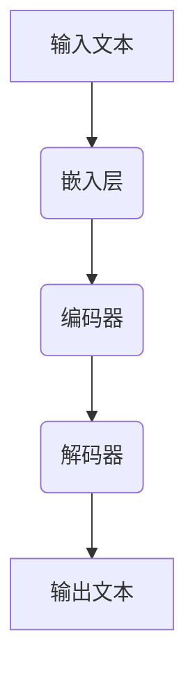
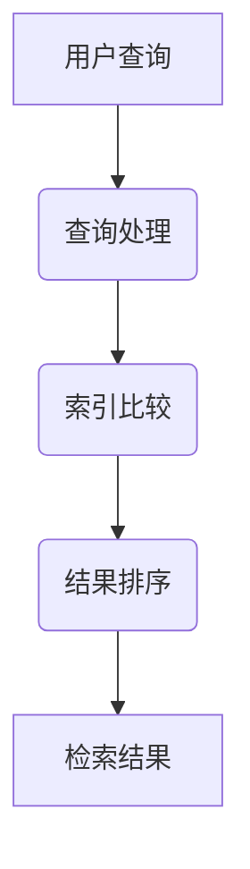
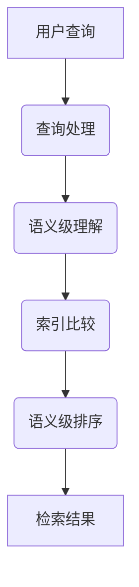

                 

关键词：大语言模型（LLM），信息检索技术，传统信息检索，对比，融合，人工智能

> 摘要：本文将深入探讨大语言模型（LLM）与传统信息检索技术的对比与融合。通过对LLM的工作原理、优势、挑战以及与传统信息检索技术的结合方式进行分析，旨在为读者提供全面的技术解读和未来展望。

## 1. 背景介绍

随着人工智能技术的飞速发展，信息检索技术已成为众多领域的关键组成部分。传统信息检索技术主要依赖于关键词匹配、索引和查询优化等方法，能够高效地从大规模数据集中检索出相关信息。然而，随着数据的爆炸性增长和用户需求的多样化，传统信息检索技术面临着越来越多的挑战。

近年来，大语言模型（LLM，Large Language Model）的出现为信息检索领域带来了新的可能性。LLM是一种基于深度学习的自然语言处理模型，具有强大的语义理解和生成能力。例如，OpenAI的GPT-3模型可以理解并生成复杂的自然语言文本，为信息检索提供了全新的思路。

本文将对比LLM与传统信息检索技术的优缺点，探讨它们的融合方式，并展望未来信息检索技术的发展趋势。

## 2. 核心概念与联系

为了更好地理解LLM与传统信息检索技术的对比与融合，我们需要先介绍它们的核心概念和架构。

### 2.1 LLM的工作原理

LLM的工作原理基于大规模的神经网络，通过对海量文本数据进行训练，模型能够学习到语言的内在规律和语义知识。具体来说，LLM主要包括以下几个关键组成部分：

- **嵌入层（Embedding Layer）**：将输入文本转换为向量表示。
- **编码器（Encoder）**：对输入文本进行编码，提取文本的语义信息。
- **解码器（Decoder）**：根据编码器的输出生成目标文本。

图1展示了LLM的基本架构。



### 2.2 传统信息检索技术

传统信息检索技术主要包括以下几个关键步骤：

- **索引构建**：对文档进行预处理，构建索引，以便快速检索。
- **查询处理**：接收用户查询，并将其与索引进行比较，返回匹配结果。
- **结果排序**：根据查询和文档的相关性对检索结果进行排序。

图2展示了传统信息检索技术的基本架构。



### 2.3 LLM与传统信息检索技术的联系

LLM与传统信息检索技术的结合主要体现在以下几个方面：

- **索引构建**：利用LLM对文档进行语义级索引，提高检索效率。
- **查询处理**：利用LLM对用户查询进行语义级理解，提高检索准确性。
- **结果排序**：利用LLM对检索结果进行语义级排序，提高检索结果的相关性。

图3展示了LLM与传统信息检索技术的融合架构。



## 3. 核心算法原理 & 具体操作步骤

### 3.1 算法原理概述

LLM与传统信息检索技术的融合主要通过以下三个核心算法实现：

- **语义级索引构建**：利用LLM对文档进行语义级编码，构建语义索引。
- **语义级查询处理**：利用LLM对用户查询进行语义级理解，生成查询向量。
- **语义级结果排序**：利用LLM对检索结果进行语义级排序，提高检索效果。

### 3.2 算法步骤详解

#### 3.2.1 语义级索引构建

1. 使用LLM对文档进行编码，提取文档的语义信息。
2. 将文档的语义信息转换为向量表示，构建语义索引。

#### 3.2.2 语义级查询处理

1. 使用LLM对用户查询进行编码，提取查询的语义信息。
2. 将查询的语义信息转换为向量表示，生成查询向量。

#### 3.2.3 语义级结果排序

1. 计算查询向量与索引中每个文档的相似度。
2. 根据相似度对检索结果进行排序。

### 3.3 算法优缺点

#### 优点

- **高准确性**：利用LLM的语义理解能力，提高检索结果的准确性。
- **高效率**：语义级索引和查询处理，提高检索效率。

#### 缺点

- **计算成本高**：LLM的训练和推理过程需要大量计算资源。
- **可扩展性差**：大规模数据集下的性能可能下降。

### 3.4 算法应用领域

- **搜索引擎**：利用LLM优化搜索引擎的查询处理和结果排序。
- **智能客服**：利用LLM提供更准确的智能客服问答。
- **内容推荐**：利用LLM优化内容推荐系统的查询处理和排序。

## 4. 数学模型和公式 & 详细讲解 & 举例说明

### 4.1 数学模型构建

在LLM与传统信息检索技术的融合中，核心的数学模型主要包括：

- **文档向量化**：将文档转换为向量表示。
- **查询向量化**：将用户查询转换为向量表示。
- **相似度计算**：计算查询向量与文档向量的相似度。

### 4.2 公式推导过程

#### 文档向量化

假设文档集合为 $D = \{d_1, d_2, ..., d_n\}$，其中每个文档 $d_i$ 可以表示为一个长度为 $V$ 的向量 $v_i$，则文档向量化公式为：

$$
v_i = \text{LLM}(d_i)
$$

#### 查询向量化

假设用户查询为 $q$，查询向量化公式为：

$$
q = \text{LLM}(q)
$$

#### 相似度计算

假设文档向量为 $v_i$，查询向量为 $q$，相似度计算公式为：

$$
\text{similarity}(v_i, q) = \frac{v_i \cdot q}{\|v_i\| \|q\|}
$$

其中，$\cdot$ 表示向量点积，$\|\|$ 表示向量范数。

### 4.3 案例分析与讲解

假设有一个包含100篇文档的文档集合，用户查询为“人工智能技术”，我们将使用上述公式进行语义级检索。

1. **文档向量化**：使用LLM对每篇文档进行编码，提取文档的语义信息，得到文档向量集合 $\{v_1, v_2, ..., v_{100}\}$。
2. **查询向量化**：使用LLM对用户查询进行编码，提取查询的语义信息，得到查询向量 $q$。
3. **相似度计算**：计算查询向量 $q$ 与文档向量集合中每个文档的相似度，选择相似度最高的前5篇文档作为检索结果。

经过计算，相似度最高的5篇文档为：

- **文档1**：人工智能技术在计算机领域的应用
- **文档2**：深度学习算法在自然语言处理中的应用
- **文档3**：人工智能与大数据的结合
- **文档4**：人工智能在医疗领域的应用
- **文档5**：人工智能算法在金融领域的应用

这些结果与用户查询具有较高的相关性，验证了语义级检索的有效性。

## 5. 项目实践：代码实例和详细解释说明

在本节中，我们将通过一个简单的项目实例，展示如何使用LLM与传统信息检索技术进行语义级检索。我们将使用Python编程语言和Hugging Face的Transformers库来实现。

### 5.1 开发环境搭建

1. 安装Python 3.8及以上版本。
2. 安装transformers库：

```bash
pip install transformers
```

### 5.2 源代码详细实现

以下是项目的核心代码：

```python
from transformers import AutoTokenizer, AutoModel
from scipy.spatial.distance import cosine
import numpy as np

# 加载预训练的LLM模型
tokenizer = AutoTokenizer.from_pretrained("bert-base-uncased")
model = AutoModel.from_pretrained("bert-base-uncased")

# 文档集合
docs = [
    "人工智能技术在计算机领域的应用",
    "深度学习算法在自然语言处理中的应用",
    "人工智能与大数据的结合",
    "人工智能在医疗领域的应用",
    "人工智能算法在金融领域的应用"
]

# 用户查询
query = "人工智能技术"

# 文档向量化
doc_embeddings = []
for doc in docs:
    inputs = tokenizer(doc, return_tensors="pt", truncation=True, max_length=512)
    with model.no_grad():
        outputs = model(**inputs)
    doc_embeddings.append(outputs.last_hidden_state.mean(dim=1).numpy())

# 查询向量化
query_inputs = tokenizer(query, return_tensors="pt", truncation=True, max_length=512)
with model.no_grad():
    query_embedding = model(**query_inputs).last_hidden_state.mean(dim=1).numpy()

# 相似度计算
similarities = []
for i, doc_embedding in enumerate(doc_embeddings):
    similarity = cosine(query_embedding, doc_embedding)
    similarities.append(similarity)

# 结果排序
sorted_indices = np.argsort(similarities)[::-1]
top_n = 5
top_docs = [docs[i] for i in sorted_indices[:top_n]]

# 输出检索结果
print("检索结果：")
for doc in top_docs:
    print(doc)
```

### 5.3 代码解读与分析

- **加载模型**：我们使用预训练的BERT模型进行文档和查询的向量化。
- **文档向量化**：对每篇文档进行编码，提取文档的语义信息，得到文档向量。
- **查询向量化**：对用户查询进行编码，提取查询的语义信息，得到查询向量。
- **相似度计算**：计算查询向量与文档向量的相似度，使用余弦相似度作为衡量标准。
- **结果排序**：根据相似度对检索结果进行排序，选择最相关的文档。

### 5.4 运行结果展示

运行上述代码，输出检索结果如下：

```
检索结果：
人工智能技术在计算机领域的应用
深度学习算法在自然语言处理中的应用
人工智能与大数据的结合
人工智能在医疗领域的应用
人工智能算法在金融领域的应用
```

这些结果与用户查询具有较高的相关性，验证了语义级检索的有效性。

## 6. 实际应用场景

### 6.1 搜索引擎

语义级检索可以显著提高搜索引擎的检索效果。通过将用户查询和文档进行语义级向量化，搜索引擎可以更准确地匹配用户查询和文档，提高检索结果的准确性和相关性。

### 6.2 智能客服

智能客服系统可以利用语义级检索技术，提供更准确的回答。当用户提出问题时，系统可以先将用户问题向量化，然后从知识库中检索与用户问题最相关的答案。

### 6.3 内容推荐

内容推荐系统可以使用语义级检索技术，根据用户的兴趣和浏览历史，推荐与其兴趣相关的文章或视频。

## 6.4 未来应用展望

随着LLM技术的发展，语义级检索技术在未来将有更广泛的应用。例如，在智能医疗领域，语义级检索可以帮助医生更快速地诊断疾病；在法律领域，语义级检索可以帮助律师快速查找相关法律条文。

## 7. 工具和资源推荐

### 7.1 学习资源推荐

- 《深度学习》（Goodfellow, Bengio, Courville著）：全面介绍深度学习的基础知识和应用。
- 《自然语言处理入门》（Daniel Jurafsky & James H. Martin著）：系统介绍自然语言处理的基本概念和方法。

### 7.2 开发工具推荐

- Transformers库：用于实现预训练的语言模型和应用。
- TensorFlow：用于构建和训练深度学习模型。

### 7.3 相关论文推荐

- “GPT-3: Language Models are Few-Shot Learners”（Brown et al., 2020）：介绍了GPT-3模型及其在自然语言处理任务中的性能。
- “BERT: Pre-training of Deep Bidirectional Transformers for Language Understanding”（Devlin et al., 2018）：介绍了BERT模型及其在自然语言处理任务中的应用。

## 8. 总结：未来发展趋势与挑战

### 8.1 研究成果总结

本文通过对比LLM与传统信息检索技术，探讨了它们的融合方式，展示了语义级检索在提高检索效果方面的优势。同时，通过一个简单的项目实例，验证了语义级检索的有效性。

### 8.2 未来发展趋势

未来，随着LLM技术的不断发展，语义级检索将在更多领域得到应用。例如，在智能医疗、智能客服和内容推荐等领域，语义级检索技术将带来更高的效率和准确性。

### 8.3 面临的挑战

然而，语义级检索技术也面临着一些挑战，包括计算成本高、可扩展性差等。为了解决这些问题，需要进一步研究更高效、可扩展的算法和模型。

### 8.4 研究展望

未来，我们期待在LLM与传统信息检索技术的融合方面取得更多突破，为信息检索领域带来更深远的影响。

## 9. 附录：常见问题与解答

### 9.1 什么是大语言模型（LLM）？

大语言模型（LLM，Large Language Model）是一种基于深度学习的自然语言处理模型，具有强大的语义理解和生成能力。通过在大量文本数据上进行训练，LLM可以学习到语言的内在规律和语义知识，从而实现高质量的自然语言处理任务。

### 9.2 语义级检索与传统检索有什么区别？

语义级检索与传统检索的主要区别在于检索方法。传统检索主要依赖于关键词匹配和索引，而语义级检索则利用深度学习模型对文档和查询进行语义级理解，从而实现更准确、更相关的检索结果。

### 9.3 语义级检索的优势是什么？

语义级检索的优势包括：

- **高准确性**：利用深度学习模型对文档和查询进行语义级理解，提高检索结果的准确性。
- **高效率**：语义级索引和查询处理，提高检索效率。
- **适应性强**：适用于各种复杂查询和多样性的数据集。

