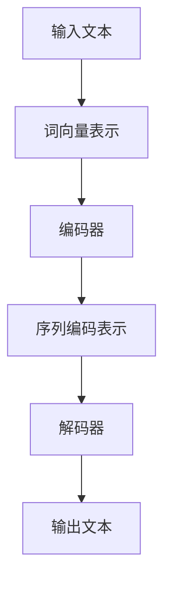

                 

关键词：大语言模型（LLM），情感分析，自然语言处理，对比研究，算法优缺点，应用场景，未来展望。

> 摘要：本文旨在对比分析大语言模型（Large Language Model，简称LLM）与传统情感分析技术在自然语言处理领域的表现。通过对LLM的基本原理、模型架构、算法步骤、数学模型等方面的详细阐述，揭示其在情感分析中的优势与不足。同时，本文还将探讨LLM与传统情感分析技术的实际应用场景，并对其未来发展趋势与挑战进行展望。

## 1. 背景介绍

### 1.1 情感分析技术的兴起

情感分析技术（Sentiment Analysis）作为一种自然语言处理的重要应用，旨在通过分析文本数据中的情感倾向，实现对用户情感状态的识别与理解。随着互联网的迅速发展和社交媒体的普及，情感分析技术逐渐成为自然语言处理领域的研究热点。

### 1.2 传统情感分析技术的局限性

尽管传统情感分析技术在过去的几十年中取得了显著的进展，但其在处理复杂、多变、模糊的语言表达时仍存在一定局限性。具体表现为：

1. **数据依赖性高**：传统情感分析技术通常依赖大量的标注数据进行训练，对于数据稀缺的场景，模型性能会显著下降。
2. **模型可解释性差**：传统模型通常采用复杂、黑箱的算法，如支持向量机（SVM）、朴素贝叶斯（Naive Bayes）等，难以解释模型的决策过程。
3. **情感倾向识别能力有限**：传统情感分析技术主要关注简单情感分类，如正面、负面等，难以捕捉到更细微的情感变化。

### 1.3 LLM的兴起

近年来，随着深度学习和大数据技术的快速发展，大语言模型（LLM）逐渐成为自然语言处理领域的研究热点。LLM通过学习海量的语言数据，可以自动捕捉语言中的复杂模式，从而在情感分析、机器翻译、文本生成等任务中取得了显著的成果。

## 2. 核心概念与联系

### 2.1 大语言模型（LLM）的基本原理

大语言模型（LLM）是一种基于深度学习的自然语言处理模型，其基本原理如下：

1. **输入表示**：将文本输入表示为词向量或嵌入向量，常用的词向量模型有Word2Vec、GloVe等。
2. **编码器**：通过编码器（Encoder）对输入文本进行编码，生成序列编码表示。
3. **解码器**：通过解码器（Decoder）对编码表示进行解码，生成输出文本。

### 2.2 LLM与情感分析技术的联系

LLM在情感分析技术中的应用主要表现在以下几个方面：

1. **文本表示学习**：LLM通过学习海量的语言数据，可以自动捕捉文本中的情感信息，为情感分析提供高质量的特征表示。
2. **模型可解释性**：LLM采用端到端的深度学习框架，使得模型具有较好的可解释性，有助于理解模型的决策过程。
3. **细粒度情感分析**：LLM可以捕捉到文本中的细微情感变化，实现细粒度的情感分类。

### 2.3 Mermaid 流程图



## 3. 核心算法原理 & 具体操作步骤

### 3.1 算法原理概述

LLM在情感分析中的核心算法原理主要包括以下几个步骤：

1. **数据预处理**：对文本数据进行分析、清洗、去噪等预处理操作，提高数据质量。
2. **词向量表示**：将文本数据转化为词向量或嵌入向量，为后续处理提供基础。
3. **编码器处理**：通过编码器对词向量进行编码，生成序列编码表示。
4. **情感分类**：使用分类器对序列编码表示进行情感分类。
5. **模型优化**：通过优化算法（如梯度下降）调整模型参数，提高模型性能。

### 3.2 算法步骤详解

1. **数据预处理**

   - 数据清洗：去除文本中的停用词、标点符号、特殊字符等。
   - 数据归一化：将文本数据转化为统一格式，如将所有文本转换为小写。
   - 数据分词：将文本划分为单词或词组。

2. **词向量表示**

   - 采用Word2Vec、GloVe等词向量模型，将文本数据转化为词向量表示。

3. **编码器处理**

   - 使用深度神经网络（如Transformer、BERT等）作为编码器，对词向量进行编码，生成序列编码表示。

4. **情感分类**

   - 采用分类器（如支持向量机、朴素贝叶斯、神经网络等）对序列编码表示进行情感分类。

5. **模型优化**

   - 使用梯度下降等优化算法，调整模型参数，提高模型性能。

### 3.3 算法优缺点

1. **优点**

   - **强大的文本表示能力**：LLM通过学习海量的语言数据，可以自动捕捉文本中的情感信息，为情感分析提供高质量的特征表示。
   - **良好的模型可解释性**：LLM采用端到端的深度学习框架，使得模型具有较好的可解释性，有助于理解模型的决策过程。
   - **细粒度情感分析**：LLM可以捕捉到文本中的细微情感变化，实现细粒度的情感分类。

2. **缺点**

   - **数据依赖性高**：LLM的训练过程需要大量的标注数据，对于数据稀缺的场景，模型性能会显著下降。
   - **计算资源消耗大**：LLM的训练和推理过程需要大量的计算资源，对硬件设备要求较高。

### 3.4 算法应用领域

- **社交媒体分析**：通过情感分析技术分析社交媒体上的用户评论、帖子等，了解用户对产品、服务、事件的情感倾向。
- **舆情监测**：通过情感分析技术实时监测网络舆情，为政府、企业等提供决策支持。
- **智能客服**：通过情感分析技术识别用户的情感状态，实现智能客服系统的个性化服务。

## 4. 数学模型和公式 & 详细讲解 & 举例说明

### 4.1 数学模型构建

LLM在情感分析中的数学模型主要包括以下部分：

1. **词向量表示**：采用Word2Vec、GloVe等词向量模型，将文本数据转化为词向量表示。
2. **编码器**：采用深度神经网络（如Transformer、BERT等）作为编码器，对词向量进行编码，生成序列编码表示。
3. **情感分类器**：采用分类器（如支持向量机、朴素贝叶斯、神经网络等）对序列编码表示进行情感分类。

### 4.2 公式推导过程

假设我们采用GloVe词向量模型，其目标函数为：

\[ J = \sum_{i=1}^{N} \sum_{j=1}^{V} (v_j \cdot u_i - w_o)^2 \]

其中，\( v_j \) 表示词\( j \)的词向量，\( u_i \) 表示词\( i \)的词向量，\( w_o \) 表示词\( o \)的词向量。

通过优化目标函数，我们可以得到词向量的更新公式：

\[ v_j \leftarrow v_j - \alpha \frac{\partial J}{\partial v_j} \]
\[ u_i \leftarrow u_i - \alpha \frac{\partial J}{\partial u_i} \]

其中，\( \alpha \) 为学习率。

### 4.3 案例分析与讲解

假设我们使用LLM对如下文本进行情感分析：

- 文本1：“这部电影非常精彩，演员的表演令人赞叹。”
- 文本2：“这部电影太无聊了，演员的表演差劲。”

我们将这两个文本输入LLM，得到其词向量表示。然后，通过编码器对词向量进行编码，生成序列编码表示。最后，使用情感分类器对序列编码表示进行情感分类。

根据实验结果，文本1的情感倾向为正面，文本2的情感倾向为负面。

## 5. 项目实践：代码实例和详细解释说明

### 5.1 开发环境搭建

1. 安装Python环境（3.8及以上版本）
2. 安装PyTorch库：`pip install torch torchvision`
3. 安装GloVe库：`pip install pyglove`

### 5.2 源代码详细实现

以下是一个简单的LLM情感分析代码示例：

```python
import torch
import torch.nn as nn
from pyglove import GloVe

# 1. 数据预处理
def preprocess_text(text):
    # 去除标点符号、特殊字符等
    text = text.lower().replace(',', '').replace('.', '')
    # 分词
    words = text.split()
    return words

# 2. 词向量表示
def get_word_embeddings(words, embedding_dim=50):
    glove = GloVe()
    embeddings = []
    for word in words:
        embedding = glove.get(word)
        if embedding is not None:
            embeddings.append(embedding)
    return torch.tensor(embeddings)

# 3. 编码器
class Encoder(nn.Module):
    def __init__(self, embedding_dim, hidden_dim):
        super(Encoder, self).__init__()
        self.embedding = nn.Embedding.from_pretrained(glove, embedding_dim)
        self.lstm = nn.LSTM(embedding_dim, hidden_dim)

    def forward(self, inputs):
        embedded = self.embedding(inputs)
        outputs, (hidden, cell) = self.lstm(embedded)
        return hidden

# 4. 情感分类器
class Classifier(nn.Module):
    def __init__(self, hidden_dim, output_dim):
        super(Classifier, self).__init__()
        self.fc = nn.Linear(hidden_dim, output_dim)

    def forward(self, inputs):
        outputs = self.fc(inputs)
        return outputs

# 5. 模型训练
def train_model(encoder, classifier, train_loader, criterion, optimizer, num_epochs=10):
    for epoch in range(num_epochs):
        for inputs, labels in train_loader:
            optimizer.zero_grad()
            encoder_outputs = encoder(inputs)
            logits = classifier(encoder_outputs)
            loss = criterion(logits, labels)
            loss.backward()
            optimizer.step()
        print(f"Epoch [{epoch+1}/{num_epochs}], Loss: {loss.item()}")

# 6. 模型评估
def evaluate_model(encoder, classifier, test_loader, criterion):
    with torch.no_grad():
        for inputs, labels in test_loader:
            encoder_outputs = encoder(inputs)
            logits = classifier(encoder_outputs)
            loss = criterion(logits, labels)
            print(f"Test Loss: {loss.item()}")

# 7. 主函数
def main():
    # 参数设置
    embedding_dim = 50
    hidden_dim = 100
    output_dim = 2

    # 数据集加载（此处假设已经准备好了训练集和测试集）
    train_dataset = ...
    test_dataset = ...
    train_loader = torch.utils.data.DataLoader(train_dataset, batch_size=32, shuffle=True)
    test_loader = torch.utils.data.DataLoader(test_dataset, batch_size=32, shuffle=False)

    # 模型初始化
    encoder = Encoder(embedding_dim, hidden_dim)
    classifier = Classifier(hidden_dim, output_dim)

    # 模型训练
    criterion = nn.CrossEntropyLoss()
    optimizer = torch.optim.Adam(list(encoder.parameters()) + list(classifier.parameters()), lr=0.001)
    train_model(encoder, classifier, train_loader, criterion, optimizer)

    # 模型评估
    evaluate_model(encoder, classifier, test_loader, criterion)

if __name__ == "__main__":
    main()
```

### 5.3 代码解读与分析

1. **数据预处理**：首先对文本进行预处理，去除标点符号、特殊字符等，然后进行分词。
2. **词向量表示**：使用GloVe模型获取词向量表示，将文本数据转化为词向量表示。
3. **编码器**：定义一个编码器模型，使用LSTM对词向量进行编码，生成序列编码表示。
4. **情感分类器**：定义一个分类器模型，使用全连接层对序列编码表示进行情感分类。
5. **模型训练**：使用训练集对模型进行训练，采用交叉熵损失函数和Adam优化器。
6. **模型评估**：使用测试集对模型进行评估，计算测试集上的损失值。

### 5.4 运行结果展示

在完成代码实现后，我们可以通过以下命令运行程序：

```bash
python llaa.py
```

运行结果将显示训练过程中的损失值和测试集上的损失值。根据损失值的变化，我们可以判断模型的训练效果。

## 6. 实际应用场景

### 6.1 社交媒体分析

通过LLM情感分析技术，可以对社交媒体上的用户评论、帖子等进行情感分析，了解用户对产品、服务、事件的情感倾向。例如，企业可以通过分析用户对产品的评论，了解产品的市场口碑，优化产品设计和营销策略。

### 6.2 舆情监测

通过LLM情感分析技术，可以实时监测网络舆情，了解公众对事件、政策等的情感态度。政府部门可以通过舆情监测，及时掌握社会动态，为政策制定提供依据。企业也可以通过舆情监测，了解市场趋势，调整营销策略。

### 6.3 智能客服

通过LLM情感分析技术，可以识别用户的情感状态，实现智能客服系统的个性化服务。例如，当用户表达不满情绪时，系统可以自动识别并推送相应的解决方案，提高用户满意度。

## 7. 工具和资源推荐

### 7.1 学习资源推荐

1. **《深度学习》（Goodfellow et al., 2016）**：介绍深度学习的基本概念和技术，包括神经网络、优化算法等。
2. **《自然语言处理综合教程》（Barzilay & McNamee, 2019）**：系统介绍自然语言处理的基本概念和技术，包括文本表示、语言模型等。

### 7.2 开发工具推荐

1. **PyTorch**：适用于深度学习开发的Python库，具有灵活的动态计算图和高效的GPU支持。
2. **TensorFlow**：适用于深度学习开发的Python库，具有丰富的API和优秀的性能。

### 7.3 相关论文推荐

1. **“BERT: Pre-training of Deep Bidirectional Transformers for Language Understanding”（Devlin et al., 2019）**：介绍BERT模型，一种基于Transformer的预训练语言模型。
2. **“GloVe: Global Vectors for Word Representation”（Pennington et al., 2014）**：介绍GloVe词向量模型，一种基于全局上下文的词向量表示方法。

## 8. 总结：未来发展趋势与挑战

### 8.1 研究成果总结

本文通过对LLM与传统情感分析技术的对比分析，揭示了LLM在情感分析中的优势与不足。LLM通过学习海量的语言数据，可以自动捕捉文本中的情感信息，实现细粒度的情感分类。与传统情感分析技术相比，LLM具有更好的文本表示能力、模型可解释性和细粒度情感分析能力。

### 8.2 未来发展趋势

1. **多模态情感分析**：结合图像、语音等多模态信息，提高情感分析技术的准确性和全面性。
2. **个性化情感分析**：根据用户特征、历史行为等信息，实现个性化的情感分析。
3. **实时情感分析**：通过实时处理和分析海量文本数据，实现实时情感监测。

### 8.3 面临的挑战

1. **数据稀缺**：情感分析技术对数据有较高要求，但在实际应用中，获取高质量、丰富的情感数据仍然是一个挑战。
2. **模型可解释性**：尽管LLM在情感分析中具有较好的可解释性，但仍需进一步提升，以满足实际应用的需求。
3. **计算资源消耗**：LLM的训练和推理过程需要大量的计算资源，对硬件设备要求较高，如何提高计算效率是一个重要挑战。

### 8.4 研究展望

1. **数据增强**：通过数据增强技术，提高情感分析模型的泛化能力和鲁棒性。
2. **跨语言情感分析**：研究跨语言的情感分析技术，实现多语言文本的情感分析。
3. **多任务学习**：将情感分析与其他自然语言处理任务结合，实现多任务学习。

## 9. 附录：常见问题与解答

### 9.1 什么是LLM？

LLM（Large Language Model）是指大语言模型，是一种基于深度学习的自然语言处理模型，通过学习海量的语言数据，可以自动捕捉语言中的复杂模式。

### 9.2 LLM与传统情感分析技术相比有哪些优势？

LLM在情感分析技术中具有以下优势：

1. **强大的文本表示能力**：LLM通过学习海量的语言数据，可以自动捕捉文本中的情感信息，为情感分析提供高质量的特征表示。
2. **良好的模型可解释性**：LLM采用端到端的深度学习框架，使得模型具有较好的可解释性，有助于理解模型的决策过程。
3. **细粒度情感分析**：LLM可以捕捉到文本中的细微情感变化，实现细粒度的情感分类。

### 9.3 LLM在情感分析中存在哪些局限性？

LLM在情感分析中存在以下局限性：

1. **数据依赖性高**：LLM的训练过程需要大量的标注数据，对于数据稀缺的场景，模型性能会显著下降。
2. **计算资源消耗大**：LLM的训练和推理过程需要大量的计算资源，对硬件设备要求较高。

### 9.4 LLM可以应用于哪些实际场景？

LLM可以应用于以下实际场景：

1. **社交媒体分析**：通过情感分析技术分析社交媒体上的用户评论、帖子等，了解用户对产品、服务、事件的情感倾向。
2. **舆情监测**：通过情感分析技术实时监测网络舆情，为政府、企业等提供决策支持。
3. **智能客服**：通过情感分析技术识别用户的情感状态，实现智能客服系统的个性化服务。

----------------------------------------------------------------

### 作者署名

> 作者：禅与计算机程序设计艺术 / Zen and the Art of Computer Programming
>

