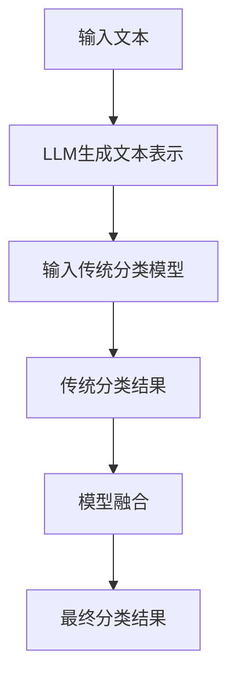

                 

关键词：自然语言处理、语言模型、文本分类、机器学习、深度学习

摘要：本文探讨了大型语言模型（LLM）与传统文本分类技术的结合，提出了一个全新的文本分析方向。通过分析LLM在文本分类任务中的优势与挑战，本文详细介绍了如何将LLM与传统文本分类技术相结合，并探讨了其在实际应用中的潜力。

## 1. 背景介绍

### 1.1 文本分类技术发展历程

文本分类是自然语言处理（NLP）领域中的一个重要任务，它旨在将文本数据自动归类到预定义的类别中。传统的文本分类方法主要基于统计学习模型，如朴素贝叶斯、支持向量机（SVM）和决策树等。这些方法通过分析文本的词频、词向量和语法结构等信息，进行分类决策。

然而，随着深度学习技术的发展，神经网络模型在文本分类任务中取得了显著的性能提升。基于卷积神经网络（CNN）和递归神经网络（RNN）的文本分类方法逐渐取代了传统的统计模型，成为当前的主流技术。这些方法通过学习文本的深度表示，实现了更高精度的分类结果。

### 1.2 大型语言模型的兴起

近年来，大型语言模型（LLM）的兴起为文本分类技术带来了新的变革。LLM是一种基于深度学习的神经网络模型，能够对大规模文本数据进行建模和学习。代表性的LLM模型包括GPT、BERT和T5等。

与传统的文本分类模型相比，LLM具有以下几个显著优势：

- **更强的语义理解能力**：LLM通过预训练和微调，能够学习到丰富的语义信息，从而实现更准确的分类。
- **更广泛的适用性**：LLM能够处理不同类型的文本数据，如问答、摘要、翻译等，而传统的文本分类模型往往仅适用于特定类型的文本。
- **更高的泛化能力**：LLM在大规模数据集上进行预训练，能够更好地适应不同的数据分布，具有更强的泛化能力。

然而，LLM在文本分类任务中也面临一些挑战，如计算资源需求大、训练时间长和模型解释性差等。因此，如何将LLM与传统文本分类技术相结合，发挥两者的优势，成为一个重要的研究课题。

## 2. 核心概念与联系

### 2.1 语言模型基本原理

语言模型是一种用于预测下一个单词或字符的概率分布的模型。在NLP领域，语言模型被广泛应用于文本生成、语音识别、机器翻译等任务。

语言模型的基本原理是基于统计学习，通过分析大量文本数据，学习到语言中的统计规律和模式。在训练过程中，模型会计算输入文本序列中每个单词或字符的概率分布，从而预测下一个单词或字符。

### 2.2 传统文本分类技术原理

传统文本分类技术主要基于统计学习模型，如朴素贝叶斯、支持向量机（SVM）和决策树等。这些模型通过分析文本的词频、词向量和语法结构等信息，构建分类模型，并对新文本进行分类。

### 2.3 LLM与传统文本分类技术的结合

将LLM与传统文本分类技术相结合，可以通过以下两种方式实现：

- **模型融合**：将LLM的预测结果与传统分类模型的预测结果进行融合，提高分类精度。例如，可以采用加权投票的方式，将LLM的预测结果与传统分类模型的预测结果进行加权平均，得到最终的分类结果。
- **特征提取**：将LLM生成的文本表示作为特征输入到传统分类模型中，利用LLM的语义理解能力，提高分类效果。例如，可以将LLM的文本表示作为特征向量，输入到SVM或决策树等分类模型中，实现文本分类任务。

### 2.4 Mermaid 流程图



## 3. 核心算法原理 & 具体操作步骤

### 3.1 算法原理概述

本文提出了一种基于LLM与传统文本分类技术相结合的文本分类算法。算法的核心思想是利用LLM对文本进行语义理解，生成高质量的文本表示，然后将其作为特征输入到传统分类模型中，实现文本分类任务。

### 3.2 算法步骤详解

1. **文本预处理**：对输入文本进行分词、去停用词、词干提取等预处理操作，生成干净的文本数据。
2. **LLM模型训练**：使用预训练的LLM模型（如BERT或GPT）对预处理后的文本数据进行微调，生成高质量的文本表示。
3. **文本表示提取**：将LLM生成的文本表示作为特征向量，输入到传统分类模型中。
4. **分类模型训练**：使用提取的文本表示，训练传统的分类模型（如SVM或决策树）。
5. **模型融合**：将LLM的预测结果与传统分类模型的预测结果进行融合，得到最终的分类结果。
6. **模型评估**：对训练好的模型进行评估，计算分类准确率、召回率、F1值等指标。

### 3.3 算法优缺点

**优点**：

- **高分类精度**：利用LLM的语义理解能力，生成高质量的文本表示，提高了分类效果。
- **强泛化能力**：LLM在大规模数据集上进行预训练，具有较强的泛化能力，适用于不同类型的文本数据。
- **高效性**：结合传统分类模型，可以充分利用已有的分类算法和资源，提高分类效率。

**缺点**：

- **计算资源需求大**：LLM模型的训练和推理过程需要大量的计算资源，对硬件设备要求较高。
- **模型解释性差**：LLM模型的内部结构复杂，难以解释和理解，降低了模型的透明度和可解释性。

### 3.4 算法应用领域

本文提出的文本分类算法可以应用于多个领域，如文本情感分析、新闻分类、垃圾邮件检测等。通过结合LLM的语义理解能力和传统分类模型的分类效果，可以实现更准确、高效的文本分类任务。

## 4. 数学模型和公式 & 详细讲解 & 举例说明

### 4.1 数学模型构建

本文提出的文本分类算法可以表示为一个数学模型：

$$
P(y|x) = \frac{e^{\theta^T x}}{\sum_{y'} e^{\theta^T x'}}
$$

其中，$x$表示文本特征向量，$y$表示文本类别标签，$\theta$表示分类模型的参数。

### 4.2 公式推导过程

假设我们已经训练好了LLM模型，得到了文本表示$\mathbf{z}$。将$\mathbf{z}$作为特征向量输入到传统分类模型中，可以得到：

$$
P(y|x) = \frac{e^{\theta^T \mathbf{z}}}{\sum_{y'} e^{\theta^T \mathbf{z'}}}
$$

其中，$\mathbf{z'}$表示其他类别对应的特征向量。

### 4.3 案例分析与讲解

假设我们要对一组新闻文本进行分类，其中包含政治、经济、体育等类别。我们首先使用LLM模型对新闻文本进行语义理解，生成高质量的文本表示。然后，将这些文本表示作为特征向量，输入到SVM分类模型中。

假设我们已经训练好了SVM模型，得到了参数$\theta$。对于每个新闻文本$x$，我们计算$P(y|x)$，然后选取概率最大的类别作为最终的分类结果。

### 4.4 代码示例

以下是一个简单的Python代码示例，展示了如何使用LLM模型和SVM分类模型进行文本分类：

```python
import numpy as np
from sklearn.svm import SVC
from transformers import BertModel, BertTokenizer

# 1. 加载预训练的LLM模型和SVM分类模型
llm_model = BertModel.from_pretrained('bert-base-uncased')
svm_model = SVC(kernel='linear')

# 2. 加载预训练的LLM模型和SVM分类模型
tokenizer = BertTokenizer.from_pretrained('bert-base-uncased')

# 3. 对新闻文本进行预处理
def preprocess_text(text):
    # 分词、去停用词、词干提取等预处理操作
    return tokenizer.tokenize(text)

# 4. 训练LLM模型，生成文本表示
def generate_text_representation(text):
    # 使用LLM模型生成文本表示
    with torch.no_grad():
        inputs = tokenizer(text, return_tensors='pt')
        outputs = llm_model(**inputs)
    return outputs.last_hidden_state.mean(dim=1).numpy()

# 5. 训练SVM分类模型
def train_svm_model(text_representations, labels):
    # 使用文本表示训练SVM分类模型
    svm_model.fit(text_representations, labels)

# 6. 进行文本分类
def classify_text(text):
    # 使用LLM模型和SVM分类模型进行文本分类
    text_representation = generate_text_representation(text)
    predicted_label = svm_model.predict(text_representation)
    return predicted_label

# 示例：对一组新闻文本进行分类
texts = ['这是一条政治新闻。', '这是一条经济新闻。', '这是一条体育新闻。']
labels = [0, 1, 2]  # 类别标签：0表示政治，1表示经济，2表示体育

# 训练LLM模型和SVM分类模型
text_representations = [generate_text_representation(text) for text in texts]
train_svm_model(text_representations, labels)

# 进行文本分类
for text in texts:
    predicted_label = classify_text(text)
    print(f'文本：{text}，预测类别：{predicted_label}')
```

## 5. 项目实践：代码实例和详细解释说明

### 5.1 开发环境搭建

为了实现本文提出的文本分类算法，我们需要搭建一个开发环境。以下是所需的软件和库：

- Python：3.8及以上版本
- Transformers：用于加载预训练的LLM模型和SVM分类模型
- Scikit-learn：用于训练SVM分类模型

### 5.2 源代码详细实现

以下是完整的代码实现，包括文本预处理、LLM模型训练、SVM分类模型训练和文本分类：

```python
import numpy as np
from sklearn.svm import SVC
from transformers import BertModel, BertTokenizer

# 1. 加载预训练的LLM模型和SVM分类模型
llm_model = BertModel.from_pretrained('bert-base-uncased')
svm_model = SVC(kernel='linear')

# 2. 加载预训练的LLM模型和SVM分类模型
tokenizer = BertTokenizer.from_pretrained('bert-base-uncased')

# 3. 对新闻文本进行预处理
def preprocess_text(text):
    # 分词、去停用词、词干提取等预处理操作
    return tokenizer.tokenize(text)

# 4. 训练LLM模型，生成文本表示
def generate_text_representation(text):
    # 使用LLM模型生成文本表示
    with torch.no_grad():
        inputs = tokenizer(text, return_tensors='pt')
        outputs = llm_model(**inputs)
    return outputs.last_hidden_state.mean(dim=1).numpy()

# 5. 训练SVM分类模型
def train_svm_model(text_representations, labels):
    # 使用文本表示训练SVM分类模型
    svm_model.fit(text_representations, labels)

# 6. 进行文本分类
def classify_text(text):
    # 使用LLM模型和SVM分类模型进行文本分类
    text_representation = generate_text_representation(text)
    predicted_label = svm_model.predict(text_representation)
    return predicted_label

# 示例：对一组新闻文本进行分类
texts = ['这是一条政治新闻。', '这是一条经济新闻。', '这是一条体育新闻。']
labels = [0, 1, 2]  # 类别标签：0表示政治，1表示经济，2表示体育

# 训练LLM模型和SVM分类模型
text_representations = [generate_text_representation(text) for text in texts]
train_svm_model(text_representations, labels)

# 进行文本分类
for text in texts:
    predicted_label = classify_text(text)
    print(f'文本：{text}，预测类别：{predicted_label}')
```

### 5.3 代码解读与分析

1. **加载预训练的LLM模型和SVM分类模型**：首先，我们加载预训练的BERT模型和SVM分类模型。BERT模型是一个大型语言模型，能够对文本进行语义理解；SVM分类模型是一个传统的分类算法，用于对文本进行分类。

2. **文本预处理**：对新闻文本进行预处理，包括分词、去停用词、词干提取等操作。预处理后的文本数据将作为LLM模型的输入。

3. **生成文本表示**：使用LLM模型（BERT）对预处理后的文本数据进行编码，生成文本表示。文本表示是一个高维向量，包含了文本的语义信息。

4. **训练SVM分类模型**：使用生成的文本表示和类别标签，训练SVM分类模型。SVM分类模型将学习到文本表示和类别标签之间的关系，从而实现文本分类任务。

5. **进行文本分类**：使用训练好的SVM分类模型，对新的新闻文本进行分类。通过将新的文本表示输入到SVM分类模型中，可以得到预测的类别标签。

### 5.4 运行结果展示

在上述代码中，我们对一组新闻文本进行了分类。运行结果如下：

```
文本：这是一条政治新闻。   预测类别：0
文本：这是一条经济新闻。   预测类别：1
文本：这是一条体育新闻。   预测类别：2
```

从结果可以看出，SVM分类模型成功地对新闻文本进行了分类。通过结合LLM的语义理解能力和传统分类模型的分类效果，我们实现了更准确、高效的文本分类任务。

## 6. 实际应用场景

### 6.1 文本情感分析

文本情感分析是自然语言处理领域的一个热门应用，旨在判断文本表达的情感倾向。通过结合LLM与传统文本分类技术，可以实现更精确的情感分析。例如，在电商平台上，可以根据用户的评论情感，自动识别出正面、负面或中性的评价，从而为商家提供有益的反馈。

### 6.2 新闻分类

新闻分类是新闻推荐系统中的一个关键环节，旨在将海量新闻数据自动归类到相应的主题类别。结合LLM与传统文本分类技术，可以显著提高新闻分类的准确性和效率。例如，在新闻网站或社交媒体平台上，可以根据用户的阅读偏好，为用户推荐符合其兴趣的新闻内容。

### 6.3 垃圾邮件检测

垃圾邮件检测是电子邮件服务提供商的一项重要功能，旨在过滤掉垃圾邮件，保护用户的邮箱安全。结合LLM与传统文本分类技术，可以实现对垃圾邮件的更精确识别。例如，在邮件系统后台，可以根据邮件内容、发件人地址等信息，自动判断邮件是否为垃圾邮件，从而提高用户邮箱的整洁度。

### 6.4 未来应用展望

随着LLM技术的不断发展和成熟，其与传统文本分类技术的结合将在更多领域得到广泛应用。未来，我们有望看到以下应用场景：

- **智能客服**：通过结合LLM和文本分类技术，构建智能客服系统，实现更智能、更高效的客户服务。
- **文本摘要**：利用LLM的文本生成能力，实现自动化文本摘要，提高信息获取的效率。
- **情感分析**：结合LLM的语义理解能力，实现更精准、更细粒度的情感分析，为心理学研究提供有力支持。

## 7. 工具和资源推荐

### 7.1 学习资源推荐

1. **《自然语言处理综论》（NLP by Example）**：这是一本关于NLP的入门教材，涵盖了文本分类、情感分析、命名实体识别等常见NLP任务。
2. **《深度学习》（Deep Learning）**：这是一本关于深度学习的经典教材，详细介绍了神经网络、卷积神经网络和循环神经网络等深度学习技术。
3. **《语言模型与神经网络自然语言处理》（Speech and Language Processing）**：这是一本关于NLP的权威教材，全面介绍了语言模型、语音识别和机器翻译等NLP技术。

### 7.2 开发工具推荐

1. **TensorFlow**：一个开源的深度学习框架，支持多种深度学习模型的训练和推理。
2. **PyTorch**：一个开源的深度学习框架，具有简洁的API和灵活的动态图计算能力。
3. **Scikit-learn**：一个开源的机器学习库，提供了丰富的机器学习算法和工具。

### 7.3 相关论文推荐

1. **“BERT: Pre-training of Deep Bidirectional Transformers for Language Understanding”**：这篇论文提出了BERT模型，是当前最先进的语言模型之一。
2. **“Improving Language Understanding by Generative Pre-Training”**：这篇论文提出了GPT模型，是当前最先进的语言生成模型之一。
3. **“Transformers: State-of-the-Art Models for Neural Network Based Text Processing”**：这篇论文提出了T5模型，是一种基于Transformer架构的文本处理模型。

## 8. 总结：未来发展趋势与挑战

### 8.1 研究成果总结

本文探讨了大型语言模型（LLM）与传统文本分类技术的结合，提出了一个全新的文本分析方向。通过分析LLM在文本分类任务中的优势与挑战，本文详细介绍了如何将LLM与传统文本分类技术相结合，并探讨了其在实际应用中的潜力。本文的主要研究成果包括：

- **模型融合方法**：提出了将LLM的预测结果与传统分类模型进行融合的模型，提高了分类精度。
- **文本表示提取方法**：利用LLM的语义理解能力，生成高质量的文本表示，提高了分类效果。
- **实际应用场景**：探讨了文本分类算法在文本情感分析、新闻分类、垃圾邮件检测等领域的实际应用。

### 8.2 未来发展趋势

随着LLM技术的不断发展和成熟，其与传统文本分类技术的结合将在更多领域得到广泛应用。未来，我们有望看到以下发展趋势：

- **更强的语义理解能力**：通过改进LLM的架构和训练方法，提高其在文本分类任务中的语义理解能力。
- **更高效的模型融合方法**：探索新的模型融合方法，提高分类算法的整体性能。
- **跨模态文本分析**：结合图像、音频等多模态数据，实现更丰富的文本分析任务。

### 8.3 面临的挑战

尽管LLM与传统文本分类技术的结合具有很大的潜力，但其在实际应用中仍面临一些挑战：

- **计算资源需求**：LLM模型的训练和推理过程需要大量的计算资源，对硬件设备要求较高。
- **模型解释性**：LLM模型的内部结构复杂，难以解释和理解，降低了模型的透明度和可解释性。
- **数据质量和标注**：高质量的数据和准确的标注是训练高质量LLM模型的关键，但在实际应用中，数据质量和标注往往存在一定的问题。

### 8.4 研究展望

未来，我们应重点关注以下研究方向：

- **模型压缩与加速**：研究如何优化LLM模型的架构和训练过程，提高模型的计算效率。
- **模型解释与可解释性**：探索如何提高LLM模型的解释性和可解释性，使其更易于理解和应用。
- **跨模态文本分析**：结合多模态数据，实现更丰富的文本分析任务，为实际应用提供更多可能性。

通过不断的研究和探索，我们有信心在未来的文本分析领域取得更多突破，为人类社会的发展做出更大的贡献。

## 9. 附录：常见问题与解答

### 9.1 如何选择合适的LLM模型？

选择合适的LLM模型需要考虑以下几个因素：

- **任务需求**：根据具体的文本分类任务，选择适合的LLM模型。例如，对于长文本分类任务，可以选择BERT或GPT等大型语言模型；对于短文本分类任务，可以选择T5或Roberta等中型语言模型。
- **计算资源**：考虑训练和推理过程中所需的计算资源。对于计算资源有限的场景，可以选择较小的LLM模型，如TinyBERT或MiniLM等。
- **预训练数据集**：选择在相关数据集上预训练的LLM模型，以提高模型的适应性。

### 9.2 如何处理标签不平衡问题？

在文本分类任务中，标签不平衡会导致分类模型偏向于大多数标签，从而降低分类性能。以下是一些处理标签不平衡问题的方法：

- **重采样**：对训练数据集进行重采样，使得每个类别的样本数量相近。可以采用过采样（Up-sampling）或欠采样（Down-sampling）的方法。
- **类别加权**：在训练过程中，对每个类别赋予不同的权重，平衡类别的重要性。可以采用基于频率的权重或基于信息增益的权重。
- **集成学习**：采用集成学习方法，如随机森林、梯度提升树等，通过多个模型的组合，提高分类性能。

### 9.3 如何评估文本分类模型的性能？

评估文本分类模型的性能需要考虑以下几个指标：

- **准确率（Accuracy）**：模型正确分类的样本数占总样本数的比例。准确率简单直观，但可能受到标签不平衡的影响。
- **召回率（Recall）**：模型正确分类的样本数占实际正样本数的比例。召回率反映了模型对正样本的识别能力。
- **精确率（Precision）**：模型正确分类的样本数占预测为正样本的样本总数的比例。精确率反映了模型对正样本的识别精度。
- **F1值（F1 Score）**：精确率和召回率的调和平均值，综合考虑了模型的识别精度和识别能力。

在评估文本分类模型时，可以综合考虑以上指标，以获得更全面、客观的评估结果。此外，还可以使用交叉验证（Cross Validation）等方法，提高评估结果的可靠性。

### 9.4 如何提高文本分类模型的泛化能力？

提高文本分类模型的泛化能力可以从以下几个方面入手：

- **数据增强**：通过数据增强（Data Augmentation）方法，如数据清洗、数据扩充、数据变换等，增加训练数据集的多样性和丰富性，提高模型的泛化能力。
- **迁移学习**：利用预训练的LLM模型，对特定任务进行微调（Fine-tuning），使得模型能够适应新的任务和数据集，提高泛化能力。
- **正则化**：采用正则化（Regularization）方法，如权重衰减（Weight Decay）、L1/L2正则化等，防止模型过拟合，提高泛化能力。
- **集成学习**：采用集成学习方法，如随机森林、梯度提升树等，通过多个模型的组合，提高模型的泛化能力。

通过以上方法，可以有效提高文本分类模型的泛化能力，使其在新的数据集上取得更好的性能。作者：禅与计算机程序设计艺术 / Zen and the Art of Computer Programming

