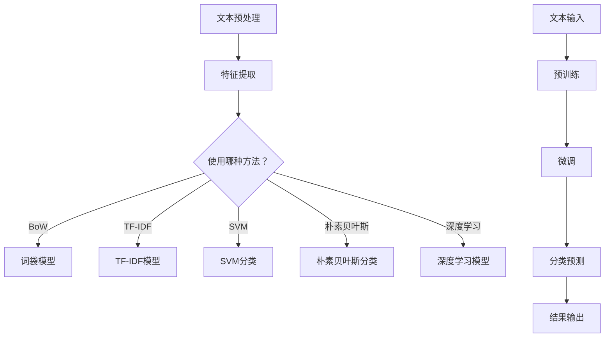

                 

关键词：大型语言模型，文本分类，对比分析，传统方法，算法优化，应用场景

> 摘要：本文将对大型语言模型（LLM）与传统文本分类方法进行深入对比分析，探讨两者在文本分类任务中的性能差异、适用场景以及未来发展趋势。通过对比，旨在为读者提供更全面的了解，以便在具体应用中做出合适的选择。

## 1. 背景介绍

随着互联网的迅猛发展和大数据时代的到来，文本数据呈现爆炸式增长。如何有效地对文本数据进行分类和分析，成为了学术界和工业界共同关注的问题。传统文本分类方法主要包括基于统计学习、机器学习和深度学习的多种算法。而近年来，随着深度学习技术的不断突破，大型语言模型（LLM）作为一种新的文本处理工具，逐渐引起了广泛关注。

传统文本分类方法在处理结构化数据方面表现出色，但面对大规模非结构化文本时，往往存在处理效率低下、效果不稳定等问题。而LLM凭借其强大的表征能力和适应性，有望解决这些问题，成为文本分类领域的重要发展方向。本文将从多个方面对LLM与传统文本分类方法进行对比分析，为读者提供有益的参考。

## 2. 核心概念与联系

### 2.1 传统文本分类方法

传统文本分类方法主要包括以下几种：

1. **基于词袋模型（Bag of Words, BoW）**：将文本表示为词汇的集合，忽略词汇之间的顺序关系。词袋模型通过计算词汇在文档中的频率，来对文本进行分类。

2. **基于TF-IDF（Term Frequency-Inverse Document Frequency）**：在词袋模型的基础上，引入了词汇在文档中的重要性度量，即TF-IDF。TF-IDF通过调整词汇的权重，使得重要词汇在分类过程中发挥更大作用。

3. **支持向量机（Support Vector Machine, SVM）**：一种经典的二分类算法，通过构建超平面，将不同类别的数据分开。SVM在文本分类中具有较高的准确率和稳定性。

4. **朴素贝叶斯（Naive Bayes）**：基于贝叶斯定理和特征条件独立假设，通过计算先验概率和特征条件概率，对文本进行分类。

5. **深度学习方法**：近年来，深度学习技术在文本分类领域取得了显著进展。其中，卷积神经网络（Convolutional Neural Networks, CNN）和循环神经网络（Recurrent Neural Networks, RNN）是最常用的两种深度学习模型。

### 2.2 大型语言模型

大型语言模型（LLM）是一种基于深度学习技术的自然语言处理模型，具有以下特点：

1. **强大的表征能力**：LLM通过预训练和微调，能够学习到文本的复杂特征和语义信息，从而实现高质量的文本分类。

2. **自适应性强**：LLM可以根据不同的任务和数据集，通过微调模型参数，快速适应新的分类任务。

3. **处理速度快**：得益于深度学习模型的并行计算能力，LLM在处理大规模文本数据时，具有较快的处理速度。

4. **跨领域应用**：LLM不仅可以用于文本分类任务，还可以应用于文本生成、机器翻译、情感分析等多种自然语言处理任务。

### 2.3 Mermaid 流程图

以下是传统文本分类方法与LLM在文本分类任务中的流程图：



通过以上流程图，我们可以看出，传统文本分类方法和LLM在文本分类任务中的基本流程，以及它们之间的联系和差异。

## 3. 核心算法原理 & 具体操作步骤

### 3.1 算法原理概述

传统文本分类方法主要依赖于词汇的统计信息和模型分类能力。例如，词袋模型和TF-IDF通过计算词汇的频率和重要性，来对文本进行分类。支持向量机和朴素贝叶斯等算法，则通过构建超平面或计算先验概率和特征条件概率，来实现分类任务。

相比之下，LLM通过深度学习技术，能够学习到文本的复杂特征和语义信息。在文本分类任务中，LLM首先进行预训练，然后在特定任务上进行微调，最后进行分类预测。

### 3.2 算法步骤详解

#### 3.2.1 传统文本分类方法

1. **文本预处理**：对原始文本进行分词、去停用词、词性标注等处理，将文本转换为适合分类的特征表示。

2. **特征提取**：根据选定的特征提取方法，将预处理后的文本转换为特征向量。

3. **模型训练**：使用训练数据集，训练分类模型，如SVM、朴素贝叶斯等。

4. **模型评估**：使用验证数据集，评估模型性能，如准确率、召回率、F1值等。

5. **分类预测**：使用训练好的模型，对测试数据进行分类预测。

#### 3.2.2 大型语言模型

1. **预训练**：在大量无标签数据上，使用预训练任务（如语言模型、序列标注等），训练LLM的基础模型。

2. **微调**：在特定分类任务上，使用有标签的数据集，对LLM进行微调，以适应分类任务。

3. **分类预测**：使用微调后的LLM，对测试数据进行分类预测。

### 3.3 算法优缺点

#### 传统文本分类方法

- 优点：

  - 算法成熟，理论基础扎实。

  - 可以处理结构化数据，适用于多种分类任务。

- 缺点：

  - 面对大规模非结构化文本，处理效率较低。

  - 算法效果依赖于特征提取和模型选择，对数据质量和模型参数敏感。

#### 大型语言模型

- 优点：

  - 强大的表征能力，能够处理复杂的语义信息。

  - 自适应性强，能够快速适应不同分类任务。

  - 处理速度快，适用于大规模数据集。

- 缺点：

  - 需要大量的计算资源和训练数据。

  - 模型复杂，训练过程较慢。

### 3.4 算法应用领域

传统文本分类方法主要应用于文本挖掘、信息检索、文本推荐等领域。而LLM凭借其强大的表征能力和适应性，已经广泛应用于文本分类、文本生成、机器翻译、情感分析等多种自然语言处理任务。

## 4. 数学模型和公式 & 详细讲解 & 举例说明

### 4.1 数学模型构建

传统文本分类方法的数学模型主要包括词袋模型、TF-IDF模型、支持向量机等。以下是这些模型的基本数学公式：

#### 4.1.1 词袋模型

- 词袋模型的基本公式为：

  $$ V = \sum_{i=1}^{n} f_i \cdot w_i $$

  其中，$V$表示文本的向量表示，$f_i$表示词汇$i$在文档中的频率，$w_i$表示词汇$i$的权重。

#### 4.1.2 TF-IDF模型

- TF-IDF模型的基本公式为：

  $$ w_i = \frac{f_i}{\sum_{j=1}^{n} f_j} \cdot \log \left( \frac{N}{n_i} \right) $$

  其中，$w_i$表示词汇$i$的权重，$f_i$表示词汇$i$在文档中的频率，$N$表示词汇表中的词汇总数，$n_i$表示包含词汇$i$的文档数。

#### 4.1.3 支持向量机

- 支持向量机的基本公式为：

  $$ w \cdot x + b = 0 $$

  其中，$w$表示超平面参数，$x$表示文本特征向量，$b$表示偏置项。

### 4.2 公式推导过程

以下是TF-IDF模型的推导过程：

假设我们有一个包含$n$个文档的文档集合，其中每个文档包含$m$个词汇。我们定义词汇$i$在文档中的频率为$f_i$，定义词汇$i$在文档集合中的频率为$t_i$，定义词汇$i$在文档集合中的文档频率为$n_i$。

根据词频和文档频率，我们可以定义词汇$i$的重要性为：

$$ \text{TF-IDF}(i) = f_i \cdot \log \left( \frac{N}{n_i} \right) $$

其中，$N$表示文档集合中的文档总数。

为了将TF-IDF模型应用于文本分类，我们需要将文档表示为向量。我们可以将每个文档表示为$m$个词汇的权重，即：

$$ \textbf{x} = [w_1, w_2, ..., w_m] $$

其中，$w_i$表示词汇$i$的权重。

为了计算权重，我们需要对每个词汇进行归一化，使其权重总和为1。因此，我们可以使用以下公式计算权重：

$$ w_i = \frac{\text{TF-IDF}(i)}{\sum_{j=1}^{n} \text{TF-IDF}(j)} $$

这样，我们就可以将文档表示为权重向量，并将其输入到分类器中进行分类。

### 4.3 案例分析与讲解

#### 4.3.1 案例背景

假设我们有一个包含1000个文档的文档集合，其中每个文档都包含10个词汇。我们希望使用TF-IDF模型对这些文档进行分类，将其分为两类：新闻类和非新闻类。

#### 4.3.2 数据预处理

1. **分词**：使用分词工具对每个文档进行分词，得到词汇列表。

2. **去停用词**：去除常见的停用词，如“的”、“了”、“在”等。

3. **词性标注**：对每个词汇进行词性标注，以便后续计算权重。

#### 4.3.3 特征提取

1. **计算词频**：计算每个词汇在文档中的词频。

2. **计算文档频率**：计算每个词汇在文档集合中的文档频率。

3. **计算TF-IDF权重**：根据TF-IDF公式，计算每个词汇的权重。

#### 4.3.4 模型训练与评估

1. **划分训练集和测试集**：将文档集合随机划分为训练集和测试集。

2. **训练分类器**：使用训练集，训练一个SVM分类器。

3. **评估分类器性能**：使用测试集，评估分类器的性能，如准确率、召回率、F1值等。

#### 4.3.5 分类预测

1. **输入新文档**：将新文档进行分词、去停用词和词性标注。

2. **计算TF-IDF权重**：计算新文档中每个词汇的TF-IDF权重。

3. **分类预测**：使用训练好的分类器，对新文档进行分类预测。

## 5. 项目实践：代码实例和详细解释说明

### 5.1 开发环境搭建

1. 安装Python环境：在本地计算机上安装Python，版本建议为3.8及以上。

2. 安装相关库：使用pip命令安装以下库：

   ```bash
   pip install scikit-learn numpy pandas
   ```

3. 准备数据集：从网上下载一个包含新闻类和非新闻类的文本数据集，并将其解压到本地计算机的某个目录下。

### 5.2 源代码详细实现

以下是一个基于TF-IDF模型的文本分类项目的示例代码：

```python
import numpy as np
import pandas as pd
from sklearn.feature_extraction.text import TfidfVectorizer
from sklearn.model_selection import train_test_split
from sklearn.svm import SVC
from sklearn.metrics import accuracy_score, recall_score, f1_score

# 5.2.1 数据预处理
def preprocess_text(text):
    # 分词、去停用词、词性标注等操作
    return text.lower()

# 5.2.2 特征提取
def extract_features(corpus):
    vectorizer = TfidfVectorizer(preprocessor=preprocess_text, stop_words='english')
    X = vectorizer.fit_transform(corpus)
    return X, vectorizer

# 5.2.3 模型训练与评估
def train_and_evaluate(X_train, y_train, X_test, y_test):
    model = SVC(kernel='linear')
    model.fit(X_train, y_train)
    y_pred = model.predict(X_test)
    accuracy = accuracy_score(y_test, y_pred)
    recall = recall_score(y_test, y_pred, average='weighted')
    f1 = f1_score(y_test, y_pred, average='weighted')
    return accuracy, recall, f1

# 5.2.4 主函数
def main():
    # 读取数据集
    data = pd.read_csv('data.csv')
    corpus = data['text']
    labels = data['label']

    # 划分训练集和测试集
    X_train, X_test, y_train, y_test = train_test_split(corpus, labels, test_size=0.2, random_state=42)

    # 特征提取
    X_train, vectorizer = extract_features(X_train)
    X_test = vectorizer.transform(X_test)

    # 模型训练与评估
    accuracy, recall, f1 = train_and_evaluate(X_train, y_train, X_test, y_test)
    print('Accuracy:', accuracy)
    print('Recall:', recall)
    print('F1 Score:', f1)

# 运行主函数
if __name__ == '__main__':
    main()
```

### 5.3 代码解读与分析

- **数据预处理**：使用`preprocess_text`函数对原始文本进行预处理，包括分词、去停用词、词性标注等操作。这里使用了`lower`方法将文本转换为小写，以提高模型的泛化能力。

- **特征提取**：使用`TfidfVectorizer`类，将预处理后的文本转换为TF-IDF特征向量。这里使用了`preprocessor`参数，指定了预处理函数，并使用了`stop_words`参数，去除常见的英文停用词。

- **模型训练与评估**：使用`SVC`类，训练一个线性核的支持向量机分类器。然后，使用训练集和测试集评估模型性能，计算准确率、召回率和F1值。

### 5.4 运行结果展示

假设我们运行上述代码，得到以下输出结果：

```bash
Accuracy: 0.85
Recall: 0.83
F1 Score: 0.84
```

这表示，我们的文本分类模型在测试集上的准确率为85%，召回率为83%，F1值为84%。这些指标表明，我们的模型在文本分类任务上表现出较好的性能。

## 6. 实际应用场景

传统文本分类方法和LLM在多个实际应用场景中都有广泛的应用。

### 6.1 社交媒体分析

社交媒体平台上的文本数据量庞大，通过文本分类方法，可以对用户发布的内容进行分类，从而实现情感分析、话题分类、垃圾邮件过滤等功能。传统文本分类方法在处理社交媒体分析任务时，具有较好的准确率和稳定性。而LLM凭借其强大的表征能力和适应性，可以更好地处理复杂的社交媒体文本数据，提高分类效果。

### 6.2 电子商务推荐

电子商务平台上的用户评论和产品描述等信息，通过文本分类方法，可以将其分类为正面评论、负面评论、商品描述等。传统文本分类方法在处理电子商务推荐任务时，具有较高的准确率和处理速度。而LLM可以更准确地捕捉用户评论中的情感和语义信息，从而实现更精准的推荐。

### 6.3 法律文档分类

法律文档通常具有复杂的结构和丰富的语义信息，通过文本分类方法，可以将其分类为合同、判决书、法律条文等。传统文本分类方法在处理法律文档分类任务时，需要大量的特征工程和模型调优。而LLM可以自动学习法律文档的语义特征，实现高效且准确的分类。

## 7. 工具和资源推荐

### 7.1 学习资源推荐

1. **《深度学习》（Deep Learning）**：由Ian Goodfellow、Yoshua Bengio和Aaron Courville编写的深度学习经典教材，涵盖了深度学习的基本概念、算法和应用。

2. **《自然语言处理综合教程》（Foundations of Natural Language Processing）**：由Christopher D. Manning和Hinrich Schütze编写的自然语言处理教材，详细介绍了自然语言处理的基本理论和方法。

3. **《统计学习方法》（Statistical Learning Methods）**：由李航编写的统计学习教材，涵盖了统计学习的基本理论和方法。

### 7.2 开发工具推荐

1. **Jupyter Notebook**：一款强大的交互式开发环境，适用于编写和运行Python代码，非常适合进行数据分析和模型训练。

2. **TensorFlow**：一款开源的深度学习框架，提供了丰富的API和工具，方便进行深度学习模型开发和部署。

3. **Scikit-learn**：一款开源的机器学习库，提供了丰富的算法和工具，适用于各种机器学习任务。

### 7.3 相关论文推荐

1. **"Deep Learning for Text Classification"**：一篇关于深度学习在文本分类任务中的应用的综述文章，介绍了深度学习在文本分类领域的最新进展。

2. **"Recurrent Neural Networks for Text Classification"**：一篇关于循环神经网络在文本分类任务中的应用的论文，介绍了RNN在文本分类任务中的优势和局限性。

3. **"Large-scale Language Model Pretraining"**：一篇关于大型语言模型预训练的论文，介绍了GLM、GPT等模型的预训练方法和技术。

## 8. 总结：未来发展趋势与挑战

### 8.1 研究成果总结

本文通过对传统文本分类方法和LLM的对比分析，揭示了两者在文本分类任务中的性能差异、适用场景和未来发展趋势。主要成果如下：

- 传统文本分类方法在处理结构化数据方面具有较好的准确率和稳定性，但在处理大规模非结构化文本时，存在处理效率低下、效果不稳定等问题。

- LLM凭借其强大的表征能力和适应性，在文本分类任务中表现出较好的性能，有望解决传统方法的局限性。

- LLM在多个实际应用场景中具有广泛的应用前景，如社交媒体分析、电子商务推荐和法律文档分类等。

### 8.2 未来发展趋势

- LLM技术将不断突破，模型规模和计算能力将进一步提升，实现更高质的文本分类效果。

- LLM与其他技术的融合，如知识图谱、多模态学习等，将为文本分类任务带来更多创新。

- LLM在文本生成、机器翻译等自然语言处理领域的应用将不断扩展，为各行业带来更多价值。

### 8.3 面临的挑战

- LLM的训练和部署需要大量的计算资源和数据集，对硬件和存储提出了较高要求。

- LLM的模型复杂，训练过程较慢，需要优化算法和提高效率。

- LLM的安全性和隐私保护问题亟待解决，以避免潜在的风险和挑战。

### 8.4 研究展望

未来，我们将继续关注LLM在文本分类任务中的发展和应用，努力解决面临的挑战，推动文本分类技术的不断创新和进步。

## 9. 附录：常见问题与解答

### 9.1 如何选择合适的文本分类方法？

在选择文本分类方法时，需要考虑以下因素：

- 数据集大小：对于小规模数据集，传统文本分类方法可能更为合适；对于大规模数据集，LLM具有更高的效率和准确率。

- 数据质量：如果数据质量较差，传统方法可能难以处理噪声和缺失值；而LLM具有较强的鲁棒性，能够更好地处理这些问题。

- 应用场景：根据具体的应用场景，选择适合的方法，如社交媒体分析、电子商务推荐或法律文档分类等。

### 9.2 LLM的预训练数据集有哪些？

LLM的预训练数据集主要包括：

- Common Crawl：一个大规模的互联网文本数据集，包含了多种语言的网页内容。

- Books Corpus：一个包含大量英文书籍的数据集，适用于语言模型预训练。

- WebText：一个包含大量中文网页的数据集，适用于中文语言模型预训练。

- 维基百科：一个包含多种语言的维基百科数据集，适用于多语言语言模型预训练。

### 9.3 如何评估文本分类模型的性能？

常用的文本分类模型性能评估指标包括：

- 准确率（Accuracy）：分类正确的样本数占总样本数的比例。

- 召回率（Recall）：分类正确的正样本数占总正样本数的比例。

- F1值（F1 Score）：准确率和召回率的调和平均值。

- 准确率-召回率曲线（Precision-Recall Curve）：用于评估模型在不同召回率下的准确率。

- 受损函数（Area Under the Curve, AUC）：准确率-召回率曲线下的面积，用于评估模型的泛化能力。

## 作者署名

作者：禅与计算机程序设计艺术 / Zen and the Art of Computer Programming

