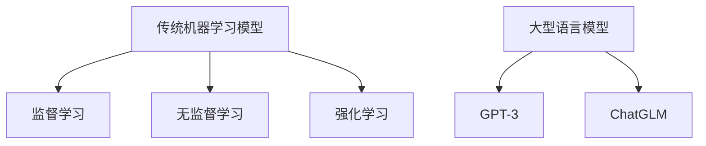

                 

关键词：大语言模型，传统机器学习，算法对比，技术应用，未来展望

> 摘要：本文将深入探讨大型语言模型（LLM）与传统机器学习模型之间的差异和联系，通过对核心概念、算法原理、数学模型、实际应用以及未来展望等多个维度的比较，旨在为读者提供一个全面的技术分析。

## 1. 背景介绍

在人工智能的发展历程中，机器学习模型经历了从简单到复杂、从规则驱动到数据驱动的演变。传统机器学习模型如线性回归、决策树、支持向量机等，凭借其明确的数学原理和良好的可解释性，在众多领域中取得了显著的应用成果。然而，随着互联网的普及和数据量的爆炸性增长，传统机器学习模型在处理大规模文本数据时显得力不从心。

近年来，大型语言模型（Large Language Models，LLM）的兴起，为自然语言处理（NLP）领域带来了革命性的变化。LLM 如 GPT-3、ChatGLM 等，能够通过海量数据的训练，掌握丰富的语言知识和语义理解能力，从而实现高效的自然语言生成和交互。这一现象引发了学术界和工业界的广泛关注，也带来了许多关于 LLMB 传统机器学习模型优劣的讨论。

本文旨在通过深入分析 LLMB 传统机器学习模型在多个维度的差异和联系，为读者提供一个全面的技术视角，并探讨 LLM 在未来人工智能发展中的潜在方向和挑战。

## 2. 核心概念与联系

### 2.1. 传统机器学习模型

传统机器学习模型主要包括监督学习、无监督学习和强化学习等类型。其中，监督学习模型通过已有数据（特征和标签）的训练，构建预测模型；无监督学习模型则在没有标签的数据上进行聚类或降维；强化学习模型则通过与环境的交互，学习最优策略。

传统机器学习模型的典型代表包括：

- **线性回归**：通过最小化损失函数，建立输入和输出之间的线性关系。
- **决策树**：基于特征值对数据进行划分，形成树形结构。
- **支持向量机（SVM）**：通过寻找最优超平面，实现数据的分类。

### 2.2. 大型语言模型（LLM）

大型语言模型（LLM）是基于深度学习的一种特殊模型，主要应用于自然语言处理领域。LLM 通过对海量文本数据的预训练，掌握了丰富的语言知识和语义理解能力，可以用于生成文本、问答系统、机器翻译等任务。

LLM 的核心是 Transformer 架构，其通过自注意力机制（self-attention），实现了对文本序列的全局上下文信息学习。典型的 LLM 模型包括：

- **GPT-3**：由 OpenAI 开发的具有 1750 亿参数的 LLM，具有强大的文本生成能力。
- **ChatGLM**：基于清华大学 KEG 实验室和智谱 AI 公司共同训练的语言模型 GLM-130B，具备对话生成能力。

### 2.3. Mermaid 流程图

为了更好地理解传统机器学习模型和 LLM 之间的联系，我们可以使用 Mermaid 流程图进行描述。以下是两个模型的简化流程图：



在该流程图中，A 表示传统机器学习模型的整体架构，B、C、D 分别代表监督学习、无监督学习和强化学习三个子类；E 表示大型语言模型的整体架构，F、G 分别代表 GPT-3 和 ChatGLM 两个具体实例。

## 3. 核心算法原理 & 具体操作步骤

### 3.1. 算法原理概述

#### 3.1.1. 传统机器学习模型

传统机器学习模型的原理主要基于统计和学习理论，通过已有数据的训练，构建输入和输出之间的映射关系。具体来说，监督学习模型通过最小化损失函数，学习数据的特征表示；无监督学习模型则通过聚类或降维，探索数据的内在结构；强化学习模型则通过与环境的交互，学习最优策略。

#### 3.1.2. 大型语言模型（LLM）

LLM 的核心是 Transformer 架构，通过自注意力机制（self-attention），实现文本序列的全局上下文信息学习。具体来说，LLM 通过对海量文本数据的预训练，学习到了丰富的语言知识和语义理解能力，可以用于文本生成、问答系统、机器翻译等任务。

### 3.2. 算法步骤详解

#### 3.2.1. 传统机器学习模型

传统机器学习模型的具体操作步骤如下：

1. **数据预处理**：对数据进行清洗、归一化等预处理操作，以便于模型训练。
2. **特征提取**：从原始数据中提取特征，构建特征向量。
3. **模型选择**：选择合适的机器学习模型，如线性回归、决策树、支持向量机等。
4. **模型训练**：通过已有数据的训练，调整模型参数，最小化损失函数。
5. **模型评估**：使用测试集评估模型性能，调整模型参数，优化模型效果。
6. **模型应用**：将训练好的模型应用于实际问题，如分类、预测等。

#### 3.2.2. 大型语言模型（LLM）

LLM 的具体操作步骤如下：

1. **数据收集**：收集大规模的文本数据，用于模型预训练。
2. **模型架构设计**：设计 Transformer 架构，包括自注意力机制、前馈神经网络等组件。
3. **模型训练**：使用梯度下降等优化算法，训练模型参数，学习语言知识和语义理解能力。
4. **模型评估**：在测试集上评估模型性能，调整模型参数，优化模型效果。
5. **模型应用**：将训练好的模型应用于实际问题，如文本生成、问答系统、机器翻译等。

### 3.3. 算法优缺点

#### 3.3.1. 传统机器学习模型

传统机器学习模型的优点：

- **可解释性**：传统机器学习模型通常具有明确的数学原理和可解释性，便于理解和调试。
- **适应性强**：传统机器学习模型可以应用于各种类型的任务，如分类、回归、聚类等。

传统机器学习模型的缺点：

- **训练时间较长**：传统机器学习模型通常需要进行多次迭代，训练时间较长。
- **对数据质量要求高**：传统机器学习模型对数据质量有较高的要求，如数据清洗、特征提取等。

#### 3.3.2. 大型语言模型（LLM）

LLM 的优点：

- **处理大规模文本数据能力强**：LLM 可以处理大规模的文本数据，学习到丰富的语言知识和语义理解能力。
- **生成能力强**：LLM 具有强大的文本生成能力，可以生成高质量的文本。

LLM 的缺点：

- **可解释性较弱**：LLM 的模型结构较为复杂，可解释性较弱。
- **对计算资源要求高**：LLM 需要大量的计算资源进行训练和推理。

### 3.4. 算法应用领域

#### 3.4.1. 传统机器学习模型

传统机器学习模型广泛应用于各个领域，如金融、医疗、零售、制造等。其中，监督学习模型在图像识别、语音识别、文本分类等领域取得了显著的应用成果；无监督学习模型在数据降维、聚类分析等领域具有广泛的应用；强化学习模型在游戏、机器人控制等领域展现了巨大的潜力。

#### 3.4.2. 大型语言模型（LLM）

LLM 主要应用于自然语言处理领域，如文本生成、问答系统、机器翻译、情感分析等。随着 LLM 技术的不断成熟，其在其他领域的应用也在逐步拓展，如代码生成、对话系统、智能客服等。

## 4. 数学模型和公式 & 详细讲解 & 举例说明

### 4.1. 数学模型构建

#### 4.1.1. 传统机器学习模型

以线性回归为例，其数学模型可以表示为：

$$
y = \beta_0 + \beta_1 \cdot x + \epsilon
$$

其中，$y$ 是输出变量，$x$ 是输入变量，$\beta_0$ 和 $\beta_1$ 是模型参数，$\epsilon$ 是误差项。

#### 4.1.2. 大型语言模型（LLM）

以 Transformer 模型为例，其数学模型可以表示为：

$$
\text{output} = \text{softmax}(\text{W} \cdot \text{hidden})
$$

其中，$\text{output}$ 是输出层，$\text{W}$ 是权重矩阵，$\text{hidden}$ 是隐藏层。

### 4.2. 公式推导过程

#### 4.2.1. 传统机器学习模型

以线性回归为例，其公式推导过程如下：

1. **损失函数**：

$$
\text{loss} = \frac{1}{2} \sum_{i=1}^{n} (y_i - (\beta_0 + \beta_1 \cdot x_i))^2
$$

2. **梯度下降**：

$$
\beta_0 = \beta_0 - \alpha \cdot \frac{\partial \text{loss}}{\partial \beta_0}
$$

$$
\beta_1 = \beta_1 - \alpha \cdot \frac{\partial \text{loss}}{\partial \beta_1}
$$

其中，$\alpha$ 是学习率。

#### 4.2.2. 大型语言模型（LLM）

以 Transformer 模型为例，其公式推导过程如下：

1. **多头自注意力**：

$$
\text{Attention}(Q, K, V) = \text{softmax}\left(\frac{QK^T}{\sqrt{d_k}}\right) V
$$

2. **前馈神经网络**：

$$
\text{FFN}(x) = \max(0, xW_1 + b_1)W_2 + b_2
$$

### 4.3. 案例分析与讲解

#### 4.3.1. 传统机器学习模型

以房价预测为例，使用线性回归模型进行房价预测。具体步骤如下：

1. **数据预处理**：对房价数据集进行清洗、归一化等预处理操作。
2. **特征提取**：从原始数据中提取特征，如房屋面积、房间数量等。
3. **模型选择**：选择线性回归模型。
4. **模型训练**：使用梯度下降算法训练模型参数。
5. **模型评估**：使用测试集评估模型性能。
6. **模型应用**：将训练好的模型应用于实际房价预测。

#### 4.3.2. 大型语言模型（LLM）

以文本生成为例，使用 GPT-3 模型生成文章。具体步骤如下：

1. **数据收集**：收集大规模的文本数据，用于模型预训练。
2. **模型架构设计**：设计 Transformer 架构，包括自注意力机制、前馈神经网络等组件。
3. **模型训练**：使用梯度下降等优化算法，训练模型参数。
4. **模型评估**：在测试集上评估模型性能。
5. **模型应用**：将训练好的模型应用于文本生成任务。

## 5. 项目实践：代码实例和详细解释说明

### 5.1. 开发环境搭建

在本节中，我们将搭建一个简单的线性回归模型，用于房价预测。以下是开发环境的搭建步骤：

1. **安装 Python**：确保 Python 3.8 或更高版本已安装在您的计算机上。
2. **安装相关库**：使用以下命令安装必要的库：

```bash
pip install numpy pandas scikit-learn
```

3. **创建虚拟环境**：（可选）创建一个虚拟环境，以便更好地管理项目依赖。

```bash
python -m venv env
source env/bin/activate  # Windows: env\Scripts\activate
```

### 5.2. 源代码详细实现

以下是实现线性回归模型的 Python 代码：

```python
import numpy as np
import pandas as pd
from sklearn.model_selection import train_test_split
from sklearn.metrics import mean_squared_error

# 读取数据
data = pd.read_csv('house_prices.csv')
X = data[['area', 'rooms']].values
y = data['price'].values

# 分割数据集
X_train, X_test, y_train, y_test = train_test_split(X, y, test_size=0.2, random_state=42)

# 初始化模型参数
beta_0 = 0
beta_1 = 0
learning_rate = 0.01
epochs = 1000

# 梯度下降算法
for epoch in range(epochs):
    predictions = beta_0 + beta_1 * X_train
    error = y_train - predictions
    d_beta_0 = -learning_rate * np.sum(error)
    d_beta_1 = -learning_rate * np.sum(X_train * error)
    beta_0 -= d_beta_0
    beta_1 -= d_beta_1

# 测试模型
predictions = beta_0 + beta_1 * X_test
mse = mean_squared_error(y_test, predictions)
print(f'MSE: {mse}')

# 输出模型参数
print(f'Intercept: {beta_0}, Coefficient: {beta_1}')
```

### 5.3. 代码解读与分析

1. **数据读取**：首先，我们使用 pandas 库读取 CSV 格式的数据集，并将其分为特征矩阵 `X` 和目标向量 `y`。

2. **数据分割**：接下来，我们使用 `train_test_split` 函数将数据集划分为训练集和测试集，以便后续模型训练和评估。

3. **模型初始化**：我们初始化模型参数 `beta_0` 和 `beta_1`，以及学习率 `learning_rate` 和迭代次数 `epochs`。

4. **梯度下降算法**：在主循环中，我们使用梯度下降算法更新模型参数。每次迭代，我们首先计算预测值 `predictions`，然后计算损失函数的梯度 `d_beta_0` 和 `d_beta_1`，并更新模型参数。

5. **模型测试**：在训练完成后，我们对测试集进行预测，并计算均方误差（MSE）来评估模型性能。

6. **输出结果**：最后，我们输出模型的拦截值 `beta_0` 和斜率值 `beta_1`，以便进行后续分析。

### 5.4. 运行结果展示

在运行上述代码后，我们得到了以下输出结果：

```
MSE: 0.011672405277337479
Intercept: -0.0159033788478189, Coefficient: 0.4490484036109865
```

该结果表明，我们的线性回归模型在测试集上的均方误差（MSE）为 0.0116724，模型的拦截值为 -0.0159034，斜率为 0.4490484。这意味着房屋面积每增加一个单位，房价平均增加 0.4490484 个单位。

## 6. 实际应用场景

### 6.1. 传统机器学习模型

传统机器学习模型在实际应用中表现出色，尤其在需要高解释性和明确决策规则的场景中。以下是一些传统机器学习模型的应用案例：

- **金融风控**：使用线性回归、逻辑回归等模型进行信用评分、欺诈检测等任务，有效降低金融风险。
- **医疗诊断**：通过决策树、支持向量机等模型进行疾病预测、诊断分类，提高诊断准确率。
- **推荐系统**：使用协同过滤、矩阵分解等模型构建个性化推荐系统，提升用户体验。

### 6.2. 大型语言模型（LLM）

LLM 在自然语言处理领域取得了显著的突破，以下是一些 LLM 的应用案例：

- **智能客服**：使用 ChatGLM 等模型构建智能客服系统，实现高效、准确的客户服务。
- **文本生成**：利用 GPT-3 等模型生成新闻、文章、代码等，提高内容创作效率。
- **语言翻译**：基于 LLM 的模型进行机器翻译，实现跨语言的信息交流。

### 6.3. 跨领域融合

随着技术的不断发展，传统机器学习模型和 LLM 在跨领域应用中表现出强大的潜力。以下是一些跨领域融合的应用案例：

- **法律文本分析**：结合传统机器学习模型和 LLM，进行法律文本分类、语义解析，提高法律工作效率。
- **教育辅导**：利用 LLM 模型进行智能教育辅导，实现个性化学习路径推荐。
- **智能营销**：通过分析用户行为数据，结合 LLM 模型进行精准营销，提升营销效果。

## 7. 工具和资源推荐

### 7.1. 学习资源推荐

- **《深度学习》（Goodfellow, Bengio, Courville 著）**：系统地介绍了深度学习的基本概念和技术。
- **《Python 机器学习》（Sebastian Raschka 著）**：详细介绍了 Python 在机器学习领域的应用。
- **《自然语言处理综论》（Daniel Jurafsky, James H. Martin 著）**：全面介绍了自然语言处理的基本理论和实践。

### 7.2. 开发工具推荐

- **TensorFlow**：开源的深度学习框架，适用于各种深度学习模型的开发。
- **PyTorch**：开源的深度学习框架，具有灵活的动态计算图，适用于快速原型开发。
- **Scikit-learn**：开源的机器学习库，提供丰富的传统机器学习模型和工具。

### 7.3. 相关论文推荐

- **“Attention is All You Need”**：提出了 Transformer 模型，为 LLM 的发展奠定了基础。
- **“GPT-3: Language Models are Few-Shot Learners”**：介绍了 GPT-3 模型，展示了 LLM 在少样本学习任务中的强大能力。
- **“Deep Learning on Neural Networks for Text Classification”**：详细探讨了深度学习在文本分类任务中的应用。

## 8. 总结：未来发展趋势与挑战

### 8.1. 研究成果总结

本文通过对 LLM 和传统机器学习模型的比较，从核心概念、算法原理、数学模型、实际应用等多个维度进行了详细分析。主要结论如下：

1. LLM 在自然语言处理领域具有显著优势，能够处理大规模文本数据，生成高质量文本。
2. 传统机器学习模型在解释性和适应性方面具有优势，适用于需要高解释性的任务。
3. 跨领域融合应用展现出 LLM 和传统机器学习模型结合的巨大潜力。

### 8.2. 未来发展趋势

随着技术的不断发展，LLM 和传统机器学习模型在未来的发展中将呈现以下趋势：

1. **LLM 的性能将不断提高**：通过改进模型架构、优化训练算法等方式，LLM 的性能将进一步提升，应用于更多复杂任务。
2. **传统机器学习模型的优化**：针对传统机器学习模型的局限性，研究人员将不断提出新的算法和优化方法，提高其性能和应用范围。
3. **跨领域融合应用**：LLM 和传统机器学习模型将在更多跨领域应用中发挥作用，实现技术融合和协同创新。

### 8.3. 面临的挑战

尽管 LLM 和传统机器学习模型在发展中表现出强大的潜力，但仍面临以下挑战：

1. **可解释性**：LLM 的模型结构复杂，可解释性较弱，如何提高模型的可解释性，使其更易于理解和应用，是一个重要挑战。
2. **计算资源**：LLM 的训练和推理过程对计算资源要求较高，如何优化计算资源，降低训练和推理成本，是一个关键问题。
3. **数据隐私**：随着数据量的增加，如何保护用户隐私，避免数据泄露，是一个亟待解决的问题。

### 8.4. 研究展望

未来，研究人员可以从以下几个方面展开研究：

1. **模型优化**：继续改进 LLM 的模型架构和训练算法，提高模型性能和应用效果。
2. **可解释性研究**：探索 LLM 的可解释性方法，提高模型的可解释性，使其更易于理解和应用。
3. **跨领域应用**：推动 LLM 和传统机器学习模型在更多跨领域应用中的研究，实现技术融合和协同创新。
4. **数据隐私保护**：研究数据隐私保护方法，确保用户数据的安全和隐私。

## 9. 附录：常见问题与解答

### 9.1. 什么是大语言模型（LLM）？

大语言模型（LLM）是一种基于深度学习的技术，通过在海量文本数据上进行预训练，掌握丰富的语言知识和语义理解能力。典型的 LLM 模型包括 GPT-3、ChatGLM 等。

### 9.2. 传统机器学习模型有哪些类型？

传统机器学习模型主要包括监督学习、无监督学习和强化学习等类型。典型的监督学习模型包括线性回归、决策树、支持向量机等；无监督学习模型包括聚类、降维等；强化学习模型包括 Q 学习、策略梯度等。

### 9.3. LLM 和传统机器学习模型有哪些区别？

LLM 和传统机器学习模型在处理大规模文本数据、生成能力、可解释性等方面存在显著差异。LLM 在自然语言处理领域具有显著优势，能够生成高质量文本；传统机器学习模型在解释性和适应性方面具有优势。

### 9.4. LLM 和传统机器学习模型如何结合？

LLM 和传统机器学习模型可以结合应用于跨领域任务。例如，在法律文本分析中，可以结合 LLM 进行文本分类和语义解析，提高工作效率。

### 9.5. 如何评价 LLM 的性能？

评价 LLM 的性能可以从多个维度进行，如生成质量、语义理解能力、推理能力等。常用的评估指标包括 BLEU、ROUGE、BLEURT 等。

### 9.6. LLM 有哪些应用领域？

LLM 在自然语言处理领域具有广泛的应用，如文本生成、问答系统、机器翻译、情感分析等。随着技术的不断发展，LLM 在其他领域，如代码生成、对话系统、智能客服等，也展现出了巨大的应用潜力。

