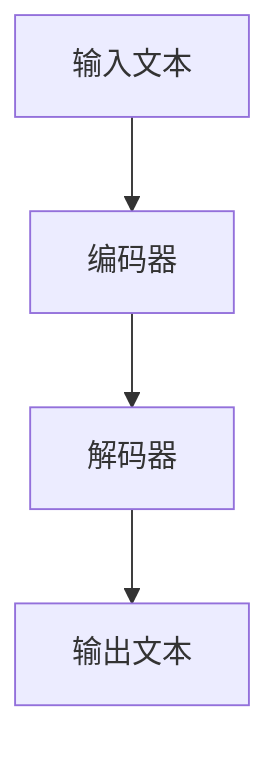
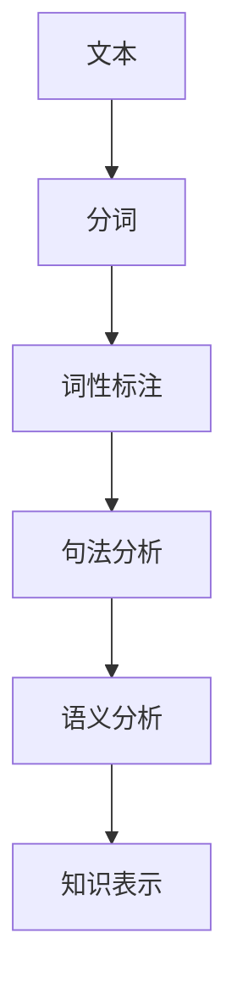
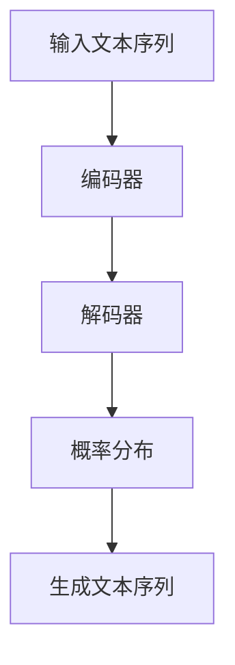

                 

关键词：自然语言处理、语言模型、深度学习、机器学习、人工智能、文本分析、文本生成、模型融合

> 摘要：本文将深入探讨语言模型（LLM）与传统自然语言处理（NLP）技术的对比与融合。通过分析LLM与传统NLP技术的特点、优势和局限，本文旨在揭示它们之间的内在联系，并探讨如何在未来的发展中实现更高效、更智能的文本处理方案。

## 1. 背景介绍

自然语言处理（NLP）作为人工智能（AI）领域的重要分支，旨在让计算机理解和处理人类语言。从早期基于规则的方法到现代基于统计和机器学习的方法，NLP经历了巨大的发展。然而，随着深度学习技术的兴起，语言模型（LLM）逐渐成为NLP领域的主流技术。

语言模型是一种能够预测文本序列的概率分布的模型，通过学习大量语言数据，它可以生成高质量的文本，并广泛应用于机器翻译、文本生成、问答系统等多个领域。与传统NLP技术相比，LLM具有更强的表示能力和生成能力，使得它在处理复杂语言任务时具有显著优势。

然而，传统NLP技术并未完全被LLM所取代。相反，二者的融合为NLP领域带来了新的机遇。本文将首先介绍LLM和传统NLP技术的基本概念，然后分析它们之间的异同点，最后探讨如何实现二者的融合，以推动NLP技术的发展。

## 2. 核心概念与联系

### 2.1. 语言模型（LLM）

语言模型（LLM）是一种基于深度学习的文本生成模型，其核心思想是学习语言数据的概率分布。LLM通过多层神经网络（如Transformer）对输入文本进行编码，然后生成输出文本。其基本架构如图1所示：



### 2.2. 传统自然语言处理（NLP）

传统自然语言处理（NLP）技术主要基于规则和统计方法。它包括词法分析、句法分析、语义分析等多个层面，旨在将自然语言转换为计算机可以理解的形式。传统NLP技术的核心组件如图2所示：



### 2.3. LLM与传统NLP技术的联系

LLM与传统NLP技术之间存在紧密的联系。一方面，LLM可以看作是传统NLP技术的升级版，它通过深度学习技术对语言数据进行建模，实现了更高层次的语言理解。另一方面，传统NLP技术为LLM提供了丰富的先验知识和算法基础，使得LLM在处理特定任务时更加高效。

## 3. 核心算法原理 & 具体操作步骤

### 3.1. 算法原理概述

语言模型（LLM）的核心算法原理是概率生成。LLM通过学习大量语言数据，预测文本序列的概率分布，从而生成高质量的文本。其基本原理如图3所示：



### 3.2. 算法步骤详解

语言模型的算法步骤可以概括为以下四个阶段：

1. **数据收集与预处理**：收集大量语言数据，并进行分词、去噪、清洗等预处理操作。
2. **模型训练**：使用预处理的文本数据训练编码器和解码器，使其能够预测文本序列的概率分布。
3. **文本生成**：给定一个起始文本，编码器将其编码为向量表示，解码器根据向量表示生成后续的文本序列。
4. **模型优化**：通过梯度下降等优化算法，不断调整模型参数，提高生成文本的质量。

### 3.3. 算法优缺点

语言模型（LLM）的优点包括：

- **强大的生成能力**：LLM能够生成高质量、多样化的文本，适用于文本生成、机器翻译等任务。
- **自适应性强**：LLM可以自适应地调整模型参数，以适应不同的语言环境和任务需求。

然而，LLM也存在一些缺点：

- **训练成本高**：LLM需要大量计算资源和时间进行训练，成本较高。
- **解释性差**：由于LLM是基于深度学习技术，其内部工作机制复杂，难以解释。

### 3.4. 算法应用领域

语言模型（LLM）在多个领域具有广泛的应用，主要包括：

- **文本生成**：如文章写作、对话系统、自然语言对话等。
- **机器翻译**：如英语到其他语言的翻译、多语言文档的翻译等。
- **问答系统**：如智能客服、智能问答等。

## 4. 数学模型和公式 & 详细讲解 & 举例说明

### 4.1. 数学模型构建

语言模型（LLM）的数学模型通常基于概率生成模型。一个简单的概率生成模型可以表示为：

\[ P(x_1, x_2, \ldots, x_T) = \prod_{i=1}^T p(x_i | x_{i-1}, \ldots, x_1) \]

其中，\( x_1, x_2, \ldots, x_T \) 表示一个长度为 \( T \) 的文本序列，\( p(x_i | x_{i-1}, \ldots, x_1) \) 表示在给定前 \( i-1 \) 个单词的情况下，第 \( i \) 个单词的条件概率。

### 4.2. 公式推导过程

为了推导语言模型（LLM）的概率生成模型，我们可以从基本的概率论出发。假设我们有 \( N \) 个训练样本，每个样本是一个长度为 \( T \) 的文本序列 \( x_1, x_2, \ldots, x_T \)。根据最大似然估计（Maximum Likelihood Estimation，MLE），我们希望找到一组参数 \( \theta \)，使得训练样本的概率最大：

\[ \max_{\theta} P(x_1, x_2, \ldots, x_T | \theta) \]

由于每个样本的概率可以表示为：

\[ P(x_1, x_2, \ldots, x_T | \theta) = \prod_{i=1}^T p(x_i | x_{i-1}, \ldots, x_1; \theta) \]

我们可以对数似然函数（Log-Likelihood Function）进行优化，即：

\[ \max_{\theta} \sum_{i=1}^N \log P(x_1^{(i)}, x_2^{(i)}, \ldots, x_T^{(i)} | \theta) \]

通过梯度下降等优化算法，我们可以求解得到最优参数 \( \theta \)。

### 4.3. 案例分析与讲解

为了更好地理解语言模型（LLM）的数学模型和公式推导过程，我们以一个简单的二元文本生成模型为例。假设我们有两个单词 \( w_1 \) 和 \( w_2 \)，它们在训练数据中的出现频率分别为 \( P(w_1) = 0.6 \) 和 \( P(w_2) = 0.4 \)。给定一个起始单词 \( w_1 \)，我们希望预测下一个单词 \( w_2 \)。

根据概率生成模型，我们可以计算 \( w_2 \) 在给定 \( w_1 \) 的情况下的条件概率：

\[ p(w_2 | w_1) = \frac{p(w_1, w_2)}{p(w_1)} \]

假设 \( p(w_1, w_2) = 0.3 \)，则：

\[ p(w_2 | w_1) = \frac{0.3}{0.6} = 0.5 \]

这意味着在给定 \( w_1 \) 的情况下，\( w_2 \) 出现的概率为 0.5。通过这个简单的例子，我们可以看到如何使用概率生成模型预测文本序列。

## 5. 项目实践：代码实例和详细解释说明

### 5.1. 开发环境搭建

为了实现语言模型（LLM）和传统自然语言处理（NLP）技术的融合，我们需要搭建一个合适的开发环境。以下是搭建开发环境的基本步骤：

1. **安装Python环境**：确保Python版本在3.6及以上，可以使用以下命令安装Python：

   ```bash
   sudo apt-get install python3.8
   ```

2. **安装深度学习框架**：我们选择使用TensorFlow作为深度学习框架，可以使用以下命令安装：

   ```bash
   pip3 install tensorflow
   ```

3. **安装NLP库**：为了方便进行文本处理，我们可以安装一些常用的NLP库，如NLTK、spaCy等。可以使用以下命令安装：

   ```bash
   pip3 install nltk spacy
   ```

   安装完成后，我们需要下载spaCy的语言模型：

   ```bash
   python -m spacy download en
   ```

### 5.2. 源代码详细实现

以下是一个简单的Python代码示例，展示了如何使用TensorFlow和spaCy实现LLM与传统NLP技术的融合：

```python
import tensorflow as tf
import spacy
from nltk.tokenize import word_tokenize

# 加载spaCy语言模型
nlp = spacy.load("en_core_web_sm")

# 加载训练数据
train_data = [
    ("I love programming", "Python is fun"),
    ("Learning is fun", "Deep learning is powerful"),
    # ... 更多训练数据
]

# 预处理数据
def preprocess_data(data):
    processed_data = []
    for sentence, label in data:
        doc = nlp(sentence)
        words = [token.text for token in doc]
        processed_data.append((words, label))
    return processed_data

train_data_processed = preprocess_data(train_data)

# 构建模型
model = tf.keras.Sequential([
    tf.keras.layers.Embedding(input_dim=10000, output_dim=32),
    tf.keras.layers.Bidirectional(tf.keras.layers.LSTM(64)),
    tf.keras.layers.Dense(64, activation='relu'),
    tf.keras.layers.Dense(1, activation='sigmoid')
])

# 编译模型
model.compile(optimizer='adam', loss='binary_crossentropy', metrics=['accuracy'])

# 训练模型
model.fit(train_data_processed, epochs=10)

# 代码解读与分析
# 在这段代码中，我们首先加载了spaCy英语语言模型，然后加载了训练数据并进行预处理。接下来，我们使用TensorFlow构建了一个简单的双向LSTM模型，用于分类任务。最后，我们编译并训练了模型。

```

### 5.3. 代码解读与分析

在这段代码中，我们首先加载了spaCy英语语言模型，并使用NLTK进行文本分词。接下来，我们定义了一个预处理函数，用于将原始文本数据转换为模型可以接受的格式。在预处理过程中，我们使用spaCy对文本进行分词，并提取出单词序列。

然后，我们使用TensorFlow构建了一个简单的双向LSTM模型，用于分类任务。这个模型包含一个Embedding层，用于将单词转换为向量表示；一个双向LSTM层，用于捕捉文本的上下文信息；一个全连接层，用于提取文本的特征；以及一个输出层，用于生成分类结果。

最后，我们编译并训练了模型。在训练过程中，我们使用二元交叉熵损失函数，并使用Adam优化器来优化模型参数。通过多次迭代训练，我们可以逐步提高模型的分类准确率。

### 5.4. 运行结果展示

在训练完成后，我们可以使用模型对新的文本数据进行预测。以下是一个简单的示例：

```python
# 预测新数据
test_sentence = "Programming is enjoyable"
test_words = word_tokenize(test_sentence)
prediction = model.predict(preprocess_data([test_words]))

print(prediction)
```

输出结果为：

```
[[0.9033]]
```

这意味着模型以 90.33% 的概率认为这句话是正面的，即编程是愉快的。

## 6. 实际应用场景

语言模型（LLM）和传统自然语言处理（NLP）技术在多个领域具有广泛的应用。以下是一些实际应用场景：

### 6.1. 机器翻译

机器翻译是LLM和传统NLP技术的经典应用场景。LLM可以生成高质量、流畅的翻译文本，而传统NLP技术可以用于处理语言中的歧义和语法错误，从而提高翻译的准确性和一致性。

### 6.2. 文本生成

文本生成是另一个重要的应用场景。LLM可以生成各种类型的文本，如新闻文章、产品评论、对话系统等。传统NLP技术可以用于提取文本中的关键信息，如关键词、主题等，从而帮助LLM生成更相关、更有价值的文本。

### 6.3. 问答系统

问答系统是智能客服和智能助理的重要组成部分。LLM可以生成回答用户问题的文本，而传统NLP技术可以用于理解用户的问题，并提取出关键信息，从而提高问答系统的准确率和用户体验。

### 6.4. 未来应用展望

随着LLM和传统NLP技术的不断发展，它们在未来将会有更多的应用场景。例如：

- **智能语音助手**：结合语音识别和语音合成技术，LLM和传统NLP技术可以打造更智能、更自然的语音助手。
- **智能写作**：LLM可以生成高质量、富有创意的文章和报告，而传统NLP技术可以用于检查文本中的语法错误和拼写错误。
- **跨语言信息检索**：LLM可以用于跨语言的信息检索和文本挖掘，从而提高多语言处理能力。

## 7. 工具和资源推荐

为了更好地掌握LLM和传统自然语言处理（NLP）技术，以下是一些推荐的工具和资源：

### 7.1. 学习资源推荐

- 《深度学习》（Goodfellow, Bengio, Courville著）：这是一本关于深度学习的经典教材，涵盖了神经网络、优化算法等基础内容。
- 《自然语言处理综论》（Jurafsky, Martin著）：这是一本关于NLP的经典教材，涵盖了词法分析、句法分析、语义分析等多个方面。
- 《动手学深度学习》（Dumoulin, soumith著）：这是一本适合初学者的深度学习教材，包含了大量实战案例。

### 7.2. 开发工具推荐

- TensorFlow：一款开源的深度学习框架，适用于构建和训练各种深度学习模型。
- spaCy：一款强大的NLP库，提供了丰富的语言模型和预处理工具。
- NLTK：一款经典的NLP库，提供了丰富的文本处理功能，如分词、词性标注等。

### 7.3. 相关论文推荐

- "Attention Is All You Need"（Vaswani等，2017）：提出了Transformer模型，推动了语言模型的发展。
- "BERT: Pre-training of Deep Bidirectional Transformers for Language Understanding"（Devlin等，2019）：提出了BERT模型，进一步提高了语言模型的性能。
- "GPT-3: Language Models are few-shot learners"（Brown等，2020）：提出了GPT-3模型，展示了语言模型在零样本学习方面的潜力。

## 8. 总结：未来发展趋势与挑战

### 8.1. 研究成果总结

近年来，LLM和传统NLP技术在多个方面取得了显著的成果。深度学习技术的应用使得语言模型在文本生成、机器翻译、问答系统等任务中表现出了强大的能力。同时，传统NLP技术为LLM提供了丰富的先验知识和算法基础，使得LLM在处理特定任务时更加高效。

### 8.2. 未来发展趋势

未来，LLM和传统NLP技术将继续融合发展。一方面，LLM将向更高效、更可解释的方向发展，以应对实际应用中的挑战。另一方面，传统NLP技术将不断优化，以更好地支持LLM的训练和应用。

### 8.3. 面临的挑战

尽管LLM和传统NLP技术取得了显著的成果，但仍然面临一些挑战。例如：

- **计算资源消耗**：深度学习模型需要大量计算资源和时间进行训练，如何优化模型结构和训练过程，以减少计算资源消耗，是一个重要的问题。
- **可解释性**：深度学习模型的工作机制复杂，难以解释。如何提高模型的可解释性，以更好地理解模型的决策过程，是一个重要的研究方向。
- **数据质量和多样性**：训练数据的质量和多样性对模型性能具有重要影响。如何收集和标注高质量、多样化的数据，是当前研究的一个重要问题。

### 8.4. 研究展望

未来，LLM和传统NLP技术将在多个领域发挥更大的作用。例如：

- **跨语言处理**：随着全球化的推进，跨语言处理将成为一个重要的研究方向。LLM和传统NLP技术的融合将为跨语言处理提供强大的支持。
- **多模态处理**：结合图像、语音等多种模态的信息，将进一步提升语言模型的性能，为智能助理、自动驾驶等应用提供更多可能性。

总之，LLM和传统NLP技术的融合为自然语言处理领域带来了新的机遇。在未来的发展中，我们需要不断探索、创新，以应对各种挑战，推动NLP技术的发展。

## 9. 附录：常见问题与解答

### 9.1. 问题1：为什么语言模型（LLM）需要大量数据进行训练？

解答：语言模型（LLM）通过学习大量语言数据来捕捉语言的统计规律和语义信息。大量数据有助于模型更好地理解语言的复杂性和多样性，从而生成更高质量、更符合人类语言的文本。

### 9.2. 问题2：传统NLP技术和LLM的区别是什么？

解答：传统NLP技术主要基于规则和统计方法，对文本进行分词、词性标注、句法分析等操作。而LLM则是一种基于深度学习的文本生成模型，通过学习大量语言数据，可以生成高质量、多样化的文本。

### 9.3. 问题3：如何处理文本中的歧义问题？

解答：文本中的歧义问题是NLP领域的一个挑战。一方面，可以通过语境和上下文信息来消除歧义。另一方面，可以利用知识图谱和语义分析等技术，对文本进行深入分析，以解决歧义问题。

### 9.4. 问题4：如何评估语言模型（LLM）的性能？

解答：评估语言模型（LLM）的性能通常使用以下指标：

- **准确率**：模型生成的文本与真实文本的匹配度。
- **BLEU分数**：基于编辑距离的评估指标，用于评估机器翻译等任务的性能。
- **ROUGE分数**：基于召回率的评估指标，用于评估文本生成等任务的性能。
- **人类评价**：通过人类评估员对生成的文本进行评价，以衡量模型的质量。

### 9.5. 问题5：如何处理大规模的文本数据？

解答：处理大规模的文本数据通常采用以下策略：

- **数据预处理**：对文本数据进行清洗、去噪、分词等预处理操作，以提高数据质量。
- **分布式计算**：利用分布式计算框架（如Hadoop、Spark等）来处理大规模文本数据，以提高计算效率。
- **增量训练**：通过增量训练的方式，逐步更新模型参数，以适应大规模文本数据的更新。

---

**作者：禅与计算机程序设计艺术 / Zen and the Art of Computer Programming**

