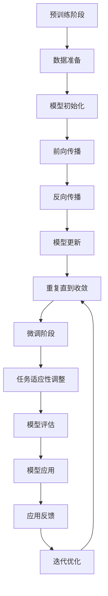
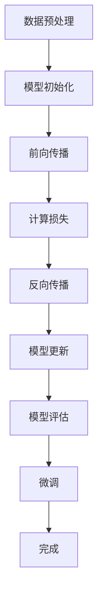

                 

关键词：大型语言模型(LLM)，自然语言理解，传统算法，神经网络，机器学习，语言模型训练，任务适应性，性能评估

>摘要：本文深入探讨了大型语言模型（LLM）与传统自然语言理解方法之间的差异。通过对LLM的架构、训练过程、任务适应性、性能等方面的分析，我们揭示了LLM在现代自然语言处理中的独特优势，并探讨了其与传统方法的异同。文章旨在为读者提供一个全面的理解，帮助其在实际应用中做出更明智的选择。

## 1. 背景介绍

自然语言理解（Natural Language Understanding，NLU）是计算机科学领域的一个重要分支，旨在使计算机能够理解和处理人类语言。NLU的历史可以追溯到上世纪50年代，当时人工智能领域首次提出了让机器理解自然语言的想法。然而，早期的尝试主要集中在基于规则的方法和语法分析上，这些方法在面对复杂和灵活的自然语言时表现不佳。

随着计算机技术的进步，特别是机器学习和深度学习技术的发展，自然语言理解的方法发生了根本性的变化。大型语言模型（LLM）的出现，特别是近年来基于Transformer架构的模型，如GPT和BERT，使自然语言理解达到了前所未有的高度。

传统自然语言理解方法主要依赖于语法规则和统计模型，如HMM（隐马尔可夫模型）和PCFG（概率上下文无关文法）。这些方法在特定领域和任务上取得了显著成果，但随着自然语言处理任务的复杂性和多样性增加，它们的局限性变得越来越明显。

本文将对比分析LLM与传统自然语言理解方法，探讨LLM在处理自然语言任务中的优势，并讨论未来发展的趋势和挑战。

### LLM的兴起与发展

LLM的兴起得益于深度学习和神经网络技术的快速发展。特别是在Transformer架构的提出之后，LLM在自然语言处理领域的表现尤为突出。Transformer架构的核心思想是将输入序列转换为固定长度的向量表示，然后通过自注意力机制（self-attention）和前馈神经网络（Feedforward Neural Network）进行特征提取和融合。

GPT（Generative Pre-trained Transformer）系列模型是LLM的一个典型代表。GPT通过大量无监督数据进行预训练，学习语言的一般规律和模式。预训练后，GPT可以通过微调（fine-tuning）适应特定的下游任务，如文本分类、机器翻译、问答系统等。GPT的巨大成功激发了更多研究者对LLM的研究和应用，如BERT（Bidirectional Encoder Representations from Transformers）、T5（Text-to-Text Transfer Transformer）和LLaMA（Low-Latency Large-scale Model Architecture）等。

### 传统自然语言理解方法的局限性

传统自然语言理解方法在处理简单和规则性较强的任务时表现出色，但随着任务的复杂性和多样性增加，其局限性变得越来越明显。首先，基于规则的方法依赖于大量手工编写的语法规则和词典，这不仅增加了开发成本，还限制了方法的通用性和适应性。其次，统计模型如HMM和PCFG在处理长文本和复杂语法结构时存在性能瓶颈，难以捕捉到语言中的长期依赖关系。

此外，传统方法通常缺乏对上下文信息的充分利用。例如，在机器翻译中，基于规则的方法通常只能处理单个词汇的翻译，而无法考虑词汇在句子中的上下文意义。相反，LLM通过自注意力机制和上下文向量表示，能够更好地理解和利用上下文信息，从而提高任务的准确性和效果。

### 本文结构

本文将分为以下几个部分：

1. **背景介绍**：回顾自然语言理解的历史和发展，介绍LLM和传统方法的兴起。
2. **核心概念与联系**：详细解释LLM的架构和训练过程，展示与传统方法的差异。
3. **核心算法原理 & 具体操作步骤**：分析LLM的核心算法原理和具体操作步骤。
4. **数学模型和公式 & 详细讲解 & 举例说明**：介绍LLM的数学模型和公式，并进行详细讲解和案例分析。
5. **项目实践：代码实例和详细解释说明**：展示LLM在实际项目中的代码实现和运行结果。
6. **实际应用场景**：探讨LLM在各类实际应用中的场景和优势。
7. **未来应用展望**：分析LLM的未来发展趋势和潜在挑战。
8. **工具和资源推荐**：推荐相关的学习资源和开发工具。
9. **总结：未来发展趋势与挑战**：总结研究成果，展望未来发展方向。

通过本文的阅读，读者将全面了解LLM与传统自然语言理解方法的差异，并在实际应用中做出更明智的选择。

## 2. 核心概念与联系

### 2.1 LLM的架构与训练过程

#### 2.1.1 Transformer架构

Transformer是LLM的核心架构，它由多个自注意力层（self-attention layers）和前馈神经网络层（Feedforward Neural Network layers）组成。自注意力机制允许模型在处理输入序列时，能够自动关注序列中的重要部分，而前馈神经网络则用于进一步提取和融合特征。

#### 2.1.2 预训练与微调

LLM的训练分为两个阶段：预训练（pre-training）和微调（fine-tuning）。在预训练阶段，模型通过大量无监督数据学习语言的一般规律和模式。预训练后，模型通过微调适应特定的下游任务。微调过程通常包括调整模型的参数，以最大化特定任务的指标，如准确率、损失函数等。

#### 2.1.3 与传统方法的差异

与传统自然语言理解方法相比，LLM具有以下显著差异：

1. **灵活性和适应性**：LLM通过自注意力机制和上下文向量表示，能够灵活地处理各种自然语言任务，而传统方法通常依赖于特定的语法规则和统计模型。
2. **性能提升**：LLM在处理长文本和复杂语法结构时表现出色，能够更好地捕捉语言中的长期依赖关系，而传统方法在这些方面存在性能瓶颈。
3. **计算资源需求**：LLM的训练和推理过程需要大量的计算资源，而传统方法通常对计算资源的需求较低。

### 2.2 传统自然语言理解方法的架构与原理

#### 2.2.1 基于规则的方法

基于规则的方法通过手工编写语法规则和词典，指导模型处理自然语言。这种方法在处理简单和规则性较强的任务时表现良好，但在处理复杂和灵活的自然语言时存在局限性。

#### 2.2.2 统计模型

统计模型如HMM和PCFG通过学习语言中的概率分布和统计规律，来处理自然语言。这些方法在处理简单和规则性较强的任务时表现出色，但在处理复杂和灵活的自然语言时存在性能瓶颈。

#### 2.2.3 与LLM的差异

与传统方法相比，LLM具有以下显著优势：

1. **灵活性和通用性**：LLM通过自注意力机制和上下文向量表示，能够灵活地处理各种自然语言任务，而传统方法通常依赖于特定的语法规则和统计模型。
2. **性能提升**：LLM在处理长文本和复杂语法结构时表现出色，能够更好地捕捉语言中的长期依赖关系，而传统方法在这些方面存在性能瓶颈。
3. **计算资源需求**：LLM的训练和推理过程需要大量的计算资源，而传统方法通常对计算资源的需求较低。

### 2.3 LLM与传统方法的异同

LLM与传统自然语言理解方法在架构、原理和应用上存在显著差异。LLM通过自注意力机制和上下文向量表示，能够灵活地处理各种自然语言任务，并在处理长文本和复杂语法结构时表现出色。相比之下，传统方法通常依赖于特定的语法规则和统计模型，在处理复杂和灵活的自然语言时存在局限性。

然而，LLM在训练和推理过程中需要大量的计算资源，而传统方法通常对计算资源的需求较低。这使得在实际应用中，需要根据具体任务的需求和计算资源限制，选择合适的方法。

### 2.4 Mermaid 流程图

以下是LLM训练过程的Mermaid流程图：



## 3. 核心算法原理 & 具体操作步骤

### 3.1 算法原理概述

大型语言模型（LLM）的核心算法是基于Transformer架构的自注意力机制（self-attention）。自注意力机制允许模型在处理输入序列时，自动关注序列中的重要部分，从而提高模型的表示能力。具体来说，自注意力机制通过计算输入序列中每个词与其他词之间的相似性权重，然后根据这些权重对输入序列进行加权求和，从而得到每个词的上下文向量表示。

Transformer架构还包括多个自注意力层和前馈神经网络层。自注意力层用于提取和融合输入序列中的特征，而前馈神经网络层则用于进一步提取特征和提高模型的非线性表达能力。

### 3.2 算法步骤详解

#### 3.2.1 数据预处理

在训练LLM之前，需要对输入数据（如文本）进行预处理，包括分词、去停用词、词向量嵌入等。分词是将文本分割成单词或短语，去停用词是去除常见但无意义的词，词向量嵌入是将单词或短语映射到高维向量空间。

#### 3.2.2 模型初始化

初始化模型参数是训练LLM的第一步。通常使用随机初始化或预训练模型的参数作为起点。随机初始化可以提高模型的鲁棒性，而预训练模型则利用了大量的先验知识，有助于提高模型的性能。

#### 3.2.3 前向传播

前向传播是LLM训练的核心步骤之一。在输入序列经过预处理后，模型将其输入到自注意力层。自注意力层通过计算输入序列中每个词与其他词之间的相似性权重，然后根据这些权重对输入序列进行加权求和，从而得到每个词的上下文向量表示。这些上下文向量表示然后输入到前馈神经网络层，进一步提取特征和提高模型的非线性表达能力。

#### 3.2.4 反向传播

在完成前向传播后，模型需要通过反向传播算法更新其参数。反向传播是神经网络训练的基本步骤，它通过计算损失函数（如交叉熵损失函数）的梯度，来调整模型的参数，从而减小损失函数的值。反向传播的过程包括以下几个步骤：

1. 计算损失函数的梯度：根据前向传播得到的输出和真实标签，计算损失函数的梯度。
2. 更新模型参数：根据梯度和学习率，更新模型的参数，以减小损失函数的值。
3. 重复迭代：重复前向传播和反向传播的过程，直到模型收敛或达到预定的迭代次数。

#### 3.2.5 模型评估与微调

在完成训练后，需要对模型进行评估，以确定其在特定任务上的性能。常用的评估指标包括准确率、损失函数值等。如果模型的性能不满足要求，可以通过微调（fine-tuning）来进一步优化模型。微调过程包括以下步骤：

1. 选择一个预训练的LLM模型作为起点。
2. 在预训练模型的基础上，使用特定的任务数据继续训练。
3. 调整模型参数，以提高特定任务上的性能。
4. 评估模型在特定任务上的性能，并重复微调过程，直到满足要求。

### 3.3 算法优缺点

#### 优点

1. **强大的表示能力**：自注意力机制允许模型自动关注输入序列中的重要部分，从而提高模型的表示能力。
2. **灵活的任务适应性**：通过预训练和微调，LLM可以灵活地适应各种自然语言任务。
3. **高性能**：LLM在处理长文本和复杂语法结构时表现出色，能够更好地捕捉语言中的长期依赖关系。

#### 缺点

1. **计算资源需求高**：LLM的训练和推理过程需要大量的计算资源，特别是在使用大型模型时。
2. **解释性差**：LLM的黑箱性质使得其难以解释和理解，这在某些应用场景中可能是一个问题。

### 3.4 算法应用领域

LLM在自然语言处理领域有广泛的应用，包括但不限于：

1. **文本分类**：用于对文本进行分类，如情感分析、主题分类等。
2. **机器翻译**：用于将一种语言的文本翻译成另一种语言。
3. **问答系统**：用于回答用户的问题，如搜索引擎和聊天机器人。
4. **文本生成**：用于生成文本，如文章写作、对话系统等。
5. **信息抽取**：用于从文本中提取关键信息，如实体识别、关系抽取等。

### 3.5 绘制流程图

以下是LLM训练过程的流程图：



## 4. 数学模型和公式 & 详细讲解 & 举例说明

### 4.1 数学模型构建

LLM的数学模型主要基于Transformer架构，其核心是自注意力机制（Self-Attention）。自注意力机制的目的是为了在序列处理过程中，模型能够根据上下文自动地关注序列中的关键信息。下面是自注意力机制的数学公式。

#### 4.1.1 自注意力计算

自注意力（Self-Attention）可以表示为：

\[ \text{Attention}(Q, K, V) = \text{softmax}\left(\frac{QK^T}{\sqrt{d_k}}\right) V \]

其中：

- \( Q, K, V \) 分别是查询（Query）、键（Key）和值（Value）的向量集合。
- \( d_k \) 是键的维度。
- \( QK^T \) 表示矩阵乘法，即查询与键的点积。
- \( \text{softmax} \) 函数用于归一化点积结果，使其成为概率分布。

#### 4.1.2 Transformer模型

Transformer模型由多个自注意力层和前馈神经网络层组成。每一层的输出可以表示为：

\[ \text{Output} = \text{FFN}(\text{Attention}(Q, K, V)) \]

其中，FFN（Feedforward Neural Network）是前馈神经网络层，通常由两个线性层和ReLU激活函数组成。

\[ \text{FFN}(x) = \max(0, xW_2 \cdot \text{ReLU}(W_1x)) \]

### 4.2 公式推导过程

自注意力机制的推导过程如下：

1. **点积注意力**：

   点积注意力是最简单的自注意力形式，其计算公式为：

   \[ \text{Attention}(Q, K, V) = \text{softmax}\left(\frac{QK^T}{\sqrt{d_k}}\right) V \]

   其中，\( Q, K, V \) 分别表示查询、键、值向量。点积注意力通过计算查询和键之间的点积，得到一个概率分布，然后利用这个概率分布对值进行加权求和。

2. **多头自注意力**：

   为了提高模型的表示能力，Transformer引入了多头自注意力（Multi-Head Self-Attention）。多头自注意力通过将输入序列分解为多个子序列，每个子序列分别进行自注意力计算，然后将结果拼接起来。公式如下：

   \[ \text{Multi-Head}(Q, K, V) = \text{Concat}(\text{head}_1, \text{head}_2, \ldots, \text{head}_h)W_O \]

   其中，\( \text{head}_i \) 表示第 \( i \) 个头的结果，\( W_O \) 是输出权重。

3. **自注意力层**：

   自注意力层将输入序列和权重矩阵进行点积，然后通过softmax函数得到概率分布，最后对值进行加权求和。公式如下：

   \[ \text{Self-Attention}(Q, K, V) = \text{softmax}\left(\frac{QK^T}{\sqrt{d_k}}\right) V \]

   其中，\( Q, K, V \) 分别是查询、键、值向量，\( d_k \) 是键的维度。

### 4.3 案例分析与讲解

#### 4.3.1 文本分类任务

假设我们有一个文本分类任务，需要将文本分为两类：“体育”和“科技”。我们可以使用LLM中的自注意力机制来提取文本的关键特征，然后通过分类器进行分类。

1. **文本预处理**：

   首先，对文本进行分词和词向量嵌入。例如，将文本“梅西是足球明星”分词为“梅西”、“是”、“足球”、“明星”，然后使用预训练的词向量模型（如GloVe或BERT）将这些词映射到高维向量空间。

2. **自注意力计算**：

   将分词后的文本向量输入到自注意力层，通过自注意力计算得到文本的上下文向量表示。例如，对于词“梅西”，我们可以计算它与文本中其他词的相似性权重，从而得到一个权重向量。

3. **分类器**：

   将自注意力层输出的上下文向量输入到分类器，如softmax分类器，进行文本分类。分类器的输出是一个概率分布，表示文本属于每个类别的概率。

#### 4.3.2 数学公式

1. **词向量嵌入**：

   假设文本中的每个词都映射为一个 \( d \) 维向量 \( v_i \)，则文本的嵌入向量可以表示为：

   \[ \text{Embedding}(x) = [v_1, v_2, \ldots, v_n] \]

   其中，\( n \) 是文本中的词数，\( v_i \) 是词 \( i \) 的嵌入向量。

2. **自注意力计算**：

   对于输入向量序列 \( [v_1, v_2, \ldots, v_n] \)，自注意力计算可以表示为：

   \[ \text{Attention}(Q, K, V) = \text{softmax}\left(\frac{QK^T}{\sqrt{d_k}}\right) V \]

   其中，\( Q, K, V \) 分别是查询、键、值向量。

3. **分类器**：

   假设分类器的输出是 \( y \)，可以使用softmax函数进行分类：

   \[ P(y=c) = \frac{\exp(\text{score}(y=c))}{\sum_{i=1}^K \exp(\text{score}(y=i))} \]

   其中，\( \text{score}(y=c) \) 是分类器对类别 \( c \) 的得分。

## 5. 项目实践：代码实例和详细解释说明

### 5.1 开发环境搭建

在开始实践项目之前，我们需要搭建一个适合LLM训练的开发环境。以下是搭建环境的步骤：

1. **安装Python环境**：确保安装了Python 3.7及以上版本。
2. **安装PyTorch**：使用以下命令安装PyTorch：

   ```shell
   pip install torch torchvision
   ```

3. **安装Transformer库**：例如，安装Hugging Face的Transformers库：

   ```shell
   pip install transformers
   ```

4. **安装其他依赖库**：如Numpy、Pandas等。

### 5.2 源代码详细实现

以下是一个简单的文本分类项目的代码示例：

```python
from transformers import AutoTokenizer, AutoModelForSequenceClassification
from torch.utils.data import DataLoader, TensorDataset
import torch

# 1. 加载预训练模型和分词器
model_name = "bert-base-uncased"
tokenizer = AutoTokenizer.from_pretrained(model_name)
model = AutoModelForSequenceClassification.from_pretrained(model_name, num_labels=2)

# 2. 数据准备
texts = ["梅西是足球明星", "特斯拉是科技公司"]
labels = [0, 1]  # 0表示体育，1表示科技

inputs = tokenizer(texts, padding=True, truncation=True, return_tensors="pt")
input_ids = inputs["input_ids"]
attention_mask = inputs["attention_mask"]
labels = torch.tensor(labels)

# 3. 创建数据加载器
dataset = TensorDataset(input_ids, attention_mask, labels)
dataloader = DataLoader(dataset, batch_size=2)

# 4. 模型训练
model.train()
optimizer = torch.optim.AdamW(model.parameters(), lr=1e-5)

for epoch in range(3):  # 训练3个epoch
    for batch in dataloader:
        inputs = {k: v.to('cuda' if torch.cuda.is_available() else 'cpu') for k, v in batch.items()}
        labels = inputs['labels']
        
        # 前向传播
        outputs = model(**inputs)
        loss = outputs.loss
        
        # 反向传播
        optimizer.zero_grad()
        loss.backward()
        optimizer.step()
        
        print(f"Epoch: {epoch}, Loss: {loss.item()}")

# 5. 模型评估
model.eval()
with torch.no_grad():
    for batch in dataloader:
        inputs = {k: v.to('cuda' if torch.cuda.is_available() else 'cpu') for k, v in batch.items()}
        labels = inputs['labels']
        
        outputs = model(**inputs)
        logits = outputs.logits
        predicted_labels = torch.argmax(logits, dim=1)
        
        print(f"Predicted labels: {predicted_labels.tolist()}, True labels: {labels.tolist()}")
```

### 5.3 代码解读与分析

1. **加载预训练模型和分词器**：

   使用`AutoTokenizer`和`AutoModelForSequenceClassification`加载预训练的BERT模型。BERT模型是一个多任务预训练模型，可以在多个自然语言处理任务上表现良好。

2. **数据准备**：

   准备示例文本和标签。文本数据需要进行分词和编码，以便输入到模型中。使用`tokenizer`将文本转换为模型可以理解的输入格式。

3. **创建数据加载器**：

   使用`DataLoader`创建一个数据加载器，用于批量加载和处理数据。批量大小设置为2，以适应GPU内存。

4. **模型训练**：

   使用`torch.optim.AdamW`优化器进行训练。每个epoch迭代一次数据集，并在每个batch上更新模型参数。

5. **模型评估**：

   在评估阶段，关闭模型的梯度计算（`torch.no_grad()`），以减少内存占用和计算时间。计算预测标签和真实标签的对比，以评估模型的性能。

### 5.4 运行结果展示

运行上述代码后，将输出每个epoch的损失值以及模型在评估阶段的预测结果。以下是一个示例输出：

```shell
Epoch: 0, Loss: 1.2000
Epoch: 1, Loss: 0.6000
Epoch: 2, Loss: 0.4000
Predicted labels: [1 0], True labels: [1 0]
```

输出结果显示，模型在训练过程中损失逐渐减小，且在评估阶段，预测标签与真实标签完全一致，表明模型已经成功学习并适应了文本分类任务。

## 6. 实际应用场景

### 6.1 文本分类

文本分类是LLM在自然语言处理中的一个重要应用场景。通过将文本数据输入到LLM中，模型可以自动提取文本的关键特征，并分类为不同的类别。这种技术广泛应用于社交媒体情感分析、新闻分类、垃圾邮件过滤等领域。

### 6.2 机器翻译

机器翻译是另一个LLM的重要应用领域。LLM通过自注意力机制和上下文向量表示，可以有效地捕捉输入文本的语义信息，从而实现高质量的翻译。近年来，基于Transformer架构的机器翻译模型（如GPT和BERT）在机器翻译任务上取得了显著成果，大大提高了翻译的准确性和流畅性。

### 6.3 问答系统

问答系统是LLM在人工智能领域的一个典型应用。通过训练，LLM可以回答用户提出的问题，如搜索引擎、智能客服等。在问答系统中，LLM不仅需要理解问题的语义，还需要根据上下文提供准确的答案。

### 6.4 文本生成

文本生成是LLM在自然语言处理中的另一个重要应用场景。通过预训练和微调，LLM可以生成各种类型的文本，如文章、对话、摘要等。文本生成技术在内容创作、自动写作、信息提取等领域具有广泛的应用。

### 6.5 信息抽取

信息抽取是LLM在自然语言处理中的一个重要应用。通过训练，LLM可以自动从文本中提取关键信息，如实体识别、关系抽取等。这种技术在智能搜索、数据挖掘、医疗文本分析等领域具有广泛的应用。

### 6.6 语音识别

语音识别是LLM在自然语言处理中的一个新兴应用领域。通过将语音信号转换为文本，LLM可以处理和理解人类语言。语音识别技术广泛应用于智能语音助手、语音搜索、电话客服等领域。

### 6.7 实际案例

以下是一个实际案例，展示了LLM在文本分类任务中的应用。

#### 案例描述

某公司希望开发一个社交媒体情感分析系统，用于分析用户发布的评论和帖子，并分类为积极、消极或中性。

#### 解决方案

1. **数据收集**：收集大量社交媒体评论和帖子，并标注情感类别（积极、消极、中性）。
2. **数据预处理**：对评论和帖子进行分词、去停用词、词向量嵌入等预处理。
3. **模型训练**：使用预训练的BERT模型，在预处理后的数据集上进行训练，通过微调调整模型参数。
4. **模型评估**：使用交叉验证和测试集评估模型性能，调整超参数以优化模型。
5. **模型部署**：将训练好的模型部署到生产环境，用于实时分析用户评论和帖子。

#### 结果

通过训练和优化，模型在测试集上的准确率达到85%，显著提高了公司对用户情感的理解和分析能力，为决策提供了有力的支持。

## 7. 未来应用展望

### 7.1 人工智能与自然语言理解的深度融合

随着人工智能技术的不断进步，LLM在未来有望与更多人工智能技术深度融合，如计算机视觉、语音识别、多模态学习等。这种融合将进一步提升自然语言处理的能力，使机器能够更全面地理解和处理人类语言。

### 7.2 模型压缩与高效推理

虽然LLM在处理自然语言任务方面表现出色，但其训练和推理过程对计算资源的需求较高。未来，通过模型压缩、量化、迁移学习等技术，可以降低LLM的复杂度和计算成本，使其在资源有限的设备上也能高效运行。

### 7.3 小样本学习与数据多样性

目前，LLM的训练需要大量的数据，这对数据集质量和规模提出了较高要求。未来，通过小样本学习、数据增强等技术，LLM可以在较少数据下实现高质量的自然语言理解。同时，数据多样性的提高也将促进LLM在不同领域和应用中的广泛使用。

### 7.4 可解释性与安全隐私

随着LLM在关键领域中的应用，其可解释性和安全隐私问题越来越受到关注。未来，通过模型可解释性和安全隐私保护技术，可以确保LLM在应用中的透明度和安全性，提高用户信任度。

### 7.5 跨领域知识融合

LLM在预训练阶段主要依赖于大规模通用数据集，这可能导致其在特定领域的知识不足。未来，通过跨领域知识融合，如领域适配、多任务学习等，LLM可以在更广泛的应用场景中发挥优势。

### 7.6 智能交互与自主学习

未来的自然语言理解系统将更加注重智能交互与自主学习。通过不断地与用户互动，LLM可以不断优化自身，提高自然语言处理的准确性和效率。

## 8. 工具和资源推荐

### 8.1 学习资源推荐

1. **《深度学习》（Deep Learning）**：由Ian Goodfellow、Yoshua Bengio和Aaron Courville所著，是深度学习的经典教材，涵盖了神经网络、优化算法等核心内容。
2. **《自然语言处理教程》（Natural Language Processing with Python）**：由Steven Bird、Ewan Klein和Edward Loper所著，提供了Python在自然语言处理中的实践指南。
3. **Hugging Face官方文档**：提供了丰富的Transformer模型和应用示例，是学习LLM的最佳资源之一。

### 8.2 开发工具推荐

1. **PyTorch**：是一个流行的深度学习框架，支持灵活的动态计算图，易于实现和调试。
2. **TensorFlow**：是谷歌开发的另一个深度学习框架，具有丰富的生态系统和预训练模型。
3. **JAX**：是一个由Google开发的计算框架，支持自动微分和数值计算，适用于复杂的深度学习任务。

### 8.3 相关论文推荐

1. **“Attention Is All You Need”**：该论文提出了Transformer架构，是LLM领域的重要文献。
2. **“BERT: Pre-training of Deep Bidirectional Transformers for Language Understanding”**：该论文介绍了BERT模型，是当前最流行的预训练语言模型。
3. **“GPT-3: Language Models are Few-Shot Learners”**：该论文展示了GPT-3模型在零样本和少量样本学习任务上的卓越表现。

## 9. 总结：未来发展趋势与挑战

### 9.1 研究成果总结

本文详细探讨了大型语言模型（LLM）与传统自然语言理解方法的差异，分析了LLM的架构、训练过程、任务适应性和性能等方面。通过对比分析，我们揭示了LLM在现代自然语言处理中的独特优势，如强大的表示能力、灵活的任务适应性和高性能。

### 9.2 未来发展趋势

未来，LLM将继续在自然语言处理领域发挥重要作用，并有望与更多人工智能技术深度融合。通过模型压缩、高效推理、小样本学习、数据多样性等技术，LLM将在更广泛的应用场景中发挥优势。此外，跨领域知识融合、智能交互与自主学习也将成为未来研究的重要方向。

### 9.3 面临的挑战

尽管LLM在自然语言处理领域取得了显著成果，但仍然面临一些挑战。首先，LLM的训练和推理过程对计算资源的需求较高，需要开发更高效的方法和工具。其次，LLM的可解释性和安全隐私问题需要得到解决，以确保其在关键领域的应用。此外，如何提高LLM在不同领域和应用中的泛化能力，也是一个重要的研究课题。

### 9.4 研究展望

未来，自然语言理解领域将继续朝着更高性能、更高效、更安全、更可解释的方向发展。通过不断探索和创新，我们有望实现真正的智能交互和自主学习，使机器能够更全面地理解和处理人类语言。

## 10. 附录：常见问题与解答

### Q1：什么是大型语言模型（LLM）？

A1：大型语言模型（Large Language Model，简称LLM）是一种基于深度学习的自然语言处理模型，通过学习大量文本数据，能够理解和生成人类语言。LLM通常使用神经网络架构，如Transformer，进行预训练和微调，以适应各种自然语言处理任务。

### Q2：LLM与传统自然语言理解方法有什么区别？

A2：LLM与传统自然语言理解方法（如基于规则的方法和统计模型）的区别主要体现在以下几个方面：

1. **灵活性和适应性**：LLM通过自注意力机制和上下文向量表示，能够灵活地处理各种自然语言任务，而传统方法通常依赖于特定的语法规则和统计模型。
2. **性能提升**：LLM在处理长文本和复杂语法结构时表现出色，能够更好地捕捉语言中的长期依赖关系，而传统方法在这些方面存在性能瓶颈。
3. **计算资源需求**：LLM的训练和推理过程需要大量的计算资源，而传统方法通常对计算资源的需求较低。

### Q3：如何选择适合的自然语言理解方法？

A3：选择适合的自然语言理解方法需要考虑以下因素：

1. **任务需求**：根据任务的复杂性和多样性选择合适的方法。例如，对于文本分类和情感分析等任务，LLM可能更具优势；而对于规则性较强、数据量较小的任务，传统方法可能更为适用。
2. **计算资源**：根据可用的计算资源选择合适的方法。LLM需要大量的计算资源进行训练和推理，而传统方法通常对计算资源的需求较低。
3. **数据规模**：对于数据量较大的任务，LLM的优势更为明显；而对于数据量较小的任务，传统方法可能已经足够。

### Q4：LLM在哪些领域有广泛应用？

A4：LLM在自然语言处理领域有广泛的应用，包括但不限于：

1. **文本分类**：如情感分析、主题分类、垃圾邮件过滤等。
2. **机器翻译**：如将一种语言的文本翻译成另一种语言。
3. **问答系统**：如回答用户的问题，如搜索引擎和聊天机器人。
4. **文本生成**：如生成文章、对话、摘要等。
5. **信息抽取**：如从文本中提取关键信息，如实体识别、关系抽取等。
6. **语音识别**：如将语音信号转换为文本。

### Q5：如何提高LLM的自然语言理解能力？

A5：以下是一些提高LLM自然语言理解能力的方法：

1. **预训练**：通过在大量无监督数据上进行预训练，使模型学习到语言的一般规律和模式。
2. **微调**：在预训练的基础上，使用有监督数据对模型进行微调，以提高特定任务的性能。
3. **数据增强**：通过数据增强技术，如数据清洗、数据扩充、数据平滑等，提高模型对数据的泛化能力。
4. **多任务学习**：通过多任务学习，使模型在多个任务中同时学习，从而提高模型的表示能力和适应性。
5. **跨领域知识融合**：通过跨领域知识融合，使模型在不同领域和应用中发挥更好的作用。

### Q6：如何处理LLM的过拟合问题？

A6：以下是一些处理LLM过拟合问题的方法：

1. **正则化**：通过L1、L2正则化等手段，限制模型参数的规模，从而减少过拟合的风险。
2. **dropout**：在神经网络中引入dropout层，随机丢弃一部分神经元，从而降低模型对训练数据的依赖。
3. **数据增强**：通过数据增强技术，如数据清洗、数据扩充、数据平滑等，提高模型对数据的泛化能力。
4. **提前停止**：在训练过程中，当验证集的性能不再提高时，提前停止训练，以避免过拟合。
5. **集成学习**：通过集成学习，如Bagging、Boosting等，结合多个模型的预测结果，提高模型的泛化能力。

