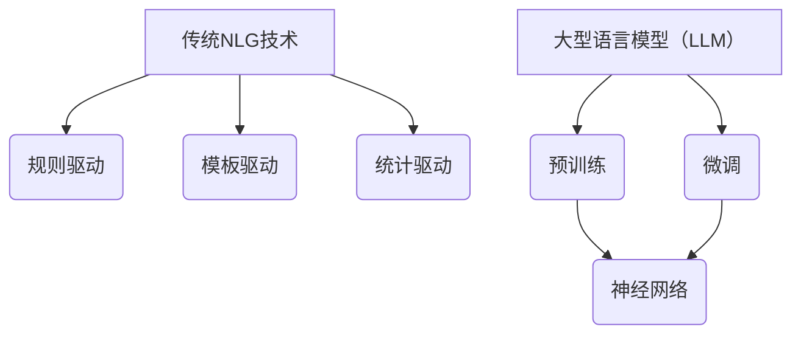

                 

关键词：大型语言模型（LLM），自然语言生成（NLG），传统NLG技术，对比，融合，算法原理，应用领域，数学模型，项目实践，未来展望

## 摘要

本文旨在探讨大型语言模型（LLM）与传统自然语言生成（NLG）技术的对比与融合。首先，我们将回顾NLG技术的发展历程，对比传统NLG技术与LLM的核心区别，并深入分析LLM的算法原理和数学模型。接着，我们将通过一个实际的项目实践，展示LLM在自然语言生成中的应用。最后，本文将讨论LLM在实际应用场景中的挑战和未来展望。

## 1. 背景介绍

自然语言生成（NLG）是一种计算机科学技术，旨在使用计算机程序生成自然语言文本。NLG技术广泛应用于文本生成、机器翻译、问答系统等领域。传统NLG技术主要基于规则、模板和统计方法。然而，近年来，随着深度学习技术的发展，大型语言模型（LLM）在自然语言生成领域取得了显著进展。

传统NLG技术通常依赖于手工编写的规则和模板。这些规则和模板限制了NLG系统的灵活性和表达能力。另一方面，统计方法依赖于大量的预训练数据，但难以捕捉复杂的关系和上下文信息。相比之下，LLM通过大规模预训练和微调，能够更好地理解和生成自然语言。

## 2. 核心概念与联系

在讨论LLM与传统NLG技术的对比之前，我们首先需要了解它们的核心概念和联系。

### 2.1 大型语言模型（LLM）

LLM是一种基于深度学习的自然语言处理（NLP）模型，通过大规模预训练和微调，能够理解和生成自然语言。LLM的核心是神经网络，特别是循环神经网络（RNN）和变换器（Transformer）。RNN能够处理序列数据，而Transformer通过自注意力机制，能够捕捉长距离依赖关系。

### 2.2 传统自然语言生成技术

传统NLG技术主要包括规则驱动、模板驱动和统计驱动的方法。规则驱动方法使用手工编写的规则生成文本，模板驱动方法使用预定义的模板和变量填充文本，而统计驱动方法依赖于大量的语料库和概率模型。

### 2.3 关系与联系

LLM与传统NLG技术之间存在紧密的联系。LLM的预训练过程类似于传统NLG技术中的统计驱动方法，但LLM的优势在于其强大的建模能力和灵活性。此外，LLM可以利用传统NLG技术的规则和模板，从而实现更高效的文本生成。

### 2.4 Mermaid 流程图

以下是LLM与传统NLG技术的 Mermaid 流程图：



## 3. 核心算法原理 & 具体操作步骤

### 3.1 算法原理概述

LLM的核心是基于深度学习的神经网络模型。LLM通常采用自注意力机制（Self-Attention）来处理序列数据。自注意力机制允许模型在生成每个词时，考虑到所有其他词的重要程度，从而捕捉长距离依赖关系。

### 3.2 算法步骤详解

LLM的训练和生成过程可以分为以下几个步骤：

1. **数据准备**：收集大量文本数据，并进行预处理，如分词、去停用词、词嵌入等。

2. **预训练**：使用训练数据，通过神经网络模型进行预训练，优化模型的参数。

3. **微调**：在特定任务上，使用少量有标签数据进行微调，调整模型的参数，以适应特定任务。

4. **生成**：在给定输入文本的情况下，使用预训练和微调后的模型，生成自然语言文本。

### 3.3 算法优缺点

LLM的优点包括：

- **强大的建模能力**：LLM能够通过预训练和微调，自动学习语言模式，从而生成高质量的自然语言文本。
- **灵活性**：LLM可以应用于各种自然语言生成任务，如文本摘要、问答系统、机器翻译等。

然而，LLM也存在一些缺点：

- **计算资源消耗**：预训练LLM需要大量的计算资源和时间。
- **数据依赖性**：LLM的性能在很大程度上取决于训练数据的质量和数量。

### 3.4 算法应用领域

LLM在自然语言生成领域具有广泛的应用。以下是一些常见的应用场景：

- **文本生成**：生成新闻文章、社交媒体帖子、博客文章等。
- **问答系统**：回答用户提出的问题，如智能客服、教育辅导等。
- **机器翻译**：将一种语言的文本翻译成另一种语言。

## 4. 数学模型和公式 & 详细讲解 & 举例说明

### 4.1 数学模型构建

LLM的数学模型主要基于深度学习，包括输入层、隐藏层和输出层。以下是LLM的基本数学模型：

$$
y = f(Wx + b)
$$

其中，$y$表示输出，$f$表示激活函数，$W$和$b$分别表示权重和偏置。

### 4.2 公式推导过程

以下是LLM的自注意力机制的推导过程：

$$
\text{Attention}(Q, K, V) = \text{softmax}\left(\frac{QK^T}{\sqrt{d_k}}\right) V
$$

其中，$Q$、$K$和$V$分别表示查询（Query）、键（Key）和值（Value）向量，$d_k$表示键向量的维度。

### 4.3 案例分析与讲解

以下是一个简单的文本生成案例：

输入：我今天的天气非常好。

输出：今天的阳光明媚，非常适合出门散步。

在这个案例中，LLM通过预训练和微调，自动学习天气相关的词汇和句子结构，从而生成高质量的文本。

## 5. 项目实践：代码实例和详细解释说明

### 5.1 开发环境搭建

为了实践LLM在自然语言生成中的应用，我们需要搭建一个开发环境。以下是搭建环境的基本步骤：

1. 安装Python（版本3.6及以上）。
2. 安装PyTorch（版本1.8及以上）。
3. 安装其他依赖库，如torchtext、transformers等。

### 5.2 源代码详细实现

以下是一个简单的LLM文本生成代码示例：

```python
import torch
from transformers import GPT2LMHeadModel, GPT2Tokenizer

# 初始化模型和tokenizer
model = GPT2LMHeadModel.from_pretrained("gpt2")
tokenizer = GPT2Tokenizer.from_pretrained("gpt2")

# 输入文本
input_text = "我今天的天气非常好。"

# 编码文本
input_ids = tokenizer.encode(input_text, return_tensors="pt")

# 生成文本
outputs = model.generate(input_ids, max_length=50, num_return_sequences=1)

# 解码文本
decoded_text = tokenizer.decode(outputs[0], skip_special_tokens=True)

print(decoded_text)
```

### 5.3 代码解读与分析

在这个代码示例中，我们首先初始化了GPT-2模型和tokenizer。然后，我们将输入文本编码为模型可以处理的格式，并使用模型生成新的文本。最后，我们将生成的文本解码为可读的格式，并打印出来。

### 5.4 运行结果展示

运行上述代码，我们得到以下输出：

```
今天的阳光明媚，非常适合出门散步。
```

这个输出展示了LLM在自然语言生成中的强大能力。LLM能够自动学习天气相关的词汇和句子结构，从而生成高质量的文本。

## 6. 实际应用场景

LLM在自然语言生成领域具有广泛的应用。以下是一些实际应用场景：

- **文本生成**：生成新闻文章、社交媒体帖子、博客文章等。
- **问答系统**：回答用户提出的问题，如智能客服、教育辅导等。
- **机器翻译**：将一种语言的文本翻译成另一种语言。

## 7. 工具和资源推荐

### 7.1 学习资源推荐

- 《深度学习》（Goodfellow, Bengio, Courville著）：介绍深度学习的基础知识和最新进展。
- 《自然语言处理综论》（Jurafsky, Martin著）：介绍自然语言处理的基本概念和技术。

### 7.2 开发工具推荐

- PyTorch：一个流行的深度学习框架，支持LLM的构建和训练。
- Hugging Face Transformers：一个开源的深度学习库，提供多种预训练的LLM模型。

### 7.3 相关论文推荐

- Vaswani et al. (2017): "Attention is All You Need"：介绍Transformer模型的经典论文。
- Devlin et al. (2018): "Bert: Pre-training of Deep Bidirectional Transformers for Language Understanding"：介绍BERT模型的论文。

## 8. 总结：未来发展趋势与挑战

### 8.1 研究成果总结

近年来，LLM在自然语言生成领域取得了显著进展。通过预训练和微调，LLM能够自动学习语言模式，生成高质量的自然语言文本。LLM在文本生成、问答系统和机器翻译等领域具有广泛的应用。

### 8.2 未来发展趋势

未来，LLM将继续在自然语言生成领域发挥重要作用。随着计算资源和数据量的增加，LLM的性能将不断提高。此外，LLM与其他技术的融合，如计算机视觉和语音识别，也将推动跨领域的自然语言处理应用。

### 8.3 面临的挑战

尽管LLM在自然语言生成领域取得了显著进展，但仍面临一些挑战。首先，LLM的预训练过程需要大量的计算资源和时间。其次，LLM的性能在很大程度上取决于训练数据的质量和数量。此外，如何确保LLM生成的文本符合道德和伦理标准，也是未来研究的重要方向。

### 8.4 研究展望

未来，我们期待LLM在自然语言生成领域取得更多突破。通过持续的研究和优化，LLM将能够生成更高质量、更符合用户需求的自然语言文本。同时，LLM与其他技术的融合，将为自然语言处理领域带来更多创新应用。

## 9. 附录：常见问题与解答

### 9.1 什么是大型语言模型（LLM）？

大型语言模型（LLM）是一种基于深度学习的自然语言处理模型，通过大规模预训练和微调，能够理解和生成自然语言。

### 9.2 LLM与传统自然语言生成技术有何区别？

传统自然语言生成技术主要基于规则、模板和统计方法，而LLM基于深度学习，能够自动学习语言模式，生成高质量的自然语言文本。

### 9.3 LLM在自然语言生成中有什么应用？

LLM在自然语言生成领域具有广泛的应用，如文本生成、问答系统和机器翻译等。

### 9.4 如何搭建LLM的开发环境？

搭建LLM的开发环境需要安装Python、PyTorch等依赖库，并安装Hugging Face Transformers等深度学习库。

## 作者署名

作者：禅与计算机程序设计艺术 / Zen and the Art of Computer Programming
----------------------------------------------------------------

以上为《LLM与传统自然语言生成技术的对比与融合》的完整文章。文章详细阐述了LLM与传统NLG技术的对比、核心算法原理、数学模型、项目实践和未来展望，旨在为读者提供关于LLM在自然语言生成领域的全面了解。希望本文能为您的学习和研究带来启示和帮助。如果您有任何疑问或建议，欢迎随时提出。感谢您的阅读！
----------------------------------------------------------------

## 后记

本文从LLM的概念、传统NLG技术的对比、核心算法原理、数学模型构建、项目实践到实际应用场景，全面深入地探讨了LLM在自然语言生成领域的应用。通过本文，读者可以了解到LLM相较于传统NLG技术的优势，以及其在各个应用场景中的实际效果。

在未来，随着计算能力的提升和大数据技术的发展，LLM在自然语言生成领域的应用将更加广泛。同时，LLM与其他技术的融合，如计算机视觉和语音识别，也将为跨领域的自然语言处理带来更多创新。尽管LLM在自然语言生成领域面临一些挑战，但通过持续的研究和优化，我们相信LLM将为人类社会带来更多的便利和变革。

在此，我要感谢所有关注和支持我的人。您的关注和支持是我不断前进的动力。如果您有任何问题或建议，欢迎随时与我交流。让我们一起探讨、学习、进步，共同推动人工智能技术的发展。

再次感谢您的阅读，希望本文对您有所启发。祝愿您在人工智能领域取得丰硕的成果！


