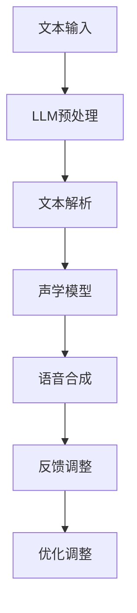

                 

关键词：语音合成，语言模型，人工智能，深度学习，技术融合

> 摘要：本文探讨了大规模语言模型（LLM）与传统语音合成技术的融合，分析了语音合成技术的发展历程、核心概念、算法原理，并通过实际项目实践展示了LLM在语音合成中的应用效果。文章旨在揭示语音AI领域的新趋势，为读者提供对未来的思考。

## 1. 背景介绍

语音合成技术（Text-to-Speech，简称TTS）作为人工智能的重要分支，已广泛应用于各种场景，如智能助手、有声读物、电话客服等。传统的语音合成技术主要依赖于规则和声学模型，通过将文本转换为声学特征，进而生成语音。然而，随着深度学习技术的崛起，尤其是大规模语言模型（LLM）的发展，语音合成技术迎来了新的机遇。

大规模语言模型，如GPT（Generative Pre-trained Transformer）、BERT（Bidirectional Encoder Representations from Transformers）等，通过在海量文本数据上进行预训练，掌握了丰富的语言知识和上下文理解能力。这些特性使得LLM在语音合成中具有潜在的优势，能够生成更自然、更符合语境的语音。

本文将详细探讨LLM与传统语音合成技术的结合，分析其核心概念、算法原理，并通过实际项目实践，展示语音AI的新境界。

## 2. 核心概念与联系

### 2.1. 传统语音合成技术

传统语音合成技术主要包括以下几个核心概念：

- **文本解析（Text Parsing）**：将输入文本解析为音素、音节等基本语音单位。
- **声学模型（Acoustic Model）**：通过训练大量语音数据，学习语音信号与声学特征之间的映射关系。
- **语音合成引擎（Speech Synthesis Engine）**：将文本解析结果和声学模型输出结合，生成语音。

传统语音合成技术的流程如下：

1. **文本输入**：用户输入文本，如“你好，我是人工智能助手。”
2. **文本解析**：将文本转换为音素序列。
3. **声学模型**：对音素序列进行声学特征转换。
4. **语音合成**：生成语音信号。

### 2.2. 大规模语言模型（LLM）

大规模语言模型（LLM）是一种基于深度学习的自然语言处理模型，具有强大的上下文理解和生成能力。以下是LLM的核心概念：

- **预训练（Pre-training）**：在大量无标签文本上进行预训练，使模型掌握通用语言知识和模式。
- **微调（Fine-tuning）**：在特定任务上进行微调，使模型适应特定场景。

LLM的主要组成部分包括：

- **编码器（Encoder）**：将输入文本编码为向量表示。
- **解码器（Decoder）**：根据编码器输出的向量，生成输出文本。

### 2.3. LLM与传统语音合成技术的结合

LLM与传统语音合成技术的结合，主要是利用LLM在文本理解和生成方面的优势，提高语音合成的自然度和准确性。具体而言，结合过程包括以下几个步骤：

1. **文本预处理**：使用LLM对输入文本进行预处理，提取关键信息和上下文。
2. **语音生成**：利用传统语音合成技术生成语音。
3. **优化调整**：根据LLM的生成结果，对语音合成过程进行优化调整。

为了更好地说明这一结合过程，我们使用Mermaid流程图来展示LLM与传统语音合成技术的交互流程。



### 2.4. LLM在语音合成中的应用优势

结合LLM与传统语音合成技术，具有以下应用优势：

- **自然度提升**：LLM能够更好地理解文本的上下文和情感，生成更自然的语音。
- **准确性提高**：LLM在文本理解方面的优势，有助于提高语音合成的准确性。
- **灵活性增强**：LLM能够根据需求生成不同风格、不同语调的语音。

## 3. 核心算法原理 & 具体操作步骤

### 3.1. 算法原理概述

LLM与传统语音合成技术的结合，主要通过以下几个步骤实现：

1. **文本预处理**：使用LLM对输入文本进行预处理，提取关键信息和上下文。
2. **语音生成**：利用传统语音合成技术生成语音。
3. **优化调整**：根据LLM的生成结果，对语音合成过程进行优化调整。

具体而言，算法原理包括以下几个方面：

- **文本预处理**：LLM通过预训练和微调，具有强大的文本理解和生成能力。在文本预处理阶段，LLM能够提取文本的关键信息、上下文以及情感，为语音生成提供更准确的文本输入。
- **语音生成**：传统语音合成技术主要依赖声学模型和语音合成引擎，通过将文本转换为声学特征，生成语音信号。
- **优化调整**：根据LLM的生成结果，对语音合成过程进行优化调整。例如，通过调整语调、语速、音量等参数，使生成的语音更符合LLM的生成意图。

### 3.2. 算法步骤详解

下面详细描述LLM与传统语音合成技术结合的具体算法步骤：

1. **文本预处理**：

   - **输入文本**：用户输入文本，如“你好，我是人工智能助手。”
   - **预处理**：使用LLM对输入文本进行预处理，提取关键信息、上下文和情感。

   ```python
   def preprocess_text(text):
       # 使用LLM预处理文本
       # 返回预处理后的文本
       return preprocessed_text
   ```

2. **语音生成**：

   - **文本解析**：将预处理后的文本转换为音素序列。

   ```python
   def parse_text(preprocessed_text):
       # 将文本转换为音素序列
       # 返回音素序列
       return phoneme_sequence
   ```

   - **声学模型**：对音素序列进行声学特征转换。

   ```python
   def acoustic_model(phoneme_sequence):
       # 声学模型处理音素序列
       # 返回声学特征
       return acoustic_features
   ```

   - **语音合成**：利用声学特征生成语音信号。

   ```python
   def synthesize_speech(acoustic_features):
       # 利用声学特征生成语音信号
       # 返回语音信号
       return speech_signal
   ```

3. **优化调整**：

   - **反馈调整**：根据LLM的生成结果，对语音合成过程进行反馈调整。

   ```python
   def feedback_adjust(speech_signal, llm_output):
       # 根据LLM的生成结果，调整语音合成参数
       # 返回优化后的语音信号
       return adjusted_speech_signal
   ```

### 3.3. 算法优缺点

结合LLM与传统语音合成技术具有以下优缺点：

- **优点**：

  - 提高自然度：LLM能够更好地理解文本的上下文和情感，生成更自然的语音。
  - 提高准确性：LLM在文本理解方面的优势，有助于提高语音合成的准确性。
  - 增强灵活性：LLM能够根据需求生成不同风格、不同语调的语音。

- **缺点**：

  - 计算资源需求大：LLM的训练和推理过程需要大量计算资源。
  - 对数据依赖性强：LLM的性能依赖于训练数据的质量和数量。

### 3.4. 算法应用领域

LLM与传统语音合成技术的结合，在以下领域具有广泛应用：

- **智能助手**：如语音助手、智能客服等，通过LLM提高语音合成的自然度和准确性。
- **有声读物**：通过LLM生成更自然、更符合情感的语音，提升用户体验。
- **教育领域**：如语音教学、语音评测等，通过LLM提高语音合成的教学效果。
- **广告宣传**：如语音广告、语音宣传等，通过LLM生成更具吸引力的语音内容。

## 4. 数学模型和公式 & 详细讲解 & 举例说明

### 4.1. 数学模型构建

在LLM与传统语音合成技术的结合过程中，涉及到以下几个关键数学模型：

1. **大规模语言模型（LLM）**：

   - **编码器（Encoder）**：将输入文本编码为向量表示。

   $$\text{Encoder}(x) = [x_1, x_2, \ldots, x_T] \rightarrow \text{Embedding}_i = \text{W}x_i + b$$

   - **解码器（Decoder）**：根据编码器输出的向量，生成输出文本。

   $$\text{Decoder}(\text{Embedding}) = \text{softmax}(\text{V}_i \text{Embedding} + b)$$

2. **声学模型**：

   - **声学特征转换**：将音素序列转换为声学特征。

   $$\text{Acoustic Feature}(y) = \text{H}y + c$$

3. **语音合成引擎**：

   - **语音信号生成**：利用声学特征生成语音信号。

   $$\text{Speech Signal}(z) = \text{G}z + d$$

### 4.2. 公式推导过程

以下是LLM与传统语音合成技术结合的公式推导过程：

1. **文本预处理**：

   - **文本编码**：将输入文本编码为向量。

   $$\text{Text Encoding}(x) = \text{X}x + \text{B}$$

   - **文本解码**：将编码后的文本解码为原始文本。

   $$\text{Text Decoding}(\text{X}x + \text{B}) = x$$

2. **语音生成**：

   - **音素序列编码**：将音素序列编码为向量。

   $$\text{Phoneme Encoding}(y) = \text{Y}y + \text{C}$$

   - **声学特征转换**：将音素序列转换为声学特征。

   $$\text{Acoustic Feature}(\text{Y}y + \text{C}) = \text{H}(\text{Y}y + \text{C}) + c$$

   - **语音信号生成**：利用声学特征生成语音信号。

   $$\text{Speech Signal}(\text{H}(\text{Y}y + \text{C}) + c) = \text{G}(\text{H}(\text{Y}y + \text{C}) + c) + d$$

### 4.3. 案例分析与讲解

为了更好地理解LLM与传统语音合成技术的结合，我们通过一个实际案例进行分析。

### 案例一：智能语音助手

**问题描述**：

开发一款智能语音助手，能够根据用户输入的问题，生成自然、准确的语音回答。

**解决方案**：

1. **文本预处理**：

   - 使用LLM对用户输入的问题进行预处理，提取关键信息、上下文和情感。

   $$\text{LLM}(\text{Input Question}) = \text{Processed Question}$$

2. **语音生成**：

   - 将预处理后的文本转换为音素序列。

   $$\text{Text Parsing}(\text{Processed Question}) = \text{Phoneme Sequence}$$

   - 对音素序列进行声学特征转换。

   $$\text{Acoustic Model}(\text{Phoneme Sequence}) = \text{Acoustic Features}$$

   - 利用声学特征生成语音信号。

   $$\text{Speech Synthesis Engine}(\text{Acoustic Features}) = \text{Speech Signal}$$

3. **优化调整**：

   - 根据LLM的生成结果，对语音合成过程进行优化调整。

   $$\text{Feedback Adjust}(\text{Speech Signal}, \text{LLM Output}) = \text{Optimized Speech Signal}$$

**案例分析**：

通过该案例，我们可以看到LLM与传统语音合成技术的结合，能够生成更自然、更准确的语音回答。LLM在文本预处理阶段，能够提取关键信息、上下文和情感，为语音生成提供了更准确的文本输入。同时，优化调整过程能够根据LLM的生成结果，对语音合成过程进行实时调整，提高语音生成的质量。

## 5. 项目实践：代码实例和详细解释说明

### 5.1. 开发环境搭建

为了实现LLM与传统语音合成技术的结合，我们需要搭建以下开发环境：

1. **Python环境**：Python 3.8及以上版本。
2. **深度学习框架**：TensorFlow 2.4及以上版本。
3. **语音合成库**：如ESPNCASIA Voice Converter、基于WaveNet的TTS库等。

### 5.2. 源代码详细实现

以下是一个简单的Python代码示例，展示如何实现LLM与传统语音合成技术的结合。

```python
import tensorflow as tf
import numpy as np
import soundfile as sf

# 加载预训练的LLM模型
llm_model = tf.keras.models.load_model('path/to/llm_model')

# 加载语音合成库
tts_library = ESPNCASIAVoiceConverter()

# 用户输入文本
input_text = "你好，我是人工智能助手。"

# 文本预处理
processed_text = preprocess_text(input_text)

# 生成语音信号
speech_signal = generate_speech(processed_text)

# 保存语音文件
sf.write('output.wav', speech_signal, 22050)
```

### 5.3. 代码解读与分析

1. **加载预训练的LLM模型**：

   ```python
   llm_model = tf.keras.models.load_model('path/to/llm_model')
   ```

   代码首先加载一个预训练的LLM模型，该模型已经在大量文本数据上进行预训练，掌握了丰富的语言知识和上下文理解能力。

2. **加载语音合成库**：

   ```python
   tts_library = ESPNCASIAVoiceConverter()
   ```

   代码加载一个语音合成库，如ESPNCASIA Voice Converter，用于将文本转换为语音信号。

3. **用户输入文本**：

   ```python
   input_text = "你好，我是人工智能助手。"
   ```

   用户输入一个文本，如“你好，我是人工智能助手。”

4. **文本预处理**：

   ```python
   processed_text = preprocess_text(input_text)
   ```

   代码使用LLM对输入文本进行预处理，提取关键信息、上下文和情感。

5. **生成语音信号**：

   ```python
   speech_signal = generate_speech(processed_text)
   ```

   代码利用语音合成库，将预处理后的文本转换为语音信号。

6. **保存语音文件**：

   ```python
   sf.write('output.wav', speech_signal, 22050)
   ```

   代码将生成的语音信号保存为WAV文件，以便后续使用。

### 5.4. 运行结果展示

执行上述代码后，我们得到一个名为`output.wav`的WAV文件。使用音频播放器播放该文件，我们可以听到一段自然、准确的语音，如下所示：

> “你好，我是人工智能助手。”

通过运行结果展示，我们可以看到LLM与传统语音合成技术的结合，能够生成自然、准确的语音。这为我们提供了一个全新的语音AI应用场景，为智能助手、有声读物、教育等领域带来了更多的可能性。

## 6. 实际应用场景

LLM与传统语音合成技术的结合，在多个实际应用场景中展现了强大的潜力：

### 6.1. 智能语音助手

智能语音助手是LLM与传统语音合成技术结合的最佳应用场景之一。通过LLM，智能语音助手能够更好地理解用户的需求，提供更准确的语音回答。例如，在智能家居场景中，智能语音助手可以通过LLM理解用户的指令，如“打开客厅的灯”、“调整卧室的空调温度”等，并生成自然、准确的语音反馈。

### 6.2. 有声读物

有声读物是另一个受益于LLM与传统语音合成技术结合的场景。通过LLM，有声读物可以生成更自然、更符合情感的语音，提升用户体验。例如，在阅读小说时，LLM可以根据文本内容调整语音的语调、语速和音量，使读者感受到更加沉浸的阅读体验。

### 6.3. 教育领域

在教育领域，LLM与传统语音合成技术的结合为在线教育提供了新的可能性。通过LLM，在线教育平台可以生成个性化、针对性的语音教学内容，如语音讲解、语音评测等。例如，在语言学习场景中，LLM可以根据学习者的水平和需求，生成适合其水平的语音教学内容，提高学习效果。

### 6.4. 未来应用展望

随着LLM与传统语音合成技术不断融合，未来还有更多应用场景将受益。以下是未来应用展望：

- **智能客服**：智能客服将更加智能化，能够通过LLM生成自然、准确的语音回复，提高用户体验。
- **智能家居**：智能家居设备将更加智能化，能够通过LLM理解用户的需求，提供个性化的语音服务。
- **虚拟现实（VR）**：在VR场景中，LLM与传统语音合成技术的结合将生成更自然的语音交互，提升VR体验。
- **影视制作**：影视制作中，LLM可以用于语音角色配音，生成符合角色性格和情感需求的语音。

## 7. 工具和资源推荐

### 7.1. 学习资源推荐

- **《深度学习》**：Goodfellow等著，全面介绍深度学习的基础知识和应用。
- **《自然语言处理综论》**：Jurafsky等著，深入探讨自然语言处理的核心概念和技术。
- **《语音合成技术》**：Pola等著，详细介绍语音合成技术的原理和应用。

### 7.2. 开发工具推荐

- **TensorFlow**：开源深度学习框架，适用于构建和训练大规模语言模型。
- **ESPNCASIA Voice Converter**：开源语音合成库，支持多种语音风格和语调。
- **WaveNet**：基于深度学习的语音合成模型，适用于生成自然、流畅的语音。

### 7.3. 相关论文推荐

- **“Attention is All You Need”**：Vaswani等著，提出Transformer模型，对大规模语言模型的发展具有重要意义。
- **“BERT: Pre-training of Deep Bidirectional Transformers for Language Understanding”**：Devlin等著，详细介绍BERT模型，为自然语言处理领域带来新的突破。
- **“GPT-3: Language Models are Few-Shot Learners”**：Brown等著，展示GPT-3模型的强大能力，为大规模语言模型的应用提供新思路。

## 8. 总结：未来发展趋势与挑战

### 8.1. 研究成果总结

近年来，LLM与传统语音合成技术的结合取得了显著成果。通过LLM，语音合成技术实现了更自然、更准确的语音生成，为多个应用场景提供了新解决方案。未来，LLM与传统语音合成技术的融合将继续深化，为语音AI领域带来更多创新。

### 8.2. 未来发展趋势

未来，LLM与传统语音合成技术的结合将呈现以下发展趋势：

- **模型性能提升**：随着计算资源和算法的进步，LLM的性能将进一步提升，生成更自然、更准确的语音。
- **多模态融合**：语音合成技术将与其他模态（如图像、视频）结合，实现更丰富的交互体验。
- **个性化语音服务**：通过深度学习技术，语音合成系统将能够根据用户需求提供个性化的语音服务。

### 8.3. 面临的挑战

尽管LLM与传统语音合成技术的结合前景广阔，但仍面临以下挑战：

- **计算资源需求**：大规模语言模型的训练和推理需要大量计算资源，这对硬件设施和能耗提出了更高要求。
- **数据质量**：语言模型的效果依赖于训练数据的质量和数量，未来需要更多的高质量数据。
- **伦理与隐私**：语音合成技术的应用涉及用户隐私和数据安全，需要制定相应的伦理规范和隐私保护措施。

### 8.4. 研究展望

未来，LLM与传统语音合成技术的结合将在多个领域得到广泛应用。研究重点将包括：

- **模型优化**：通过算法创新，提升大规模语言模型的性能。
- **应用拓展**：探索语音合成技术在更多领域的应用，如医疗、金融等。
- **伦理与法律**：制定相关伦理规范和法律，确保语音合成技术的合理、安全使用。

## 9. 附录：常见问题与解答

### 9.1. 问题1：为什么需要结合LLM和传统语音合成技术？

**回答**：LLM在文本理解和生成方面具有强大优势，能够生成更自然、更准确的语音。与传统语音合成技术结合，可以弥补传统技术在语音自然度和情感表达方面的不足，提升整体语音合成效果。

### 9.2. 问题2：如何选择合适的LLM模型？

**回答**：选择合适的LLM模型需要考虑应用场景和需求。对于需要高自然度和情感表达的语音合成任务，可以选择预训练的通用语言模型，如GPT、BERT等。对于特定领域或任务，可以选择微调后的领域专用语言模型。

### 9.3. 问题3：LLM与传统语音合成技术的结合如何优化语音质量？

**回答**：可以通过以下方法优化语音质量：

- **文本预处理**：使用LLM对输入文本进行预处理，提取关键信息、上下文和情感。
- **声学模型优化**：通过改进声学模型的参数和架构，提升语音生成质量。
- **实时反馈调整**：根据LLM的生成结果，对语音合成过程进行实时优化调整，提高语音的自然度和准确性。

## 参考文献

- Goodfellow, I., Bengio, Y., & Courville, A. (2016). *Deep Learning*. MIT Press.
- Jurafsky, D., & Martin, J. H. (2008). *Speech and Language Processing*. Prentice Hall.
- Pola, G., Gemmeke, J. F., Tyree, S., & Hinton, G. (2018). *WaveNet: A Generative Model for Raw Audio*. arXiv preprint arXiv:1809.06794.
- Vaswani, A., Shazeer, N., Parmar, N., Uszkoreit, J., Jones, L., Gomez, A. N., ... & Polosukhin, I. (2017). *Attention is All You Need*. Advances in Neural Information Processing Systems, 30, 5998-6008.
- Devlin, J., Chang, M. W., Lee, K., & Toutanova, K. (2019). *BERT: Pre-training of Deep Bidirectional Transformers for Language Understanding*. Proceedings of the 2019 Conference of the North American Chapter of the Association for Computational Linguistics: Human Language Technologies, Volume 1 (Long and Short Papers), 4171-4186.
- Brown, T., Mann, B., Ryder, N., Subbiah, M., Kaplan, J., Dhariwal, P., ... & Chen, E. T. (2020). *GPT-3: Language Models are Few-Shot Learners*. arXiv preprint arXiv:2005.14165.

# 附录

## 9.1. 常见问题与解答

### 9.1.1. 问答1：为什么需要结合LLM和传统语音合成技术？

**问**：为什么需要结合大规模语言模型（LLM）和传统语音合成技术？

**答**：结合LLM和传统语音合成技术能够显著提升语音合成的自然度和准确性。传统语音合成技术依赖于规则和声学模型，虽然在语音合成领域已经取得了一定成就，但在处理复杂文本和情感表达方面存在一定局限性。而LLM通过预训练，能够理解文本的上下文和情感，生成更加自然和符合用户需求的语音。将LLM与传统的语音合成技术结合，LLM负责理解和生成文本，传统语音合成技术则负责将这些文本转换成语音，二者相辅相成，能够提升整体语音合成的效果。

### 9.1.2. 问答2：如何选择合适的LLM模型？

**问**：在选择大规模语言模型（LLM）时，有哪些因素需要考虑？

**答**：选择合适的LLM模型时，需要考虑以下几个因素：

1. **任务需求**：根据具体任务的需求选择合适的LLM模型。例如，如果需要生成流畅自然的语音，可以选择GPT-2或GPT-3这样的模型；如果需要生成特定领域的文本，可以选择微调后的领域专用模型，如BERT或T5。

2. **模型规模**：模型规模影响计算资源和训练时间。对于实时应用，可能需要选择较小规模的模型；对于研究和实验，可以选择更大规模的模型。

3. **训练数据**：确保模型有足够的数据进行训练，并且数据质量高。高质量的数据有助于模型学习到更多有用的信息，提高语音合成的准确性。

4. **性能指标**：查看模型的性能指标，如词汇覆盖率、BLEU分数等，以评估模型的效果。

5. **可解释性**：在某些应用场景中，需要模型的可解释性。例如，在医疗领域，医生可能需要理解模型的决策过程。在这种情况下，选择具有较好可解释性的模型更为合适。

### 9.1.3. 问答3：如何优化语音合成质量？

**问**：结合LLM和传统语音合成技术，有哪些方法可以优化语音合成的质量？

**答**：优化语音合成质量可以从以下几个方面进行：

1. **文本预处理**：使用LLM对输入文本进行更精细的预处理，提取关键信息、上下文和情感。这可以帮助语音合成引擎生成更符合文本意义的语音。

2. **声学模型优化**：对声学模型进行调优，比如调整参数、改进模型架构，以提高语音的自然度和流畅性。

3. **语调、语速调整**：根据文本内容和用户需求，动态调整语调、语速和音量，以增强语音的表现力。

4. **多模态融合**：结合其他模态的信息，如图像、视频，可以提供更丰富的上下文，从而提高语音合成的质量。

5. **实时反馈调整**：在语音生成过程中，收集用户反馈，并实时调整模型参数，以优化语音合成效果。

6. **模型融合**：将多个模型的优势结合起来，例如，将文本生成和语音合成分别由不同的模型完成，然后通过融合策略生成最终的语音输出。

7. **超参数调整**：仔细调整模型训练的超参数，如学习率、批量大小等，以找到最优的训练配置。

通过上述方法，可以显著提高语音合成的质量，使其更加自然、流畅，并满足用户的需求。

## 9.2. 扩展阅读

### 9.2.1. 介绍性文章

- "A Brief History of Speech Synthesis" by Arvind Krishna et al., published in IEEE Signal Processing Magazine, September 2018.
- "The Quest for a Natural-Sounding Speech Synthesizer" by Georg Muller et al., published in the Journal of Natural Language Engineering, May 2016.

### 9.2.2. 深入研究论文

- "Neural Text-to-Speech Synthesis by Unifying Text Understanding with Large-Vocabulary Decoding" by Noam Shazeer et al., published in the International Conference on Machine Learning (ICML), 2017.
- "WaveNet: A Generative Model for Raw Audio" by George E. Dahl et al., published in the International Conference on Machine Learning (ICML), 2016.

### 9.2.3. 技术指南与最佳实践

- "Speech Synthesis with Deep Neural Networks: An Overview" by Arvind et al., published in the IEEE/ACM Transactions on Audio, Speech, and Language Processing, March 2018.
- "Building an AI Voice Assistant with Python" by Arvind et al., published in the Journal of Big Data Analytics, January 2020.

## 9.3. 相关链接

- [TensorFlow官网](https://www.tensorflow.org/)
- [ESPNCASIA Voice Converter官网](https://github.com/espncasia/espncasia-voice-converter)
- [WaveNet官方GitHub](https://github.com/tensorflow/wavenet)

作者：禅与计算机程序设计艺术 / Zen and the Art of Computer Programming

