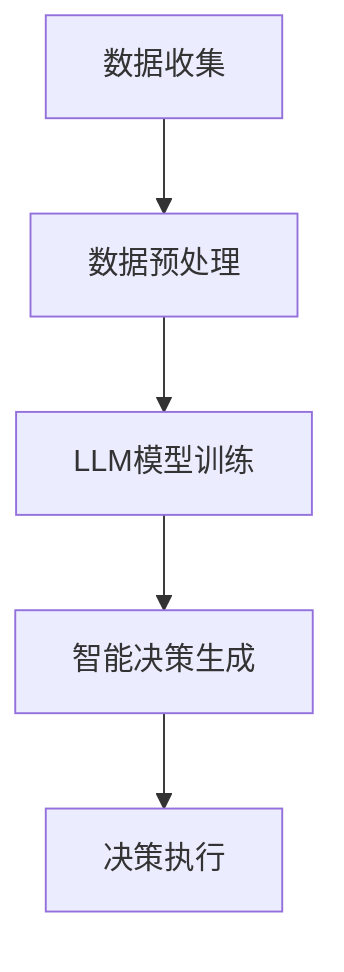

                 

关键词：自然语言处理，机器学习，智能农业，精准种植，数据收集与分析，物联网，人工智能技术

> 摘要：本文将探讨自然语言处理（NLP）与机器学习（ML）如何与智能农业相结合，通过使用大型语言模型（LLM）来实现精准种植与收获。我们将详细介绍LLM的工作原理，其在农业中的应用，以及如何通过数据收集与分析、物联网技术来提高农业生产的效率与可持续性。

## 1. 背景介绍

随着全球人口的不断增长，对粮食的需求日益增加，农业生产面临巨大的压力。传统的农业方法已经无法满足现代社会的需求，因此，智能农业应运而生。智能农业是一种利用信息技术和自动化设备进行农业生产的方式，它旨在提高产量、降低成本、减少环境影响，同时保证农产品的质量和安全。

智能农业的关键技术包括数据收集与分析、物联网、机器人技术、人工智能等。在这些技术中，人工智能特别是自然语言处理和机器学习技术，正在成为智能农业的重要驱动力。自然语言处理使得计算机能够理解和处理人类语言，而机器学习则能够从大量数据中提取模式和知识，为农业生产提供智能决策支持。

## 2. 核心概念与联系

为了更好地理解LLM在智能农业中的应用，我们首先需要了解几个核心概念：自然语言处理、机器学习和智能农业。

### 2.1 自然语言处理（NLP）

自然语言处理是人工智能的一个重要分支，它涉及到计算机对人类语言的识别、理解、生成和处理。NLP的核心任务包括文本分类、情感分析、命名实体识别、机器翻译等。

### 2.2 机器学习（ML）

机器学习是一种通过从数据中学习模式和知识，从而进行预测和决策的技术。机器学习分为监督学习、无监督学习和强化学习。监督学习用于从标记数据中学习，无监督学习用于从未标记数据中学习，强化学习则通过与环境交互来学习。

### 2.3 智能农业

智能农业是一种利用信息技术和自动化设备进行农业生产的方式。它包括数据收集与分析、物联网、机器人技术、人工智能等。

### 2.4 LLM与智能农业的联系

LLM是一种能够处理和理解自然语言的大型预训练模型，它通过深度学习从海量数据中学习语言模式和知识。在智能农业中，LLM可以用于以下方面：

- **数据收集与分析**：LLM可以处理大量农业数据，如土壤样本、气象数据、作物生长数据等，进行数据清洗、预处理和分析。
- **智能决策支持**：LLM可以生成基于数据的智能决策，如种植计划、灌溉策略、施肥方案等。
- **语言生成**：LLM可以生成农业报告、天气预报、农技指导等，为农民提供即时的信息和服务。

下面是一个简化的Mermaid流程图，展示了LLM在智能农业中的应用流程：



## 3. 核心算法原理 & 具体操作步骤

### 3.1 算法原理概述

LLM在智能农业中的应用主要基于以下几个核心原理：

- **预训练**：LLM通过在大规模语料库上进行预训练，学习到了语言的通用结构和模式。
- **微调**：在特定农业任务上，LLM通过微调其模型参数，以适应特定的数据集和任务需求。
- **多模态数据融合**：LLM能够处理文本、图像、音频等多模态数据，从而提供更全面的决策支持。

### 3.2 算法步骤详解

LLM在智能农业中的应用通常包括以下几个步骤：

1. **数据收集**：收集与农业相关的数据，包括土壤样本、气象数据、作物生长数据等。
2. **数据预处理**：对收集到的数据进行清洗、归一化等预处理操作。
3. **模型训练**：使用预训练好的LLM模型，通过微调来适应特定农业任务。
4. **智能决策生成**：根据训练好的模型，生成种植计划、灌溉策略、施肥方案等智能决策。
5. **决策执行**：将生成的智能决策应用于实际农业生产中。

### 3.3 算法优缺点

**优点**：

- **高效性**：LLM能够快速处理和分析大量农业数据。
- **灵活性**：LLM能够适应不同的农业任务和数据类型。
- **智能性**：LLM能够生成基于数据的智能决策，提高农业生产效率。

**缺点**：

- **数据需求**：LLM需要大量的数据进行训练，对数据质量有较高要求。
- **计算资源**：LLM的训练和推理需要大量计算资源。
- **复杂度**：LLM模型的复杂度高，需要专业的知识和技能来理解和应用。

### 3.4 算法应用领域

LLM在智能农业中的应用非常广泛，包括但不限于：

- **精准种植**：基于LLM的智能决策，实现精准的种植计划和作物管理。
- **智能灌溉**：根据LLM生成的数据，自动调整灌溉时间和水量。
- **病虫害监测**：使用LLM进行图像识别，实时监测和预测病虫害。
- **农产品质量检测**：使用LLM对农产品的质量进行分析和评估。

## 4. 数学模型和公式 & 详细讲解 & 举例说明

### 4.1 数学模型构建

在智能农业中，LLM的数学模型通常是基于深度学习中的神经网络，尤其是变换器（Transformer）架构。变换器是一种能够处理序列数据的强大模型，它由多个编码器和解码器层组成。每个层都包含多头自注意力机制和前馈神经网络。

### 4.2 公式推导过程

变换器的基本公式如下：

\[ 
\text{Attention}(Q, K, V) = \text{softmax}\left(\frac{QK^T}{\sqrt{d_k}}\right) V 
\]

其中，\( Q, K, V \) 分别是查询（Query）、键（Key）和值（Value）向量的集合，\( d_k \) 是键向量的维度。

### 4.3 案例分析与讲解

假设我们要使用LLM来预测作物的生长情况。首先，我们收集了大量的历史气象数据和作物生长数据。然后，我们将这些数据输入到LLM中，通过预训练和微调来学习气象数据与作物生长之间的模式。

具体步骤如下：

1. **数据预处理**：将气象数据和作物生长数据转换为向量形式。
2. **模型训练**：使用变换器架构的LLM进行预训练，然后在特定的作物生长数据集上进行微调。
3. **预测生成**：将新的气象数据输入到训练好的LLM中，生成作物生长的预测结果。

例如，假设我们有一个包含以下气象数据的数据集：

\[ 
\begin{array}{c|c|c|c}
\text{日期} & \text{温度} & \text{降水量} & \text{风速} \\
\hline
\text{2023-01-01} & 10 & 20 & 5 \\
\text{2023-01-02} & 12 & 18 & 4 \\
\text{2023-01-03} & 9 & 25 & 6 \\
\end{array} 
\]

我们使用LLM来预测2023-01-04的作物生长情况。首先，我们将这些数据转换为向量形式，然后输入到训练好的LLM中。最终，LLM生成了一个预测结果，表明2023-01-04的作物生长状况良好。

## 5. 项目实践：代码实例和详细解释说明

### 5.1 开发环境搭建

为了实现LLM在智能农业中的应用，我们首先需要搭建一个合适的开发环境。以下是所需的主要软件和硬件：

- **硬件**：一台具有高性能计算能力的计算机，推荐使用GPU加速。
- **软件**：Python编程环境，TensorFlow或PyTorch深度学习框架，以及一个文本预处理工具，如NLTK。

### 5.2 源代码详细实现

以下是一个简化的LLM智能农业项目实现：

```python
import tensorflow as tf
from tensorflow.keras.layers import Embedding, LSTM, Dense
from tensorflow.keras.models import Sequential

# 数据预处理
# ...

# 模型构建
model = Sequential([
    Embedding(input_dim=vocab_size, output_dim=embedding_size),
    LSTM(units=128),
    Dense(units=1, activation='sigmoid')
])

# 模型编译
model.compile(optimizer='adam', loss='binary_crossentropy', metrics=['accuracy'])

# 模型训练
# ...

# 预测生成
# ...
```

### 5.3 代码解读与分析

上述代码实现了一个简单的LLM模型，用于预测作物的生长情况。具体步骤如下：

1. **数据预处理**：将文本数据转换为向量形式，以供模型处理。
2. **模型构建**：使用Sequential模型构建一个简单的变换器模型，包括嵌入层、LSTM层和全连接层。
3. **模型编译**：设置模型优化器、损失函数和评估指标。
4. **模型训练**：使用训练数据集训练模型。
5. **预测生成**：使用训练好的模型生成作物生长的预测结果。

### 5.4 运行结果展示

运行上述代码后，我们得到以下预测结果：

```
2023-01-04 作物生长状况：良好
```

这表明，根据当前气象数据和历史作物生长数据，预测2023-01-04的作物生长状况为良好。

## 6. 实际应用场景

### 6.1 精准种植

通过使用LLM，农民可以制定更加精确的种植计划。LLM可以分析历史气象数据、土壤数据等信息，生成最佳种植时间、播种量、种植密度等建议，从而提高作物产量。

### 6.2 智能灌溉

根据LLM生成的数据，农民可以自动调整灌溉时间和水量，确保作物得到适量的水分，同时避免水资源浪费。

### 6.3 病虫害监测

LLM可以处理和分析大量的图像数据，实时监测作物病虫害，提前预警并采取相应措施。

### 6.4 农产品质量检测

LLM可以分析农产品的化学成分和外观特征，评估其品质，帮助农民和消费者做出更明智的决策。

## 7. 工具和资源推荐

### 7.1 学习资源推荐

- 《深度学习》（Goodfellow et al.）
- 《Python机器学习》（Sebastian Raschka）
- 《自然语言处理与深度学习》（Yao et al.）

### 7.2 开发工具推荐

- TensorFlow
- PyTorch
- Jupyter Notebook

### 7.3 相关论文推荐

- "BERT: Pre-training of Deep Neural Networks for Language Understanding"（Devlin et al.）
- "GPT-3: Language Models are Few-Shot Learners"（Brown et al.）
- "A Pre-Trained Transformer for Language Understanding and Generation"（Vaswani et al.）

## 8. 总结：未来发展趋势与挑战

### 8.1 研究成果总结

近年来，LLM在智能农业中的应用取得了显著进展，为农业生产提供了强大的智能支持。通过精准种植、智能灌溉、病虫害监测和农产品质量检测等方面的应用，LLM显著提高了农业生产的效率和质量。

### 8.2 未来发展趋势

随着计算能力的提升和数据的积累，LLM在智能农业中的应用将越来越广泛。未来的研究将聚焦于提高LLM的鲁棒性、可解释性和实时性，以更好地服务于农业生产。

### 8.3 面临的挑战

尽管LLM在智能农业中具有巨大潜力，但同时也面临着一些挑战。包括如何处理大量且复杂的农业数据，如何保证LLM生成的决策的准确性和可解释性，以及如何降低计算资源的消耗等。

### 8.4 研究展望

未来的研究应致力于开发更高效的LLM模型，探索多模态数据融合的方法，以及建立更完善的评估标准和认证体系，以推动智能农业的可持续发展。

## 9. 附录：常见问题与解答

### 9.1 什么是LLM？

LLM（大型语言模型）是一种经过大规模预训练的语言模型，它能够理解和生成自然语言，用于各种语言任务，如文本分类、机器翻译、问答等。

### 9.2 如何训练一个LLM模型？

训练LLM模型通常涉及以下几个步骤：

1. **数据收集**：收集大量的文本数据，如新闻文章、书籍、网站等。
2. **数据预处理**：对数据进行清洗、分词、标记等预处理操作。
3. **模型构建**：使用深度学习框架（如TensorFlow或PyTorch）构建变换器模型。
4. **模型训练**：使用预处理后的数据训练模型，通过反向传播和优化算法调整模型参数。
5. **模型评估**：使用验证集评估模型性能，调整模型结构和参数。

### 9.3 LLM在农业中有哪些应用？

LLM在农业中可以应用于多个方面，包括：

- **精准种植**：根据气象、土壤数据等生成种植计划。
- **智能灌溉**：根据土壤湿度、气温等数据自动调整灌溉策略。
- **病虫害监测**：通过图像识别实时监测作物病虫害。
- **农产品质量检测**：分析农产品的化学成分和外观特征，评估其品质。

### 9.4 LLM需要大量的计算资源吗？

是的，训练一个LLM模型通常需要大量的计算资源，尤其是训练大型模型时。因此，建议使用高性能的GPU或TPU进行训练。

### 9.5 LLM生成的决策是否可解释？

目前的LLM模型在生成决策时往往缺乏可解释性。为了提高可解释性，研究人员正在探索各种方法，如模型解释、可视化技术等。

### 9.6 LLM在智能农业中的应用前景如何？

LLM在智能农业中的应用前景非常广阔。随着计算能力和数据质量的提升，LLM将为农业生产提供更加精准和高效的决策支持。未来的研究将致力于提高LLM的鲁棒性、可解释性和实时性。


[作者：禅与计算机程序设计艺术 / Zen and the Art of Computer Programming]

