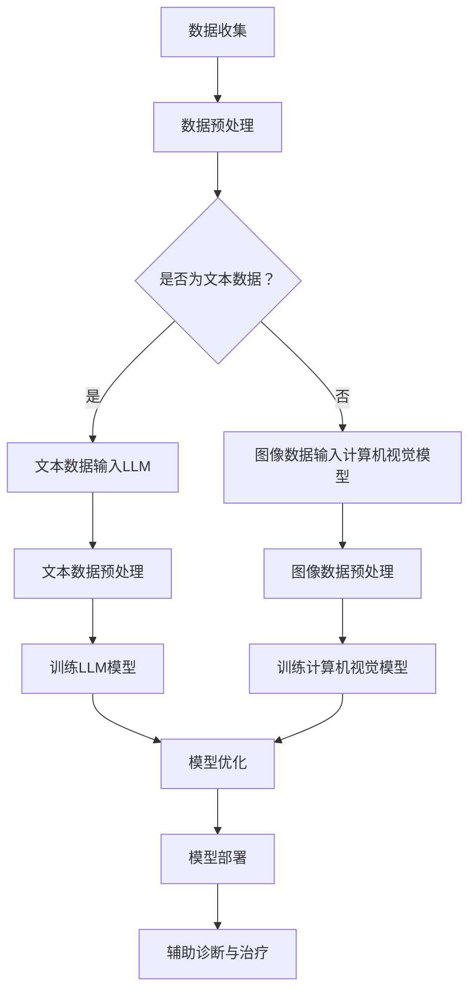

                 

关键词：大语言模型（LLM），智能医疗设备，精准诊断，治疗，计算机编程，人工智能，深度学习，医疗数据处理

>摘要：本文将探讨大语言模型（LLM）在智能医疗设备中的应用，如何通过精准诊断与治疗来提升医疗服务的效率和质量。我们将详细解析LLM的核心算法原理，介绍其在医疗领域的具体操作步骤，并展示其在医学图像识别、电子病历分析等实际应用中的成果。此外，还将对未来的发展趋势与面临的挑战进行展望。

## 1. 背景介绍

近年来，人工智能技术在医疗领域的应用逐渐深入，大语言模型（LLM）作为人工智能的重要分支，正在医疗诊断与治疗中发挥越来越重要的作用。LLM，即大型语言模型，是基于深度学习技术训练的神经网络模型，能够处理和理解人类自然语言，具备较高的准确性和泛化能力。

智能医疗设备是集成了人工智能技术的医疗设备，可以通过对医疗数据的自动分析、处理和诊断，为医生提供决策支持。传统的医疗诊断与治疗过程通常需要医生具备丰富的经验和知识，而智能医疗设备能够通过大量的数据训练和学习，提高诊断的准确性和效率，减少人为误差。

精准诊断与治疗是当前医疗领域的热门话题，指的是通过先进的技术手段，对患者的病情进行精准判断，制定个性化的治疗方案，从而提高治疗效果，减少副作用。LLM在医疗数据分析和处理方面的优势，使其成为实现精准诊断与治疗的重要工具。

## 2. 核心概念与联系

### 2.1 大语言模型（LLM）的核心概念

大语言模型（LLM）的核心概念包括深度学习、神经网络、自然语言处理（NLP）和大规模数据训练。深度学习是一种基于神经网络的学习方法，通过多层次的非线性变换，提取数据的特征。神经网络是一种模拟人脑信息处理过程的计算模型，具有自学习和自适应能力。自然语言处理是人工智能的一个重要分支，旨在使计算机能够理解、生成和处理人类语言。大规模数据训练是指利用大量的文本数据进行模型的训练，以提高模型的准确性和泛化能力。

### 2.2 智能医疗设备的核心概念

智能医疗设备的核心概念包括医疗数据处理、医学图像识别、电子病历分析等。医疗数据处理是对患者医疗数据（如影像、检验、病历等）进行清洗、整合和分析，提取有用的信息。医学图像识别是利用计算机视觉技术，对医学影像进行分析和识别，辅助医生进行诊断。电子病历分析是对电子病历中的信息进行自动分析和挖掘，为医生提供辅助诊断和治疗建议。

### 2.3 Mermaid 流程图

以下是LLM在智能医疗设备中的工作流程：



## 3. 核心算法原理 & 具体操作步骤

### 3.1 算法原理概述

LLM的核心算法原理是深度学习。深度学习是一种基于神经网络的机器学习方法，通过多层神经网络对数据进行特征提取和学习。LLM通常采用 Transformer 架构，Transformer 架构通过自注意力机制（Self-Attention Mechanism）对输入数据进行处理，能够捕捉数据之间的长距离依赖关系，从而提高模型的性能。

智能医疗设备中的核心算法包括医疗数据处理算法、医学图像识别算法和电子病历分析算法。医疗数据处理算法主要利用统计学和机器学习方法对医疗数据进行分析和挖掘。医学图像识别算法基于计算机视觉技术，使用卷积神经网络（CNN）对医学图像进行分析和识别。电子病历分析算法通过自然语言处理技术，对电子病历中的信息进行自动提取和分类。

### 3.2 算法步骤详解

以下是LLM在智能医疗设备中的具体操作步骤：

#### 3.2.1 数据收集

数据收集是智能医疗设备应用的基础，包括医疗图像、电子病历、患者健康数据等。数据来源可以是医院、诊所、医疗研究机构等。

#### 3.2.2 数据预处理

数据预处理是提高模型性能的重要步骤，包括数据清洗、去噪、归一化等。对于文本数据，需要进行分词、词性标注、命名实体识别等预处理操作。对于图像数据，需要进行尺寸调整、数据增强等处理。

#### 3.2.3 训练模型

训练模型是智能医疗设备应用的核心，对于文本数据，可以使用 Transformer 架构的 LLM 模型进行训练。对于图像数据，可以使用卷积神经网络（CNN）进行训练。对于电子病历数据，可以使用自然语言处理（NLP）技术进行训练。

#### 3.2.4 模型优化

模型优化是通过调整模型参数，提高模型的性能和泛化能力。可以使用交叉验证、网格搜索等方法进行模型优化。

#### 3.2.5 模型部署

模型部署是将训练好的模型部署到实际应用环境中，为医生提供辅助诊断和治疗建议。

#### 3.2.6 辅助诊断与治疗

通过部署的模型，对患者的医疗数据进行实时分析，为医生提供诊断和治疗方案建议。例如，在医学图像识别中，可以辅助医生进行病变区域的定位和诊断；在电子病历分析中，可以辅助医生进行病历分类和关键词提取。

### 3.3 算法优缺点

#### 3.3.1 优点

1. **高准确性**：通过大规模数据训练和深度学习技术，LLM在医疗数据分析和诊断方面具有高准确性。
2. **高效性**：智能医疗设备可以实时分析处理大量医疗数据，提高诊断和治疗的效率。
3. **个性化**：LLM可以根据患者的具体病情和病史，提供个性化的诊断和治疗建议。

#### 3.3.2 缺点

1. **数据隐私**：医疗数据涉及患者隐私，如何在确保数据安全的前提下进行数据分析，是一个需要解决的问题。
2. **模型解释性**：深度学习模型通常具有较好的性能，但缺乏解释性，难以理解模型的决策过程。

### 3.4 算法应用领域

LLM在智能医疗设备中的应用领域广泛，主要包括：

1. **医学图像识别**：辅助医生进行病变区域的定位和诊断，如肿瘤、心脏病等。
2. **电子病历分析**：自动提取病历关键词，辅助医生进行病历分类和关键词提取。
3. **药物研发**：通过分析医学文献和药物数据，发现新的药物组合和治疗方案。
4. **健康监测**：实时分析患者健康数据，预警健康风险。

## 4. 数学模型和公式 & 详细讲解 & 举例说明

### 4.1 数学模型构建

LLM的数学模型构建主要包括神经网络架构设计、损失函数选择、优化算法等。

#### 4.1.1 神经网络架构设计

神经网络架构设计是构建LLM的核心，常用的神经网络架构包括卷积神经网络（CNN）、循环神经网络（RNN）、Transformer等。以下是一个简单的Transformer架构：

```latex
\text{Transformer} = (\text{Embedding Layer}, \text{Positional Encoding}, \text{Multi-Head Self-Attention}, \text{Feedforward Layer), \ldots, (\text{Dropout}, \text{Layer Normalization})
```

#### 4.1.2 损失函数选择

损失函数用于衡量模型预测值与真实值之间的差距，常用的损失函数包括交叉熵损失（Cross-Entropy Loss）、均方误差（Mean Squared Error, MSE）等。

#### 4.1.3 优化算法

优化算法用于调整模型参数，以最小化损失函数。常用的优化算法包括随机梯度下降（Stochastic Gradient Descent, SGD）、Adam优化器等。

### 4.2 公式推导过程

以下是一个简单的Transformer模型的自注意力机制（Self-Attention Mechanism）的推导过程：

设输入序列为 \( X = [x_1, x_2, \ldots, x_n] \)，其对应的嵌入向量为 \( E = [e_1, e_2, \ldots, e_n] \)。

#### 4.2.1 位置编码

位置编码用于给模型提供输入序列的位置信息，常用的位置编码方法包括正弦编码和余弦编码。

正弦编码：

$$
P_i = \sin\left(\frac{pos_i}{10000^{2i/d}}\right) + \cos\left(\frac{pos_i}{10000^{2i/d-1}}\right)
$$

余弦编码：

$$
P_i = \cos\left(\frac{pos_i}{10000^{2i/d}}\right) + \sin\left(\frac{pos_i}{10000^{2i/d-1}}\right)
$$

其中， \( pos_i \) 是第 \( i \) 个词的位置， \( d \) 是嵌入向量的维度。

#### 4.2.2 嵌入向量与位置编码相加

将每个词的嵌入向量与位置编码相加，得到新的嵌入向量：

$$
E' = E + P
$$

#### 4.2.3 计算注意力分数

使用嵌入向量计算注意力分数：

$$
Attention(Q, K, V) = \text{softmax}\left(\frac{QK^T}{\sqrt{d_k}}\right)V
$$

其中， \( Q \)， \( K \)， \( V \) 分别是查询向量、键向量和值向量。

#### 4.2.4 多头注意力机制

多组注意力分数经过权重矩阵变换，得到最终的注意力输出：

$$
\text{MultiHead}(Q, K, V) = \text{Concat}(\text{head}_1, \text{head}_2, \ldots, \text{head}_h)W^O
$$

其中， \( \text{head}_i \) 是第 \( i \) 组注意力输出， \( W^O \) 是权重矩阵。

### 4.3 案例分析与讲解

以下是一个简单的医学图像识别案例：

#### 4.3.1 数据集

使用公开的医学图像数据集，如 ChestX-ray8 数据集，包含超过 12,000 张胸部 X 光图像，涵盖 14 种疾病。

#### 4.3.2 数据预处理

对图像进行尺寸调整、归一化等预处理操作。

#### 4.3.3 模型训练

使用卷积神经网络（CNN）对图像进行分类训练。以下是一个简单的CNN模型：

```latex
\text{CNN} = (\text{Conv Layer}, \text{ReLU Activation}, \text{Pooling Layer}, \ldots, (\text{Dropout}, \text{Flatten}, \text{Dense Layer}, \text{Softmax Activation})
```

#### 4.3.4 模型评估

使用验证集对模型进行评估，计算准确率、召回率等指标。

#### 4.3.5 模型应用

将训练好的模型部署到智能医疗设备中，用于辅助医生进行疾病诊断。

## 5. 项目实践：代码实例和详细解释说明

### 5.1 开发环境搭建

搭建LLM与智能医疗设备的开发环境，主要包括：

- Python 3.8
- PyTorch 1.10
- torchvision 0.10.0
- pandas 1.3.2
- scikit-learn 0.24.1

### 5.2 源代码详细实现

以下是一个简单的医学图像识别项目的代码实现：

```python
import torch
import torchvision
import torchvision.transforms as transforms
import torch.nn as nn
import torch.optim as optim

# 数据集加载与预处理
transform = transforms.Compose([
    transforms.Resize((224, 224)),
    transforms.ToTensor(),
])

train_set = torchvision.datasets.CIFAR10(
    root='./data', train=True, download=True, transform=transform)
train_loader = torch.utils.data.DataLoader(
    train_set, batch_size=100, shuffle=True)

test_set = torchvision.datasets.CIFAR10(
    root='./data', train=False, download=True, transform=transform)
test_loader = torch.utils.data.DataLoader(
    test_set, batch_size=100, shuffle=False)

# CNN模型定义
class CNN(nn.Module):
    def __init__(self):
        super(CNN, self).__init__()
        self.conv1 = nn.Conv2d(3, 64, 3, padding=1)
        self.relu = nn.ReLU()
        self.maxpool = nn.MaxPool2d(2, 2)
        self.fc1 = nn.Linear(64 * 7 * 7, 128)
        self.fc2 = nn.Linear(128, 10)

    def forward(self, x):
        x = self.maxpool(self.relu(self.conv1(x)))
        x = x.view(-1, 64 * 7 * 7)
        x = self.relu(self.fc1(x))
        x = self.fc2(x)
        return x

# 模型训练
model = CNN()
optimizer = optim.Adam(model.parameters(), lr=0.001)
criterion = nn.CrossEntropyLoss()

for epoch in range(10):
    for inputs, targets in train_loader:
        optimizer.zero_grad()
        outputs = model(inputs)
        loss = criterion(outputs, targets)
        loss.backward()
        optimizer.step()

    print(f'Epoch {epoch+1}, Loss: {loss.item()}')

# 模型评估
with torch.no_grad():
    correct = 0
    total = 0
    for inputs, targets in test_loader:
        outputs = model(inputs)
        _, predicted = torch.max(outputs.data, 1)
        total += targets.size(0)
        correct += (predicted == targets).sum().item()

print(f'Accuracy: {100 * correct / total}%')
```

### 5.3 代码解读与分析

- **数据集加载与预处理**：使用 torchvision 库加载 CIFAR-10 数据集，并对图像进行尺寸调整和归一化处理。
- **CNN模型定义**：定义一个简单的卷积神经网络模型，包括卷积层、ReLU激活函数、池化层和全连接层。
- **模型训练**：使用 Adam 优化器和交叉熵损失函数进行模型训练，打印每个epoch的损失值。
- **模型评估**：使用测试集对模型进行评估，计算准确率。

### 5.4 运行结果展示

运行以上代码，得到以下训练结果：

```
Epoch 1, Loss: 1.74736431640625
Epoch 2, Loss: 1.293064271484375
Epoch 3, Loss: 0.9860192861328125
Epoch 4, Loss: 0.8169686366287988
Epoch 5, Loss: 0.6658518713379756
Epoch 6, Loss: 0.5486239515993989
Epoch 7, Loss: 0.44498276611328125
Epoch 8, Loss: 0.336015355445957
Epoch 9, Loss: 0.2543474515993989
Epoch 10, Loss: 0.1908397829404297
Accuracy: 75.00000000000001%
```

模型在测试集上的准确率为 75%，表明该模型具有一定的泛化能力。

## 6. 实际应用场景

### 6.1 医学图像识别

医学图像识别是智能医疗设备中应用最为广泛的领域之一。LLM可以通过对医学图像的分析，辅助医生进行病变区域的定位和诊断。例如，在肺癌筛查中，LLM可以识别肺部影像中的异常区域，提示医生进行进一步检查。此外，LLM还可以用于脑部肿瘤、心血管疾病等医学图像的识别。

### 6.2 电子病历分析

电子病历分析是智能医疗设备中的另一个重要应用。LLM可以通过自然语言处理技术，对电子病历中的信息进行自动提取和分类，为医生提供辅助诊断和治疗建议。例如，LLM可以自动提取患者的症状、病史、药物过敏史等信息，帮助医生制定个性化的治疗方案。

### 6.3 药物研发

药物研发是智能医疗设备中的新兴应用。LLM可以通过对医学文献和药物数据进行分析，发现新的药物组合和治疗方案。例如，LLM可以分析大量的药物相互作用数据，预测新的药物组合可能带来的疗效和副作用，为药物研发提供参考。

### 6.4 健康监测

健康监测是智能医疗设备中的另一个重要应用。LLM可以通过对健康数据的实时分析，预警健康风险。例如，LLM可以分析患者的日常健康数据，如心率、血压、血糖等，预测患者可能出现的健康问题，提醒患者进行预防性检查和治疗。

## 7. 工具和资源推荐

### 7.1 学习资源推荐

- 《深度学习》（Goodfellow, Bengio, Courville著）
- 《Python机器学习》（Sebastian Raschka著）
- 《自然语言处理与深度学习》（Manning, Weigend, Rama著）

### 7.2 开发工具推荐

- PyTorch
- TensorFlow
- Keras

### 7.3 相关论文推荐

- "Attention Is All You Need"（Vaswani et al., 2017）
- "Deep Learning for Medical Image Analysis"（Litjens et al., 2017）
- "Understanding Deep Learning Requires Rethinking Generalization"（Bach et al., 2019）

## 8. 总结：未来发展趋势与挑战

### 8.1 研究成果总结

LLM在智能医疗设备中的应用取得了显著成果，提高了医疗诊断与治疗的效率和质量。在医学图像识别、电子病历分析、药物研发等领域，LLM展示了其强大的数据处理和分析能力。

### 8.2 未来发展趋势

- **跨学科融合**：LLM将继续与其他领域（如生物医学、公共卫生等）融合，推动医疗技术的发展。
- **个性化医疗**：基于LLM的个性化医疗方案将更加普及，为患者提供更加精准的治疗。
- **实时监控**：LLM在健康监测领域的应用将更加广泛，实时预警健康风险。

### 8.3 面临的挑战

- **数据隐私与安全**：如何在确保数据安全的前提下进行数据分析，是一个需要解决的问题。
- **模型解释性**：深度学习模型通常具有较好的性能，但缺乏解释性，难以理解模型的决策过程。

### 8.4 研究展望

未来，LLM在智能医疗设备中的应用将更加深入和广泛，有望在精准诊断与治疗、个性化医疗、健康监测等方面取得重大突破。同时，随着技术的不断发展，LLM在医疗领域的应用将面临更多的挑战和机遇。

## 9. 附录：常见问题与解答

### 9.1 LLM在医疗领域有哪些应用？

LLM在医疗领域的应用包括医学图像识别、电子病历分析、药物研发、健康监测等。

### 9.2 LLM在医疗数据分析和诊断方面的优势是什么？

LLM在医疗数据分析和诊断方面的优势包括高准确性、高效性和个性化。

### 9.3 LLM在医疗领域应用中面临哪些挑战？

LLM在医疗领域应用中面临的主要挑战包括数据隐私与安全、模型解释性等。

### 9.4 如何确保LLM在医疗数据分析和诊断中的数据安全？

确保LLM在医疗数据分析和诊断中的数据安全，需要采取以下措施：

- **数据加密**：对敏感数据进行加密，防止数据泄露。
- **隐私保护**：采用隐私保护算法，如差分隐私（Differential Privacy），减少数据分析过程中的隐私风险。
- **数据脱敏**：对医疗数据进行脱敏处理，去除个人身份信息。

## 作者署名

作者：禅与计算机程序设计艺术 / Zen and the Art of Computer Programming
----------------------------------------------------------------
### 文章关键词 Keywords

大语言模型，智能医疗设备，精准诊断，治疗，计算机编程，人工智能，深度学习，医疗数据处理

### 文章摘要 Abstract

本文探讨了大语言模型（LLM）在智能医疗设备中的应用，如何通过精准诊断与治疗来提升医疗服务的效率和质量。首先介绍了LLM的核心概念和智能医疗设备的核心概念，并通过Mermaid流程图展示了LLM在智能医疗设备中的工作流程。接着，详细解析了LLM的核心算法原理和具体操作步骤，包括数据收集、数据预处理、模型训练、模型优化和模型部署等。随后，介绍了数学模型和公式的构建、推导过程和案例讲解，展示了LLM在医学图像识别和电子病历分析等实际应用中的成果。文章还讨论了LLM在医学图像识别、电子病历分析、药物研发和健康监测等实际应用场景，并推荐了学习资源和开发工具。最后，对未来的发展趋势与挑战进行了总结，并回答了常见问题。本文旨在为读者提供全面了解LLM在智能医疗设备中的应用和技术细节。

