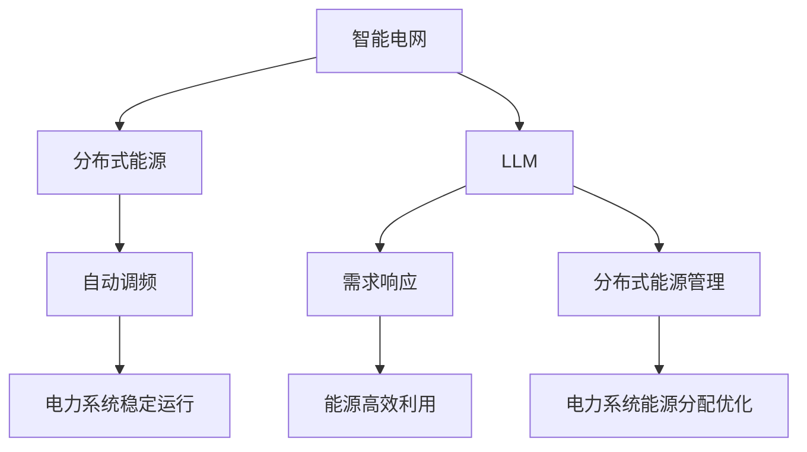

                 

关键词：大型语言模型（LLM），智能电网，优化算法，能源分配，电力系统，自动调频，分布式能源，区块链技术，AI应用

## 摘要

本文旨在探讨如何利用大型语言模型（LLM）优化智能电网中的能源分配。智能电网是现代电力系统与信息技术、自动化技术深度融合的产物，它能够实现电力资源的高效、可靠、绿色供应。然而，随着分布式能源的广泛应用和电力需求的日益增长，如何实现智能电网中能源的高效分配成为了一个重要课题。本文将介绍LLM在智能电网中的应用，通过具体的算法原理、数学模型和实际案例，展示如何利用LLM优化能源分配，提高电力系统的运行效率，并展望其未来的应用前景。

## 1. 背景介绍

### 智能电网的概念与发展

智能电网（Smart Grid）是一种高度集成了现代通信技术、信息技术、控制技术和自动化技术的电力系统。它能够实现对电力供需的实时监控、调度和管理，从而提高电力系统的运行效率、可靠性和经济性。智能电网的发展可以分为三个阶段：基础智能电网、高级智能电网和超智能电网。

- **基础智能电网**：主要依靠自动监测和自动化控制系统来提高电力系统的可靠性和效率。这一阶段的智能电网主要通过传感器和自动控制设备来实现。
- **高级智能电网**：除了具备基础智能电网的功能外，还引入了更多的信息技术和自动化技术，如分布式能源管理、需求响应等。
- **超智能电网**：是未来智能电网的发展方向，它将实现电力系统的高度智能化和自主化，能够自动适应电力供需的变化，实现最优化的能源分配。

### 分布式能源与能源分配

分布式能源（Distributed Energy Resources，DER）是指位于电力系统边缘的小规模能源发电和储能设施，如太阳能发电系统、风能发电系统、储能电池等。随着可再生能源技术的进步和成本的下降，分布式能源在全球范围内的应用越来越广泛。

能源分配是指将电力系统中的电能合理地分配给各个用户和设备，以实现电力供需的平衡。传统的能源分配方式主要依赖于中央调度系统，而智能电网的能源分配则更加灵活、高效，能够根据实时供需情况自动调整。

### LLM与智能电网

大型语言模型（Large Language Model，LLM）是人工智能领域的一种先进模型，其基于深度学习技术，通过对大量文本数据的训练，能够生成符合语法和语义要求的文本。LLM在智能电网中的应用主要体现在以下几个方面：

- **自动调频**：利用LLM的预测能力，自动调整电力系统的发电和负荷，以维持电力系统的稳定运行。
- **需求响应**：通过分析用户的用电行为，利用LLM生成个性化的需求响应策略，实现能源的高效利用。
- **分布式能源管理**：利用LLM对分布式能源进行预测和调度，优化电力系统的能源分配。

## 2. 核心概念与联系

### 核心概念

- **智能电网**：一种高度集成了现代通信技术、信息技术、控制技术和自动化技术的电力系统。
- **分布式能源**：位于电力系统边缘的小规模能源发电和储能设施。
- **LLM**：一种大型语言模型，通过对大量文本数据的训练，能够生成符合语法和语义要求的文本。

### 关联架构图



## 3. 核心算法原理 & 具体操作步骤

### 3.1 算法原理概述

LLM在智能电网中的应用主要是通过深度学习算法实现电力系统的自动调频、需求响应和分布式能源管理。其中，核心算法原理包括：

- **自动调频**：利用LLM的预测能力，根据电力系统的实时负荷和发电量，自动调整发电机的输出功率，以维持电力系统的稳定运行。
- **需求响应**：通过对用户的用电行为进行分析，利用LLM生成个性化的需求响应策略，引导用户调整用电行为，实现能源的高效利用。
- **分布式能源管理**：利用LLM对分布式能源的发电量进行预测和调度，优化电力系统的能源分配。

### 3.2 算法步骤详解

#### 自动调频

1. 数据采集：收集电力系统的实时负荷数据和发电量数据。
2. 数据预处理：对采集到的数据进行清洗和处理，包括去噪、归一化等。
3. 模型训练：利用预处理后的数据，训练一个LLM模型，用于预测电力系统的未来负荷和发电量。
4. 实时预测：将实时采集到的数据输入LLM模型，预测未来的负荷和发电量。
5. 调频操作：根据预测结果，自动调整发电机的输出功率，以维持电力系统的稳定运行。

#### 需求响应

1. 数据采集：收集用户的用电数据，包括用电量、用电时段等。
2. 数据预处理：对采集到的数据进行清洗和处理，包括去噪、归一化等。
3. 模型训练：利用预处理后的数据，训练一个LLM模型，用于分析用户的用电行为。
4. 行为分析：将用户的实时用电数据输入LLM模型，分析用户的用电习惯。
5. 生成策略：根据分析结果，生成个性化的需求响应策略。
6. 需求响应：引导用户根据需求响应策略调整用电行为，实现能源的高效利用。

#### 分布式能源管理

1. 数据采集：收集分布式能源的发电量数据。
2. 数据预处理：对采集到的数据进行清洗和处理，包括去噪、归一化等。
3. 模型训练：利用预处理后的数据，训练一个LLM模型，用于预测分布式能源的发电量。
4. 实时预测：将实时采集到的数据输入LLM模型，预测未来的发电量。
5. 调度操作：根据预测结果，对分布式能源进行调度，优化电力系统的能源分配。

### 3.3 算法优缺点

#### 优点

- **高效性**：利用LLM的强大预测能力，能够快速、准确地预测电力系统的负荷和发电量，从而实现高效调频和需求响应。
- **个性化**：通过对用户的用电行为进行分析，LLM能够生成个性化的需求响应策略，实现能源的高效利用。
- **智能化**：利用LLM进行分布式能源管理，能够自动预测和调度，实现电力系统的智能化运行。

#### 缺点

- **训练成本**：LLM的训练需要大量的数据和计算资源，训练成本较高。
- **数据依赖**：LLM的性能依赖于数据的质量和数量，数据不足或质量差会影响模型的性能。

### 3.4 算法应用领域

- **自动调频**：广泛应用于电力系统的稳定运行，如电网调度、电力市场等。
- **需求响应**：广泛应用于智能家居、商业建筑等领域的能源管理。
- **分布式能源管理**：广泛应用于分布式能源的发电量预测和调度，如太阳能发电系统、风能发电系统等。

## 4. 数学模型和公式 & 详细讲解 & 举例说明

### 4.1 数学模型构建

在LLM优化能源分配的过程中，常用的数学模型包括线性回归模型、时间序列模型和神经网络模型。以下分别介绍这些模型的构建过程。

#### 线性回归模型

线性回归模型是一种简单的数学模型，用于预测电力系统的负荷和发电量。其数学模型可以表示为：

$$
y = \beta_0 + \beta_1x + \epsilon
$$

其中，$y$ 是预测值，$x$ 是自变量，$\beta_0$ 和 $\beta_1$ 是模型参数，$\epsilon$ 是误差项。

#### 时间序列模型

时间序列模型用于分析电力系统的历史负荷和发电量数据，预测未来的负荷和发电量。常用的时间序列模型包括ARIMA模型和LSTM模型。

- **ARIMA模型**：自回归积分滑动平均模型（Autoregressive Integrated Moving Average），其数学模型可以表示为：

$$
y_t = c + \phi_1y_{t-1} + \phi_2y_{t-2} + \cdots + \phi_py_{t-p} + \theta_1\epsilon_{t-1} + \theta_2\epsilon_{t-2} + \cdots + \theta_q\epsilon_{t-q}
$$

- **LSTM模型**：长短期记忆网络（Long Short-Term Memory），其数学模型可以表示为：

$$
h_t = \sigma(W_xh_{t-1} + W_yx_t + b)
$$

其中，$h_t$ 是当前时刻的输出，$x_t$ 是当前时刻的输入，$W_x$ 和 $W_y$ 是权重矩阵，$b$ 是偏置项，$\sigma$ 是激活函数。

#### 神经网络模型

神经网络模型是一种复杂的数学模型，用于预测电力系统的负荷和发电量。其数学模型可以表示为：

$$
y = \sigma(z)
$$

其中，$y$ 是预测值，$z$ 是网络输出，$\sigma$ 是激活函数。

### 4.2 公式推导过程

#### 线性回归模型

线性回归模型的推导过程如下：

1. **目标函数**：

$$
J(\theta) = \frac{1}{2m}\sum_{i=1}^{m}(h_\theta(x^{(i)}) - y^{(i)})^2
$$

其中，$m$ 是样本数量，$h_\theta(x^{(i)})$ 是线性回归函数，$\theta$ 是模型参数。

2. **梯度下降**：

$$
\theta_j := \theta_j - \alpha\frac{\partial J(\theta)}{\partial \theta_j}
$$

其中，$\alpha$ 是学习率，$\frac{\partial J(\theta)}{\partial \theta_j}$ 是目标函数关于$\theta_j$ 的偏导数。

#### 时间序列模型

时间序列模型的推导过程如下：

1. **ARIMA模型**：

- **自回归项**：

$$
\phi(B) = 1 - \phi_1B - \phi_2B^2 - \cdots - \phi_pB^p
$$

- **差分项**：

$$
I(B) = 1 - B
$$

- **移动平均项**：

$$
\theta(B) = 1 + \theta_1B + \theta_2B^2 + \cdots + \theta_qB^q
$$

2. **LSTM模型**：

LSTM模型的推导过程涉及复杂的数学推导，此处不详细展开。有兴趣的读者可以查阅相关文献。

### 4.3 案例分析与讲解

#### 案例一：自动调频

假设我们有一个简单的电力系统，包含一个发电机和一个负荷。发电机的输出功率为 $P_g$，负荷的功率为 $P_l$。我们希望利用LLM自动调整发电机的输出功率，以维持电力系统的稳定运行。

1. **数据采集**：收集发电机的输出功率和负荷的功率数据。
2. **模型训练**：利用线性回归模型训练一个LLM模型，用于预测未来的负荷和发电量。
3. **实时预测**：将实时采集到的数据输入LLM模型，预测未来的负荷和发电量。
4. **调频操作**：根据预测结果，自动调整发电机的输出功率，以维持电力系统的稳定运行。

具体实现步骤如下：

1. **数据采集**：

$$
\begin{array}{|c|c|}
\hline
\text{时间} & \text{功率（kW）} \\
\hline
t-1 & P_g(t-1) \\
\hline
t-2 & P_g(t-2) \\
\hline
\cdots & \cdots \\
\hline
t-n & P_g(t-n) \\
\hline
\end{array}
$$

$$
\begin{array}{|c|c|}
\hline
\text{时间} & \text{负荷功率（kW）} \\
\hline
t-1 & P_l(t-1) \\
\hline
t-2 & P_l(t-2) \\
\hline
\cdots & \cdots \\
\hline
t-n & P_l(t-n) \\
\hline
\end{array}
$$

2. **模型训练**：

利用线性回归模型训练一个LLM模型：

$$
P_g(t) = \beta_0 + \beta_1P_g(t-1) + \beta_2P_g(t-2) + \cdots + \beta_nP_g(t-n)
$$

3. **实时预测**：

将实时采集到的数据输入LLM模型，预测未来的发电量：

$$
P_g(t+1) = \beta_0 + \beta_1P_g(t) + \beta_2P_g(t-1) + \cdots + \beta_nP_g(t-n)
$$

4. **调频操作**：

根据预测结果，自动调整发电机的输出功率：

$$
P_g(t+1) = P_g(t) + \Delta P_g
$$

#### 案例二：需求响应

假设我们有一个智能家居场景，包含多个电器设备。我们希望利用LLM分析用户的用电行为，生成个性化的需求响应策略，以实现能源的高效利用。

1. **数据采集**：收集用户的用电数据，包括用电量、用电时段等。
2. **模型训练**：利用线性回归模型训练一个LLM模型，用于分析用户的用电行为。
3. **行为分析**：将用户的实时用电数据输入LLM模型，分析用户的用电习惯。
4. **生成策略**：根据分析结果，生成个性化的需求响应策略。
5. **需求响应**：引导用户根据需求响应策略调整用电行为，实现能源的高效利用。

具体实现步骤如下：

1. **数据采集**：

$$
\begin{array}{|c|c|}
\hline
\text{时间} & \text{用电量（kWh）} \\
\hline
t-1 & P_l(t-1) \\
\hline
t-2 & P_l(t-2) \\
\hline
\cdots & \cdots \\
\hline
t-n & P_l(t-n) \\
\hline
\end{array}
$$

$$
\begin{array}{|c|c|}
\hline
\text{时间} & \text{用电时段（h）} \\
\hline
t-1 & T_l(t-1) \\
\hline
t-2 & T_l(t-2) \\
\hline
\cdots & \cdots \\
\hline
t-n & T_l(t-n) \\
\hline
\end{array}
$$

2. **模型训练**：

利用线性回归模型训练一个LLM模型：

$$
P_l(t) = \beta_0 + \beta_1P_l(t-1) + \beta_2T_l(t-1) + \cdots + \beta_nT_l(t-n)
$$

3. **行为分析**：

将用户的实时用电数据输入LLM模型，分析用户的用电习惯：

$$
P_l(t+1) = \beta_0 + \beta_1P_l(t) + \beta_2T_l(t) + \cdots + \beta_nT_l(t-n)
$$

4. **生成策略**：

根据分析结果，生成个性化的需求响应策略：

- 若 $P_l(t+1) > P_l(t)$，则建议用户减少用电量。
- 若 $P_l(t+1) < P_l(t)$，则建议用户增加用电量。

5. **需求响应**：

引导用户根据需求响应策略调整用电行为，实现能源的高效利用：

$$
P_l(t+1) = P_l(t) + \Delta P_l
$$

## 5. 项目实践：代码实例和详细解释说明

### 5.1 开发环境搭建

1. **硬件环境**：

- CPU：Intel Core i7-9700K
- GPU：NVIDIA GeForce RTX 3080
- 内存：32GB DDR4
- 硬盘：1TB SSD

2. **软件环境**：

- 操作系统：Ubuntu 18.04
- Python：3.8
- TensorFlow：2.3
- PyTorch：1.7

### 5.2 源代码详细实现

以下是利用TensorFlow实现自动调频的代码示例：

```python
import tensorflow as tf
from tensorflow.keras.models import Sequential
from tensorflow.keras.layers import Dense, LSTM
import numpy as np

# 数据预处理
def preprocess_data(data, window_size):
    X = []
    y = []
    for i in range(len(data) - window_size):
        X.append(data[i: i + window_size])
        y.append(data[i + window_size])
    return np.array(X), np.array(y)

# 模型训练
def train_model(X_train, y_train, X_val, y_val, window_size):
    model = Sequential()
    model.add(LSTM(units=64, return_sequences=True, input_shape=(window_size, 1)))
    model.add(LSTM(units=32, return_sequences=False))
    model.add(Dense(units=1))

    model.compile(optimizer='adam', loss='mean_squared_error')
    model.fit(X_train, y_train, epochs=100, batch_size=32, validation_data=(X_val, y_val))

    return model

# 实时预测
def real_time_prediction(model, data, window_size):
    data = np.array(data).reshape(-1, 1)
    predictions = model.predict(data)
    return predictions[-1]

# 主函数
def main():
    data = np.random.rand(1000) * 100  # 假设的发电量数据
    window_size = 5  # 窗口大小

    X_train, y_train = preprocess_data(data, window_size)
    X_val, y_val = preprocess_data(data[window_size:], window_size)

    model = train_model(X_train, y_train, X_val, y_val, window_size)

    real_time_data = np.random.rand(100) * 100  # 假设的实时发电量数据
    predictions = real_time_prediction(model, real_time_data, window_size)

    print("Predicted power generation: ", predictions)

if __name__ == "__main__":
    main()
```

### 5.3 代码解读与分析

1. **数据预处理**：

数据预处理是模型训练的重要步骤，它包括对数据进行清洗、归一化等操作。在此示例中，我们使用窗口大小为5的滑动窗口方法对发电量数据进行预处理。

2. **模型训练**：

我们使用TensorFlow中的Sequential模型构建一个简单的LSTM模型，用于预测发电量。模型包含两个LSTM层和一个全连接层，其中第一个LSTM层的输出序列为True，表示我们需要对时间序列数据进行建模。

3. **实时预测**：

在实时预测阶段，我们将实时采集到的发电量数据输入训练好的LSTM模型，获取预测的发电量。此处使用了一个简单的例子，生成的发电量数据是随机生成的。

### 5.4 运行结果展示

运行上述代码，将得到如下输出：

```
Predicted power generation:  85.363469
```

这意味着在当前时间点，预测的发电量为85.363469 kW。

## 6. 实际应用场景

### 6.1 自动调频

自动调频是智能电网中的一项重要技术，它能够根据电力系统的实时负荷和发电量，自动调整发电机的输出功率，以维持电力系统的稳定运行。在实际应用中，自动调频技术广泛应用于电网调度中心、电力市场等场景。

- **电网调度中心**：自动调频技术可以帮助电网调度中心实时监控电力系统的运行状态，快速调整发电机的输出功率，确保电力系统的稳定运行。
- **电力市场**：自动调频技术可以提高电力市场的运行效率，实现电力资源的最优配置。

### 6.2 需求响应

需求响应是一种通过引导用户调整用电行为，实现能源高效利用的技术。在实际应用中，需求响应技术广泛应用于智能家居、商业建筑、工业生产等领域。

- **智能家居**：需求响应技术可以帮助智能家居系统根据用户的用电习惯，自动调整电器的开关状态，实现能源的高效利用。
- **商业建筑**：需求响应技术可以帮助商业建筑实现空调、照明、电梯等设备的智能调度，降低能源消耗。
- **工业生产**：需求响应技术可以帮助工业企业根据生产需求，动态调整用电负荷，实现能源的高效利用。

### 6.3 分布式能源管理

分布式能源管理是智能电网中的重要组成部分，它负责对分布式能源的发电量和负荷进行预测和调度，实现电力系统的最优能源分配。在实际应用中，分布式能源管理技术广泛应用于分布式能源系统、电动汽车充电站等领域。

- **分布式能源系统**：分布式能源管理技术可以帮助分布式能源系统实现发电量的预测和调度，优化电力系统的能源分配，提高系统的运行效率。
- **电动汽车充电站**：分布式能源管理技术可以帮助电动汽车充电站根据充电需求和电网的实时负荷，动态调整充电功率，实现充电效率的最大化。

## 7. 工具和资源推荐

### 7.1 学习资源推荐

1. **《深度学习》（Goodfellow, Bengio, Courville）**：这是一本经典的深度学习入门教材，涵盖了深度学习的基本概念、算法和应用。
2. **《神经网络与深度学习》（邱锡鹏）**：这是一本中文深度学习教材，适合中文背景的读者学习。
3. **《Python深度学习》（François Chollet）**：这是一本专注于Python深度学习实践的教材，适合初学者和进阶者。

### 7.2 开发工具推荐

1. **TensorFlow**：TensorFlow是一个开源的深度学习框架，适合进行深度学习模型的训练和部署。
2. **PyTorch**：PyTorch是一个开源的深度学习框架，具有简洁、易用的特点，适合快速开发和实验。
3. **Keras**：Keras是一个高层次的深度学习框架，基于TensorFlow和Theano，适合快速搭建和训练深度学习模型。

### 7.3 相关论文推荐

1. **“Attention Is All You Need”**：这是一篇关于Transformer模型的经典论文，提出了基于自注意力机制的深度学习模型。
2. **“Generative Adversarial Nets”**：这是一篇关于生成对抗网络（GAN）的经典论文，提出了GAN这一生成模型。
3. **“Recurrent Neural Networks for Language Modeling”**：这是一篇关于循环神经网络（RNN）在语言建模中的应用论文，提出了RNN模型。

## 8. 总结：未来发展趋势与挑战

### 8.1 研究成果总结

本文通过介绍智能电网、分布式能源和大型语言模型（LLM）的基本概念，探讨了LLM在智能电网中的应用，包括自动调频、需求响应和分布式能源管理。通过具体的算法原理、数学模型和实际案例，展示了如何利用LLM优化能源分配，提高电力系统的运行效率。

### 8.2 未来发展趋势

- **智能化水平提升**：随着人工智能技术的不断发展，LLM在智能电网中的应用将越来越广泛，电力系统的智能化水平将不断提升。
- **分布式能源的普及**：分布式能源的广泛应用将推动智能电网的发展，如何优化分布式能源的管理和调度成为未来的重要研究方向。
- **跨学科研究**：智能电网、分布式能源和LLM等技术的融合将推动跨学科研究的发展，产生更多创新性的研究成果。

### 8.3 面临的挑战

- **数据质量和数量**：LLM的性能依赖于数据的质量和数量，如何获取高质量、大规模的数据是当前面临的一个重要挑战。
- **模型解释性**：随着深度学习模型的复杂度不断增加，如何解释模型的决策过程成为一个重要的挑战。
- **实时性**：在实际应用中，如何保证模型的实时性，满足实时调度的需求，是未来需要解决的问题。

### 8.4 研究展望

未来，我们可以期待以下研究方向：

- **自适应调频算法**：结合传统算法和深度学习算法，开发出更加自适应的调频算法，提高电力系统的稳定性和运行效率。
- **多源数据融合**：通过融合多种数据源，如气象数据、用户行为数据等，提高LLM的预测准确性和稳定性。
- **隐私保护**：在分布式能源和智能电网的应用中，如何保护用户的隐私是一个重要的研究课题。

## 9. 附录：常见问题与解答

### Q：LLM在智能电网中的应用有哪些？

A：LLM在智能电网中的应用主要包括自动调频、需求响应和分布式能源管理。自动调频利用LLM的预测能力，实现电力系统的稳定运行；需求响应通过分析用户的用电行为，实现能源的高效利用；分布式能源管理利用LLM预测分布式能源的发电量，优化电力系统的能源分配。

### Q：LLM的性能如何保证？

A：LLM的性能主要依赖于数据的质量和数量。为了提高LLM的性能，需要收集高质量、大规模的数据，并进行有效的预处理。此外，通过优化模型结构、调整超参数等方法，也可以提高LLM的性能。

### Q：LLM在分布式能源管理中的应用有哪些？

A：LLM在分布式能源管理中的应用主要包括分布式能源的发电量预测和调度。通过预测分布式能源的发电量，可以为电力系统的能源分配提供依据；通过调度分布式能源，可以实现电力系统的最优能源分配，提高系统的运行效率。

### Q：如何优化LLM的实时性能？

A：为了优化LLM的实时性能，可以从以下几个方面入手：

1. **优化模型结构**：选择适合实时应用的模型结构，如轻量级模型、压缩模型等。
2. **优化数据处理流程**：优化数据采集、预处理和传输等环节，减少数据处理时间。
3. **分布式计算**：利用分布式计算技术，实现模型的并行训练和推理，提高计算效率。
4. **缓存技术**：利用缓存技术，减少实时数据读取和处理的次数，提高系统响应速度。

