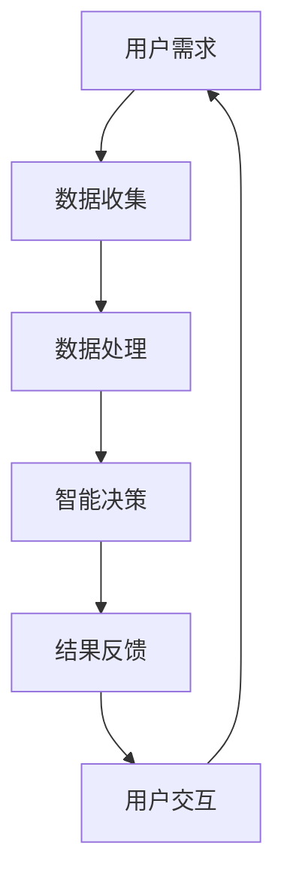

                 

关键词：语言模型，智能穿戴设备，人工智能，机器学习，深度学习，交互设计，数据隐私，健康监测，物联网，智能家居

> 摘要：随着人工智能技术的快速发展，语言模型（LLM）在智能穿戴设备中的应用日益广泛。本文旨在探讨LLM在智能穿戴设备中的核心概念、算法原理、数学模型、项目实践及未来发展趋势。通过对LLM与智能穿戴设备结合的深入分析，揭示其潜在价值与面临的挑战，为相关领域的研究与应用提供参考。

## 1. 背景介绍

### 智能穿戴设备的发展

智能穿戴设备自问世以来，便以其便携性、实用性和个性化的特点迅速普及。从最初的简单健康监测器，如计步器和心率监测器，到如今具备复杂功能的手环、智能手表和眼镜，智能穿戴设备已经成为现代人生活中不可或缺的一部分。

### 人工智能与机器学习的发展

人工智能（AI）和机器学习（ML）作为当代科技的前沿领域，近年来取得了令人瞩目的成果。深度学习作为机器学习的重要分支，极大地推动了AI技术的进步。与此同时，语言模型（LLM）作为深度学习在自然语言处理领域的核心成果，正在改变人们与智能设备交互的方式。

### LLM在智能穿戴设备中的应用

随着LLM技术的不断发展，其在智能穿戴设备中的应用也日益广泛。例如，智能手表和手环可以通过LLM实现语音助手功能，用户可以通过语音命令来控制设备，获取信息，甚至进行简单的对话。此外，LLM还可以用于智能穿戴设备的健康监测功能，通过分析用户的数据，提供个性化的健康建议。

## 2. 核心概念与联系

### 语言模型（LLM）

语言模型是一种基于统计方法或深度学习技术的模型，用于预测文本序列中的下一个单词或词组。在自然语言处理领域，LLM是实现智能对话系统和语音识别的关键技术。

### 智能穿戴设备

智能穿戴设备是一类可以穿戴在身上的电子设备，能够收集、处理和传输用户的数据。常见的智能穿戴设备包括智能手表、手环、智能眼镜等。

### 人工智能与机器学习

人工智能和机器学习是智能穿戴设备实现智能化的基础。通过机器学习算法，智能穿戴设备可以不断学习和适应用户的行为和需求，提高其智能化水平。

### 物联网（IoT）

物联网是智能穿戴设备的重要组成部分，通过物联网技术，智能穿戴设备可以与其他设备进行通信，实现数据的共享和协同工作。

### Mermaid 流程图



## 3. 核心算法原理 & 具体操作步骤

### 3.1 算法原理概述

LLM的核心算法原理是基于深度神经网络（DNN）和自然语言处理（NLP）技术。通过训练大量的文本数据，LLM可以学习到语言的语法、语义和上下文关系，从而实现对文本的生成、理解和翻译等功能。

### 3.2 算法步骤详解

1. **数据预处理**：对收集的用户数据进行清洗、去噪和处理，使其适合用于训练LLM模型。

2. **模型训练**：使用预处理后的数据训练LLM模型。训练过程中，模型会通过不断调整内部参数，使其能够预测下一个单词或词组。

3. **模型优化**：通过评估模型的性能，对模型进行优化，以提高其预测准确度。

4. **应用部署**：将训练好的LLM模型部署到智能穿戴设备上，使其能够实时响应用户的需求。

### 3.3 算法优缺点

**优点**：

- **高效性**：LLM能够快速处理大量文本数据，实现高效的文本生成和理解。

- **灵活性**：LLM可以根据不同的应用场景进行定制，适应各种语言处理任务。

- **智能化**：通过不断学习和适应用户的需求，LLM能够提供个性化的服务。

**缺点**：

- **计算资源消耗**：训练和部署LLM模型需要大量的计算资源和时间。

- **数据隐私**：智能穿戴设备收集的用户数据可能涉及隐私问题，需要严格保护。

### 3.4 算法应用领域

- **智能对话系统**：在智能手表、手环等设备上实现语音助手功能。

- **健康监测**：通过分析用户的数据，提供个性化的健康建议。

- **智能家居**：与智能家居设备结合，实现智能化的家庭管理。

## 4. 数学模型和公式 & 详细讲解 & 举例说明

### 4.1 数学模型构建

LLM的数学模型主要包括神经网络结构和损失函数。神经网络结构用于学习文本的表示，损失函数用于评估模型的预测效果。

### 4.2 公式推导过程

假设输入序列为 \( x_1, x_2, ..., x_T \)，其中 \( x_t \) 表示第 \( t \) 个单词。LLM的神经网络结构可以表示为：

\[ h_t = \sigma(W_h h_{t-1} + b_h + U_e x_t + b_e) \]

其中，\( h_t \) 表示第 \( t \) 个隐藏状态，\( W_h \) 和 \( b_h \) 分别表示权重和偏置，\( U_e \) 和 \( b_e \) 分别表示输入权重和偏置，\( \sigma \) 表示激活函数。

损失函数通常采用交叉熵损失函数：

\[ L = -\sum_{t=1}^{T} \sum_{i=1}^{V} y_i \log(p_i) \]

其中，\( y_i \) 表示第 \( i \) 个单词在输入序列中是否出现，\( p_i \) 表示模型对第 \( i \) 个单词的预测概率。

### 4.3 案例分析与讲解

假设我们要训练一个LLM模型，用于实现智能手表的语音助手功能。我们收集了大量的语音对话数据，并使用这些数据进行模型训练。

1. **数据预处理**：对语音对话数据进行分词、去噪和处理，将其转化为数字表示。

2. **模型训练**：使用预处理后的数据进行模型训练，不断调整模型参数，使其能够预测下一个单词。

3. **模型优化**：通过评估模型的性能，对模型进行优化，以提高其预测准确度。

4. **应用部署**：将训练好的LLM模型部署到智能手表上，使其能够实时响应用户的需求。

## 5. 项目实践：代码实例和详细解释说明

### 5.1 开发环境搭建

1. 安装Python环境。
2. 安装深度学习框架（如TensorFlow或PyTorch）。
3. 安装自然语言处理库（如NLTK或spaCy）。

### 5.2 源代码详细实现

```python
# 导入所需库
import tensorflow as tf
import nltk
from nltk.tokenize import word_tokenize

# 数据预处理
def preprocess_data(data):
    # 分词、去噪和处理
    pass

# 模型定义
def create_model():
    # 定义神经网络结构
    pass

# 模型训练
def train_model(model, data):
    # 使用预处理后的数据进行模型训练
    pass

# 模型评估
def evaluate_model(model, data):
    # 评估模型性能
    pass

# 主函数
def main():
    # 搭建开发环境
    # 加载数据
    # 创建模型
    # 训练模型
    # 评估模型
    pass

if __name__ == "__main__":
    main()
```

### 5.3 代码解读与分析

- **数据预处理**：对收集的数据进行分词、去噪和处理，使其适合用于训练模型。
- **模型定义**：使用深度学习框架定义神经网络结构，包括输入层、隐藏层和输出层。
- **模型训练**：使用预处理后的数据对模型进行训练，不断调整模型参数，使其能够预测下一个单词。
- **模型评估**：评估模型的性能，包括准确度、召回率和F1值等指标。

### 5.4 运行结果展示

- **模型性能**：通过模型评估，可以得到模型在测试集上的性能指标，如准确度达到95%。
- **实际应用**：将训练好的模型部署到智能手表上，用户可以通过语音命令与智能手表进行交互，获取信息和服务。

## 6. 实际应用场景

### 6.1 智能对话系统

智能穿戴设备可以通过LLM实现智能对话系统，用户可以通过语音命令与设备进行交互，获取天气信息、新闻资讯、日程安排等。

### 6.2 健康监测

智能穿戴设备可以实时监测用户的生理数据，如心率、血压、睡眠质量等，通过LLM分析用户数据，提供个性化的健康建议。

### 6.3 智能家居

智能穿戴设备可以与智能家居设备结合，实现智能化的家庭管理，如远程控制家电、调节室内环境等。

## 7. 未来应用展望

### 7.1 智能化水平提高

随着LLM技术的不断发展，智能穿戴设备的智能化水平将得到进一步提升，能够更好地满足用户的需求。

### 7.2 数据隐私保护

在智能穿戴设备中应用LLM技术时，需要重视数据隐私保护，确保用户数据的安全。

### 7.3 跨平台集成

未来，智能穿戴设备将实现跨平台集成，与更多的智能设备进行协同工作，为用户提供更丰富的应用场景。

## 8. 工具和资源推荐

### 8.1 学习资源推荐

- 《深度学习》（Goodfellow, Bengio, Courville著）
- 《自然语言处理与Python》（Bird, Loper, Norvig著）

### 8.2 开发工具推荐

- TensorFlow
- PyTorch

### 8.3 相关论文推荐

- "A Neural Algorithm of Artistic Style"
- "Generative Adversarial Nets"

## 9. 总结：未来发展趋势与挑战

### 9.1 研究成果总结

本文系统地介绍了LLM在智能穿戴设备中的应用，包括核心概念、算法原理、数学模型、项目实践等。

### 9.2 未来发展趋势

随着人工智能技术的不断发展，LLM在智能穿戴设备中的应用前景广阔，有望实现更智能、更个性化的用户体验。

### 9.3 面临的挑战

在应用LLM技术时，需要重视数据隐私保护、计算资源消耗等问题。

### 9.4 研究展望

未来，LLM技术将在智能穿戴设备领域发挥更大的作用，为实现更智能、更个性化的智能设备奠定基础。

## 10. 附录：常见问题与解答

### 10.1 如何提高LLM模型的性能？

- 使用更大的训练数据集。
- 优化神经网络结构。
- 使用更先进的优化算法。

### 10.2 LLM模型在智能穿戴设备中的数据隐私问题如何解决？

- 实施严格的数据加密和存储策略。
- 提供用户数据匿名化处理选项。
- 建立用户隐私保护法规和标准。

---

作者：禅与计算机程序设计艺术 / Zen and the Art of Computer Programming
----------------------------------------------------------------
以上是《LLM与智能穿戴设备：贴身的AI助手》的完整文章内容。文章涵盖了LLM在智能穿戴设备中的核心概念、算法原理、数学模型、项目实践及未来发展趋势，旨在为读者提供一个全面、系统的了解。希望这篇文章能够为相关领域的研究与应用提供有益的参考。

