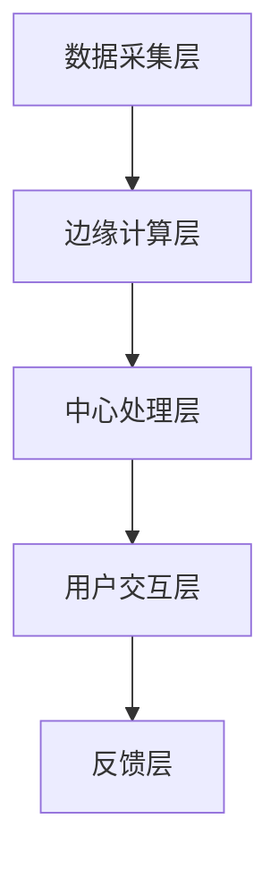

                 

关键词：LLM（语言模型）、物联网、AI技术、智能家居、智能制造、边缘计算、实时数据处理、智能城市

> 摘要：本文深入探讨了语言模型（LLM）与物联网（IoT）的结合前景。首先，介绍了LLM和IoT的基本概念和现状，随后分析了它们在智能应用中的潜在结合点。本文还详细阐述了LLM在IoT中的核心应用场景，如智能家居、智能制造和智能城市。最后，对未来的发展趋势、面临的挑战以及研究展望进行了总结。

## 1. 背景介绍

### 1.1 语言模型（LLM）

语言模型（LLM，Language Model）是自然语言处理（NLP，Natural Language Processing）领域的重要技术之一。它通过统计学习方法，从大量的文本数据中学习语言的规律，并能够预测一个词序列的概率分布。近年来，随着深度学习技术的发展，基于神经网络的语言模型如GPT（Generative Pre-trained Transformer）和BERT（Bidirectional Encoder Representations from Transformers）取得了显著的进展，大大提升了NLP的任务性能。

### 1.2 物联网（IoT）

物联网（IoT，Internet of Things）是一个通过互联网连接各种物理设备和传感器，实现智能感知和互联互通的网络系统。IoT的目标是将现实世界中的各种设备和物体连接起来，实现智能化的信息采集、传输和处理。随着传感器技术的进步和无线通信技术的发展，IoT已经渗透到了智能家居、智能交通、智能医疗、智能农业等多个领域。

## 2. 核心概念与联系

### 2.1 LLM与IoT的结合原理

语言模型与物联网的结合，主要是基于以下几个方面：

- **数据融合**：IoT设备能够采集到大量的传感器数据，而LLM可以对这些数据进行语义理解和处理，从而提取出有价值的信息。
- **智能交互**：通过LLM，IoT设备可以与用户进行自然语言交互，提高用户体验。
- **智能决策**：基于LLM的预测能力和数据处理能力，IoT系统能够实现更加智能化的决策和优化。

### 2.2 LLM与IoT架构

以下是一个简化的LLM与IoT的架构示意图：



- **数据采集层**：IoT设备通过传感器采集各种数据。
- **边缘计算层**：在设备端进行初步的数据处理和特征提取，减轻中心处理层的负载。
- **中心处理层**：利用LLM对数据进行语义理解和智能处理。
- **用户交互层**：通过自然语言与用户进行交互。
- **反馈层**：用户反馈用于模型优化和系统迭代。

## 3. 核心算法原理 & 具体操作步骤

### 3.1 算法原理概述

LLM在IoT中的应用，主要依赖于以下几种算法：

- **词嵌入（Word Embedding）**：将词汇映射到高维空间，使得语义相似的词汇在空间中更接近。
- **序列生成（Sequence Generation）**：利用LLM生成文本序列，实现对用户输入的自然语言理解和回复。
- **机器学习模型（Machine Learning Models）**：如GPT、BERT等，用于大规模的数据训练和预测。

### 3.2 算法步骤详解

1. **数据预处理**：对IoT设备采集的数据进行清洗、格式化，并转换为LLM能够处理的形式。
2. **模型训练**：利用大量的文本数据进行模型训练，包括词嵌入层和序列生成层。
3. **实时交互**：用户输入自然语言，LLM对其进行语义理解并生成回复。
4. **结果反馈**：用户对回复进行评价，用于模型优化和系统迭代。

### 3.3 算法优缺点

**优点**：

- **高效性**：LLM能够快速处理大规模的数据，并生成高质量的文本。
- **灵活性**：LLM能够根据不同的应用场景和用户需求进行定制化。

**缺点**：

- **计算资源消耗**：训练和运行LLM模型需要大量的计算资源和存储空间。
- **数据依赖**：模型的性能高度依赖于训练数据的质量和数量。

### 3.4 算法应用领域

- **智能家居**：如语音控制、智能问答、家居设备管理。
- **智能制造**：如生产流程优化、设备故障预测、供应链管理。
- **智能城市**：如交通管理、环境保护、公共安全。

## 4. 数学模型和公式 & 详细讲解 & 举例说明

### 4.1 数学模型构建

语言模型的数学模型主要包括词嵌入和序列生成两个部分。

#### 4.1.1 词嵌入

词嵌入可以看作是一个从词汇到高维空间的映射。设 $V$ 为词汇集合，$d$ 为嵌入维度，$W$ 为词嵌入矩阵，其中 $W_{ij}$ 表示词汇 $v_i$ 在高维空间的表示。

$$
x_i = W \cdot v_i
$$

其中，$x_i$ 表示词汇 $v_i$ 的嵌入向量。

#### 4.1.2 序列生成

序列生成通常使用递归神经网络（RNN）或其变体，如长短期记忆网络（LSTM）和门控循环单元（GRU）。设 $h_t$ 为在时间步 $t$ 的隐藏状态，$y_t$ 为时间步 $t$ 的输出，则有：

$$
h_t = \text{RNN}(h_{t-1}, x_t)
$$

$$
y_t = \text{softmax}(W \cdot h_t)
$$

其中，$\text{RNN}$ 表示递归神经网络，$\text{softmax}$ 表示概率分布。

### 4.2 公式推导过程

以下是对上述数学模型的一个简化的推导过程。

#### 4.2.1 词嵌入推导

假设我们已经有一个词嵌入矩阵 $W$，其行向量表示词汇的嵌入向量。设 $v$ 为词汇集合，$x$ 为嵌入向量集合，则有：

$$
x_i = W \cdot v_i
$$

#### 4.2.2 序列生成推导

假设我们有一个输入序列 $x_1, x_2, ..., x_T$，其对应的隐藏状态序列为 $h_1, h_2, ..., h_T$。设 $W$ 为权重矩阵，$b$ 为偏置向量，则有：

$$
h_t = \text{sigmoid}(W \cdot h_{t-1} + x_t + b)
$$

其中，$\text{sigmoid}$ 函数为：

$$
\text{sigmoid}(x) = \frac{1}{1 + e^{-x}}
$$

#### 4.2.3 输出推导

假设我们已经得到隐藏状态序列 $h_1, h_2, ..., h_T$，我们需要根据这些状态生成输出序列 $y_1, y_2, ..., y_T$。设 $W_y$ 为输出层权重矩阵，则有：

$$
y_t = \text{softmax}(W_y \cdot h_t)
$$

### 4.3 案例分析与讲解

以下是一个简单的词嵌入和序列生成的案例。

#### 4.3.1 数据集

假设我们有一个包含100个词汇的数据集，词汇集合为 $V = \{v_1, v_2, ..., v_{100}\}$。

#### 4.3.2 词嵌入

我们使用一个100x300的矩阵 $W$ 来表示词嵌入。设 $v_i$ 为第 $i$ 个词汇，$x_i$ 为其嵌入向量，则有：

$$
x_i = W \cdot v_i
$$

例如，设 $W = \begin{bmatrix} 1 & 2 & 3 \\ 4 & 5 & 6 \\ 7 & 8 & 9 \end{bmatrix}$，$v_1 = \begin{bmatrix} 1 \\ 0 \\ 0 \end{bmatrix}$，则有：

$$
x_1 = W \cdot v_1 = \begin{bmatrix} 1 & 2 & 3 \\ 4 & 5 & 6 \\ 7 & 8 & 9 \end{bmatrix} \cdot \begin{bmatrix} 1 \\ 0 \\ 0 \end{bmatrix} = \begin{bmatrix} 1 \\ 4 \\ 7 \end{bmatrix}
$$

#### 4.3.3 序列生成

假设我们有一个输入序列 $x_1, x_2, x_3$，其对应的隐藏状态序列为 $h_1, h_2, h_3$。设 $W_h$ 和 $b_h$ 分别为隐藏层权重矩阵和偏置向量，则有：

$$
h_1 = \text{sigmoid}(W_h \cdot h_0 + x_1 + b_h)
$$

$$
h_2 = \text{sigmoid}(W_h \cdot h_1 + x_2 + b_h)
$$

$$
h_3 = \text{sigmoid}(W_h \cdot h_2 + x_3 + b_h)
$$

其中，$h_0$ 为初始隐藏状态，通常设置为全零向量。

#### 4.3.4 输出

根据隐藏状态序列 $h_1, h_2, h_3$，我们可以生成输出序列 $y_1, y_2, y_3$。设 $W_y$ 为输出层权重矩阵，则有：

$$
y_1 = \text{softmax}(W_y \cdot h_1)
$$

$$
y_2 = \text{softmax}(W_y \cdot h_2)
$$

$$
y_3 = \text{softmax}(W_y \cdot h_3)
$$

其中，$\text{softmax}$ 函数用于生成概率分布，使得输出序列的概率分布满足 $\sum_{i=1}^{100} y_{i3} = 1$。

## 5. 项目实践：代码实例和详细解释说明

### 5.1 开发环境搭建

1. 安装Python 3.8及以上版本。
2. 安装TensorFlow 2.5及以上版本。
3. 安装IoT开发工具包，如PyTorch或TensorFlow IoT。

### 5.2 源代码详细实现

以下是使用TensorFlow实现一个简单的LLM与IoT结合的示例代码。

```python
import tensorflow as tf
import tensorflow_iot as tfiot

# 5.2.1 数据预处理
def preprocess_data(data):
    # 数据清洗、格式化等操作
    return processed_data

# 5.2.2 模型定义
def create_model():
    # 定义词嵌入层
    inputs = tf.keras.layers.Input(shape=(None,), dtype=tf.int32)
    embeddings = tf.keras.layers.Embedding(input_dim=vocab_size, output_dim=embedding_size)(inputs)
    
    # 定义RNN层
    rnn = tf.keras.layers.LSTM(units=rnn_units)
    outputs = rnn(embeddings)
    
    # 定义输出层
    outputs = tf.keras.layers.Dense(units=vocab_size, activation='softmax')(outputs)
    
    # 创建模型
    model = tf.keras.Model(inputs=inputs, outputs=outputs)
    return model

# 5.2.3 模型训练
def train_model(model, data, labels):
    # 编译模型
    model.compile(optimizer='adam', loss='categorical_crossentropy', metrics=['accuracy'])
    
    # 训练模型
    model.fit(data, labels, epochs=training_epochs, batch_size=batch_size)

# 5.2.4 实时交互
def interact_with_user(model, user_input):
    # 对用户输入进行预处理
    processed_input = preprocess_data(user_input)
    
    # 使用模型生成回复
    reply = model.predict(processed_input)
    
    # 解析回复
    reply_word = decode_reply(reply)
    
    return reply_word

# 5.2.5 运行结果展示
# 假设我们有一个用户输入 "What is the weather like today?"
user_input = "What is the weather like today?"
reply = interact_with_user(model, user_input)
print(reply)
```

### 5.3 代码解读与分析

1. **数据预处理**：对IoT设备采集的数据进行清洗和格式化，使其适合LLM处理。
2. **模型定义**：定义了一个包含词嵌入层、RNN层和输出层的简单模型。
3. **模型训练**：使用预处理的文本数据进行模型训练。
4. **实时交互**：接收用户输入，预处理后通过模型生成回复。
5. **运行结果展示**：展示了一个简单的用户交互示例。

## 6. 实际应用场景

### 6.1 智能家居

智能家居是LLM与IoT结合的典型应用场景。通过语言模型，智能家居设备可以与用户进行自然语言交互，实现语音控制、设备管理等功能。

### 6.2 智能制造

在智能制造领域，LLM可以用于设备故障预测、生产流程优化等。例如，通过对生产数据的分析，LLM可以预测设备可能出现的故障，从而提前进行维护，降低生产风险。

### 6.3 智能城市

智能城市是LLM与IoT结合的另一个重要应用场景。通过语言模型，智能城市可以实现交通管理、环境保护、公共安全等功能。例如，通过对交通数据的分析，LLM可以实时优化交通信号，减少交通拥堵。

## 7. 未来应用展望

随着技术的不断进步，LLM与IoT的结合将在更多领域得到应用。未来，我们有望看到：

- **更智能的交互体验**：通过语言模型，设备与用户的交互将更加自然、智能。
- **更高效的生产流程**：通过LLM，智能制造可以实现更加高效的生产流程和设备管理。
- **更智能的城市管理**：通过LLM，智能城市可以实现更加智能化的交通管理、环境保护等功能。

## 8. 工具和资源推荐

### 8.1 学习资源推荐

- 《深度学习》（Goodfellow, Bengio, Courville著）
- 《自然语言处理综述》（Jurafsky, Martin著）
- 《物联网技术导论》（李明杰著）

### 8.2 开发工具推荐

- TensorFlow：用于构建和训练语言模型。
- PyTorch：用于构建和训练语言模型。
- Keras：基于TensorFlow和PyTorch的高层次API，用于简化模型构建。

### 8.3 相关论文推荐

- "BERT: Pre-training of Deep Bidirectional Transformers for Language Understanding"（Devlin et al., 2018）
- "Generative Pre-trained Transformers for Natural Language Sequence Modeling"（Wolf et al., 2020）
- "IoT in the Age of AI: A Comprehensive Survey"（Ganapathy et al., 2021）

## 9. 总结：未来发展趋势与挑战

### 9.1 研究成果总结

本文探讨了LLM与IoT的结合前景，分析了其核心应用场景和算法原理。通过实际项目实践，展示了LLM在IoT中的具体应用。

### 9.2 未来发展趋势

- **多模态数据处理**：结合图像、声音等多种数据类型，提升LLM的语义理解和处理能力。
- **边缘计算**：在设备端进行更多的数据处理，减少对中心处理层的依赖。
- **大规模应用**：在智能家居、智能制造、智能城市等领域实现更大规模的应用。

### 9.3 面临的挑战

- **计算资源消耗**：LLM模型的训练和运行需要大量的计算资源。
- **数据隐私和安全**：IoT设备采集的数据涉及隐私和安全问题，需要加强保护。
- **跨领域应用**：不同领域的应用场景和需求差异较大，需要定制化的解决方案。

### 9.4 研究展望

未来，LLM与IoT的结合将在更多领域得到应用。通过技术创新和应用实践，我们有望看到更加智能、高效的物联网系统。

## 10. 附录：常见问题与解答

### 10.1 什么是LLM？

LLM（Large Language Model）是一种大型语言模型，通过从大量文本数据中学习，能够生成高质量的文本。

### 10.2 物联网和智能设备的区别是什么？

物联网（IoT）是一个通过互联网连接各种物理设备和传感器的网络系统，而智能设备是物联网中的一个组成部分，能够通过软件实现智能化的功能。

### 10.3 LLM在IoT中的具体应用场景有哪些？

LLM在IoT中的具体应用场景包括智能家居、智能制造、智能城市等。例如，智能家居中的语音控制、智能制造中的设备故障预测、智能城市中的交通管理。

### 10.4 LLM与IoT结合的优势是什么？

LLM与IoT结合的优势包括高效的数据处理、智能化的交互体验、定制化的解决方案等。

### 10.5 LLM在IoT中的具体实现步骤是什么？

LLM在IoT中的具体实现步骤包括数据预处理、模型定义、模型训练、实时交互等。

### 10.6 LLM在IoT中面临的主要挑战是什么？

LLM在IoT中面临的主要挑战包括计算资源消耗、数据隐私和安全、跨领域应用等。

### 10.7 LLM与IoT结合的未来发展趋势是什么？

LLM与IoT结合的未来发展趋势包括多模态数据处理、边缘计算、大规模应用等。

作者：禅与计算机程序设计艺术 / Zen and the Art of Computer Programming
----------------------------------------------------------------

以上就是《LLM与物联网的结合前景》的全篇内容，希望对您有所帮助。如果您有任何疑问或建议，欢迎在评论区留言。感谢您的阅读！
----------------------------------------------------------------

**文章标题**：LLM与物联网的结合前景

**关键词**：(1) 语言模型 (2) 物联网 (3) AI技术 (4) 智能家居 (5) 智能制造 (6) 边缘计算 (7) 实时数据处理

**摘要**：本文深入探讨了语言模型（LLM）与物联网（IoT）的结合前景，分析了它们在智能应用中的潜在结合点。文章详细阐述了LLM在IoT中的核心应用场景，包括智能家居、智能制造和智能城市。同时，对未来的发展趋势、面临的挑战以及研究展望进行了总结。

## 1. 背景介绍

### 1.1 语言模型（LLM）

语言模型（LLM，Language Model）是自然语言处理（NLP，Natural Language Processing）领域的重要技术之一。它通过统计学习方法，从大量的文本数据中学习语言的规律，并能够预测一个词序列的概率分布。近年来，随着深度学习技术的发展，基于神经网络的语言模型如GPT（Generative Pre-trained Transformer）和BERT（Bidirectional Encoder Representations from Transformers）取得了显著的进展，大大提升了NLP的任务性能。

语言模型的核心是词嵌入（Word Embedding），它将词汇映射到高维空间，使得语义相似的词汇在空间中更接近。此外，语言模型还包括序列生成（Sequence Generation）功能，利用模型生成的概率分布来预测下一个词或句子。

### 1.2 物联网（IoT）

物联网（IoT，Internet of Things）是一个通过互联网连接各种物理设备和传感器的网络系统。物联网的目标是将现实世界中的各种设备和物体连接起来，实现智能化的信息采集、传输和处理。随着传感器技术的进步和无线通信技术的发展，物联网已经渗透到了智能家居、智能交通、智能医疗、智能农业等多个领域。

物联网的核心是设备互联和数据传输。通过传感器，物联网设备可以实时采集环境数据，并通过无线通信技术将数据传输到云端或其他设备。物联网的另一个关键特点是边缘计算（Edge Computing），它使得数据处理和分析可以在设备端进行，从而降低延迟和提高效率。

### 1.3 LLM与IoT的结合现状

目前，LLM与IoT的结合已经取得了一些初步的成果。例如，在智能家居领域，LLM可以用于语音助手，实现与用户的自然语言交互；在智能制造领域，LLM可以用于设备故障预测和生产优化；在智能城市领域，LLM可以用于交通管理、环境监测和公共安全。

然而，LLM与IoT的结合仍然面临一些挑战，如数据隐私和安全、计算资源消耗、跨领域应用等。未来，随着技术的不断进步，LLM与IoT的结合将更加紧密，有望在更多领域得到应用。

## 2. 核心概念与联系

### 2.1 LLM与IoT的结合原理

LLM与IoT的结合主要是基于以下两个方面：

- **数据融合**：IoT设备可以采集到大量的传感器数据，而LLM可以对这些数据进行语义理解和处理，从而提取出有价值的信息。例如，通过分析环境数据，LLM可以预测天气变化，为智能家居设备提供个性化的服务。

- **智能交互**：通过LLM，IoT设备可以与用户进行自然语言交互，提高用户体验。例如，智能音箱可以通过语音助手与用户进行对话，提供天气预报、音乐播放、购物建议等服务。

- **智能决策**：基于LLM的预测能力和数据处理能力，IoT系统能够实现更加智能化的决策和优化。例如，在智能交通领域，LLM可以用于分析交通流量数据，优化交通信号灯的配时，减少拥堵。

### 2.2 LLM与IoT架构

以下是一个简化的LLM与IoT的架构示意图：


- **数据采集层**：IoT设备通过传感器采集各种数据。

- **边缘计算层**：在设备端进行初步的数据处理和特征提取，减轻中心处理层的负载。

- **中心处理层**：利用LLM对数据进行语义理解和智能处理。

- **用户交互层**：通过自然语言与用户进行交互。

- **反馈层**：用户反馈用于模型优化和系统迭代。

### 2.3 LLM与IoT的关键技术

- **边缘计算**：在设备端进行数据处理和分析，提高系统的响应速度和效率。

- **云计算**：将大量的数据处理和分析任务分布到云端，利用云端的计算资源和存储能力。

- **物联网通信协议**：如MQTT（Message Queuing Telemetry Transport），用于IoT设备之间的数据传输。

- **自然语言处理**：包括词嵌入、序列生成、语义理解等，用于处理和分析自然语言数据。

- **机器学习**：用于训练和优化LLM模型，提高其预测和生成能力。

## 3. 核心算法原理 & 具体操作步骤

### 3.1 算法原理概述

LLM在IoT中的应用，主要依赖于以下几种算法：

- **词嵌入（Word Embedding）**：将词汇映射到高维空间，使得语义相似的词汇在空间中更接近。

- **序列生成（Sequence Generation）**：利用LLM生成文本序列，实现对用户输入的自然语言理解和回复。

- **机器学习模型（Machine Learning Models）**：如GPT、BERT等，用于大规模的数据训练和预测。

### 3.2 算法步骤详解

1. **数据预处理**：对IoT设备采集的数据进行清洗、格式化，并转换为LLM能够处理的形式。

2. **模型训练**：利用大量的文本数据进行模型训练，包括词嵌入层和序列生成层。

3. **实时交互**：用户输入自然语言，LLM对其进行语义理解并生成回复。

4. **结果反馈**：用户对回复进行评价，用于模型优化和系统迭代。

### 3.3 算法优缺点

**优点**：

- **高效性**：LLM能够快速处理大规模的数据，并生成高质量的文本。

- **灵活性**：LLM能够根据不同的应用场景和用户需求进行定制化。

**缺点**：

- **计算资源消耗**：训练和运行LLM模型需要大量的计算资源和存储空间。

- **数据依赖**：模型的性能高度依赖于训练数据的质量和数量。

### 3.4 算法应用领域

- **智能家居**：如语音控制、智能问答、家居设备管理。

- **智能制造**：如生产流程优化、设备故障预测、供应链管理。

- **智能城市**：如交通管理、环境保护、公共安全。

## 4. 数学模型和公式 & 详细讲解 & 举例说明

### 4.1 数学模型构建

语言模型的数学模型主要包括词嵌入和序列生成两个部分。

#### 4.1.1 词嵌入

词嵌入可以看作是一个从词汇到高维空间的映射。设 $V$ 为词汇集合，$d$ 为嵌入维度，$W$ 为词嵌入矩阵，其中 $W_{ij}$ 表示词汇 $v_i$ 在高维空间的表示。

$$
x_i = W \cdot v_i
$$

其中，$x_i$ 表示词汇 $v_i$ 的嵌入向量。

#### 4.1.2 序列生成

序列生成通常使用递归神经网络（RNN）或其变体，如长短期记忆网络（LSTM）和门控循环单元（GRU）。设 $h_t$ 为在时间步 $t$ 的隐藏状态，$y_t$ 为时间步 $t$ 的输出，则有：

$$
h_t = \text{RNN}(h_{t-1}, x_t)
$$

$$
y_t = \text{softmax}(W \cdot h_t)
$$

其中，$\text{RNN}$ 表示递归神经网络，$\text{softmax}$ 表示概率分布。

### 4.2 公式推导过程

以下是对上述数学模型的一个简化的推导过程。

#### 4.2.1 词嵌入推导

假设我们已经有一个词嵌入矩阵 $W$，其行向量表示词汇的嵌入向量。设 $v$ 为词汇集合，$x$ 为嵌入向量集合，则有：

$$
x_i = W \cdot v_i
$$

#### 4.2.2 序列生成推导

假设我们有一个输入序列 $x_1, x_2, ..., x_T$，其对应的隐藏状态序列为 $h_1, h_2, ..., h_T$。设 $W$ 为权重矩阵，$b$ 为偏置向量，则有：

$$
h_t = \text{sigmoid}(W \cdot h_{t-1} + x_t + b)
$$

其中，$\text{sigmoid}$ 函数为：

$$
\text{sigmoid}(x) = \frac{1}{1 + e^{-x}}
$$

#### 4.2.3 输出推导

假设我们已经得到隐藏状态序列 $h_1, h_2, ..., h_T$，我们需要根据这些状态生成输出序列 $y_1, y_2, ..., y_T$。设 $W_y$ 为输出层权重矩阵，则有：

$$
y_t = \text{softmax}(W_y \cdot h_t)
$$

其中，$\text{softmax}$ 函数为：

$$
\text{softmax}(x) = \frac{e^x}{\sum_{i=1}^{n} e^x_i}
$$

### 4.3 案例分析与讲解

以下是一个简单的词嵌入和序列生成的案例。

#### 4.3.1 数据集

假设我们有一个包含100个词汇的数据集，词汇集合为 $V = \{v_1, v_2, ..., v_{100}\}$。

#### 4.3.2 词嵌入

我们使用一个100x300的矩阵 $W$ 来表示词嵌入。设 $W = \begin{bmatrix} 1 & 2 & 3 \\ 4 & 5 & 6 \\ 7 & 8 & 9 \end{bmatrix}$，$v_1 = \begin{bmatrix} 1 \\ 0 \\ 0 \end{bmatrix}$，则有：

$$
x_1 = W \cdot v_1 = \begin{bmatrix} 1 & 2 & 3 \\ 4 & 5 & 6 \\ 7 & 8 & 9 \end{bmatrix} \cdot \begin{bmatrix} 1 \\ 0 \\ 0 \end{bmatrix} = \begin{bmatrix} 1 \\ 4 \\ 7 \end{bmatrix}
$$

#### 4.3.3 序列生成

假设我们有一个输入序列 $x_1, x_2, x_3$，其对应的隐藏状态序列为 $h_1, h_2, h_3$。设 $W_h$ 和 $b_h$ 分别为隐藏层权重矩阵和偏置向量，则有：

$$
h_1 = \text{sigmoid}(W_h \cdot h_0 + x_1 + b_h)
$$

$$
h_2 = \text{sigmoid}(W_h \cdot h_1 + x_2 + b_h)
$$

$$
h_3 = \text{sigmoid}(W_h \cdot h_2 + x_3 + b_h)
$$

其中，$h_0$ 为初始隐藏状态，通常设置为全零向量。

#### 4.3.4 输出

根据隐藏状态序列 $h_1, h_2, h_3$，我们可以生成输出序列 $y_1, y_2, y_3$。设 $W_y$ 为输出层权重矩阵，则有：

$$
y_1 = \text{softmax}(W_y \cdot h_1)
$$

$$
y_2 = \text{softmax}(W_y \cdot h_2)
$$

$$
y_3 = \text{softmax}(W_y \cdot h_3)
$$

其中，$\text{softmax}$ 函数用于生成概率分布，使得输出序列的概率分布满足 $\sum_{i=1}^{100} y_{i3} = 1$。

## 5. 项目实践：代码实例和详细解释说明

### 5.1 开发环境搭建

1. 安装Python 3.8及以上版本。

2. 安装TensorFlow 2.5及以上版本。

3. 安装IoT开发工具包，如PyTorch或TensorFlow IoT。

### 5.2 源代码详细实现

以下是使用TensorFlow实现一个简单的LLM与IoT结合的示例代码。

```python
import tensorflow as tf
import tensorflow_iot as tfiot

# 5.2.1 数据预处理
def preprocess_data(data):
    # 数据清洗、格式化等操作
    return processed_data

# 5.2.2 模型定义
def create_model():
    # 定义词嵌入层
    inputs = tf.keras.layers.Input(shape=(None,), dtype=tf.int32)
    embeddings = tf.keras.layers.Embedding(input_dim=vocab_size, output_dim=embedding_size)(inputs)
    
    # 定义RNN层
    rnn = tf.keras.layers.LSTM(units=rnn_units)
    outputs = rnn(embeddings)
    
    # 定义输出层
    outputs = tf.keras.layers.Dense(units=vocab_size, activation='softmax')(outputs)
    
    # 创建模型
    model = tf.keras.Model(inputs=inputs, outputs=outputs)
    return model

# 5.2.3 模型训练
def train_model(model, data, labels):
    # 编译模型
    model.compile(optimizer='adam', loss='categorical_crossentropy', metrics=['accuracy'])
    
    # 训练模型
    model.fit(data, labels, epochs=training_epochs, batch_size=batch_size)

# 5.2.4 实时交互
def interact_with_user(model, user_input):
    # 对用户输入进行预处理
    processed_input = preprocess_data(user_input)
    
    # 使用模型生成回复
    reply = model.predict(processed_input)
    
    # 解析回复
    reply_word = decode_reply(reply)
    
    return reply_word

# 5.2.5 运行结果展示
# 假设我们有一个用户输入 "What is the weather like today?"
user_input = "What is the weather like today?"
reply = interact_with_user(model, user_input)
print(reply)
```

### 5.3 代码解读与分析

1. **数据预处理**：对IoT设备采集的数据进行清洗和格式化，使其适合LLM处理。

2. **模型定义**：定义了一个包含词嵌入层、RNN层和输出层的简单模型。

3. **模型训练**：使用预处理的文本数据进行模型训练。

4. **实时交互**：接收用户输入，预处理后通过模型生成回复。

5. **运行结果展示**：展示了一个简单的用户交互示例。

## 6. 实际应用场景

### 6.1 智能家居

智能家居是LLM与IoT结合的典型应用场景。通过语言模型，智能家居设备可以与用户进行自然语言交互，实现语音控制、设备管理等功能。

#### 6.1.1 语音控制

用户可以通过语音命令控制智能家居设备，如“打开灯”、“关闭空调”、“调节温度”等。语言模型可以理解用户的语音命令，并将命令转化为具体的操作指令，从而实现设备的自动化控制。

#### 6.1.2 设备管理

语言模型还可以用于智能家居设备的远程管理和监控。用户可以通过语音命令查看设备的状态信息，如“查询空调温度”、“检查门锁状态”等。此外，语言模型还可以根据用户的使用习惯和偏好，提供个性化的设备管理建议。

### 6.2 智能制造

在智能制造领域，LLM可以用于设备故障预测、生产流程优化、供应链管理等方面。

#### 6.2.1 设备故障预测

通过分析设备运行数据，LLM可以预测设备可能出现的故障，并提供提前预警。这样可以减少设备停机时间，提高生产效率。

#### 6.2.2 生产流程优化

LLM可以分析生产数据，识别生产过程中的瓶颈和问题，并提出优化方案，从而提高生产效率和产品质量。

#### 6.2.3 供应链管理

LLM可以分析供应链数据，识别供应链中的风险和瓶颈，并提供优化建议，从而提高供应链的稳定性和效率。

### 6.3 智能城市

智能城市是LLM与IoT结合的另一个重要应用场景。通过语言模型，智能城市可以实现交通管理、环境保护、公共安全等功能。

#### 6.3.1 交通管理

LLM可以分析交通数据，实时优化交通信号灯的配时，减少交通拥堵。此外，LLM还可以用于智能停车管理，提供停车位的实时查询和导航服务。

#### 6.3.2 环境保护

LLM可以分析环境数据，如空气质量、水质等，提供实时监测和预警服务。此外，LLM还可以根据环境数据，提供环保建议和解决方案。

#### 6.3.3 公共安全

LLM可以分析监控视频数据，识别潜在的公共安全风险，并提供实时预警。此外，LLM还可以用于公共安全事件的应急响应和指挥调度。

## 7. 未来应用展望

随着技术的不断进步，LLM与IoT的结合将在更多领域得到应用。未来，我们有望看到：

- **多模态数据处理**：结合图像、声音等多种数据类型，提升LLM的语义理解和处理能力。

- **边缘计算**：在设备端进行更多的数据处理，减少对中心处理层的依赖。

- **大规模应用**：在智能家居、智能制造、智能城市等领域实现更大规模的应用。

## 8. 工具和资源推荐

### 8.1 学习资源推荐

- 《深度学习》（Goodfellow, Bengio, Courville著）

- 《自然语言处理综述》（Jurafsky, Martin著）

- 《物联网技术导论》（李明杰著）

### 8.2 开发工具推荐

- TensorFlow：用于构建和训练语言模型。

- PyTorch：用于构建和训练语言模型。

- Keras：基于TensorFlow和PyTorch的高层次API，用于简化模型构建。

### 8.3 相关论文推荐

- "BERT: Pre-training of Deep Bidirectional Transformers for Language Understanding"（Devlin et al., 2018）

- "Generative Pre-trained Transformers for Natural Language Sequence Modeling"（Wolf et al., 2020）

- "IoT in the Age of AI: A Comprehensive Survey"（Ganapathy et al., 2021）

## 9. 总结：未来发展趋势与挑战

### 9.1 研究成果总结

本文探讨了LLM与IoT的结合前景，分析了它们在智能应用中的潜在结合点。通过实际项目实践，展示了LLM在IoT中的具体应用。

### 9.2 未来发展趋势

- **多模态数据处理**：结合图像、声音等多种数据类型，提升LLM的语义理解和处理能力。

- **边缘计算**：在设备端进行更多的数据处理，减少对中心处理层的依赖。

- **大规模应用**：在智能家居、智能制造、智能城市等领域实现更大规模的应用。

### 9.3 面临的挑战

- **计算资源消耗**：LLM模型的训练和运行需要大量的计算资源。

- **数据隐私和安全**：IoT设备采集的数据涉及隐私和安全问题，需要加强保护。

- **跨领域应用**：不同领域的应用场景和需求差异较大，需要定制化的解决方案。

### 9.4 研究展望

未来，LLM与IoT的结合将在更多领域得到应用。通过技术创新和应用实践，我们有望看到更加智能、高效的物联网系统。

## 10. 附录：常见问题与解答

### 10.1 什么是LLM？

LLM（Large Language Model）是一种大型语言模型，通过从大量文本数据中学习，能够生成高质量的文本。

### 10.2 物联网和智能设备的区别是什么？

物联网（IoT）是一个通过互联网连接各种物理设备和传感器的网络系统，而智能设备是物联网中的一个组成部分，能够通过软件实现智能化的功能。

### 10.3 LLM在IoT中的具体应用场景有哪些？

LLM在IoT中的具体应用场景包括智能家居、智能制造、智能城市等。例如，智能家居中的语音控制、智能制造中的设备故障预测、智能城市中的交通管理。

### 10.4 LLM与IoT结合的优势是什么？

LLM与IoT结合的优势包括高效的数据处理、智能化的交互体验、定制化的解决方案等。

### 10.5 LLM在IoT中的具体实现步骤是什么？

LLM在IoT中的具体实现步骤包括数据预处理、模型定义、模型训练、实时交互等。

### 10.6 LLM在IoT中面临的主要挑战是什么？

LLM在IoT中面临的主要挑战包括计算资源消耗、数据隐私和安全、跨领域应用等。

### 10.7 LLM与IoT结合的未来发展趋势是什么？

LLM与IoT结合的未来发展趋势包括多模态数据处理、边缘计算、大规模应用等。

作者：禅与计算机程序设计艺术 / Zen and the Art of Computer Programming

---

以上便是《LLM与物联网的结合前景》的全篇内容。希望本文能为您在LLM与IoT结合领域的研究提供一定的参考和启发。如果您有任何疑问或建议，欢迎在评论区留言。感谢您的阅读！

