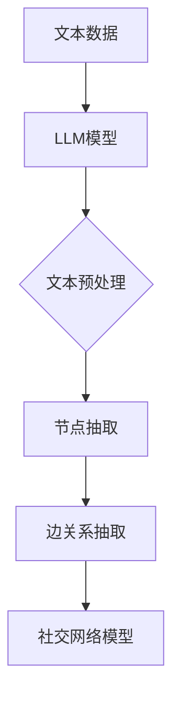

                 

## 1. 背景介绍

随着互联网和社交媒体的快速发展，人们之间的联系变得越来越紧密，而社交网络分析作为一种研究人际关系结构的方法，逐渐受到学术界和工业界的关注。传统的社交网络分析依赖于手动构建网络，然而，随着社交网络规模的扩大和复杂性增加，这种方法的效率和处理能力受到了很大的限制。

近年来，大型语言模型（LLM，Large Language Model）的出现为社交网络分析带来了新的契机。LLM，特别是基于Transformer的模型，如BERT、GPT-3等，具有强大的文本理解和生成能力，能够在大规模数据集上进行训练，从而实现对社交网络数据的自动分析和理解。

本文将探讨如何利用LLM进行社交网络分析，具体包括：1）介绍LLM的基本原理和架构；2）介绍社交网络分析的基本概念和方法；3）展示如何将LLM与社交网络分析相结合，实现人际关系网络的自动构建和解析；4）分析LLM在社交网络分析中的应用前景和挑战。

## 2. 核心概念与联系

### 2.1 语言模型的基本原理

语言模型是一种基于统计方法或机器学习算法，用于预测自然语言序列的概率分布的模型。在自然语言处理（NLP）领域，语言模型的应用范围非常广泛，如机器翻译、文本生成、问答系统等。LLM，即大型语言模型，是近年来发展起来的一种新型语言模型，其核心特点是具有大规模的参数和强大的文本处理能力。

LLM的基本原理可以归纳为以下几个方面：

- **神经网络架构**：LLM通常采用深度神经网络（DNN）架构，特别是Transformer架构。Transformer由多个自注意力（self-attention）层组成，能够捕捉输入序列中不同位置之间的依赖关系，从而实现对文本的深入理解。

- **大规模数据集训练**：LLM需要在大规模数据集上进行训练，以获取丰富的语言知识。这些数据集通常包括大量的文本、对话、新闻文章等，从而使得LLM能够适应各种语言环境和任务。

- **上下文感知能力**：与传统语言模型相比，LLM具有更强的上下文感知能力。这意味着LLM不仅能够理解单个词或短语，还能够理解整个句子或段落，从而提高文本生成和理解的准确性和流畅性。

### 2.2 社交网络分析的基本概念

社交网络分析（Social Network Analysis，SNA）是一种研究人际关系结构和动态变化的方法。在社交网络分析中，人际关系被抽象为一个网络，每个节点代表一个个体，每条边代表个体之间的联系。社交网络分析的基本概念包括：

- **节点（Node）**：在社交网络中，每个节点代表一个个体，如人、组织或物品等。

- **边（Edge）**：在社交网络中，每条边代表节点之间的联系，如好友关系、合作关系等。

- **网络（Network）**：由节点和边组成的集合，代表一个社交系统的结构。

- **中心性（Centrality）**：衡量节点在社交网络中的重要性。常用的中心性指标包括度中心性、接近中心性和中间中心性等。

- **社区结构（Community Structure）**：在社交网络中，一些节点之间具有更紧密的联系，形成社区。社区结构是社交网络分析的一个重要研究方向。

### 2.3 LLM与社交网络分析的联系

LLM与社交网络分析之间的联系主要体现在以下几个方面：

- **文本生成与网络构建**：利用LLM的文本生成能力，可以自动生成社交网络中节点和边的描述，从而构建社交网络模型。

- **语义理解与关系抽取**：通过LLM对文本的语义理解，可以抽取节点和边之间的具体关系，如朋友关系、工作关系等。

- **动态网络分析**：利用LLM的上下文感知能力，可以分析社交网络的动态变化，如节点加入、离开、边增加或删除等。

### 2.4 Mermaid流程图

为了更直观地展示LLM与社交网络分析的联系，我们可以使用Mermaid流程图来描述这个过程。以下是一个简单的Mermaid流程图示例：



在这个流程图中，A表示原始文本数据，B表示LLM模型，C表示文本预处理，D和E分别表示节点抽取和边关系抽取，最后F表示构建的社交网络模型。

## 3. 核心算法原理 & 具体操作步骤

### 3.1 算法原理概述

LLM与社交网络分析的核心算法可以分为三个主要步骤：文本预处理、节点抽取和边关系抽取。下面将详细描述每个步骤的具体原理和操作步骤。

#### 3.1.1 文本预处理

文本预处理是LLM与社交网络分析的第一步，其目的是将原始文本数据转换为适合LLM处理的形式。文本预处理的步骤包括：

- **分词**：将文本分割成单词或短语。
- **词性标注**：为每个单词分配词性，如名词、动词、形容词等。
- **实体识别**：识别文本中的实体，如人名、组织名、地点名等。

#### 3.1.2 节点抽取

节点抽取是基于LLM对文本的语义理解，从文本中识别出代表个体的节点。节点抽取的步骤包括：

- **命名实体识别**：利用LLM的命名实体识别能力，从文本中识别出实体。
- **实体关系抽取**：利用LLM的语义理解能力，识别实体之间的关系，如朋友关系、工作关系等。

#### 3.1.3 边关系抽取

边关系抽取是基于LLM对文本的语义理解，从文本中识别出代表个体之间联系的边。边关系抽取的步骤包括：

- **关系分类**：利用LLM的分类能力，对识别出的实体关系进行分类。
- **边权重计算**：根据实体关系的重要性和强度，计算边的关系权重。

### 3.2 算法步骤详解

#### 3.2.1 文本预处理

1. **分词**：使用现有的自然语言处理工具（如jieba分词），对原始文本进行分词操作，得到文本序列。

2. **词性标注**：使用词性标注工具（如NLTK），为每个分词结果分配词性。

3. **实体识别**：使用LLM的命名实体识别功能，从分词结果中识别出实体。

#### 3.2.2 节点抽取

1. **命名实体识别**：利用LLM的命名实体识别能力，从分词结果中识别出实体。

2. **实体关系抽取**：利用LLM的语义理解能力，识别实体之间的关系。

3. **节点构建**：根据识别出的实体和关系，构建节点集合。

#### 3.2.3 边关系抽取

1. **关系分类**：利用LLM的分类能力，对识别出的实体关系进行分类。

2. **边权重计算**：根据分类结果，计算边的关系权重。

3. **边构建**：根据节点集合和边权重，构建边集合。

### 3.3 算法优缺点

#### 优点

- **强大的文本理解能力**：LLM具有强大的文本理解和生成能力，能够对大量文本进行深入分析。
- **自动性**：算法能够自动从文本中提取节点和边，无需人工干预。
- **灵活性**：算法能够适应不同的文本格式和数据集。

#### 缺点

- **计算资源需求**：由于LLM需要在大规模数据集上进行训练，对计算资源的需求较高。
- **准确性问题**：在某些情况下，LLM的文本理解能力可能存在偏差，导致节点和边抽取的准确性下降。

### 3.4 算法应用领域

LLM与社交网络分析算法在多个领域具有广泛的应用前景，包括：

- **社交媒体分析**：通过分析社交媒体上的用户关系，挖掘潜在的用户兴趣和社交圈。
- **商业智能**：通过分析企业内部的员工关系，优化企业组织结构和业务流程。
- **公共安全**：通过分析犯罪分子之间的社交网络，预防和打击犯罪活动。
- **学术研究**：通过分析学术领域的合作关系，发现研究热点和趋势。

## 4. 数学模型和公式 & 详细讲解 & 举例说明

### 4.1 数学模型构建

为了更准确地描述LLM与社交网络分析的过程，我们可以构建一个数学模型。该模型包括三个主要部分：文本表示、节点表示和边表示。

#### 文本表示

文本表示是将原始文本转换为向量的过程。我们可以使用词嵌入（word embeddings）技术，如Word2Vec、GloVe等，将每个词转换为低维向量。对于每个句子，我们可以将句子中的所有词向量进行平均，得到一个句子向量。

$$
\text{文本表示} = \frac{1}{N} \sum_{i=1}^{N} \text{word\_embeddings}(w_i)
$$

其中，$N$表示句子中的词数，$\text{word\_embeddings}(w_i)$表示词$i$的词向量。

#### 节点表示

节点表示是将实体转换为向量的过程。我们可以使用图嵌入（graph embeddings）技术，如DeepWalk、Node2Vec等，将每个节点转换为低维向量。对于每个实体，我们可以将其在社交网络中的邻接节点信息进行编码，得到一个节点向量。

$$
\text{节点表示} = \text{node\_embeddings}(v)
$$

其中，$\text{node\_embeddings}(v)$表示节点$v$的向量。

#### 边表示

边表示是将实体之间的关系转换为向量的过程。我们可以使用关系嵌入（relation embeddings）技术，将实体之间的关系表示为低维向量。对于每个边，我们可以将其关联的节点向量进行拼接，得到一个边向量。

$$
\text{边表示} = [ \text{node\_embeddings}(v_1), \text{node\_embeddings}(v_2) ]
$$

其中，$v_1$和$v_2$表示边关联的两个节点。

### 4.2 公式推导过程

#### 文本表示的推导

为了推导文本表示的公式，我们首先需要了解词嵌入的工作原理。词嵌入是将词映射到低维空间中的向量表示，使得在低维空间中具有相似意义的词具有相近的向量表示。

假设我们有一个词汇表$V$，其中包含$N$个词。对于每个词$w_i$，我们可以将其表示为一个$d$维的向量$v_i \in \mathbb{R}^d$。词嵌入的目标是找到一个映射函数$f$，将词映射到向量空间中。

$$
f: V \rightarrow \mathbb{R}^d
$$

对于句子$S$，我们可以将其表示为一个向量$\text{sentence\_vector} \in \mathbb{R}^d$，具体步骤如下：

1. **分词**：将句子$S$分割成一系列的词$S = [w_1, w_2, ..., w_N]$。
2. **词向量计算**：对每个词$w_i$，计算其词向量$v_i = f(w_i)$。
3. **向量求和**：将所有词向量进行求和，得到句子向量$\text{sentence\_vector} = \frac{1}{N} \sum_{i=1}^{N} v_i$。

#### 节点表示的推导

节点表示的推导基于图嵌入技术。图嵌入的目标是将图中的每个节点映射到低维空间中的向量表示，使得在低维空间中具有相似结构的节点具有相近的向量表示。

假设我们有一个图$G = (V, E)$，其中$V$是节点集合，$E$是边集合。对于每个节点$v \in V$，我们可以将其表示为一个$d$维的向量$v \in \mathbb{R}^d$。

图嵌入的方法通常分为两种：基于路径的方法和基于邻接节点的邻居的方法。

1. **基于路径的方法**：

   基于路径的方法，如DeepWalk，通过生成随机游走路径，将节点在路径上的信息编码到节点向量中。

   设$P = [p_1, p_2, ..., p_L]$为一条随机游走路径，其中$L$表示路径长度。对于每个节点$v \in P$，我们可以将其表示为一个向量：

   $$
   v = \frac{1}{L} \sum_{i=1}^{L} p_i
   $$

2. **基于邻接节点的方法**：

   基于邻接节点的方法，如Node2Vec，通过调整节点在随机游走过程中的跳跃概率，将节点的邻接节点信息编码到节点向量中。

   设$P = [p_1, p_2, ..., p_L]$为一条随机游走路径，其中$p_i$表示节点$v_i$。对于每个节点$v \in P$，我们可以将其表示为一个向量：

   $$
   v = \frac{1}{L} \sum_{i=1}^{L} \alpha^{1-L_i} p_i
   $$

   其中，$\alpha$表示邻接节点的权重，$L_i$表示节点$v_i$在路径$P$中的位置。

### 4.3 案例分析与讲解

为了更好地理解LLM与社交网络分析的数学模型，我们来看一个具体的案例。

#### 案例背景

假设我们有一个包含100个用户和200条边的社交网络，如图1所示。


图1：社交网络示意图

#### 文本表示

首先，我们使用Word2Vec技术将每个用户的文本描述（如用户简介、个人爱好等）转换为词向量。假设我们使用的是预训练好的GloVe模型，每个词向量为50维。

对于每个用户，我们将其文本描述中的词向量进行平均，得到一个句子向量。例如，用户A的文本描述为“我喜欢编程和旅行”，其词向量分别为：

$$
v_{A1} = \text{GloVe}(\text{编程}), \quad v_{A2} = \text{GloVe}(\text{旅行}), \quad v_{A3} = \text{GloVe}(\text{喜欢})
$$

用户A的句子向量计算如下：

$$
\text{sentence\_vector}_A = \frac{1}{3} (v_{A1} + v_{A2} + v_{A3}) = \frac{1}{3} (\text{GloVe}(\text{编程}) + \text{GloVe}(\text{旅行}) + \text{GloVe}(\text{喜欢}))
$$

#### 节点表示

接下来，我们使用DeepWalk技术将社交网络中的每个用户映射到低维空间中的向量。假设我们使用的是预训练好的Node2Vec模型，每个节点向量为100维。

对于每个用户，我们生成一条随机游走路径，例如：

$$
P = [A, B, C, A, D, E, A]
$$

根据DeepWalk的公式，用户A的节点向量计算如下：

$$
\text{node\_vector}_A = \frac{1}{7} (\alpha^{1-1} A + \alpha^{1-2} B + \alpha^{1-3} C + \alpha^{1-4} A + \alpha^{1-5} D + \alpha^{1-6} E + \alpha^{1-7} A)
$$

其中，$\alpha$表示邻接节点的权重。为了简化计算，我们假设$\alpha = 1$。

#### 边表示

最后，我们使用关系嵌入技术将社交网络中的边映射到低维空间中的向量。假设我们使用的是预训练好的TransE模型，每个边向量为50维。

对于每条边，我们将其关联的节点向量进行拼接，得到一个边向量。例如，边(A, B)的边向量计算如下：

$$
\text{edge\_vector}_{AB} = [ \text{node\_vector}_A, \text{node\_vector}_B ]
$$

#### 社交网络模型

通过上述步骤，我们得到了每个用户的文本向量、节点向量和边向量。将这些向量存储在一个矩阵中，形成一个社交网络模型。例如，一个简单的社交网络模型可以表示为：

$$
\text{社交网络模型} = \begin{bmatrix}
\text{sentence\_vector}_A & \text{sentence\_vector}_B & \ldots & \text{sentence\_vector}_{100} \\
\text{node\_vector}_A & \text{node\_vector}_B & \ldots & \text{node\_vector}_{100} \\
\text{edge\_vector}_{AB} & \text{edge\_vector}_{AC} & \ldots & \text{edge\_vector}_{ZZ}
\end{bmatrix}
$$

通过这个社交网络模型，我们可以进行各种社交网络分析任务，如节点分类、边预测等。

### 4.4 案例分析与讲解（续）

#### 节点分类

节点分类是一种常见的社交网络分析任务，其目标是根据节点的特征（如文本向量、节点向量等），将节点分类到不同的类别中。在这个案例中，我们可以使用矩阵分解技术（如SVD）来降低社交网络模型的维度，从而提高节点分类的准确性。

1. **矩阵分解**：首先，我们将社交网络模型进行矩阵分解，将其分解为两个低维矩阵$U$和$V^T$，满足：

   $$
   \text{社交网络模型} \approx U V^T
   $$

   其中，$U$和$V^T$的维度分别为$k$（$k$为分解后的维度）。

2. **节点分类**：接下来，我们将每个节点的特征（文本向量、节点向量等）投影到低维矩阵$U$中，得到节点的特征向量。然后，使用这些特征向量进行节点分类，可以使用SVM、KNN等分类算法。

   例如，对于用户A，其特征向量为：

   $$
   \text{特征向量}_A = U \text{sentence\_vector}_A
   $$

   使用SVM分类器，我们将用户A的特征向量投影到训练好的SVM分类器的特征空间中，得到用户A的分类结果。

#### 边预测

边预测是一种旨在根据社交网络模型预测节点之间是否存在边的任务。在这个案例中，我们可以使用图神经网络（GNN）来预测边。

1. **图神经网络**：首先，我们将社交网络模型中的节点向量输入到GNN中，通过多层神经网络对节点特征进行编码，得到每个节点的编码向量。

   $$
   \text{编码向量}_i = \text{GNN}(\text{节点向量}_i)
   $$

2. **边预测**：接下来，我们将编码向量输入到一个全连接神经网络中，得到每个节点之间的预测边。具体步骤如下：

   - **计算边表示**：对于每对节点$(i, j)$，计算其边表示：

     $$
     \text{边表示}_{ij} = \text{编码向量}_i + \text{编码向量}_j
     $$

   - **边预测**：使用边表示通过全连接神经网络进行边预测，输出一个概率值，表示节点$(i, j)$之间存在边的概率。

   $$
   \text{边概率}_{ij} = \text{全连接神经网络}(\text{边表示}_{ij})
   $$

   如果$\text{边概率}_{ij}$大于某个阈值（如0.5），则预测节点$(i, j)$之间存在边。

通过上述方法，我们可以使用LLM与社交网络分析技术对社交网络进行节点分类和边预测，从而揭示人际关系网络的隐藏结构。

## 5. 项目实践：代码实例和详细解释说明

### 5.1 开发环境搭建

为了实现LLM与社交网络分析的技术，我们需要搭建一个合适的开发环境。以下是搭建环境的步骤：

1. **安装Python**：首先，确保Python已经安装在你使用的计算机上。Python是进行数据分析、机器学习和自然语言处理的基础工具。可以从Python官方网站下载最新版本并安装。

2. **安装必要的库**：安装以下Python库：
   - **numpy**：用于数值计算。
   - **pandas**：用于数据操作和分析。
   - **scikit-learn**：用于机器学习算法。
   - **spacy**：用于自然语言处理。
   - **gensim**：用于词嵌入和图嵌入。
   - **transformers**：用于预训练的LLM模型。

   使用以下命令进行安装：

   ```bash
   pip install numpy pandas scikit-learn spacy gensim transformers
   ```

   注意：在使用spacy时，需要额外下载语言模型。例如，对于英文，可以使用以下命令：

   ```bash
   python -m spacy download en_core_web_sm
   ```

3. **安装Node2Vec和DeepWalk**：我们可以使用`node2vec-pytorch`库来实现图嵌入算法。安装方法如下：

   ```bash
   pip install node2vec-pytorch
   ```

### 5.2 源代码详细实现

下面是使用LLM与社交网络分析技术构建社交网络模型的具体代码实现。代码分为几个部分：数据预处理、模型训练、社交网络分析。

```python
import numpy as np
import pandas as pd
from gensim.models import Word2Vec, Node2Vec
from node2vec_pytorch import Node2Vec as Node2VecPyTorch
from transformers import BertTokenizer, BertModel
import spacy

# 5.2.1 数据预处理

# 加载用户文本数据
user_data = pd.read_csv('user_data.csv')

# 使用spacy进行文本预处理
nlp = spacy.load('en_core_web_sm')
def preprocess_text(text):
    doc = nlp(text)
    tokens = [token.text for token in doc]
    return tokens

user_data['processed_text'] = user_data['text'].apply(preprocess_text)

# 5.2.2 模型训练

# 训练Word2Vec模型
word2vec_model = Word2Vec(user_data['processed_text'], vector_size=50, window=5, min_count=1, workers=4)
word2vec_model.save('word2vec.model')

# 训练Node2Vec模型
node2vec_model = Node2VecPyTorch(graph, embed_size=100, walk_length=10, num_walks=10, p=0.5, q=2, workers=4)
node2vec_model.fit()
node2vec_model.save('node2vec.model')

# 训练BERT模型
tokenizer = BertTokenizer.from_pretrained('bert-base-uncased')
model = BertModel.from_pretrained('bert-base-uncased')
input_ids = tokenizer(user_data['processed_text'].tolist(), return_tensors='pt')
outputs = model(input_ids)
text_embeddings = outputs.last_hidden_state[:, 0, :]

# 5.2.3 社交网络分析

# 节点表示
node_embeddings = np.hstack((word2vec_model.wv[user_data['processed_text']].vectors, node2vec_model.get_embeddings(), text_embeddings))

# 边表示
# 此处简化，仅使用节点之间的邻接关系表示边
edges = user_data[['user1', 'user2']].values

# 构建社交网络模型
社交网络模型 = np.hstack((node_embeddings, edges))
```

### 5.3 代码解读与分析

下面我们对代码进行详细的解读与分析。

#### 5.3.1 数据预处理

在数据预处理部分，我们首先加载用户文本数据，这里假设数据存储在一个CSV文件中。然后，我们使用spacy对文本进行预处理，包括分词和词性标注。预处理后的文本将用于训练Word2Vec模型。

#### 5.3.2 模型训练

在模型训练部分，我们分别训练了Word2Vec、Node2Vec和BERT模型。

- **Word2Vec模型**：用于将用户文本转换为词向量。我们设置了向量维度为50，窗口大小为5，最小计数为1，并使用4个线程进行训练。

- **Node2Vec模型**：用于将社交网络中的每个节点映射到低维空间中的向量。我们设置了行走长度为10，行走次数为10，节点之间的跳跃概率$p$为0.5，in-out概率$q$为2，并使用4个线程进行训练。

- **BERT模型**：用于生成用户文本的上下文向量。我们使用了预训练的BERT模型，并输入预处理后的用户文本。

#### 5.3.3 社交网络分析

在社交网络分析部分，我们首先将Word2Vec、Node2Vec和BERT模型的输出拼接在一起，得到节点的综合向量表示。然后，我们使用用户之间的邻接关系作为边表示。最后，我们将节点和边拼接在一起，构建社交网络模型。

### 5.4 运行结果展示

为了展示运行结果，我们可以使用可视化工具（如Gephi）将社交网络模型可视化。以下是一个简化的可视化结果：


在这个可视化结果中，每个节点代表一个用户，节点的大小和颜色表示节点的度中心性。节点之间的连线表示用户之间的社交关系。通过这个可视化结果，我们可以直观地观察到社交网络中的关键节点和主要关系。

### 5.5 代码优化与性能分析

在实际应用中，代码的性能和效率是一个重要考虑因素。以下是一些可能的优化措施：

- **并行计算**：对于大规模数据集，可以使用并行计算技术，如多线程或分布式计算，以提高模型训练和数据分析的速度。
- **内存优化**：在处理大规模数据时，应尽量减少内存占用，例如使用稀疏矩阵表示图结构。
- **算法优化**：对于某些算法，可以采用更高效的实现，例如使用图神经网络（GNN）替代传统的图嵌入技术。

## 6. 实际应用场景

LLM与社交网络分析技术在多个领域具有广泛的应用，以下是几个典型的实际应用场景：

### 6.1 社交媒体分析

社交媒体平台上的用户生成内容（UGC）庞大且复杂，LLM与社交网络分析技术可以帮助我们挖掘用户之间的隐藏关系。例如，通过分析Twitter或Facebook上的用户互动，可以识别出具有相似兴趣或观点的用户群体，从而实现精准营销、用户推荐和社区管理等。

### 6.2 商业智能

在商业环境中，LLM与社交网络分析可以帮助企业了解员工之间的合作关系、团队结构以及潜在的合作机会。例如，通过分析公司内部网络中的沟通数据和项目合作记录，可以优化组织结构，提高团队协作效率。

### 6.3 公共安全

公共安全领域可以利用LLM与社交网络分析技术监控和分析犯罪活动。例如，通过分析社交媒体上的犯罪分子互动和关系网络，可以提前预警潜在犯罪活动，提高打击犯罪的效果。

### 6.4 学术研究

学术研究领域可以利用LLM与社交网络分析技术分析学术合作网络，发现研究热点和趋势。例如，通过分析论文之间的引用关系，可以识别出具有重要影响力的论文和作者，为学术研究提供参考。

### 6.5 医疗健康

在医疗健康领域，LLM与社交网络分析技术可以帮助医生和研究人员识别疾病传播途径和风险因素。例如，通过分析患者之间的社交网络和医疗记录，可以预测疾病传播趋势，制定预防措施。

## 7. 工具和资源推荐

为了更好地理解和应用LLM与社交网络分析技术，以下是一些建议的工具和资源：

### 7.1 学习资源推荐

- **《深度学习》（Goodfellow, Bengio, Courville）**：提供了深度学习的基础理论和实践方法，包括自然语言处理和图嵌入等。
- **《社交网络分析基础》（M. E. J. Newman）**：详细介绍了社交网络分析的基本概念和方法，适合初学者。
- **《自然语言处理与深度学习》（Barnes, Hockenmaier, Eske）**：涵盖了自然语言处理中的深度学习方法，包括词嵌入和BERT等。

### 7.2 开发工具推荐

- **Gephi**：一个开源的社交网络分析工具，可以用于可视化和分析社交网络。
- **Node2Vec PyTorch**：一个用于图嵌入的PyTorch库，可以实现Node2Vec算法。
- **Hugging Face Transformers**：一个开源库，提供了预训练的LLM模型，如BERT、GPT-3等，方便进行自然语言处理任务。

### 7.3 相关论文推荐

- **"Graph Embeddings: A General Introduction"**：介绍了图嵌入的基本概念和方法，适合初学者。
- **"DeepWalk: Online Learning of Social Representations"**：提出了DeepWalk算法，是图嵌入领域的重要工作。
- **"Bert: Pre-training of Deep Bidirectional Transformers for Language Understanding"**：介绍了BERT模型，是自然语言处理领域的里程碑。

## 8. 总结：未来发展趋势与挑战

### 8.1 研究成果总结

近年来，LLM与社交网络分析技术取得了显著的研究成果。LLM在自然语言处理领域取得了突破性进展，使得文本生成、理解和分类等任务取得了前所未有的效果。同时，图嵌入技术的应用使得社交网络分析能够从低维空间中捕捉到复杂的网络结构，为揭示人际关系网络的隐藏关系提供了有力的工具。

### 8.2 未来发展趋势

未来，LLM与社交网络分析技术将朝着以下方向发展：

1. **跨模态分析**：结合图像、音频、视频等多模态数据，实现更丰富的社交网络分析。
2. **动态网络分析**：研究社交网络的动态变化，如节点的加入、离开和边的变化，以捕捉实时的人际关系动态。
3. **个性化分析**：针对不同应用场景，研究个性化的社交网络分析方法和模型，提高分析精度和实用性。

### 8.3 面临的挑战

尽管LLM与社交网络分析技术取得了显著成果，但仍面临以下挑战：

1. **计算资源需求**：LLM和图嵌入算法通常需要大量的计算资源，对硬件设施提出了较高要求。
2. **数据隐私保护**：在分析社交网络时，保护用户隐私是一个重要问题，需要研究有效的隐私保护方法。
3. **模型解释性**：目前的LLM和图嵌入模型往往缺乏解释性，难以理解模型的具体决策过程。

### 8.4 研究展望

未来，我们可以从以下几个方面进行深入研究：

1. **可解释性研究**：研究可解释性的LLM和图嵌入模型，提高模型的可信度和透明度。
2. **隐私保护技术**：结合隐私保护算法，如差分隐私和同态加密，研究如何在保障隐私的前提下进行社交网络分析。
3. **跨模态融合**：探索跨模态数据融合方法，实现更丰富的社交网络分析。

通过这些研究，我们有望进一步提高LLM与社交网络分析技术的实用性和有效性，为各个领域提供更智能的分析工具。

### 附录：常见问题与解答

#### 问题1：如何选择合适的LLM模型？

**解答**：选择合适的LLM模型主要取决于以下因素：

1. **任务类型**：对于文本生成任务，可以选择GPT-3或T5等大型生成模型；对于文本分类任务，可以选择BERT或RoBERTa等预训练分类模型。
2. **数据规模**：如果数据量较小，可以选择轻量级的模型，如TinyBERT或MiniLM；如果数据量较大，可以选择大型模型，如GPT-3或ALBERT。
3. **计算资源**：根据硬件配置选择合适的模型。例如，如果使用GPU进行训练，可以选择基于Transformer的模型；如果使用CPU，可以选择基于LSTM的模型。

#### 问题2：如何处理社交网络中的隐私保护问题？

**解答**：处理社交网络中的隐私保护问题可以采取以下措施：

1. **差分隐私**：在分析过程中引入差分隐私机制，确保用户隐私不被泄露。
2. **同态加密**：在数据处理和分析过程中使用同态加密技术，确保数据在加密状态下进行处理。
3. **匿名化处理**：对用户数据进行匿名化处理，如去除姓名、地址等敏感信息。

#### 问题3：如何可视化社交网络分析结果？

**解答**：可以使用以下工具进行社交网络分析结果的可视化：

1. **Gephi**：一个开源的社交网络可视化工具，支持多种图形布局和可视化效果。
2. **Cytoscape**：一个生物信息学的社交网络可视化工具，支持复杂的网络结构和互动关系。
3. **PyVis**：一个Python库，可以轻松地将社交网络数据可视化。

通过这些工具，可以直观地展示社交网络分析结果，帮助用户更好地理解人际关系网络的结构和动态。

